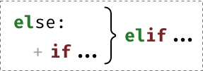
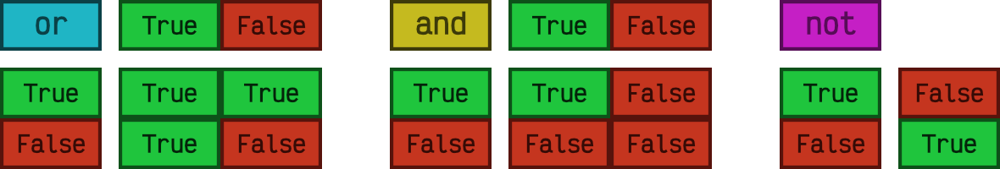

#############
Condicionales
#############

.. image:: img/ali-nafezarefi-62H_swdrc4A-unsplash.jpg

En esta sección veremos las sentencias ``if`` y ``match-case`` junto a las distintas variantes que pueden asumir, pero antes de eso introduciremos algunas cuestiones generales de *escritura de código*. [#fork-unsplash]_

*********************
Definición de bloques
*********************

A diferencia de otros lenguajes que utilizan llaves para definir los bloques de código, cuando Guido Van Rossum :ref:`creó el lenguaje <core/introduction/python:Python>` quiso evitar estos caracteres por considerarlos innecesarios. Es por ello que en Python los bloques de código se definen a través de **espacios en blanco, preferiblemente 4**. [#pep8]_ En términos técnicos se habla del **tamaño de indentación**.

.. figure:: img/four-spaces.png
    :align: center

    Python recomienda 4 espacios en blanco para indentar

.. hint:: Esto puede resultar extraño e incómodo a personas que vienen de otros lenguajes de programación pero desaparece rápido y se siente natural a medida que se escribe código.

***********
Comentarios
***********

Los comentarios son anotaciones que podemos incluir en nuestro programa y que nos permiten aclarar ciertos aspectos del código. Estas indicaciones son ignoradas por el intérprete de Python.

Los comentarios se incluyen usando el símbolo almohadilla ``#`` y comprenden hasta el final de la línea.

.. code-block::
    :caption: Comentario en bloque

    # Universe age expressed in days
    universe_age = 13800 * (10 ** 6) * 365

Los comentarios también pueden aparecer en la misma línea de código, aunque `la guía de estilo de Python <https://www.python.org/dev/peps/pep-0008/#inline-comments>`__ no aconseja usarlos en demasía:

.. code-block::
    :caption: Comentario en línea

    stock = 0   # Release additional articles

Reglas para escribir buenos comentarios: [#good-comments]_

1. Los comentarios no deberían duplicar el código.
2. Los buenos comentarios no arreglan un código poco claro.
3. Si no puedes escribir un comentario claro, puede haber un problema en el código.
4. Los comentarios deberían evitar la confusión, no crearla.
5. Usa comentarios para explicar código no idiomático.
6. Proporciona enlaces a la fuente original del código copiado.
7. Incluye enlaces a referencias externas que sean de ayuda.
8. Añade comentarios cuando arregles errores.
9. Usa comentarios para destacar implementaciones incompletas.

****************
Ancho del código
****************

Los programas suelen ser más legibles cuando las líneas no son excesivamente largas. La longitud máxima de línea recomendada por `la guía de estilo de Python <https://www.python.org/dev/peps/pep-0008/#maximum-line-length>`__ es de **80 caracteres**.

Sin embargo, esto genera una cierta polémica hoy en día, ya que los tamaños de pantalla han aumentado y las resoluciones son mucho mayores que hace años. Así las líneas de más de 80 caracteres se siguen visualizando correctamente. Hay personas que son más estrictas en este límite y otras más flexibles.

En caso de que queramos **romper una línea de código** demasiado larga, tenemos dos opciones:

1. Usar la *barra invertida* ``\``::

    >>> factorial = 4 * 3 * 2 * 1

    >>> factorial = 4 * \
    ...             3 * \
    ...             2 * \
    ...             1

2. Usar los *paréntesis* ``(...)``::

    >>> factorial = 4 * 3 * 2 * 1

    >>> factorial = (4 *
    ...              3 *
    ...              2 *
    ...              1)

.. _if-sentence:

*******************
La sentencia ``if``
*******************

La sentencia condicional en Python (al igual que en muchos otros lenguajes de programación) es ``if``. En su escritura debemos añadir una **expresión de comparación** terminando con dos puntos al final de la línea. Veamos un ejemplo::

    >>> temperature = 40

    >>> if temperature > 35:
    ...     print('Aviso por alta temperatura')
    ...
    Aviso por alta temperatura

.. note:: Nótese que en Python no es necesario incluir paréntesis ``(`` y ``)`` al escribir condiciones. Hay veces que es recomendable por claridad o por establecer prioridades.

En el caso anterior se puede ver claramente que la condición se cumple y por tanto se ejecuta la instrucción que tenemos dentro del cuerpo de la condición. Pero podría no ser así. Para controlar ese caso existe la sentencia ``else``. Veamos el mismo ejemplo anterior pero añadiendo esta variante::

    >>> temperature = 20

    >>> if temperature > 35:
    ...     print('Aviso por alta temperatura')
    ... else:
    ...     print('Parámetros normales')
    ...
    Parámetros normales    

Podríamos tener incluso condiciones dentro de condiciones, lo que se viene a llamar técnicamente **condiciones anidadas** [#nesting]_. Veamos un ejemplo ampliando el caso anterior::

    >>> temperature = 28

    >>> if temperature < 20:
    ...     if temperature < 10:
    ...         print('Nivel azul')
    ...     else:
    ...         print('Nivel verde')
    ... else:
    ...     if temperature < 30:
    ...         print('Nivel naranja')
    ...     else:
    ...         print('Nivel rojo')
    ...
    Nivel naranja

Python nos ofrece una mejora en la escritura de condiciones anidadas cuando aparecen consecutivamente un ``else`` y un ``if``. Podemos sustituirlos por la sentencia ``elif``:

    Construcción de la sentencia ``elif``

Apliquemos esta mejora al código del ejemplo anterior:

.. code-block::
    :emphasize-lines: 8

    >>> temperature = 28

    >>> if temperature < 20:
    ...     if temperature < 10:
    ...         print('Nivel azul')
    ...     else:
    ...         print('Nivel verde')
    ... elif temperature < 30:
    ...     print('Nivel naranja')
    ... else:
    ...     print('Nivel rojo')
    ...
    Nivel naranja

Ejecución **paso a paso** a través de *Python Tutor*:

.. only:: latex

    https://cutt.ly/wd58B4t

.. only:: html

    .. raw:: html

        <iframe width="800" height="495" frameborder="0" src="https://pythontutor.com/iframe-embed.html#code=temperature%20%3D%2028%0A%0Aif%20temperature%20%3C%2020%3A%0A%20%20%20%20if%20temperature%20%3C%2010%3A%0A%20%20%20%20%20%20%20%20print%28'Nivel%20azul'%29%0A%20%20%20%20else%3A%0A%20%20%20%20%20%20%20%20print%28'Nivel%20verde'%29%0Aelif%20temperature%20%3C%2030%3A%0A%20%20%20%20print%28'Nivel%20naranja'%29%0Aelse%3A%0A%20%20%20%20print%28'Nivel%20rojo'%29&codeDivHeight=400&codeDivWidth=350&cumulative=false&curInstr=0&heapPrimitives=nevernest&origin=opt-frontend.js&py=3&rawInputLstJSON=%5B%5D&textReferences=false"> </iframe>

**************************
Asignaciones condicionales
**************************

|intlev|

Supongamos que queremos asignar un nivel de riesgo de incendio en función de la temperatura. En su **versión clásica** escribiríamos::

    >>> temperature = 35

    >>> if temperature < 30:
    ...     fire_risk = 'LOW'
    ... else:
    ...     fire_risk = 'HIGH'
    ...

    >>> fire_risk
    'HIGH'

Sin embargo, esto lo podríamos abreviar con una **asignación condicional de una única línea**:

.. code-block::
    :emphasize-lines: 1

    >>> fire_risk = 'LOW' if temperature < 30 else 'HIGH'

    >>> fire_risk
    'HIGH'

*************************
Operadores de comparación
*************************

Cuando escribimos condiciones debemos incluir alguna expresión de comparación. Para usar estas expresiones es fundamental conocer los operadores que nos ofrece Python:

+-------------------+---------+
|     Operador      | Símbolo |
+===================+=========+
| Igualdad          | ``==``  |
+-------------------+---------+
| Desigualdad       | ``!=``  |
+-------------------+---------+
| Menor que         | ``<``   |
+-------------------+---------+
| Menor o igual que | ``<=``  |
+-------------------+---------+
| Mayor que         | ``>``   |
+-------------------+---------+
| Mayor o igual que | ``>=``  |
+-------------------+---------+

A continuación vamos a ver una serie de ejemplos con expresiones de comparación. Téngase en cuenta que estas expresiones habría que incluirlas dentro de la sentencia condicional en el caso de que quisiéramos tomar una acción concreta::

    # Asignación de valor inicial
    >>> value = 8

    >>> value == 8
    True

    >>> value != 8
    False

    >>> value < 12
    True

    >>> value <= 7 
    False

    >>> value > 4
    True

    >>> value >= 9
    False

******************
Operadores lógicos
******************

Podemos escribir condiciones más complejas usando los **operadores lógicos**:
    - ``and``
    - ``or``
    - ``not``

.. code-block::

    # Asignación de valor inicial
    >>> x = 8

    >>> x > 4 or x > 12  # True or False
    True

    >>> x < 4 or x > 12  # False or False
    False

    >>> x > 4 and x > 12  # True and False
    False

    >>> x > 4 and x < 12  # True and True
    True

    >>> not(x != 8)  # not False
    True

Véanse las **tablas de la verdad** para cada operador lógico:

    Resultados al aplicar operadores lógicos

Python ofrece la posibilidad de ver si un valor está entre dos límites de manera directa. Así, por ejemplo, para descubrir si ``value`` está entre *4* y *12* haríamos::

    >>> 4 <= value <= 12
    True

.. note::
    1. Una expresión de comparación siempre devuelve un valor *booleano*, es decir ``True`` o ``False``.
    2. El uso de paréntesis, en función del caso, puede aclarar la expresión de comparación.

.. admonition:: Ejercicio
    :class: exercise

    Dada una variable ``year`` con un valor entero, compruebe si dicho año es **bisiesto** o no lo es.

    ℹ️ Un año es bisiesto en el calendario Gregoriano, si es divisible entre 4 y no divisible entre 100, o bien si es divisible entre 400. Puedes hacer la comprobación en `esta lista de años bisiestos <https://es.wikipedia.org/wiki/Anexo:A%C3%B1os_bisiestos_en_los_siglos_XX,_XXI_y_XXII>`_.

    **Ejemplo**
        * Entrada: ``2008``
        * Salida: ``Es un año bisiesto``
    
    .. only:: html
    
        |solution| :download:`leap_year.py <files/leap_year.py>`

"Booleanos" en condiciones
==========================

Cuando queremos preguntar por la **veracidad** de una determinada variable "booleana" en una condición, la primera aproximación que parece razonable es la siguiente:

.. code-block::
    :emphasize-lines: 3

    >>> is_cold = True

    >>> if is_cold == True:
    ...     print('Coge chaqueta')
    ... else:
    ...     print('Usa camiseta')
    ...
    Coge chaqueta

Pero podemos *simplificar* esta condición tal que así:

.. code-block::
    :emphasize-lines: 1

    >>> if is_cold:
    ...     print('Coge chaqueta')
    ... else:
    ...     print('Usa camiseta')
    ...
    Coge chaqueta

Hemos visto una comparación para un valor "booleano" verdadero (``True``). En el caso de que la comparación fuera para un valor falso lo haríamos así:

.. code-block::
    :emphasize-lines: 4

    >>> is_cold = False

    >>> if not is_cold:  # Equivalente a if is_cold == False
    ...     print('Usa camiseta')
    ... else:
    ...     print('Coge chaqueta')
    ...
    Usa camiseta

De hecho, si lo pensamos, estamos reproduciendo bastante bien el *lenguaje natural*:

* Si hace frío, coge chaqueta.
* Si no hace frío, usa camiseta. 

.. admonition:: Ejercicio
    :class: exercise

    Escriba un programa que permita adivinar un personaje de `Marvel`_ en base a las tres preguntas siguientes:

    1. ¿Puede volar?
    2. ¿Es humano?
    3. ¿Tiene máscara?

    .. image:: img/marvel-flowchart.png

    **Ejemplo**
        * Entrada: ``can_fly = True``, ``is_human = True`` y ``has_mask = True``
        * Salida: ``Ironman``
    
    Es una especie de `Akinator`_ para personajes de Marvel...
       
    .. only:: html
    
        |solution| :download:`marvel.py <files/marvel.py>`

Valor nulo
==========

|intlev|

``None`` es un valor especial de Python que almacena el **valor nulo** [#none]_. Veamos cómo se comporta al incorporarlo en condiciones de veracidad::

    >>> value = None

    >>> if value:
    ...     print('Value has some useful value')
    ... else:
    ...     # value podría contener None, False (u otro)
    ...     print('Value seems to be void')
    ...
    Value seems to be void

Para distinguir ``None`` de los valores propiamente booleanos, se recomienda el uso del operador ``is``. Veamos un ejemplo en el que tratamos de averiguar si un valor **es nulo**:

.. code-block::
    :emphasize-lines: 3

    >>> value = None

    >>> if value is None:
    ...     print('Value is clearly None')
    ... else:
    ...     # value podría contener True, False (u otro)
    ...     print('Value has some useful value')
    ...
    Value is clearly void

De igual forma, podemos usar esta construcción para el caso contrario. La forma "pitónica" de preguntar si algo **no es nulo** es la siguiente:

.. code-block::
    :emphasize-lines: 3

    >>> value = 99

    >>> if value is not None:
    ...     print(f'{value=}')
    ...
    value=99

************************
Sentencia ``match-case``
************************

Una de las novedades más esperadas (y quizás controvertidas) de Python 3.10 fue el llamado `Structural Pattern Matching`_ que introdujo en el lenguaje una nueva sentencia condicional. Ésta se podría asemejar a la sentencia "switch" que ya existe en otros lenguajes de programación.

Comparando valores
==================

En su versión más simple, el "pattern matching" permite comparar un valor de entrada con una serie de literales. Algo así como un conjunto de sentencias "if" encadenadas. Veamos esta aproximación mediante un ejemplo::

    >>> color = '#FF0000'

    >>> match color:
    ...     case '#FF0000':
    ...         print('🔴')
    ...     case '#00FF00':
    ...         print('🟢')
    ...     case '#0000FF':
    ...         print('🔵')
    ...
    🔴 

¿Qué ocurre si el valor que comparamos no existe entre las opciones disponibles? Pues en principio, nada, ya que este caso no está cubierto. Si lo queremos controlar, hay que añadir una nueva regla utilizando el subguión ``_`` como patrón::

    >>> color = '#AF549B'

    >>> match color:
    ...     case '#FF0000':
    ...         print('🔴')
    ...     case '#00FF00':
    ...         print('🟢')
    ...     case '#0000FF':
    ...         print('🔵')
    ...     case _:
    ...         print('Unknown color!')
    ...
    Unknown color!

.. admonition:: Ejercicio
    :class: exercise

    Escriba un programa en Python que pida (por separado) dos valores numéricos y un operando (suma, resta, multiplicación, división) y calcule el resultado de la operación, usando para ello la sentencia ``match-case``.

    Controlar que la operación no sea una de las cuatro predefinidas. En este caso dar un mensaje de error y no mostrar resultado final.

    **Ejemplo**
    
    * Entrada: ``4``, ``3``, ``+``
    * Salida: ``4+3=7``

    .. only:: html
    
        |solution| :download:`calculator.py <files/calculator.py>`

Patrones avanzados
==================

|advlev|

La sentencia ``match-case`` va mucho más allá de una simple comparación de valores. Con ella podremos deconstruir estructuras de datos, capturar elementos o mapear valores.

Para ejemplificar varias de sus funcionalidades, vamos a partir de una :ref:`tupla <core/datastructures/tuples:Tuplas>` que representará un punto en el plano (2 coordenadas) o en el espacio (3 coordenadas). Lo primero que vamos a hacer es detectar en qué dimensión se encuentra el punto::

    >>> point = (2, 5)

    >>> match point:
    ...     case (x, y):
    ...         print(f'({x},{y}) is in plane')
    ...     case (x, y, z):
    ...         print(f'({x},{y},{z}) is in space')
    ...
    (2,5) is in plane

    >>> point = (3, 1, 7)

    >>> match point:
    ...     case (x, y):
    ...         print(f'({x},{y}) is in plane')
    ...     case (x, y, z):
    ...         print(f'({x},{y},{z}) is in space')
    ...
    (3,1,7) is in space

En cualquier caso, esta aproximación permitiría un punto formado por "strings"::

    >>> point = ('2', '5')

    >>> match point:
    ...     case (x, y):
    ...         print(f'({x},{y}) is in plane')
    ...     case (x, y, z):
    ...         print(f'({x},{y},{z}) is in space')
    ...
    (2,5) is in plane

Por lo tanto, en un siguiente paso, podemos restringir nuestros patrones a valores enteros::

    >>> point = ('2', '5')

    >>> match point:
    ...     case (int(), int()):
    ...         print(f'{point} is in plane')
    ...     case (int(), int(), int()):
    ...         print(f'{point} is in space')
    ...     case _:
    ...         print('Unknown!')
    ...
    Unknown!

    >>> point = (3, 9, 1)

    >>> match point:
    ...     case (int(), int()):
    ...         print(f'{point} is in plane')
    ...     case (int(), int(), int()):
    ...         print(f'{point} is in space')
    ...     case _:
    ...         print('Unknown!')
    ...
    (3, 9, 1) is in space

Imaginemos ahora que nos piden calcular la distancia del punto al origen. Debemos tener en cuenta que, a priori, desconocemos si el punto está en el plano o en el espacio::

    >>> point = (8, 3, 5)

    >>> match point:
    ...     case (int(x), int(y)):
    ...         dist_to_origin = (x ** 2 + y ** 2) ** (1 / 2)
    ...     case (int(x), int(y), int(z)):
    ...         dist_to_origin = (x ** 2 + y ** 2 + z ** 2) ** (1 / 2)
    ...     case _:
    ...         print('Unknown!')
    ...

    >>> dist_to_origin
    9.899494936611665

Con este enfoque, nos aseguramos que los puntos de entrada deben tener todas sus coordenadas como valores enteros::

    >>> point = ('8', 3, 5)  # Nótese el 8 como "string"

    >>> match point:
    ...     case (int(x), int(y)):
    ...         dist_to_origin = (x ** 2 + y ** 2) ** (1 / 2)
    ...     case (int(x), int(y), int(z)):
    ...         dist_to_origin = (x ** 2 + y ** 2 + z ** 2) ** (1 / 2)
    ...     case _:
    ...         print('Unknown!')
    ...
    Unknown!

Cambiando de ejemplo, veamos un fragmento de código en el que tenemos que **comprobar la estructura de un bloque de autenticación** definido mediante un :ref:`diccionario <core/datastructures/dicts:Diccionarios>`. Los métodos válidos de autenticación son únicamente dos: bien usando nombre de usuario y contraseña, o bien usando correo electrónico y "token" de acceso. Además, los valores deben venir en formato cadena de texto:

.. code-block::
    :linenos:

    >>> # Lista de diccionarios
    >>> auths = [
    ...     {'username': 'sdelquin', 'password': '1234'},
    ...     {'email': 'sdelquin@gmail.com', 'token': '4321'},
    ...     {'email': 'test@test.com', 'password': 'ABCD'},
    ...     {'username': 'sdelquin', 'password': 1234}
    ... ]

    >>> for auth in auths:
    ...     print(auth)
    ...     match auth:
    ...         case {'username': str(username), 'password': str(password)}:
    ...             print('Authenticating with username and password')
    ...             print(f'{username}: {password}')
    ...         case {'email': str(email), 'token': str(token)}:
    ...             print('Authenticating with email and token')
    ...             print(f'{email}: {token}')
    ...         case _:
    ...             print('Authenticating method not valid!')
    ...     print('---')
    ...
    {'username': 'sdelquin', 'password': '1234'}
    Authenticating with username and password
    sdelquin: 1234
    ---
    {'email': 'sdelquin@gmail.com', 'token': '4321'}
    Authenticating with email and token
    sdelquin@gmail.com: 4321
    ---
    {'email': 'test@test.com', 'password': 'ABCD'}
    Authenticating method not valid!
    ---
    {'username': 'sdelquin', 'password': 1234}
    Authenticating method not valid!
    ---

Cambiando de ejemplo, a continuación veremos un código que nos indica si, dada la edad de una persona, puede beber alcohol:

.. code-block::
    :emphasize-lines: 4, 6, 8
    :linenos:

    >>> age = 21

    >>> match age:
    ...     case 0 | None:
    ...         print('Not a person')
    ...     case n if n < 17:
    ...         print('Nope')
    ...     case n if n < 22:
    ...         print('Not in the US')
    ...     case _:
    ...         print('Yes')
    ...
    Not in the US
    
- En la **línea 4** podemos observar el uso del operador **OR**.
- En las **líneas 6 y 8** podemos observar el uso de condiciones dando lugar a **cláusulas guarda**.

**************
Operador morsa
**************

|advlev|

A partir de Python 3.8 se incorpora el `operador morsa`_ [#walrus-operator]_ que permite unificar **sentencias de asignación dentro de expresiones**. Su nombre proviene de la forma que adquiere ``:=``

Supongamos un ejemplo en el que computamos el perímetro de una circunferencia, indicando al usuario que debe incrementarlo siempre y cuando no llegue a un mínimo establecido.

**Versión tradicional**

.. code-block::

    >>> radius = 4.25
    ... perimeter = 2 * 3.14 * radius
    ... if perimeter < 100:
    ...     print('Increase radius to reach minimum perimeter')
    ...     print('Actual perimeter: ', perimeter)
    ...
    Increase radius to reach minimum perimeter
    Actual perimeter:  26.69

**Versión con operador morsa**

.. code-block::
    :emphasize-lines: 2

    >>> radius = 4.25
    ... if (perimeter := 2 * 3.14 * radius) < 100:
    ...     print('Increase radius to reach minimum perimeter')
    ...     print('Actual perimeter: ', perimeter)
    ...
    Increase radius to reach minimum perimeter
    Actual perimeter:  26.69

.. hint:: Como hemos comprobado, el operador morsa permite realizar asignaciones dentro de expresiones, lo que, en muchas ocasiones, permite obtener un código más compacto. Sería conveniente encontrar un equilibrio entre la expresividad y la legibilidad.

----

.. rubric:: EJERCICIOS DE REPASO

1. Escriba un programa en Python que acepte la opción de dos jugadoras en `Piedra-Papel-Tijera`_ y decida el resultado (:download:`solución <files/pss.py>`).
    - Entrada: ``person1=piedra; person2=papel``
    - Salida: ``Gana persona2: El papel envuelve a la piedra``

2. Escriba un programa en Python que acepte 3 números y calcule el mínimo (:download:`solución <files/min_values.py>`).
    - Entrada: ``7, 4, 9``
    - Salida: ``4``

3. Escriba un programa en Python que acepte un país (como "string") y muestre por pantalla su bandera (como "emoji"). *Puede restringirlo a un conjunto limitado de países* (:download:`solución <files/countries.py>`).
    - Entrada: ``Italia``
    - Salida: 🇮🇹

4. Escriba un programa en Python que acepte 3 códigos de teclas y muestre por pantalla `la acción que se lleva a cabo en sistemas Ubuntu Linux`_ (:download:`solución <files/shortcuts.py>`).
    - Entrada: ``tecla1=Ctrl; tecla2=Alt; tecla3=Del;``
    - Salida: ``Log out``

5. Escriba un programa en Python que acepte edad, peso, pulso y plaquetas, y determine si una persona cumple con `estos requisitos <http://www3.gobiernodecanarias.org/sanidad/ichh/donantes/requisitos.asp>`_ para donar sangre.
    - Entrada: ``edad=34; peso=81; heartbeat=70; plaquetas=150000``
    - Salida: ``Apto para donar sangre``

6. ``pycheck boot red_square``

.. rubric:: EJERCICIOS EXTERNOS

1. `Return the day <https://www.codewars.com/kata/59dd3ccdded72fc78b000b25>`_
2. `Return negative <https://www.codewars.com/kata/55685cd7ad70877c23000102>`_
3. `What's the real floor? <https://www.codewars.com/kata/574b3b1599d8f897470018f6>`_
4. `Area or Perimeter <https://www.codewars.com/kata/5ab6538b379d20ad880000ab>`_
5. `Check same case <https://www.codewars.com/kata/5dd462a573ee6d0014ce715b>`_
6. `Simple multiplication <https://www.codewars.com/kata/583710ccaa6717322c000105>`_
7. `Quarter of the year <https://www.codewars.com/kata/5ce9c1000bab0b001134f5af>`_
8. `Grade book <https://www.codewars.com/kata/55cbd4ba903825f7970000f5>`_
9. `Transportation on vacation <https://www.codewars.com/kata/568d0dd208ee69389d000016>`_
10. `Safen User Input Part I - htmlspecialchars <https://www.codewars.com/kata/56bcaedfcf6b7f2125001118>`_
11. `Remove an exclamation mark from the end of string <https://www.codewars.com/kata/57fae964d80daa229d000126>`_
12. `Pythagorean triple <https://www.codewars.com/kata/5951d30ce99cf2467e000013>`_
13. `How much water do I need? <https://www.codewars.com/kata/575fa9afee048b293e000287>`_
14. `Set Alarm <https://www.codewars.com/kata/568dcc3c7f12767a62000038>`_
15. `Compare within margin <https://www.codewars.com/kata/56453a12fcee9a6c4700009c>`_
16. `Will you make it? <https://www.codewars.com/kata/5861d28f124b35723e00005e>`_
17. `Plural <https://www.codewars.com/kata/52ceafd1f235ce81aa00073a>`_
18. `Student's final grade <https://www.codewars.com/kata/5ad0d8356165e63c140014d4>`_
19. `Drink about <https://www.codewars.com/kata/56170e844da7c6f647000063>`_
20. `Switch it up! <https://www.codewars.com/kata/5808dcb8f0ed42ae34000031>`_
21. `Floating point comparison <https://www.codewars.com/kata/5f9f43328a6bff002fa29eb8>`_
22. `No zeros for heros <https://www.codewars.com/kata/570a6a46455d08ff8d001002>`_
23. `Tip calculator <https://www.codewars.com/kata/56598d8076ee7a0759000087>`_
24. `Grader <https://www.codewars.com/kata/53d16bd82578b1fb5b00128c>`_
25. `Evil or Odious <https://www.codewars.com/kata/56fcfad9c7e1fa2472000034>`_
26. `Validate code with simple regex <https://www.codewars.com/kata/56a25ba95df27b7743000016>`_
27. `Fuel calculator <https://www.codewars.com/kata/57b58827d2a31c57720012e8>`_

.. rubric:: AMPLIAR CONOCIMIENTOS

* `How to Use the Python or Operator <https://realpython.com/python-or-operator/>`_
* `Conditional Statements in Python (if/elif/else) <https://realpython.com/courses/python-conditional-statements/>`_

.. --------------- Footnotes ---------------

.. [#fork-unsplash] Foto original de portada por `ali nafezarefi`_ en Unsplash.
.. [#pep8] Reglas de indentación definidas en `PEP 8`_
.. [#nesting] El anidamiento (o "nesting") hace referencia a incorporar sentencias unas dentro de otras mediante la inclusión de diversos niveles de profunidad (indentación).
.. [#none] Lo que en otros lenguajes se conoce como ``nil``, ``null``, ``nothing``.
.. [#walrus-operator] Se denomina así porque el operador ``:=`` tiene similitud con los colmillos de una morsa.
.. [#good-comments] Referencia: `Best practices for writing code comments`_

.. --------------- Hyperlinks ---------------

.. _ali nafezarefi: https://unsplash.com/@beautyisblinding?utm_source=unsplash&utm_medium=referral&utm_content=creditCopyText
.. _PEP 8: https://www.python.org/dev/peps/pep-0008/#indentation
.. _operador morsa: https://www.python.org/dev/peps/pep-0572/
.. _Marvel: https://marvel.fandom.com/es/wiki/Categor%C3%ADa:Personajes
.. _Akinator: https://es.akinator.com/
.. _Piedra-Papel-Tijera: https://es.wikipedia.org/wiki/Piedra,_papel_o_tijera
.. _la acción que se lleva a cabo en sistemas Ubuntu Linux: https://itsfoss.com/ubuntu-shortcuts/
.. _Structural Pattern Matching: https://www.python.org/dev/peps/pep-0636/
.. _Best practices for writing code comments: https://stackoverflow.blog/2021/12/23/best-practices-for-writing-code-comments/
