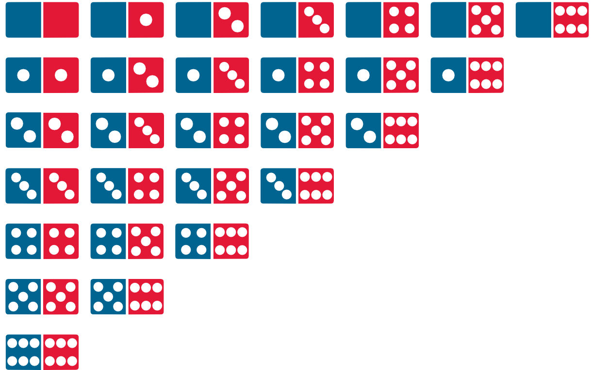

######
Bucles
######

.. image:: img/gary-lopater-UaUaefoUmZ8-unsplash.jpg

Cuando queremos hacer algo más de una vez, necesitamos recurrir a un **bucle**. En esta sección veremos las distintas sentencias en Python que nos permiten repetir un bloque de código. [#wheel-unsplash]_

**********************
La sentencia ``while``
**********************

El primer mecanismo que existe en Python para repetir instrucciones es usar la sentencia ``while``. La semántica tras esta sentencia es: "Mientras se cumpla la condición haz algo". 

Veamos un sencillo bucle que repite una pregunta mientras la respuesta sea negativa::

    >>> want_exit = 'N'  # importante dar un valor antes de empezar el bucle

    >>> while want_exit == 'N':
    ...     print('Hola qué tal')
    ...     want_exit = input('¿Quiere salir? [S/N] ')
    ...
    ... print('Ciao!')
    Hola qué tal
    ¿Quiere salir? [S/N] N
    Hola qué tal
    ¿Quiere salir? [S/N] N
    Hola qué tal
    ¿Quiere salir? [S/N] S
    Ciao!

Ejecución **paso a paso** a través de *Python Tutor*:

.. only:: latex

    https://cutt.ly/cNg8dR0

.. only:: html

    .. raw:: html

        <iframe width="800" height="410" frameborder="0" src="https://pythontutor.com/iframe-embed.html#code=want_exit%20%3D%20'N'%0A%0Awhile%20want_exit%20%3D%3D%20'N'%3A%0A%20%20%20%20print%28'Hola%20qu%C3%A9%20tal'%29%0A%20%20%20%20want_exit%20%3D%20input%28'%C2%BFQuiere%20salir%3F%20%5BS/N%5D%20'%29%0A%0Aprint%28'Ciao!'%29&codeDivHeight=400&codeDivWidth=350&cumulative=false&curInstr=0&heapPrimitives=nevernest&origin=opt-frontend.js&py=3&rawInputLstJSON=%5B%22N%22,%22N%22,%22S%22%5D&textReferences=false"> </iframe>

La condición del bucle se comprueba en cada nueva repetición. En este caso chequeamos que la variable ``want_exit`` sea igual a ``'N'``. Dentro del cuerpo del bucle estamos mostrando un mensaje y pidiendo la opción al usuario.

Romper un bucle while
=====================

Python ofrece la posibilidad de *romper* o finalizar un bucle *antes de que se cumpla la condición de parada*.

Supongamos que en el ejemplo anterior, establecemos un máximo de 4 preguntas:

.. code-block::
    :emphasize-lines: 10

    >>> want_exit = 'N'
    >>> num_questions = 0

    >>> while want_exit == 'N':
    ...     print('Hola qué tal')
    ...     want_exit = input('¿Quiere salir? [S/N] ')
    ...     num_questions += 1
    ...     if num_questions == 4:
    ...         print('Máximo número de preguntas alcanzado')
    ...         break
    ... print('Ciao!')
    Hola qué tal
    ¿Quiere salir? [S/N] N
    Hola qué tal
    ¿Quiere salir? [S/N] N
    Hola qué tal
    ¿Quiere salir? [S/N] N
    Hola qué tal
    ¿Quiere salir? [S/N] N
    Máximo número de preguntas alcanzado
    Ciao!

Ejecución **paso a paso** a través de *Python Tutor*:

.. only:: latex

    https://cutt.ly/xNhq3iI

.. only:: html

    .. raw:: html

        <iframe width="800" height="500" frameborder="0" src="https://pythontutor.com/iframe-embed.html#code=want_exit%20%3D%20'N'%0Anum_questions%20%3D%200%0A%0Awhile%20want_exit%20%3D%3D%20'N'%3A%0A%20%20%20%20print%28'Hola%20qu%C3%A9%20tal'%29%0A%20%20%20%20want_exit%20%3D%20input%28'%C2%BFQuiere%20salir%3F%20%5BS/N%5D%20'%29%0A%20%20%20%20num_questions%20%2B%3D%201%0A%20%20%20%20if%20num_questions%20%3D%3D%204%3A%0A%20%20%20%20%20%20%20%20print%28'M%C3%A1ximo%20n%C3%BAmero%20de%20preguntas%20alcanzado'%29%0A%20%20%20%20%20%20%20%20break%0Aprint%28'Ciao!'%29&codeDivHeight=400&codeDivWidth=350&cumulative=false&curInstr=0&heapPrimitives=nevernest&origin=opt-frontend.js&py=3&rawInputLstJSON=%5B%22N%22,%22N%22,%22N%22,%22N%22%5D&textReferences=false"> </iframe>

Como hemos visto en este ejemplo, ``break`` nos permite finalizar el bucle una vez que hemos llegado al máximo número de preguntas. Pero si no hubiéramos llegado a dicho límite, el bucle habría seguido hasta que el usuario indicara que quiere salir.

Otra forma de resolver este ejercicio sería incorporar una condición al bucle::

    while want_exit == 'N' and num_questions < 4:
        ...

Comprobar la rotura
-------------------

|intlev|

Python nos ofrece la posibilidad de **detectar si el bucle ha acabado de forma ordinaria**, esto es, ha finalizado por no cumplirse la condición establecida. Para ello podemos hacer uso de la sentencia ``else`` como parte del propio bucle. Si el bucle while finaliza normalmente (sin llamada a ``break``) el flujo de control pasa a la sentencia opcional ``else``.

Veamos su comportamiento siguiendo con el ejemplo que venimos trabajando:

.. code-block::
    :emphasize-lines: 11-12

    >>> want_exit = 'N'
    >>> num_questions = 0

    >>> while want_exit == 'N':
    ...     print('Hola qué tal')
    ...     want_exit = input('¿Quiere salir? [S/N] ')
    ...     num_questions += 1
    ...     if num_questions == 4:
    ...         print('Máximo número de preguntas alcanzado')
    ...         break
    ... else:
    ...     print('Usted ha decidido salir')
    ... print('Ciao')
    Hola qué tal
    ¿Quiere salir? [S/N] S
    Usted ha decidido salir
    Ciao

.. important::
    Si hubiéramos agotado el número de preguntas NO se habría ejecutado la cláusula ``else`` del bucle ya que habríamos roto el flujo con un ``break``.

Ejecución **paso a paso** a través de *Python Tutor*:

.. only:: latex

    https://cutt.ly/xNho3di

.. only:: html

    .. raw:: html

        <iframe width="800" height="540" frameborder="0" src="https://pythontutor.com/iframe-embed.html#code=want_exit%20%3D%20'N'%0Anum_questions%20%3D%200%0A%0Awhile%20want_exit%20%3D%3D%20'N'%3A%0A%20%20%20%20print%28'Hola%20qu%C3%A9%20tal'%29%0A%20%20%20%20want_exit%20%3D%20input%28'%C2%BFQuiere%20salir%3F%20%5BS/N%5D%20'%29%0A%20%20%20%20num_questions%20%2B%3D%201%0A%20%20%20%20if%20num_questions%20%3D%3D%204%3A%0A%20%20%20%20%20%20%20%20print%28'M%C3%A1ximo%20n%C3%BAmero%20de%20preguntas%20alcanzado'%29%0A%20%20%20%20%20%20%20%20break%0Aelse%3A%0A%20%20%20%20print%28'Usted%20ha%20decidido%20salir'%29%0Aprint%28'Ciao'%29&codeDivHeight=400&codeDivWidth=350&cumulative=false&curInstr=0&heapPrimitives=nevernest&origin=opt-frontend.js&py=3&rawInputLstJSON=%5B%22S%22%5D&textReferences=false"> </iframe>

Continuar un bucle
==================

|intlev|

Hay situaciones en las que, en vez de romper un bucle, nos interesa **saltar adelante hacia la siguiente repetición**. Para ello Python nos ofrece la sentencia ``continue`` que hace precisamente eso, descartar el resto del código del bucle y saltar a la siguiente iteración.

Continuamos con el ejemplo anterior y vamos a contar el número de respuestas válidas:

.. code-block::
    :emphasize-lines: 9

    >>> want_exit = 'N'
    >>> valid_options = 0

    >>> while want_exit == 'N':
    ...     print('Hola qué tal')
    ...     want_exit = input('¿Quiere salir? [S/N] ')
    ...     if want_exit not in 'SN':
    ...         want_exit = 'N'
    ...         continue
    ...     valid_options += 1
    ... print(f'{valid_options} respuestas válidas')
    ... print('Ciao!')
    Hola qué tal
    ¿Quiere salir? [S/N] N
    Hola qué tal
    ¿Quiere salir? [S/N] X
    Hola qué tal
    ¿Quiere salir? [S/N] Z
    Hola qué tal
    ¿Quiere salir? [S/N] S
    2 respuestas válidas
    Ciao!

Ejecución **paso a paso** a través de *Python Tutor*:

.. only:: latex

    https://cutt.ly/BNhkOhP

.. only:: html

    .. raw:: html

        <iframe width="800" height="520" frameborder="0" src="https://pythontutor.com/iframe-embed.html#code=want_exit%20%3D%20'N'%0Avalid_options%20%3D%200%0A%0Awhile%20want_exit%20%3D%3D%20'N'%3A%0A%20%20%20%20print%28'Hola%20qu%C3%A9%20tal'%29%0A%20%20%20%20want_exit%20%3D%20input%28'%C2%BFQuiere%20salir%3F%20%5BS/N%5D%20'%29%0A%20%20%20%20if%20want_exit%20not%20in%20'SN'%3A%0A%20%20%20%20%20%20%20%20want_exit%20%3D%20'N'%0A%20%20%20%20%20%20%20%20continue%0A%20%20%20%20valid_options%20%2B%3D%201%0Aprint%28f'%7Bvalid_options%7D%20respuestas%20v%C3%A1lidas'%29%0Aprint%28'Ciao!'%29&codeDivHeight=400&codeDivWidth=350&cumulative=false&curInstr=0&heapPrimitives=nevernest&origin=opt-frontend.js&py=3&rawInputLstJSON=%5B%22N%22,%22X%22,%22Z%22,%22S%22%5D&textReferences=false"> </iframe>

Bucle infinito
==============

Si no establecemos correctamente la **condición de parada** o bien el valor de alguna variable está fuera de control, es posible que lleguemos a una situación de bucle infinito, del que nunca podamos salir. Veamos un ejemplo de esto::

    >>> num = 1

    >>> while num != 10:
    ...     num += 2
    ...
    # CTRL-C
    Traceback (most recent call last):
      File "<stdin>", line 1, in <module>
    KeyboardInterrupt

El problema que surje es que la variable ``num`` toma los valores ``1, 3, 5, 7, 9, 11, ...`` por lo que nunca se cumple la condición de parada del bucle. Esto hace que repitamos "eternamente" la instrucción de incremento.

Ejecución **paso a paso** a través de *Python Tutor*:

.. only:: latex

    https://cutt.ly/AfrZroa

.. only:: html

    .. raw:: html

        <iframe width="800" height="435" frameborder="0" src="https://pythontutor.com/iframe-embed.html#code=num%20%3D%201%0A%0Awhile%20num%20!%3D%2010%3A%0A%20%20%20%20num%20%2B%3D%202&codeDivHeight=400&codeDivWidth=350&cumulative=false&curInstr=0&heapPrimitives=nevernest&origin=opt-frontend.js&py=3&rawInputLstJSON=%5B%5D&textReferences=false"> </iframe>

Una posible solución a este error es reescribir la condición de parada en el bucle:

.. code-block::
    :emphasize-lines: 3

    >>> num = 1

    >>> while num < 10:
    ...     num += 2
    ...
       

.. tip:: Para abortar una situación de *bucle infinito* podemos pulsar en el teclado la combinación :kbd:`CTRL-C`. Se puede ver reflejado en el intérprete de Python por ``KeyboardInterrupt``.

Hay veces que un **supuesto bucle "infinito"** puede ayudarnos a resolver un problema. Imaginemos que queremos escribir un programa que ayude al profesorado a introducir las notas de un examen. Si la nota no está en el intervalo :math:`[0, 10]` mostramos un mensaje de error, en otro caso seguimos pidiendo valores::

    >>> while True:
    ...     mark = float(input('Introduzca nueva nota: '))
    ...     if not(0 <= mark <= 10):
    ...         print('Nota fuera de rango')
    ...         break
    ...     print(mark)
    ...
    Introduzca nueva nota: 5
    5.0
    Introduzca nueva nota: 3
    3.0
    Introduzca nueva nota: 11
    Nota fuera de rango

.. admonition:: Ejercicio
    :class: exercise

    Escriba un programa que encuentre todos los múltiplos de 5 menores que un valor dado:

    **Ejemplo**
        * Entrada: ``36``
        * Salida: ``5 10 15 20 25 30 35``
    

    .. only:: html

        |solution| :download:`limit5.py <files/limit5.py>` 

.. _for-sentence:

********************
La sentencia ``for``
********************

Python permite recorrer aquellos tipos de datos que sean **iterables**, es decir, que admitan *iterar* [#iterate]_ sobre ellos. Algunos ejemplos de tipos y estructuras de datos que permiten ser iteradas (*recorridas*) son: cadenas de texto, listas, diccionarios, ficheros, etc. La sentencia ``for`` nos permite realizar esta acción.

A continuación se plantea un ejemplo en el que vamos a recorrer (iterar) una cadena de texto:

.. code-block::
    :emphasize-lines: 3

    >>> word = 'Python'

    >>> for letter in word:
    ...     print(letter)
    ...
    P
    y
    t
    h
    o
    n

La clave aquí está en darse cuenta que el bucle va tomando, en cada iteración, cada uno de los elementos de la variable que especifiquemos. En este caso concreto ``letter`` va tomando cada una de las letras que existen en ``word``, porque una cadena de texto está formada por elementos que son caracteres.

Ejecución **paso a paso** a través de *Python Tutor*:

.. only:: latex

    https://cutt.ly/Pft6R2e

.. only:: html

    .. raw:: html

        <iframe width="800" height="345" frameborder="0" src="https://pythontutor.com/iframe-embed.html#code=word%20%3D%20'Python'%0A%0Afor%20letter%20in%20word%3A%0A%20%20%20%20print%28letter%29&codeDivHeight=400&codeDivWidth=350&cumulative=false&curInstr=0&heapPrimitives=nevernest&origin=opt-frontend.js&py=3&rawInputLstJSON=%5B%5D&textReferences=false"> </iframe>

.. important:: La variable que utilizamos en el bucle ``for`` para ir tomando los valores puede tener **cualquier nombre**. Al fin y al cabo es una variable que definimos según nuestras necesidades. Tener en cuenta que se suele usar un nombre en singular.

Romper un bucle for
===================

Una sentencia break dentro de un ``for`` rompe el bucle, :ref:`igual que veíamos <core/controlflow/loops:Romper un bucle while>` para los bucles ``while``. Veamos un ejemplo con el código anterior. En este caso vamos a recorrer una cadena de texto y pararemos el bucle cuando encontremos una letra *t* minúscula:

.. code-block::
    :emphasize-lines: 5

    >>> word = 'Python'

    >>> for letter in word:
    ...     if letter == 't':
    ...         break
    ...     print(letter)
    ...
    P
    y

Ejecución **paso a paso** a través de *Python Tutor*:

.. only:: latex

    https://cutt.ly/zfyqkbJ

.. only:: html

    .. raw:: html

        <iframe width="800" height="390" frameborder="0" src="https://pythontutor.com/iframe-embed.html#code=word%20%3D%20'Python'%0A%0Afor%20letter%20in%20word%3A%0A%20%20%20%20if%20letter%20%3D%3D%20't'%3A%0A%20%20%20%20%20%20%20%20break%0A%20%20%20%20print%28letter%29&codeDivHeight=400&codeDivWidth=350&cumulative=false&curInstr=0&heapPrimitives=nevernest&origin=opt-frontend.js&py=3&rawInputLstJSON=%5B%5D&textReferences=false"> </iframe>

.. tip:: Tanto la :ref:`comprobación de rotura de un bucle <core/controlflow/loops:Comprobar la rotura>` como la :ref:`continuación a la siguiente iteración <core/controlflow/loops:Continuar un bucle>` se llevan a cabo del mismo modo que hemos visto con los bucles de tipo ``while``.

.. admonition:: Ejercicio
    :class: exercise

    Dada una cadena de texto, indique el número de vocales que tiene.

    **Ejemplo**
        * Entrada: ``Supercalifragilisticoespialidoso``
        * Salida: ``15``

    .. only:: html

        |solution| :download:`num_vowels.py <files/num_vowels.py>`    

Secuencias de números
=====================

Es muy habitual hacer uso de secuencias de números en bucles. Python no tiene una instrucción específica para ello. Lo que sí aporta es una función ``range()`` que devuelve un *flujo de números* en el rango especificado. Una de las grandes ventajas es que la "lista" generada no se construye explícitamente, sino que cada valor se genera bajo demanda. Esta técnica mejora el consumo de recursos, especialmente en términos de memoria.

La técnica para la generación de secuencias de números es muy similar a la utilizada en los :ref:`"slices" <core/datatypes/strings:Trocear una cadena>` de cadenas de texto. En este caso disponemos de la función ``range(start, stop, step)``:

- **start**: Es *opcional* y tiene valor por defecto **0**.
- **stop**: es *obligatorio* (siempre se llega a 1 menos que este valor).
- **step**: es *opcional* y tiene valor por defecto **1**.

``range()`` devuelve un *objeto iterable*, así que iremos obteniendo los valores paso a paso con una sentencia ``for ... in`` [#convert-list]_. Veamos diferentes ejemplos de uso:

**Rango:** :math:`[0, 1, 2]`
    ::

        >>> for i in range(0, 3):
        ...     print(i)
        ...
        0
        1
        2

        >>> for i in range(3):  # No hace falta indicar el inicio si es 0
        ...     print(i)
        ...
        0
        1
        2

**Rango:** :math:`[1, 3, 5]`
    ::

        >>> for i in range(1, 6, 2):
        ...     print(i)
        ...
        1
        3
        5

**Rango:** :math:`[2, 1, 0]`
    ::

        >>> for i in range(2, -1, -1):
        ...     print(i)
        ...
        2
        1
        0

Ejecución **paso a paso** a través de *Python Tutor*:

.. only:: latex

    https://cutt.ly/vfywE45

.. only:: html

    .. raw:: html

        <iframe width="800" height="300" frameborder="0" src="https://pythontutor.com/iframe-embed.html#code=for%20i%20in%20range%282,%2010%29%3A%0A%20%20%20%20print%28i%29&codeDivHeight=400&codeDivWidth=350&cumulative=false&curInstr=0&heapPrimitives=nevernest&origin=opt-frontend.js&py=3&rawInputLstJSON=%5B%5D&textReferences=false"> </iframe>
    
.. tip:: Se suelen utilizar nombres de variables ``i``, ``j``, ``k`` para lo que se denominan **contadores**. Este tipo de variables toman valores numéricos enteros como en los ejemplos anteriores. No conviene generalizar el uso de estas variables a situaciones en las que, claramente, tenemos la posibilidad de asignar un nombre semánticamente más significativo. Esto viene de tiempos antiguos en FORTRAN donde ``i`` era la primera letra que tenía valor entero por defecto.

.. admonition:: Ejercicio
    :class: exercise

    Determine si un número dado es un `número primo`_.

    *No es necesario implementar ningún algoritmo en concreto. La idea es probar los números menores al dado e ir viendo si las divisiones tienen resto cero o no*.

    ¿Podría optimizar su código? ¿Realmente es necesario probar con tantos divisores?

    **Ejemplo**
        * Entrada: ``11``
        * Salida: ``Es primo``

    .. only:: html

        |solution| :download:`prime.py <files/prime.py>`

Usando el guión bajo
--------------------

|advlev|

Hay situaciones en las que **no necesitamos usar la variable** que toma valores en el rango, sino que únicamente queremos repetir una acción un número determinado de veces.

Para estos casos se suele recomendar usar el **guión bajo** ``_`` como **nombre de variable**, que da a entender que no estamos usando esta variable de forma explícita::

    >>> for _ in range(10):
    ...     print('Repeat me 10 times!')
    ...
    Repeat me 10 times!
    Repeat me 10 times!
    Repeat me 10 times!
    Repeat me 10 times!
    Repeat me 10 times!
    Repeat me 10 times!
    Repeat me 10 times!
    Repeat me 10 times!
    Repeat me 10 times!
    Repeat me 10 times!

.. admonition:: Ejercicio
    :class: exercise

    Imprima los 100 primeros números de la `sucesión de Fibonacci`_: :math:`0, 1, 1, 2, 3, 5, 8, 13, 21, 34, 55, 89, \dots` 

    .. only:: html
    
        |solution| :download:`fibonacci.py <files/fibonacci.py>`

***************
Bucles anidados
***************

Como ya vimos en las :ref:`sentencias condicionales <if-sentence>`, el *anidamiento* es una técnica por la que incluimos distintos niveles de encapsulamiento de sentencias, unas dentro de otras, con mayor nivel de profundidad. En el caso de los bucles también es posible hacer anidamiento.

Veamos un ejemplo de 2 bucles anidados en el que generamos todas las tablas de multiplicar::

    >>> for i in range(1, 10):
    ...     for j in range(1, 10):
    ...         result = i * j
    ...         print(f'{i} * {j} = {result}')
    ...
    1 x 1 = 1
    1 x 2 = 2
    1 x 3 = 3
    1 x 4 = 4
    1 x 5 = 5
    1 x 6 = 6
    1 x 7 = 7
    1 x 8 = 8
    1 x 9 = 9
    2 x 1 = 2
    2 x 2 = 4
    2 x 3 = 6
    2 x 4 = 8
    2 x 5 = 10
    2 x 6 = 12
    2 x 7 = 14
    2 x 8 = 16
    2 x 9 = 18
    3 x 1 = 3
    3 x 2 = 6
    3 x 3 = 9
    3 x 4 = 12
    3 x 5 = 15
    3 x 6 = 18
    3 x 7 = 21
    3 x 8 = 24
    3 x 9 = 27
    4 x 1 = 4
    4 x 2 = 8
    4 x 3 = 12
    4 x 4 = 16
    4 x 5 = 20
    4 x 6 = 24
    4 x 7 = 28
    4 x 8 = 32
    4 x 9 = 36
    5 x 1 = 5
    5 x 2 = 10
    5 x 3 = 15
    5 x 4 = 20
    5 x 5 = 25
    5 x 6 = 30
    5 x 7 = 35
    5 x 8 = 40
    5 x 9 = 45
    6 x 1 = 6
    6 x 2 = 12
    6 x 3 = 18
    6 x 4 = 24
    6 x 5 = 30
    6 x 6 = 36
    6 x 7 = 42
    6 x 8 = 48
    6 x 9 = 54
    7 x 1 = 7
    7 x 2 = 14
    7 x 3 = 21
    7 x 4 = 28
    7 x 5 = 35
    7 x 6 = 42
    7 x 7 = 49
    7 x 8 = 56
    7 x 9 = 63
    8 x 1 = 8
    8 x 2 = 16
    8 x 3 = 24
    8 x 4 = 32
    8 x 5 = 40
    8 x 6 = 48
    8 x 7 = 56
    8 x 8 = 64
    8 x 9 = 72
    9 x 1 = 9
    9 x 2 = 18
    9 x 3 = 27
    9 x 4 = 36
    9 x 5 = 45
    9 x 6 = 54
    9 x 7 = 63
    9 x 8 = 72
    9 x 9 = 81

Lo que está ocurriendo en este código es que, para cada valor que toma la variable ``i``, la otra variable ``j`` toma todos sus valores. Como resultado tenemos una combinación completa de los valores en el rango especificado.

Ejecución **paso a paso** a través de *Python Tutor*:

.. only:: latex

    https://cutt.ly/vfyeWvj

.. only:: html

    .. raw:: html

        <iframe width="800" height="355" frameborder="0" src="https://pythontutor.com/iframe-embed.html#code=for%20i%20in%20range%281,%2010%29%3A%0A%20%20%20%20for%20j%20in%20range%281,%2010%29%3A%0A%20%20%20%20%20%20%20%20result%20%3D%20i%20*%20j%0A%20%20%20%20%20%20%20%20print%28f'%7Bi%7D%20*%20%7Bj%7D%20%3D%20%7Bresult%7D'%29&codeDivHeight=400&codeDivWidth=350&cumulative=false&curInstr=0&heapPrimitives=nevernest&origin=opt-frontend.js&py=3&rawInputLstJSON=%5B%5D&textReferences=false"> </iframe>

.. note::
    * Podemos añadir todos los niveles de anidamiento que queramos. Eso sí, hay que tener en cuenta que cada nuevo nivel de anidamiento supone un importante aumento de la `complejidad ciclomática`_ de nuestro código, lo que se traduce en mayores tiempos de ejecución.
    * Los bucles anidados también se pueden aplicar en la sentencia ``while``.

.. admonition:: Ejercicio
    :class: exercise

    Dado su tamaño, muestre por pantalla un mosaico donde la diagonal principal esté representada por ``X``, la parte inferior por ``D`` y la parte superior por ``U``.

    **Ejemplo**
        * Entrada: ``5``
        * Salida::

            X U U U U 
            D X U U U 
            D D X U U 
            D D D X U 
            D D D D X 

    .. only:: html
    
        |solution| :download:`mosaic.py <files/mosaic.py>`

----

.. rubric:: EJERCICIOS DE REPASO

1. Escriba un programa que encuentre la mínima secuencia de múltiplos de 3 (distintos) cuya suma sea igual o superior a un valor dado (:download:`solución <files/multiples3_limit.py>`).
    - Entrada: ``45``
    - Salida: ``0, 3, 6, 9, 12, 15``

2. Escriba un programa que pida nombre y apellidos de una persona (usando un solo ``input``) y repita la pregunta mientras el nombre no esté en formato título (:download:`solución <files/repeat_please.py>`).

.. code-block::

    ¿Su nombre? ana torres blanco
    Error. Debe escribirlo correctamente
    ¿Su nombre? Ana torres blanco
    Error. Debe escribirlo correctamente
    ¿Su nombre? Ana Torres blanco
    Error. Debe escribirlo correctamente
    ¿Su nombre? Ana Torres Blanco

3. Escriba un programa en Python que realice las siguientes 9 multiplicaciones. ¿Nota algo raro en el resultado? (:download:`solución <files/ones_product.py>`)

.. math::

    1 &\cdot 1\\
    11 &\cdot 11\\
    111 &\cdot 111\\
    &\vdots\\
    111111111 &\cdot 111111111

4. Escriba un programa en Python que acepte una cadena de texto e indique si todos sus caracteres son alfabéticos. No usar la función ``isalpha()`` sino una constante ``ALPHABET = 'abcdefghijklmnopqrstuvwxyz'`` (:download:`solución <files/alpha.py>`)
    - Entrada: ``hello-world``
    - Salida: ``Se han encontrado caracteres no alfabéticos``

5. Escriba un programa en Python que acepte un número entero :math:`n` y realice el siguiente cálculo de productos sucesivos (:download:`solución <files/products.py>`):

.. math::
    \prod_{i=1}^n i^2 = 1^2 \cdot 2^2 \cdot 3^2 \cdot \cdots \cdot n^2

6. Escriba un programa en Python que acepte dos cadenas de texto y compute el `producto cartesiano`_ letra a letra entre ellas (:download:`solución <files/cproduct.py>`).
    - Entrada: ``str1=abc; str2=123``
    - Salida: ``a1 a2 a3 b1 b2 b3 c1 c2 c3``

7. Escriba un programa en Python que acepte dos valores enteros (:math:`x` e :math:`y`) que representarán un punto (objetivo) en el plano. El programa simulará el movimiento de un "caballo" de ajedrez moviéndose de forma alterna: 2 posiciones en :math:`x` + 1 posición en :math:`y`. El siguiente movimiento que toque sería para moverse 1 posición en :math:`x` + 2 posiciones en :math:`y`. El programa deberá ir mostrando los puntos por los que va pasando el "caballo" hasta llegar al punto objetivo (:download:`solución <files/horse.py>`).
    - Entrada: ``objetivo_x=7; objetivo_y=8;``
    - Salida: ``(0, 0) (1, 2) (3, 3) (4, 5) (6, 6) (7, 8)``

8. Escriba un programa que calcule la `distancia hamming`_ entre dos *cadenas de texto* de la misma longitud (:download:`solución <files/hamming.py>`).
    - Entrada: ``0001010011101`` y ``0000110010001``
    - Salida: ``4``

9. Escriba un programa que calcule el máximo común divisor entre dos números enteros. No utilice ningún algoritmo existente. Hágalo probando divisores (:download:`solución <files/mcd.py>`).
    - Entrada: ``a=12; b=44``
    - Salida: ``4``

10. Escriba un programa que muestre por pantalla todas las fichas del dominó. La ficha "en blanco" se puede representar con un 0 (:download:`solución <files/domino.py>`).

.. code-block::

    0|0 0|1 0|2 0|3 0|4 0|5 0|6
    1|1 1|2 1|3 1|4 1|5 1|6
    2|2 2|3 2|4 2|5 2|6
    3|3 3|4 3|5 3|6
    4|4 4|5 4|6
    5|5 5|6
    6|6

.. rubric:: AMPLIAR CONOCIMIENTOS

* `The Python range() Function <https://realpython.com/courses/python-range-function/>`_
* `How to Write Pythonic Loops <https://realpython.com/courses/how-to-write-pythonic-loops/>`_
* `For Loops in Python (Definite Iteration) <https://realpython.com/courses/python-for-loop/>`_
* `Python "while" Loops (Indefinite Iteration) <https://realpython.com/python-while-loop/>`_

.. --------------- Footnotes ---------------

.. [#wheel-unsplash] Foto original de portada por `Gary Lopater`_ en Unsplash.
.. [#iterate] Realizar cierta acción varias veces. En este caso la acción es tomar cada elemento.
.. [#convert-list] O convertir el objeto a una secuencia como una lista.

.. --------------- Hyperlinks ---------------

.. _Gary Lopater: https://unsplash.com/@glopater?utm_source=unsplash&utm_medium=referral&utm_content=creditCopyText
.. _complejidad ciclomática: https://es.wikipedia.org/wiki/Complejidad_ciclom%C3%A1tica
.. _sucesión de Fibonacci: https://es.wikipedia.org/wiki/Sucesi%C3%B3n_de_Fibonacci
.. _número primo: https://es.wikipedia.org/wiki/N%C3%BAmero_primo
.. _distancia hamming: https://es.wikipedia.org/wiki/Distancia_de_Hamming
.. _producto cartesiano: https://es.wikipedia.org/wiki/Producto_cartesiano
