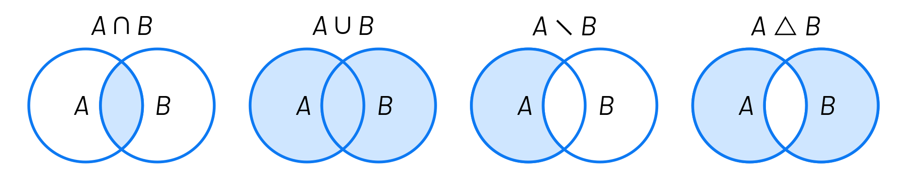
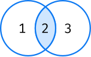
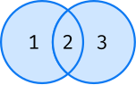
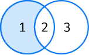
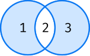
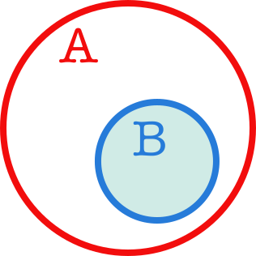

#########
Conjuntos
#########

.. image:: img/duy-pham-Cecb0_8Hx-o-unsplash.jpg

Un **conjunto** en Python representa una serie de **valores únicos** y **sin orden establecido**. Mantiene muchas similitudes con el `concepto matemático de conjunto`_ [#friends-unsplash]_

*****************
Creando conjuntos
*****************

Para crear un conjunto basta con separar sus valores por *comas* y rodearlos de llaves ``{}``::

    >>> lottery = {21, 10, 46, 29, 31, 94}

    >>> lottery
    {10, 21, 29, 31, 46, 94}

La excepción la tenemos a la hora de crear un **conjunto vacío**, ya que, siguiendo la lógica de apartados anteriores, deberíamos hacerlo a través de llaves::

    >>> wrong_empty_set = {}

    >>> type(wrong_empty_set)
    dict

.. warning:: Si hacemos esto, lo que obtenemos es un *diccionario vacío*.

La única opción que tenemos es utilizar la función ``set()``::

    >>> empty_set = set()

    >>> empty_set
    set()

    >>> type(empty_set)
    set

.. warning::
    Aunque está permitido, **NUNCA** llames ``set`` a una variable porque destruirías la función que nos permite crear conjuntos. Y tampoco uses nombres derivados como ``_set`` o ``set_`` ya que no son nombres representativos que :ref:`identifiquen el propósito de la variable <core/datatypes/data:convenciones para nombres>`.

**********
Conversión
**********

Para convertir otros tipos de datos en un conjunto podemos usar la función ``set()`` sobre cualquier iterable::

    >>> set('aplatanada')
    {'a', 'd', 'l', 'n', 'p', 't'}

    >>> set([1, 2, 2, 3, 3, 3, 4, 4, 4, 4, 5, 5, 5, 5, 5])
    {1, 2, 3, 4, 5}

    >>> set(('ADENINA', 'TIMINA', 'TIMINA', 'GUANINA', 'ADENINA', 'CITOSINA'))
    {'ADENINA', 'CITOSINA', 'GUANINA', 'TIMINA'}

    >>> set({'manzana': 'rojo', 'plátano': 'amarillo', 'kiwi': 'verde'})
    {'kiwi', 'manzana', 'plátano'}

.. important:: Como se ha visto en los ejemplos anteriores, ``set()`` se suele utilizar en muchas ocasiones como una forma de **extraer los valores únicos** de otros tipos de datos. En el caso de los diccionarios se extraen las claves, que, por definición, son únicas.

.. note:: El hecho de que en los ejemplos anteriores los elementos de los conjuntos estén ordenados es únicamente un "detalle de implementación" en el que no se puede confiar.

*************************
Operaciones con conjuntos
*************************

Obtener un elemento
===================

En un conjunto no existe un orden establecido para sus elementos, por lo tanto **no podemos acceder a un elemento en concreto**. 

De este hecho se deriva igualmente que **no podemos modificar un elemento existente**, ya que ni siquiera tenemos acceso al mismo. Python sí nos permite añadir o borrar elementos de un conjunto.

Añadir un elemento
==================

Para añadir un elemento a un conjunto debemos utilizar la función ``add()``. Como ya hemos indicado, al no importar el orden dentro del conjunto, la inserción no establece a priori la posición donde se realizará.

A modo de ejemplo, vamos a partir de un conjunto que representa a los cuatro integrantes originales de *The Beatles*. Luego añadiremos a un nuevo componente:  

.. code-block::
    :emphasize-lines: 3

    >>> # John Lennon, Paul McCartney, George Harrison y Ringo Starr
    >>> beatles = set(['Lennon', 'McCartney', 'Harrison', 'Starr'])

    >>> beatles.add('Best')  # Pete Best

    >>> beatles
    {'Best', 'Harrison', 'Lennon', 'McCartney', 'Starr'}

Ejecución **paso a paso** a través de *Python Tutor*:

.. raw:: html

    <iframe width="800" height="380" frameborder="0" src="https://pythontutor.com/iframe-embed.html#code=beatles%20%3D%20set%28%5B'Lennon',%20'McCartney',%20'Harrison',%20'Starr'%5D%29%0A%0Abeatles.add%28'Best'%29%20%20%23%20Pete%20Best%0A%0Aprint%28beatles%29&codeDivHeight=400&codeDivWidth=350&cumulative=false&curInstr=0&heapPrimitives=nevernest&origin=opt-frontend.js&py=3&rawInputLstJSON=%5B%5D&textReferences=false"> </iframe>

.. tip::
    Una pequeña **regla mnemotécnica** para diferenciar ``add()`` de ``append()`` es que la función ``append()`` significa añadir al final, y como los conjuntos no mantienen un orden, esta función se aplica únicamente a listas. Por descarte, la función ``add()`` se aplica sobre conjuntos.

Este pequeño fragmento de código nos demuestra claramente que, aunque lo intentemos por fuerza bruta, nunca vamos a poder insertar elementos repetidos en un conjunto::

    >>> items = set()
    
    >>> for _ in range(1_000_000):
    ...     items.add(1)
    ...
    
    >>> items
    {1}

.. admonition:: Ejercicio

    pycheck_: **tupleset**

Objetos hashables
-----------------

Los elementos de un conjunto deben ser :ref:`"hashables" <core/datastructures/dicts:Objetos "hashables">`.

Por ejemplo, **una lista** no podría ser un objeto válido para un conjunto (ya que no es "hashable"). Supongamos que estamos contruyendo un conjunto con los `elementos químicos`_ de la tabla periódica::

    >>> periodic_table = set()
    >>> metals = ['Fe', 'Mg', 'Au', 'Au', 'Zn']

    >>> periodic_table.add(metals)
    Traceback (most recent call last):
      File "<stdin>", line 1, in <module>
    TypeError: unhashable type: 'list'

Sin embargo, podríamos conseguir lo que buscamos si, en vez de listas, usáramos **tuplas** para almacenar los elementos químicos (ya que sí son "hashables")::

    >>> periodic_table = set()

    >>> metals = ('Fe', 'Mg', 'Au', 'Au', 'Zn')
    >>> periodic_table.add(metals)

    >>> non_metals = ('C', 'H', 'O', 'F', 'Cl')
    >>> periodic_table.add(non_metals)

    >>> periodic_table
    {('Fe', 'Mg', 'Au', 'Au', 'Zn'), ('C', 'H', 'O', 'F', 'Cl')}

Borrar elementos
================

Para borrar un elemento de un conjunto podemos utilizar la función ``remove()``. Siguiendo con el ejemplo anterior, vamos a borrar al último "beatle" añadido::

    >>> beatles
    {'Best', 'Harrison', 'Lennon', 'McCartney', 'Starr'}

    >>> beatles.remove('Best')

    >>> beatles
    {'Harrison', 'Lennon', 'McCartney', 'Starr'}

Si tratamos de **borrar un elemento que no existe** en un conjunto obtendremos un ``KeyError`` (al estilo de los :ref:`diccionarios <core/datastructures/dicts:obtener un elemento>`)::

    >>> beatles.remove('Sinatra')
    Traceback (most recent call last):
      File "<stdin>", line 1, in <module>
    KeyError: 'Sinatra'

Longitud de un conjunto
=======================

Podemos conocer el número de elementos (*cardinalidad*) que tiene un conjunto con la función ``len()``::

    >>> beatles
    {'Harrison', 'Lennon', 'McCartney', 'Starr'}

    >>> len(beatles)
    4

.. admonition:: Ejercicio

    pycheck_: **diverse_word**

Iterar sobre un conjunto
========================

Tal y como hemos visto para otros tipos de datos *iterables*, la forma de recorrer los elementos de un conjunto es utilizar la sentencia ``for``::

    >>> for beatle in beatles:
    ...     print(beatle)
    ...
    Harrison
    McCartney
    Starr
    Lennon

.. hint:: Como en el ejemplo anterior, es muy común utilizar una *variable en singular* para recorrer un iterable (en plural). No es una regla fija ni sirve para todos los casos, pero sí suele ser una *buena práctica*.

Pertenencia de un elemento
==========================

Al igual que con otros tipos de datos, Python nos ofrece el operador ``in`` para determinar si un elemento pertenece a un conjunto::

    >>> beatles
    {'Harrison', 'Lennon', 'McCartney', 'Starr'}

    >>> 'Lennon' in beatles
    True

    >>> 'Fari' in beatles
    False

Obviamente también disponemos de la "negación" del operador::

    >>> 'Fari' not in beatles
    True

.. admonition:: Ejercicio

    pycheck_: **half_out**

Ordenando un conjunto
=====================

Ya hemos comentado que los conjuntos **no mantienen un orden**. ¿Pero qué ocurre si intentamos ordenarlo?

.. code-block::

    >>> marks = {8, 4, 6, 2, 9, 5}

    >>> sorted(marks)
    [2, 4, 5, 6, 8, 9]

Obtenemos **una lista con los elementos ordenados**.

Hay que tener en cuenta que, lógicamente, no podremos hacer uso de la función ``sort()`` sobre un conjunto::

    >>> marks.sort()
    Traceback (most recent call last):
      File "<stdin>", line 1, in <module>
    AttributeError: 'set' object has no attribute 'sort'

*******************
Teoría de conjuntos
*******************

Vamos a partir de dos conjuntos :math:`A=\{1,2\}` y :math:`B=\{2,3\}` para ejemplificar las distintas operaciones que se pueden hacer entre ellos basadas en los `Diagramas de Venn`_ y la `Teoría de Conjuntos <https://es.wikipedia.org/wiki/Teor%C3%ADa_de_conjuntos>`__::

    >>> A = {1, 2}
    >>> B = {2, 3}

    Diagramas de Venn

Intersección
============

:math:`A \cap B` -- Elementos que están a la vez en :math:`A` y en :math:`B`:

.. code-block::

    >>> A & B
    {2}

    >>> A.intersection(B)
    {2}

Unión
=====

:math:`A \cup B` -- Elementos que están tanto en :math:`A` como en :math:`B`:

.. code-block::

    >>> A | B
    {1, 2, 3}

    >>> A.union(B)
    {1, 2, 3}

Diferencia
==========

:math:`A \setminus B` -- Elementos que están en :math:`A` y no están en :math:`B`:

.. code-block::

    >>> A - B
    {1}

    >>> A.difference(B)
    {1}

Diferencia simétrica
====================

:math:`A \triangle B` -- Elementos que están en :math:`A` o en :math:`B` pero no en ambos conjuntos:

.. code-block::

    >>> A ^ B
    {1, 3}

    >>> A.symmetric_difference(B)
    {1, 3}

Podemos comprobar que la definición de la diferencia simétrica se cumple también en Python::

    >>> A ^ B == (A | B) - (A & B)
    True

Inclusión
=========

- Un conjunto :math:`B` es un **subconjunto** de otro conjunto :math:`A` si todos los elementos de :math:`B` están incluidos en :math:`A`.
- Un conjunto :math:`A` es un **superconjunto** de otro conjunto :math:`B` si todos los elementos de :math:`B` están incluidos en :math:`A`.

Veamos un ejemplo con los siguientes conjuntos::

    >>> A = {2, 4, 6, 8, 10}
    >>> B = {4, 6, 8}

    Subconjuntos y Superconjuntos

En Python podemos realizar comprobaciones de inclusión (subconjuntos y superconjuntos) utilizando operadores clásicos de comparación:

:math:`B \subset A`

.. code-block::
    
    >>> B < A  # subconjunto
    True

:math:`B \subseteq A`

.. code-block::
    
    >>> B <= A
    True

:math:`A \supset B`

.. code-block::
    
    >>> A > B  # superconjunto
    True

:math:`A \supseteq B`

.. code-block::
    
    >>> B >= A
    True

El hecho de que algunos elementos sí pertenezcan a otro conjunto no hace que sea un subconjunto. En el siguiente ejemplo tanto :math:`3` como :math:`5` del conjunto :math:`B` están en el conjunto :math:`A`, pero al no estar el elemento :math:`1` no se trata de un subconjunto:

    >>> A = {3, 5, 7, 9}
    >>> B = {1, 3, 5}

    >>> B < A
    False

*************************
Conjuntos por comprensión
*************************

Los conjuntos, al igual que las :ref:`listas <core/datastructures/lists:Listas por comprensión>` y los :ref:`diccionarios <core/datastructures/dicts:Diccionarios por comprensión>`, también se pueden crear por comprensión.

Veamos un ejemplo en el que construimos un conjunto por comprensión con aquellos números enteros múltiplos de 3 en el rango :math:`[0, 20)`::

    >>> m3 = {number for number in range(0, 20) if number % 3 == 0}

    >>> m3
    {0, 3, 6, 9, 12, 15, 18}

.. admonition:: Ejercicio

    pycheck_: **common_consonants**

********************
Conjuntos inmutables
********************

Python ofrece la posibilidad de crear **conjuntos inmutables** haciendo uso de la función ``frozenset()`` que recibe cualquier iterable como argumento.

Supongamos que recibimos una serie de calificaciones de exámenes y queremos crear un conjunto inmutable con los posibles niveles (categorías) de calificaciones::

    >>> marks = [1, 3, 2, 3, 1, 4, 2, 4, 5, 2, 5, 5, 3, 1, 4]

    >>> marks_levels = frozenset(marks)

    >>> marks_levels
    frozenset({1, 2, 3, 4, 5})

Veamos qué ocurre si intentamos modificar este conjunto::

    >>> marks_levels.add(50)
    Traceback (most recent call last):
      File "<stdin>", line 1, in <module>
    AttributeError: 'frozenset' object has no attribute 'add'

Un ejemplo en el que podemos aplicar un "frozenset" sería el conjunto de **posibles piezas del ajedrez**. Sabemos que estas piezas siempre son las mismas::

    >>> CHESS_PIECES = frozenset(('King', 'Queen', 'Bishop', 'Knight', 'Rook', 'Pawn'))

    >>> CHESS_PIECES
    frozenset({'Bishop', 'King', 'Knight', 'Pawn', 'Queen', 'Rook'})

.. note:: Los ``frozenset`` son a los ``sets`` lo que las tuplas a las listas: una forma de "congelar" los valores para que no se puedan modificar.

----

**********
Ejercicios
**********

1. pycheck_: **is_binary**

*********************
Ampliar conocimientos
*********************

* `Sets in Python <https://realpython.com/courses/sets-python/>`_

.. --------------- Footnotes ---------------

.. [#friends-unsplash] Foto original de portada por `Duy Pham`_ en Unsplash.

.. --------------- Hyperlinks ---------------

.. _Duy Pham: https://unsplash.com/@miinyuii?utm_source=unsplash&utm_medium=referral&utm_content=creditCopyText
.. _concepto matemático de conjunto: https://es.wikipedia.org/wiki/Conjunto
.. _Diagramas de Venn: https://es.wikipedia.org/wiki/Diagrama_de_Venn
.. _pycheck: https://pycheck.es
.. _elementos químicos: https://es.wikipedia.org/wiki/Elemento_qu%C3%ADmico
.. _caracteres Unicode del ajedrez: https://unicode.org/charts/PDF/U1FA00.pdf
