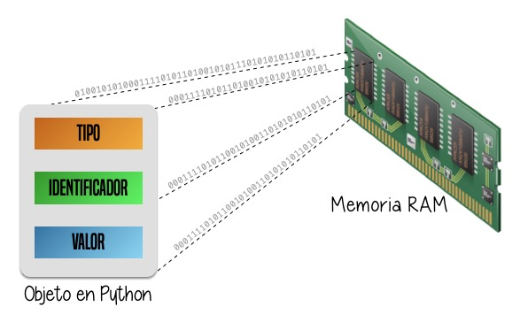
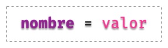
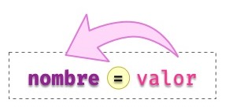

#####
Datos
#####

.. image:: img/alexander-sinn-KgLtFCgfC28-unsplash.jpg

Los programas están formados por **código** y **datos**. Pero a nivel interno de la memoria del ordenador no son más que una secuencia de bits. La interpretación de estos bits depende del lenguaje de programación, que almacena en la memoria no sólo el puro dato sino distintos metadatos. [#love-unsplash]_

Cada "trozo" de memoria contiene realmente un objeto, de ahí que se diga que en Python **todo son objetos**. Y cada objeto tiene, al menos, los siguientes campos:

* Un **tipo** del dato almacenado.
* Un **identificador** único para distinguirlo de otros objetos.
* Un **valor** consistente con su tipo.

    Esquema (*metadatos*) de un objeto en Python

**************
Tipos de datos
**************

A continuación se muestran los distintos `tipos de datos <https://docs.python.org/es/3/library/stdtypes.html>`__ que podemos encontrar en Python, sin incluir aquellos que proveen paquetes externos:

.. csv-table:: Tipos de datos en Python
    :file: tables/datatypes.csv
    :widths: 10, 10, 40
    :header-rows: 1
    :class: longtable

*********
Variables
*********

Las **variables** son fundamentales ya que permiten definir **nombres** para los **valores** que tenemos en memoria y que vamos a usar en nuestro programa.

    Uso de un *nombre* de variable

Reglas para nombrar variables
=============================

En Python existen una serie de reglas para los nombres de variables:

1. Sólo pueden **contener los siguientes caracteres** [#special-chars]_:
    * Letras minúsculas.
    * Letras mayúsculas.
    * Dígitos.
    * Guiones bajos (``_``).
2. Deben **empezar con una letra o un guión bajo**, nunca con un dígito.
3. No pueden ser una **palabra reservada** del lenguaje ("keywords").

Podemos obtener un listado de las palabras reservadas del lenguaje de la siguiente forma::

    >>> help('keywords')

    Here is a list of the Python keywords.  Enter any keyword to get more help.

    False               class               from                or
    None                continue            global              pass
    True                def                 if                  raise
    and                 del                 import              return
    as                  elif                in                  try
    assert              else                is                  while
    async               except              lambda              with
    await               finally             nonlocal            yield
    break               for                 not

.. note:: Por lo general se prefiere dar nombres **en inglés** a las variables que utilicemos, ya que así hacemos nuestro código más "internacional" y con la posibilidad de que otras personas puedan leerlo, entenderlo y -- llegado el caso -- modificarlo. Es sólo una recomendación, nada impide que se haga en castellano.

.. important:: Los nombres de variables son "case-sensitive" [#case-sensitive]_. Por ejemplo, ``stuff`` y ``Stuff`` son nombres diferentes.

Ejemplos de nombres de variables
================================

Veamos a continuación una tabla con nombres de variables:

.. csv-table:: Ejemplos de nombres de variables
    :file: tables/var-naming.csv
    :header-rows: 1
    :widths: 20, 20, 50
    :class: longtable

Convenciones para nombres
=========================

Mientras se sigan las :ref:`reglas <core/datatypes/data:Reglas para nombrar variables>` que hemos visto para nombrar variables no hay problema en la forma en la que se escriban, pero sí existe una convención para la **nomenclatura de las variables**. Se utiliza el llamado ``snake_case`` en el que utilizamos **caracteres en minúsculas** (incluyendo dígitos si procede) junto con **guiones bajos** -- cuando sean necesarios para su legibilidad --. [#naming-pep8]_ Por ejemplo, para nombrar una variable que almacene el número de canciones en nuestro ordenador, podríamos usar ``num_songs``.

Esta convención, y muchas otras, están definidas en un documento denominado `PEP 8`_. Se trata de una **guía de estilo** para escribir código en Python. Los `PEPs`_ [#peps-link]_ son las propuestas que se hacen para la mejora del lenguaje.

Aunque hay múltiples herramientas disponibles para la comprobación del estilo de código, una bastante accesible es http://pep8online.com/ ya que no necesita instalación, simplemente pegar nuestro código y verificar.

Constantes
----------

Un caso especial y que vale la pena destacar son las **constantes**. Podríamos decir que es un tipo de variable pero que su valor no cambia a lo largo de nuestro programa. Por ejemplo la velocidad de la luz. Sabemos que su valor es constante de 300.000 km/s. En el caso de las constantes utilizamos **mayúsculas** (incluyendo guiones bajos si es necesario) para nombrarlas. Para la velocidad de la luz nuestra constante se podría llamar: ``LIGHT_SPEED``.

Elegir buenos nombres
---------------------

Se suele decir que una persona programadora (con cierta experiencia), a lo que dedica más tiempo, es a buscar un buen nombre para sus variables. Quizás pueda resultar algo excesivo pero da una idea de lo importante que es esta tarea. Es fundamental que los nombres de variables sean **autoexplicativos**, pero siempre llegando a un compromiso entre ser concisos y claros.

Supongamos que queremos buscar un nombre de variable para almacenar el número de elementos que se deben manejar en un pedido:

1. ``n``
2. ``num_elements``
3. ``number_of_elements``
4. ``number_of_elements_to_be_handled``

No existe una regla mágica que nos diga cuál es el nombre perfecto, pero podemos aplicar el *sentido común* y, a través de la experiencia, ir detectando aquellos nombres que sean más adecuados. En el ejemplo anterior, quizás podríamos descartar de principio la opción *1* y la *4* (por ser demasiado cortas o demasiado largas); nos quedaríamos con las otras dos. Si nos fijamos bien, casi no hay mucha información adicional de la opción *3* con respecto a la *2*. Así que podríamos concluir que la opción *2* es válida para nuestras necesidades. En cualquier caso esto dependerá siempre del contexto del problema que estemos tratando.

Como regla general:

- Usar **nombres** para :ref:`variables <core/datatypes/data:Variables>` (ejemplo ``article``).
- Usar **verbos** para :ref:`funciones <core/modularity/functions:Funciones>` (ejemplo ``get_article()``).
- Usar **adjetivos** para :ref:`booleanos <core/datatypes/numbers:Booleanos>` (ejemplo ``available``).

**********
Asignación
**********

En Python se usa el símbolo ``=`` para **asignar** un valor a una variable:

    Asignación de *valor* a *nombre* de variable

.. note:: Hay que diferenciar la asignación en Python con la igualación en matemáticas. El símbolo ``=`` lo hemos aprendido desde siempre como una *equivalencia* entre dos *expresiones algebraicas*, sin embargo en Python nos indica una *sentencia de asignación*, del valor (en la derecha) al nombre (en la izquierda).

Algunos ejemplos de asignaciones a *variables*::

    >>> total_population = 157_503
    >>> avg_temperature = 16.8
    >>> city_name = 'San Cristóbal de La Laguna'

Algunos ejemplos de asignaciones a *constantes*::

    >>> SOUND_SPEED = 343.2
    >>> WATER_DENSITY = 997
    >>> EARTH_NAME = 'La Tierra'

Python nos ofrece la posibilidad de hacer una **asignación múltiple** de la siguiente manera::

    >>> tres = three = drei = 3

En este caso las tres variables utilizadas en el "lado izquierdo" tomarán el valor ``3``.

Recordemos que los nombres de variables deben seguir unas :ref:`reglas establecidas <core/datatypes/data:Reglas para nombrar variables>`, de lo contrario obtendremos un **error sintáctico** del intérprete de Python:

.. code-block::
    :emphasize-lines: 1, 7, 13

    >>> 7floor = 40  # el nombre empieza por un dígito
      File "<stdin>", line 1
        7floor = 40
             ^
    SyntaxError: invalid syntax

    >>> for = 'Bucle'  # el nombre usa la palabra reservada "for"
      File "<stdin>", line 1
        for = 'Bucle'
            ^
    SyntaxError: invalid syntax

    >>> screen-size = 14  # el nombre usa un carácter no válido
      File "<stdin>", line 1
    SyntaxError: can't assign to operator

Asignando una variable a otra variable
======================================

Las asignaciones que hemos hecho hasta ahora han sido de un **valor literal** a una variable. Pero nada impide que podamos hacer asignaciones de una variable a otra variable:

.. code-block::
    :emphasize-lines: 2

    >>> people = 157503
    >>> total_population = people
    >>> total_population
    157503

Eso sí, la variable que utilicemos como valor de asignación **debe existir previamente**, ya que si no es así, obtendremos un error informando de que no está definida:

.. code-block::
    :emphasize-lines: 1

    >>> total_population = lot_of_people
    Traceback (most recent call last):
      File "<stdin>", line 1, in <module>
    NameError: name 'lot_of_people' is not defined

De hecho, en el *lado derecho* de la asignación pueden aparecer *expresiones* más complejas que se verán en su momento.

Conocer el valor de una variable
================================

Hemos visto previamente cómo asignar un valor a una variable, pero aún no sabemos cómo "comprobar" el valor que tiene dicha variable. Para ello podemos utilizar dos estrategias:

1. Si estamos en un **intérprete** ("shell" o consola) de Python, basta con que usemos el nombre de la variable::

    >>> final_stock = 38934
    >>> final_stock
    38934

2. Si estamos escribiendo un programa desde el **editor**, debmos hacer uso de ``print()``::

    final_stock = 38934
    print(final_stock)    

.. note:: ``print()`` sirve también cuando estamos en una sesión interactiva de Python ("shell")

Conocer el tipo de una variable
===============================

Para poder descubrir el tipo de un literal o una variable, Python nos ofrece la función ``type()``. Veamos algunos ejemplos de su uso::

    >>> type(9)
    int

    >>> type(1.2)
    float

    >>> height = 3718
    >>> type(height)
    int

    >>> SOUND_SPEED = 343.2
    >>> type(SOUND_SPEED)
    float

.. warning::
    Aunque está permitido, **NUNCA** llames ``type`` a una variable porque destruirías la función que nos permite conocer el tipo de un objeto.

.. admonition:: Ejercicio
    :class: exercise

    Utilizando la consola interactiva de Python ``>>>``, realiza las siguientes tareas:

    1. Asigna un valor entero ``2001`` a la variable ``space_odyssey`` y muestra su valor.
    2. Descubre el tipo del literal ``'Good night & Good luck'``.
    3. Identifica el tipo del literal ``True``.
    4. Asigna la expresión ``10 * 3.0`` a la variable ``result`` y muestra su tipo.

    Solución: :download:`numbers.py <files/numbers.py>`

***********
Mutabilidad
***********

Las variables son nombres, no lugares. Detrás de esta frase se esconde la reflexión de que cuando asignamos un valor a una variable, lo que realmente está ocurriendo es que se hace **apuntar** el nombre de la variable a una zona de memoria en el que se representa el objeto (con su valor)::

    >>> a = 5

.. figure:: img/var-memory1.png
    :align: center

    Representación de la asignación de valor a variable

Si ahora "copiamos" el valor de ``a`` en otra variable ``b`` se podría esperar que hubiera otro espacio en memoria para dicho valor, pero como ya hemos dicho, son referencias a memoria::

    >>> b = a

.. figure:: img/var-memory2.png
    :align: center

    Representación de la asignación de una variable a otra variable

La función ``id()`` nos permite conocer la dirección de memoria [#memory-address]_ de un objeto en Python. A través de ella podemos comprobar que los dos objetos que hemos creado "apuntan" a la misma zona de memoria::

    >>> id(a)
    4445989712

    >>> id(b)
    4445989712

La prueba de que la zona de memoria no la ocupa el "nombre" de la variable, es que podemos ver cómo se asigna una dirección de memoria únicamente al "valor" literal::

    >>> id(10)
    4333546384

    >>> id(20)
    4333546704

Cada vez que asignamos un nuevo valor a una variable, ésta apunta a una nueva zona de memoria::

    >>> a = 5
    >>> id(a)
    4310690224

    >>> a = 7
    >>> id(a)
    4310690288

Cuando la zona de memoria que ocupa el objeto se puede modificar hablamos de tipos de datos **mutables**. En otro caso hablamos de tipos de datos **inmutables**.

Por ejemplo, las **listas** son un tipo de dato mutable ya que podemos modificar su contenido (aunque la asignación de un nuevo valor sigue generando un nuevo espacio de memoria).

Ejecución **paso a paso** a través de *Python Tutor*:

.. raw:: html

    <iframe width="800" height="375" frameborder="0" src="https://pythontutor.com/iframe-embed.html#code=original%20%3D%20%5B1,%202,%203%5D%0Acopy%20%3D%20original%0A%0A%23%20Modify%20first%20element%0Aoriginal%5B0%5D%20%3D%2099%0A%0A%23%20Assign%20new%20object%0Aoriginal%20%3D%20%5B4,%205,%206%5D&codeDivHeight=400&codeDivWidth=350&cumulative=false&curInstr=0&heapPrimitives=nevernest&origin=opt-frontend.js&py=3&rawInputLstJSON=%5B%5D&textReferences=false"> </iframe>

Tipos de objetos en Python según su naturaleza de cambio:

+-----------+----------+
| Inmutable | Mutable  |
+===========+==========+
| ``bool``  | ``list`` |
+-----------+----------+
| ``int``   | ``set``  |
+-----------+----------+
| ``float`` | ``dict`` |
+-----------+----------+
| ``str``   |          |
+-----------+----------+
| ``tuple`` |          |
+-----------+----------+

.. important:: El hecho de que un tipo de datos sea inmutable significa que no podemos modificar su valor "in-situ", pero siempre podremos asignarle un nuevo valor (hacerlo apuntar a otra zona de memoria).

********************
Funciones "built-in"
********************

Hemos ido usando una serie de :ref:`funciones <core/modularity/functions:Funciones>` sin ser especialmente conscientes de ello. Esto se debe a que son funciones "built-in" o incorporadas por defecto en el propio lenguaje Python.

.. csv-table:: Funciones "built-in"
    :file: tables/builtin-functions.csv
    :widths: 20, 20, 20, 20, 20
    :class: longtable

Los detalles de estas funciones se puede consultar en la `documentación oficial de Python <https://docs.python.org/es/3/library/functions.html?highlight=built>`_.

**************
Pidiendo ayuda
**************

En Python podemos pedir ayuda con la función ``help()``.

Supongamos que queremos obtener información sobre ``id``. Desde el intérprete de Python ejecutamos lo siguiente::

    >>> help(id)
    Help on built-in function id in module builtins:

    id(obj, /)
        Return the identity of an object.

        This is guaranteed to be unique among simultaneously existing objects.
        (CPython uses the object's memory address.)

Existe una *forma alternativa* de obtener ayuda: añadiendo el signo de interrogación ``?`` al término de búsqueda::

    >>> id?
    Signature: id(obj, /)
    Docstring:
    Return the identity of an object.

    This is guaranteed to be unique among simultaneously existing objects.
    (CPython uses the object's memory address.)
    Type:      builtin_function_or_method

*********************
Ampliar conocimientos
*********************

* `Basic Data Types in Python <https://realpython.com/courses/python-data-types/>`_
* `Variables in Python <https://realpython.com/courses/variables-python/>`_
* `Immutability in Python <https://realpython.com/courses/immutability-python/>`_

.. --------------- Footnotes ---------------

.. [#love-unsplash] Foto original de portada por `Alexander Sinn`_ en Unsplash.
.. [#special-chars] Para ser exactos, sí se pueden utilizar otros caracteres, e incluso *emojis* en los nombres de variables, aunque no suele ser una práctica extendida, ya que podría dificultar la legibilidad.
.. [#case-sensitive] Sensible a cambios en mayúsculas y minúsculas.
.. [#naming-pep8] Más información sobre convenciones de nombres en `PEP 8 <https://www.python.org/dev/peps/pep-0008/#naming-conventions>`__.
.. [#peps-link] Del término inglés "Python Enhancement Proposals".
.. [#memory-address] Esto es un detalle de implementación de CPython.

.. --------------- Hyperlinks ---------------

.. _Alexander Sinn: https://unsplash.com/@swimstaralex?utm_source=unsplash&utm_medium=referral&utm_content=creditCopyText
.. _PEP 8: https://www.python.org/dev/peps/pep-0008/
.. _PEPs: https://www.python.org/dev/peps/
