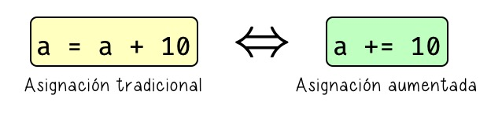
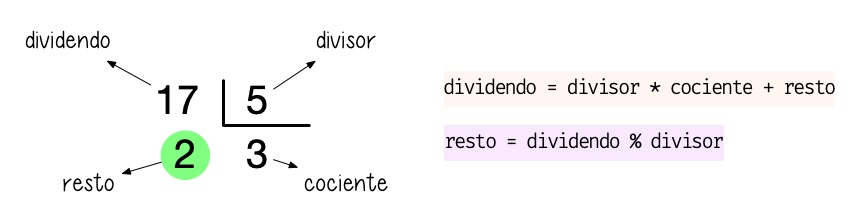

#######
Números
#######

En esta sección veremos los tipos de datos númericos que ofrece Python centrándonos en **booleanos**, **enteros** y **flotantes**. [#dice-unsplash]_

*********
Booleanos
*********

`George Boole`_ es considerado como uno de los fundadores del campo de las ciencias de la computación y fue el creador del `Álgebra de Boole`_ que da lugar, entre otras estructuras algebraicas, a la `Lógica binaria`_. En esta lógica las variables sólo pueden tomar dos valores discretos: **verdadero** o **falso**.

El tipo de datos ``bool`` proviene de lo explicado anteriormente y admite dos posibles valores:

* ``True`` que se corresponde con *verdadero* (y también con **1** en su representación numérica).
* ``False`` que se corresponde con *falso* (y también con **0** en su representación numérica).

Veamos un ejemplo de su uso::

    >>> is_opened = True
    >>> is_opened
    True

    >>> has_sugar = False
    >>> has_sugar
    False

La primera variable ``is_opened`` está representando el hecho de que algo esté abierto, y al tomar el valor ``True`` podemos concluir que sí. La segunda variable ``has_sugar`` nos indica si una bebida tiene azúcar; dado que toma el valor ``False`` inferimos que no lleva azúcar.

.. attention:: Tal y como se explicó en :ref:`este apartado <core/datatypes/data:Reglas para nombrar variables>`, los nombres de variables son "case-sensitive". De igual modo el tipo booleano toma valores ``True`` y ``False`` con **la primera letra en mayúsculas**. De no ser así obtendríamos un error sintáctico.

.. code-block::
    :emphasize-lines: 1, 5

    >>> is_opened = true
    Traceback (most recent call last):
      File "<stdin>", line 1, in <module>
    NameError: name 'true' is not defined
    >>> has_sugar = false
    Traceback (most recent call last):
      File "<stdin>", line 1, in <module>
    NameError: name 'false' is not defined

*******
Enteros
*******

Los números enteros no tienen decimales pero sí pueden contener signo y estar expresados en alguna base distinta de la usual (base 10).

Literales enteros
=================

Veamos algunos ejemplos de números enteros:

.. code-block::
    :emphasize-lines: 5, 18

    >>> 8
    8
    >>> 0
    0
    >>> 08
      File "<stdin>", line 1
        08
         ^
    SyntaxError: invalid token
    >>> 99
    99
    >>> +99
    99
    >>> -99
    -99
    >>> 3000000
    3000000
    >>> 3_000_000
    3000000

Dos detalles a tener en cuenta:

* No podemos comenzar un número entero por ``0``.
* Python permite dividir los números enteros con *guiones bajos* ``_`` para clarificar su lectura/escritura. A efectos prácticos es como si esos guiones bajos no existieran.

Operaciones con enteros
=======================

A continuación se muestra una tabla con las distintas operaciones sobre enteros que podemos realizar en Python:

.. csv-table:: Operaciones con enteros en Python
    :file: tables/int-ops.csv
    :header-rows: 1
    :class: longtable

Veamos algunas pruebas de estos operadores::

    >>> 2 + 8 + 4
    14
    >>> 4 ** 4
    256
    >>> 7 / 3
    2.3333333333333335
    >>> 7 // 3
    2
    >>> 6 / 0
    Traceback (most recent call last):
      File "<stdin>", line 1, in <module>
    ZeroDivisionError: division by zero

Es de buen estilo de programación **dejar un espacio** entre cada operador. Además hay que tener en cuenta que podemos obtener errores dependiendo de la operación (más bien de los *operandos*) que estemos utilizando, como es el caso de la *división por cero*.

Igualmente es importante tener en cuenta la **prioridad** de los distintos operadores:

.. csv-table::
    :file: tables/priority-ops.csv
    :header-rows: 1
    :class: longtable

Ejemplos de prioridad de operadores::

    >>> 2 ** 2 + 4 / 2
    6.0

    >>> 2 ** (2 + 4) / 2
    32.0

    >>> 2 ** (2 + 4 / 2)
    16.0

Asignación aumentada
--------------------

Python nos ofrece la posibilidad de escribir una `asignación aumentada <https://www.python.org/dev/peps/pep-0577/>`_ mezclando la *asignación* y un *operador*. 

    Asignación aumentada en Python

Supongamos que disponemos de 100 vehículos en stock y que durante el pasado mes se han vendido 20 de ellos. Veamos cómo sería el código con asignación tradicional vs. asignación aumentada:

.. code-block::
    :caption: Asignación tradicional
    :emphasize-lines: 3

    >>> total_cars = 100
    >>> sold_cars = 20
    >>> total_cars = total_cars - sold_cars
    >>> total_cars
    80

.. code-block::
    :caption: Asignación aumentada
    :emphasize-lines: 3

    >>> total_cars = 100
    >>> sold_cars = 20
    >>> total_cars -= sold_cars
    >>> total_cars
    80

Estas dos formas son equivalentes a nivel de resultados y funcionalidad, pero obviamente tienen diferencias de escritura y legibilidad. De este mismo modo, podemos aplicar un formato compacto al resto de operaciones::

    >>> random_number = 15

    >>> random_number += 5
    >>> random_number
    20

    >>> random_number *= 3
    >>> random_number
    60

    >>> random_number //= 4
    >>> random_number
    15

    >>> random_number **= 1
    >>> random_number
    15

Módulo
------

La operación **módulo** (también llamado **resto**), cuyo símbolo en Python es ``%``, se define como el resto de dividir dos números. Veamos un ejemplo para enteder bien su funcionamiento:

    Operador "módulo" en Python

.. code-block::
    :emphasize-lines: 5

    >>> dividendo = 17
    >>> divisor = 5

    >>> cociente = dividendo // divisor  # división entera
    >>> resto = dividendo % divisor

    >>> cociente
    3
    >>> resto
    2

Exponenciación
--------------

Para elevar un número a otro en Python utilizamos el operador de exponenciación ``**``::

    >>> 4 ** 3
    64
    >>> 4 * 4 * 4
    64

Se debe tener en cuenta que también podemos elevar un número entero a un **número decimal**. En este caso es como si estuviéramos haciendo una *raíz* [#root]_. Por ejemplo:

.. math::

    4^\frac{1}{2} = 4^{0.5} = \sqrt{4} = 2

Hecho en Python::

    >>> 4 ** 0.5
    2.0

.. admonition:: Ejercicio

    pycheck_: **quadratic**

Valor absoluto
--------------

Python ofrece la función ``abs()`` para obtener el valor absoluto de un número::

    >>> abs(-1)
    1

    >>> abs(1)
    1

    >>> abs(-3.14)
    3.14

    >>> abs(3.14)
    3.14

Límite de un entero
===================

|advlev|

¿Cómo de grande puede ser un ``int`` en Python? La respuesta es **de cualquier tamaño**. Por poner un ejemplo, supongamos que queremos representar un `centillón`_. Este valor viene a ser un "1" seguido por ¡600 ceros! ¿Será capaz Python de almacenarlo?

.. code-block::

    >>> centillion = 10 ** 600

    >>> centillion
    1000000000000000000000000000000000000000000000000000000000000000000000000000000000000000000000000000000000000000000000000000000000000000000000000000000000000000000000000000000000000000000000000000000000000000000000000000000000000000000000000000000000000000000000000000000000000000000000000000000000000000000000000000000000000000000000000000000000000000000000000000000000000000000000000000000000000000000000000000000000000000000000000000000000000000000000000000000000000000000000000000000000000000000000000000000000000000000000000000000000000000000000000000000000000000000000000000000000000000000000000

.. note:: En muchos lenguajes tratar con enteros tan largos causaría un "integer overflow". No es el caso de Python que puede manejar estos valores sin problema.

¿Qué pasaría si quisiéramos "romper" todas las barreras? Pongamos 10.000 dígitos...

.. code-block::

    >>> 10 ** 10_000
    Traceback (most recent call last):
      File "<stdin>", line 1, in <module>
    ValueError: Exceeds the limit (4300) for integer string conversion; use sys.set_int_max_str_digits() to increase the limit

Obtenemos un error... pero subsanable, ya que hay forma de ampliar este **límite inicial de 4300 dígitos** usando la función ``sys.set_int_max_str_digits()``

*********
Flotantes
*********

Los números en **punto flotante** [#floating-point]_ tienen **parte decimal**. Veamos algunos ejemplos de flotantes en Python.

.. code-block::
    :caption: Distintas formas de escribir el flotante *4.0*

    >>> 4.0
    4.0
    >>> 4.
    4.0
    >>> 04.0
    4.0
    >>> 04.
    4.0
    >>> 4.000_000
    4.0
    >>> 4e0  # 4.0 * (10 ** 0)
    4.0

Conversión de tipos
===================

El hecho de que existan distintos tipos de datos en Python (y en el resto de lenguajes de programación) es una ventaja a la hora de representar la información del mundo real de la mejor manera posible. Pero también se hace necesario buscar mecanismos para convertir unos tipos de datos en otros.

Conversión implícita
--------------------

Cuando mezclamos enteros, booleanos y flotantes, Python realiza automáticamente una conversión implícita (o **promoción**) de los valores al tipo de "mayor rango". Veamos algunos ejemplos de esto::

    >>> True + 25
    26
    >>> 7 * False
    0
    >>> True + False
    1
    >>> 21.8 + True
    22.8
    >>> 10 + 11.3
    21.3

Podemos resumir la conversión implícita en la siguiente tabla:

+----------+-----------+-----------+
|  Tipo 1  |  Tipo 2   | Resultado |
+==========+===========+===========+
| ``bool`` | ``int``   | ``int``   |
+----------+-----------+-----------+
| ``bool`` | ``float`` | ``float`` |
+----------+-----------+-----------+
| ``int``  | ``float`` | ``float`` |
+----------+-----------+-----------+

Se puede ver claramente que la conversión numérica de los valores booleanos es:

- ``True`` 👉 ``1``
- ``False`` 👉 ``0``

Conversión explícita
--------------------

Aunque más adelante veremos el concepto de **función**, desde ahora podemos decir que existen una serie de funciones para realizar conversiones explícitas de un tipo a otro:

``bool()``
    Convierte el tipo a *booleano*.

``int()``
    Convierte el tipo a *entero*.

``float()``
    Convierte el tipo a *flotante*.

Veamos algunos ejemplos de estas funciones::

    >>> bool(1)
    True
    >>> bool(0)
    False
    >>> int(True)
    1
    >>> int(False)
    0
    >>> float(1)
    1.0
    >>> float(0)
    0.0
    >>> float(True)
    1.0
    >>> float(False)
    0.0

En el caso de que usemos la función ``int()`` sobre un valor flotante nos retornará su **parte baja**:

.. math::
    int(x) = \big\lfloor x \big\rfloor

Por ejemplo::

    >>> int(3.1)
    3
    >>> int(3.5)
    3
    >>> int(3.9)
    3

Para **obtener el tipo** de una variable :ref:`ya hemos visto <core/datatypes/data:conocer el tipo de una variable>` la función ``type()``::

    >>> is_raining = False
    >>> type(is_raining)
    bool

    >>> sound_level = 35
    >>> type(sound_level)
    int

    >>> temperature = 36.6
    >>> type(temperature)
    float

Pero también existe la posibilidad seguimos **comprobar el tipo** que tiene una variable mediante la función ``isinstance()``::

    >>> isinstance(is_raining, bool)
    True
    >>> isinstance(sound_level, int)
    True
    >>> isinstance(temperature, float)
    True

.. admonition:: Ejercicio

    pycheck_: **sin_approx**

Errores de aproximación
=======================

|intlev|

Supongamos el siguiente cálculo::

    >>> (19 / 155) * (155 / 19)
        0.9999999999999999

Debería dar 1.0, pero no es así puesto que la representación interna de los valores en **coma flotante** sigue el estándar `IEEE 754`_ y estamos trabajando con `aritmética finita`_.

Aunque existen distintas formas de solventar esta limitación, de momento veremos una de las más sencillas utilizando la función "built-in" `round()`_  que nos permite redondear un número flotante a un número determinado de decimales::

    >>> pi = 3.14159265359

    >>> round(pi)
    3
    >>> round(pi, 1)
    3.1
    >>> round(pi, 2)
    3.14
    >>> round(pi, 3)
    3.142
    >>> round(pi, 4)
    3.1416
    >>> round(pi, 5)
    3.14159 

Para el caso del error de aproximación que nos ocupa::

    >>> result = (19 / 155) * (155 / 19)

    >>> round(result, 1)
    1.0

.. caution:: ``round()`` aproxima al valor más cercano, mientras que ``int()`` obtiene siepre el entero "por abajo".

Límite de un flotante
=====================

A diferencia de los :ref:`enteros <core/datatypes/numbers:límite de un entero>`, los números flotantes sí que tienen un límite en Python. Para descubrirlo podemos ejecutar el siguiente código::

    >>> import sys

    >>> sys.float_info.min
    2.2250738585072014e-308

    >>> sys.float_info.max
    1.7976931348623157e+308

*****
Bases
*****

|intlev|

Los valores numéricos con los que estamos acostumbrados a trabajar están en **base 10** (o decimal). Esto indica que disponemos de 10 "símbolos" para representar las cantidades. En este caso del ``0`` al ``9``.

Pero también es posible representar números en **otras bases**. Python nos ofrece una serie de **prefijos** y **funciones** para este cometido.

Base binaria
============

Cuenta con **2** símbolos para representar los valores: ``0`` y ``1``.

**Prefijo**: ``0b``

    >>> 0b1001
    9
    >>> 0b1100
    12

**Función**: ``bin()``

    >>> bin(9)
    '0b1001'
    >>> bin(12)
    '0b1100'

.. caution::
    Esta función devuelve una :ref:`cadena de texto <core/datatypes/strings:cadenas de texto>`.

Base octal
==========

Cuenta con **8** símbolos para representar los valores: ``0``, ``1``, ``2``, ``3``, ``4``, ``5``, ``6`` y ``7``.

**Prefijo**: ``0o``

    >>> 0o6243
    3235
    >>> 0o1257
    687

**Función**: ``oct()``

    >>> oct(3235)
    '0o6243'
    >>> oct(687)
    '0o1257'

.. caution::
    Esta función devuelve una :ref:`cadena de texto <core/datatypes/strings:cadenas de texto>`.

Base hexadecimal
================

Cuenta con **16** símbolos para representar los valores: ``0``, ``1``, ``2``, ``3``, ``4``, ``5``, ``6``, ``7``, ``8``, ``9``, ``A``, ``B``, ``C``, ``D``, ``E`` y ``F``.

**Prefijo**: ``0x``

    >>> 0x7F2A
    32554
    >>> 0x48FF
    18687

**Función**: ``hex()``

    >>> hex(32554)
    '0x7f2a'
    >>> hex(18687)
    '0x48ff'

.. caution::
    Esta función devuelve una :ref:`cadena de texto <core/datatypes/strings:cadenas de texto>`.

.. note:: Las letras para la representación hexadecimal no atienden a mayúsculas y minúsculas.

----

.. rubric:: EJERCICIOS DE REPASO

1. pycheck_: **circle_area**
2. pycheck_: **sphere_volume**
3. pycheck_: **triangle_area**
4. pycheck_: **interest_rate**
5. pycheck_: **euclid_distance**
6. pycheck_: **century_year**
7. pycheck_: **red_square**
8. pycheck_: **igic**
9. pycheck_: **super_fast**
10. pycheck_: **move_twice**
11. pycheck_: **pillars**
12. pycheck_: **clock_time**
13. pycheck_: **xor**

.. rubric:: EJERCICIOS EXTERNOS

1. `Cat years, dog years <https://www.codewars.com/kata/5a6663e9fd56cb5ab800008b>`_
2. `Aspect ratio cropping <https://www.codewars.com/kata/596e4ef7b61e25981200009f>`_
3. `USD => CNY <https://www.codewars.com/kata/5977618080ef220766000022>`_
4. `Third angle of a triangle <https://www.codewars.com/kata/5a023c426975981341000014>`_
5. `Keep hydrated! <https://www.codewars.com/kata/582cb0224e56e068d800003c>`_
6. `Price of mangoes <https://www.codewars.com/kata/57a77726bb9944d000000b06>`_
7. `Total pressure calculation <https://www.codewars.com/kata/5b7ea71db90cc0f17c000a5a>`_
8. `NBA full 48 minutes average <https://www.codewars.com/kata/587c2d08bb65b5e8040004fd>`_
9. `Age range compatibility equation <https://www.codewars.com/kata/5803956ddb07c5c74200144e>`_
10. `Formatting decimal places <https://www.codewars.com/kata/5641a03210e973055a00000d>`_

.. rubric:: AMPLIAR CONOCIMIENTOS

* `The Python Square Root Function <https://realpython.com/python-square-root-function/>`_
* `How to Round Numbers in Python <https://realpython.com/python-rounding/>`_
* `Operators and Expressions in Python <https://realpython.com/python-operators-expressions/>`_

.. --------------- Footnotes ---------------

.. [#dice-unsplash] Foto original de portada por `Brett Jordan`_ en Unsplash.
.. [#root] No siempre es una raíz cuadrada porque se invierten numerador y denominador.
.. [#floating-point] Punto o coma flotante es una `notación científica <https://es.wikipedia.org/wiki/Coma_flotante#:~:text=La%20representaci%C3%B3n%20de%20punto%20flotante,se%20pueden%20realizar%20operaciones%20aritm%C3%A9ticas.>`_ usada por computadores.

.. --------------- Hyperlinks ---------------

.. _Brett Jordan: https://unsplash.com/@brett_jordan?utm_source=unsplash&utm_medium=referral&utm_content=creditCopyText
.. _George Boole: https://es.wikipedia.org/wiki/George_Boole
.. _Álgebra de Boole: https://es.wikipedia.org/wiki/%C3%81lgebra_de_Boole
.. _Lógica binaria: https://es.wikipedia.org/wiki/L%C3%B3gica_binaria
.. _principio DRY: https://es.wikipedia.org/wiki/No_te_repitas
.. _centillón: https://es.wikipedia.org/wiki/Centill%C3%B3n
.. _discriminante: https://es.wikipedia.org/wiki/Discriminante
.. _IEEE 754: https://es.wikipedia.org/wiki/IEEE_754
.. _aritmética finita: https://www.unioviedo.es/compnum/laboratorios_py/Aritmetica_finita/Aritmetica_finita_y_error.html#Representaci%C3%B3n-de-los-n%C3%BAmeros-reales
.. _round(): https://docs.python.org/es/3/library/functions.html#round
.. _pycheck: https://pycheck.es
