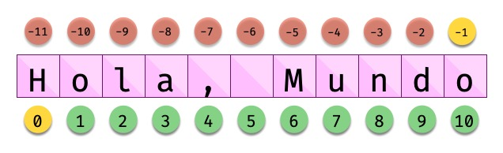
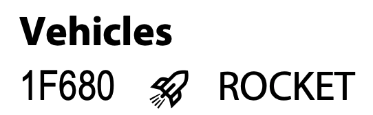

################
Cadenas de texto
################

Las cadenas de texto son **secuencias** de **caracteres**. También se les conoce como "strings" y nos permiten almacenar información textual de forma muy cómoda. [#newspaper-unsplash]_

Es importante destacar que Python 3 almacena los caracteres codificados en el estándar `Unicode`_, lo que es una gran ventaja con respecto a versiones antiguas del lenguaje. Además permite representar una cantidad ingente de símbolos incluyendo los famosos emojis 😎.

*****************
Creando "strings"
*****************

Para escribir una cadena de texto en Python basta con rodear los caracteres con comillas simples [#double-quotes]_::

    >>> 'Mi primera cadena en Python'
    'Mi primera cadena en Python'

Para incluir *comillas dobles* dentro de la cadena de texto no hay mayor inconveniente:

    >>> 'Los llamados "strings" son secuencias de caracteres'
    'Los llamados "strings" son secuencias de caracteres'

Para incluir *comillas simples* dentro de la cadena de texto cambiamos las comillas exteriores a comillas dobles:

    >>> "Los llamados 'strings' son secuencias de caracteres"
    "Los llamados 'strings' son secuencias de caracteres"

.. tip::
    Efectivamente, como se puede ver, las cadenas de texto en Python se pueden escribir con comillas simples o con comillas dobles. Es indiferente. **En mi caso personal prefiero usar comillas simples**.

    Elijas lo que elijas, ¡haz siempre lo mismo!

Comillas triples
================

Hay una forma alternativa de crear cadenas de texto y es utilizar *comillas triples*. Su uso está pensado principalmente para **cadenas multilínea**::

    >>> poem = """To be, or not to be, that is the question:
    ... Whether 'tis nobler in the mind to suffer
    ... The slings and arrows of outrageous fortune,
    ... Or to take arms against a sea of troubles"""

En este caso sí que se debería **utilizar comillas dobles** siguiendo las `indicaciones de la guía de estilo de Python`_:

    In Python, single-quoted strings and double-quoted strings are the same. This PEP does not make a recommendation for this. Pick a rule and stick to it. When a string contains single or double quote characters, however, use the other one to avoid backslashes in the string. It improves readability.

    For triple-quoted strings, always use double quote characters to be consistent with the docstring convention in PEP 257.

.. important:: Los tres puntos ``...`` que aparecen a la izquierda de las líneas no están incluidos en la cadena de texto. Es el símbolo que ofrece el intérprete de Python cuando saltamos de línea.

Cadena vacía
============

La cadena vacía es aquella que no contiene ningún carácter. Aunque a priori no lo pueda parecer, es un recurso importante en cualquier código. Su representación en Python es la siguiente:

    >>> ''
    ''

**********
Conversión
**********

Podemos crear "strings" a partir de otros tipos de datos usando la función ``str()``::

    >>> str(True)
    'True'
    >>> str(10)
    '10'
    >>> str(21.7)
    '21.7'

Para el caso contrario de convertir un "string" a un valor numérico, tenemos a disposición las funciones ya vistas::

    >>> int('10')
    10
    >>> float('21.7')
    21.7

Pero hay que tener en cuenta un detalle. La función ``int()`` también admite la **base** en la que se encuentra el número. Eso significa que podemos pasar un número, por ejemplo, en **hexadecimal** (como "string") y lo podríamos convertir a su valor entero::

    >>> int('FF', 16)
    255

.. note::
    La base por defecto que utiliza ``int()`` para convertir cadenas de texto es la **base decimal**.

********************
Secuencias de escape
********************

Python permite **escapar** el significado de algunos caracteres para conseguir otros resultados. Si escribimos una barra invertida ``\`` antes del carácter en cuestión, le otorgamos un significado especial.

Quizás la *secuencia de escape* más conocida es ``\n`` que representa un *salto de línea*, pero existen muchas otras::

    # Salto de línea
    >>> msg = 'Primera línea\nSegunda línea\nTercera línea'
    >>> print(msg)
    Primera línea
    Segunda línea
    Tercera línea

    # Tabulador
    >>> msg = 'Valor = \t40'
    >>> print(msg)
    Valor = 	40

    # Comilla simple
    >>> msg = 'Necesitamos \'escapar\' la comilla simple'
    >>> print(msg)
    Necesitamos 'escapar' la comilla simple

    # Barra invertida
    >>> msg = 'Capítulo \\ Sección \\ Encabezado'
    >>> print(msg)
    Capítulo \ Sección \ Encabezado

.. note:: Al utilizar la función ``print()`` es cuando vemos realmente el resultado de utilizar los caracteres escapados.
    
Expresiones literales
=====================

|intlev|

Hay situaciones en las que nos interesa que los caracteres especiales pierdan ese significado y poder usarlos de otra manera. Existe un modificar de cadena que proporciona Python para tratar el texto *en bruto*. Es el llamado "raw data" y se aplica anteponiendo una ``r`` a la cadena de texto.

Veamos algunos ejemplos::

    >>> text = 'abc\ndef'
    >>> print(text)
    abc
    def

    >>> text = r'abc\ndef'
    >>> print(text)
    abc\ndef

    >>> text = 'a\tb\tc'
    >>> print(text)
    a    b    c

    >>> text = r'a\tb\tc'
    >>> print(text)
    a\tb\tc

.. hint:: El modificador ``r''`` es muy utilizado para la escritura de **expresiones regulares**.

.. _more-print:

*********************
Más sobre ``print()``
*********************

Hemos estado utilizando la función ``print()`` de forma sencilla, pero admite `algunos parámetros <https://docs.python.org/es/3/library/functions.html#print>`_ interesantes:

.. code-block::
    :emphasize-lines: 4, 7, 10
    :linenos:

    >>> msg1 = '¿Sabes por qué estoy acá?'
    >>> msg2 = 'Porque me apasiona'

    >>> print(msg1, msg2)
    ¿Sabes por qué estoy acá? Porque me apasiona

    >>> print(msg1, msg2, sep='|')
    ¿Sabes por qué estoy acá?|Porque me apasiona

    >>> print(msg2, end='!!')
    Porque me apasiona!!

*Línea 4:*
    Podemos imprimir todas las variables que queramos separándolas por comas.
*Línea 7:*
    El *separador por defecto* entre las variables es un *espacio*, podemos cambiar el carácter que se utiliza como separador entre cadenas.
*Línea 10:*
    El *carácter de final de texto* es un *salto de línea*, podemos cambiar el carácter que se utiliza como final de texto.

************************
Leer datos desde teclado
************************

Los programas se hacen para tener interacción con el usuario. Una de las formas de interacción es solicitar la entrada de datos por teclado. Como muchos otros lenguajes de programación, Python también nos ofrece la posibilidad de leer la información introducida por teclado. Para ello se utiliza la función ``input()``::

    >>> name = input('Introduzca su nombre: ')
    Introduzca su nombre: Sergio
    >>> name
    'Sergio'
    >>> type(name)
    str

    >>> age = input('Introduzca su edad: ')
    Introduzca su edad: 41
    >>> age
    '41'
    >>> type(age)
    str

.. note:: La función ``input()`` siempre nos devuelve un objeto de tipo cadena de texto o ``str``. Tenerlo muy en cuenta a la hora de trabajar con números, ya que debemos realizar una :ref:`conversión explícita <core/datatypes/numbers:Conversión explícita>`.

.. warning::
    Aunque está permitido, **NUNCA** llames ``input`` a una variable porque destruirías la función que nos permite leer datos desde teclado. Y tampoco uses nombres derivados como ``_input`` o ``input_`` ya que no son nombres representativos que :ref:`identifiquen el propósito de la variable <core/datatypes/data:convenciones para nombres>`.

.. admonition:: Ejercicio
    :class: exercise

    Escriba un programa en Python que :ref:`lea por teclado <core/datatypes/strings:leer datos desde teclado>` dos números enteros y muestre por pantalla el resultado de realizar las operaciones básicas entre ellos.

    **Ejemplo**
        - Valores de entrada 7 y 4.
        - Salida esperada::

            7+4=11
            7-4=3
            7*4=28
            7/4=1.75

    .. hint::
        - Aproveche todo el potencial que ofrece :ref:`print() <more-print>` para conseguir la salida esperada
        - No utilice "f-strings".
        - Guarde el programa en un fichero ``calc.py`` y ejecútelo desde la terminal con: ``python calc.py``

    .. only:: html
    
        |solution| :download:`calc.py <files/calc.py>`
    
*************************
Operaciones con "strings"
*************************

Combinar cadenas
================

Podemos combinar dos o más cadenas de texto utilizando el operador ``+``::

    >>> proverb1 = 'Cuando el río suena'
    >>> proverb2 = 'agua lleva'

    >>> proverb1 + proverb2
    'Cuando el río suenaagua lleva'

    >>> proverb1 + ', ' + proverb2  # incluimos una coma
    'Cuando el río suena, agua lleva'

Repetir cadenas
===============

Podemos repetir dos o más cadenas de texto utilizando el operador ``*``::

    >>> reaction = 'Wow'

    >>> reaction * 4
    'WowWowWowWow'

Obtener un carácter
===================

Los "strings" están **indexados** y cada carácter tiene su propia posición. Para obtener un único carácter dentro de una cadena de texto es necesario especificar su **índice** dentro de corchetes ``[...]``.

    Indexado de una cadena de texto

Veamos algunos ejemplos de acceso a caracteres::

    >>> sentence = 'Hola, Mundo'

    >>> sentence[0]
    'H'
    >>> sentence[-1]
    'o'
    >>> sentence[4]
    ','
    >>> sentence[-5]
    'M'

.. tip:: Nótese que existen tanto **índices positivos** como **índices negativos** para acceder a cada carácter de la cadena de texto. A priori puede parecer redundante, pero es muy útil en determinados casos.

En caso de que intentemos acceder a un índice que no existe, obtendremos un error por *fuera de rango*:

    >>> sentence[50]
    Traceback (most recent call last):
      File "<stdin>", line 1, in <module>
    IndexError: string index out of range

.. warning:: Téngase en cuenta que el indexado de una cadena de texto siempre empieza en **0** y termina en **una unidad menos de la longitud** de la cadena.

Las cadenas de texto son tipos de datos :ref:`inmutables <core/datatypes/data:Mutabilidad>`. Es por ello que no podemos modificar un carácter directamente::

    >>> song = 'Hey Jude'

    >>> song[4] = 'D'
    Traceback (most recent call last):
      File "<stdin>", line 1, in <module>
    TypeError: 'str' object does not support item assignment

.. tip:: Existen formas de modificar una cadena de texto que veremos más adelante, aunque realmente no estemos transformando el original sino creando un nuevo objeto con las modificaciones.

.. warning:: No hay que confundir las :ref:`constantes <core/datatypes/data:constantes>` con los tipos de datos inmutables. Es por ello que las variables que almacenan cadenas de texto, a pesar de ser inmutables, no se escriben en mayúsculas.

Trocear una cadena
==================

Es posible extraer "trozos" ("rebanadas") de una cadena de texto [#slice]_. Tenemos varias aproximaciones para ello:

``[:]``
    Extrae la secuencia entera desde el comienzo hasta el final. Es una especia de **copia** de toda la cadena de texto.
``[start:]``
    Extrae desde ``start`` hasta el final de la cadena.
``[:end]``
    Extrae desde el comienzo de la cadena hasta ``end`` *menos 1*.
``[start:end]``
    Extrae desde ``start`` hasta ``end`` *menos 1*.
``[start:end:step]``
    Extrae desde ``start`` hasta ``end`` *menos 1* haciendo saltos de tamaño ``step``.

Veamos la aplicación de cada uno de estos accesos a través de un ejemplo::

    >>> proverb = 'Agua pasada no mueve molino'

    >>> proverb[:]
    'Agua pasada no mueve molino'

    >>> proverb[12:]
    'no mueve molino'

    >>> proverb[:11]
    'Agua pasada'

    >>> proverb[5:11]
    'pasada'

    >>> proverb[5:11:2]
    'psd'

.. important:: El troceado siempre llega a una unidad menos del índice final que hayamos especificado. Sin embargo el comienzo sí coincide con el que hemos puesto.

Longitud de una cadena
======================

Para obtener la longitud de una cadena podemos hacer uso de ``len()``, una función común a prácticamente todos los tipos y estructuras de datos en Python::

    >>> proverb = 'Lo cortés no quita lo valiente'
    >>> len(proverb)
    30

    >>> empty = ''
    >>> len(empty)
    0

Pertenencia de un elemento
==========================

Si queremos comprobar que una determinada subcadena se encuentra en una cadena de texto utilizamos el operador ``in`` para ello. Se trata de una expresión que tiene como resultado un valor "booleano" verdadero o falso::

    >>> proverb = 'Más vale malo conocido que bueno por conocer'

    >>> 'malo' in proverb
    True

    >>> 'bueno' in proverb
    True

    >>> 'regular' in proverb
    False

Habría que prestar atención al caso en el que intentamos descubrir si una subcadena **no está** en la cadena de texto::

    >>> dna_sequence = 'ATGAAATTGAAATGGGA'

    >>> not('C' in dna_sequence)  # Primera aproximación
    True

    >>> 'C' not in dna_sequence  # Forma pitónica
    True    

Limpiar cadenas
===============

Cuando leemos datos del usuario o de cualquier fuente externa de información, es bastante probable que se incluyan en esas cadenas de texto, *caracteres de relleno* [#padding]_ al comienzo y al final. Python nos ofrece la posibilidad de eliminar estos caracteres u otros que no nos interesen.

La función ``strip()`` se utiliza para eliminar caracteres del principio y del final de un "string". También existen variantes de esta función para aplicarla únicamente al comienzo o únicamente al final de la cadena de texto.

Supongamos que debemos procesar un fichero con números de serie de un determinado artículo. Cada línea contiene el valor que nos interesa pero se han "colado" ciertos caracteres de relleno que debemos limpiar::

    >>> serial_number = '\n\t   \n 48374983274832    \n\n\t   \t   \n'

    >>> serial_number.strip()
    '48374983274832'

.. note:: Si no se especifican los caracteres a eliminar, ``strip()`` usa por defecto cualquier combinación de *espacios en blanco*, *saltos de línea* ``\n`` y *tabuladores* ``\t``.

A continuación vamos a hacer "limpieza" por la izquierda (*comienzo*) y por la derecha (*final*) utilizando la función ``lstrip()`` y ``rstrip()`` respectivamente:

.. code-block::
    :caption: "Left strip"

    >>> serial_number.lstrip()
    '48374983274832    \n\n\t   \t   \n'

.. code-block::
    :caption: "Right strip"

    >>> serial_number.rstrip()
    '\n\t   \n 48374983274832'

Como habíamos comentado, también existe la posibilidad de especificar los caracteres que queremos borrar::

    >>> serial_number.strip('\n')
    '\t   \n 48374983274832    \n\n\t   \t   '

.. important:: La función ``strip()`` no modifica la cadena que estamos usando (*algo obvio porque los "strings" son inmutables*) sino que devuelve una nueva cadena de texto con las modificaciones pertinentes.

Realizar búsquedas
==================

Aunque hemos visto que la forma pitónica de saber si una subcadena se encuentra dentro de otra es :ref:`a través del operador in <core/datatypes/strings:Pertenencia de un elemento>`, Python nos ofrece distintas alternativas para realizar búsquedas en cadenas de texto.

Vamos a partir de una variable que contiene un trozo de la canción `Mediterráneo`_ de *Joan Manuel Serrat* para ejemplificar las distintas opciones que tenemos::

    >>> lyrics = """Quizás porque mi niñez
    ... Sigue jugando en tu playa
    ... Y escondido tras las cañas
    ... Duerme mi primer amor
    ... Llevo tu luz y tu olor
    ... Por dondequiera que vaya"""

Comprobar si una cadena de texto **empieza o termina por alguna subcadena**::

    >>> lyrics.startswith('Quizás')
    True

    >>> lyrics.endswith('Final')
    False

Encontrar la **primera ocurrencia** de alguna subcadena::

    >>> lyrics.find('amor')
    93

    >>> lyrics.index('amor')  # Same behaviour?
    93

Tanto ``find()`` como ``index()`` devuelven el **índice** de la primera ocurrencia de la subcadena que estemos buscando, pero se diferencian en su comportamiento cuando la subcadena buscada no existe::

    >>> lyrics.find('universo')
    -1

    >>> lyrics.index('universo')
    Traceback (most recent call last):
      File "<stdin>", line 1, in <module>
    ValueError: substring not found

Contabilizar el **número de veces que aparece** una subcadena::

    >>> lyrics.count('mi')
    2

    >>> lyrics.count('tu')
    3

    >>> lyrics.count('él')
    0

.. admonition:: Ejercicio

    pycheck_: **lost_word**

Reemplazar elementos
====================

Podemos usar la función ``replace()`` indicando la *subcadena a reemplazar*, la *subcadena de reemplazo* y *cuántas instancias* se deben reemplazar. Si no se especifica este último argumento, la sustitución se hará en todas las instancias encontradas::

    >>> proverb = 'Quien mal anda mal acaba'

    >>> proverb.replace('mal', 'bien')
    'Quien bien anda bien acaba'

    >>> proverb.replace('mal', 'bien', 1)  # sólo 1 reemplazo
    'Quien bien anda mal acaba'

Mayúsculas y minúsculas
=======================

Python nos permite realizar variaciones en los caracteres de una cadena de texto para pasarlos a mayúsculas y/o minúsculas. Veamos las distintas opciones disponibles::

    >>> proverb = 'quien a buen árbol se arrima Buena Sombra le cobija'

    >>> proverb
    'quien a buen árbol se arrima Buena Sombra le cobija'

    >>> proverb.capitalize()
    'Quien a buen árbol se arrima buena sombra le cobija'
    
    >>> proverb.title()
    'Quien A Buen Árbol Se Arrima Buena Sombra Le Cobija'
    
    >>> proverb.upper()
    'QUIEN A BUEN ÁRBOL SE ARRIMA BUENA SOMBRA LE COBIJA'
    
    >>> proverb.lower()
    'quien a buen árbol se arrima buena sombra le cobija'
    
    >>> proverb.swapcase()
    'QUIEN A BUEN ÁRBOL SE ARRIMA bUENA sOMBRA LE COBIJA'

Identificando caracteres
========================

Hay veces que recibimos información textual de distintas fuentes de las que necesitamos identificar qué tipo de caracteres contienen. Para ello Python nos ofrece un grupo de funciones.

Veamos **algunas** de estas funciones:

.. code-block::
    :caption: Detectar si todos los caracteres son letras o números

    >>> 'R2D2'.isalnum()
    True
    >>> 'C3-PO'.isalnum()
    False

.. code-block::
    :caption: Detectar si todos los caracteres son números

    >>> '314'.isnumeric()
    True
    >>> '3.14'.isnumeric()
    False

.. code-block::
    :caption: Detectar si todos los caracteres son letras

    >>> 'abc'.isalpha()
    True
    >>> 'a-b-c'.isalpha()
    False

.. code-block::
    :caption: Detectar mayúsculas/minúsculas

    >>> 'BIG'.isupper()
    True
    >>> 'small'.islower()
    True
    >>> 'First Heading'.istitle()
    True

************************
Interpolación de cadenas
************************

En este apartado veremos cómo **interpolar** valores dentro de cadenas de texto utilizando diferentes formatos. Interpolar (en este contexto) significa sustituir una variable por su valor dentro de una cadena de texto.

Veamos los estilos que proporciona Python para este cometido:

+----------------+-------------+--------------+
|     Nombre     |   Símbolo   |   Soportado  |
+================+=============+==============+
| Estilo antiguo | ``%``       | >= Python2   |
+----------------+-------------+--------------+
| Estilo "nuevo" | ``.format`` | >= Python2.6 |
+----------------+-------------+--------------+
| "f-strings"    | ``f''``     | >= Python3.6 |
+----------------+-------------+--------------+

Aunque aún podemos encontrar código con el `estilo antiguo y el estilo nuevo en el formateo de cadenas <https://pyformat.info/>`_, vamos a centrarnos en el análisis de los **"f-strings"** que se están utilizando bastante en la actualidad.

"f-strings"
===========

Los **f-strings** `aparecieron en Python 3.6 <https://docs.python.org/es/3/whatsnew/3.6.html#new-features>`_ y se suelen usar en código de nueva creación. Es la forma más potente -- y en muchas ocasiones más eficiente -- de formar cadenas de texto incluyendo valores de otras variables.

La **interpolación** en cadenas de texto es un concepto que existe en la gran mayoría de lenguajes de programación y hace referencia al hecho de sustituir los nombres de variables por sus valores cuando se construye un "string".

Para indicar en Python que una cadena es un "f-string" basta con precederla de una ``f`` e incluir las variables o expresiones a interpolar entre llaves ``{...}``.

Supongamos que disponemos de los datos de una persona y queremos formar una frase de bienvenida con ellos::

    >>> name = 'Elon Musk'
    >>> age = 49
    >>> fortune = 43_300

    >>> f'Me llamo {name}, tengo {age} años y una fortuna de {fortune} millones'
    'Me llamo Elon Musk, tengo 49 años y una fortuna de 43300 millones'

.. warning:: Si olvidamos poner la **f** delante del "string" no conseguiremos sustitución de variables.

Podría surgir la duda de cómo incluir llaves dentro de la cadena de texto, teniendo en cuenta que las llaves son símbolos especiales para la interpolación de variables. La respuesta es duplicar las llaves::

    >>> x = 10

    >>> f'The variable is {{ x = {x} }}'
    'The variable is { x = 10 }'

Formateando cadenas
-------------------

|intlev|

Los "f-strings" proporcionan una gran variedad de **opciones de formateado**: ancho del texto, número de decimales, tamaño de la cifra, alineación, etc. Muchas de estas facilidades se pueden consultar en el artículo `Best of Python3.6 f-strings`_ [#best-fstrings]_

**Dando formato a valores enteros:**

.. code-block::

    >>> mount_height = 3718

    >>> f'{mount_height:10d}'
    '      3718'

    >>> f'{mount_height:010d}'
    '0000003718'

.. tip::
    Utilizamos el modificador ``d`` que viene de *entero decimal*.

**Dando formato a valores flotantes:**

.. code-block::

    >>> PI = 3.14159265

    >>> f'{PI:f}'  # 6 decimales por defecto
    '3.141593'

    >>> f'{PI:.3f}'
    '3.142'

    >>> f'{PI:12f}'
    '    3.141593'

    >>> f'{PI:7.2f}'
    '   3.14'

    >>> f'{PI:07.2f}'
    '0003.14'

    >>> f'{PI:.010f}'
    '3.1415926500'

    >>> f'{PI:e}'
    '3.141593e+00'

.. tip::
    Utilizamos el modificador ``f`` que viene de *flotante*.

**Dando formato a cadenas de texto**

.. code-block::

    >>> text1 = 'how'
    >>> text2 = 'are'
    >>> text3 = 'you'

    >>> f'{text1:<7s}|{text2:^11s}|{text3:>7s}'
    'how    |    are    |    you'

    >>> f'{text1:-<7s}|{text2:·^11s}|{text3:->7s}'
    'how----|····are····|----you'

.. tip::
    Utilizamos el modificador ``s`` que viene de *string*.

**Convirtiendo valores enteros a otras bases:**

.. code-block::

    >>> value = 65_321

    >>> f'{value:b}'
    '1111111100101001'

    >>> f'{value:o}'
    '177451'

    >>> f'{value:x}'
    'ff29'

Por supuesto en el caso de otras bases también es posible aplicar los mismos **modificadores de ancho y de relleno** vistos para números enteros decimales. Por ejemplo:

.. code-block::
    
    >>> f'{value:07x}'
    '000ff29'

.. seealso::
    Nótese la diferencia de obtener el cambio de base con este método frente a las :ref:`funciones de cambio de base <core/datatypes/numbers:bases>` ya vistas previamente que añaden el prefijo de cada base ``0b``, ``0o`` y ``0x``.

Modo "debug"
------------

A partir de Python 3.8, los "f-strings" permiten imprimir el nombre de la variable y su valor, como un atajo para depurar nuestro código. Para ello sólo tenemos que incluir un símbolo ``=`` después del nombre de la variable::

    >>> serie = 'The Simpsons'
    >>> imdb_rating = 8.7
    >>> num_seasons = 30

    >>> f'{serie=}'
    "serie='The Simpsons'"

    >>> f'{imdb_rating=}'
    'imdb_rating=8.7'

    >>> f'{serie[4:]=}'  # incluso podemos añadir expresiones!
    "serie[4:]='Simpsons'"

    >>> f'{imdb_rating / num_seasons=}'
    'imdb_rating / num_seasons=0.29'

Modo "representación"
---------------------

Si imprimimos el valor de una variable utilizando un "f-string", obviamente veremos ese valor tal y como esperaríamos::

    >>> name = 'Steven Spielberg'

    >>> print(f'{name}')
    Steven Spielberg

Pero si quisiéramos ver la **representación** del objeto, tal y como se almacena internamente, podríamos utilizar el modificador ``!r`` en el "f-string"::

    >>> name = 'Steven Spielberg'

    >>> print(f'{name!r}')
    'Steven Spielberg'

En este caso se han añadido las comillas denotando que es una cadena de texto. Este modificador se puede aplicar a cualquier otro tipo de dato.

.. admonition:: Ejercicio
    :class: exercise

    Dada la variable::

        e = 2.71828
    
    , obtenga los siguientes resultados utilizando "f-strings"::

        '2.718'
        '2.718280'
        '    2.72'  # 4 espacios en blanco
        '2.718280e+00'
        '00002.7183'
        '            2.71828'  # 12 espacios en blanco

    Aproveche para hacer el ejercicio directamente en el intérprete de Python: ``>>>``

    .. only:: html
    
        |solution| :download:`fstrings.py <files/fstrings.py>`

******************
Caracteres Unicode
******************

Python trabaja *por defecto* con caracteres **Unicode**. Eso significa que tenemos acceso a la `amplia carta de caracteres <https://unicode-table.com/en/blocks/>`_ que nos ofrece este estándar de codificación.

Supongamos un ejemplo sobre el típico "emoji" de un **cohete** definido `en este cuadro <https://unicode-table.com/en/1F680/>`_:

    Representación Unicode del carácter ROCKET

La función ``chr()`` permite representar un carácter **a partir de su código**::

    >>> rocket_code = 0x1F680
    >>> rocket = chr(rocket_code)
    >>> rocket
    '🚀'

La función ``ord()`` permite obtener el código (decimal) de un carácter **a partir de su representación**::

    >>> rocket_code = hex(ord(rocket))
    >>> rocket_code
    '0x1f680'

El modificador ``\N`` permite representar un carácter **a partir de su nombre**::

    >>> '\N{ROCKET}'
    '🚀' 

.. seealso::
    `Tabla ASCII`_

.. admonition:: Ejercicio

    pycheck_: **find_unicode**

Comparar cadenas
================

Cuando comparamos dos cadenas de texto lo hacemos en términos **lexicográficos**. Es decir, se van comparando los caracteres de ambas cadenas uno a uno y se va mirando cuál está "antes".

Por ejemplo::

    >>> 'arca' < 'arpa' # 'ar' es igual para ambas
    True

    >>> ord('c')
    99
    >>> ord('p')
    112

.. note::
    Internamente se utiliza la función ``ord()`` para comparar qué carácter está "antes".

Otros ejemplos::

    >>> 'a' < 'antes'
    True

    >>> 'antes' < 'después'
    True

    >>> 'después' < 'ahora'
    False

    >>> 'ahora' < 'a'
    False

Tener en cuenta que en Python la letras mayúsculas van antes que las minúsculas::

    >>> 'A' < 'a'
    True

    >>> ord('A')
    65
    >>> ord('a')
    97

************
Casos de uso
************

|advlev|

Hemos estado usando muchas funciones de objetos tipo "string" (y de otros tipos previamente). Pero quizás no sabemos aún como podemos descubrir todo lo que podemos hacer con ellos y los **casos de uso** que nos ofrece.

Python proporciona una :ref:`función "built-in" <core/datatypes/data:Funciones "built-in">` llamada ``dir()`` para inspeccionar un determinado tipo de objeto::

    >>> text = 'This is it!'

    >>> dir(text)
    ['__add__',
     '__class__',
     '__contains__',
     '__delattr__',
     '__dir__',
     '__doc__',
     '__eq__',
     '__format__',
     '__ge__',
     '__getattribute__',
     '__getitem__',
     '__getnewargs__',
     '__gt__',
     '__hash__',
     '__init__',
     '__init_subclass__',
     '__iter__',
     '__le__',
     '__len__',
     '__lt__',
     '__mod__',
     '__mul__',
     '__ne__',
     '__new__',
     '__reduce__',
     '__reduce_ex__',
     '__repr__',
     '__rmod__',
     '__rmul__',
     '__setattr__',
     '__sizeof__',
     '__str__',
     '__subclasshook__',
     'capitalize',
     'casefold',
     'center',
     'count',
     'encode',
     'endswith',
     'expandtabs',
     'find',
     'format',
     'format_map',
     'index',
     'isalnum',
     'isalpha',
     'isascii',
     'isdecimal',
     'isdigit',
     'isidentifier',
     'islower',
     'isnumeric',
     'isprintable',
     'isspace',
     'istitle',
     'isupper',
     'join',
     'ljust',
     'lower',
     'lstrip',
     'maketrans',
     'partition',
     'replace',
     'rfind',
     'rindex',
     'rjust',
     'rpartition',
     'rsplit',
     'rstrip',
     'split',
     'splitlines',
     'startswith',
     'strip',
     'swapcase',
     'title',
     'translate',
     'upper',
     'zfill']

Esto es aplicable tanto a variables como a literales e incluso a tipos de datos (clases) explícitos::

    >>> dir(10)
    ['__abs__',
     '__add__',
     '__and__',
     '__bool__',
     ...
     'imag',
     'numerator',
     'real',
     'to_bytes']
    
    >>> dir(float)
    ['__abs__',
     '__add__',
     '__bool__',
     '__class__',
     ...
     'hex',
     'imag',
     'is_integer',
     'real']

----

.. rubric:: EJERCICIOS DE REPASO

1. pycheck_: **switch_name**
2. pycheck_: **samba_split**
3. pycheck_: **nif_digit**
4. pycheck_: **n_repeat**
5. pycheck_: **str_metric**
6. pycheck_: **h2md**
7. pycheck_: **count_sheeps**
8. pycheck_: **strip1**
9. pycheck_: **swap_name**
10. pycheck_: **find_integral**
11. pycheck_: **multiply_jack**

.. rubric:: AMPLIAR CONOCIMIENTOS

* `A Guide to the Newer Python String Format Techniques <https://realpython.com/python-formatted-output/>`_
* `Strings and Character Data in Python <https://realpython.com/courses/python-strings/>`_
* `How to Convert a Python String to int <https://realpython.com/convert-python-string-to-int/>`_
* `Your Guide to the Python print<> Function <https://realpython.com/python-print/>`_
* `Basic Input, Output, and String Formatting in Python <https://realpython.com/python-input-output/>`_
* `Unicode & Character Encodings in Python: A Painless Guide <https://realpython.com/python-encodings-guide/>`_
* `Python String Formatting Tips & Best Practices <https://realpython.com/courses/python-string-formatting-tips-best-practices/>`_
* `Python 3's f-Strings: An Improved String Formatting Syntax <https://realpython.com/courses/python-3-f-strings-improved-string-formatting-syntax/>`_
* `Splitting, Concatenating, and Joining Strings in Python <https://realpython.com/courses/splitting-concatenating-and-joining-strings-python/>`_
* `Conditional Statements in Python <https://realpython.com/python-conditional-statements/>`_
* `Python String Formatting Best Practices <https://realpython.com/python-string-formatting/>`_

.. --------------- Footnotes ---------------

.. [#newspaper-unsplash] Foto original de portada por `Roman Kraft`_ en Unsplash.
.. [#slice] El término usado en inglés es *slice*.
.. [#padding] Se suele utilizar el término inglés "padding" para referirse a estos caracteres.
.. [#best-fstrings] Escrito por Nirant Kasliwal en Medium.
.. [#tenerife-sea] "Tenerife Sea" por Ed Sheeran.
.. [#double-quotes] También es posible utilizar comillas dobles. Yo me he decantado por las comillas simples ya que quedan más limpias y suele ser el formato que devuelve el propio intérprete de Python.

.. --------------- Hyperlinks ---------------

.. _Roman Kraft: https://unsplash.com/@romankraft?utm_source=unsplash&utm_medium=referral&utm_content=creditCopyText
.. _Mediterráneo: https://open.spotify.com/track/7Bewui7KtaMzROeteRitRz?si=NGwOUmwfRSuapY3JL7s1uQ
.. _Best of Python3.6 f-strings: https://medium.com/@NirantK/best-of-python3-6-f-strings-41f9154983e
.. _Unicode: https://es.wikipedia.org/wiki/Unicode
.. _Tabla ASCII: https://www.asciitable.com/
.. _pycheck: https://pycheck.es
.. _indicaciones de la guía de estilo de Python: https://peps.python.org/pep-0008/#string-quotes
