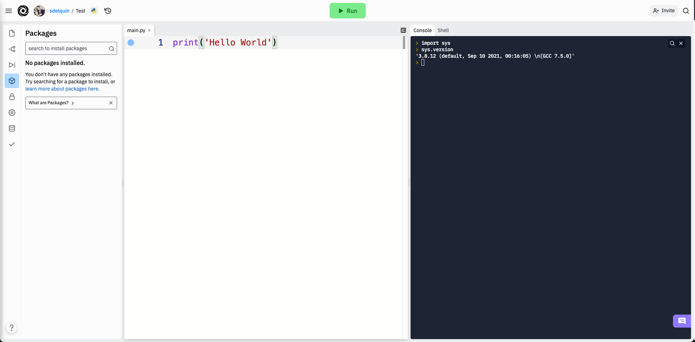

#############
Contexto real
#############

.. image:: img/spacex-uj3hvdfQujI-unsplash.jpg

Hemos visto que :ref:`Thonny <core/devenv/thonny:Thonny>` es una herramienta especialmente diseñada para el aprendizaje de Python, integrando diferentes módulos que facilitan su gestión. Si bien lo podemos utilizar para un desarrollo más *"serio"*, se suele recurrir a un flujo de trabajo algo diferente en **contextos más reales**. [#rocket-unsplash]_

******
Python
******

La forma más habitual de instalar Python (junto con sus librerías) es descargarlo e instalarlo desde su página oficial:

* `Versiones de Python para Windows`_
* `Versiones de Python para Mac`_
* `Versiones de Python para Linux`_

Anaconda
========

Otra de las alternativas para disponer de Python es nuestro sistema y que además es muy utilizada, es **Anaconda**. Se trata de un *conjunto de herramientas*, orientadas en principio a la *ciencia de datos*, pero que podemos utilizarlas para desarrollo general en Python (junto con otras librerías adicionales). Existen versiones de pago, pero la distribución *Individual Edition* es "open-source" y gratuita. Se puede descargar desde los siguientes enlaces:

* `Anaconda 64-bits para Windows`_
* `Anaconda 64-bits para Mac`_
* `Anaconda 64-bits para Linux`_

.. seealso:: `Miniconda`_ es un instalador mínimo que trae por defecto Python y un pequeño número de paquetes útiles.

*******************
Gestión de paquetes
*******************

La instalación limpia [#vanilla-installation]_ de Python ya ofrece de por sí muchos paquetes y módulos que vienen por defecto. Es lo que se llama la `librería estándar`_. Pero una de las características más destacables de Python es su inmenso "ecosistema" de paquetes disponibles en el `Python Package Index (PyPI)`_.

Para gestionar los paquetes que tenemos en nuestro sistema se utiliza la herramienta `pip`_, una utilidad que también se incluye en la instalación de Python. Con ella podremos instalar, desinstalar y actualizar paquetes, según nuestras necesidades. A continuación se muestran las instrucciones que usaríamos para cada una de estas operaciones:

.. code-block::
    :caption: Instalación, desinstalación y actualización del paquete ``pandas`` utilizando ``pip``

    $ pip install pandas
    $ pip uninstall pandas
    $ pip install pandas --upgrade

******************
Entornos virtuales
******************

Cuando trabajamos en distintos proyectos, no todos ellos requieren los mismos paquetes ni siquiera la misma versión de Python. La gestión de estas situaciones no es sencilla si únicamente instalamos paquetes y manejamos configuraciones a nivel global (*a nivel de máquina*). Es por ello que surge el concepto de **entornos virtuales**. Como su propio nombre indica se trata de crear distintos entornos en función de las necesidades de cada proyecto, y esto nos permite establecer qué versión de Python usaremos y qué paquetes instalaremos.

virtualenv
==========

El paquete "built-in" de Python que nos proporciona la funcionalidad de crear y gestionar entornos virtuales se denomina `virtualenv`_. Su instalación es sencilla a través del gestor de paquetes ``pip``::

    $ pip install virtualenv

Si bien con ``virtualenv`` tenemos las funcionalidades necesarias para trabajar con entornos virtuales, destacaría una herramienta llamada `virtualenvwrapper`_ que funciona *por encima* de ``virtualenv`` y que facilita las operaciones sobre entornos virtuales. Su instalación es equivalente a cualquier otro paquete Python::

    $ pip install virtualenvwrapper

Veamos a continuación algunos de los comandos que nos ofrece:

.. code-block::
    :emphasize-lines: 1, 12, 26, 27

    $ ~/project1 > mkvirtualenv env1
    Using base prefix '/Library/Frameworks/Python.framework/Versions/3.7'
    New python executable in /Users/sdelquin/.virtualenvs/env1/bin/python3.7
    Also creating executable in /Users/sdelquin/.virtualenvs/env1/bin/python
    Installing setuptools, pip, wheel...
    done.
    virtualenvwrapper.user_scripts creating /Users/sdelquin/.virtualenvs/env1/bin/predeactivate
    virtualenvwrapper.user_scripts creating /Users/sdelquin/.virtualenvs/env1/bin/postdeactivate
    virtualenvwrapper.user_scripts creating /Users/sdelquin/.virtualenvs/env1/bin/preactivate
    virtualenvwrapper.user_scripts creating /Users/sdelquin/.virtualenvs/env1/bin/postactivate
    virtualenvwrapper.user_scripts creating /Users/sdelquin/.virtualenvs/env1/bin/get_env_details
    $ (env1) ~/project1 > pip install requests
    Collecting requests
    Using cached requests-2.24.0-py2.py3-none-any.whl (61 kB)
    Collecting idna<3,>=2.5
    Using cached idna-2.10-py2.py3-none-any.whl (58 kB)
    Collecting certifi>=2017.4.17
    Using cached certifi-2020.6.20-py2.py3-none-any.whl (156 kB)
    Collecting urllib3!=1.25.0,!=1.25.1,<1.26,>=1.21.1
    Using cached urllib3-1.25.10-py2.py3-none-any.whl (127 kB)
    Collecting chardet<4,>=3.0.2
    Using cached chardet-3.0.4-py2.py3-none-any.whl (133 kB)
    Installing collected packages: idna, certifi, urllib3, chardet, requests
    Successfully installed certifi-2020.6.20 chardet-3.0.4 idna-2.10 requests-2.24.0 urllib3-1.25.10
    $ (env1) ~/project1 > deactivate
    $ ~/project1 > workon env1
    $ (env1) ~/project1 > lssitepackages
    __pycache__                 distutils-precedence.pth    pkg_resources               urllib3-1.25.10.dist-info
    _distutils_hack             easy_install.py             requests                    wheel
    certifi                     idna                        requests-2.24.0.dist-info   wheel-0.34.2.dist-info
    certifi-2020.6.20.dist-info idna-2.10.dist-info         setuptools
    chardet                     pip                         setuptools-49.3.2.dist-info
    chardet-3.0.4.dist-info     pip-20.2.2.dist-info        urllib3
    $ (env1) ~/project1 >

* ``$ mkvirtualenv env1``: crea un entorno virtual llamado ``env1``
* ``$ pip install requests``: instala el paquete ``requests`` dentro del entorno virtual ``env1``
* ``$ workon env1``: activa el entorno virtual ``env1``
* ``$ lssitepackages``: lista los paquetes instalados en el entorno virtual activo

pyenv
=====

pyenv permite cambiar fácilmente entre múltiples versiones de Python en un mismo sistema. Su instalación engloba varios pasos y está bien explicada en la `página del proyecto <https://github.com/pyenv/pyenv#installation>`_.

La mayor diferencia con respecto a :ref:`virtualenv <core/devenv/real-context:virtualenv>` es que no instala las distintas versiones de Python a nivel global del sistema. En vez de eso, se suele crear una carpeta ``.pyenv`` en el HOME del usuario, donde todo está aislado sin generar intrusión en el sistema operativo.

Podemos hacer cosas como:

- Listar las versiones de Python instaladas:

.. code-block:: console

    $ pyenv versions
      3.7.4
      * 3.5.0 (set by /Users/yuu/.pyenv/version)
      miniconda3-3.16.0
      pypy-2.6.0

- Descubrir la versión global "activa" de Python:

.. code-block:: console

    $ python --version
    Python 3.5.0

- Cambiar la versión global "activa" de Python:

.. code-block:: console

    $ pyenv global 3.7.4

    $ python --version
    Python 3.7.4

- Instalar una nueva versión de Python:

.. code-block:: console

    $ pyenv install 3.9.1
    ...

- Activar una versión de Python local por carpetas:

.. code-block:: console

    $ cd /cool-project
    $ pyenv local 3.9.1
    $ python --version
    Python 3.9.1

También existe un módulo denominado `pyenv-virtualenv`_ para manejar entornos virtuales utilizando las ventajas que proporciona *pyenv*.

********
Editores
********

Existen multitud de editores en el mercado que nos pueden servir perfectamente para escribir código Python. Algunos de ellos incorporan funcionalidades extra y otros simplemente nos permiten editar ficheros. Cabe destacar aquí el concepto de **Entorno de Desarrollo Integrado**, más conocido por sus siglas en inglés **IDE** [#ide]_. Se trata de una `aplicación informática <https://es.wikipedia.org/wiki/Entorno_de_desarrollo_integrado>`_ que proporciona servicios integrales para el desarrollo de software.

Podríamos decir que :ref:`Thonny <core/devenv/thonny:Thonny>` es un IDE de aprendizaje, pero existen muchos otros. Veamos un listado de editores de código que se suelen utilizar para desarrollo en Python:

* Editores generales o IDEs con soporte para Python:
    * `Eclipse`_ + `PyDev`_
    * `Sublime Text`_
    * `Atom`_
    * `GNU Emacs`_
    * `Vi-Vim`_
    * `Visual Studio`_ (+ `Python Tools <http://pytools.codeplex.com/>`__)
    * `Visual Studio Code`_  (+ `Python Tools <https://marketplace.visualstudio.com/items?itemName=ms-python.python>`__)
* Editores o IDEs específicos para Python:
    * `PyCharm`_
    * `Spyder`_
    * `Thonny`_

Cada editor tiene sus características (ventajas e inconvenientes). Supongo que la preferencia por alguno de ellos estará en base a la experiencia y a las necesidades que surjan. La parte buena es que hay diversidad de opciones para elegir.

****************
Jupyter Notebook
****************

`Jupyter Notebook <https://jupyter.org/install.html>`__ es una aplicación "open-source" que permite crear y compartir documentos que contienen código, ecuaciones, visualizaciones y texto narrativo. Podemos utilizarlo para propósito general aunque suele estar más enfocado a *ciencia de datos*: limpieza y transformación de datos, simulación numérica, modelado estadístico, visualización o "machine-learning" [#machine-learning]_.

Podemos verlo como un intérprete de Python (contiene un "kernel" [#kernel]_ que permite ejecutar código) con la capacidad de incluir documentación en formato `Markdown`_, lo que potencia sus funcionalidades y lo hace adecuado para preparar cualquier tipo de material vinculado con lenguajes de programación.

Aunque su uso está más extendido en el mundo Python, `existen muchos otros "kernels" <https://github.com/jupyter/jupyter/wiki/Jupyter-kernels>`_ sobre los que trabajar en Jupyter Notebook.

.. seealso::
    Sección sobre :ref:`Jupyter <pypi/datascience/jupyter:jupyter>`.

*******
repl.it
*******

`repl.it <https://replit.com/>`__ es un **servicio web que ofrece un entorno de desarrollo integrado** para programar en más de 50 lenguajes (Python incluido).

Es gratuito y de uso colaborativo. Se requiere una cuenta en el sistema para utilizarlo. El hecho de no requerir instalación ni configuración previa lo hace atractivo en determinadas circunstancias.

    repl.it

En su versión gratuita ofrece:

- Almacenamiento de 500MB.
- Python 3.8.2 (febrero de 2022).
- 117 paquetes preinstalados (febrero de 2022).
- Navegador (y subida) de ficheros integrado.
- Gestor de paquetes integrado.
- Integración con GitHub.
- Gestión de secretos (datos sensibles).
- Base de datos clave-valor ya integrada.
- Acceso (limitado) al sistema operativo y sistema de ficheros.

******
WSL
******

Si estamos trabajando en un sistema **Windows 10** es posible que nos encontremos más cómodos usando una terminal tipo "Linux", entre otras cosas para poder usar con facilidad las herramientas vistas en esta sección y preparar el entorno de desarrollo Python. Durante mucho tiempo esto fue difícil de conseguir hasta que *Microsoft* sacó WSL.

`WSL <https://es.wikipedia.org/wiki/Windows_Subsystem_for_Linux>`_ [#wsl-acronym]_ nos proporciona una *consola con entorno Linux* que podemos utilizar en nuestro *Windows 10* sin necesidad de instalar una máquina virtual o crear una partición para un Linux nativo. Es importante también saber que existen dos versiones de WSL hoy en día: WSL y WSL2. La segunda es bastante reciente (publicada a mediados de 2019), tiene mejor rendimiento y se adhiere más al comportamiento de un Linux nativo.

Para la instalación de WSL [#wsl-installation]_ hay que seguir los siguientes pasos:

1. Lanzamos Powershell con permisos de administrador.
2. Activamos la característica de WSL::

    $ Enable-WindowsOptionalFeature -Online -FeatureName Microsoft-Windows-Subsystem-Linux

3. Descargamos la imagen de Ubuntu 20.04 que usaremos::

    $ Invoke-WebRequest -Uri https://aka.ms/wslubuntu2004 -OutFile Ubuntu.appx -UseBasicParsing

4. Finalmente, la instalamos::

    $ Add-AppxPackage .\Ubuntu.appx

En este punto, WSL debería estar instalado correctamente, y debería también aparecer en el *menú Inicio*.

.. --------------- Footnotes ---------------

.. [#rocket-unsplash] Foto original de portada por `SpaceX <https://unsplash.com/@spacex?utm_source=unsplash&utm_medium=referral&utm_content=creditCopyText>`_ en Unsplash.
.. [#vanilla-installation] También llamada "vanilla installation" ya que es la que viene por defecto y no se hace ningúna personalización.
.. [#ide] Integrated Development Environment.
.. [#machine-learning] Término inglés utilizado para hacer referencia a algoritmos de aprendizaje automático.
.. [#kernel] Proceso específico para un lenguaje de programación que ejecuta instrucciones y actúa como interfaz de entrada/salida.
.. [#wsl-acronym] Windows Subsystem for Linux.
.. [#wsl-installation] Tutorial de `instalación de WSL <https://reachmnadeem.wordpress.com/2021/02/15/install-wsl-2-on-windows-10-using-powershell-command-line/>`_.

.. --------------- Hyperlinks ---------------

.. _Versiones de Python para Windows: https://www.python.org/downloads/windows/
.. _Versiones de Python para Mac: https://www.python.org/downloads/mac-osx/
.. _Versiones de Python para Linux: https://www.python.org/downloads/source/
.. _Anaconda 64-bits para Windows: https://repo.anaconda.com/archive/Anaconda3-2020.07-Windows-x86_64.exe
.. _Anaconda 64-bits para Mac: https://repo.anaconda.com/archive/Anaconda3-2020.07-MacOSX-x86_64.pkg
.. _Anaconda 64-bits para Linux: https://repo.anaconda.com/archive/Anaconda3-2020.07-Linux-x86_64.sh
.. _librería estándar: https://docs.python.org/es/3.8/tutorial/stdlib.html
.. _Python Package Index (PyPI): https://pypi.org/
.. _pip: https://pip.pypa.io/en/stable/
.. _virtualenv: https://pypi.org/project/virtualenv/
.. _virtualenvwrapper: https://virtualenvwrapper.readthedocs.io/en/latest/
.. _Eclipse: http://www.eclipse.org/
.. _PyDev: https://www.pydev.org/
.. _Sublime Text: http://www.sublimetext.com/
.. _Atom: https://atom.io/
.. _GNU Emacs: https://www.gnu.org/software/emacs/
.. _Vi-Vim: https://www.vim.org/
.. _Visual Studio: https://www.visualstudio.com/vs/
.. _Visual Studio Code: https://code.visualstudio.com/
.. _PyCharm: https://www.jetbrains.com/pycharm/
.. _Spyder: https://github.com/spyder-ide/spyder
.. _Thonny: http://thonny.org/
.. _Markdown: https://markdown.es/
.. _Miniconda: https://docs.conda.io/en/latest/miniconda.html
.. _pyenv-virtualenv: https://github.com/pyenv/pyenv-virtualenv
