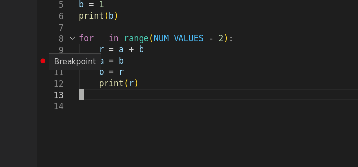
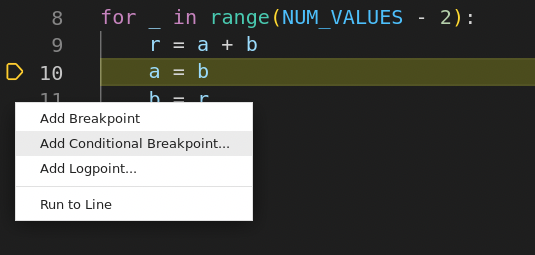
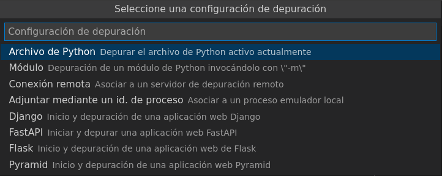
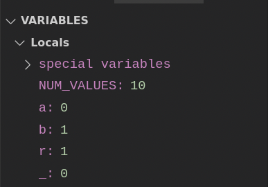

######
VSCode
######

.. image:: img/kelly-sikkema-Plso5cHu9w0-unsplash.jpg

`Visual Studio Code <https://code.visualstudio.com/>`__ (VSCode) es un entorno de desarrollo integrado [#ide]_ gratuito y de código abierto que ha ganado mucha relevancia en los últimos años. Permite trabajar fácilmente con multitud de lenguajes de programación y dispone de una gran cantidad de plugins. [#vscode-unsplash]_

*****************
Atajos de teclado
*****************

Conocer los atajos de teclado de tu editor favorito es fundamental para mejorar el flujo de trabajo y ser más productivo.  Veamos los principales atajos de teclado de Visual Studio Code [#vscode-shortcuts]_.

Ajustes generales
=================

.. csv-table::
    :file: tables/vscode-shortcuts-global.csv
    :widths: 30, 15
    :header-rows: 1
    :class: longtable

Usabilidad
==========

.. csv-table::
    :file: tables/vscode-shortcuts-usability.csv
    :widths: 30, 15
    :header-rows: 1
    :class: longtable

Edición básica
==============

.. csv-table::
    :file: tables/vscode-shortcuts-editing.csv
    :widths: 30, 15
    :header-rows: 1
    :class: longtable

Pantalla
========

.. csv-table::
    :file: tables/vscode-shortcuts-screen.csv
    :widths: 30, 15
    :header-rows: 1
    :class: longtable

.. tip::
    En macOS sustituir ``Ctrl`` por ``Command``.

****************
Depurando código
****************

La **depuración de programas** es el proceso de **identificar y corregir errores de programación**.​ Es conocido también por el término inglés **debugging**, cuyo significado es eliminación de bugs (bichos), manera en que se conoce informalmente a los errores de programación.

Existen varias herramientas de depuración (o *debuggers*). Algunas de ellas en modo texto (terminal) y otras con entorno gráfico (ventanas).

- La herramienta más extendida para **depurar en modo texto** es el módulo `pdb`_ (The Python Debugger). Viene incluido en la instalación base de Python y es realmente potente.
- Aunque existen varias herramientas para **depurar en entorno gráfico**, nos vamos a centrar en **Visual Studio Code**.

Lo primero será abrir el fichero (carpeta) donde vamos a trabajar:

.. figure:: img/vscode-debug-open.png
    :align: center

    Apertura del fichero a depurar

Punto de ruptura
================

A continuación pondremos un **punto de ruptura** (también llamado **breakpoint**). Esto implica que la ejecución se pare en ese punto y viene indicado por un punto rojo 🔴. Para ponerlo nos tenemos que acercar a la columna que hay a la izquierda del número de línea y hacer clic.

En este ejemplo ponemos un punto de ruptura en la línea 10:

    Punto de ruptura

También es posible añadir **puntos de ruptura condicionales** pulsando con el botón derecho y luego **Add Conditional Breakpoint...**:

    Punto de ruptura condicional

Lanzar la depuración
====================

Ahora ya podemos **lanzar la depuración** pulsando la tecla ``F5``. Nos aparecerá el siguiente mensaje en el que dejaremos la opción por defecto **Archivo de Python** y pulsamos la tecla ⏎:

    Configuración de la depuración

Ahora ya se inicia el "modo depuración" y veremos una pantalla similar a la siguiente:

.. figure:: img/vscode-debug-zones.png
    :align: center

    Interfaz en modo depuración

Zonas de la interfaz en modo depuración:
    1. Código con barra en amarillo que indica la próxima línea que se va a ejecutar.
    2. Visualización automática de valores de variables.
    3. Visualización personalizada de valores de variables (o expresiones).
    4. Salida de la terminal.
    5. Barra de herramientas para depuración.

Controles para la depuración
============================

Veamos con mayor detalle la **barra de herramientas para depuración**:

.. figure:: img/vscode-debug-toolbar.png
    :align: center

    Barra de herarmientas para depuración

.. csv-table::
    :file: tables/vscode-debug-toolbar.csv
    :header-rows: 1
    :widths: 15, 15, 70
    :class: longtable

Seguimiento de variables
========================

Como hemos indicado previamente, la zona de **Variables** ya nos informa **automáticamente de los valores de las variables** que tengamos en el contexto actual de ejecución:

    Panel para visualizar variables

Pero también es posible **añadir manualmente** el seguimiento de otras variables o expresiones personalizadas desde la zona **Watch**:

.. figure:: img/vscode-debug-watch.png
    :align: center

    Panel para seguimiento de expresiones

.. --------------- Footnotes ---------------

.. [#ide] También conocido por IDE siglas en inglés de Integrated Development Environment.
.. [#vscode-unsplash] Foto original de portada por `Kelly Sikkema`_ en Unsplash.
.. [#vscode-shortcuts] Fuente: `Gastón Danielsen en Dev.To`_.

.. --------------- Hyperlinks ---------------

.. _Kelly Sikkema: https://unsplash.com/@kellysikkema?utm_source=unsplash&utm_medium=referral&utm_content=creditCopyText
.. _pdb: https://docs.python.org/3/library/pdb.html
.. _Gastón Danielsen en Dev.To: https://dev.to/gdcodev/atajos-de-teclado-shortcuts-en-vscode-430a
