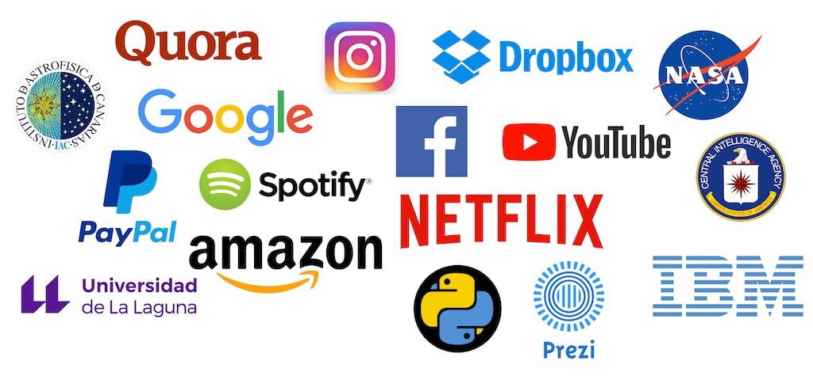
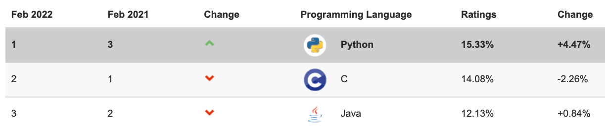
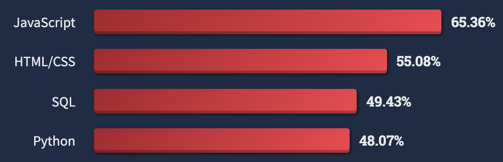
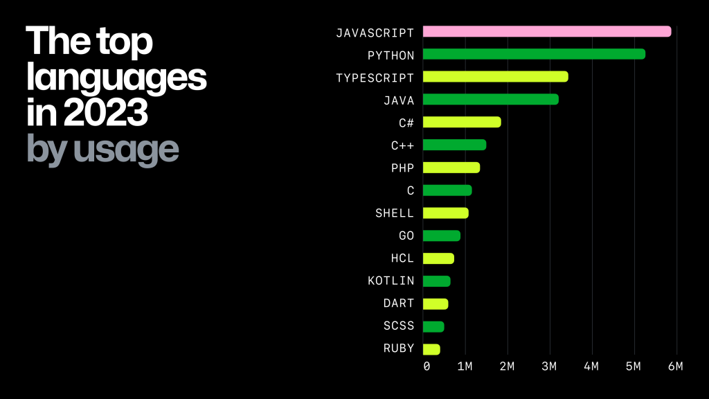

######
Python
######

.. image:: img/marketa-marcellova-Bjm9JmpNfd0-unsplash.jpg

`Python <https://www.python.org/>`__ es un lenguaje de programación de :ref:`alto nivel <core/introduction/machine:Python>` creado a finales de los 80/principios de los 90 por `Guido van Rossum`_, holandés que trabajaba por aquella época en el *Centro para las Matemáticas y la Informática* de los Países Bajos. Sus instrucciones están muy cercanas al **lenguaje natural** en inglés y se hace hincapié en la **legibilidad** del código. Toma su nombre de los `Monty Python`_, grupo humorista de los 60 que gustaban mucho a Guido. Python fue creado como sucesor del lenguaje ``ABC``. [#python-unsplash]_

****************************
Características del lenguaje
****************************

A partir de su `definición de la Wikipedia <https://es.wikipedia.org/wiki/Python>`_:

* Python es un lenguaje de programación **interpretado** y **multiplataforma** cuya filosofía hace hincapié en una sintaxis que favorezca un **código legible**.
* Se trata de un lenguaje de programación **multiparadigma**, ya que soporta **orientación a objetos, programación imperativa** y, en menor medida, programación funcional.
* Añadiría, como característica destacada, que se trata de un lenguaje de **propósito general**.

Ventajas
========

* Libre y gratuito (OpenSource).
* Fácil de leer, parecido a pseudocódigo.
* Aprendizaje relativamente fácil y rápido: claro, intuitivo....
* Alto nivel.
* Alta Productividad: simple y rápido.
* Tiende a producir un buen código: orden, limpieza, elegancia, flexibilidad, ...
* Multiplataforma. Portable.
* Multiparadigma: programación imperativa, orientada a objetos, funcional, ...
* Interactivo, modular, dinámico.
* Librerías extensivas ("pilas incluídas").
* Gran cantidad de librerías de terceros.
* Extensible (C++, C, ...) y "embebible".
* Gran comunidad, amplio soporte.
* Interpretado.
* Tipado dinámico [#tipado-dinamico]_.
* Fuertemente tipado [#tipado-fuerte]_.

Desventajas
===========

* Interpretado (velocidad de ejecución, multithread vs GIL, etc.).
* Consumo de memoria.
* Errores no detectables en tiempo de compilación.
* Desarrollo móvil.
* Documentación a veces dispersa e incompleta.
* Varios módulos para la misma funcionalidad.
* Librerías de terceros no siempre del todo maduras.

*************
Uso de Python
*************

Al ser un lenguaje de propósito general, podemos encontrar aplicaciones prácticamente en todos los campos científico-tecnológicos:

* Análisis de datos.
* Aplicaciones de escritorio.
* Bases de datos relacionales / NoSQL
* Buenas prácticas de programación / Patrones de diseño.
* Concurrencia.
* Criptomonedas / Blockchain.
* Desarrollo de aplicaciones multimedia.
* Desarrollo de juegos.
* Desarrollo en dispositivos embebidos.
* Desarrollo web.
* DevOps / Administración de sistemas / Scripts de automatización.
* Gráficos por ordenador.
* Inteligencia artificial.
* Internet de las cosas.
* Machine Learning.
* Programación de parsers / scrapers / crawlers.
* Programación de redes.
* Propósitos educativos.
* Prototipado de software.
* Seguridad.
* Tests automatizados.

De igual modo son muchas las empresas, instituciones y organismos que utilizan Python en su día a día para mejorar sus sistemas de información. Veamos algunas de las más relevantes:

    
    Grandes empresas y organismos que usan Python

Existen ránkings y estudios de mercado que sitúan a Python como uno de los lenguajes más *usados* y la vez, más *amados* dentro del mundo del desarrollo de software.

En el momento de la escritura de este documento, la última actualización del `Índice TIOBE`_ es de *noviembre de 2023* en el que Python ocupaba el **primer puesto de los lenguajes de programación más usados**, por delante de *C* y *C++*.

    
    Índice TIOBE Noviembre 2023

Igualmente en la `encuesta a desarrolladores/as de Stack Overflow del 2023 <https://survey.stackoverflow.co/2023/>`_ Python ocupaba el **tercer puesto de los lenguajes de programación más populares**, sólo por detrás de *HTML/CSS* y *JavaScript*:

    
    Encuesta Stack Overflow 2023

También podemos reseñar el informe anual que realiza GitHub sobre el uso de tecnologías en su plataforma. En la `edición de 2023 del estado del opensource de GitHub <https://github.blog/2023-11-08-the-state-of-open-source-and-ai/>`_, Python ocupaba el **segundo puesto de los lenguajes de programación más usados**, sólo por detrás de *JavaScript*:

    
    Informe GitHub 2023

*******************
Versiones de Python
*******************

En el momento de la escritura de este material, se muestra a continuación la evolución de las versiones mayores de Python a lo largo de la historia: [#python-versions]_

.. csv-table::
    :file: tables/python_versions.csv
    :widths: 15, 30
    :header-rows: 1
    :class: longtable

Un dato curioso, o directamente un "frikismo": Desde Python 3.8, cada nueva versión estable sale a la luz en el mes de **Octubre**. En este escenario de Python *3.version* se cumplen las siguientes igualdades:

.. math::

    version = year - 2011

    year = version + 2011

El cambio de **Python 2** a **Python 3** fue bastante "traumático" ya que se **perdió la compatibilidad** en muchas de las estructuras del lenguaje. Los "*core-developers*" [#core-developers]_, con *Guido van Rossum* a la cabeza, vieron la necesidad de aplicar estas modificaciones en beneficio del rendimiento y expresividad del lenguaje de programación. Este cambio implicaba que el código escrito en Python 2 no funcionaría (de manera inmediata) en Python 3.

El pasado **1 de enero de 2020** finalizó oficialmente el **soporte a la versión 2.7** del lenguaje de programación Python. Es por ello que se recomienda lo siguiente:

- Si aún desarrollas aplicaciones escritas en Python 2, deberías migrar a Python 3.
- Si vas a desarrollar una nueva aplicación, deberías hacerlo directamente en Python 3.

.. important:: Únete a **Python 3** y aprovecha todas sus ventajas.

*******
CPython
*******

Existen múltiples **implementaciones** de Python según el lenguaje de programación que se ha usado para desarrollarlo. Veamos algunas de ellas:

+----------------+------------+
| Implementación |  Lenguaje  |
+================+============+
| `CPython`_     | C          |
+----------------+------------+
| `Jython`_      | Java       |
+----------------+------------+
| `IronPython`_  | C#         |
+----------------+------------+
| `Brython`_     | JavaScript |
+----------------+------------+
| `RustPython`_  | Rust       |
+----------------+------------+
| `MicroPython`_ | C          |
+----------------+------------+

.. note:: Cuando hacemos referencia a Python hablamos (implícitamente) de CPython. Este manual versa exclusivamente sobre CPython.

*************
Zen de Python
*************

Existen una serie de *reglas* "filosóficas" que indican una manera de hacer y de pensar dentro del mundo **pitónico** [#pithonic]_ creadas por `Tim Peters`_, llamadas el `Zen de Python <https://www.python.org/dev/peps/pep-0020/>`__ y que se pueden aplicar incluso más allá de la programación::

    >>> import this
    The Zen of Python, by Tim Peters

    Beautiful is better than ugly.
    Explicit is better than implicit.
    Simple is better than complex.
    Complex is better than complicated.
    Flat is better than nested.
    Sparse is better than dense.
    Readability counts.
    Special cases aren't special enough to break the rules.
    Although practicality beats purity.
    Errors should never pass silently.
    Unless explicitly silenced.
    In the face of ambiguity, refuse the temptation to guess.
    There should be one-- and preferably only one --obvious way to do it.
    Although that way may not be obvious at first unless you're Dutch.
    Now is better than never.
    Although never is often better than *right* now.
    If the implementation is hard to explain, it's a bad idea.
    If the implementation is easy to explain, it may be a good idea.
    Namespaces are one honking great idea -- let's do more of those!

En su `traducción de la Wikipedia <https://es.wikipedia.org/wiki/Zen_de_Python>`_:

* Bello es mejor que feo.
* Explícito es mejor que implícito.
* Simple es mejor que complejo.
* Complejo es mejor que complicado.
* Plano es mejor que anidado.
* Espaciado es mejor que denso.
* La legibilidad es importante.
* Los casos especiales no son lo suficientemente especiales como para romper las reglas.
* Sin embargo la practicidad le gana a la pureza.
* Los errores nunca deberían pasar silenciosamente.
* A menos que se silencien explícitamente.
* Frente a la ambigüedad, evitar la tentación de adivinar.
* Debería haber una, y preferiblemente solo una, manera obvia de hacerlo.
* A pesar de que esa manera no sea obvia a menos que seas Holandés.
* Ahora es mejor que nunca.
* A pesar de que nunca es muchas veces mejor que *ahora* mismo.
* Si la implementación es difícil de explicar, es una mala idea.
* Si la implementación es fácil de explicar, puede que sea una buena idea.
* Los espacios de nombres son una gran idea, ¡tengamos más de esos!

.. seealso::
    Si quieres darle un toque a tu escritorio, puedes descargar `este fondo de pantalla del Zen de Python <https://www.gnome-look.org/p/1042303>`_ que queda muy chulo.

***********************
Consejos para programar
***********************

Un listado de consejos muy interesantes cuando nos enfrentamos a la programación, basados en la experiencia de `@codewithvoid`_:

1. Escribir código es el último paso del proceso.
2. Para resolver problemas: pizarra mejor que teclado.
3. Escribir código sin planificar = estrés.
4. Pareces más inteligente siendo claro, no siendo listo.
5. La constancia a largo plazo es mejor que la intensidad a corto plazo.
6. La solución primero. La optimización después.
7. Gran parte de la programación es resolución de problemas.
8. Piensa en múltiples soluciones antes de decidirte por una.
9. Se aprende construyendo proyectos, no tomando cursos.
10. Siempre elije simplicidad. Las soluciones simples son más fáciles de escribir.
11. Los errores son inevitables al escribir código. Sólo te informan sobre lo que no debes hacer.
12. Fallar es barato en programación. Aprende mediante la práctica.
13. Gran parte de la programación es investigación.
14. La programación en pareja te enseñará mucho más que escribir código tu solo.
15. Da un paseo cuando estés bloqueado con un error.
16. Convierte en un hábito el hecho de pedir ayuda. Pierdes cero credibilidad pidiendo ayuda.
17. El tiempo gastado en entender el problema está bien invertido.
18. Cuando estés bloqueado con un problema: sé curioso, no te frustres.
19. Piensa en posibles escenarios y situaciones extremas antes de resolver el problema.
20. No te estreses con la sintaxis de lenguaje de programación. Entiende conceptos.
21. Aprende a ser un buen corrector de errores. Esto se amortiza.
22. Conoce pronto los atajos de teclado de tu editor favorito.
23. Tu código será tan claro como lo tengas en tu cabeza.
24. Gastarás el doble de tiempo en corregir errores que en escribir código.
25. Saber buscar bien en Google es una habilidad valiosa.
26. Lee código de otras personas para inspirarte.
27. Únete a `comunidades de desarrollo <https://pythoncanarias.es>`_ para aprender con otros/as programadores/as.

.. --------------- Footnotes ---------------

.. [#python-unsplash] Foto original por `Markéta Marcellová`_ en Unsplash.
.. [#pithonic] Dícese de algo/alguien que sigue las convenciones de Python.
.. [#python-versions] Fuente: `python.org <https://www.python.org/doc/versions/>`_.
.. [#core-developers] Término que se refiere a los/las desarrolladores/as principales del lenguaje de programación.
.. [#tipado-dinamico] Tipado dinámico significa que una variable puede cambiar de tipo durante el tiempo de vida de un programa. C es un lenguaje de tipado estático.
.. [#tipado-fuerte] Fuertemente tipado significa que, de manera nativa, no podemos operar con dos variables de tipos distintos, a menos que realice una conversión explícita. Javascript es un lenguaje débilmente tipado.

.. --------------- Hyperlinks ---------------

.. _Markéta Marcellová: https://unsplash.com/@ketdee?utm_source=unsplash&utm_medium=referral&utm_content=creditCopyText
.. _Guido van Rossum: https://es.wikipedia.org/wiki/Guido_van_Rossum
.. _Monty Python: https://es.wikipedia.org/wiki/Monty_Python
.. _Tim Peters: https://en.wikipedia.org/wiki/Tim_Peters_(software_engineer)
.. _Índice TIOBE: https://www.tiobe.com/tiobe-index/
.. _CPython: https://github.com/python/cpython
.. _Brython: https://brython.info/
.. _Jython: https://www.jython.org/
.. _IronPython: https://ironpython.net/
.. _MicroPython: https://micropython.org/
.. _RustPython: https://rustpython.github.io/
.. _@codewithvoid: https://twitter.com/codewithvoid
