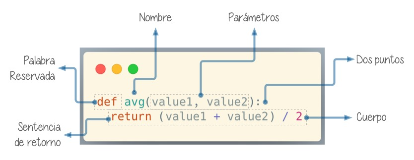
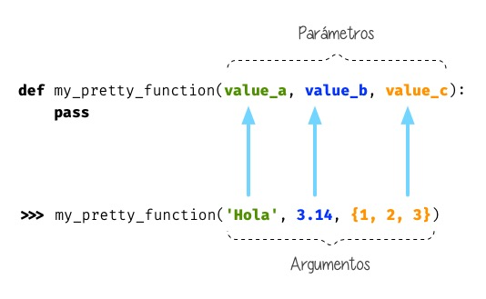
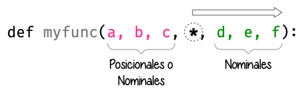

#########
Funciones
#########

.. image:: img/nathan-dumlao-6Lh0bRb9LOA-unsplash.jpg

El concepto de **función** es básico en prácticamente cualquier lenguaje de programación. Se trata de una estructura que nos permite agrupar código. Persigue dos objetivos claros:

1. **No repetir** trozos de código durante nuestro programa.
2. **Reutilizar** el código para distintas situaciones.

Una función viene *definida* por su *nombre*, sus *parámetros* y su *valor de retorno*. Esta parametrización de las funciones las convierte en una poderosa herramienta ajustable a las circunstancias que tengamos. Al *invocarla* estaremos solicitando su ejecución y obtendremos unos resultados. [#brewery-unsplash]_

*******************
Definir una función
*******************

Para definir una función utilizamos la palabra reservada ``def`` seguida del **nombre** [#naming-functions]_ de la función. A continuación aparecerán 0 o más **parámetros** separados por comas (entre paréntesis), finalizando la línea con **dos puntos** ``:`` En la siguiente línea empezaría el **cuerpo** de la función que puede contener 1 o más **sentencias**, incluyendo (o no) una **sentencia de retorno** con el resultado mediante ``return``.

    Definición de una función en Python
   
.. warning:: Prestar especial atención a los dos puntos ``:`` porque suelen olvidarse en la *definición de la función*.

Hagamos una primera función sencilla que no recibe parámetros::

    def say_hello():
        print('Hello!')

- Nótese la :ref:`indentación <core/controlflow/conditionals:Definición de bloques>` (sangrado) del *cuerpo* de la función.
- Los *nombres de las funciones* siguen :ref:`las mismas reglas que las variables <core/datatypes/data:Variables>`.

Invocar una función
===================

Para invocar (o "llamar") a una función sólo tendremos que escribir su nombre seguido de paréntesis. En el caso de la función sencilla (vista anteriormente) se haría así:

.. code-block::
    :emphasize-lines: 5

    >>> def say_hello():
    ...     print('Hello!')
    ...

    >>> say_hello()
    Hello!

Como era de esperar, al invocar a esta función obtenemos un mensaje por pantalla, fruto de la ejecución del cuerpo de la función.

Retornar un valor
=================

Las funciones pueden retornar (o "devolver") un valor. Veamos un ejemplo muy sencillo::

    >>> def one():
    ...     return 1
    ...

    >>> one()
    1

.. important:: No confundir ``return`` con ``print()``. El valor de retorno de una función nos permite usarlo fuera de su contexto. El hecho de añadir ``print()`` al cuerpo de una función es algo "coyuntural" y no modifica el resultado de la lógica interna.

.. note:: En la sentencia ``return`` podemos incluir variables y expresiones, no únicamente literales.

Pero no sólo podemos invocar a la función directamente, también la podemos integrar en otras expresiones. Por ejemplo en condicionales::

    >>> if one() == 1:
    ...     print('It works!')
    ... else:
    ...     print('Something is broken')
    ...
    It works!

Si una función no incluye un ``return`` de forma explícita, devolverá :ref:`None <core/controlflow/conditionals:Valor nulo>` de forma implícita::

    >>> def empty():
    ...     x = 0
    ...

    >>> print(empty())
    None

***********************
Parámetros y argumentos
***********************

Si una función no dispusiera de valores de entrada estaría muy limitada en su actuación. Es por ello que los **parámetros** nos permiten variar los datos que consume una función para obtener distintos resultados. Vamos a empezar a crear funciones que reciben **parámetros**.

En este caso escribiremos una función que recibe un valor numérico y devuelve su raíz cuadrada::

    >>> def sqrt(value):
    ...     return value ** (1/2)
    ...

    >>> sqrt(4)
    2.0

.. note:: En este caso, el valor ``4`` es un **argumento** de la función.

Cuando llamamos a una función con *argumentos*, los valores de estos argumentos se copian en los correspondientes *parámetros* dentro de la función:

    Parámetros y argumentos de una función

.. tip:: La sentencia ``pass`` permite "no hacer nada". Es una especie de "*placeholder*".

Veamos otra función con dos parámetros y algo más de lógica de negocio: [#blogic]_

.. code-block::

    >>> def _min(a, b):
    ...     if a < b:
    ...         return a
    ...     else:
    ...         return b
    ...

    >>> _min(7, 9)
    7

.. admonition:: Ejercicio
    :class: exercise

    Escriba una función en Python que reproduzca lo siguiente:

    :math:`f(x, y) = x^2 + y^2`

    **Ejemplo**
        * Entrada: ``3`` y ``4``
        * Salida: ``25``

    .. only:: html
    
        |solution| :download:`square.py <files/square.py>`

Argumentos posicionales
=======================

Los **argumentos posicionales** son aquellos argumentos que se copian en sus correspondientes parámetros **en orden**. 

Vamos a mostrar un ejemplo definiendo una función que construye una "cpu" a partir de 3 parámetros::

    >>> def build_cpu(vendor, num_cores, freq):
    ...     return dict(
    ...         vendor=vendor,
    ...         num_cores=num_cores,
    ...         freq=freq
    ...     )
    ...

Una posible llamada a la función con argumentos posicionales sería la siguiente::

    >>> build_cpu('AMD', 8, 2.7)
    {'vendor': 'AMD', 'num_cores': 8, 'freq': 2.7}

Lo que ha sucedido es un **mapeo** directo entre argumentos y parámetros en el mismo orden que estaban definidos:

+---------------+-----------+
|   Parámetro   | Argumento |
+===============+===========+
| ``vendor``    | ``AMD``   |
+---------------+-----------+
| ``num_cores`` | ``8``     |
+---------------+-----------+
| ``freq``      | ``2.7``   |
+---------------+-----------+

Pero es evidente que una clara desventaja del uso de argumentos posicionales es que se necesita **recordar el orden** de los argumentos. Un error en la posición de los argumentos puede causar resultados indeseados::

    >>> build_cpu(8, 2.7, 'AMD')
    {'vendor': 8, 'num_cores': 2.7, 'freq': 'AMD'}

Argumentos nominales 
====================

En esta aproximación los argumentos no son copiados en un orden específico sino que **se asignan por nombre a cada parámetro**. Ello nos permite salvar el problema de conocer cuál es el orden de los parámetros en la definición de la función. Para utilizarlo, basta con realizar una asignación de cada argumento en la propia llamada a la función.

Veamos la misma llamada que hemos hecho en el ejemplo de construcción de la "cpu" pero ahora utilizando paso de argumentos nominales::

    >>> build_cpu(vendor='AMD', num_cores=8, freq=2.7)
    {'vendor': 'AMD', 'num_cores': 8, 'freq': 2.7}

Se puede ver claramente que el orden de los argumentos no influye en el resultado final::

    >>> build_cpu(num_cores=8, freq=2.7, vendor='AMD')
    {'vendor': 'AMD', 'num_cores': 8, 'freq': 2.7}

Argumentos posicionales y nominales
===================================

Python permite mezclar argumentos posicionales y nominales en la llamada a una función::

    >>> build_cpu('INTEL', num_cores=4, freq=3.1)
    {'vendor': 'INTEL', 'num_cores': 4, 'freq': 3.1}

Pero hay que tener en cuenta que, en este escenario, **los argumentos posicionales siempre deben ir antes** que los argumentos nominales. Esto tiene mucho sentido ya que, de hacerlo así, Python no tendría forma de discernir a qué parámetro corresponde cada argumento::

    >>> build_cpu(num_cores=4, 'INTEL', freq=3.1)
      File "<stdin>", line 1
    SyntaxError: positional argument follows keyword argument

Parámetros por defecto
======================

Es posible especificar **valores por defecto** en los parámetros de una función. En el caso de que no se proporcione un valor al argumento en la llamada a la función, el parámetro correspondiente tomará el valor definido por defecto.

Siguiendo con el ejemplo de la "cpu", podemos asignar *2.0GHz* como frecuencia por defecto. La definición de la función cambiaría ligeramente::

    >>> def build_cpu(vendor, num_cores, freq=2.0):
    ...     return dict(
    ...         vendor=vendor,
    ...         num_cores=num_cores,
    ...         freq=freq
    ...     )
    ...

Llamada a la función sin especificar frecuencia de "cpu"::

    >>> build_cpu('INTEL', 2)
    {'vendor': 'INTEL', 'num_cores': 2, 'freq': 2.0}

Llamada a la función indicando una frecuencia concreta de "cpu"::

    >>> build_cpu('INTEL', 2, 3.4)
    {'vendor': 'INTEL', 'num_cores': 2, 'freq': 3.4}

.. important:: Los valores por defecto en los parámetros se calculan cuando se **define** la función, no cuando se **ejecuta**.

.. admonition:: Ejercicio
    :class: exercise

    Escriba una función ``factorial`` que reciba un único parámetro :math:`n` desde línea de comandos (``sys.argv``) y devuelva su factorial.

    El factorial de un número :math:`n` se define como:
    
    .. math:: 
        n! = n \cdot (n - 1) \cdot (n - 2) \cdot \ldots \cdot 1
    
    → *Truco: El orden de los factores no altera el producto.*
    
    **Ejemplo**
        * Entrada: ``5``
        * Salida: ``120``
    
    .. only:: html
    
        |solution| :download:`factorial.py <files/factorial.py>`

Modificando parámetros mutables
-------------------------------

|advlev|

Hay que tener cuidado a la hora de manejar los parámetros que pasamos a una función ya que podemos obtener resultados indeseados, especialmente cuando trabajamos con *tipos de datos mutables*.

Supongamos una función que añade elementos a una lista que pasamos por parámetro. La idea es que si no pasamos la lista, ésta siempre empiece siendo vacía. Hagamos una serie de pruebas pasando alguna lista como segundo argumento::

    >>> def buggy(arg, result=[]):
    ...     result.append(arg)
    ...     print(result)
    ...

    >>> buggy('a', [])
    ['a']

    >>> buggy('b', [])
    ['b']

    >>> buggy('a', ['x', 'y', 'z'])
    ['x', 'y', 'z', 'a']

    >>> buggy('b', ['x', 'y', 'z'])
    ['x', 'y', 'z', 'b']

Aparentemente todo está funcionando de manera correcta, pero veamos qué ocurre en las siguientes llamadas:

.. code-block::

    >>> def buggy(arg, result=[]):
    ...     result.append(arg)
    ...     print(result)
    ...

    >>> buggy('a')
    ['a']

    >>> buggy('b')  # Se esperaría ['b']
    ['a', 'b']

Obviamente algo no ha funcionado correctamente. Se esperaría que ``result`` tuviera una lista vacía en cada ejecución. Sin embargo esto no sucede por estas dos razones:

1. El valor por defecto se establece cuando se define la función.
2. La variable ``result`` apunta a una zona de memoria en la que se modifican sus valores.

Ejecución **paso a paso** a través de *Python Tutor*:

.. only:: latex

    https://cutt.ly/sBNpVT2

.. only:: html

    .. raw:: html

        <iframe width="800" height="410" frameborder="0" src="https://pythontutor.com/iframe-embed.html#code=def%20buggy%28arg,%20result%3D%5B%5D%29%3A%0A%20%20%20%20result.append%28arg%29%0A%20%20%20%20print%28result%29%0A%0Abuggy%28'a'%29%0A%0Abuggy%28'b'%29&codeDivHeight=400&codeDivWidth=350&cumulative=false&curInstr=0&heapPrimitives=nevernest&origin=opt-frontend.js&py=3&rawInputLstJSON=%5B%5D&textReferences=false"> </iframe>

A riesgo de perder el *parámetro por defecto*, una posible solución sería la siguiente::

    >>> def works(arg):
    ...     result = []
    ...     result.append(arg)
    ...     return result
    ...

    >>> works('a')
    ['a']

    >>> works('b')
    ['b']

La forma de arreglar el código anterior utilizando un parámetro con valor por defecto sería utilizar un **tipo de dato inmutable** y tener en cuenta cuál es la primera llamada::

    >>> def nonbuggy(arg, result=None):
    ...     if result is None:
    ...         result = []
    ...     result.append(arg)
    ...     print(result)
    ...

    >>> nonbuggy('a')
    ['a']

    >>> nonbuggy('b')
    ['b']

    >>> nonbuggy('a', ['x', 'y', 'z'])
    ['x', 'y', 'z', 'a']

    >>> nonbuggy('b', ['x', 'y', 'z'])
    ['x', 'y', 'z', 'b']

Empaquetar/Desempaquetar argumentos
===================================

|advlev|

Python nos ofrece la posibilidad de empaquetar y desempaquetar argumentos cuando estamos invocando a una función, tanto para **argumentos posicionales** como para **argumentos nominales**.

Y de este hecho se deriva que podamos utilizar un **número variable de argumentos** en una función, algo que puede ser muy interesante según el caso de uso que tengamos.

Empaquetar/Desempaquetar argumentos posicionales
------------------------------------------------

Si utilizamos el operador ``*`` delante del nombre de un parámetro posicional, estaremos indicando que los argumentos pasados a la función se empaqueten en una **tupla**.

Veamos un ejemplo en el que vamos a **implementar una función para sumar un número variable de valores**. La función que tenemos disponible en Python no cubre este caso::

    >>> sum(4, 3, 2, 1)
    Traceback (most recent call last):
      File "<stdin>", line 1, in <module>
    TypeError: sum() takes at most 2 arguments (4 given)

Para resolver esto, hacemos uso del ``*`` para empaquetar los argumentos posicionales::

    >>> def _sum(*values):
    ...     result = 0
    ...     for value in values:  # values es una tupla
    ...         result += arg
    ...     return result
    ...

    >>> _sum(4, 3, 2, 1)
    10

.. note:: En muchas ocasiones se utiliza ``args`` como nombre del parámetro (es una convención).

Existe la posibilidad de usar el asterisco ``*`` en la llamada a la función para **desempaquetar** los argumentos posicionales::

    >>> def show_args(*args):
    ...     for arg in args:
    ...         print(f'{arg=}')
    ...

    >>> my_args = (1, 2, 3, 4)

    >>> show_args(my_args)   # sin desempaquetado
    arg=(1, 2, 3, 4)

    >>> show_args(*my_args)  # con desempaquetado
    arg=1
    arg=2
    arg=3
    arg=4

Empaquetar/Desempaquetar argumentos nominales
---------------------------------------------

Si utilizamos el operador ``**`` delante del nombre de un parámetro nominal, estaremos indicando que los argumentos pasados a la función se empaqueten en un **diccionario**.

Supongamos un ejemplo en el que queremos **encontrar la persona con mayor calificación de un examen**. hacemos uso del ``**`` para empaquetar los argumentos nominales::

    >>> def best_student(**marks):
    ...     max_mark = -1
    ...     for student, mark in marks.items():  # marks es un diccionario
    ...         if mark > max_mark:
    ...             max_mark = mark
    ...             best_student = student
    ...     return best_student
    ...

    >>> best_student(ana=8, antonio=6, inma=9, javier=7)
    'inma'

.. note:: En muchas ocasiones se utiliza ``kwargs`` como nombre del parámetro (es una convención).

Al igual que veíamos previamente, existe la posibilidad de usar doble asterisco ``**`` en la llamada a la función, para **desempaquetar** los argumentos nominales::

    >>> def show_kwargs(**kwargs):
    ...     for item in kwargs.items():
    ...         print(f'{item=}')
    ...

    >>> my_kwargs = {'a': 1, 'b': 2, 'c': 3, 'd': 4}

    >>> show_kwargs(**my_kwargs)
    item=('a', 1)
    item=('b', 2)
    item=('c', 3)
    item=('d', 4)

Forzando modo de paso de argumentos
===================================

Si bien Python nos da flexibilidad para pasar argumentos a nuestras funciones en modo posicional o nominal, existen opciones para forzar a que dicho paso sea obligatorio en una determinada modalidad.

Argumentos sólo posicionales
----------------------------

|advlev|

A partir de `Python 3.8 <https://www.python.org/dev/peps/pep-0570/>`_ se ofrece la posibilidad de obligar a que determinados parámetros de la función sean pasados sólo por posición.

Para ello, en la definición de los parámetros de la función, tendremos que incluir un parámetro especial ``/`` que delimitará el tipo de parámetros. Así, todos los parámetros a la izquierda del delimitador estarán **obligados** a ser posicionales:

.. figure:: img/position-only-params.png
    :align: center

    Separador para especificar parámetros sólo posicionales

Ejemplo::

    >>> def sum_power(a, b, /, power=False):
    ...     if power:
    ...         a **= 2
    ...         b **= 2
    ...     return a + b
    ...

    >>> sum_power(3, 4)
    7

    >>> sum_power(3, 4, True)
    25

    >>> sum_power(3, 4, power=True)
    25

    >>> sum_power(a=3, b=4)
    Traceback (most recent call last):
      File "<stdin>", line 1, in <module>
    TypeError: sum_power() got some positional-only arguments passed as keyword arguments: 'a, b'

Argumentos sólo nominales
-------------------------

|advlev|

A partir de `Python 3 <https://www.python.org/dev/peps/pep-3102/>`_ se ofrece la posibilidad de obligar a que determinados parámetros de la función sean pasados sólo por nombre.

Para ello, en la definición de los parámetros de la función, tendremos que incluir un parámetro especial ``*`` que delimitará el tipo de parámetros. Así, todos los parámetros a la derecha del separador estarán **obligados** a ser nominales:

    Separador para especificar parámetros sólo nominales

Ejemplo::

    >>> def sum_power(a, b, *, power=False):
    ...     if power:
    ...         a **= 2
    ...         b **= 2
    ...     return a + b
    ...

    >>> sum_power(3, 4)
    7

    >>> sum_power(a=3, b=4)
    7

    >>> sum_power(3, 4, power=True)
    25

    >>> sum_power(3, 4, True)
    ---------------------------------------------------------------------------
    Traceback (most recent call last):
      File "<stdin>", line 1, in <module>
    TypeError: sum_power() takes 2 positional arguments but 3 were given

Fijando argumentos posicionales y nominales
-------------------------------------------

Si mezclamos las dos estrategias anteriores podemos forzar a que una función reciba argumentos de un modo concreto.

Continuando con ejemplo anterior, podríamos hacer lo siguiente::

    >>> def sum_power(a, b, /, *, power=False):
    ...     if power:
    ...         a **= 2
    ...         b **= 2
    ...     return a + b
    ...

    >>> sum_power(3, 4, power=True)  # Único modo posible de llamada
    25

Argumentos mutables e inmutables
================================

|intlev|

Igual que veíamos en la incidencia de :ref:`parámetros por defecto con valores mutables <core/modularity/functions:Modificando parámetros mutables>`, cuando realizamos modificaciones a los argumentos de una función es importante tener en cuenta si son **mutables** (listas, diccionarios, conjuntos, ...) o **inmutables** (tuplas, enteros, flotantes, cadenas de texto, ...) ya que podríamos obtener efectos colaterales no deseados::

    >>> fib = [1, 1, 2, 3, 5, 8, 13]

    >>> def square_it(values, *, index):
    ...     values[index] **= 2
    ...

    >>> fib
    [1, 1, 2, 3, 5, 8, 13]

    >>> square_it(fib, index=4)

    >>> fib  # 😱
    [1, 1, 2, 3, 25, 8, 13]

.. warning:: Esto **no es una buena práctica**. O bien documentar que el argumento puede modificarse o bien retornar un nuevo valor.

Funciones como parámetros
=========================

|advlev|

Las funciones se pueden utilizar en cualquier contexto de nuestro programa. Son objetos que pueden ser asignados a variables, usados en expresiones, devueltos como valores de retorno o pasados como argumentos a otras funciones.

Veamos un primer ejemplo en el que pasamos una función como argumento::

    >>> def success():
    ...     print('Yeah!')
    ...

    >>> type(success)
    function

    >>> def doit(f):
    ...     f()
    ...

    >>> doit(success)
    Yeah!

Veamos un segundo ejemplo en el que pasamos, no sólo una función como argumento, sino los valores con los que debe operar::

    >>> def repeat_please(text, times=1):
    ...     return text * times
    ...

    >>> type(repeat_please)
    function

    >>> def doit(f, arg1, arg2):
    ...     return f(arg1, arg2)
    ...

    >>> doit(repeat_please, 'Functions as params', 2)
    'Functions as paramsFunctions as params'

*************
Documentación
*************

Ya hemos visto que en Python podemos incluir :ref:`comentarios <core/controlflow/conditionals:Comentarios>` para explicar mejor determinadas zonas de nuestro código.

Del mismo modo podemos (y en muchos casos **debemos**) adjuntar **documentación** a la definición de una función incluyendo una cadena de texto (**docstring**) al comienzo de su cuerpo::

    >>> def sqrt(value):
    ...     'Returns the square root of the value'
    ...     return value ** (1/2)
    ...

La forma más ortodoxa de escribir un ``docstring`` es utilizando *triples comillas*::

    >>> def closest_int(value):
    ...     '''Returns the closest integer to the given value.
    ...     The operation is:
    ...         1. Compute distance to floor.
    ...         2. If distance less than a half, return floor.
    ...            Otherwise, return ceil.
    ...     '''
    ...     floor = int(value)
    ...     if value - floor < 0.5:
    ...         return floor
    ...     else:
    ...         return floor + 1
    ...

Para ver el ``docstring`` de una función, basta con utilizar ``help``::

    >>> help(closest_int)

    Help on function closest_int in module __main__:

    closest_int(value)
        Returns the closest integer to the given value.
        The operation is:
            1. Compute distance to floor.
            2. If distance less than a half, return floor.
               Otherwise, return ceil.

También es posible extraer información usando el símbolo de interrogación::

    >>> closest_int?
    Signature: closest_int(value)
    Docstring:
    Returns the closest integer to the given value.
    The operation is:
        1. Compute distance to floor.
        2. If distance less than a half, return floor.
        Otherwise, return ceil.
    File:      ~/aprendepython/<ipython-input-75-5dc166360da1>
    Type:      function

.. important:: Esto no sólo se aplica a funciones propias, sino a cualquier otra función definida en el lenguaje.

.. note:: Si queremos ver el ``docstring`` de una función en "crudo" (sin formatear), podemos usar ``<function>.__doc__``.

Explicación de parámetros
=========================

Como ya se ha visto, es posible documentar una función utilizando un ``docstring``. Pero la redacción y el formato de esta cadena de texto puede ser muy variada. Existen distintas formas de documentar una función (u otros objetos) [#docstring-formats]_:

`Sphinx docstrings`_
    Formato nativo de documentación `Sphinx`_.
`Google docstrings`_
    Formato de documentación recomendado por Google.
`NumPy-SciPy docstrings`_
    Combinación de formatos reStructured y Google (usados por el proyecto `NumPy`_).
`Epytext`_
    Una adaptación a Python de Epydoc(Java).

Aunque cada uno tienes sus particularidades, todos comparten una misma estructura:

* Una primera línea de **descripción de la función**.
* A continuación especificamos las características de los **parámetros** (incluyendo sus tipos).
* Por último, indicamos si la función **retorna un valor** y sus características.

Aunque todos los formatos son válidos, nos centraremos en **Sphinx docstrings** al ser el que viene mejor integrado con la documentación Sphinx. *Google docstrings* y *Numpy docstrings* también son ampliamente utilizados, lo único es que necesitan de un módulo externo denominado `Napoleon`_ para que se puedan incluir en la documentación *Sphinx*.

Sphinx
------

`Sphinx`_ es una herramienta para generar documentación e incluye un módulo "built-in" denominado `autodoc`_ el cual permite la autogeneración de documentación a partir de los "docstrings" definidos en el código.

Veamos el uso de este formato en la documentación de la siguiente función "dummy"::

    >>> def my_power(x, n):
    ...     '''Calculate x raised to the power of n.
    ...
    ...     :param x: number representing the base of the operation
    ...     :type x: int
    ...     :param n: number representing the exponent of the operation
    ...     :type n: int
    ...
    ...     :return: :math:`x^n`
    ...     :rtype: int
    ...     '''
    ...     result = 1
    ...     for _ in range(n):
    ...         result *= x
    ...     return result
    ...
    
Dentro del "docstring" podemos escribir con sintaxis `reStructured Text`_ -- véase por ejemplo la expresión matemática en el tag ``:return:`` -- lo que nos proporciona una gran flexibilidad.

.. note:: La plataforma `Read the Docs`_ aloja la documentación de gran cantidad de proyectos. En muchos de los casos se han usado "docstrings" con el formato Sphinx visto anteriormente.

Anotación de tipos
==================

|intlev|

Las anotaciones de tipos o **type-hints** [#type-hints]_ se introdujeron en `Python 3.5 <https://www.python.org/dev/peps/pep-0484/>`_ y permiten indicar tipos para los parámetros de una función así como su valor de retorno (aunque también funcionan en creación de variables).

Veamos un ejemplo en el que creamos una función para dividir una cadena de texto por la posición especificada en el parámetro::

    >>> def ssplit(text: str, split_pos: int) -> tuple:
    ...     return text[:split_pos], text[split_pos:]
    ...

    >>> ssplit('Always remember us this way', 15)
    ('Always remember', ' us this way')

Como se puede observar, vamos añadiendo los tipos después de cada parámetro utilizando ``:`` como separador. En el caso del valor de retorno usamos el símbolo ``->``

Quizás la siguiente ejecución pueda sorprender::

    >>> ssplit([1, 2, 3, 4, 5, 6, 7, 8, 9, 10], 5)
    ([1, 2, 3, 4, 5], [6, 7, 8, 9, 10])

Efectivamente como habrás visto, **no hemos obtenido ningún error**, a pesar de que estamos pasando como primer argumento una lista en vez de una cadena de texto. Esto ocurre porque lo que hemos definido es una anotación de tipo, no una declaración de tipo. Existen herramientas como `mypy`_ que sí se encargan de chequear estas situaciones.

Valores por defecto
-------------------

Al igual que ocurre en la definición ordinaria de funciones, cuando usamos anotaciones de tipos también podemos indicar un valor por defecto para los parámetros.

Veamos la forma de hacerlo continuando con el ejemplo anterior::

    >>> def ssplit(text: str, split_pos: int = -1) -> tuple:
    ...     if split_pos == -1:
    ...         split_pos = len(text) // 2
    ...     return text[:split_pos], text[split_pos:]
    ...

    >>> ssplit('Always remember us this way')
    ('Always rememb', 'er us this way')

Simplemente añadimos el valor por defecto después de indicar el tipo.

.. note:: Las **anotaciones de tipos** son una herramienta muy potente y que, usada de forma adecuada, permite complementar la documentación de nuestro código y aclarar ciertos aspectos, que a priori, pudieran parecer confusos. Su aplicación estará en función de la necesidad detectada por parte del equipo de desarrollo.

******************
Tipos de funciones
******************

|advlev|

Funciones interiores
====================

Está permitido definir una función dentro de otra función::

    >>> def validation_test(text):
    ...     def is_valid_char(char):
    ...         return char in 'xyz'
    ...     checklist = []
    ...     for char in text:
    ...         checklist.append(is_valid_char(char))
    ...     return sum(checklist) / len(text)
    ...

    >>> validation_test('zxyzxxyz')
    1.0

    >>> validation_test('abzxyabcdz')
    0.4

    >>> validation_test('abc')
    0.0

Clausuras
=========

Una **clausura** (del término inglés "*closure*") establece el uso de una :ref:`función interior <core/modularity/functions:Funciones interiores>` que se genera dinámicamente y recuerda los valores de los argumentos con los que fue creada::

    >>> def make_multiplier_of(n):
    ...     def multiplier(x):
    ...         return x * n
    ...     return multiplier
    ...

    >>> m3 = make_multiplier_of(3)

    >>> m5 = make_multiplier_of(5)

    >>> type(m3)
    function

    >>> m3(7)  # 7 * 3
    21

    >>> type(m5)
    function

    >>> m5(8)  # 8 * 5
    40

.. important:: En una clausura retornamos una función, no una llamada a la función.

Funciones anónimas "lambda"
===========================

Una **función lambda** tiene las siguientes propiedades:
    1. Se escribe con una única sentencia.
    2. No tiene nombre (anónima).
    3. Su cuerpo tiene implícito un ``return``.
    4. Puede recibir cualquier número de parámetros.

Veamos un primer ejemplo de función "lambda" que nos permite contar el número de palabras de una cadena de texto::

    >>> num_words = lambda t: len(t.strip().split())

    >>> type(num_words)
    function

    >>> num_words
    <function __main__.<lambda>(t)>

    >>> num_words('hola socio vamos a ver')
    5

Veamos otro ejemplo en el que mostramos una tabla con el resultado de aplicar el "and" lógico mediante una función "lambda" que ahora recibe dos parámetros::

    >>> logic_and = lambda x, y: x & y

    >>> for i in range(2):
    ...     for j in range(2):
    ...         print(f'{i} & {j} = {logic_and(i, j)}')
    ...
    0 & 0 = 0
    0 & 1 = 0
    1 & 0 = 0
    1 & 1 = 1

Las funciones "lambda" son bastante utilizadas como argumentos a otras funciones. Un ejemplo claro de ello es la función ``sorted`` que tiene un parámetro opcional ``key`` donde se define la clave de ordenación.

Veamos cómo usar una función anónima "lambda" para ordenar una tupla de pares *longitud*-*latitud*::

    >>> geoloc = (
    ... (15.623037, 13.258358),
    ... (55.147488, -2.667338),
    ... (54.572062, -73.285171),
    ... (3.152857, 115.327724),
    ... (-40.454262, 172.318877)
    )

    >>> # Ordenación por longitud (primer elemento de la tupla)
    >>> sorted(geoloc)
    [(-40.454262, 172.318877),
     (3.152857, 115.327724),
     (15.623037, 13.258358),
     (54.572062, -73.285171),
     (55.147488, -2.667338)]

    >>> # Ordenación por latitud (segundo elemento de la tupla)
    >>> sorted(geoloc, key=lambda t: t[1])
    [(54.572062, -73.285171),
     (55.147488, -2.667338),
     (15.623037, 13.258358),
     (3.152857, 115.327724),
     (-40.454262, 172.318877)]

Enfoque funcional
=================

Como se comentó en la :ref:`introducción <core/introduction/python:Características del lenguaje>`, Python es un lenguaje de programación multiparadigma. Uno de los paradigmas menos explotados en este lenguaje es la **programación funcional** [#functional-programming]_.

Python nos ofrece 3 funciones que encajan verdaderamente bien en este enfoque: ``map()``, ``filter()`` y ``reduce()``.

.. figure:: img/map-filter-reduce.png
    :align: center

    Rutinas muy enfocadas a programación funcional

``map()``
---------

Esta función **aplica otra función** sobre cada elemento de un iterable. Supongamos que queremos aplicar la siguiente función:

.. math::

    f(x) = \frac{x^2}{2} \hspace{20px} \forall x \in [1, 10]

.. code-block::

    >>> def f(x):
    ...     return x**2 / 2
    ...

    >>> data = range(1, 11)

    >>> map_gen = map(f, data)

    >>> type(map_gen)
    map

    >>> list(map_gen)
    [0.5, 2.0, 4.5, 8.0, 12.5, 18.0, 24.5, 32.0, 40.5, 50.0]

Aplicando una :ref:`función anónima "lambda" <core/modularity/functions:Funciones anónimas "lambda">`...

    >>> list(map(lambda x: x**2 / 2, data))
    [0.5, 2.0, 4.5, 8.0, 12.5, 18.0, 24.5, 32.0, 40.5, 50.0]

.. important:: ``map()`` devuelve un **generador**, no directamente una lista.

``filter()``
------------

Esta función **selecciona** aquellos elementos de un iterable que cumplan una determinada condición. Supongamos que queremos seleccionar sólo aquellos números impares dentro de un rango::

    >>> def odd_number(x):
    ...     return x % 2 == 1
    ...

    >>> data = range(1, 21)

    >>> filter_gen = filter(odd_number, data)

    >>> type(filter_gen)
    filter

    >>> list(filter_gen)
    [1, 3, 5, 7, 9, 11, 13, 15, 17, 19]

Aplicando una :ref:`función anónima "lambda" <core/modularity/functions:Funciones anónimas "lambda">`...

    >>> list(filter(lambda x: x % 2 == 1, data))
    [1, 3, 5, 7, 9, 11, 13, 15, 17, 19]

.. important:: ``filter()`` devuelve un **generador**, no directamente una lista.

``reduce()``
------------

Para poder usar esta función debemos usar el módulo ``functools``. Nos permite aplicar una función dada sobre todos los elementos de un iterable de manera acumulativa. O dicho en otras palabras, nos permite **reducir** una función sobre un conjunto de valores. Supongamos que queremos realizar el producto de una serie de valores aplicando este enfoque::

    >>> from functools import reduce

    >>> def mult_values(a, b):
    ...     return a * b
    ...

    >>> data = range(1, 6)

    >>> reduce(mult_values, data)  # ((((1 * 2) * 3) * 4) * 5)
    120

Aplicando una :ref:`función anónima "lambda" <core/modularity/functions:Funciones anónimas "lambda">`...

    >>> reduce(lambda x, y: x * y, data)
    120

.. hint:: Por cuestiones de legibilidad del código, se suelen preferir las **listas por comprensión** a funciones como ``map()`` o ``filter()``, aunque cada problema tiene sus propias características y sus soluciones más adecuadas.

Generadores
===========

Un **generador** es un objeto que nos permite iterar sobre una *secuencia de valores* con la particularidad de no tener que crear explícitamente dicha secuencia. Esta propiedad los hace idóneos para situaciones en las que el tamaño de las secuencias podría tener un impacto negativo en el consumo de memoria.

De hecho ya hemos visto algunos generadores y los hemos usado de forma directa. Un ejemplo es ``range()`` que ofrece la posibilidad de crear :ref:`secuencias de números <core/controlflow/loops:Secuencias de números>`.

Básicamente existen dos implementaciones de generadores:

- Funciones generadoras.
- Expresiones generadoras.

.. note:: A diferencia de las funciones ordinarias, los generadores tienen la capacidad de "recordar" su estado para recuperarlo en la siguiente iteración y continuar devolviendo nuevos valores.

Funciones generadoras
---------------------

Las funciones generadoras se escriben como funciones ordinarias con el matiz de incorporar la sentencia ``yield`` que sustituye, de alguna manera, a ``return``. Esta sentencia devuelve el valor indicado y, a la vez, "congela" el estado de la función para subsiguientes ejecuciones.

Veamos un ejemplo en el que escribimos una función generadora de números pares::

    >>> def evens(lim):
    ...     for i in range(0, lim + 1, 2):
    ...         yield i
    ...

    >>> type(evens)
    function

    >>> evens_gen = evens(20)  # returns generator

    >>> type(evens_gen)
    generator

Una vez creado el generador, ya podemos iterar sobre él::

    >>> for even in evens_gen:
    ...     print(even, end=' ')
    ...
    0 2 4 6 8 10 12 14 16 18 20

De forma más "directa", podemos iterar sobre la propia llamada a la función generadora::

    >>> for even in evens(20):
    ...     print(even, end=' ')
    ...
    0 2 4 6 8 10 12 14 16 18 20

Si queremos "explicitar" la lista de valores que contiene un generador, podemos hacerlo de la siguiente manera::

    >>> list(evens(20))
    [0, 2, 4, 6, 8, 10, 12, 14, 16, 18, 20]

.. important:: Un detalle muy importante sobre los generadores es que "se agotan". Es decir, una vez que ya hemos consumido todos sus elementos ya no obtendremos nuevos valores.

Expresiones generadoras
-----------------------

Una **expresión generadora** es sintácticamente muy similar a una *lista por comprensión*, pero utilizamos **paréntesis** en vez de corchetes. Se podría ver como una versión acortada de una función generadora.

Podemos tratar de reproducir el ejemplo visto en :ref:`funciones generadoras <core/modularity/functions:Funciones generadoras>` en el que creamos números pares hasta el 20::

    >>> evens_gen = (i for i in range(0, 20, 2))

    >>> type(evens_gen)
    generator

    >>> for i in evens_gen:
    ...     print(i, end=' ')
    ...
    0 2 4 6 8 10 12 14 16 18

.. note:: Las expresiones generadoras admiten *condiciones* y *anidamiento de bucles*, tal y como se vio con las listas por comprensión.

.. admonition:: Ejercicio
    :class: exercise

    Escriba una **función generadora** que devuelva los 100 primeros números enteros elevados al cuadrado.

    .. only:: html
    
        |solution| :download:`gen_squared.py <files/gen_squared.py>`

Decoradores
===========

Hay situaciones en las que necesitamos modificar el comportamiento de funciones existentes pero sin alterar su código. Para estos casos es muy útil usar decoradores.

Un **decorador** es una *función* que recibe como parámetro una función y devuelve otra función. Se podría ver como un caso particular de :ref:`clausura <core/modularity/functions:Clausuras>`.

El *esqueleto básico* de un decorador es el siguiente::

    >>> def my_decorator(func):
    ...     def wrapper(*args, **kwargs):
    ...         # some code before calling func
    ...         return func(*args, **kwargs)
    ...         # some code after calling func
    ...     return wrapper
    ...

+------------------+------------------------------------------------+
|     Elemento     |                  Descripción                   |
+==================+================================================+
| ``my_decorator`` | Nombre del decorador                           |
+------------------+------------------------------------------------+
| ``wrapper``      | Función interior (convención de nombre)        |
+------------------+------------------------------------------------+
| ``func``         | Función a decorar (convención de nombre)       |
+------------------+------------------------------------------------+
| ``*args``        | Argumentos posicionales (convención de nombre) |
+------------------+------------------------------------------------+
| ``**kwargs``     | Argumentos nominales (convención de nombre)    |
+------------------+------------------------------------------------+

Veamos un ejemplo de **decorador que convierte el resultado de la función a binario**::

    >>> def res2bin(func):
    ...     def wrapper(*args, **kwargs):
    ...         result = func(*args, **kwargs)
    ...         return bin(result)
    ...     return wrapper
    ...

Ahora definimos una función ordinaria (que usaremos más adelante) y que computa :math:`x^n`::

    >>> def power(x: int, n: int) -> int:
    ...     return x ** n
    ...

    >>> power(2, 3)
    8
    >>> power(4, 5)
    1024

Ahora aplicaremos el decorador definido previamente ``res2bin()`` sobre la función ordinaria ``power()``. Se dice que que ``res2bin()`` es la **función decoradora** y que ``power()`` es la **función decorada**::

    >>> decorated_power = res2bin(power)

    >>> decorated_power(2, 3)
    '0b1000'
    >>> decorated_power(4, 5)
    '0b10000000000'

Usando ``@`` para decorar
-------------------------

Python nos ofrece un "`syntactic sugar`_" para simplificar la aplicación de los decoradores a través del operador ``@`` justo antes de la definición de la función que queremos decorar::

    >>> @res2bin
    ... def power(x: int, n: int):
    ...     return x ** n
    ...
    
    >>> power(2, 3)
    '0b1000'
    >>> power(4, 5)
    '0b10000000000'

Múltiples decoradores
---------------------

Podemos aplicar más de un decorador a cada función. Para ejemplificarlo vamos a crear dos decoradores muy sencillos::

    >>> def plus5(func):
    ...     def wrapper(*args, **kwargs):
    ...         result = func(*args, **kwargs)
    ...         return result + 5
    ...     return wrapper
    ...

    >>> def div2(func):
    ...     def wrapper(*args, **kwargs):
    ...         result = func(*args, **kwargs)
    ...         return result // 2
    ...     return wrapper
    ...

Ahora aplicaremos ambos decoradores sobre una función que realiza el producto de dos números::

    >>> @plus5
    ... @div2
    ... def prod(a, b):
    ...     return a * b
    ...

    >>> prod(4, 3)
    11

    >>> ((4 * 3) // 2) + 5
    11

Cuando tenemos varios decoradores, **se aplican desde afuera hacia adentro** (modelo capa de cebolla). Eso sí, hay que tener en cuenta que la ejecución de un decorador puede depender de otro decorador.

Si anotamos los decoradores podemos ver exactamente cuál es el orden de ejecución::

    >>> def plus5(func):
    ...     def wrapper(*args, **kwargs):
    ...         print('plus5-A')
    ...         result = func(*args, **kwargs)  # ——————┐
    ...         print('plus5-B')                #       |
    ...         return result + 5               #       |
    ...     return wrapper                      #       |
    ...                                         #       |
    ...                                         #       |
    ... def div2(func):                         #       |
    ...     def wrapper(*args, **kwargs):       #       |
    ...         print('div2-A')                 # ◄—————┘
    ...         result = func(*args, **kwargs)
    ...         print('div2-B')
    ...         return result // 2
    ...     return wrapper

Ahora ejecutamos la función decorada::

    >>> prod(4, 3)
    plus5-A    # decorador plus5
    div2-A     # decorador div2
    div2-B     # decorador div2
    plus5-B    # decorador plus5
    11

.. admonition:: Ejercicio
    :class: exercise

    Escriba un decorador llamado ``fabs()`` que convierta a su valor absoluto los dos primeros parámetros de la función que decora y devuelva el resultado de aplicar dicha función a sus dos argumentos. *El valor absoluto de un número se obtiene con la función* ``abs()``.

    A continuación probar el decorador con una función ``fprod()`` que devuelva el producto de dos valores, jugando con números negativos y positivos.
    
    *¿Podrías extender el decorador para que tuviera en cuenta un número indeterminado de argumentos posicionales?*

    **Ejemplo**
        * Entrada: ``-3`` y ``7``
        * Salida: ``21``

    .. only:: html
    
        |solution| :download:`decorator.py <files/decorator.py>`

Funciones recursivas
====================

La **recursividad** es el mecanismo por el cual una función se llama a sí misma::

    >>> def call_me():
    ...     return call_me()
    ...

    >>> call_me()
    Traceback (most recent call last):
      File "<stdin>", line 1, in <module>
      File "<stdin>", line 2, in call_me
      File "<stdin>", line 2, in call_me
      File "<stdin>", line 2, in call_me
      [Previous line repeated 996 more times]
    RecursionError: maximum recursion depth exceeded

.. warning:: Podemos observar que existe un número máximo de llamadas recursivas. Python controla esta situación por nosotros, ya que, de no ser así, podríamos llegar a consumir los recursos del sistema.

Veamos ahora un ejemplo más real en el que computar el enésimo término de la `Sucesión de Fibonacci`_ utilizando una función recursiva::

    >>> def fibonacci(n):
    ...     if n == 0:
    ...         return 0
    ...     if n == 1:
    ...         return 1
    ...     return fibonacci(n - 1) + fibonacci(n - 2)
    ...

    >>> fibonacci(10)
    55

    >>> fibonacci(20)
    6765

Función generadora recursiva
----------------------------

Si tratamos de extender el ejemplo anterior de Fibonacci para obtener todos los términos de la sucesión hasta un límite, pero con la filosofía recursiva, podríamos plantear el uso de una :ref:`función generadora <core/modularity/functions:Funciones generadoras>`::

    >>> def fibonacci():
    ...     def _fibonacci(n):
    ...         if n == 0:
    ...             return 0
    ...         if n == 1:
    ...             return 1
    ...         return _fibonacci(n - 1) + _fibonacci(n - 2)
    ...
    ...     n = 0
    ...     while True:
    ...         yield _fibonacci(n)
    ...         n += 1
    ...

    >>> fib = fibonacci()

    >>> type(fib)
    generator

    >>> for _ in range(10):
    ...     print(next(fib))
    ...
    0
    1
    1
    2
    3
    5
    8
    13
    21
    34

.. admonition:: Ejercicio
    :class: exercise

    Escriba una función recursiva que calcule el factorial de un número:

    .. math::

        n! = n \cdot (n - 1) \cdot (n - 2) \cdot \ldots \cdot 1
    
    **Ejemplo**
        * Entrada: ``5``
        * Salida: ``120``

    .. only:: html
    
        |solution| :download:`factorial_recursive.py <files/factorial_recursive.py>`

*******************
Espacios de nombres
*******************

Como bien indica el :ref:`Zen de Python <core/introduction/python:Zen de Python>`:

    *Namespaces are one honking great idea -- let's do more of those!*

Que vendría a traducirse como: "Los espacios de nombres son una gran idea -- hagamos más de eso". Los **espacios de nombres** permiten definir **ámbitos** o **contextos** en los que agrupar nombres de objetos.

Los espacios de nombres proporcionan un mecanismo de empaquetamiento, de tal forma que podamos tener incluso nombres iguales que no hacen referencia al mismo objeto (siempre y cuando estén en ámbitos distintos).

Cada *función* define su propio espacio de nombres y es diferente del espacio de nombres global aplicable a todo nuestro programa.

.. figure:: img/namespaces.png
    :align: center

    Espacio de nombres global vs espacios de nombres de funciones

Acceso a variables globales
===========================

Cuando una variable se define en el *espacio de nombres global* podemos hacer uso de ella con total transparencia dentro del ámbito de las funciones del programa::

    >>> language = 'castellano'

    >>> def catalonia():
    ...     print(f'{language=}')
    ...

    >>> language
    'castellano'

    >>> catalonia()
    language='castellano'

Creando variables locales
=========================

En el caso de que asignemos un valor a una variable global dentro de una función, no estaremos modificando ese valor. Por el contrario, estaremos creando una *variable en el espacio de nombres local*::

    >>> language = 'castellano'

    >>> def catalonia():
    ...     language = 'catalan'
    ...     print(f'{language=}')
    ...

    >>> language
    'castellano'

    >>> catalonia()
    language='catalan'

    >>> language
    'castellano'

Forzando modificación global
============================

Python nos permite modificar una variable definida en un espacio de nombres global dentro de una función. Para ello debemos usar el modificador ``global``::

    >>> language = 'castellano'

    >>> def catalonia():
    ...     global language
    ...     language  = 'catalan'
    ...     print(f'{language=}')
    ...

    >>> language
    'castellano'

    >>> catalonia()
    language='catalan'

    >>> language
    'catalan'

.. warning:: El uso de ``global`` no se considera una buena práctica ya que puede inducir a confusión y tener efectos colaterales indeseados.

Contenido de los espacios de nombres
====================================

Python proporciona dos funciones para acceder al contenido de los espacios de nombres:

``locals()``
    Devuelve un diccionario con los contenidos del **espacio de nombres local**.
``globals()``
    Devuelve un diccionario con los contenidos del **espacio de nombres global**.

.. code-block::
    :emphasize-lines: 5, 14

    >>> language = 'castellano'

    >>> def catalonia():
    ...     language  = 'catalan'
    ...     print(f'{locals()=}')
    ...

    >>> language
    'castellano'

    >>> catalonia()
    locals()={'language': 'catalan'}

    >>> globals()
    {'__name__': '__main__',
     '__doc__': 'Automatically created module for IPython interactive environment',
     '__package__': None,
     '__loader__': None,
     '__spec__': None,
     '__builtin__': <module 'builtins' (built-in)>,
     '__builtins__': <module 'builtins' (built-in)>,
     '_ih': ['',
      "language = 'castellano'",
      "def catalonia():\n    language  = 'catalan'\n    print(f'{locals()=}')\n    ",
      'language',
      'catalonia()',
      'globals()'],
     '_oh': {3: 'castellano'},
     '_dh': ['/Users/sdelquin'],
     'In': ['',
      "language = 'castellano'",
      "def catalonia():\n    language  = 'catalan'\n    print(f'{locals()=}')\n    ",
      'language',
      'catalonia()',
      'globals()'],
     'Out': {3: 'castellano'},
     'get_ipython': <bound method InteractiveShell.get_ipython of <IPython.terminal.interactiveshell.TerminalInteractiveShell object at 0x10e70c2e0>>,
     'exit': <IPython.core.autocall.ExitAutocall at 0x10e761070>,
     'quit': <IPython.core.autocall.ExitAutocall at 0x10e761070>,
     '_': 'castellano',
     '__': '',
     '___': '',
     'Prompts': IPython.terminal.prompts.Prompts,
     'Token': Token,
     'MyPrompt': __main__.MyPrompt,
     'ip': <IPython.terminal.interactiveshell.TerminalInteractiveShell at 0x10e70c2e0>,
     '_i': 'catalonia()',
     '_ii': 'language',
     '_iii': "def catalonia():\n    language  = 'catalan'\n    print(f'{locals()=}')\n    ",
     '_i1': "language = 'castellano'",
     'language': 'castellano',
     '_i2': "def catalonia():\n    language  = 'catalan'\n    print(f'{locals()=}')\n    ",
     'catalonia': <function __main__.catalonia()>,
     '_i3': 'language',
     '_3': 'castellano',
     '_i4': 'catalonia()',
     '_i5': 'globals()'}

----

.. rubric:: EJERCICIOS DE REPASO

1. Escriba una función en Python que indique si un número está en un determinado intervalo (:download:`solución <files/within_range.py>`).
    - Entrada: ``valor=3; lim_inferior=2; lim_superior=5``
    - Salida: ``True``

2. Escriba una función en Python que reciba una lista de valores enteros y devuelva otra lista sólo con aquellos valores pares (:download:`solución <files/evens.py>`).
    - Entrada: ``[1, 2, 3, 4, 5, 6, 7, 8, 9]``
    - Salida: ``[2, 4, 6, 8]``

3. Escriba una función en Python que indique si un número es `perfecto`_. *Utilice una función auxiliar que calcule los divisores propios* (:download:`solución <files/perfect.py>`).
    - Entrada: ``8128``
    - Salida: ``True``

4. Escriba una función en Python que determine si una cadena de texto es un `palíndromo`_ (:download:`solución <files/palindrome.py>`).
    - Entrada: ``ana lava lana``
    - Salida: ``True``

5. Escriba una función en Python que determine si una cadena de texto es un `pangrama`_ (:download:`solución <files/pangram.py>`).
    - Entrada: ``The quick brown fox jumps over the lazy dog``
    - Salida: ``True``

6. Escriba una función generadora en Python ``cycle_alphabet()`` que devuelva los caracteres del alfabeto de forma consecutiva y con desplazamiento circular, es decir, cuando se llegue al final del alfabeto que empiece por el principio. Pasar un parámetro ``max_letters`` que indique el número de caracteres a generar (:download:`solución <files/cycle_alphabet.py>`).
    - Entrada: ``max_letters=43``
    - Salida: ``abcdefghijklmnopqrstuvwxyzabcdefghijklmnopq``

.. rubric:: AMPLIAR CONOCIMIENTOS

- `Comparing Python Objects the Right Way: "is" vs "==" <https://realpython.com/courses/python-is-identity-vs-equality/>`_
- `Python Scope & the LEGB Rule: Resolving Names in Your Code <https://realpython.com/python-scope-legb-rule/>`_
- `Defining Your Own Python Function <https://realpython.com/defining-your-own-python-function/>`_
- `Null in Python: Understanding Python's NoneType Object <https://realpython.com/null-in-python/>`_
- `Python '!=' Is Not 'is not': Comparing Objects in Python <https://realpython.com/python-is-identity-vs-equality/>`_
- `Python args and kwargs: Demystified <https://realpython.com/courses/python-kwargs-and-args/>`_
- `Documenting Python Code: A Complete Guide <https://realpython.com/courses/documenting-python-code/>`_
- `Thinking Recursively in Python <https://realpython.com/courses/thinking-recursively-python/>`_
- `How to Use Generators and yield in Python <https://realpython.com/introduction-to-python-generators/>`_
- `How to Use Python Lambda Functions <https://realpython.com/courses/python-lambda-functions/>`_
- `Python Decorators 101 <https://realpython.com/courses/python-decorators-101/>`_
- `Writing Comments in Python <https://realpython.com/courses/writing-comments-python/>`_
- `Introduction to Python Exceptions <https://realpython.com/courses/introduction-python-exceptions/>`_
- `Primer on Python Decorators <https://realpython.com/primer-on-python-decorators/>`_

.. --------------- Footnotes ---------------

.. [#brewery-unsplash] Foto original por `Nathan Dumlao`_ en Unsplash.
.. [#blogic] Término para identificar el "algoritmo" o secuencia de instrucciones derivadas del procesamiento que corresponda.
.. [#docstring-formats] Véase `Docstring Formats`_.
.. [#functional-programming] Definición de `Programación funcional` en Wikipedia.
.. [#type-hints] Conocidos como "type hints" en terminología inglesa.
.. [#naming-functions] Las :ref:`reglas aplicadas a nombres de variables <core/datatypes/data:Reglas para nombrar variables>` también se aplican a nombres de funciones.

.. --------------- Hyperlinks ---------------

.. _Nathan Dumlao: https://unsplash.com/@nate_dumlao?utm_source=unsplash&utm_medium=referral&utm_content=creditCopyText
.. _DocString Formats: https://realpython.com/documenting-python-code/#docstring-formats
.. _Programación funcional: https://es.wikipedia.org/wiki/Programaci%C3%B3n_funcional
.. _Modelo de datos: https://docs.python.org/es/3/reference/datamodel.html
.. _Sucesión de Fibonacci: https://es.wikipedia.org/wiki/Sucesi%C3%B3n_de_Fibonacci
.. _mypy: http://mypy-lang.org/
.. _syntactic sugar: https://es.wikipedia.org/wiki/Az%C3%BAcar_sint%C3%A1ctico
.. _Sphinx docstrings: https://sphinx-rtd-tutorial.readthedocs.io/en/latest/docstrings.html
.. _Google docstrings: https://github.com/google/styleguide/blob/gh-pages/pyguide.md#38-comments-and-docstrings
.. _reStructured Text: https://www.sphinx-doc.org/es/master/usage/restructuredtext/index.html
.. _NumPy-SciPy docstrings: https://numpydoc.readthedocs.io/en/latest/format.html
.. _Epytext: http://epydoc.sourceforge.net/epytext.html
.. _NumPy: https://numpy.org/
.. _Sphinx: https://www.sphinx-doc.org/en/master/
.. _autodoc: https://www.sphinx-doc.org/en/master/usage/extensions/autodoc.html
.. _Read the Docs: https://readthedocs.org/
.. _Napoleon: https://www.sphinx-doc.org/en/master/usage/extensions/napoleon.html
.. _perfecto: https://es.wikipedia.org/wiki/N%C3%BAmero_perfecto
.. _palíndromo: https://es.wikipedia.org/wiki/Pal%C3%ADndromo
.. _pangrama: https://es.wikipedia.org/wiki/Pangrama
