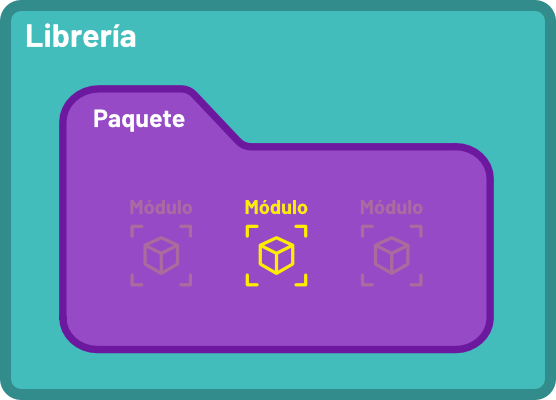
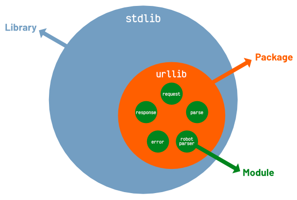
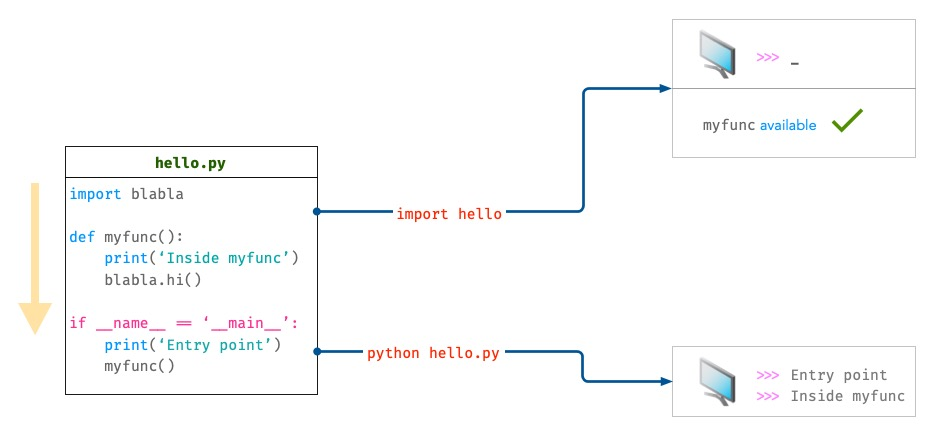

#######
Módulos
#######

.. image:: img/xavi-cabrera-kn-UmDZQDjM-unsplash.jpg

Escribir pequeños trozos de código puede resultar interesante para realizar determinadas pruebas o funcionalidades sencillas. Pero a la larga, nuestros programas tenderán a crecer y será necesario agrupar el código en piezas más manejables. [#lego-unsplash]_

************
Organización
************

Los **módulos** son simplemente ficheros de texto que contienen código Python y representan unidades con las que *evitar la repetición* y *favorecer la reutilización*.

Los módulos pueden agruparse en carpetas denominadas **paquetes** mientras que estas carpetas, a su vez, pueden dar lugar a **librerías**.

    Concepto de módulo, paquete y librería

Un ejemplo de todo ello lo encontramos en la `librería estándar`_. Se trata de una librería que ya viene incorporada en Python y que, a su vez, dispone de una serie de paquetes que incluyen distintos módulos.

Un caso concreto dentro de la ``stdlib`` (libería estándar) podría ser el del paquete ``urllib`` -- para operaciones con URLs -- que dispone de 5 módulos:

    Ejemplo de paquete y módulos en la librería estándar

******************
Importar un módulo
******************

Para hacer uso del código de otros módulos usaremos la sentencia ``import``. Esto permite importar el código y las variables de dicho módulo para tenerlas disponibles en nuestro programa.

La forma más sencilla de importar un módulo es ``import <module>`` donde ``module`` es el nombre de otro fichero Python, sin la extensión ``.py``.

Supongamos que partimos del siguiente fichero (*módulo*) ``stats.py``:

.. literalinclude:: files/extramath/stats.py
    :linenos:

Desde otro fichero podríamos hacer uso de las funciones definidas en ``stats.py``. 

Importar módulo completo
========================

Desde otro fichero (en principio en la misma carpeta) haríamos lo siguiente para importar todo el contenido del módulo ``stats.py``:

.. code-block::
    :emphasize-lines: 1
    :linenos:

    >>> import stats

    >>> stats.mean(6, 3, 9, 5)
    5.75
    >>> stats.std(6, 3, 9, 5)
    2.5

.. note:: Nótese que en la **línea 3** debemos anteponer a la función ``mean()`` el :ref:`espacio de nombres <core/modularity/functions:Espacios de nombres>` que define el módulo ``stats``.

En el caso de utilizar un **módulo de la librería estándar**, basta con saber su nombre e importarlo directamente::

    >>> import os

Ruta de búsqueda de módulos
---------------------------

Cuando importamos un módulo en Python el intérprete trata de encontrarlo (por orden) en las rutas definidas en la variable ``sys.path``. Veamos su contenido (para mi caso concreto)::

    >>> import sys

    >>> sys.path
    ['/Users/sdelquin/.pyenv/versions/3.9.1/envs/aprendepython/bin',
     '/Users/sdelquin/.pyenv/versions/3.9.1/lib/python39.zip',
     '/Users/sdelquin/.pyenv/versions/3.9.1/lib/python3.9',
     '/Users/sdelquin/.pyenv/versions/3.9.1/lib/python3.9/lib-dynload',
     '',
     '/Users/sdelquin/.pyenv/versions/3.9.1/envs/aprendepython/lib/python3.9/site-packages']

.. important::
    La **cadena vacía** ``''`` en la lista ``sys.path`` hace referencia a la **carpeta actual** de trabajo.

Modificando la ruta de búsqueda
^^^^^^^^^^^^^^^^^^^^^^^^^^^^^^^

Si queremos modificar la ruta de búsqueda, existen dos opciones:

Modificando directamente la variable ``PYTHONPATH``
    Para ello exportamos dicha variable de entorno desde una terminal:

    .. code-block:: console

        $ export PYTHONPATH=/tmp
    
    Y comprobamos que se ha modificado en ``sys.path``:

    .. code-block::
        :emphasize-lines: 3
    
        >>> sys.path
        ['/Users/sdelquin/.pyenv/versions/3.9.1/envs/aprendepython/bin',
         '/tmp',
         '/Users/sdelquin/.pyenv/versions/3.9.1/lib/python39.zip',
         '/Users/sdelquin/.pyenv/versions/3.9.1/lib/python3.9',
         '/Users/sdelquin/.pyenv/versions/3.9.1/lib/python3.9/lib-dynload',
         '',
         '/Users/sdelquin/.pyenv/versions/3.9.1/envs/aprendepython/lib/python3.9/site-packages']

Modificando directamente la lista ``sys.path``
    Para ello accedemos a lista que está en el módulo ``sys`` de la librería estandar:

    .. code-block::
        :emphasize-lines: 10
    
        >>> sys.path.append('/tmp')  # añadimos al final

        >>> sys.path
        ['/Users/sdelquin/.pyenv/versions/3.9.1/envs/aprendepython/bin',
         '/Users/sdelquin/.pyenv/versions/3.9.1/lib/python39.zip',
         '/Users/sdelquin/.pyenv/versions/3.9.1/lib/python3.9',
         '/Users/sdelquin/.pyenv/versions/3.9.1/lib/python3.9/lib-dynload',
         '',
         '/Users/sdelquin/.pyenv/versions/3.9.1/envs/aprendepython/lib/python3.9/site-packages',
         '/tmp']

    .. code-block::
        :emphasize-lines: 4
    
        >>> sys.path.insert(0, '/tmp')  # insertamos por el principio

        >>> sys.path
        ['/tmp',
         '/Users/sdelquin/.pyenv/versions/3.9.1/envs/aprendepython/bin',
         '/Users/sdelquin/.pyenv/versions/3.9.1/lib/python39.zip',
         '/Users/sdelquin/.pyenv/versions/3.9.1/lib/python3.9',
         '/Users/sdelquin/.pyenv/versions/3.9.1/lib/python3.9/lib-dynload',
         '',
         '/Users/sdelquin/.pyenv/versions/3.9.1/envs/aprendepython/lib/python3.9/site-packages']
    
    .. tip:: El hecho de poner nuestra ruta al principio o al final de ``sys.path`` influye en la búsqueda, ya que si existen dos (o más módulos) que se llaman igual en nuestra ruta de búsqueda, Python usará el primero que encuentre.
    

Importar partes de un módulo
============================

Es posible que no necesitemos todo aquello que está definido en ``stats.py``. Supongamos que sólo vamos a calcular medias. Para ello haremos lo siguiente:

.. code-block::
    :emphasize-lines: 1
    :linenos:

    >>> from stats import mean

    >>> mean(6, 3, 9, 5)
    5.75

.. note:: Nótese que en la **línea 3** ya podemos hacer uso directamente de la función ``mean()`` porque la hemos importado directamente. Este esquema tiene el inconveniente de la posible **colisión de nombres**, en aquellos casos en los que tuviéramos algún objeto con el mismo nombre que el objeto que estamos importando.

Para **importar varios objetos** (funciones en este caso) desde un mismo módulo, podemos especificarlos separados por comas en la misma línea::

    >>> from stats import mean, std

Es posible hacer ``from stats import *`` pero estaríamos importando todos los componentes del módulo, cuando a lo mejor no es lo que necesitamos. A continuación una imagen que define bien este escenario:

    Diferencia entre importar un módulo o su contenido [#import-reddit]_

Importar usando un alias
========================

Hay ocasiones en las que interesa, por colisión de otros nombres o por mejorar la legibilidad, usar un nombre diferente del módulo (u objeto) que estamos importando. Python nos ofrece esta posibilidad a través de la sentencia ``as``.

Supongamos que queremos importar la función del ejemplo anterior pero con otro nombre:

.. code-block::
    :emphasize-lines: 1

    >>> from stats import mean as avg

    >>> avg(6, 3, 9, 5)
    5.75

********
Paquetes
********

Un **paquete** es simplemente una **carpeta** que contiene ficheros ``.py``. Además permite tener una jerarquía con más de un nivel de subcarpetas anidadas.

Para ejemplificar este modelo vamos a crear un paquete llamado ``extramath`` que contendrá 2 módulos:

* :download:`stats.py <files/extramath/stats.py>` para cálculos estadísticos.
* :download:`frac.py <files/extramath/frac.py>` para operaciones auxiliares de fracciones.

El código del módulo de operaciones auxiliares de fracciones ``frac.py`` es el siguiente:

.. literalinclude:: files/extramath/frac.py
    :linenos:

Si nuestro código principal va a estar en un fichero ``main.py`` (*a primer nivel*), la estructura de ficheros nos quedaría tal que así:

.. code-block::
    :emphasize-lines: 3
    :linenos:

    .
    ├── main.py
    └── extramath
        ├── frac.py
        └── stats.py

    1 directory, 3 files

**Línea 2**
    Punto de entrada de nuestro programa a partir del fichero ``main.py``
**Línea 3**
    Carpeta que define el paquete ``extramath``.
**Línea 4**
    Módulo para operaciones auxiliares de fracciones.
**Línea 5**
    Módulo para cálculos estadísticos.

Importar desde un paquete
=========================

Si ya estamos en el fichero ``main.py`` (o a ese nivel) podremos hacer uso de nuestro paquete de la siguiente forma:

.. code-block::
    :emphasize-lines: 1
    :linenos:

    >>> from extramath import frac, stats

    >>> frac.gcd(21, 35)
    7

    >>> stats.mean(6, 3, 9, 5)
    5.75

**Línea 1**
    Importar los módulos ``frac`` y ``stats`` del paquete ``extramath``
**Línea 3**
    Uso de la función ``gcd`` que está definida en el módulo ``frac``
**Línea 5**
    Uso de la función ``mean`` que está definida en el módulo ``stats``

******************
Programa principal
******************

Cuando decidimos desarrollar una pieza de software en Python, normalmente usamos distintos ficheros para ello. Algunos de esos ficheros se convertirán en *módulos*, otros se englobarán en *paquetes* y existirá uno en concreto que será nuestro **punto de entrada**, también llamado **programa principal**.

.. hint:: Suele ser una buena práctica llamar ``main.py`` al fichero que contiene nuestro programa principal.

La estructura que suele tener este *programa principal* es la siguiente::

    # imports de la librería estándar
    # imports de librerías de terceros
    # imports de módulos propios

    # CÓDIGO PROPIO
    # ...
    # CÓDIGO PROPIO

    if __name__ == '__main__':
        # punto de entrada real

Si queremos ejecutar este fichero ``main.py`` desde línea de comandos, tendríamos que hacer:

.. code-block:: console

    $ python main.py

.. note::
    Para llamar a función no es necesario que esté definida "antes" en el código, puede estar después. Pero siempre se trata de escribir el código intentado poner primero aquello que vamos a usar después.

``if __name__ == '__main__'``
=============================

Esta condición permite, en el programa principal, diferenciar qué codigo se lanzará cuando el fichero se ejecuta directamente o cuando el fichero se importa desde otro lugar.

La variable ``__name__`` toma los siguientes valores:

- El nombre del módulo (o paquete) al **importar** el fichero.
- El valor ``'__main__'`` al **ejecutar** el fichero.

Supongamos el siguiente programa ``hello.py`` y analizemos cuál es el comportamiento según el escenario escogido:

.. literalinclude:: files/hello.py
    :linenos:

    Comportamiento de un programa principal al importarlo o ejecutarlo

``import hello``
    El código se ejecuta siempre desde la primera instrucción a la última:

    * **Línea 1**: se importa el módulo ``blabla``.
    * **Línea 4**: se define la función ``myfunc()`` y estará disponible para usarse.
    * **Línea 9**: esta condición **no** se cumple, ya que estamos importando y la variable especial ``__name__`` no toma ese valor. Con lo cual finaliza la ejecución.
    * *No hay salida por pantalla*.

``$ python hello.py``
    El código se ejecuta siempre desde la primera instrucción a la última:

    * **Línea 1**: se importa el módulo ``blabla``.
    * **Línea 4**: se define la función ``myfunc()`` y estará disponible para usarse.
    * **Línea 9**: esta condición **sí** se cumple, ya que estamos ejecutando directamente el fichero (*como programa principal*) y la variable especial ``__name__`` toma el valor ``__main__``.
    * **Línea 10**: salida por pantalla de la cadena de texto ``Entry point``.
    * **Línea 11**: llamada a la función ``myfunc()`` que muestra por pantalla ``Inside myfunc``, además de invocar a la función ``hi()`` del módulo ``blabla``.

*********************
Ampliar conocimientos
*********************

- `Defining Main Functions in Python <https://realpython.com/courses/python-main-function/>`_
- `Python Modules and Packages: An Introduction <https://realpython.com/courses/python-modules-packages/>`_
- `Absolute vs Relative Imports in Python <https://realpython.com/courses/absolute-vs-relative-imports-python/>`_
- `Running Python Scripts <https://realpython.com/courses/running-python-scripts/>`_
- `Writing Beautiful Pythonic Code With PEP 8 <https://realpython.com/courses/writing-beautiful-python-code-pep-8/>`_
- `Python Imports 101 <https://realpython.com/courses/python-imports-101/>`_
- `Clean Code in Python <https://testdriven.io/blog/clean-code-python/>`_

.. --------------- Footnotes ---------------

.. [#lego-unsplash] Foto original por `Xavi Cabrera`_ en Unsplash.
.. [#import-reddit] Imagen de `ProgrammerHumor`_ en Reddit.

.. --------------- Hyperlinks ---------------

.. _Xavi Cabrera: https://unsplash.com/@xavi_cabrera?utm_source=unsplash&utm_medium=referral&utm_content=creditCopyText
.. _ProgrammerHumor: https://www.reddit.com/r/ProgrammerHumor/comments/11zi2kv/wait_but_i_thought_they_were_the_same_thing/
.. _librería estándar: https://docs.python.org/es/3/library/
