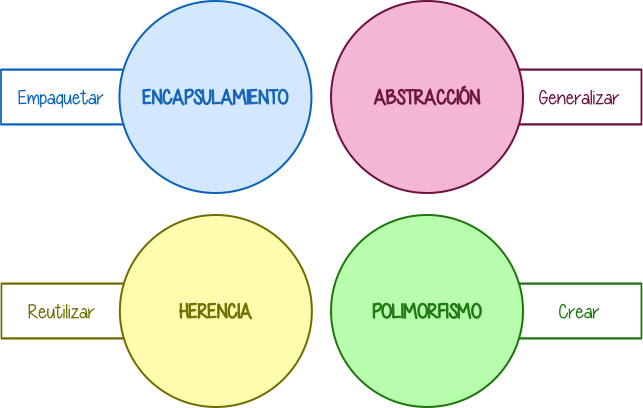
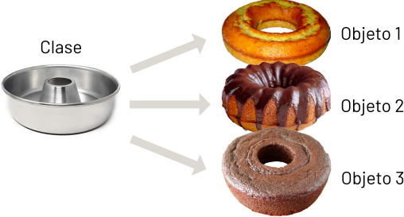
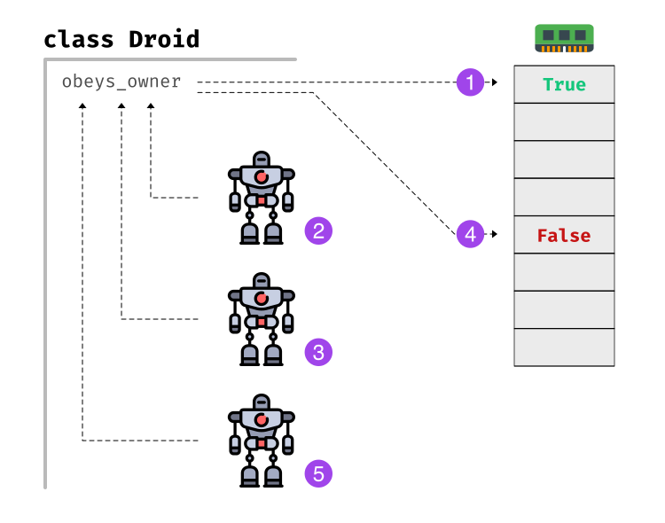
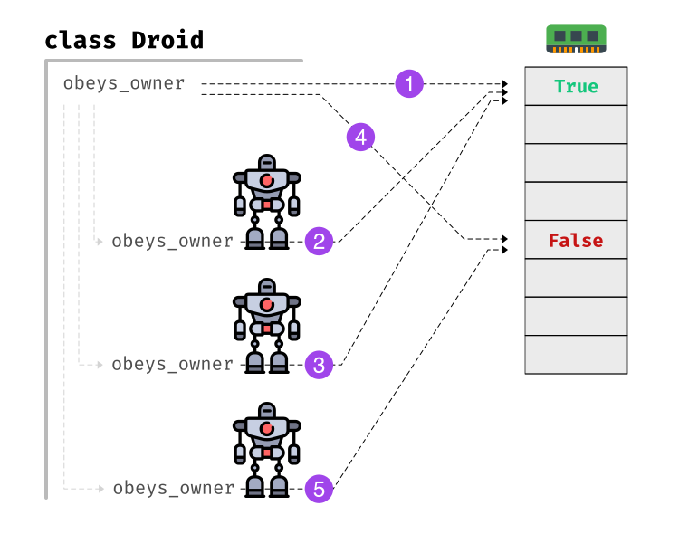
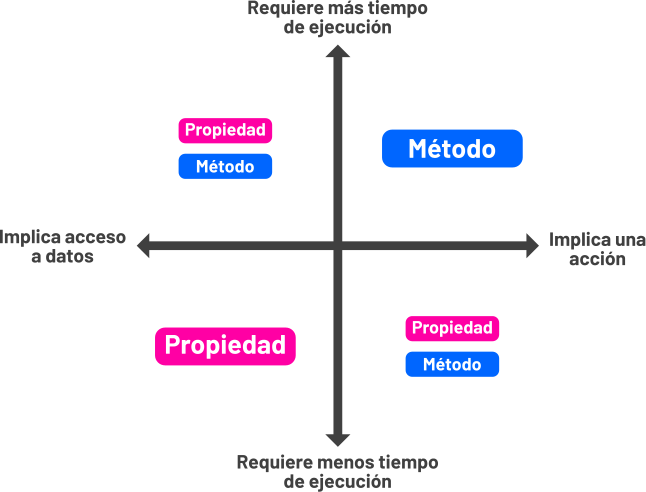
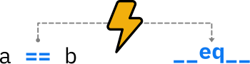
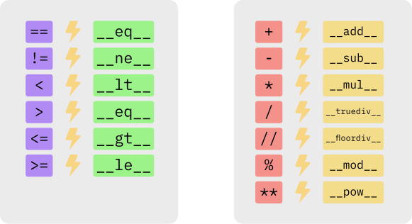
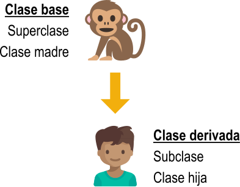
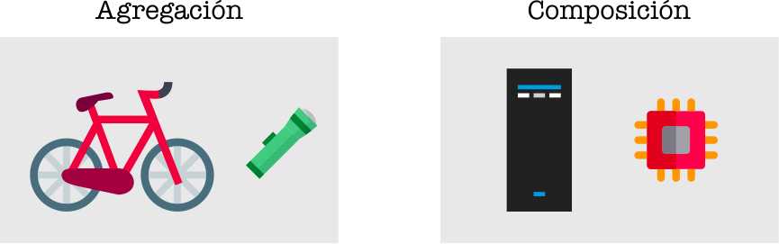
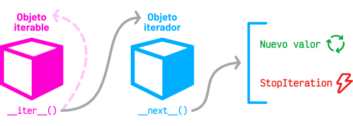

################
Objetos y Clases
################

.. image:: img/rabie-madaci-skx1Rn6LW9I-unsplash.jpg

Hasta ahora hemos estado usando objetos de forma totalmente transparente, casi sin ser conscientes de ello. Pero, en realidad, **todo en Python es un objeto**, desde números a funciones. El lenguaje provee ciertos mecanismos para no tener que usar explícitamente técnicas de orientación a objetos.

Llegados a este punto, investigaremos en profundidad la creación y manipulación de clases y objetos, así como todas las técnicas y procedimientos que engloban este paradigma. [#things-unsplash]_

********************************
Programación orientada a objetos
********************************

La programación orientada a objetos (`POO`_) o en sus siglas inglesas **OOP** es una manera de programar (paradigma) que permite llevar al código mecanismos usados con entidades de la vida real.

Sus **beneficios** son los siguientes:

**Encapsulamiento**
    Permite **empaquetar** el código dentro de una unidad (objeto) donde se puede determinar el ámbito de actuación.
**Abstracción**
    Permite **generalizar** los tipos de objetos a través de las clases y simplificar el programa.
**Herencia**
    Permite **reutilizar** código al poder heredar atributos y comportamientos de una clase a otra.
**Polimorfismo**
    Permite **crear** múltiples objetos a partir de una misma pieza flexible de código.

    Beneficios de la Programación Orientada a Objetos

¿Qué es un objeto?
==================

Un **objeto** es una **estructura de datos personalizada** que contiene **datos** y **código**:

+-----------+-----------+-----------------+-----------------------+
| Elementos | ¿Qué son? | ¿Nombre en POO? | ¿Cómo se identifican? |
+===========+===========+=================+=======================+
| Datos     | Variables | Atributos       | Mediante sustantivos  |
+-----------+-----------+-----------------+-----------------------+
| Código    | Funciones | Métodos         | Mediante verbos       |
+-----------+-----------+-----------------+-----------------------+

Un objeto representa **una instancia única** de alguna entidad (a través de los valores de sus atributos) e interactúa con otros objetos (o consigo mismo) a través de sus métodos.

.. figure:: img/bike-object.svg
    :align: center

    Analogía de atributos y métodos en un objeto "bicicleta"

¿Qué es una clase?
==================

Para crear un objeto primero debemos definir la clase que lo contiene. Podemos pensar en la **clase** como el **molde** con el que se crean nuevos objetos de ese tipo.

    Ejemplificación de creación de objetos a partir de una clase

En el **proceso de diseño** de una clase hay que tener en cuenta -- entre otros -- el **principio de responsabilidad única** [#solid-principles]_, intentando que los atributos y los métodos que contenga esa clase estén enfocados a un *objetivo único y bien definido*.

***************
Creando objetos
***************

Empecemos por crear nuestra **primera clase**. En este caso vamos a modelar algunos de los `droides de la saga StarWars`_:

    Droides de la saga StarWars [#starwars-droids]_

Para ello usaremos la palabra reservada ``class`` seguida del nombre de la clase::

    >>> class StarWarsDroid:
    ...     pass  # pass no hace nada
    ...

.. hint:: Los nombres de clases se suelen escribir en formato ``CamelCase`` y en singular [#pep8]_.

Existen multitud de droides en el universo StarWars. Una vez que hemos definido la clase genérica podemos crear **instancias/objetos** (droides) concretos::

    >>> c3po = StarWarsDroid()
    >>> r2d2 = StarWarsDroid()
    >>> bb8 = StarWarsDroid()

    >>> type(c3po)
    __main__.StarWarsDroid
    >>> type(r2d2)
    __main__.StarWarsDroid
    >>> type(bb8)
    __main__.StarWarsDroid

Añadiendo métodos
=================

Un **método** es una función que forma parte de una clase o de un objeto. En su ámbito tiene acceso a otros métodos y atributos de la clase o del objeto al que pertenece.

La definición de un método (de instancia) es análoga a la de una función ordinaria, pero incorporando un primer parámetro ``self`` que hace referencia a la instancia actual del objeto.

Una de las acciones más sencillas que se pueden hacer sobre un droide es encenderlo o apagarlo. Vamos a implementar estos dos métodos en nuestra clase::

    >>> class Droid:
    ...     def switch_on(self):
    ...         print("Hi! I'm a droid. Can I help you?")
    ...
    ...     def switch_off(self):
    ...         print("Bye! I'm going to sleep")
    ...

    >>> k2so = Droid()

    >>> k2so.switch_on()
    Hi! I'm a droid. Can I help you?

    >>> k2so.switch_off()
    Bye! I'm going to sleep

.. hint::
    El nombre ``self`` es sólo una convención. Este parámetro puede llamarse de otra manera, pero seguir el estándar ayuda a la legibilidad.

Añadiendo atributos
===================

Un **atributo** no es más que una variable, un nombre al que asignamos un valor, con la particularidad de vivir dentro de una clase o de un objeto.

Supongamos que, siguiendo con el ejemplo anterior, queremos guardar en un atributo el estado del droide (encendido/apagado)::

    >>> class Droid:
    ...     def switch_on(self):
    ...         self.power_on = True
    ...         print("Hi! I'm a droid. Can I help you?")
    ...
    ...     def switch_off(self):
    ...         self.power_on = False
    ...         print("Bye! I'm going to sleep")

    >>> k2so = Droid()

    >>> k2so.switch_on()
    Hi! I'm a droid. Can I help you?
    >>> k2so.power_on
    True

    >>> k2so.switch_off()
    Bye! I'm going to sleep
    >>> k2so.power_on
    False

.. important::
    Siempre que queramos acceder a cualquier método o atributo del objeto habrá que utilizar la palabra ``self``.

Inicialización
==============

Existe un **método especial** que se ejecuta cuando creamos una instancia de un objeto. Este método es ``__init__`` y nos permite asignar atributos y realizar operaciones con el objeto en el momento de su creación. También es ampliamente conocido como el **constructor**. 

Veamos un ejemplo de este método con nuestros droides en el que únicamente guardaremos el nombre del droide como un atributo del objeto:

.. code-block::
    :linenos:

    >>> class Droid:
    ...     def __init__(self, name: str):
    ...         self.name = name
    ...

    >>> droid = Droid('BB-8')

    >>> droid.name
    'BB-8'

**Línea 2**
    Definición del constructor.
**Línea 7**
    Creación del objeto (y llamada implícita al constructor)
**Línea 9**
    Acceso al atributo ``name`` creado previamente en el constructor.

Es importante tener en cuenta que si no usamos ``self`` estaremos creando una variable local en vez de un atributo del objeto::

    >>> class Droid:
    ...     def __init__(self, name: str):
    ...         name = name  # No lo hagas!
    ...

    >>> droid = Droid('BB-8')

    >>> droid.name
    Traceback (most recent call last):
      File "<stdin>", line 1, in <module>
    AttributeError: 'Droid' object has no attribute 'name'

.. admonition:: Ejercicio
    
    :pypas:`mobile-phone`

*********
Atributos
*********

Acceso directo
==============

En el siguiente ejemplo vemos que, aunque el atributo ``name`` se ha creado en el constructor de la clase, también podemos modificarlo desde "fuera" con un acceso directo::

    >>> class Droid:
    ...     def __init__(self, name: str):
    ...         self.name = name
    ...

    >>> droid = Droid('C-3PO')

    >>> droid.name
    'C-3PO'

    >>> droid.name = 'waka-waka'  # esto sería válido!

Python nos permite **añadir atributos dinámicamente** a un objeto incluso después de su creación::

    >>> droid.manufacturer = 'Cybot Galactica'
    >>> droid.height = 1.77

.. note::
    Nótese el acceso a los atributos con ``obj.attribute`` en vez de lo que veníamos usando en :ref:`diccionarios <core/datastructures/dicts:diccionarios>` donde hay que escribir "un poco más" ``obj['attribute']``.

Propiedades
===========

Como hemos visto previamente, los atributos definidos en un objeto son accesibles públicamente. Esto puede parecer extraño a personas que vengan de otros lenguajes de programación (véase Java). En Python existe un cierto "sentido de la responsabilidad" a la hora de programar y manejar este tipo de situaciones: Casi todo es posible a priori pero se debe controlar explícitamente.

Una primera solución "pitónica" para la privacidad de los atributos es el uso de **propiedades**. La forma más común de aplicar propiedades es mediante el uso de :ref:`decoradores <core/modularity/functions:Decoradores>`:

- ``@property`` para leer el valor de un atributo ("getter").
- ``@name.setter`` para escribir el valor de un atributo.

Veamos un ejemplo en el que estamos ofuscando el nombre del droide a través de propiedades::

    >>> class Droid:
    ...     def __init__(self, name: str):
    ...         self.hidden_name = name
    ...
    ...     @property
    ...     def name(self) -> str:
    ...         print('inside the getter')
    ...         return self.hidden_name
    ...
    ...     @name.setter
    ...     def name(self, name: str) -> None:
    ...         print('inside the setter')
    ...         self.hidden_name = name
    ...

    >>> droid = Droid('N1-G3L')

    >>> droid.name
    inside the getter
    'N1-G3L'

    >>> droid.name = 'Nigel'
    inside the setter

    >>> droid.name
    inside the getter
    'Nigel'

En cualquier caso, seguimos pudiendo acceder directamente a ``.hidden_name``::

    >>> droid.hidden_name
    'Nigel'

Incluso podemos cambiar su valor::

    >>> droid.hidden_name = 'waka-waka'

    >>> droid.name
    inside the getter
    'waka-waka'

Valores calculados
------------------

Una propiedad también se puede usar para devolver un **valor calculado** (o computado).

A modo de ejemplo, supongamos que la altura del periscopio de los droides astromecánicos se calcula siempre como un porcentaje de su altura. Veamos cómo implementarlo::

    >>> class AstromechDroid:
    ...     def __init__(self, name: str, height: float):
    ...         self.name = name
    ...         self.height = height
    ...
    ...     @property
    ...     def periscope_height(self) -> float:
    ...         return 0.3 * self.height
    ...

    >>> droid = AstromechDroid('R2-D2', 1.05)

    >>> droid.periscope_height  # podemos acceder como atributo
    0.315

    >>> droid.periscope_height = 10  # no podemos modificarlo
    Traceback (most recent call last):
      File "<stdin>", line 1, in <module>
    AttributeError: can't set attribute

Las propiedades **no pueden recibir parámetros** ya que no tiene sentido semánticamente::

    >>> class AstromechDroid:
    ...     def __init__(self, name: str, height: float):
    ...         self.name = name
    ...         self.height = height
    ...
    ...     @property
    ...     def periscope_height(self, from_ground: bool = False) -> float:
    ...         height_factor = 1.3 if from_ground else 0.3
    ...         return height_factor * self.height
    ...

    >>> droid = AstromechDroid('R2-D2', 1.05)

    >>> droid.periscope_height
    0.315

    >>> droid.periscope_height(from_ground=True)
    Traceback (most recent call last):
      File "<stdin>", line 1, in <module>
    TypeError: 'float' object is not callable

En este caso tendríamos que implementar un método para resolver el escenario planteado.

.. hint:: La ventaja de usar valores calculados sobre simples atributos es que el cambio de valor en un atributo no asegura que actualicemos otro atributo, y además siempre podremos modificar directamente el valor del atributo, con lo que podríamos obtener efectos colaterales indeseados.

Cacheando propiedades
---------------------

En los ejemplos anteriores hemos creado una propiedad que calcula el alto del periscopio de un droide astromecánico a partir de su altura. El "coste" de este cálculo es bajo, pero imaginemos por un momento que fuera muy alto.

Si cada vez que accedemos a dicha propiedad tenemos que realizar ese cálculo, estaríamos siendo muy ineficientes (en el caso de que la altura del droide no cambiara). Veamos una aproximación a este escenario usando el **cacheado de propiedades**::

    >>> class AstromechDroid:
    ...     def __init__(self, name: str, height: float):
    ...         self.name = name
    ...         self.height = height  # llamada al setter
    ...
    ...     @property
    ...     def height(self) -> float:
    ...         return self._height
    ...
    ...     @height.setter
    ...     def height(self, height: float) -> None:
    ...         self._height = height
    ...         self._periscope_height = None  # invalidar caché
    ...
    ...     @property
    ...     def periscope_height(self) -> float:
    ...         if self._periscope_height is None:
    ...             print('Calculating periscope height...')
    ...             self._periscope_height = 0.3 * self.height
    ...         return self._periscope_height

Probamos ahora la implementación diseñada, modificando la altura del droide::

    >>> droid = AstromechDroid('R2-D2', 1.05)

    >>> droid.periscope_height
    Calculating periscope height...
    0.315
    >>> droid.periscope_height  # Cacheado!
    0.315

    >>> droid.height = 1.15

    >>> droid.periscope_height
    Calculating periscope height...
    0.345
    >>> droid.periscope_height  # Cacheado!
    0.345

Ocultando atributos
===================

Python tiene una convención sobre aquellos atributos que queremos hacer **"privados"** (u ocultos): comenzar el nombre con doble subguión ``__``

.. code-block::

    >>> class Droid:
    ...     def __init__(self, name: str):
    ...         self.__name = name
    ...

    >>> droid = Droid('BC-44')

    >>> droid.__name  # efectivamente no aparece como atributo
    Traceback (most recent call last):
      File "<stdin>", line 1, in <module>
    AttributeError: 'Droid' object has no attribute '__name'

Lo que realmente ocurre tras el telón se conoce como "*name mangling*" y consiste en modificar el nombre del atributo incorporado la clase como un prefijo. Sabiendo esto podemos acceder al valor del atributo supuestamente privado::

    >>> droid._Droid__name
    'BC-44'

.. note::
    La filosofía de Python permite hacer casi cualquier cosa con los objetos que se manejan, eso sí, el sentido de la responsabilidad se traslada a la persona que desarrolla e incluso a la persona que hace uso del objeto.

Atributos de clase
==================

Podemos asignar atributos a una clase y serán asumidos por todos los objetos instanciados de esa clase.

A modo de ejemplo, en un principio, todos los droides están diseñados para que obedezcan a su dueño. Esto lo conseguiremos a nivel de clase, salvo que ese comportamiento se sobreescriba::

    >>> class Droid:
    ...     obeys_owner = True  # obedece a su dueño
    ...

    >>> good_droid = Droid()
    >>> good_droid.obeys_owner
    True

    >>> t1000 = Droid()  # T-1000 (Terminator)
    >>> t1000.obeys_owner = False
    >>> t1000.obeys_owner
    False

    >>> Droid.obeys_owner  # el cambio no afecta a nivel de clase
    True

.. tip::
    Los atributos de clase son accesibles tanto desde la clase como desde las instancias creadas.

Hay que tener en cuenta lo siguiente:

- Si modificamos un atributo de clase desde un objeto, sólo modificamos el valor en el objeto y no en la clase.
- Si modificamos un atributo de clase desde una clase, **modificamos el valor en todos los objetos pasados y futuros**.

Veamos un ejemplo de esto último:

.. code-block::
    :emphasize-lines: 13

    >>> class Droid:
    ...     obeys_owner = True
    ...

    >>> droid1 = Droid()
    >>> droid1.obeys_owner
    True

    >>> droid2 = Droid()
    >>> droid2.obeys_owner
    True

    >>> Droid.obeys_owner = False  # cambia pasado y futuro

    >>> droid1.obeys_owner
    False
    >>> droid2.obeys_owner
    False

    >>> droid3 = Droid()
    >>> droid3.obeys_owner
    False

La explicación de este fenómeno es sencilla: Todas las instancias (pasadas y futuras) del droide tienen un "atributo" ``obeys_owner`` que "apunta" a la misma zona de memoria que la del atributo ``obeys_owner`` de la clase::

    >>> id(Droid.obeys_owner)
    4385213672
    >>> id(droid1.obeys_owner)
    4385213672
    >>> id(droid2.obeys_owner)
    4385213672
    >>> id(droid3.obeys_owner)
    4385213672

    Atributo de clase

Supongamos que tras el cambio "global" de ``obeys_owner`` lo que buscamos es que **sólo se modifiquen los droides futuros pero no los pasados**.

Para poder abordar este escenario debemos recurrir a **atributos de instancia**.

    >>> class Droid:
    ...     obeys_owner = True
    ...     def __init__(self):
    ...         self.obeys_owner = Droid.obeys_owner
    ...

Ahora veamos cuál es el comportamiento::

    >>> droid1 = Droid()
    >>> droid1.obeys_owner
    True
    
    >>> droid2 = Droid()
    >>> droid2.obeys_owner
    True
    
    >>> Droid.obeys_owner = False

    >>> droid1.obeys_owner
    True
    >>> droid2.obeys_owner
    True
    
    >>> droid3 = Droid()
    >>> droid3.obeys_owner
    False

    Atributo de clase con asignación de instancia

*******
Métodos
*******

Métodos de instancia
====================

Un **método de instancia** es un método que modifica o accede al estado del objeto al que hace referencia. Recibe ``self`` como primer parámetro, el cual se convierte en el propio objeto sobre el que estamos trabajando. Python envía este argumento de forma transparente: no hay que pasarlo como argumento.

Veamos un ejemplo en el que, además del constructor, creamos un método de instancia para hacer que un droide se mueva:

.. code-block::
    :emphasize-lines: 6

    >>> class Droid:
    ...     def __init__(self, name: str):  # método de instancia -> constructor
    ...         self.name = name
    ...         self.covered_distance = 0
    ...
    ...     def move_up(self, steps: int) -> None:  # método de instancia
    ...         self.covered_distance += steps
    ...         print(f'Moving {steps} steps')
    ...

    >>> droid = Droid('C1-10P')

    >>> droid.move_up(10)
    Moving 10 steps

Propiedades vs Métodos
----------------------

Es razonable plantearse cuándo usar :ref:`propiedades <core/modularity/oop:propiedades>` o cuándo usar :ref:`métodos de instancia <core/modularity/oop:métodos de instancia>`.

Si la implementación requiere de parámetros, no hay confusión, necesitamos usar métodos.

Pero más allá de esto, no existe una respuesta clara y concisa a la pregunta. Aunque sí podemos dar algunas "pistas" para saber cuándo usar propiedades o cuándo usar métodos:

    ¿Cuándo usar propiedades vs métodos?

Métodos de clase
================

Un **método de clase** es un método que modifica o accede al estado de la clase a la que hace referencia. Recibe ``cls`` como primer parámetro, el cual se convierte en la propia clase sobre la que estamos trabajando. Python envía este argumento de forma transparente. La identificación de estos métodos se completa aplicando el decorador ``@classmethod`` a la función.

Veamos un ejemplo en el que implementamos un método de clase que **muestra el número de droides creados**:

.. code-block::
    :emphasize-lines: 7-8

    >>> class Droid:
    ...     count = 0
    ...
    ...     def __init__(self):
    ...         Droid.count += 1
    ...
    ...     @classmethod
    ...     def total_droids(cls) -> None:
    ...         print(f'{cls.count} droids built so far!')
    ...

    >>> droid1 = Droid()
    >>> droid2 = Droid()
    >>> droid3 = Droid()

    >>> Droid.total_droids()
    3 droids built so far!

.. hint::
    El nombre ``cls`` es sólo una convención. Este parámetro puede llamarse de otra manera, pero seguir el estándar ayuda a la legibilidad.

Métodos estáticos
=================

Un **método estático** es un método que no "debería" modificar el estado del objeto ni de la clase. No recibe ningún parámetro especial. La identificación de estos métodos se completa aplicando el decorador ``@staticmethod`` a la función.

Veamos un ejemplo en el que creamos un método estático para devolver las categorías de droides que existen en StarWars:

.. code-block::
    :emphasize-lines: 5,6

    >>> class Droid:
    ...     def __init__(self):
    ...         pass
    ...
    ...     @staticmethod
    ...     def get_droids_categories() -> tuple[str]:
    ...         return ('Messeger', 'Astromech', 'Power', 'Protocol')
    ...

    >>> Droid.get_droids_categories()
    ('Messeger', 'Astromech', 'Power', 'Protocol')

Métodos decorados
-----------------

Es posible que, según el escenario, queramos **decorar ciertos métodos** de nuestra clase. Esto lo conseguiremos siguiendo la misma estructura de :ref:`decoradores <core/modularity/functions:decoradores>` que ya hemos visto, pero con ciertos matices.

A continuación veremos un ejemplo en el que creamos un decorador para auditar las acciones de un droide y saber quién ha hecho qué:

.. code-block::
    :emphasize-lines: 2-7

    >>> class Droid:
    ...     @staticmethod
    ...     def audit(method):
    ...         def wrapper(self, *args, **kwargs):
    ...             print(f'Droid {self.name} running {method.__name__}')
    ...             return method(self, *args, **kwargs)  # Ojo llamada!
    ...         return wrapper
    ...
    ...     def __init__(self, name: str):
    ...         self.name = name
    ...         self.pos = [0, 0]
    ...
    ...     @audit
    ...     def move(self, x: int, y: int):
    ...         self.pos[0] += x
    ...         self.pos[1] += y
    ...
    ...     @audit
    ...     def reset(self):
    ...         self.pos = [0, 0]
    
    >>> droid = Droid('B1')
    
    >>> droid.move(1, 1)
    Droid B1 running move
    
    >>> droid.reset()
    Droid B1 running reset

A tener en cuenta la llamada al método de instancia dentro del decorador::

    >>> method(self, *args, **kwargs) == self.method(*args, **kwargs)

El decorador se puede poner dentro o fuera de la clase. Por una cuestión de encapsulamiento podría tener sentido dejarlo **dentro de la clase como método estático**.

.. seealso::
    También es posible aplicar esta misma técnica usando :ref:`decoradores con parámetros <core/modularity/functions:decoradores con parámetros>`.

Métodos mágicos
===============

Cuando escribimos ``'hello world' * 3`` ¿cómo sabe el objeto ``'hello world'`` lo que debe hacer para multiplicarse con el objeto entero ``3``? O dicho de otra forma, ¿cuál es la implementación del operador ``*`` para "strings" e "int"? En valores numéricos puede parecer evidente (siguiendo los operadores matemáticos), pero no es así para otros objetos.  La solución que proporciona Python para estas (y otras) situaciones son los **métodos mágicos**.

Los métodos mágicos empiezan y terminan por doble subguión ``__`` (es por ello que también se les conoce como "dunder-methods"). Uno de los "dunder-methods" más famosos es el constructor de una clase: ``__init__()``.

.. important:: Digamos que los métodos mágicos se "disparan" de manera transparente cuando utilizamos ciertas estructuras y expresiones del lenguaje.

Para el caso de los operadores, existe un método mágico asociado (que podemos personalizar). Por ejemplo la comparación de dos objetos se realiza con el método ``__eq__()``:

    Ejecución de método mágico mediante operador

Extrapolando esta idea a nuestro universo StarWars, podríamos establecer que dos droides son iguales si su nombre es igual, independientemente de que tengan distintos números de serie:

.. code-block::
    :emphasize-lines: 6,7

    >>> class Droid:
    ...     def __init__(self, name: str, serial_number: int):
    ...         self.name = name
    ...         self.serial_number = serial_number
    ...
    ...     def __eq__(self, droid: Droid) -> bool:
    ...         return self.name == droid.name
    ...

    >>> droid1 = Droid('C-3PO', 43974973242)
    >>> droid2 = Droid('C-3PO', 85094905984)

    >>> droid1 == droid2  # llamada implícita a __eq__
    True

    >>> droid1.__eq__(droid2)
    True

.. tip::
    | Para poder utilizar la anotación de tipo ``Droid`` necesitamos añadir la siguiente línea al principio de nuestro código:  
    | ``from __future__ import annotations``
    

    Métodos mágicos para comparaciones y operaciones matemáticas

.. note:: Los métodos mágicos no sólo están restringidos a operadores de comparación o matemáticos. Existen muchos otros en la documentación oficial de Python, donde son llamados `métodos especiales`_.

Veamos un ejemplo en el que **"sumamos" dos droides** (*esto se podría ver como una fusión*). Supongamos que la suma de dos droides implica: a) que el nombre del droide resultante es la concatenación de los nombres de los droides de entrada; b) que la energía del droide resultante es la suma de la energía de los droides de entrada::

    >>> class Droid:
    ...     def __init__(self, name: str, power: int):
    ...         self.name = name
    ...         self.power = power
    ...
    ...     def __add__(self, other: Droid) -> Droid:
    ...         new_name = self.name + '-' + other.name
    ...         new_power = self.power + other.power
    ...         return Droid(new_name, new_power)  # Hay que devolver un objeto de tipo Droid
    ...

    >>> droid1 = Droid('C3PO', 45)
    >>> droid2 = Droid('R2D2', 91)

    >>> droid3 = droid1 + droid2

    >>> print(f'Fusion droid:\n{droid3.name} with power {droid3.power}')
    Fusion droid:
    C3PO-R2D2 with power 136

.. important::
    Este tipo de operaciones debe **devolver un objeto** de la clase con la que estamos trabajando.

.. tip::
    En este tipo de métodos mágicos el parámetro suele llamarse ``other`` haciendo referencia al "otro" objeto que entra en la operación. Es una convención.

Sobrecarga de operadores
------------------------

¿Qué ocurriría si sumamos un número entero a un droide? De primeras nada, porque no lo tenemos contemplado, pero podríamos establecer un significado: Si sumamos un número entero a un droide éste aumenta su energía en el valor indicado. Vamos a intentar añadir también este comportamiento al operador suma ya implementado.

Aunque en Python no existe técnicamente la "sobrecarga de funciones", sí que podemos simularla identificando el tipo del objeto que nos pasan y realizando acciones en base a ello:

.. code-block::
    :emphasize-lines: 7,10

    >>> class Droid:
    ...     def __init__(self, name: str, power: int):
    ...         self.name = name
    ...         self.power = power
    ...
    ...     def __add__(self, other: Droid | int) -> Droid:
    ...         if isinstance(other, Droid):
    ...             new_name = self.name + '-' + other.name
    ...             new_power = self.power + other.power
    ...         elif isinstance(other, int):
    ...             new_name = self.name
    ...             new_power = self.power + other
    ...         return Droid(new_name, new_power)
    ...

    >>> droid = Droid('L3-37', 75)

    >>> powerful_droid = droid + 25

    >>> powerful_droid.power
    100

Esta misma estrategia se puede aplicar al **operador de igualdad** ya que es muy habitual encontrar comparaciones de objetos en nuestro código. Por ello, deberíamos tener en cuenta si se van a comparar dos objetos de distinta naturaleza.

Retomando el caso ya visto... **¿qué pasaría si comparamos un droide con una cadena de texto?**

.. code-block::
    :emphasize-lines: 7,12,16

    >>> class Droid:
    ...     def __init__(self, name: str, serial_number: int):
    ...         self.name = name
    ...         self.serial_number = serial_number
    ...
    ...     def __eq__(self, droid: Droid) -> bool:
    ...         return self.name == droid.name
    ...

    >>> droid = Droid('C-3PO', 43974973242)

    >>> droid == 'C-3PO'
    Traceback (most recent call last):
      File "<stdin>", line 1, in <module>
      File "<stdin>", line 6, in __eq__
    AttributeError: 'str' object has no attribute 'name'

No funciona. Debemos contemplar el caso donde recibimos un objeto "cualquiera" a la hora de comparar. Veamos una posible implementación del operador de igualdad::

    >>> class Droid:
    ...     def __init__(self, name: str, serial_number: int):
    ...         self.name = name
    ...         self.serial_number = serial_number
    ...
    ...     def __eq__(self, other: Droid | object) -> bool:
    ...         if isinstance(other, Droid):
    ...             return self.name == droid.name
    ...         return False
    ...

Ahora podemos comprobar que todo funciona como esperaríamos::

    >>> droid = Droid('C-3PO', 43974973242)

    >>> droid == 'C-3PO'
    False

``__str__``
-----------

Uno de los métodos mágicos más utilizados es ``__str__`` y permite establecer la forma en la que un objeto es representado como *cadena de texto*::

    >>> class Droid:
    ...     def __init__(self, name: str, serial_number: int):
    ...         self.serial_number = serial_number
    ...         self.name = name
    ...
    ...     def __str__(self) -> str:
    ...         return f'🤖 Droid "{self.name}" serial-no {self.serial_number}'
    ...

    >>> droid = Droid('K-2SO', 8403898409432)

    >>> print(droid)  # llamada a droid.__str__()
    🤖 Droid "K-2SO" serial-no 8403898409432

    >>> str(droid)
    '🤖 Droid "K-2SO" serial-no 8403898409432'

    >>> f'Droid -> {droid}'
    'Droid -> 🤖 Droid "K-2SO" serial-no 8403898409432'

.. admonition:: Ejercicio
    
    :pypas:`fraction`

``__repr__``
------------

En ausencia del método ``__str__()`` se usará por defecto el método ``__repr__()``. La diferencia entre ambos métodos es que el primero está más pensado para una representación del objeto de cara al usuario mientras que el segundo está más orientado al desarrollador.

El método ``__repr()__`` **se invoca automáticamente** en los dos siguientes escenarios:

1. Cuando no existe el método ``__str__()`` en el objeto y tratamos de encontrar su representación en cadena de texto con ``str()`` o ``print()``.
2. Cuando utilizamos el intérprete interactivo de Python y pedimos el "valor" del objeto.

Veamos un ejemplo. En primer lugar un droide que sólo implementa el método ``__str__()``::

    >>> class Droid:
    ...     def __init__(self, name: str):
    ...         self.name = name
    ...
    ...     def __str__(self):
    ...         return f"Hi there! I'm {self.name}"
    ...

    >>> c14 = Droid('C-14')

    >>> print(c14)  # __str()__
    Hi there! I'm C-14

    >>> c14  # __repr()__
    <__main__.Droid at 0x103d7cc10>

Ahora implementamos también el método ``__repr__()``::

    >>> class Droid:
    ...     def __init__(self, name: str):
    ...         self.name = name
    ...
    ...     def __str__(self):
    ...         return f"Hi there! I'm {self.name}"
    ...
    ...     def __repr__(self):
    ...         return f"[Droid] '{self.name}' @ {hex(id(self))}"
    ...

    >>> c14 = Droid('C-14')

    >>> print(c14)  # __str__()
    Hi there! I'm C-14

    >>> c14  # __repr__()
    [Droid] 'C-14' @ 0x103e4e350

.. attention::
    El hecho de incorporar la dirección de memoria del objeto en el método ``__repr__()`` no es en absoluto obligatorio, ni siquiera necesario. Todo depende de los requerimientos que tengamos en el proyecto.

Gestores de contexto
--------------------

Otra de las aplicaciones interesantes de los métodos mágicos/especiales es la de los **gestores de contexto**. Un gestor de contexto permite aplicar una serie de *acciones a la entrada y a la salida* del bloque de código que engloba.

Hay dos métodos que son utilizados para implementar los gestores de contexto:

``__enter__()``
    Acciones que se llevan a cabo al entrar al contexto.
``__exit__()``
    Acciones que se llevan a cabo al salir del contexto.

Veamos un ejemplo en el que implementamos un gestor de contexto que **mide tiempos de ejecución**::

    >>> from time import time

    >>> class Timer():
    ...     def __enter__(self):
    ...         self.start = time()
    ...
    ...     def __exit__(self, exc_type, exc_value, exc_traceback):
    ...         # Omit exception handling
    ...         self.end = time()
    ...         exec_time = self.end - self.start
    ...         print(f'Execution time (seconds): {exec_time:.5f}')
    ...

Aunque en este caso no estamos haciendo uso de los parámetros en la función ``__exit__()``, hacen referencia a una posible :ref:`excepción <core/modularity/exceptions:excepciones>` (error) que se produzca en la ejecución del bloque de código que engloba el contexto. Los tres parámetros son:

1. ``exc_type`` indicando el tipo de la excepción.
2. ``exc_value`` indicando el valor (mensaje) de la excepción.
3. ``exc_traceback`` indicando la "traza" (pila) de llamadas que llevaron hasta la excepción.

Ahora podemos probar nuestro gestor de contexto con un ejemplo concreto. La forma de "activar" el contexto es usar la sentencia ``with`` seguida del símbolo que lo gestiona::

    >>> with Timer():
    ...     for _ in range(1_000_000):
    ...         x = 2 ** 20
    ...
    Execution time (seconds): 0.05283

    >>> with Timer():
    ...     x = 0
    ...     for _ in range(1_000_000):
    ...         x += 2 ** 20
    ...
    Execution time (seconds): 0.08749

Volviendo a nuestro ejemplo de los droides de StarWars, vamos a crear un gestor de contexto que "congele" un droide para resetear su distancia recorrida::

    >>> class Droid:
    ...     def __init__(self, name: str):
    ...         self.name = name
    ...         self.covered_distance = 0
    ...
    ...     def move_up(self, steps: int) -> None:
    ...         self.covered_distance += steps
    ...         print(f'Moving {steps} steps')
    ...
    
    >>> class FrozenDroid:  # Gestor de contexto!
    ...     def __enter__(self, name: str):
    ...         self.droid = Droid(name)
    ...         return self.droid
    ...
    ...     def __exit__(self, *err):
    ...         self.droid.covered_distance = 0
    ...

Veamos este gestor de contexto en acción::

    >>> with FrozenDroid() as droid:
    ...     droid.move_up(10)
    ...     droid.move_up(20)
    ...     droid.move_up(30)
    ...     print(droid.covered_distance)
    ...
    Moving 10 steps
    Moving 20 steps
    Moving 30 steps
    60

    >>> droid.covered_distance  # Distancia reseteada!
    0

********
Herencia
********

La **herencia** consiste en **construir una nueva clase partiendo de una clase existente**, pero que añade o modifica ciertos aspectos. La herencia se considera una buena práctica de programación tanto para *reutilizar código* como para *realizar generalizaciones*.

    Nomenclatura de clases en la herencia [#freepik-icons]_

.. note:: Cuando se utiliza herencia, la clase derivada, de forma automática, puede usar todo el código de la clase base sin necesidad de copiar nada explícitamente.

Heredar desde una clase base
============================

Para que una clase "herede" de otra, basta con indicar la clase base entre paréntesis en la definición de la clase derivada.

Sigamos con el ejemplo galáctico: Una de las grandes categorías de droides en StarWars es la de `droides de protocolo`_. Vamos a crear una herencia sobre esta idea::

    >>> class Droid:
    ...     """ Clase Base """
    ...     pass
    ...

    >>> class ProtocolDroid(Droid):
    ...     """ Clase Derivada """
    ...     pass
    ...

    >>> issubclass(ProtocolDroid, Droid)  # comprobación de herencia
    True

    >>> r2d2 = Droid()
    >>> c3po = ProtocolDroid()

Vamos a añadir un par de métodos a la clase base, y analizar su comportamiento::

    >>> class Droid:
    ...     def switch_on(self):
    ...         print("Hi! I'm a droid. Can I help you?")
    ...
    ...     def switch_off(self):
    ...         print("Bye! I'm going to sleep")
    ...

    >>> class ProtocolDroid(Droid):
    ...     pass
    ...

    >>> r2d2 = Droid()
    >>> c3po = ProtocolDroid()

    >>> r2d2.switch_on()
    Hi! I'm a droid. Can I help you?

    >>> c3po.switch_on()  # método heredado de Droid
    Hi! I'm a droid. Can I help you?

    >>> r2d2.switch_off()
    Bye! I'm going to sleep

Sobreescribir un método
=======================

Como hemos visto, una clase derivada hereda todo lo que tiene su clase base. Pero en muchas ocasiones nos interesa modificar el comportamiento de esta herencia.

En el ejemplo anterior vamos a modificar el comportamiento del método ``switch_on()`` para la clase derivada::

    >>> class Droid:
    ...     def switch_on(self):
    ...         print("Hi! I'm a droid. Can I help you?")
    ...
    ...     def switch_off(self):
    ...         print("Bye! I'm going to sleep")
    ...

    >>> class ProtocolDroid(Droid):
    ...     def switch_on(self):
    ...         print("Hi! I'm a PROTOCOL droid. Can I help you?")
    ...

    >>> r2d2 = Droid()
    >>> c3po = ProtocolDroid()

    >>> r2d2.switch_on()
    Hi! I'm a droid. Can I help you?

    >>> c3po.switch_on()  # método heredado pero sobreescrito
    Hi! I'm a PROTOCOL droid. Can I help you?

Añadir un método
================

La clase derivada puede, como cualquier otra clase "normal",  añadir métodos que no estaban presentes en su clase base. En el siguiente ejemplo vamos a añadir un método ``translate()`` que permita a los *droides de protocolo* traducir cualquier mensaje:

.. code-block::
    :emphasize-lines: 13

    >>> class Droid:
    ...     def switch_on(self):
    ...         print("Hi! I'm a droid. Can I help you?")
    ...
    ...     def switch_off(self):
    ...         print("Bye! I'm going to sleep")
    ...

    >>> class ProtocolDroid(Droid):
    ...     def switch_on(self):
    ...         print("Hi! I'm a PROTOCOL droid. Can I help you?")
    ...
    ...     def translate(self, msg: str, *, from_lang: str) -> str:
    ...         """ Translate from language to Human understanding """
    ...         return f'{msg} means "ZASCA" in {from_lang}'

    >>> r2d2 = Droid()
    >>> c3po = ProtocolDroid()

    >>> c3po.translate('kiitos', from_lang='Huttese')  # idioma de Watoo
    kiitos means "ZASCA" in Huttese

    >>> r2d2.translate('kiitos', from_lang='Huttese')  # droide genérico no puede traducir
    Traceback (most recent call last):
      File "<stdin>", line 1, in <module>
    AttributeError: 'Droid' object has no attribute 'translate'

Con esto ya hemos aportado una personalidad diferente a los droides de protocolo, a pesar de que heredan de la clase genérica de droides de StarWars.

Accediendo a la clase base
==========================

Cuando tenemos métodos (o atributos) definidos **con el mismo nombre** en la clase base y en la clase derivada (**colisión**) debe existir un mecanismo para diferenciarlos.

Para estas ocasiones Python nos ofrece ``super()`` como función para **acceder a métodos (o atributos) de la clase base**.

Este escenario es especialmente recurrente en el constructor de aquellas clases que heredan de otras y necesitan inicializar la clase base.

Veamos un ejemplo más elaborado con nuestros droides:

.. code-block::
    :emphasize-lines: 8

    >>> class Droid:
    ...     def __init__(self, name: str):
    ...         self.name = name
    ...

    >>> class ProtocolDroid(Droid):
    ...     def __init__(self, name: str, languages: list[str]):
    ...         super().__init__(name)  # llamada al constructor de la clase base
    ...         self.languages = languages
    ...

    >>> droid = ProtocolDroid('C-3PO', ['Ewokese', 'Huttese', 'Jawaese'])

    >>> droid.name  # fijado en el constructor de la clase base
    'C-3PO'

    >>> droid.languages  # fijado en el constructor de la clase derivada
    ['Ewokese', 'Huttese', 'Jawaese']    

Herencia múltiple
=================

Aunque no está disponible en todos los lenguajes de programación, Python sí permite heredar de **múltiples clases base**.

Supongamos que queremos modelar la siguiente estructura de clases con *herencia múltiple*:

.. figure:: img/multiple-inheritance.svg
    :align: center

    Ejemplo de herencia múltiple [#dimensions]_
   
.. code-block::
    :emphasize-lines: 16,20

    >>> class Droid:
    ...     def greet(self):
    ...         return 'Here a droid'
    ...

    >>> class ProtocolDroid(Droid):
    ...     def greet(self):
    ...         return 'Here a protocol droid'
    ...

    >>> class AstromechDroid(Droid):
    ...     def greet(self):
    ...         return 'Here an astromech droid'
    ...

    >>> class SuperDroid(ProtocolDroid, AstromechDroid):
    ...     pass
    ...

    >>> class HyperDroid(AstromechDroid, ProtocolDroid):
    ...     pass
    
.. caution::
    El orden en el que especificamos varias clases base es importante.

Podemos comprobar esta herencia múltiple de la siguiente manera::

    # issubclass() funciona con múltiples clases!
    >>> issubclass(SuperDroid, (ProtocolDroid, AstromechDroid, Droid))
    True

    >>> issubclass(HyperDroid, (AstromechDroid, ProtocolDroid, Droid))
    True

Veamos el resultado de la llamada a los métodos definidos para la jerarquía de droides::

    >>> super_droid = SuperDroid()
    >>> hyper_droid = HyperDroid()

    >>> super_droid.greet()
    'Here a protocol droid'

    >>> hyper_droid.greet()
    'Here an astromech droid'

Si en una clase se hace referencia a un método o atributo que no existe, Python lo buscará en todas sus clases base. Pero es posible que exista una *colisión* en caso de que el método o el atributo buscado esté, a la vez, en varias clases base. En este caso, Python resuelve el conflicto a través del **orden de resolución de métodos** [#mro]_.

Todas las clases en Python disponen de un método especial llamado ``mro()`` "method resolution order" que devuelve una lista de las clases que se visitarían en caso de acceder a un método o a un atributo::

    >>> SuperDroid.mro()
    [__main__.SuperDroid,
     __main__.ProtocolDroid,
     __main__.AstromechDroid,
     __main__.Droid,
     object]

.. seealso::
    También se puede acceder a la misma información usando el atributo ``__mro__``

Todos los objetos en Python heredan, en primera instancia, de ``object``. Esto se puede comprobar con el correspondiente ``mro()`` de cada objeto::

    >>> int.mro()
    [int, object]

    >>> str.mro()
    [str, object]

    >>> float.mro()
    [float, object]

    >>> tuple.mro()
    [tuple, object]

    >>> list.mro()
    [list, object]

    >>> bool.mro()  # Un booleano también es un entero!
    [bool, int, object]

Lo anteriormente dicho puede explicarse igualmente a través del siguiente código::

    >>> PY_TYPES = (int, str, float, tuple, list, bool)
    >>> all(issubclass(_type, object) for _type in PY_TYPES)
    True

Mixins
======

Hay situaciones en las que nos interesa incorporar una clase base "independiente" de la jerarquía establecida, y sólo a efectos de **tareas auxiliares o transversales**. Esta aproximación podría ayudar a evitar *colisiones* en métodos o atributos reduciendo la ambigüedad que añade la herencia múltiple. A estas clases auxiliares se las conoce como **"mixins"**.

Veamos un ejemplo de un "mixin" para mostrar las variables de un objeto::

    >>> class Instrospection:
    ...     def dig(self):
    ...         print(vars(self))  # vars devuelve las variables del argumento
    ...
    ... class Droid(Instrospection):
    ...     pass
    ...

    >>> droid = Droid()

    >>> droid.code = 'DN-LD'
    >>> droid.num_feet = 2
    >>> droid.type = 'Power Droid'

    >>> droid.dig()
    {'code': 'DN-LD', 'num_feet': 2, 'type': 'Power Droid'}

.. admonition:: Ejercicio
    
    :pypas:`file-inheritance`

Agregación y composición
========================

Aunque la herencia de clases nos permite modelar una gran cantidad de casos de uso en términos de "**is-a**" (*es un*), existen muchas otras situaciones en las que la agregación o la composición son una mejor opción. En este caso una clase se compone de otras clases: hablamos de una relación "**has-a**" (*tiene un*).

Hay una sutil diferencia entre agregación y composición:

- La **agregación** implica que el objeto utilizado puede funcionar por sí mismo.
- La **composición** implica que el objeto utilizado no puede "funcionar" sin la presencia de su propietario.

    Agregación vs. Composición [#freepik-icons]_

Veamos un ejemplo de **agregación** en el que añadimos una herramienta a un droide::

    >>> class Tool:
    ...     def __init__(self, name: str):
    ...         self.name = name
    ...
    ...     def __str__(self):
    ...         return self.name.upper()
    ...
    ... class Droid:
    ...     def __init__(self, name: str, serial_number: int, tool: Tool):
    ...         self.name = name
    ...         self.serial_number = serial_number
    ...         self.tool = tool  # agregación
    ...
    ...     def __str__(self):
    ...         return f'Droid {self.name} armed with a {self.tool}'
    ...

    >>> lighter = Tool('lighter')
    >>> bb8 = Droid('BB-8', 48050989085439, lighter)

    >>> print(bb8)
    Droid BB-8 armed with a LIGHTER

*******************
Estructuras mágicas
*******************

Obviamente no existen estructuras mágicas, pero sí que hay estructuras de datos que deben implementar ciertos métodos mágicos (o especiales) para desarrollar su comportamiento.

En este apartado veremos algunos de ellos.

Secuencias
==========

Una **secuencia** en Python es un objeto en el que podemos acceder a cada uno de sus elementos a través de un **índice**, así como **calcular su longitud** total.

Algunos ejemplos de secuencias que ya se han visto incluyen :ref:`cadenas de texto <core/datatypes/strings:cadenas de texto>`, :ref:`listas <core/datastructures/lists:listas>` o :ref:`tuplas <core/datastructures/tuples:tuplas>`.

Las secuencias deben implementar, al menos, los siguientes métodos mágicos:

.. figure:: img/sequences-magic.svg
    :align: center

    Métodos mágicos asociados con las secuencias

Como ejemplo, podemos asumir que los droides de StarWars **están ensamblados con distintas partes/componentes**. Veamos una implementación de este escenario::

    >>> class Droid:
    ...     def __init__(self, name: str, parts: list[str]):
    ...         self.name = name
    ...         self.parts = parts
    ...
    ...     def __setitem__(self, index: int, part: str) -> None:
    ...         self.parts[index] = part
    ...
    ...     def __getitem__(self, index: int) -> str:
    ...         return self.parts[index]
    ...
    ...     def __len__(self):
    ...         return len(self.parts)
    ...

Ahora podemos instanciar la clase anterior y probar su comportamiento::

    >>> droid = Droid('R2-D2', ['Radar Eye', 'Pocket Vent', 'Battery Box'])
    
    >>> droid.parts
    ['Radar Eye', 'Pocket Vent', 'Battery Box']

    >>> droid[0]  # __getitem__(0)
    'Radar Eye'
    >>> droid[1]  # __getitem__(1)
    'Pocket Vent'
    >>> droid[2]  # __getitem__(2)
    'Battery Box'
    
    >>> droid[1] = 'Holographic Projector'  # __setitem__()
    
    >>> droid.parts
    ['Radar Eye', 'Holographic Projector', 'Battery Box']

    >>> len(droid)  # __len__()
    3

.. admonition:: Ejercicio

    :pypas:`infinite-list`

Diccionarios
============

Los métodos ``__getitem__()`` y ``__setitem()__`` también se pueden aplicar para obtener o fijar valores en un estructura tipo **diccionario**. La diferencia es que en vez de manejar un índice **manejamos una clave**.

Retomando el ejemplo anterior de las partes de un droide vamos a plantear que **cada componente tenga asociada una versión**, lo que nos proporciona una estructura de tipo diccionario con clave (nombre de la parte) y valor (versión de la parte)::

    >>> class Droid:
    ...     def __init__(self, name: str, parts: dict[str, float]):
    ...         self.name = name
    ...         self.parts = parts
    ...
    ...     def __setitem__(self, part: str, version: float) -> None:
    ...         self.parts[part] = version
    ...
    ...     def __getitem__(self, part: str) -> float | None:
    ...         return self.parts.get(part)
    ...
    ...     def __len__(self):
    ...         return len(self.parts)

Ahora podremos instanciar la clase anterior y comprobar su comportamiento::

    >>> droid = Droid(
    ...     'R2-D2',
    ...     {
    ...         'Radar Eye': 1.1,
    ...         'Pocket Vent': 3.0,
    ...         'Battery Box': 2.8
    ...     }
    ... )

    >>> droid.parts
    {'Radar Eye': 1.1, 'Pocket Vent': 3.0, 'Battery Box': 2.8}

    >>> droid['Radar Eye']  # __getitem__('Radar Eye')
    1.1
    >>> droid['Pocket Vent']
    3.0
    >>> droid['Battery Box']
    2.8

    >>> droid['Pocket Vent'] = 3.1  # __setitem__('Pocket Vent', 3.1)

    >>> droid.parts
    {'Radar Eye': 1.1, 'Pocket Vent': 3.1, 'Battery Box': 2.8}

    >>> len(droid)
    3

Iterables
=========

Un objeto en Python se dice **iterable** si implementa el **protocolo de iteración**. Este protocolo permite "entregar" un valor del iterable cada vez que se "solicite".

Hay muchos tipos de datos iterables en Python que ya se han estudiado: :ref:`cadenas de texto <core/datatypes/strings:cadenas de texto>`, :ref:`listas <core/datastructures/lists:listas>`, :ref:`tuplas <core/datastructures/tuples:tuplas>`, :ref:`conjuntos <core/datastructures/sets:conjuntos>`, :ref:`diccionarios <core/modularity/oop:diccionarios>` o :ref:`ficheros <core/datastructures/files:ficheros>`.

Para ser un **objeto iterable** sólo es necesario implementar el método mágico ``__iter__()``. Este método debe proporcionar una referencia al **objeto iterador** que es quien se encargará de desarrollar el protocolo de iteración a través del método mágico ``__next__()``.

    Protocolo de iteración

.. tip::
    **Spoiler**: Un objeto iterable también puede ser su propio iterador.

Veamos un ejemplo del universo StarWars. Vamos a partir de un modelo muy sencillo de droide::

    >>> class Droid:
    ...     def __init__(self, serial: str):
    ...         self.serial = serial * 5  # just for fun!
    ...
    ...     def __str__(self):
    ...         return f'Droid: SN={self.serial}'

Vamos a implementar una factoría de droides (`Geonosis`_) como un iterable::

    >>> class Geonosis:
    ...     def __init__(self, num_droids: int):
    ...         self.num_droids = num_droids
    ...         self.pointer = 0
    ...
    ...     def __iter__(self) -> object:
    ...         # El iterador es el propio objeto!
    ...         return self
    ...
    ...     def __next__(self) -> Droid:
    ...         # Protocolo de iteración
    ...         if self.pointer >= self.num_droids:
    ...             raise StopIteration
    ...         droid = Droid(str(self.pointer))
    ...         self.pointer += 1
    ...         return droid
    ...

Ahora podemos recorrer el iterable y obtener los droides que genera la factoría::

    >>> for droid in Geonosis(10):
    ...     print(droid)
    ...
    Droid: SN=00000
    Droid: SN=11111
    Droid: SN=22222
    Droid: SN=33333
    Droid: SN=44444
    Droid: SN=55555
    Droid: SN=66666
    Droid: SN=77777
    Droid: SN=88888
    Droid: SN=99999

Cuando utilizamos un bucle ``for`` para recorrer los elementos de un iterable, ocurren varias cosas:

1. Se obtiene el objeto iterador del iterable.
2. Se hacen llamadas sucesivas a ``next()`` sobre dicho iterador para obtener cada elemento del iterable.
3. Se para la iteración cuando el iterador lanza la excepción ``StopIteration`` (*protocolo de iteración*).

Iterables desde fuera
---------------------

Ahora que conocemos las interiodades de los iterables, podemos ver qué ocurre si los usamos desde un enfoque más funcional.

En primer lugar hay que conocer el uso de los **métodos mágicos en el protocolo de iteración**:

- ``__iter()__`` se invoca cuando se hace uso de la función ``iter()``.
- ``__next()__`` se invoca cuando se hace uso de la función ``next()``.

Si esto es así, podríamos generar droides de una forma más "artesanal"::

    >>> factory = Geonosis(3)

    >>> factory_iterator = iter(factory)  # __iter__()

    >>> next(factory_iterator)  # __next__()
    Droid: SN=00000
    >>> next(factory_iterator)  # __next__()
    Droid: SN=11111
    >>> next(factory_iterator)  # __next__()
    Droid: SN=22222

    >>> next(factory_iterator)  # __next__()
    Traceback (most recent call last):
      File "<stdin>", line 1, in <module>
    StopIteration

Se da la circunstancia de que, en este caso, **no tenemos que crear el iterador** para poder obtener nuevos elementos::

    >>> next(Geonosis(3))
    Droid: SN=00000

Esto básicamente se debe a que **el iterador es el propio iterable**::

    >>> geon_iterable = Geonosis(3)
    >>> geon_iterator = iter(geon_iterable)

    >>> geon_iterable is geon_iterator
    True

Otra característica importante es que **los iterables se agotan**. Lo podemos comprobar con el siguiente código::

    >>> geon = Geonosis(3)

    >>> for droid in geon:
    ...     print(droid)
    ...
    Droid: SN=00000
    Droid: SN=11111
    Droid: SN=22222

    >>> for droid in geon:  # geon.pointer == 3
    ...     print(droid)
    ... # Salida vacía!

.. admonition:: Ejercicio

    :pypas:`fibonacci-iterable`

Usando un iterador externo
--------------------------

Hasta ahora hemos analizado el escenario en el que el objeto iterable coincide con el objeto iterador, pero esto no tiene por qué ser siempre así.

Supongamos, en este caso, que queremos implementar un **mercado de droides de protocolo** que debe ser un iterable y devolver cada vez un droide de protocolo. Veamos esta aproximación **usando un iterador externo**:

.. code-block::
    :emphasize-lines: 17

    >>> class Droid:
    ...     def __init__(self, name: str):
    ...         self.name = name
    ...
    ...     def __repr__(self):
    ...         return f'Droid: {self.name}'
    ...

    >>> class ProtocolDroidMarket:
    ...     DROID_MODELS = ('C-3PO', 'K-3PO', 'R-3PO', 'RA-7',
    ...                     'TC-14', 'TC-4', '4-LOM')
    ...
    ...     def __init__(self):
    ...         self.droids = [Droid(name) for name in ProtocolDroidMarket.DROID_MODELS]
    ...
    ...     def __iter__(self) -> object:
    ...         return ProtocolDroidMarketIterator(self)
    ...

    >>> class ProtocolDroidMarketIterator:
    ...     def __init__(self, market: ProtocolDroidMarket):
    ...         self.market = market
    ...         self.pointer = 0
    ...
    ...     def __next__(self) -> Droid:
    ...         if self.pointer >= len(self.market.droids):
    ...             raise StopIteration
    ...         droid = self.market.droids[self.pointer]
    ...         self.pointer += 1
    ...         return droid
    ...

Probamos ahora el código anterior recorriendo todos los droides que están disponibles en el mercado::

    >>> market = ProtocolDroidMarket()

    >>> for droid in market:
    ...     print(droid)
    ...
    Droid: C-3PO
    Droid: K-3PO
    Droid: R-3PO
    Droid: RA-7
    Droid: TC-14
    Droid: TC-4
    Droid: 4-LOM

.. hint::
    Esta aproximación puede ser interesante cuando no queremos mezclar el código del iterador con la lógica del objeto principal.

Generadores como iteradores
---------------------------

Si utilizamos un generador (ya sea como función o expresión) estaremos, casi sin saberlo, implementando el protocolo de iteración, porque:

- El objeto iterador es el propio generador.
- Una llamada a ``next()`` sobre el generador nos devuelve el siguiente valor.

Veamos una reimplementación del ejemplo anterior del mercado de droides utilizando una **función generadora**:

.. code-block::
    :emphasize-lines: 16-18

    >>> class Droid:
    ...     def __init__(self, name: str):
    ...         self.name = name
    ...
    ...     def __repr__(self):
    ...         return f'Droid: {self.name}'
    ...
    
    >>> class ProtocolDroidMarket:
    ...     DROID_MODELS = ('C-3PO', 'K-3PO', 'R-3PO', 'RA-7',
    ...                     'TC-14', 'TC-4', '4-LOM')
    ...
    ...     def __init__(self):
    ...         self.droids = [Droid(name) for name in ProtocolDroidMarket.DROID_MODELS]
    ...
    ...     def __iter__(self):
    ...         for droid in self.droids:
    ...             yield droid
    ...

Analicemos el comportamiento de la implementación::

    >>> pdmarket = ProtocolDroidMarket()
    >>> type(pdmarket)
    <class '__main__.ProtocolDroidMarket'>

    >>> pdmarket_iterator = iter(pdmarket)
    >>> type(pdmarket_iterator)
    <class 'generator'>

    >>> pdmarket is pdmarket_iterator  # iterador externo
    False

    >>> next(pdmarket_iterator)  # __next__() sobre el generador
    Droid: C-3PO
    >>> next(pdmarket_iterator)
    Droid: K-3PO

Si este comportamiento lo llevamos a un bucle podremos comprobar que el protocolo de iteración está funcionando correctamente::

    >>> market = ProtocolDroidMarket()

    >>> for droid in market:
    ...     print(droid)
    ...
    Droid: C-3PO
    Droid: K-3PO
    Droid: R-3PO
    Droid: RA-7
    Droid: TC-14
    Droid: TC-4
    Droid: 4-LOM

Ejemplos de iterables
---------------------

Vamos a analizar herramientas ya vistas -- entendiendo mejor su funcionamiento interno -- en base a lo que ya sabemos sobre iterables.

**Enumeración**::

    >>> tool = enumerate([1, 2, 3])

    >>> iter(tool) is not None  # es iterable!
    True

    >>> iter(tool) == tool  # es su propio iterador!
    True

    >>> next(tool)
    (0, 1)
    >>> next(tool)
    (1, 2)
    >>> next(tool)
    (2, 3)

    >>> next(tool)  # protocolo de iteración!
    Traceback (most recent call last):
      File "<stdin>", line 1, in <module>
    StopIteration

**Rangos**::

    >>> tool = range(1, 4)

    >>> iter(tool) is not None  # es iterable!
    True

    >>> iter(tool) == tool  # usa otro iterador!
    False

    >>> tool_iterator = iter(tool)

    >>> tool_iterator
    <range_iterator at 0x1100e6d60>

    >>> next(tool_iterator)
    1
    >>> next(tool_iterator)
    2
    >>> next(tool_iterator)
    3

    >>> next(tool_iterator)  # protocolo de iteración!
    Traceback (most recent call last):
      File "<stdin>", line 1, in <module>
    StopIteration

.. note::
    Los objetos de tipo ``range`` representan una secuencia inmutable de números. La ventaja de usar este tipo de objetos es que siempre se usa una cantidad fija (y pequeña) de memoria, independientemente del rango que represente (ya que solamente necesita almacenar los valores para ``start``, ``stop`` y ``step``, y calcula los valores intermedios a medida que los va necesitando).

**Invertir**::

    >>> tool = reversed([1, 2, 3])

    >>> iter(tool) is not None  # es iterable!
    True

    >>> iter(tool) == tool  # es su propio iterador!
    True

    >>> next(tool)
    3
    >>> next(tool)
    2
    >>> next(tool)
    1

    >>> next(tool)  # protocolo de iteración!
    Traceback (most recent call last):
      File "<stdin>", line 1, in <module>
    StopIteration

**Comprimir**::

    >>> tool = zip([1, 2], [3, 4])

    >>> iter(tool) is not None  # es iterable!
    True

    >>> iter(tool) == tool  # es su propio iterador!
    True

    >>> next(tool)
    (1, 3)
    >>> next(tool)
    (2, 4)

    >>> next(tool)  # protocolo de iteración!
    Traceback (most recent call last):
      File "<stdin>", line 1, in <module>
    StopIteration

**Generadores**::

    >>> def seq(n):
    ...     for i in range(1, n+1):
    ...         yield i
    ...

    >>> tool = seq(3)

    >>> iter(tool) is not None  # es iterable!
    True

    >>> iter(tool) == tool  # es su propio iterador!
    True

    >>> next(tool)
    1
    >>> next(tool)
    2
    >>> next(tool)
    3

    >>> next(tool)  # protocolo de iteración!
    Traceback (most recent call last):
      File "<stdin>", line 1, in <module>
    StopIteration

.. seealso::
    Esto mismo se puede aplicar a expresiones generadoras.

**Listas**::

    >>> tool = [1, 2, 3]

    >>> iter(tool) is not None  # es iterable!
    True

    >>> iter(tool) == tool  # usa otro iterador!
    False

    >>> tool_iterator = iter(tool)

    >>> tool_iterator
    <list_iterator at 0x1102492d0>

    >>> next(tool_iterator)
    1
    >>> next(tool_iterator)
    2
    >>> next(tool_iterator)
    3

    >>> next(tool_iterator)  # protocolo de iteración!
    Traceback (most recent call last):
      File "<stdin>", line 1, in <module>
    StopIteration

**Tuplas**::

    >>> tool = tuple([1, 2, 3])

    >>> iter(tool) is not None  # es iterable!
    True

    >>> iter(tool) == tool  # usa otro iterador!
    False

    >>> tool_iterator = iter(tool)

    >>> tool_iterator
    <tuple_iterator at 0x107255a50>

    >>> next(tool_iterator)
    1
    >>> next(tool_iterator)
    2
    >>> next(tool_iterator)
    3

    >>> next(tool_iterator)  # protocolo de iteración!
    Traceback (most recent call last):
      File "<stdin>", line 1, in <module>
    StopIteration

**Cadenas de texto**::

    >>> tool = 'abc'

    >>> iter(tool) is not None  # es iterable!
    True

    >>> iter(tool) == tool  # usa otro iterador!
    False

    >>> tool_iterator = iter(tool)

    >>> tool_iterator
    <str_ascii_iterator at 0x1078da7d0>

    >>> next(tool_iterator)
    'a'
    >>> next(tool_iterator)
    'b'
    >>> next(tool_iterator)
    'c'

    >>> next(tool_iterator)  # protocolo de iteración!
    Traceback (most recent call last):
      File "<stdin>", line 1, in <module>
    StopIteration

**Diccionarios**::

    >>> tool = dict(a=1, b=1)

    >>> iter(tool) is not None  # es iterable!
    True

    >>> iter(tool) == tool  # usa otro iterador!
    False

    >>> tool_iterator = iter(tool)

    >>> tool_iterator
    <dict_keyiterator at 0x1070200e0>

    >>> next(tool_iterator)
    'a'
    >>> next(tool_iterator)
    'b'

    >>> next(tool_iterator)  # protocolo de iteración!
    Traceback (most recent call last):
      File "<stdin>", line 1, in <module>
    StopIteration

En el caso de los diccionarios existen varios iteradores disponibles::

    >>> iter(tool.keys())
    <dict_keyiterator at 0x107849ad0>

    >>> iter(tool.values())
    <dict_valueiterator at 0x1102aab10>

    >>> iter(tool.items())
    <dict_itemiterator at 0x107df6ac0>

**Conjuntos**::

    >>> tool = set([1, 2, 3])

    >>> iter(tool) is not None  # es iterable!
    True

    >>> iter(tool) == tool  # usa otro iterador!
    False

    >>> tool_iterator = iter(tool)

    >>> tool_iterator
    <set_iterator at 0x10700e900>

    >>> next(tool_iterator)
    1
    >>> next(tool_iterator)
    2
    >>> next(tool_iterator)
    3

    >>> next(tool_iterator)  # protocolo de iteración!
    Traceback (most recent call last):
      File "<stdin>", line 1, in <module>
    StopIteration

**Ficheros**::

    >>> f = open('data.txt')

    >>> iter(f) is not None  # es iterable!
    True

    >>> iter(f) == f  # es su propio iterador!
    True

    >>> next(f)
    '1\n'
    >>> next(f)
    '2\n'
    >>> next(f)
    '3\n'

    >>> next(f)  # protocolo de iteración!
    Traceback (most recent call last):
      File "<stdin>", line 1, in <module>
    StopIteration

Todos las herramientas anteriores las podemos resumir en la siguiente tabla:

.. csv-table::
    :file: tables/iterables.csv
    :header-rows: 1
    :widths: 30, 30, 30, 30
    :class: longtable

***********************
Estructura de una clase
***********************

Durante toda la sección hemos analizado con detalle los distintos componentes que forman una clase en Python. Pero cuando todo esto lo ponemos junto puede suponer un pequeño caos organizativo.

Aunque no existe ninguna indicación formal de la estructura de una clase, podríamos establecer el siguiente formato como guía de estilo::

    >>> class OrganizedClass:
    ...     """Descripción de la clase"""
    ...
    ...     # Constructor
    ...
    ...     # Decoradores
    ...
    ...     # Métodos de instancia
    ...
    ...     # Propiedades
    ...
    ...     # Métodos mágicos
    ...
    ...     # Métodos de clase
    ...
    ...     # Métodos estáticos
    ...
    ...     ...
    ...

**********
Ejercicios
**********

1. :pypas:`dna!`
2. :pypas:`istack!`
3. :pypas:`iqueue!`
4. :pypas:`date!`

*********************
Ampliar conocimientos
*********************

- `Supercharge Your Classes With Python super() <https://realpython.com/courses/python-super/>`_
- `Inheritance and Composition: A Python OOP Guide <https://realpython.com/inheritance-composition-python/>`_
- `OOP Method Types in Python: @classmethod vs @staticmethod vs Instance Methods <https://realpython.com/courses/python-method-types/>`_
- `Intro to Object-Oriented Programming (OOP) in Python <https://realpython.com/courses/intro-object-oriented-programming-oop-python/>`_
- `Pythonic OOP String Conversion: __repr__ vs __str__ <https://realpython.com/courses/pythonic-oop-string-conversion-__repr__-vs-__str__/>`_
- `@staticmethod vs @classmethod in Python <https://realpython.com/courses/staticmethod-vs-classmethod-python/>`_
- `Modeling Polymorphism in Django With Python <https://realpython.com/modeling-polymorphism-django-python/>`_
- `Operator and Function Overloading in Custom Python Classes <https://realpython.com/operator-function-overloading/>`_
- `Object-Oriented Programming (OOP) in Python 3 <https://realpython.com/python3-object-oriented-programming/>`_
- `Why Bother Using Property Decorators in Python? <https://betterprogramming.pub/why-bother-using-property-decorators-in-python-935c425f86ed>`_

.. --------------- Footnotes ---------------

.. [#things-unsplash] Foto original por `Rabie Madaci`_ en Unsplash.
.. [#starwars-droids] Fuente de la imagen: `Astro Mech Droids`_.
.. [#pep8] Guía de estilos `PEP8 <https://www.python.org/dev/peps/pep-0008/#class-names>`__ para convenciones de nombres.
.. [#mro] Viene del inglés "method resolution order" o ``mro``.
.. [#dimensions] Imágenes de los droides por `Dimensions StarWars`_.
.. [#freepik-icons] Iconos por `Freepik`_.
.. [#solid-principles] Principios `SOLID`_

.. --------------- Hyperlinks ---------------

.. _Rabie Madaci: https://unsplash.com/@rbmadaci?utm_source=unsplash&utm_medium=referral&utm_content=creditCopyText
.. _POO: https://es.wikipedia.org/wiki/Programaci%C3%B3n_orientada_a_objetos
.. _droides de la saga Starwars: https://en.wikipedia.org/wiki/Droid_(Star_Wars)
.. _Astro Mech Droids: https://www.facebook.com/astromechdroids/
.. _droides de protocolo: https://starwars.fandom.com/wiki/Category:Protocol_droids
.. _Dimensions StarWars: https://www.dimensions.com/collection/star-wars
.. _métodos especiales: https://docs.python.org/es/3/reference/datamodel.html#special-method-names
.. _Freepik: https://www.flaticon.com/authors/freepik
.. _SOLID: https://es.wikipedia.org/wiki/SOLID
.. _Geonosis: https://starwars.fandom.com/es/wiki/F%C3%A1bricas_de_droides_de_Geonosis
