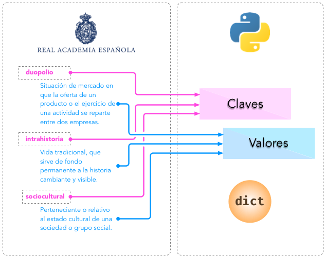

############
Diccionarios
############

Podemos trasladar el concepto de *diccionario* de la vida real al de *diccionario* en Python. Al fin y al cabo un diccionario es un objeto que contiene palabras, y cada palabra tiene asociado un significado. Haciendo el paralelismo, diríamos que en Python un diccionario es también un objeto indexado por **claves** (las palabras) que tienen asociados unos **valores** (los significados). [#dict-unsplash]_

   Analogía de un diccionario en Python

Los diccionarios en Python tienen las siguientes *características*:

* Mantienen el **orden** en el que se insertan las claves. [#keep-order]_
* Son **mutables** con lo que admiten añadir, borrar y modificar sus elementos.
* Las **claves** deben ser **únicas**. A menudo se utilizan las *cadenas de texto* como claves, pero en realidad podría ser cualquier tipo de datos inmutable: enteros, flotantes, tuplas (entre otros).
* Tienen un **acceso muy rápido** a sus elementos, debido a la forma en la que están implementados internamente. [#time-complexity]_

.. note:: En otros lenguajes de programación, a los diccionarios se les conoce como *arrays asociativos*, *"hashes"* o *"hashmaps"*.

********************
Creando diccionarios
********************

Para crear un diccionario basta con usar llaves ``{}`` rodeando pares ``clave: valor`` separados por comas. Veamos algunos ejemplos de diccionarios::

    >>> empty_dict = {}

    >>> rae = {
    ...     'bifronte': 'De dos frentes o dos caras',
    ...     'anarcoide': 'Que tiende al desorden',
    ...     'montuvio': 'Campesino de la costa'
    ... }

    >>> population_can = {
    ...     2015: 2_135_209,
    ...     2016: 2_154_924,
    ...     2017: 2_177_048,
    ...     2018: 2_206_901,
    ...     2019: 2_220_270
    ... }

En el código anterior podemos observar la creación de un diccionario vacío, otro donde sus claves y sus valores son cadenas de texto y otro donde las claves y los valores son valores enteros.

Ejecución **paso a paso** a través de *Python Tutor*:

.. only:: latex

    https://cutt.ly/Sfav2Yw

.. only:: html

    .. raw:: html

        <iframe width="800" height="515" frameborder="0" src="https://pythontutor.com/iframe-embed.html#code=empty_dict%20%3D%20%7B%7D%0A%0Arae%20%3D%20%7B%0A%20%20%20%20'bifronte'%3A%20'De%20dos%20frentes%20o%20dos%20caras',%0A%20%20%20%20'anarcoide'%3A%20'Que%20tiende%20al%20desorden',%0A%20%20%20%20'montuvio'%3A%20'Campesino%20de%20la%20costa'%0A%7D%0A%0Apopulation_can%20%3D%20%7B%0A%20%20%20%202015%3A%202_135_209,%0A%20%20%20%202016%3A%202_154_924,%0A%20%20%20%202017%3A%202_177_048,%0A%20%20%20%202018%3A%202_206_901,%0A%20%20%20%202019%3A%202_220_270%0A%7D&codeDivHeight=400&codeDivWidth=350&cumulative=false&curInstr=0&heapPrimitives=nevernest&origin=opt-frontend.js&py=3&rawInputLstJSON=%5B%5D&textReferences=false"> </iframe>

**********
Conversión
**********

Para convertir otros tipos de datos en un diccionario podemos usar la función ``dict()``::

    >>> # Diccionario a partir de una lista de cadenas de texto
    >>> dict(['ab', 'cd'])
    {'a': 'b', 'c': 'd'}

    >>> # Diccionario a partir de una tupla de cadenas de texto
    >>> dict(('ab', 'cd'))
    {'a': 'b', 'c': 'd'}

    >>> # Diccionario a partir de una lista de listas (de cadenas de texto)
    >>> dict([['a', 'b'], ['c', 'd']])
    {'a': 'b', 'c': 'd'}

****************************
Operaciones con diccionarios
****************************

Obtener un elemento
===================

Para obtener un elemento de un diccionario basta con escribir la **clave** entre corchetes. Veamos un ejemplo:

.. code-block::
    :emphasize-lines: 7

    >>> rae = {
    ...     'bifronte': 'De dos frentes o dos caras',
    ...     'anarcoide': 'Que tiende al desorden',
    ...     'montuvio': 'Campesino de la costa'
    ... }

    >>> rae['anarcoide']
    'Que tiende al desorden'

Si intentamos acceder a una clave que no existe, obtendremos un error::

    >>> rae['acceso']
    Traceback (most recent call last):
      File "<stdin>", line 1, in <module>
    KeyError: 'acceso'

Usando ``get()``
----------------

Existe una función muy útil para "superar" los posibles errores de acceso por claves inexistentes. Se trata de ``get()`` y su comportamiento es el siguiente:

1. Si la clave que buscamos existe, nos devuelve su valor.
2. Si la clave que buscamos no existe, nos devuelve ``None`` [#none]_ salvo que le indiquemos otro valor por defecto, pero en ninguno de los dos casos obtendremos un error.

.. code-block::
    :linenos:

    >>> rae
    {'bifronte': 'De dos frentes o dos caras',
     'anarcoide': 'Que tiende al desorden',
     'montuvio': 'Campesino de la costa'}

    >>> rae.get('bifronte')
    'De dos frentes o dos caras'

    >>> rae.get('programación')

    >>> rae.get('programación', 'No disponible')
    'No disponible'

**Línea 6**:
    Equivalente a ``rae['bifronte']``.
**Línea 9**:
    La clave buscada no existe y obtenemos ``None``. [#invisible-none]_
**Línea 11**:
    La clave buscada no existe y nos devuelve el valor que hemos aportado por defecto.

Añadir o modificar un elemento
==============================

Añadir un elemento a un diccionario es sencillo. Sólo es necesario hacer referencia a la *clave* y asignarle un *valor*:

* Si la clave ya existía en el diccionario, se reemplaza el valor existente por el nuevo.
* Si la clave es nueva, se añade al diccionario con su valor.

Al contrario que en :ref:`las listas <datastructures/lists:Obtener un elemento>`, no hay que preocuparse por las excepciones (errores) por fuera de rango durante la asignación de elementos a un diccionario::

    >>> rae = {
    ...     'bifronte': 'De dos frentes o dos caras',
    ...     'anarcoide': 'Que tiende al desorden',
    ...     'montuvio': 'Campesino de la costa'
    ... }

Vamos a **añadir** la palabra *enjuiciar* a nuestro diccionario de la Real Academia de La Lengua::

    >>> rae['enjuiciar'] = 'Someter una cuestión a examen, discusión y juicio'

    >>> rae
    {'bifronte': 'De dos frentes o dos caras',
     'anarcoide': 'Que tiende al desorden',
     'montuvio': 'Campesino de la costa',
     'enjuiciar': 'Someter una cuestión a examen, discusión y juicio'}

Supongamos ahora que queremos **modificar** el significado de la palabra *enjuiciar* por otra acepción::

    >>> rae['enjuiciar'] = 'Instruir, juzgar o sentenciar una causa'

    >>> rae
    {'bifronte': 'De dos frentes o dos caras',
     'anarcoide': 'Que tiende al desorden',
     'montuvio': 'Campesino de la costa',
     'enjuiciar': 'Instruir, juzgar o sentenciar una causa'}

Pertenencia de una clave
========================

La forma **pitónica** de comprobar la existencia de una clave dentro de un diccionario, es utilizar el operador ``in``::

    >>> 'bifronte' in rae
    True

    >>> 'almohada' in rae
    False

.. note:: El operador ``in`` siempre devuelve un valor booleano, es decir, verdadero o falso.

Obtener todos los elementos
===========================

Python ofrece mecanismos para obtener todos los elementos de un diccionario. Partimos del siguiente diccionario::

    >>> rae
    {'bifronte': 'De dos frentes o dos caras',
     'anarcoide': 'Que tiende al desorden',
     'montuvio': 'Campesino de la costa',
     'enjuiciar': 'Instruir, juzgar o sentenciar una causa'}

**Obtener todas las claves de un diccionario**:
    Mediante la función ``keys()``::

        >>> rae.keys()
        dict_keys(['bifronte', 'anarcoide', 'montuvio', 'enjuiciar'])

**Obtener todos los valores de un diccionario**:
    Mediante la función ``values()``::

        >>> rae.values()
        dict_values([
            'De dos frentes o dos caras',
            'Que tiende al desorden',
            'Campesino de la costa',
            'Instruir, juzgar o sentenciar una causa'
        ])

**Obtener todos los pares "clave-valor" de un diccionario**:
    Mediante la función ``items()``::

        >>> rae.items()
        dict_items([
            ('bifronte', 'De dos frentes o dos caras'),
            ('anarcoide', 'Que tiende al desorden'),
            ('montuvio', 'Campesino de la costa'),
            ('enjuiciar', 'Instruir, juzgar o sentenciar una causa')
        ])

.. note:: Para este último caso cabe destacar que los "items" se devuelven como una lista de *tuplas*, donde cada tupla tiene dos elementos: el primero representa la clave y el segundo representa el valor.

Longitud de un diccionario
==========================

Podemos conocer el número de elementos ("clave-valor") que tiene un diccionario con la función ``len()``::

    >>> rae
    {'bifronte': 'De dos frentes o dos caras',
     'anarcoide': 'Que tiende al desorden',
     'montuvio': 'Campesino de la costa',
     'enjuiciar': 'Instruir, juzgar o sentenciar una causa'}

    >>> len(rae)
    4

Iterar sobre un diccionario
===========================

En base a :ref:`los elementos que podemos obtener <datastructures/dicts:Obtener todos los elementos>`, Python nos proporciona tres maneras de iterar sobre un diccionario.

**Iterar sobre claves**::

    >>> for word in rae.keys():
    ...     print(word)
    ...
    bifronte
    anarcoide
    montuvio
    enjuiciar

**Iterar sobre valores**::

    >>> for meaning in rae.values():
    ...     print(meaning)
    ...
    De dos frentes o dos caras
    Que tiende al desorden
    Campesino de la costa
    Instruir, juzgar o sentenciar una causa

**Iterar sobre "clave-valor"**::

    >>> for word, meaning in rae.items():
    ...     print(f'{word}: {meaning}')
    ...
    bifronte: De dos frentes o dos caras
    anarcoide: Que tiende al desorden
    montuvio: Campesino de la costa
    enjuiciar: Instruir, juzgar o sentenciar una causa

.. note:: En este último caso, recuerde el uso de los :ref:`datatypes/strings:"f-strings"` para formatear cadenas de texto.

Combinar diccionarios
=====================

Dados dos (o más) diccionarios, es posible "mezclarlos" para obtener una combinación de los mismos. Esta combinación se basa en dos premisas:

1. Si la clave no existe, se añade con su valor.
2. Si la clave ya existe, se añade con el valor del "último" diccionario en la mezcla. [#last-dict]_

Python ofrece dos mecanismos para realizar esta combinación. Vamos a partir de los siguientes diccionarios para ejemplificar su uso::

    >>> rae1 = {
    ...     'bifronte': 'De dos frentes o dos caras',
    ...     'enjuiciar': 'Someter una cuestión a examen, discusión y juicio'
    ... }

    >>> rae2 = {
    ...     'anarcoide': 'Que tiende al desorden',
    ...     'montuvio': 'Campesino de la costa',
    ...     'enjuiciar': 'Instruir, juzgar o sentenciar una causa'
    ... }

**Sin modificar los diccionarios originales**:
    Mediante el operador ``**``::

        >>> {**rae1, **rae2}
        {'bifronte': 'De dos frentes o dos caras',
         'enjuiciar': 'Instruir, juzgar o sentenciar una causa',
         'anarcoide': 'Que tiende al desorden',
         'montuvio': 'Campesino de la costa'}

**Modificando los diccionarios originales**:
    Mediante la función ``update()``::

        >>> rae1.update(rae2)

        >>> rae1
        {'bifronte': 'De dos frentes o dos caras',
         'enjuiciar': 'Instruir, juzgar o sentenciar una causa',
         'anarcoide': 'Que tiende al desorden',
         'montuvio': 'Campesino de la costa'}

.. note:: Tener en cuenta que el orden en el que especificamos los diccionarios a la hora de su combinación (mezcla) es relevante en el resultado final. En este caso *el orden de los factores sí altera el producto*.

Borrar elementos
================

Python nos ofrece, al menos, tres formas para borrar elementos en un diccionario:

**Por su clave**:
    Mediante la sentencia ``del``:

    .. code-block::
        :emphasize-lines: 7
    
        >>> rae = {
        ...     'bifronte': 'De dos frentes o dos caras',
        ...     'anarcoide': 'Que tiende al desorden',
        ...     'montuvio': 'Campesino de la costa'
        ... }

        >>> del rae['bifronte']

        >>> rae
        {'anarcoide': 'Que tiende al desorden', 'montuvio': 'Campesino de la costa'}

**Por su clave (con extracción)**:
    Mediante la función ``pop()`` podemos extraer un elemento del diccionario por su clave. Vendría a ser una combinación de ``get()`` + ``del``:

    .. code-block::
        :emphasize-lines: 7

        >>> rae = {
        ...     'bifronte': 'De dos frentes o dos caras',
        ...     'anarcoide': 'Que tiende al desorden',
        ...     'montuvio': 'Campesino de la costa'
        ... }

        >>> rae.pop('anarcoide')
        'Que tiende al desorden'

        >>> rae
        {'bifronte': 'De dos frentes o dos caras', 'montuvio': 'Campesino de la costa'}

        >>> rae.pop('bucle')
        Traceback (most recent call last):
          File "<stdin>", line 1, in <module>
        KeyError: 'bucle'

    .. warning:: Si la clave que pretendemos extraer con ``pop()`` no existe, obtendremos un error.

**Borrado completo del diccionario**:
    1. Utilizando la función ``clear()``::

        >>> rae = {
        ...     'bifronte': 'De dos frentes o dos caras',
        ...     'anarcoide': 'Que tiende al desorden',
        ...     'montuvio': 'Campesino de la costa'
        ... }

        >>> rae.clear()

        >>> rae
        {}

    2. "Reinicializando" el diccionario a vacío con ``{}``::

        >>> rae = {
        ...     'bifronte': 'De dos frentes o dos caras',
        ...     'anarcoide': 'Que tiende al desorden',
        ...     'montuvio': 'Campesino de la costa'
        ... }

        >>> rae = {}

        >>> rae
        {}

    .. note:: La diferencia entre ambos métodos tiene que ver con cuestiones internas de gestión de memoria y de rendimiento.

**********************
Cuidado con las copias
**********************

Al igual que ocurría con :ref:`las listas <datastructures/lists:Cuidado con las copias>`, si hacemos un cambio en un diccionario, se verá reflejado en todas las variables que hagan referencia al mismo. Esto se deriva de la propiedad de *mutabilidad*. Veamos un ejemplo concreto:

.. code-block::
    :emphasize-lines: 12, 17

    >>> original_rae = {
    ...     'bifronte': 'De dos frentes o dos caras',
    ...     'anarcoide': 'Que tiende al desorden',
    ...     'montuvio': 'Campesino de la costa'
    ... }

    >>> copy_rae = original_rae

    >>> original_rae['bifronte'] = 'bla bla bla'

    >>> original_rae
    {'bifronte': 'bla bla bla',
     'anarcoide': 'Que tiende al desorden',
     'montuvio': 'Campesino de la costa'}

    >>> copy_rae
    {'bifronte': 'bla bla bla',
     'anarcoide': 'Que tiende al desorden',
     'montuvio': 'Campesino de la costa'}

Una **posible solución** a este problema es hacer una "copia dura". Para ello Python proporciona la función ``copy()``:

.. code-block::
    :emphasize-lines: 7, 12, 17

    >>> original_rae = {
    ...     'bifronte': 'De dos frentes o dos caras',
    ...     'anarcoide': 'Que tiende al desorden',
    ...     'montuvio': 'Campesino de la costa'
    ... }

    >>> copy_rae = original_rae.copy()

    >>> original_rae['bifronte'] = 'bla bla bla'

    >>> original_rae
    {'bifronte': 'bla bla bla',
    'anarcoide': 'Que tiende al desorden',
    'montuvio': 'Campesino de la costa'}

    >>> copy_rae
    {'bifronte': 'De dos frentes o dos caras',
     'anarcoide': 'Que tiende al desorden',
     'montuvio': 'Campesino de la costa'}

***************************
Construyendo un diccionario
***************************

Una forma muy habitual de trabajar con diccionarios es empezar con uno vacío e ir añadiendo elementos poco a poco. Supongamos un ejemplo en el que queremos construir un diccionario donde las claves son las letras vocales y los valores son sus posiciones::

    >>> vowels = 'aeiou'

    >>> enum_vowels = {}

    >>> for i, vowel in enumerate(vowels):
    ...     enum_vowels[vowel] = i + 1
    ...

    >>> enum_vowels
    {'a': 1, 'e': 2, 'i': 3, 'o': 4, 'u': 5}

.. note:: Hemos utilizando la función ``enumerate()`` que ya vimos para las listas en el apartado: :ref:`datastructures/lists:Iterar usando enumeración`.

.. admonition:: Ejercicio
    :class: exercise

    Usando un diccionario, cuente el número de veces que se repite cada letra en una cadena de texto dada.

    **Ejemplo**
        * Entrada: ``'boom'``
        * Salida: ``{'b': 1, 'o': 2, 'm': 1}`` 

.. rubric:: AMPLIAR CONOCIMIENTOS

* `Using the Python defaultdict Type for Handling Missing Keys <https://realpython.com/python-defaultdict/>`_
* `Python Dictionary Iteration: Advanced Tips & Tricks <https://realpython.com/courses/python-dictionary-iteration/>`_
* `Python KeyError Exceptions and How to Handle Them <https://realpython.com/courses/python-keyerror/>`_
* `Dictionaries in Python <https://realpython.com/courses/dictionaries-python/>`_
* `How to Iterate Through a Dictionary in Python <https://realpython.com/iterate-through-dictionary-python/>`_
* `Shallow vs Deep Copying of Python Objects <https://realpython.com/copying-python-objects/>`_

.. --------------- Footnotes ---------------

.. [#dict-unsplash] Foto original de portada por `Aaron Burden`_ en Unsplash.
.. [#keep-order] Aunque históricamente Python no establecía que las claves de los diccionarios tuvieran que mantener su orden de inserción, a partir de Python 3.7 este comportamiento cambió y se garantizó el orden de inserción de las claves como `parte oficial de la especificación del lenguaje <https://docs.python.org/3/whatsnew/3.7.html>`_.
.. [#time-complexity] Véase este `análisis de complejidad y rendimiento`_ de distintas estructuras de datos en CPython.
.. [#none] ``None`` es la palabra reservada en Python para la "nada". Más información en `esta web <https://recursospython.com/guias-y-manuales/el-tipo-de-dato-none/>`_.
.. [#invisible-none] Realmente no estamos viendo nada en la consola de Python porque la representación en cadena de texto es vacía.
.. [#last-dict] En este caso "último" hace referencia al diccionario que se encuentra más a la derecha en la expresión.

.. --------------- Hyperlinks ---------------

.. _Aaron Burden: https://unsplash.com/@aaronburden?utm_source=unsplash&utm_medium=referral&utm_content=creditCopyText
.. _análisis de complejidad y rendimiento: https://wiki.python.org/moin/TimeComplexity
