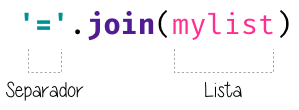

######
Listas
######

.. image:: img/mike-arney-9r-_2gzP37k-unsplash.jpg

Las listas son adecuadas para **guardar elementos** en un **orden concreto**. A diferencia, por ejemplo, de las cadenas de texto, las listas son **mutables**. Podemos modificar, añadir o borrar elementos de una lista. Cabe destacar que un mismo valor puede aparecer más de una vez en una lista. [#wishlist-unsplash]_

**************
Creando listas
**************

Una lista está compuesta por *cero* o *más elementos*, separados por *comas* y rodeados por *corchetes*. Veamos algunos ejemplos de listas::

    >>> empty_list = []

    >>> languages = ['Python', 'Ruby', 'Javascript']

    >>> fibonacci = [0, 1, 1, 2, 3, 5, 8, 13]

    >>> data = ['Tenerife', {'cielo': 'limpio', 'temp': 24}, 3718, (28.2933947, -16.5226597)]

.. note:: Una lista puede contener tipos de **datos heterogéneos**, lo que la hace una estructura de datos muy versátil.

Ejecución **paso a paso** a través de *Python Tutor*:

.. only:: latex

    https://cutt.ly/Ofiiare

.. only:: html

    .. raw:: html

        <iframe width="800" height="400" frameborder="0" src="https://pythontutor.com/iframe-embed.html#code=empty_list%20%3D%20%5B%5D%0A%0Alanguages%20%3D%20%5B'Python',%20'Ruby',%20'Javascript'%5D%0A%0Afibonacci%20%3D%20%5B0,%201,%201,%202,%203,%205,%208,%2013%5D%0A%0Adata%20%3D%20%5B'Tenerife',%20%7B'cielo'%3A%20'limpio',%20'temp'%3A%2024%7D,%203718,%20%2828.2933947,%20-16.5226597%29%5D&codeDivHeight=400&codeDivWidth=350&cumulative=false&curInstr=0&heapPrimitives=nevernest&origin=opt-frontend.js&py=3&rawInputLstJSON=%5B%5D&textReferences=false"> </iframe>

**********
Conversión
**********

Para convertir otros tipos de datos en una lista podemos usar la función ``list()``::

    >>> # conversión desde una cadena de texto

    >>> list('Python')
    ['P', 'y', 't', 'h', 'o', 'n']

Si nos fijamos en lo que ha pasado, al convertir la cadena de texto ``Python`` se ha creado una lista con *6* elementos, donde cada uno de ellos representa un caracter de la cadena. Podemos *extender* este comportamiento a cualquier otro tipo de datos que permita acceder a sus elementos.

Lista vacía
===========

Existe una manera particular de usar ``list()`` y es no pasarle ningún argumento. En este caso estaremos queriendo convertir el *vacío* en una lista, con lo que obtendremos una *lista vacía*::

    >>> list()
    []

**********************
Operaciones con listas
**********************

Obtener un elemento
===================

Igual que en el caso de las :ref:`cadenas de texto <datatypes/strings:Obtener un caracter>` podemos extraer un elemento de una lista especificando su **índice**. Veamos un ejemplo::

    >>> shopping = ['Agua', 'Huevos', 'Aceite']

    >>> shopping[0]
    'Agua'

    >>> shopping[1]
    'Huevos'

    >>> shopping[2]
    'Aceite'

    >>> shopping[-1]  # acceso con índice negativo
    'Aceite'

El *índice* que usemos para acceder a los elementos de una lista tiene que estar comprendido entre los límites de la misma. Si usamos un índice antes del comienzo o después del final obtendremos un error (*excepción*)::

    >>> shopping = ['Agua', 'Huevos', 'Aceite']

    >>> shopping[3]
    Traceback (most recent call last):
      File "<stdin>", line 1, in <module>
    IndexError: list index out of range

    >>> shopping[-5]
    Traceback (most recent call last):
      File "<stdin>", line 1, in <module>
    IndexError: list index out of range

Trocear una lista
=================

El troceado de listas funciona de manera totalmente análoga al :ref:`troceado de cadenas <datatypes/strings:Trocear una cadena>`. Veamos algunos ejemplos::

    >>> shopping = ['Agua', 'Huevos', 'Aceite', 'Sal', 'Limón']

    >>> shopping[0:3]
    ['Agua', 'Huevos', 'Aceite']

    >>> shopping[:3]
    ['Agua', 'Huevos', 'Aceite']

    >>> shopping[2:4]
    ['Aceite', 'Sal']

    >>> shopping[-1:-4:-1]
    ['Limón', 'Sal', 'Aceite']

    >>> # Equivale a invertir la lista
    >>> shopping[::-1]
    ['Limón', 'Sal', 'Aceite', 'Huevos', 'Agua']

Hacer notar que el uso de *índices inválidos* en el troceado no genera una excepción. Python trata de ajustarse al índice válido más próximo::

    >>> shopping
    ['Agua', 'Huevos', 'Aceite', 'Sal', 'Limón']

    >>> shopping[10:]
    []

    >>> shopping[-100:2]
    ['Agua', 'Huevos']

    >>> shopping[2:100]
    ['Aceite', 'Sal', 'Limón']

.. note:: Ninguna de las operaciones anteriores modifican la lista original, simplemente devuelven una lista nueva.

Invertir una lista
==================

Python nos ofrece, al menos, tres mecanismos para invertir los elementos de una lista:

**Conservando la lista original**:
    Mediante :ref:`troceado <datastructures/lists:Trocear una lista>` de listas con *step* negativo::

        >>> shopping
        ['Agua', 'Huevos', 'Aceite', 'Sal', 'Limón']

        >>> shopping[::-1]
        ['Limón', 'Sal', 'Aceite', 'Huevos', 'Agua']

**Conservando la lista original**:
    Mediante la función ``reversed()``::

        >>> shopping
        ['Agua', 'Huevos', 'Aceite', 'Sal', 'Limón']

        >>> list(reversed(shopping))
        ['Limón', 'Sal', 'Aceite', 'Huevos', 'Agua']

**Modificando la lista original**:
    Utilizando la función `reverse()` (nótese que es sin *"d"* al final)::

        >>> shopping
        ['Agua', 'Huevos', 'Aceite', 'Sal', 'Limón']

        >>> shopping.reverse()

        >>> shopping
        ['Limón', 'Sal', 'Aceite', 'Huevos', 'Agua']

Añadir al final de la lista
===========================

La forma tradicional de añadir elementos al final de una lista es utilizar la función ``append()``. Se trata de un método *destructivo* que modifica la lista original::

    >>> shopping = ['Agua', 'Huevos', 'Aceite']

    >>> shopping.append('Atún')

    >>> shopping
    ['Agua', 'Huevos', 'Aceite', 'Atún']

Añadir en cualquier posición de una lista
=========================================

La función ``append()`` sólo permite añadir elementos al final de la lista. Cuando se quiere insertar un elemento en otra posición de una lista debemos usar ``insert()`` especificando el índice de colocación. También se trata de una función *destructiva* [#destructive]_::

    >>> shopping = ['Agua', 'Huevos', 'Aceite']

    >>> shopping.insert(1, 'Jamón')

    >>> shopping
    ['Agua', 'Jamón', 'Huevos', 'Aceite']

    >>> shopping.insert(3, 'Queso')

    >>> shopping
    ['Agua', 'Jamón', 'Huevos', 'Queso', 'Aceite']

.. note:: El índice que especificamos en la función ``insert()`` lo podemos intepretar como la posición *delante* (a la izquierda) de la cual vamos a colocar el nuevo valor en la lista.

No hay que preocuparse por insertar un elemento en desplazamientos no válidos. Si el índice supera el tamaño de la lista, el elemento se insertará al final de la lista. Si el índice es demasiado bajo se insertará al comienzo de la lista. En ninguno de los dos casos vamos a obtener un error debido a esta circunstancia::

    >>> shopping = ['Agua', 'Huevos', 'Aceite']

    >>> shopping.insert(100, 'Mermelada')

    >>> shopping
    ['Agua', 'Huevos', 'Aceite', 'Mermelada']

    >>> shopping.insert(-100, 'Arroz')

    >>> shopping
    ['Arroz', 'Agua', 'Huevos', 'Aceite', 'Mermelada']

Repetir elementos
=================

Al igual que con las :ref:`cadenas de texto <datatypes/strings:Repetir cadenas>`, el operador ``*`` nos permite repetir los elementos de una lista::

    >>> shopping = ['Agua', 'Huevos', 'Aceite']

    >>> shopping * 3
    ['Agua',
     'Huevos',
     'Aceite',
     'Agua',
     'Huevos',
     'Aceite',
     'Agua',
     'Huevos',
     'Aceite']

Combinar listas
===============

Python nos ofrece dos aproximaciones para combinar listas:

**Conservando la lista original**:
    Mediante el operador ``+`` o ``+=``::

        >>> shopping = ['Agua', 'Huevos', 'Aceite']
        >>> fruitshop = ['Naranja', 'Manzana', 'Piña']

        >>> shopping + fruitshop
        ['Agua', 'Huevos', 'Aceite', 'Naranja', 'Manzana', 'Piña']

**Modificando la lista original**:
    Mediante la función ``extend()``::

        >>> shopping = ['Agua', 'Huevos', 'Aceite']
        >>> fruitshop = ['Naranja', 'Manzana', 'Piña']

        >>> shopping.extend(fruitshop)

        >>> shopping
        ['Agua', 'Huevos', 'Aceite', 'Naranja', 'Manzana', 'Piña']

Hay que tener en cuenta que ``extend()`` funciona adecuadamente si pasamos una **lista como argumento**. En otro caso, quizás los resultados no sean los esperados. Veamos un ejemplo::

    >>> shopping = ['Agua', 'Huevos', 'Aceite']

    >>> shopping.extend('Limón')

    >>> shopping
    ['Agua', 'Huevos', 'Aceite', 'L', 'i', 'm', 'ó', 'n']

El motivo es que ``extend()`` "recorre" (o itera) sobre cada uno de los elementos del objeto en cuestión. En el caso anterior, al ser una cadena de texto, está formada por caracteres. De ahí el resultado que obtenemos.

Se podría pensar en el uso de ``append()`` para ampliar para combinar listas. La realidad es que no funciona exactamente como esperamos; la segunda lista se añadiría como una *sublista* de la principal::

    >>> shopping = ['Agua', 'Huevos', 'Aceite']

    >>> fruitshop = ['Naranja', 'Manzana', 'Piña']

    >>> shopping.append(fruitshop)

    >>> shopping
    ['Agua', 'Huevos', 'Aceite', ['Naranja', 'Manzana', 'Piña']]

Modificar una lista
===================

Del mismo modo que se :ref:`accede a un elemento <datastructures/lists:Obtener un elemento>` utilizando su índice, también podemos modificarlo:

.. code-block::
    :emphasize-lines: 6

    >>> shopping = ['Agua', 'Huevos', 'Aceite']

    >>> shopping[0]
    'Agua'

    >>> shopping[0] = 'Jugo'

    >>> shopping
    ['Jugo', 'Huevos', 'Aceite']

En el caso de acceder a un *índice no válido* de la lista, incluso para modificar, obtendremos un error::

    >>> shopping[100] = 'Chocolate'
    Traceback (most recent call last):
      File "<stdin>", line 1, in <module>
    IndexError: list assignment index out of range

Borrar elementos
================

Python nos ofrece, al menos, cuatro formas para borrar elementos en una lista:

**Por su índice**:
    Mediante la función ``del()``::

        >>> shopping = ['Agua', 'Huevos', 'Aceite', 'Sal', 'Limón']

        >>> del(shopping[3])

        >>> shopping
        ['Agua', 'Huevos', 'Aceite', 'Limón']

**Por su valor**:
    Mediante la función ``remove()``::

        >>> shopping = ['Agua', 'Huevos', 'Aceite', 'Sal', 'Limón']

        >>> shopping.remove('Sal')

        >>> shopping
        ['Agua', 'Huevos', 'Aceite', 'Limón']

.. warning:: Si existen valores duplicados, la función ``remove()`` sólo borrará la primera ocurrencia.

**Por su índice (con extracción)**::
    Las dos funciones anteriores ``del()`` y ``remove()`` efectivamente borran el elemento indicado de la lista, pero no "devuelven" [#return]_ nada. Sin embargo, Python nos ofrece la función ``pop()`` que además de borrar nos "recupera" el elemento; algo así como una *extracción**. Lo podemos ver como una combinación de *acceso* + *borrado*::

        >>> shopping = ['Agua', 'Huevos', 'Aceite', 'Sal', 'Limón']

        >>> shopping.pop()
        'Limón'

        >>> shopping
        ['Agua', 'Huevos', 'Aceite', 'Sal']

        >>> shopping.pop(2)
        'Aceite'

        >>> shopping
        ['Agua', 'Huevos', 'Sal']

.. note:: Si usamos la función sin pasarle ningún argumento, por defecto usará el índice *-1*, es decir, el último elemento de la lista. Pero también podemos indicarle el índice del elemento a extraer.

**Borrado completo de la lista**:
    1. Utilizando la función ``clear()``::

        >>> shopping = ['Agua', 'Huevos', 'Aceite', 'Sal', 'Limón']

        >>> shopping.clear()

        >>> shopping
        []

    2. "Reinicializando" la lista a vacío con ``[]``::

        >>> shopping = ['Agua', 'Huevos', 'Aceite', 'Sal', 'Limón']

        >>> shopping = []

        >>> shopping
        []

.. note:: La diferencia entre ambos métodos tiene que ver con cuestiones internas de gestión de memoria y de rendimiento.

Encontrar un elemento
=====================

Para conocer el **índice** que tiene un determinado elemento dentro de una lista podemos hacer uso de la función ``index()``::

    >>> shopping = ['Agua', 'Huevos', 'Aceite', 'Sal', 'Limón']

    >>> shopping.index('Huevos')
    1

Tener en cuenta que si el elemento que buscamos no está en la lista, obtendremos un error::

    >>> shopping = ['Agua', 'Huevos', 'Aceite', 'Sal', 'Limón']

    >>> shopping.index('Pollo')
    Traceback (most recent call last):
      File "<stdin>", line 1, in <module>
    ValueError: 'Pollo' is not in list

Pertenencia de un elemento
==========================

La forma **pitónica** de comprobar la existencia de un elemento (valor) dentro de una lista, es utilizar el operador ``in``::

    >>> shopping = ['Agua', 'Huevos', 'Aceite', 'Sal', 'Limón']

    >>> 'Aceite' in shopping
    True

    >>> 'Pollo' in shopping
    False

.. note:: El operador ``in`` siempre devuelve un valor booleano, es decir, verdadero o falso.

Número de ocurrencias
=====================

Para contar cuántas veces aparece un determinado valor dentro de una lista podemos usar la función ``count()``::

    >>> sheldon_greeting = ['Penny', 'Penny', 'Penny']

    >>> sheldon_greeting.count('Howard')
    0

    >>> sheldon_greeting.count('Penny')
    3

Convertir lista a cadena de texto
=================================

Dada una lista, podemos convetirla a una cadena de texto, uniendo todos sus elementos mediante algún **separador**. Para ello hacemos uso de la función ``join()`` con la siguiente estructura:

   Estructura de llamada a la función ``join()``

::

    >>> shopping = ['Agua', 'Huevos', 'Aceite', 'Sal', 'Limón']

    >>> ','.join(shopping)
    'Agua,Huevos,Aceite,Sal,Limón'
    
    >>> ' '.join(shopping)
    'Agua Huevos Aceite Sal Limón'

    >>> '|'.join(shopping)
    'Agua|Huevos|Aceite|Sal|Limón'

Hay que tener en cuenta que ``join()`` sólo funciona si *todos sus elementos son cadenas de texto*::

    >>> ', '.join([1, 2, 3, 4, 5])
    Traceback (most recent call last):
      File "<stdin>", line 1, in <module>
    TypeError: sequence item 0: expected str instance, int found

.. tip:: Esta función ``join()`` es realmente la **opuesta** a la de ``split()`` para :ref:`dividir una cadena <datatypes/strings:Dividir una cadena>`.

Ordenar una lista
=================

Python proporciona, al menos, dos formas de ordenar los elementos de una lista:

**Conservando lista original**:
    Mediante la función ``sorted()`` que devuelve una nueva lista ordenada::

        >>> shopping = ['Agua', 'Huevos', 'Aceite', 'Sal', 'Limón']

        >>> sorted(shopping)
        ['Aceite', 'Agua', 'Huevos', 'Limón', 'Sal']

**Modificando la lista original**:
    Mediante la función ``sort()``::

        >>> shopping = ['Agua', 'Huevos', 'Aceite', 'Sal', 'Limón']

        >>> shopping.sort()

        >>> shopping
        ['Aceite', 'Agua', 'Huevos', 'Limón', 'Sal']

**Ambos métodos** admiten un *parámetro* "booleano" ``reverse`` para indicar si queremos que la ordenación se haga en **orden inverso**::

    >>> shopping = ['Agua', 'Huevos', 'Aceite', 'Sal', 'Limón']

    >>> sorted(shopping, reverse=True)
    ['Sal', 'Limón', 'Huevos', 'Agua', 'Aceite']

Longitud de una lista
=====================

Podemos conocer el número de elementos que tiene una lista con la función ``len()``::

    >>> shopping = ['Agua', 'Huevos', 'Aceite', 'Sal', 'Limón']

    >>> len(shopping)
    5

Iterar sobre una lista
======================

Al igual que :ref:`hemos visto con las cadenas de texto <for-sentence>`, también podemos *iterar* sobre los elementos de una lista a través de la sentencia ``for``::

    >>> shopping = ['Agua', 'Huevos', 'Aceite', 'Sal', 'Limón']

    >>> for product in shopping:
    ...     print(product)
    ...
    Agua
    Huevos
    Aceite
    Sal
    Limón

.. note:: También es posible usar la sentencia ``break`` en este tipo de bucles para abortar su ejecución en algún momento que nos interese.

Iterar usando enumeración
-------------------------

Hay veces que no sólo nos interesa "visitar" cada uno de los elementos de una lista, sino que también queremos **saber su índice** dentro de la misma. Para ello Python nos ofrece la función ``enumerate()``::

    >>> shopping = ['Agua', 'Huevos', 'Aceite', 'Sal', 'Limón']

    >>> for i, product in enumerate(shopping):
    ...     print(i, product)
    ...
    0 Agua
    1 Huevos
    2 Aceite
    3 Sal
    4 Limón

Ejecución **paso a paso** a través de *Python Tutor*:

.. only:: latex

    https://cutt.ly/TfiuIZ0

.. only:: html

    .. raw:: html

        <iframe width="800" height="300" frameborder="0" src="https://pythontutor.com/iframe-embed.html#code=shopping%20%3D%20%5B'Agua',%20'Huevos',%20'Aceite',%20'Sal',%20'Lim%C3%B3n'%5D%0A%0Afor%20i,%20product%20in%20enumerate%28shopping%29%3A%0A%20%20%20%20print%28i,%20product%29&codeDivHeight=400&codeDivWidth=350&cumulative=false&curInstr=0&heapPrimitives=nevernest&origin=opt-frontend.js&py=3&rawInputLstJSON=%5B%5D&textReferences=false"> </iframe>

Iterar sobre múltiples listas
-----------------------------

Python ofrece la posibilidad de iterar sobre **múltiples listas en paralelo** utilizando la función ``zip()``::

    >>> shopping = ['Agua', 'Aceite', 'Arroz']
    >>> details = ['mineral natural', 'de oliva virgen', 'basmati']

    >>> for product, detail in zip(shopping, details):
    ...     print(product, detail)
    ...
    Agua mineral natural
    Aceite de oliva virgen
    Arroz basmati

Ejecución **paso a paso** a través de *Python Tutor*:

.. only:: latex

    https://cutt.ly/lfioilG

.. only:: html

    .. raw:: html

        <iframe width="800" height="320" frameborder="0" src="https://pythontutor.com/iframe-embed.html#code=shopping%20%3D%20%5B'Agua',%20'Aceite',%20'Arroz'%5D%0Adetails%20%3D%20%5B'mineral%20natural',%20'de%20oliva%20virgen',%20'basmati'%5D%0A%0Afor%20product,%20detail%20in%20zip%28shopping,%20details%29%3A%0A%20%20%20%20print%28product,%20detail%29&codeDivHeight=400&codeDivWidth=350&cumulative=false&curInstr=0&heapPrimitives=nevernest&origin=opt-frontend.js&py=3&rawInputLstJSON=%5B%5D&textReferences=false"> </iframe>

.. note:: En el caso de que las listas no tengan la misma longitud, la función ``zip()`` realiza la combinación hasta que se agota la lista más corta.

Dado que ``zip()`` produce un *iterador*, si queremos obtener una **lista explícita** con la combinación en paralelo de las listas, debemos construir dicha lista de la siguiente manera::

    >>> shopping = ['Agua', 'Aceite', 'Arroz']
    >>> details = ['mineral natural', 'de oliva virgen', 'basmati']

    >>> list(zip(shopping, details))
    [('Agua', 'mineral natural'),
     ('Aceite', 'de oliva virgen'),
     ('Arroz', 'basmati')]

**********************
Cuidado con las copias
**********************

Las listas son estructuras de datos **mutables** y esta característica nos obliga a tener cuidado cuando realizamos copias de listas, ya que la modificación de una de ellas puede afectar a la otra.

Veamos un ejemplo sencillo::

    >>> original_list = [4, 3, 7, 1]

    >>> copy_list = original_list

    >>> original_list[0] = 15

    >>> original_list
    [15, 3, 7, 1]

    >>> copy_list
    [15, 3, 7, 1]

Ejecución **paso a paso** a través de *Python Tutor*:

.. only:: latex

    https://cutt.ly/pfi5PC5
    

.. only:: html

    .. raw:: html

        <iframe width="800" height="380" frameborder="0" src="https://pythontutor.com/iframe-embed.html#code=original_list%20%3D%20%5B4,%203,%207,%201%5D%0A%0Acopy_list%20%3D%20original_list%0A%0Aoriginal_list%5B0%5D%20%3D%2015%0A%0Aprint%28original_list%29%0Aprint%28copy_list%29&codeDivHeight=400&codeDivWidth=350&cumulative=false&curInstr=0&heapPrimitives=nevernest&origin=opt-frontend.js&py=3&rawInputLstJSON=%5B%5D&textReferences=false"> </iframe>

.. note:: A través de *Python Tutor* se puede ver claramente el motivo de por qué ocurre esto. Dado que las variables "apuntan" a la misma zona de memoria, al modificar una de ellas, el cambio también se ve reflejado en la otra.

Una **posible solución** a este problema es hacer una "copia dura". Para ello Python proporciona la función ``copy()``:

.. code-block::
    :emphasize-lines: 3

    >>> original_list = [4, 3, 7, 1]

    >>> copy_list = original_list.copy()

    >>> original_list[0] = 15

    >>> original_list
    [15, 3, 7, 1]

    >>> copy_list
    [4, 3, 7, 1]

Ejecución **paso a paso** a través de *Python Tutor*:

.. only:: latex

    https://cutt.ly/Dfi6oLk    

.. only:: html

    .. raw:: html

        <iframe width="800" height="370" frameborder="0" src="https://pythontutor.com/iframe-embed.html#code=original_list%20%3D%20%5B4,%203,%207,%201%5D%0A%0Acopy_list%20%3D%20original_list.copy%28%29%0A%0Aoriginal_list%5B0%5D%20%3D%2015%0A%0Aprint%28original_list%29%0Aprint%28copy_list%29&codeDivHeight=400&codeDivWidth=350&cumulative=false&curInstr=0&heapPrimitives=nevernest&origin=opt-frontend.js&py=3&rawInputLstJSON=%5B%5D&textReferences=false"> </iframe>

**********************
Construyendo una lista
**********************

Una forma muy habitual de trabajar con listas es empezar con una vacía e ir añadiendo elementos poco a poco. Supongamos un ejemplo en el que queremos construir una lista con los números pares del 1 al 20::

    >>> even_numbers = []

    >>> for i in range(20):
    ...     if i % 2 == 0:
    ...         even_numbers.append(i)
    ...

    >>> even_numbers
    [0, 2, 4, 6, 8, 10, 12, 14, 16, 18]

Ejecución **paso a paso** a través de *Python Tutor*:

.. only:: latex

    https://cutt.ly/2fiS9Ax

.. only:: html

    .. raw:: html

        <iframe width="800" height="300" frameborder="0" src="https://pythontutor.com/iframe-embed.html#code=even_numbers%20%3D%20%5B%5D%0A%0Afor%20i%20in%20range%2820%29%3A%0A%20%20%20%20if%20i%20%25%202%20%3D%3D%200%3A%0A%20%20%20%20%20%20%20%20even_numbers.append%28i%29%0A%0Aprint%28even_numbers%29&codeDivHeight=400&codeDivWidth=350&cumulative=false&curInstr=0&heapPrimitives=nevernest&origin=opt-frontend.js&py=3&rawInputLstJSON=%5B%5D&textReferences=false"> </iframe>

*********************
Funciones matemáticas
*********************

Python nos ofrece, entre otras [#more-math]_, estas tres funciones matemáticas básicas que se pueden aplicar sobre listas.

**Suma de todos los valores**:
    Mediante la función ``sum()``::

        >>> data = [5, 3, 2, 8, 9, 1]
        >>> sum(data)
        28

**Mínimo de todos los valores**:
    Mediante la función ``min()``::

        >>> data = [5, 3, 2, 8, 9, 1]
        >>> min(data)
        1

**Máximo de todos los valores**:
    Mediante la función ``max()``::

        >>> data = [5, 3, 2, 8, 9, 1]
        >>> max(data)
        9

****************
Listas de listas
****************

Como ya hemos visto en varias ocasiones, las listas son estructuras de datos que pueden contener elementos heterogéneos. Una de la forma en las que podemos utilizarlas es usando listas como elementos.

Por ejemplo, si pensamos en la variable ``shopping`` que hemos estado usando y que representa la *lista de la compra*, la podríamos dividir en sublistas, cada una de ellas indicando los productos que vamos a comprar en las secciones del supermercado::

    >>> fruit_shop = ['Naranjas', 'Manzanas', 'Melón']
    >>> butcher_shop = ['Pollo', 'Hamburguesas', 'Lomo']
    >>> delicatessen = ['Jamón', 'Queso', 'Salami', 'Mortadela']
    >>> hygiene = ['Jabón', 'Desodorante', 'Crema']
    >>> bakery = ['Pan', 'Croissant', 'Magdalenas']

Ahora podríamos juntar todo en una única lista de la compra::

    >>> shopping = []

    >>> shopping.append(fruit_shop)
    >>> shopping.append(butcher_shop)
    >>> shopping.append(delicatessen)
    >>> shopping.append(hygiene)
    >>> shopping.append(bakery)

    >>> shopping
    [['Naranjas', 'Manzanas', 'Melón'],
     ['Pollo', 'Hamburguesas', 'Lomo'],
     ['Jamón', 'Queso', 'Salami', 'Mortadela'],
     ['Jabón', 'Desodorante', 'Crema'],
     ['Pan', 'Croissant', 'Magdalenas']]

Ejecución **paso a paso** a través de *Python Tutor*:

.. only:: latex

    https://cutt.ly/dfi7e41

.. only:: html

    .. raw:: html

        <iframe width="800" height="520" frameborder="0" src="https://pythontutor.com/iframe-embed.html#code=fruit_shop%20%3D%20%5B'Naranjas',%20'Manzanas',%20'Mel%C3%B3n'%5D%0Abutcher_shop%20%3D%20%5B'Pollo',%20'Hamburguesas',%20'Lomo'%5D%0Adelicatessen%20%3D%20%5B'Jam%C3%B3n',%20'Queso',%20'Salami',%20'Mortadela'%5D%0Ahygiene%20%3D%20%5B'Jab%C3%B3n',%20'Desodorante',%20'Crema'%5D%0Abakery%20%3D%20%5B'Pan',%20'Croissant',%20'Magdalenas'%5D%0A%0Ashopping%20%3D%20%5B%5D%0A%0Ashopping.append%28fruit_shop%29%0Ashopping.append%28butcher_shop%29%0Ashopping.append%28delicatessen%29%0Ashopping.append%28hygiene%29%0Ashopping.append%28bakery%29%0A%0Aprint%28shopping%29&codeDivHeight=400&codeDivWidth=350&cumulative=false&curInstr=0&heapPrimitives=nevernest&origin=opt-frontend.js&py=3&rawInputLstJSON=%5B%5D&textReferences=false"> </iframe>

.. admonition:: Ejercicio
    :class: exercise

    Lea :ref:`desde teclado <datatypes/strings:Leer datos desde teclado>` una cadena de texto con números separados por comas. Sin utilizar las :ref:`funciones matemáticas <datastructures/lists:Funciones matemáticas>`, obtenga la media de dichos valores (*muestre el resultado con 2 decimales*).

    **Ejemplo**
        * Entrada: ``'32,56,21,99,12,17'``
        * Salida: ``37.50``

.. rubric:: AMPLIAR CONOCIMIENTOS

* `Linked Lists in Python: An Introduction <https://realpython.com/linked-lists-python/>`_
* `Python Command Line Arguments <https://realpython.com/python-command-line-arguments/>`_
* `Sorting Data With Python <https://realpython.com/courses/python-sorting-data/>`_
* `When to Use a List Comprehension in Python <https://realpython.com/list-comprehension-python/>`_
* `Using the Python zip() Function for Parallel Iteration <https://realpython.com/python-zip-function/>`_
* `Lists and Tuples in Python <https://realpython.com/courses/lists-tuples-python/>`_
* `How to Use sorted() and sort() in Python <https://realpython.com/python-sort/>`_
* `Using List Comprehensions Effectively <https://realpython.com/courses/using-list-comprehensions-effectively/>`_

.. --------------- Footnotes ---------------

.. [#wishlist-unsplash] Foto original de portada por `Mike Arney`_ en Unsplash.
.. [#destructive] Cuando hablamos de que una función/método es "destructiva/o" significa que modifica la lista (objeto) original, no que la destruye.
.. [#return] Más adelante veremos el comportamiento de las funciones. Devolver o retornar un valor es el resultado de aplicar una función.
.. [#more-math] Existen multitud de paquetes científicos en Python para trabajar con listas o vectores numéricos. Una de las más famosas es la librería `Numpy`_.

.. --------------- Hyperlinks ---------------

.. _Mike Arney: https://unsplash.com/@mikearney?utm_source=unsplash&utm_medium=referral&utm_content=creditCopyText
.. _Numpy: https://numpy.org/
