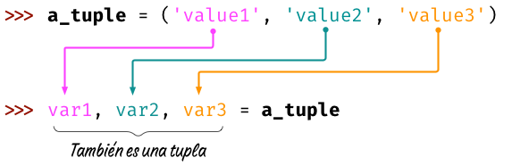

######
Tuplas
######

El concepto de **tupla** es muy similar al de :ref:`lista <datastructures/lists:Listas>`. Aunque hay algunas diferencias menores, lo fundamental es que, mientras una *lista* es mutable y se puede modificar, una *tupla* no admite cambios y por lo tanto, es **inmutable**. [#chain-unsplash]_

**************
Creando tuplas
**************

Podemos pensar en crear tuplas tal y como :ref:`lo hacíamos con listas <datastructures/lists:Creando listas>`, pero usando **paréntesis** en lugar de *corchetes*::

    >>> empty_tuple = ()

    >>> tenerife_geoloc = (28.46824, -16.25462)

    >>> three_wise_men = ('Melchor', 'Gaspar', 'Baltasar')

Tuplas de un elemento
=====================

Hay que prestar especial atención cuando vamos a crear una **tupla de un único elemento**. La intención primera sería hacerlo de la siguiente manera::

    >>> one_item_tuple = ('Papá Noel')

    >>> one_item_tuple
    'Papá Noel'

    >>> type(one_item_tuple)
    str

Realmente, hemos creado una variable de tipo ``str`` (cadena de texto). Para crear una tupla de un elemento debemos añadir una **coma** al final::

    >>> one_item_tuple = ('Papá Noel',)

    >>> one_item_tuple
    ('Papá Noel',)

    >>> type(one_item_tuple)
    tuple

Tuplas sin paréntesis
=====================

Según el caso, hay veces que nos podemos encontrar con tuplas que no llevan paréntesis. Quizás no está tan extendido pero a efectos prácticos tiene el mismo resultado. Veamos algunos ejemplos de ello::

    >>> one_item_tuple = 'Papá Noel',

    >>> three_wise_men = 'Melchor', 'Gaspar', 'Baltasar'

    >>> tenerife_geoloc = 28.46824, -16.25462

*******************
Modificar una tupla
*******************

Como ya hemos comentado previamente, las tuplas con estructuras de datos **inmutables**. Una vez que las creamos con un valor, no podemos modificarlas. Veamos qué ocurre si lo intentamos::

    >>> three_wise_men = 'Melchor', 'Gaspar', 'Baltasar'

    >>> three_wise_men[0] = 'Tom Hanks'
    Traceback (most recent call last):
      File "<stdin>", line 1, in <module>
    TypeError: 'tuple' object does not support item assignment

**********
Conversión
**********

Para convertir otros tipos de datos en una tupla podemos usar la función ``tuple()``::

    >>> shopping = ['Agua', 'Aceite', 'Arroz']

    >>> tuple(shopping)
    ('Agua', 'Aceite', 'Arroz')

Esta conversión es válida para aquellos tipos de datos que sean *iterables*: cadenas de caracteres, listas, diccionarios, conjuntos, etc. Un ejemplo que no funciona es intentar convertir un número en una tupla::

    >>> tuple(5)
    Traceback (most recent call last):
      File "<stdin>", line 1, in <module>
    TypeError: 'int' object is not iterable

El uso de la función ``tuple()`` sin argumentos equivale a crear una tupla vacía::

    >>> tuple()
    ()

**********************
Operaciones con tuplas
**********************

Con las tuplas podemos realizar :ref:`todas las operaciones que vimos con listas <datastructures/lists:Operaciones con listas>` **salvo las que conlleven una modificación** "in-situ" de la misma:

* ``reverse()``
* ``append()``
* ``extend()``
* ``remove()``
* ``clear()``
* ``sort()``

************************
Desempaquetado de tuplas
************************

El **desempaquetado** es una característica de las tuplas que nos permite *asignar una tupla a variables independientes*:

   Desempaquetado de tuplas

Veamos un ejemplo con código::

    >>> three_wise_men = ('Melchor', 'Gaspar', 'Baltasar') 

    >>> king1, king2, king3 = three_wise_men

    >>> king1
    'Melchor'
    >>> king2
    'Gaspar'
    >>> king3
    'Baltasar'

Intercambio de valores
======================

A través del desempaquetado de variables podemos llevar a cabo *el intercambio de los valores de dos variables* de manera directa:

.. code-block::
    :emphasize-lines: 4

    >>> value1 = 40
    >>> value2 = 20

    >>> value1, value2 = value2, value1

    >>> value1
    20
    >>> value2
    40

.. note:: A priori puede parecer que esto es algo "natural", pero en la gran mayoría de lenguajes de programación no es posible hacer este intercambio de forma "directa" ya que necesitamos recurrir a una tercera variable "auxiliar" como almacén temporal en el paso intermedio de traspaso de valores.

.. --------------- Footnotes ---------------

.. [#chain-unsplash] Foto original de portada por `engin akyurt`_ en Unsplash.

.. --------------- Hyperlinks ---------------

.. _engin akyurt: https://unsplash.com/@enginakyurt?utm_source=unsplash&utm_medium=referral&utm_content=creditCopyText
