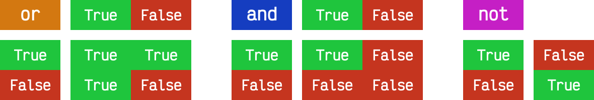

# Condicionales { #conditionals }


/// caption
Imagen generada con Inteligencia Artificial
///

En esta sección estudiaremos las sentencias `if` y `match-case` de _Python_ junto a las distintas variantes que pueden asumir, pero antes de eso introduciremos algunas cuestiones generales de _escritura de código_.

## Definición de bloques { #blocks }

A diferencia de otros lenguajes que utilizan _llaves_ para definir los bloques de código (véase C o Java), cuando Guido Van Rossum [diseñó Python](../introduction/python.md#python) quiso evitar estos caracteres por considerarlos innecesarios.

Es por ello que en Python los bloques de código se definen a través de **espacios en blanco**, preferiblemente :four: espacios en blanco.[^1]


!!! tip "Adaptación"

    Esto puede resultar extraño e (incluso) incómodo a personas que vienen de otros lenguajes de programación pero desaparece rápido y se siente natural a medida que se escribe código.

## Comentarios { #comments }

Los comentarios son anotaciones que podemos incluir en nuestro programa y que nos permiten aclarar ciertos aspectos del código. Estas indicaciones son ignoradas por el intérprete de Python.

Los comentarios se incluyen usando el símbolo almohadilla `#!python #` y comprenden desde ahí hasta el final de la línea.

```python
# Universe age expressed in days
universe_age = 13800 * (10 ** 6) * 365
```

Los comentarios también pueden aparecer en la misma línea de código, aunque la [guía de estilo de Python](https://www.python.org/dev/peps/pep-0008/#inline-comments) no aconseja usarlos en demasía:

```python
stock = 0   # Release additional articles
```

Reglas para escribir buenos comentarios[^2]:

1. Los comentarios no deberían duplicar el código.
2. Los buenos comentarios no arreglan un código poco claro.
3. Si no puedes escribir un comentario claro, puede haber un problema en el código.
4. Los comentarios deberían evitar la confusión, no crearla.
5. Usa comentarios para explicar código no idiomático.
6. Proporciona enlaces a la fuente original del código copiado.
7. Incluye enlaces a referencias externas que sean de ayuda.
8. Añade comentarios cuando arregles errores.
9. Usa comentarios para destacar implementaciones incompletas.

## Ancho del código { #code-width }

Los programas suelen ser más legibles cuando las líneas no son excesivamente largas. La longitud máxima de línea recomendada por la [guía de estilo de Python](https://www.python.org/dev/peps/pep-0008/#maximum-line-length) es de **80 caracteres**.

Sin embargo, esto genera una [cierta controversia](https://richarddingwall.name/2008/05/31/is-the-80-character-line-limit-still-relevant/) hoy en día, ya que los tamaños de pantalla han aumentado y las resoluciones son mucho mayores que hace años. Así las líneas de más de 80 caracteres se siguen visualizando correctamente. Hay personas que son más estrictas con este límite y otras más flexibles.

En caso de que queramos **romper una línea de código** demasiado larga, tenemos dos opciones:

=== "Usar la _barra invertida_ "

    ```pycon
    >>> factorial = factorial(n) * factorial(n - 1) * factorial(n - 2) * factorial(n -3) * factorial(n - 4) * factorial(n - 5)
    
    >>> factorial = factorial(n) * \
    ...             factorial(n - 1) * \
    ...             factorial(n - 2) * \
    ...             factorial(n - 3) * \
    ...             factorial(n - 4) * \
    ...             factorial(n - 5)
    ```

=== "Usar los _paréntesis_"

    ```pycon
    >>> factorial = factorial(n) * factorial(n - 1) * factorial(n - 2) * factorial(n -3) * factorial(n - 4) * factorial(n - 5)
    
    >>> factorial = (factorial(n - 1) *
    ...              factorial(n - 2) *
    ...              factorial(n - 3) *
    ...              factorial(n - 4) *
    ...              factorial(n - 5))
    ```

## La sentencia `if` { #if }

La sentencia condicional en Python (al igual que en muchos otros lenguajes de programación) es `if`. En su escritura debemos añadir una **expresión de comparación** terminando con **dos puntos** al final de la línea.

Veamos un <span class="example">ejemplo:material-flash:</span>:

```pycon
>>> temperature = 40

>>> if temperature > 35:
...     print('Aviso por alta temperatura')
...
Aviso por alta temperatura
```

!!! note "Paréntesis"

    Nótese que en Python no es necesario incluir paréntesis `(` y `)` al escribir condiciones. Hay ocasiones que es recomendable por claridad o por establecer prioridades.

En el caso anterior se puede ver claramente que la condición se cumple y por tanto se ejecuta la instrucción que tenemos dentro del cuerpo de la condición. Pero podría no ser así. Para controlar ese caso existe la sentencia `else`.

Veamos el mismo <span class="example">ejemplo:material-flash:</span> anterior pero añadiendo esta variante:

```pycon
>>> temperature = 20

>>> if temperature > 35:
...     print('Aviso por alta temperatura')
... else:
...     print('Parámetros normales')
...
Parámetros normales
```

Podríamos tener incluso condiciones dentro de condiciones, lo que se viene a llamar técnicamente **condiciones anidadas**[^3].

Veamos un <span class="example">ejemplo:material-flash:</span> ampliando el caso anterior:

```pycon
>>> temperature = 28

>>> if temperature < 20:
...     if temperature < 10:
...         print('Nivel azul')
...     else:
...         print('Nivel verde')
... else:
...     if temperature < 30:
...         print('Nivel naranja')
...     else:
...         print('Nivel rojo')
...
Nivel naranja
```

Python nos ofrece una mejora en la escritura de condiciones anidadas cuando aparecen consecutivamente un `else` y un `if`. Podemos sustituirlos por la sentencia `elif`:


Apliquemos esta mejora al código del <span class="example">ejemplo:material-flash:</span> anterior:

```pycon
>>> temperature = 28

>>> if temperature < 20:
...     if temperature < 10:
...         print('Nivel azul')
...     else:
...         print('Nivel verde')
... elif temperature < 30:
...     print('Nivel naranja')
... else:
...     print('Nivel rojo')
...
Nivel naranja
```

## Asignaciones condicionales { #if-assignments }

Supongamos que queremos asignar un nivel de riesgo de incendio en función de la temperatura.

En su ^^versión clásica^^ escribiríamos algo como:

```pycon
>>> temperature = 35

>>> if temperature < 30:
...     fire_risk = 'LOW'
... else:
...     fire_risk = 'HIGH'
...

>>> fire_risk
'HIGH'
```

Sin embargo, esto lo podríamos abreviar con una **asignación condicional de una única línea**:

```pycon
>>> fire_risk = 'LOW' if temperature < 30 else 'HIGH'

>>> fire_risk
'HIGH'
```

:material-check-all:{ .blue } Con la experiencia, este tipo de construcciones cada vez son más utilizadas ya que condensan información pero mantienen legibilidad.

## Operadores de comparación { #comparation-operators }

Cuando escribimos condiciones debemos incluir alguna expresión de comparación. Para usar estas expresiones es fundamental conocer los **operadores** que nos ofrece Python:

|     Operador      |    Símbolo    |
| ----------------- | ------------- |
| Igualdad          | `#!python ==` |
| Desigualdad       | `#!python !=` |
| Menor que         | `#!python <`  |
| Menor o igual que | `#!python <=` |
| Mayor que         | `#!python >`  |
| Mayor o igual que | `#!python >=` |

A continuación veremos una serie de **_ejemplos_**{ .orange }:material-flash:{ .orange } con expresiones de comparación. Téngase en cuenta que estas expresiones habría que incluirlas dentro de la sentencia condicional en el caso de que quisiéramos tomar una acción concreta:

```pycon
>>> value = 8

>>> value == 8
True

>>> value != 8
False

>>> value < 12
True

>>> value <= 7
False

>>> value > 4
True

>>> value >= 9
False
```

Python ofrece la posibilidad de ver si un valor está entre dos límites de una manera muy sencilla.

Así, por <span class="example">ejemplo:material-flash:</span>, para descubrir si $x \in [4, 12]$ haríamos:

```pycon
>>> 4 <= x <= 12
True
```

!!! note "Notas"

    1. Una expresión de comparación siempre devuelve un valor «booleano», es decir `#!python True` o `#!python False`.
    2. El uso de paréntesis, en función del caso, puede aclarar la expresión de comparación.

## Operadores lógicos { #logical-operators }

Podemos escribir condiciones más complejas usando los **operadores lógicos**:

| Operador  |    Símbolo     |
| --------- | -------------- |
| «Y» lógico  | `#!python and` |
| «O» lógico  | `#!python or`  |
| «No» lógico | `#!python not` |

A continuación veremos una serie de **_ejemplos_**{ .orange }:material-flash:{ .orange } con expresiones lógicas. Téngase en cuenta que estas expresiones habría que incluirlas dentro de la sentencia condicional en el caso de que quisiéramos tomar una acción concreta:

```pycon
>>> x = 8

>>> x > 4 or x > 12  # True or False
True

>>> x < 4 or x > 12  # False or False
False

>>> x > 4 and x > 12  # True and False
False

>>> x > 4 and x < 12  # True and True
True

>>> not(x != 8)  # not False
True
```

Véanse las **tablas de la verdad** para cada operador lógico:



!!! exercise "Ejercicio"

    [pypas](../../third-party/learning/pypas.md) &nbsp;:fontawesome-solid-hand-holding-heart:{ .acc .slide } `leap-year`

### Cortocircuito lógico { #short-circuit }

Es interesante comprender que las expresiones lógicas **no se evalúan por completo si se dan una serie de circunstancias**. Aquí es donde surge el concepto de ^^cortocircuito^^ (lógico) que no es más que una forma de identificar este escenario.

Supongamos un <span class="example">ejemplo:material-flash:</span> en el que utilizamos un **teléfono móvil** que mide su nivel de batería mediante la variable `power` con valores que van desde 0% a 100% y su cobertura 4G mediante la variable `signal_4g` que va desde 0% a 100%.

=== "Cortocircuito AND :material-gate-and:"

    Para poder ^^enviar un mensaje^^ por Telegram el teléfono necesita tener al menos un 25% de batería y al menos un 10% de cobertura:

    ```pycon
    >>> power = 10
    >>> signal_4g = 60

    >>> power > 25 and signal_4g > 10
    False
    ```

    ``` mermaid
    graph LR
        and{<tt>and</tt>}
        power(<tt>power > 25</tt>)
        signal(<tt>signal_4g > 10</tt>)
        result(((<tt>False</tt>)))
        power -- <tt>False</tt> --> and
        and -.-> signal
        and ==> result
    ```

    :material-check-all:{ .blue } Dado que estamos en un `#!python and` y la primera condición `#!python power > 25` no se cumple, se produce un cortocircuito y no se sigue evaluando el resto de la expresión porque ya se sabe que va a dar `#!python False`.

=== "Cortocircuito OR :material-gate-or:"

    Para poder ^^hacer una llamada VoIP^^ necesitamos tener al menos un 40% de batería o al menos un 30% de cobertura:

    ```pycon
    >>> power = 50
    >>> signal_4g = 20
    
    >>> power > 40 or signal_4g > 30
    True
    ```

    ``` mermaid
    graph LR
        or{<tt>or</tt>}
        power(<tt>power > 40</tt>)
        signal(<tt>signal_4g > 30</tt>)
        result(((<tt>True</tt>)))
        power -- <tt>True</tt> --> or
        or -.-> signal
        or ==> result
    ```

    :material-check-all:{ .blue } Dado que estamos en un `#!python or` y la primera condición `#!python power > 40` se cumple, se produce un cortocircuito y no se sigue evaluando el resto de la expresión porque ya se sabe que va a dar `#!python True`.

!!! note "Evaluación"

    Si no se produjera un cortocircuito en la evaluación de la expresión, se seguiría comprobando todas las condiciones posteriores hasta llegar al final de la misma.

### «Booleanos» en condiciones { #boolean }

Cuando queremos preguntar por la **veracidad** de una determinada variable «booleana» en una condición, la primera aproximación que parece razonable es usar lo que ya conocemos.

Veamos un <span class="example">ejemplo:material-flash:</span>:

```pycon hl_lines="3"
>>> is_cold = True

>>> if is_cold == True:#(1)!
...     print('Coge chaqueta')
... else:
...     print('Usa camiseta')
...
Coge chaqueta
```
{ .annotate }

1. :fontawesome-solid-triangle-exclamation:{ .red } No es la manera ~~correcta~~ pitónica.

Pero la manera «obvia» de hacerlo en Python es la siguiente:

```pycon hl_lines="1"
>>> if is_cold:
...     print('Coge chaqueta')
... else:
...     print('Usa camiseta')
...
Coge chaqueta
```

Hemos visto una comparación para un valor «booleano» verdadero (`#!python True`). En el caso de que la comparación fuera para un valor falso lo haríamos así:

```pycon
>>> is_cold = False

>>> if not is_cold:#(1)!
...     print('Usa camiseta')
... else:
...     print('Coge chaqueta')
...
Usa camiseta
```
{ .annotate }

1. :material-approximately-equal: `#!python if is_cold == False:`

De hecho, si lo pensamos, estamos reproduciendo bastante bien el _lenguaje natural_:

- Si hace frío :material-arrow-right-box: coge chaqueta.
- Si no hace frío :material-arrow-right-box: usa camiseta.

!!! exercise "Ejercicio"

    [pypas](../../third-party/learning/pypas.md) &nbsp;:fontawesome-solid-hand-holding-heart:{ .acc .slide } `marvel-akinator`

### Valor nulo { #none }

`#!python None` es un valor especial de Python que almacena el **valor nulo**[^4]. Veamos cómo se comporta al incorporarlo en condiciones de veracidad.

Veamos un sencillo <span class="example">ejemplo:material-flash:</span> para ilustrar su comportamiento:

```pycon
>>> value = None

>>> if value:
...     print('Value has some useful value')
... else:
...     print('Value seems to be void')#(1)!
...
Value seems to be void
```
{ .annotate }

1. `value` podría contener `#!python None`, `#!python False` o cualquier otra expresión cuya veracidad fuera falsa.

Para distinguir `#!python None` de los valores propiamente booleanos, se recomienda el uso del operador `#!python is`:

```pycon hl_lines="3"
>>> value = None

>>> if value is None:
...     print('Value is clearly None')
... else:
...     print('Value has some useful value')
...
Value is clearly None
```

De igual forma, podemos usar esta construcción para el caso contrario. La forma «pitónica» de preguntar **si algo no es nulo** es la siguiente:

```pycon
>>> value = 99

>>> if value is not None:
...     print(f'{value=}')
...
value=99
```

#### 쯇or qué usar `is`? { #why-is }

Cabe preguntarse por qué utilizamos `#!python is` en vez del operador `#!python ==` al comprobar si un valor es nulo, ya que ambas aproximaciones nos dan el mismo resultado[^5]:

```pycon
>>> value = None

>>> value is None
True

>>> value == None
True
```

La respuesta es que el operador `#!python is` comprueba únicamente si los identificadores (posiciones en memoria) de dos objetos son iguales, mientras que la comparación `#!python ==` puede englobar [muchas otras acciones](../modularity/oop.md#magic-methods). De este hecho se deriva que su ejecución sea mucho más rápida y que se eviten «falsos positivos».

Cuando ejecutamos un programa Python existe una serie de ^^objetos precargados en memoria^^. Uno de ellos es `#!python None`.

Lo podemos comprobar con el siguiente <span class="example">ejemplo:material-flash:</span>:

```pycon
>>> id(None)
4314501456
```

Cualquier variable que igualemos al valor nulo, únicamente será una referencia al mismo objeto `#!python None` en memoria:

```pycon
>>> value = None

>>> id(value)
4314501456
```

Por lo tanto, ver si un objeto es `#!python None` es simplemente comprobar que su «id» coincida con el de `#!python None`, que es exactamente el cometido del operador `#!python is`:

```pycon
>>> id(value) == id(None)
True

>>> value is None
True
```

## Veracidad { #truthiness }

Cuando trabajamos con expresiones que incorporan valores «booleanos», se produce una [conversión implícita](../datatypes/numbers.md#implicit-typecast) que transforma los tipos de datos involucrados a valores `#!python True` o `#!python False`.

Lo primero que debemos entender de cara a comprobar la **veracidad** son los valores que evalúan a falso o evalúan a verdadero.

A continuación se muestra un listado de los **únicos items** que evalúan a `#!python False` en Python:

```pycon
>>> bool(False)
False

>>> bool(None)
False

>>> bool(0)
False

>>> bool(0.0)
False

>>> bool('')#(1)!
False

>>> bool([])#(2)!
False

>>> bool(())#(3)!
False

>>> bool({})#(4)!
False

>>> bool(set())#(5)!
False
```
{ .annotate }

1. La cadena vacía.
2. La lista vacía.
3. La tupla vacía.
4. El diccionario vacío.
5. El conjunto vacío.

:material-check-all:{ .blue } El resto de objetos en Python evalúan a `#!python True`.

Veamos algunos <span class="example">ejemplos:material-flash:</span> de objetos que evalúan a `#!python True` en Python:

```pycon
>>> bool('False')
True

>>> bool(' ')
True

>>> bool(1e-10)
True

>>> bool([0])
True

>>> bool('🦆')
True
```

### Asignación lógica { #logical-assignment }

Es posible utilizar [operadores lógicos](#logical-operators) en sentencias de asignación sacando partido de las tablas de la verdad que funcionan para estos casos.

=== "Asignación mediante AND :material-gate-and:"

    Veamos un <span class="example">ejemplo:material-flash:</span> de asignación lógica utilizando el operador `#!python and`:

    ```pycon
    >>> b = 0
    >>> c = 5
    
    >>> a = b and c#(1)!
    
    >>> a
    0
    ```
    { .annotate }
    
    1. Se trata de una expresión lógica en la que se aplica conversión implícita de los valores enteros a valores «booleanos». En este sentido el valor de `b` evalúa a `#!python False` ya que es 0. Al estar usando un operador `#!python and` se produce un [cortocircuito lógico:material-flash-outline:](#short-circuit) y se asigna el valor de la `b` a la variable `a`.

=== "Asignación mediante OR :material-gate-or:"

    Veamos un <span class="example">ejemplo:material-flash:</span> de asignación lógica utilizando el operador `#!python or`:

    ```pycon hl_lines="4"
    >>> b = 0
    >>> c = 5

    >>> a = b or c#(1)!

    >>> a
    5
    ```
    { .annotate }

    1. Se trata de una expresión lógica en la que se aplica conversión implícita de los valores enteros a valores «booleanos». En este sentido el valor de `b` evalúa a `#!python False` ya que es 0. Al estar usando un operador `#!python or` se continúa a la segunda parte donde el valor de la variable `c` evalúa a `#!python True` ya que es 5. Por tanto se asigna dicho valor a la variable `a`.
        
## Sentencia `match-case` { #match-case }

Una de las novedades más esperadas de <span class="pyversion"><a href="https://docs.python.org/3.10/">Python <span class="version">:octicons-tag-24: 3.10</span></a></span> fue el llamado [Structural Pattern Matching](https://peps.python.org/pep-0636/) que introdujo en el lenguaje una nueva sentencia condicional. Ésta se podría asemejar a la sentencia «switch» que ya existe en otros lenguajes de programación.

### Comparando valores { #comparing-values }

En su versión más simple, el «pattern matching» permite comparar un valor de entrada con una serie de literales. Algo así como un conjunto de sentencias «if» encadenadas.

Veamos esta primera aproximación mediante un <span class="example">ejemplo:material-flash:</span> donde mostramos un color a partir de su [codificación RGB](https://es.wikipedia.org/wiki/RGB#Codificaci%C3%B3n_hexadecimal_del_color):

```pycon
>>> color = '#FF0000'

>>> match color:
...     case '#FF0000':
...         print('🔴')
...     case '#00FF00':
...         print('🟢')
...     case '#0000FF':
...         print('🔵')
...
🔴
```

쯈ué ocurre si el valor que comparamos no existe entre las opciones disponibles? Pues en principio, nada, ya que este caso no está cubierto. Si lo queremos controlar, hay que añadir una nueva regla utilizando el subguión `_` como patrón:

```pycon
>>> color = '#AF549B'

>>> match color:
...     case '#FF0000':
...         print('🔴')
...     case '#00FF00':
...         print('🟢')
...     case '#0000FF':
...         print('🔵')
...     case _:
...         print('Unknown color!')
...
Unknown color!
```

Hay que tener cuidado con un detalle. Si estás pensando en usar constantes para definir los valores que puede tomar el color, que sepas que esto te va a fallar:

```pycon
>>> RED_HEXA = '#FF0000'
>>> GREEN_HEXA = '#00FF00'
>>> BLUE_HEXA = '#0000FF'

>>> match color:
...     case RED_HEXA:
...         print('🔴')
...     case GREEN_HEXA:
...         print('🟢')
...     case BLUE_HEXA:
...         print('🔵')
...     case _:
...         print('Unknown color!')
  Cell In[4], line 2
    case RED_HEXA:
         ^
SyntaxError: name capture 'RED_HEXA' makes remaining patterns unreachable
```

Esto se debe a que Python trata a las constantes `#!python RED_HEXA GREEN_HEXA BLUE_HEXA` como nombres de variables y trata de aplicar el [patrón de captura](https://peps.python.org/pep-0634/#capture-patterns) sobre `match-case`[^6].

!!! exercise "Ejercicio"

    [pypas](../../third-party/learning/pypas.md) &nbsp;:fontawesome-solid-hand-holding-heart:{ .acc .slide } `simple-op`

### Patrones avanzados { #advanced-patterns }

La sentencia `match-case` va mucho más allá de una simple comparación de valores. Con ella podremos deconstruir estructuras de datos, capturar elementos o mapear valores.

Vamos a plantear un <span class="example">ejemplo:material-flash:</span> donde partimos de una [tupla](../datastructures/tuples.md) que representará un punto en el plano (2 coordenadas) o en el espacio (3 coordenadas). Lo primero que vamos a hacer es detectar en qué dimensión se encuentra el punto:

```pycon
>>> point = (2, 5)

>>> match point:
...     case (x, y):
...         print(f'({x},{y}) is in plane')
...     case (x, y, z):
...         print(f'({x},{y},{z}) is in space')
...
(2,5) is in plane

>>> point = (3, 1, 7)

>>> match point:
...     case (x, y):
...         print(f'({x},{y}) is in plane')
...     case (x, y, z):
...         print(f'({x},{y},{z}) is in space')
...
(3,1,7) is in space
```

Sin embargo esta aproximación permitiría tratar un punto formado por cadenas de texto...

```pycon
>>> point = ('2', '5')

>>> match point:
...     case (x, y):
...         print(f'({x},{y}) is in plane')
...     case (x, y, z):
...         print(f'({x},{y},{z}) is in space')
...
(2,5) is in plane
```

Por tanto debemos restringir nuestros patrones a valores enteros:

=== "Strings bajo control"

    ```pycon
    >>> point = ('2', '5')
    
    >>> match point:
    ...     case (int(), int()):
    ...         print(f'{point} is in plane')
    ...     case (int(), int(), int()):
    ...         print(f'{point} is in space')
    ...     case _:
    ...         print('Unknown!')
    ...
    Unknown!
    ```

=== "Sigue funcionando con enteros"

    ```pycon
    >>> point = (3, 9, 1)
    
    >>> match point:
    ...     case (int(), int()):
    ...         print(f'{point} is in plane')
    ...     case (int(), int(), int()):
    ...         print(f'{point} is in space')
    ...     case _:
    ...         print('Unknown!')
    ...
    (3, 9, 1) is in space
    ```

Imaginemos ahora que nos piden calcular la distancia del punto al origen. Debemos tener en cuenta que, a priori, desconocemos si el punto está en el plano o en el espacio:

```pycon
>>> point = (8, 3, 5)

>>> match point:
...     case (int(x), int(y)):
...         dist_to_origin = (x ** 2 + y ** 2) ** (1 / 2)
...     case (int(x), int(y), int(z)):
...         dist_to_origin = (x ** 2 + y ** 2 + z ** 2) ** (1 / 2)
...     case _:
...         print('Unknown!')
...

>>> dist_to_origin
9.899494936611665
```

Con este enfoque, nos aseguramos que los puntos de entrada deben tener todas sus coordenadas como valores enteros:

```pycon
>>> point = ('8', 3, 5)  # Nótese el 8 como "string"

>>> match point:
...     case (int(x), int(y)):
...         dist_to_origin = (x ** 2 + y ** 2) ** (1 / 2)
...     case (int(x), int(y), int(z)):
...         dist_to_origin = (x ** 2 + y ** 2 + z ** 2) ** (1 / 2)
...     case _:
...         print('Unknown!')
...
Unknown!
```

Cambiando de <span class="example">ejemplo:material-flash:</span>, veamos un fragmento de código en el que tenemos que **comprobar la estructura de un bloque de autenticación** definido mediante un [diccionario](../datastructures/dicts.md). Los métodos válidos de autenticación son únicamente dos: bien usando nombre de usuario y contraseña, o bien usando correo electrónico y «token» de acceso. Además, los valores deben venir en formato cadena de texto:

```pycon
>>> auths = [
...     {'username': 'sdelquin', 'password': '1234'},
...     {'email': 'sdelquin@gmail.com', 'token': '4321'},
...     {'email': 'test@test.com', 'password': 'ABCD'},
...     {'username': 'sdelquin', 'password': 1234}
... ]

>>> for auth in auths:
...     print(auth)
...     match auth:
...         case {'username': str(username), 'password': str(password)}:
...             print('Authenticating with username and password')
...             print(f'{username}: {password}')
...         case {'email': str(email), 'token': str(token)}:
...             print('Authenticating with email and token')
...             print(f'{email}: {token}')
...         case _:
...             print('Authenticating method not valid!')
...     print('---')
...
{'username': 'sdelquin', 'password': '1234'}
Authenticating with username and password
sdelquin: 1234
---
{'email': 'sdelquin@gmail.com', 'token': '4321'}
Authenticating with email and token
sdelquin@gmail.com: 4321
---
{'email': 'test@test.com', 'password': 'ABCD'}
Authenticating method not valid!
---
{'username': 'sdelquin', 'password': 1234}
Authenticating method not valid!
---
```

Aún un último <span class="example">ejemplo:material-flash:</span> que determina, dada la edad de una persona, si puede o no beber alcohol:

```pycon
>>> age = 21

>>> match age:
...     case 0 | None:#(1)!
...         print('Not a person')
...     case n if n < 17:#(2)!
...         print('Nope')
...     case n if n < 22:#(3)!
...         print('Not in the US')
...     case _:
...         print('Yes')
...
Not in the US
```
{ .annotate }

1. Nótese el uso del OR...
2. Uso de condicional en la propia expresión.
3. Uso de condicional en la propia expresión.

## Operador morsa { #walrus }

<span class="pyversion"><a href="https://docs.python.org/3.8/">Python <span class="version">:octicons-tag-24: 3.8</span></a></span> introdujo el ^^polémico^^ [operador morsa](https://peps.python.org/pep-0572/)[^7] `#!python :=` que permitía unificar sentencias de asignación dentro de expresiones.

Supongamos un <span class="example">ejemplo:material-flash:</span> en el que computamos el **perímetro de una circunferencia**, indicando al usuario que debe incrementarlo siempre y cuando no llegue a un mínimo establecido.

=== "Versión clásica"

    ```pycon
    >>> radius = 4.25
    ... perimeter = 2 * 3.14 * radius
    ... if perimeter < 100:
    ...     print('Increase radius to reach minimum perimeter')
    ...     print('Actual perimeter: ', perimeter)
    ...
    Increase radius to reach minimum perimeter
    Actual perimeter:  26.69
    ```

=== "Versión con operador morsa"

    ```pycon hl_lines="2"
    >>> radius = 4.25
    ... if (perimeter := 2 * 3.14 * radius) < 100:
    ...     print('Increase radius to reach minimum perimeter')
    ...     print('Actual perimeter: ', perimeter)
    ...
    Increase radius to reach minimum perimeter
    Actual perimeter:  26.69
    ```

!!! tip "Equilibro"

    Como hemos comprobado, el operador morsa permite realizar asignaciones dentro de expresiones, lo que, en muchas ocasiones, permite obtener un código más compacto. Sería conveniente encontrar un equilibrio entre la expresividad y la legibilidad.

??? danger "Renuncia de Guido van Rossum"

    La adopción del «walrus operator» en el lenguaje fue una de las polémicas más polarizadas en la historia reciente de Python. Tal es así, que al día siguiente de que Guido van Rossum aceptara su introducción en el lenguaje, tuvo un aluvión de críticas que colmaron la paciencia del creador holandés. Así las cosas, Guido escribió [esta carta](https://www.mail-archive.com/python-committers@python.org/msg05628.html) abandonando su puesto como líder y transfiriendo su poder de decisión sobre Python; y terminaba con un «I'm tired, and need a very long break.»

## Ejercicios { #exercises }

1. [pypas](../../third-party/learning/pypas.md) &nbsp;:fontawesome-solid-hand-holding-heart:{ .acc .slide } `rps`
2. [pypas](../../third-party/learning/pypas.md) &nbsp;:fontawesome-solid-hand-holding-heart:{ .acc .slide } `min3values`
3. [pypas](../../third-party/learning/pypas.md) &nbsp;:fontawesome-solid-hand-holding-heart:{ .acc .slide } `blood-donation`
4. [pypas](../../third-party/learning/pypas.md) &nbsp;:fontawesome-solid-hand-holding-heart:{ .acc .slide } `facemoji`
5. [pypas](../../third-party/learning/pypas.md) &nbsp;:fontawesome-solid-hand-holding-heart:{ .acc .slide } `shortcuts`


[^1]: Reglas de indentación definidas en [PEP 8](https://www.python.org/dev/peps/pep-0008/#indentation).
[^2]: Fuente: [Best practices for writing code comments](https://stackoverflow.blog/2021/12/23/best-practices-for-writing-code-comments/)
[^3]: El anidamiento (o «nesting») hace referencia a incorporar sentencias unas dentro de otras mediante la inclusión de diversos niveles de profunidad (indentación).
[^4]: El valor nulo se conoce en otros lenguajes de programación como `nil`, `null`, `nothing`, ...
[^5]: Uso de `#!python is` en comparación de valores nulos explicada [aquí](https://jaredgrubb.blogspot.com/2009/04/python-is-none-vs-none.html) por Jared Grubb.
[^6]: El error está perfectamente analizado en [esta respuesta de StackOverflow](https://stackoverflow.com/a/67525259).
[^7]: Se denomina así porque el operador `#!python :=` tiene similitud con los colmillos de una morsa.
