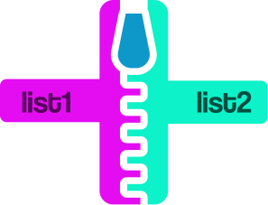
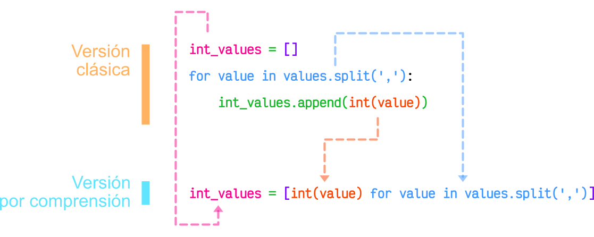
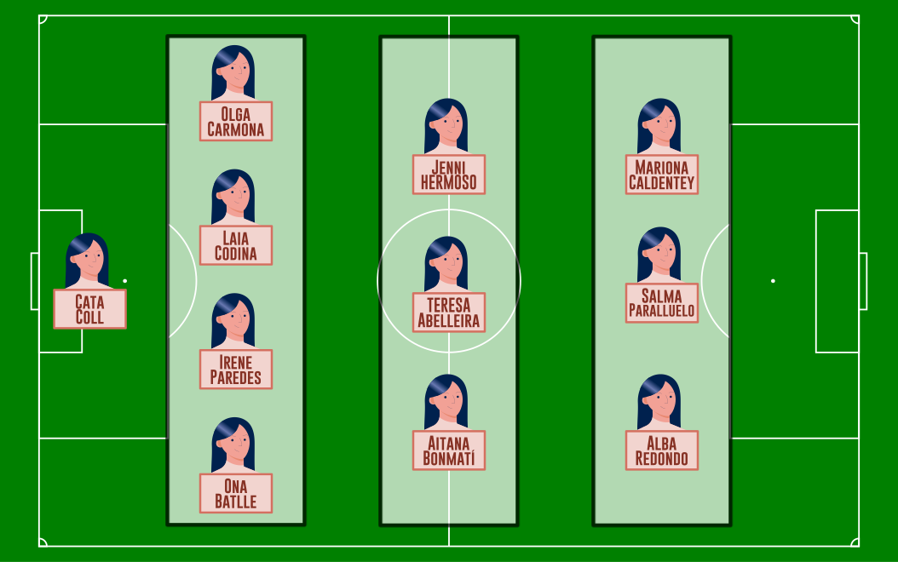

# Listas { #lists }


(1)
{ .annotate }

1. :fontawesome-regular-copyright: [Mike Arney](https://unsplash.com/es/@mikearney) :material-at: [Unsplash](https://unsplash.com) 

Las listas permiten **almacenar objetos** mediante un **orden definido** y con posibilidad de duplicados. Las listas son estructuras de datos **mutables**, lo que significa que podemos añadir, eliminar o modificar sus elementos.

## Creando listas { #create }

Una lista está compuesta por **cero o más elementos**. En Python debemos escribir estos elementos ^^separados por comas^^ y ^^dentro de corchetes^^. 

Veamos algunos <span class="example">ejemplos:material-flash:</span> de listas:

```pycon
>>> languages = ['Python', 'Ruby', 'Javascript']#(1)!

>>> fibonacci = [0, 1, 1, 2, 3, 5, 8, 13]#(2)!

>>> empty_list = []#(3)!

>>> data = [#(4)!
...    'Tenerife',
...    {'cielo': 'limpio', 'temp': 24},
...    3718,
...    (28.2933947, -16.5226597)
... ]
```
{ .annotate }

1. Una lista de 3 [cadenas de texto](../datatypes/strings.md).
2. Una lista de 8 [números enteros](../datatypes/numbers.md#integers).
3. La **lista vacía** (_0 elementos_).
4. Una lista **heterogénea** de 4 elementos de distinta naturaleza.

??? note "Datos heterogéneos"

    Una lista en Python (a diferencia de otros lenguajes de programación) puede contener **datos heterogéneos**. Esto hace de la lista una estructura de datos muy versátil.

!!! exercise "Ejercicio"

    Entra en el intérprete interactivo de Python <span class="green">❯❯❯</span> y crea una lista con las 5 ciudades que más te gusten.

## Conversión { #cast }

Para convertir otros tipos de datos en una lista podemos usar la función `#!python list()`. Por <span class="example">ejemplo:material-flash:</span> podemos convertir una _cadena de texto_ en una lista:

```pycon
>>> list('Python')
['P', 'y', 't', 'h', 'o', 'n']
```

Si nos fijamos en lo que ha pasado, al convertir la cadena de texto Python se ha creado una lista con 6 elementos, donde cada uno de ellos representa un carácter de la cadena. Podemos extender este comportamiento a cualquier otro tipo de datos que permita ser iterado (_iterables_).

Otro <span class="example">ejemplo:material-flash:</span> interesante de conversión puede ser la de los [rangos](../controlflow/loops.md#range). En este caso queremos obtener una **lista explícita** con los valores que constituyen el rango $[0,9]$:

```pycon
>>> list(range(10))
[0, 1, 2, 3, 4, 5, 6, 7, 8, 9]
```

??? warning "Nombre de variable"

    Aunque está permitido, no suele ser una buena práctica llamar `list` a una variable ya que destruirías la función que nos permite trabajar con listas. Tampoco parece muy razonable utilizar nombres como `<algo>_list` o `list_<algo>` ya que no es necesario incluir en el nombre de una variable su propia naturaleza.

## Operaciones con listas { #operations }

Existen multitud de operaciones que se pueden realizar sobre listas. A continuación veremos la mayoría de ellas:

### Obtener un elemento { #get-item }

Igual que en el caso de las [cadenas de texto](../datatypes/strings.md), podemos obtener un elemento de una lista a través del **índice** (lugar) que ocupa. Veamos un <span class="example">ejemplo:material-flash:</span>:

```pycon
>>> shopping = ['Agua', 'Huevos', 'Aceite']

>>> shopping[0]
'Agua'

>>> shopping[1]
'Huevos'

>>> shopping[2]
'Aceite'

>>> shopping[-1]#(1)!
'Aceite'
```
{ .annotate }

1. ¡Aquí también funcionan los índices negativos!

El **índice** que usemos para acceder a los elementos de una lista tiene que estar ^^comprendido entre los límites^^ de la misma. Si usamos un índice antes del comienzo o después del final obtendremos un error ([excepción](../modularity/exceptions.md)):

```pycon hl_lines="7 13"
>>> shopping = ['Agua', 'Huevos', 'Aceite']

>>> shopping[3]
Traceback (most recent call last):
  Cell In[2], line 1
    shopping[3]
IndexError: list index out of range

>>> shopping[-5]
Traceback (most recent call last):
  Cell In[3], line 1
    shopping[-5]
IndexError: list index out of range
```

### Trocear una lista { #slicing }

El troceado de listas funciona de manera totalmente análoga al [troceado de cadenas](../datatypes/strings.md#slicing). Veamos algunos <span class="example">ejemplos:material-flash:</span>:

```pycon
>>> shopping = ['Agua', 'Huevos', 'Aceite', 'Sal', 'Limón']

>>> shopping[:3]#(1)!
['Agua', 'Huevos', 'Aceite']

>>> shopping[2:4]
['Aceite', 'Sal']

>>> shopping[-1:-4:-1]
['Limón', 'Sal', 'Aceite']

>>> shopping[::-1]#(2)!
['Limón', 'Sal', 'Aceite', 'Huevos', 'Agua']
```
{ .annotate }

1. También podríamos haber escrito `#!python shopping[0:3]` aunque no es habitual.
2. Equivale a invertir la lista.

En el troceado de listas, a diferencia de lo que ocurre al obtener elementos, no debemos preocuparnos por acceder a índices no válidos (fuera de rango) ya que Python los restringirá a los límites de la lista:

```pycon
>>> shopping
['Agua', 'Huevos', 'Aceite', 'Sal', 'Limón']

>>> shopping[10:]
[]

>>> shopping[-100:2]
['Agua', 'Huevos']

>>> shopping[2:100]
['Aceite', 'Sal', 'Limón']
```

:material-check-all:{ .blue } Ninguna de las operaciones anteriores modifican la lista original, simplemente devuelven una lista nueva.

### Invertir una lista { #reverse }

Python nos ofrece varios mecanismos para invertir los elementos de una lista, en función del resultado que busquemos:

=== "Conservando la lista original :material-texture-box:"

    - **Opcion A**{ .pink } :material-arrow-right-box: Mediante [troceado de listas](#slicing) con «step» negativo:

        ```pycon
        >>> shopping
        ['Agua', 'Huevos', 'Aceite', 'Sal', 'Limón']
        
        >>> shopping[::-1]
        ['Limón', 'Sal', 'Aceite', 'Huevos', 'Agua']
        ```

    - **Opcion B**{ .pink } :material-arrow-right-box: Mediante la función `#!python reversed()`:

        ```pycon
        >>> shopping
        ['Agua', 'Huevos', 'Aceite', 'Sal', 'Limón']
        
        >>> list(reversed(shopping))
        ['Limón', 'Sal', 'Aceite', 'Huevos', 'Agua']
        ```

=== "Modificando la lista original :fontawesome-solid-bolt:"

    Mediante la función `#!python reverse()` (_nótese que es sin «d» al final_):

    ```pycon
    >>> shopping
    ['Agua', 'Huevos', 'Aceite', 'Sal', 'Limón']
    
    >>> shopping.reverse()
    
    >>> shopping#(1)!
    ['Limón', 'Sal', 'Aceite', 'Huevos', 'Agua']
    ```
    { .annotate }
    
    1. Se ha modificado la lista original.

### Añadir al final de la lista { #append }

Una de las operaciones más utilizadas en listas es **añadir elementos al final** de las mismas. Para ello Python nos ofrece la función `#!python append()`. Se trata de un método «destructivo» que modifica la lista original.

Veamos un <span class="example">ejemplo:material-flash:</span> donde añadimos un producto a la lista de la compra:

```pycon hl_lines="3"
>>> shopping = ['Agua', 'Huevos', 'Aceite']

>>> shopping.append('Atún')

>>> shopping
['Agua', 'Huevos', 'Aceite', 'Atún']
```

#### Patrón creación { #create-pattern }

Una forma muy habitual de trabajar con listas es empezar con una vacía e ir añadiendo elementos poco a poco. Se podría hablar de un **patrón creación**.

Supongamos un <span class="example">ejemplo:material-flash:</span> en el que queremos construir una lista con los números pares en el intervalo $[0,20]$:

```pycon
>>> even_numbers = []

>>> for num in range(20 + 1):#(1)!
...     if num % 2 == 0:
...         even_numbers.append(num)
...

>>> even_numbers
[0, 2, 4, 6, 8, 10, 12, 14, 16, 18, 20]
```
{ .annotate }

1. Para «llegar» al 20 hay que incrementar en una unidad.

### Añadir en cualquier posición { #insert }

Ya hemos visto cómo añadir elementos al final de una lista. Sin embargo, Python ofrece una función `#!python insert()` que vendría a ser una generalización de la anterior, para incorporar elementos en cualquier posición.

Simplemente debemos especificar el **índice de inserción** y el **elemento a insertar**. También se trata de una función destructiva.

En el siguiente <span class="example">ejemplo:material-flash:</span> insertamos dos nuevos productos a la lista de la compra en posiciones arbitrarias:

```pycon hl_lines="3 8"
>>> shopping = ['Agua', 'Huevos', 'Aceite']

>>> shopping.insert(1, 'Jamón')#(1)!

>>> shopping
['Agua', 'Jamón', 'Huevos', 'Aceite']

>>> shopping.insert(3, 'Queso')#(2)!

>>> shopping
['Agua', 'Jamón', 'Huevos', 'Queso', 'Aceite']
```
{ .annotate }

1. Se podría leer como: «Quiero que `#!python 'Jamón'` quede en la posición 1 de la lista».
2. Se podría leer como: «Quiero que `#!python 'Queso'` quede en la posición 3 de la lista».

Al igual que ocurría con el [troceado de listas](#slicing), en este tipo de inserciones no obtendremos un error si especificamos índices fuera de los límites de la lista. Estos se ajustarán al principio o al final en función del valor que indiquemos:

```pycon
>>> shopping = ['Agua', 'Huevos', 'Aceite']

>>> shopping.insert(100, 'Mermelada')#(1)!

>>> shopping
['Agua', 'Huevos', 'Aceite', 'Mermelada']

>>> shopping.insert(-100, 'Arroz')#(2)!

>>> shopping
['Arroz', 'Agua', 'Huevos', 'Aceite', 'Mermelada']
```
{ .annotate }

1. Se inserta lo más a la «derecha» posible.
2. Se inserta lo más a la «izquierda» posible.

!!! abstract "append vs insert"

    Podría existir la tentación de utilizar `#!python insert()` para **añadir elementos al final** de una lista...

    ```pycon hl_lines="2"
    >>> values = [1, 2, 3]
    >>> values.insert(len(values), 4)
    >>> values
    [1, 2, 3, 4]
    ```

    :material-alarm-light-off-outline:{ .red } ¡No lo hagas! Utiliza [`append()`](#append) :material-arrow-right-box: Es más eficiente y más legible.

### Repetir elementos { #repeat }

Al igual que con las [cadenas de texto](../datatypes/strings.md#repeat), el operador `#!python *` nos permite repetir los elementos de una lista.

Siguiendo con el <span class="example">ejemplo:material-flash:</span> de la _lista de la compra_, podríamos querer comprar 3 unidades de cada producto:

```pycon
>>> shopping = ['Agua', 'Huevos', 'Aceite']

>>> shopping * 3
['Agua',
 'Huevos',
 'Aceite',
 'Agua',
 'Huevos',
 'Aceite',
 'Agua',
 'Huevos',
 'Aceite']
```

### Combinar listas { #combine }

Python nos ofrece varios mecanismos para combinar dos listas, en función del resultado que busquemos:

=== "Conservando la lista original :material-texture-box:"

    Mediante el operador `+`:

    ```pycon hl_lines="4"
    >>> shopping = ['Agua', 'Huevos', 'Aceite']
    >>> fruitshop = ['Naranja', 'Manzana', 'Piña']
    
    >>> shopping + fruitshop
    ['Agua', 'Huevos', 'Aceite', 'Naranja', 'Manzana', 'Piña']
    ```

=== "Modificando la lista original :fontawesome-solid-bolt:"

    Mediante la función `#!python extend()`:

    ```pycon hl_lines="4"
    >>> shopping = ['Agua', 'Huevos', 'Aceite']
    >>> fruitshop = ['Naranja', 'Manzana', 'Piña']
    
    >>> shopping.extend(fruitshop)#(1)!
    
    >>> shopping
    ['Agua', 'Huevos', 'Aceite', 'Naranja', 'Manzana', 'Piña']
    ```
    { .annotate }
    
    1. Esto es equivalente a: `#!python shopping += fruitshop`

    Hay que tener en cuenta que `extend()` funciona adecuadamente si pasamos **una lista como argumento**. En otro caso, quizás los resultados no sean los esperados.

    Veamos un <span class="example">ejemplo:material-flash:</span>:

    ```pycon
    >>> shopping = ['Agua', 'Huevos', 'Aceite']

    >>> shopping.extend('Limón')#(1)!

    >>> shopping
    ['Agua', 'Huevos', 'Aceite', 'L', 'i', 'm', 'ó', 'n']
    ```
    { .annotate }

    1.  - `extend()` «recorre» (o itera) sobre cada uno de los elementos del objeto en cuestión.
        - Al ser una _cadena de texto_ cada elemento es un carácter.

Se podría pensar en utilizar `append()` **para combinar listas**. La realidad es que no funciona exactamente como esperamos; la segunda lista se añadiría **como una sublista** de la principal.

Veamos un <span class="example">ejemplo:material-flash:</span>:

```pycon
>>> shopping = ['Agua', 'Huevos', 'Aceite']
>>> fruitshop = ['Naranja', 'Manzana', 'Piña']

>>> shopping.append(fruitshop)

>>> shopping
['Agua', 'Huevos', 'Aceite', ['Naranja', 'Manzana', 'Piña']]
```

### Modificar listas { #modify }

Para modificar un elemento de una lista debemos acceder a su índice y asignar el valor correspondiente.

En el siguiente <span class="example">ejemplo:material-flash:</span> preferimos comprar jugo que agua:

```pycon hl_lines="6"
>>> shopping = ['Agua', 'Huevos', 'Aceite']

>>> shopping[0]
'Agua'

>>> shopping[0] = 'Jugo'

>>> shopping
['Jugo', 'Huevos', 'Aceite']
```

En el caso de acceder a un **índice no válido** de la lista, incluso para modificar, obtendremos un error:

```pycon hl_lines="5"
>>> shopping[100]
Traceback (most recent call last):
  Cell In[1], line 1
    shopping[100]
IndexError: list index out of range
```

#### Modificar con troceado

No sólo es posible modificar un elemento de cada vez, sino que podemos asignar valores a trozos de una lista.

En el siguiente <span class="example">ejemplo:material-flash:</span> reemplazamos _huevos, aceite y sal_ por _atún y pasta_:

```pycon hl_lines="6"
>>> shopping = ['Agua', 'Huevos', 'Aceite', 'Sal', 'Limón']

>>> shopping[1:4]
['Huevos', 'Aceite', 'Sal']

>>> shopping[1:4] = ['Atún', 'Pasta']#(1)!

>>> shopping
['Agua', 'Atún', 'Pasta', 'Limón']
```
{ .annotate }

1. La lista que asignamos no necesariamente debe tener la misma longitud que el trozo que sustituimos.

### Borrar elementos { #remove }

Python nos ofrece varios mecanismos para borrar elementos de una lista:

=== "Por su índice :octicons-number-24:"

    Mediante la sentencia `#!python del`:

    ```pycon hl_lines="3"
    >>> shopping = ['Agua', 'Huevos', 'Aceite', 'Sal', 'Limón']
    
    >>> del shopping[3]
    
    >>> shopping
    ['Agua', 'Huevos', 'Aceite', 'Limón']
    ```

=== "Por su valor :octicons-briefcase-24:"

    Mediante la función `#!python remove()`:

    ```pycon hl_lines="3"
    >>> shopping = ['Agua', 'Huevos', 'Aceite', 'Sal', 'Limón']
    
    >>> shopping.remove('Sal')#(1)!
    
    >>> shopping
    ['Agua', 'Huevos', 'Aceite', 'Limón']
    ```
    { .annotate }
    
    1. Si existen valores duplicados, la función `remove()` sólo borarrá la primera ocurrencia.

=== "Por su índice (con extracción) :octicons-repo-pull-16:"

    La sentencia `#!python del` y la función `#!python remove()` efectivamente borran el elemento indicado de la lista, pero no «devuelven»[^1] nada. Sin embargo, Python nos ofrece la función `pop()` que además de borrar, nos «recupera» el elemento; algo así como una _extracción_. Lo podemos ver como una combinación de _acceso + borrado_:

    ```pycon hl_lines="3 10"
    >>> shopping = ['Agua', 'Huevos', 'Aceite', 'Sal', 'Limón']
    
    >>> product = shopping.pop()#(1)!
    >>> product
    'Limón'
    
    >>> shopping
    ['Agua', 'Huevos', 'Aceite', 'Sal']
    
    >>> product = shopping.pop(2)#(2)!
    >>> product
    'Aceite'
    
    >>> shopping
    ['Agua', 'Huevos', 'Sal']
    ```
    { .annotate }
    
    1. Cuando no se indica el índice, Python extrae en último elemento. Equivale a: `#!python shopping.pop(-1)`
    2. Extraer el elemento en la posición 2.

=== "Por su rango :fontawesome-solid-pizza-slice:"

    Mediante [troceado de listas](#slicing):

    ```pycon hl_lines="3"
    >>> shopping = ['Agua', 'Huevos', 'Aceite', 'Sal', 'Limón']
    
    >>> shopping[1:4] = []
    
    >>> shopping
    ['Agua', 'Limón']
    ```

#### Borrado completo de la lista { #clear }

Python nos ofrece varios mecanismos para borrar una lista por completo:

=== "Borrado in-situ :material-pail-remove:"

    Mediante la función `clear()`:

    ```pycon hl_lines="3"
    >>> shopping = ['Agua', 'Huevos', 'Aceite', 'Sal', 'Limón']
    
    >>> shopping.clear()#(1)!
    
    >>> shopping
    []
    ```
    { .annotate }
    
    1. Misma zona de memoria.

=== "Reinicializando a vacío :fontawesome-solid-wine-glass-empty:"

    Mediante la asignación a lista vacía:

    ```pycon
    >>> shopping = ['Agua', 'Huevos', 'Aceite', 'Sal', 'Limón']
    
    >>> shopping = []#(1)!
    
    >>> shopping
    []
    ```
    { .annotate }
    
    1. Nueva zona de memoria.

!!! info "Recolector de basura"

    La memoria que queda «en el limbo» después de asignar un nuevo valor a la lista es detectada por el [recolector de basura](https://dev.to/pragativerma18/understanding-pythons-garbage-collection-and-memory-optimization-4mi2) de Python, quien se encarga de liberar aquellos datos que no están referenciados por ninguna variable.

### Encontrar un elemento { #find }

Si queremos descubrir el índice que corresponde a un determinado valor dentro una lista debemos usar la función `#!python index()`.

Como <span class="example">ejemplo:material-flash:</span> supongamos que queremos encontrar el _aceite_ en nuestra lista de la compra:

```pycon hl_lines="3"
>>> shopping = ['Agua', 'Huevos', 'Aceite', 'Sal', 'Limón']

>>> shopping.index('Aceite')
2
```

Hay que tener en cuenta que si el elemento que buscamos no está en la lista, obtendremos un error:

```pycon hl_lines="7"
>>> shopping = ['Agua', 'Huevos', 'Aceite', 'Sal', 'Limón']

>>> shopping.index('Pollo')
Traceback (most recent call last):
  Cell In[2], line 1
    shopping.index('Pollo')
ValueError: 'Pollo' is not in list
```

!!! info "Múltiples ocurrencias"

    Si buscamos un valor que existe más de una vez en una lista, la función `index()` sólo nos devolverá **el índice de la primera ocurrencia**.

!!! warning "No existe `find`"

    En listas no disponemos de la función `find()` que sí estaba disponible para [cadenas de texto](../datatypes/strings.md#search).

### Pertenencia de un elemento { #in }

Si queremos comprobar la existencia de un determinado elemento en una lista, podríamos buscarlo por su índice, pero la **forma pitónica** de hacerlo es utilizar el operador `#!python in`.

Si no estamos seguros de si hemos incluido ciertos productos en nuestro <span class="example">ejemplo:material-flash:</span> de la lista de la compra, lo podemos comprobar de la siguiente manera:

```pycon
>>> shopping = ['Agua', 'Huevos', 'Aceite', 'Sal', 'Limón']

>>> 'Aceite' in shopping  # ¿Apunté aceite? 🤔
True

>>> 'Pollo' in shopping   # ¿Apunté pollo? 🤔
False
```

!!! note "Valor booleano"

    El operador `in` siempre devuelve un [valor booleano](../datatypes/numbers.md#booleans), es decir, verdadero o falso.

!!! exercise "Ejercicio"

    [pypas](https://pypas.es) &nbsp;:fontawesome-solid-hand-holding-heart:{ .slide } `isogram`

### Longitud de una lista { #length }

Podemos conocer el número de elementos que tiene una lista mediante la función `#!python len()`.

Por <span class="example">ejemplo:material-flash:</span> para conocer la cantidad de productos de nuestra lista de la compra haríamos lo siguiente:

```pycon hl_lines="3"
>>> shopping = ['Agua', 'Huevos', 'Aceite', 'Sal', 'Limón']

>>> len(shopping)
5
```

### Número de ocurrencias { #count }

Para contar cuántas veces aparece un determinado valor dentro de una lista podemos usar la función `count()`.

Un <span class="example">ejemplo:material-flash:</span> «divertido» de la serie [The Big Bang Theory](https://www.imdb.com/title/tt0898266/):

```pycon
>>> sheldon_greeting = ['Penny', 'Penny', 'Penny']

>>> sheldon_greeting.count('Howard')
0

>>> sheldon_greeting.count('Penny')
3
```

### Dividir «string» como lista { #split }

Una **tarea muy habitual** al trabajar con _cadenas de texto_ es **dividirlas** por algún tipo de separador. En este sentido, Python nos ofrece la función `split()`, que debemos usar anteponiendo el «string» que queramos dividir.

Veamos un <span class="example">ejemplo:material-flash:</span> con ciertos refranes:

```pycon hl_lines="2 6"
>>> proverb = 'No hay mal que por bien no venga'
>>> proverb.split()#(1)!
['No', 'hay', 'mal', 'que', 'por', 'bien', 'no', 'venga']

>>> tools = 'Martillo,Sierra,Destornillador'
>>> tools.split(',')#(2)!
['Martillo', 'Sierra', 'Destornillador']
```
{ .annotate }

1. Si no se indica nada, la función `split()` usa por defecto cualquier secuencia de espacios en blanco, tabuladores y saltos de línea como separador.
2. En este caso se ha indicado que el separador sea una coma.

Existe _una variante_ de `split()` en la que indicamos el **número máximo de divisiones**. Supongamos un <span class="example">ejemplo:material-flash:</span> en el que nos dan una URL y nos piden separar el dominio de la ruta:

```pycon hl_lines="6"
>>> url = 'python.org/downloads/releases'

>>> url.split('/')#(1)!
['python.org', 'downloads', 'releases']

>>> url.split('/', 1)#(2)!
['python.org', 'downloads/releases']
```
{ .annotate }

1. Aquí `split()` no nos está sirviendo mucho...
2. Al indicar el máximo de «una división» hemos conseguido el resultado.

:material-check-all:{ .blue } También existe la función `rsplit()` que se comporta exactamente igual que la función `split()` pero **empezando por la derecha**.

##### Diviendo líneas { #splitlines }

Otro caso de uso muy habitual es querer dividir un fragmento de texto por sus saltos de línea. Para ello Python nos proporciona la función [`splitlines()`](https://docs.python.org/es/3/library/stdtypes.html#str.splitlines)(1).
{ .annotate }

1. Admite un parámetro `keepends` (`#!python bool`) que indica si queremos mantener los saltos de línea o no.

Por <span class="example">ejemplo:material-flash:</span>, supongamos que tenemos una estrofa de la canción [«Cómo hablar» de Amaral](https://www.youtube.com/watch?v=DjkLlTLMNDs) y queremos obtener una lista con cada frase:

```python
>>> lyrics = """Si volviera a nacer, si empezara de nuevo
... Volvería a buscarte en mi nave del tiempo
... Es el destino quien nos lleva y nos guia
... Nos separa y nos une a traves de la vida"""

>>> lyrics.splitlines()
['Si volviera a nacer, si empezara de nuevo',
 'Volvería a buscarte en mi nave del tiempo',
 'Es el destino quien nos lleva y nos guia',
 'Nos separa y nos une a traves de la vida']
```

!!! exercise "Ejercicio"

    [pypas](https://pypas.es) &nbsp;:fontawesome-solid-hand-holding-heart:{ .slide } `num-words`

#### Particionado de cadenas de texto { #partition }

Existe una forma algo más «elaborada» de dividir una cadena a través del **particionado**. Para ello podemos valernos de la función `partition()` que proporciona Python.

Esta función toma un argumento como separador, y divide la cadena de texto en 3 partes:

1. Lo que queda a la izquierda del separador.
2. El separador en sí mismo.
3. Lo que queda a la derecha del separador.

Veamos un <span class="example">ejemplo:material-flash:</span> muy sencillo a partir de una operación matemática:

```pycon hl_lines="3"
>>> text = '3+4'

>>> text.partition('+')#(1)!
('3', '+', '4')
```
{ .annotate }

1. Funciona igualmente con separadores de más de un carácter:

    ```pycon
    >>> text = '3//4'
    >>> text.partition('//')
    ('3', '//', '4')
    ```

:material-check-all:{ .blue } También existe la función `rpartition()` que se comporta exactamente igual que la función `partition()` pero **empezando por la derecha**.

### Unir lista como «string» { #join }

Dada una lista, podemos convetirla a una cadena de texto, uniendo todos sus elementos mediante algún **separador**. Para ello hacemos uso de la función `join()` con la siguiente estructura:


Veamos varios <span class="example">ejemplos:material-flash:</span> uniendo los productos de la lista de la compra:

```pycon
>>> shopping = ['Agua', 'Huevos', 'Aceite', 'Sal', 'Limón']

>>> ','.join(shopping)
'Agua,Huevos,Aceite,Sal,Limón'

>>> ' '.join(shopping)
'Agua Huevos Aceite Sal Limón'

>>> '|'.join(shopping)
'Agua|Huevos|Aceite|Sal|Limón'
```

:material-alarm-light:{.acc} Hay que tener en cuenta que `join()` **sólo funciona si todos sus elementos son cadenas de texto**:

```pycon hl_lines="5"
>>> ', '.join([1, 2, 3, 4, 5])
Traceback (most recent call last):
  Cell In[1], line 1
    ', '.join([1, 2, 3, 4, 5])
TypeError: sequence item 0: expected str instance, int found
```

??? tip "join vs split"

    La función `join()` es realmente la **opuesta** a la función [split()](#split).

!!! exercise "Ejercicio"

    [pypas](https://pypas.es) &nbsp;:fontawesome-solid-hand-holding-heart:{ .slide } `fix-date`

### Ordenar una lista { #sort }

Python nos ofrece varios mecanismos para ordenar una lista:

=== "Conservando la lista original :material-texture-box:"

    Mediante la función `sorted()`:

    ```pycon hl_lines="3"
    >>> shopping = ['Agua', 'Huevos', 'Aceite', 'Sal', 'Limón']
    
    >>> sorted(shopping)#(1)!
    ['Aceite', 'Agua', 'Huevos', 'Limón', 'Sal']
    ```
    { .annotate }
    
    1.  - `sorted()` «devuelve» una **nueva lista ordenada**.
        - La lista `shopping` se mantiene **intacta**.

=== "Modificando la lista original :fontawesome-solid-bolt:"
    
    Mediante la función `sort()`:

    ```pycon hl_lines="3"
    >>> shopping = ['Agua', 'Huevos', 'Aceite', 'Sal', 'Limón']
    
    >>> shopping.sort()#(1)!
    
    >>> shopping
    ['Aceite', 'Agua', 'Huevos', 'Limón', 'Sal']
    ```
    { .annotate }
    
    1.  - `sort()` no devuelve nada.
        - Sólo se encarga de ordenar (modificar) la lista indicada `shopping`.

:material-check-all:{ .blue } **Ambos métodos** admiten un _parámetro_ «booleano» `reverse` para indicar si queremos que la ordenación se haga en **sentido inverso**:

```pycon hl_lines="3"
>>> shopping = ['Agua', 'Huevos', 'Aceite', 'Sal', 'Limón']

>>> sorted(shopping, reverse=True)
['Sal', 'Limón', 'Huevos', 'Agua', 'Aceite']
```

### Iterar sobre una lista { #iterate }

Al igual que [hemos visto con las cadenas de texto](../controlflow/loops.md#for), también podemos iterar sobre los elementos de una lista utilizando la sentencia `for`.

Recorremos por <span class="example">ejemplo:material-flash:</span> los productos de la lista de la compra:

```pycon
>>> shopping = ['Agua', 'Huevos', 'Aceite', 'Sal', 'Limón']

>>> for product in shopping:
...     print(product)
...
Agua
Huevos
Aceite
Sal
Limón
```

!!! info "break y continue"

    En esta estructura también es posible utilizar tanto `break` como `continue`.

!!! exercise "Ejercicio"

    [pypas](https://pypas.es) &nbsp;:fontawesome-solid-hand-holding-heart:{ .slide } `chars-list`

#### Iterar usando enumeración { #enumerate }

Hay veces que no sólo nos interesa **«visitar»** cada uno de los elementos de una lista, sino **también conocer su ^^índice^^** dentro de la misma. Para ello Python nos ofrece la función `enumerate()`.

Para el <span class="example">ejemplo:material-flash:</span> de la lista de la compra, nos podría interesar aplicar esta estructura programática:

```pycon hl_lines="3"
>>> shopping = ['Agua', 'Huevos', 'Aceite', 'Sal', 'Limón']

>>> for index, product in enumerate(shopping):#(1)!
...     print(index, product)
...
0 Agua
1 Huevos
2 Aceite
3 Sal
4 Limón
```
{ .annotate }

1. En cada iteración del bucle las variables `index` y `product` reciben el índice y el producto existentes en la lista de la compra.

Por defecto `enumerate()` empieza sus índices en 0 (_como era de esperar_) pero si quisiéramos modificar este comportamiento también se podría.

<span class="example">Ejemplo:material-flash:</span> empezando la enumeración de la lista de la compra en 10:

```pycon hl_lines="3"
>>> shopping = ['Agua', 'Huevos', 'Aceite', 'Sal', 'Limón']

>>> for index, product in enumerate(shopping, 10):
...     print(index, product)
...
10 Agua
11 Huevos
12 Aceite
13 Sal
14 Limón
```

#### Iterar sobre múltiples listas { #zip }

Python ofrece la posibilidad de iterar sobre **múltiples listas en paralelo** utilizando la función `zip()`. Se basa en ir «juntando» ambas listas elemento a elemento:



Veamos un <span class="example">ejemplo:material-flash:</span> en el que añadimos _ciertos detalles_ a nuestra lista de la compra:

```pycon hl_lines="4"
>>> shopping = ['Agua', 'Aceite', 'Arroz']
>>> details = ['mineral natural', 'de oliva virgen', 'basmati']

>>> for product, detail in zip(shopping, details):#(1)!
...     print(product, detail)
...
Agua mineral natural
Aceite de oliva virgen
Arroz basmati
```
{ .annotate }

1. En cada iteración del bucle la variable `product` toma un elemento de la lista `shopping` y la variable `detail` toma un elemento de la lista `details`.

!!! tip "Distinta longitud"

    En el caso de que las listas no tengan la misma longitud, la función `zip()` realiza la combinación hasta que se agota la lista más corta.

Dado que [`zip()`](https://docs.python.org/3/library/functions.html#zip) produce un ^^iterador^^, si queremos obtener una lista explícita con la combinación en paralelo de las listas, debemos construir dicha lista de la siguiente manera:

```pycon
>>> shopping = ['Agua', 'Aceite', 'Arroz']
>>> details = ['mineral natural', 'de oliva virgen', 'basmati']

>>> list(zip(shopping, details))#(1)!
[('Agua', 'mineral natural'),
 ('Aceite', 'de oliva virgen'),
 ('Arroz', 'basmati')]
```
{ .annotate }

1. Formalmente lo que devuelve `#!python zip()` son [tuplas](./tuples.md), en este caso «envueltas» en una lista.

!!! exercise "Ejercicio"

    [pypas](https://pypas.es) &nbsp;:fontawesome-solid-hand-holding-heart:{ .slide } `dot-product`

### Comparar listas { #compare }

¿Cómo determina Python si una lista es mayor o menor que otra? Analicemos lo que ocurre en el siguiente <span class="example">ejemplo:material-flash:</span>:

```pycon
>>> [1, 2, 3] < [1, 2, 4]
True
```

Python llega a la conclusión de que la lista `[1, 2, 3]` es menor que `[1, 2, 4]` porque va comparando elemento a elemento:

- El `1` es igual en ambas listas.
- El `2` es igual en ambas litas.
- El `3` es menor que el `4`, por lo que la primera lista es menor que la segunda.

:material-check-all:{ .blue } Entender la forma en la que se comparan dos listas es importante para poder aplicar otras funciones y obtener los resultados deseados.

!!! abstract "Ver también"

    Esta comparación funciona de forma totalmente análoga a la [comparación de cadenas de texto](../datatypes/strings.md#compare).

## Cuidado con las copias { #copy }

Las listas son [estructuras de datos mutables](../datatypes/data.md#mutability) y esta característica nos obliga a tener cuidado cuando realizamos copias de listas, ya que la modificación de una de ellas puede afectar a la otra.

Veamos un <span class="example">ejemplo:material-flash:</span> sencillo:

```pycon hl_lines="3"
>>> original_list = [4, 3, 7, 1]

>>> copy_list = original_list#(1)!

>>> original_list[0] = 15#(2)!

>>> original_list#(3)!
[15, 3, 7, 1]

>>> copy_list#(4)!
[15, 3, 7, 1]
```
{ .annotate }

1. Con esta asignación hacemos que `copy_list` «apunte» a la misma _zona de memoria_ que `original_list`.
2. En esa _zona de memoria_ estamos modificando el primer elemento de la lista `original_list`.
3. Obviamente esta lista se habrá modificado.
4. También se ha modificado la «copia».

Una **posible solución** a este problema sería efectuar una «copia dura». Para ello Python proporciona la función `copy()`:

```pycon hl_lines="3"
>>> original_list = [4, 3, 7, 1]

>>> copy_list = original_list.copy()#(1)!

>>> original_list[0] = 15#(2)!

>>> original_list#(3)!
[15, 3, 7, 1]

>>> copy_list#(4)!
[4, 3, 7, 1]
```
{ .annotate }

1.  - La función `copy()` hace una copia en _otra zona de memoria_.
    - Aquí también valdría utilizar un troceado «completo» :material-arrow-right-box: `#!python copy_list = original_list[:]`
2. Modificamos el primer elemento de `original_list`.
3. La modificación de este elemento sólo afecta a `original_list`.
4. Dado que `copy_list` está en _otra zona de memoria_ no se ve afectada por el cambio.

??? info "Copia profunda"

    En el caso de que estemos trabajando con listas que contienen elementos mutables, debemos hacer uso de la función `deepcopy()` dentro del módulo `copy` de la librería estándar.

## Veracidad múltiple { #all-any }

Si bien podemos usar [sentencias condicionales](../controlflow/conditionals.md) para comprobar la veracidad de determinadas expresiones, Python nos ofrece dos funciones «built-in» con las que podemos evaluar si se cumplen **todas las condiciones** `all()` o si se cumple **alguna condición** `any()`. Estas funciones trabajan sobre iterables, y el caso más evidente es una **lista**.

Supongamos un <span class="example">ejemplo:material-flash:</span> en el que queremos comprobar **si una determinada palabra cumple las siguientes condiciones**:

- Su longitud total es mayor que 4.
- Empieza por «p».
- Contiene, al menos, una «y».

=== "Versión clásica"

    ```pycon
    >>> word = 'python'
    
    >>> if len(word) > 4 and word.startswith('p') and word.count('y') >= 1:
    ...     print('Cool word!')
    ... else:
    ...     print('No thanks')
    ...
    Cool word!
    ```

=== "Veracidad múltiple: `all()`"

    ```pycon hl_lines="7"
    >>> word = 'python'
    
    >>> enough_length = len(word) > 4#(1)!
    >>> right_beginning = word.startswith('p')#(2)!
    >>> min_ys = word.count('y') >= 1#(3)!
    
    >>> is_cool_word = all([enough_length, right_beginning, min_ys])#(4)!
    
    >>> if is_cool_word:
    ...     print('Cool word!')
    ... else:
    ...     print('No thanks')
    ...
    Cool word!
    ```
    { .annotate }
    
    1. `#!python True`
    2. `#!python True`
    3. `#!python True`
    4. `#!python all([True, True, True])` :material-arrow-right-box: `#!python True`
    
=== "Veracidad múltiple: `any()`"

    ```pycon hl_lines="7"
    >>> word = 'yeah'
    
    >>> enough_length = len(word) > 4#(1)!
    >>> right_beginning = word.startswith('p')#(2)!
    >>> min_ys = word.count('y') >= 1#(3)!
    
    >>> is_fine_word = any([enough_length, right_beginning, min_ys])#(4)!
    
    >>> if is_fine_word:
    ...     print('Fine word!')
    ... else:
    ...     print('No thanks')
    ...
    Fine word!
    ```
    { .annotate }
    
    1. `#!python False`
    2. `#!python False`
    3. `#!python True`
    4. `#!python any([False, False, True])` :material-arrow-right-box: `#!python True`
    
:material-check-all:{ .blue } Ojo con el comportamiento de estas funciones cuando trabajan con la **lista vacía**:

```pycon
>>> all([])
True

>>> any([])
False
```

!!! tip "Casos de uso"

    Este enfoque puede ser interesante cuando se manejan muchas condiciones o bien cuando queremos separar las condiciones y agruparlas en una única lista.

## Listas por comprensión { #comprehension }

Las listas por comprensión establecen una técnica para crear listas de forma más compacta basándose en el concepto matemático de [conjuntos definidos por comprensión](http://recursostic.educacion.es/descartes/web/materiales_didacticos/conjuntos_y_operaciones_agsm/conjuntos_12.html).

Podríamos decir que su sintaxis sigue un modelo **VLC (Value-Loop-Condition)** tal y como se muestra en la siguiente figura:


Empecemos por un <span class="example">ejemplo:material-flash:</span> en el que convertimos una cadena de texto con valores numéricos en una lista con los mismos valores pero convertidos a enteros:

=== "Versión clásica :material-phone-classic:"

    ```pycon
    >>> values = '32,45,11,87,20,48'
    
    >>> int_values = []
    
    >>> for value in values.split(','):
    ...     int_value = int(value)
    ...     int_values.append(int_value)
    ...
    
    >>> int_values
    [32, 45, 11, 87, 20, 48]
    ```

=== "Versión por comprensión :material-code-brackets:"

    ```pycon hl_lines="3"
    >>> values = '32,45,11,87,20,48'
    
    >>> int_values = [int(value) for value in values.split(',')]
    
    >>> int_values
    [32, 45, 11, 87, 20, 48]
    ```

A continuación se presenta un diagrama con la transformación de la estructura clásica en listas por comprensión:



### Condiciones en comprensiones { #comprehension-conditions }

También existe la posibilidad de incluir **condiciones** en las listas por comprensión.

Continuando con el <span class="example">ejemplo:material-flash:</span> anterior, supongamos que sólo queremos crear la lista con ^^aquellos valores que empiecen por el dígito 4^^:

```pycon hl_lines="3"
>>> values = '32,45,11,87,20,48'

>>> int_values = [int(v) for v in values.split(',') if v.startswith('4')]

>>> int_values
[45, 48]
```

### Anidamiento en comprensiones { #comprehension-nested }

En la iteración que usamos dentro de la lista por comprensión es posible usar [bucles anidados](../controlflow/loops.md#nested-loops).

Veamos un <span class="example">ejemplo:material-flash:</span> en el que generamos ^^todas las combinaciones de una serie de valores^^:

```pycon hl_lines="4"
>>> values = '32,45,11,87,20,48'
>>> svalues = values.split(',')

>>> combinations = [f'{v1}x{v2}' for v1 in svalues for v2 in svalues]

>>> combinations
['32x32',
 '32x45',
 '32x11',
 '32x87',
 '32x20',
 '32x48',
 '45x32',
 '45x45',
 ...
 '48x45',
 '48x11',
 '48x87',
 '48x20',
 '48x48']
```

!!! tip "Casos de uso"

    Las listas por comprensión son una herramienta muy potente y nos ayuda en muchas ocasiones, pero hay que tener cuidado de no generar **expresiones excesivamente complejas**. En estos casos es mejor una _aproximación clásica_.

!!! exercise "Ejercicio"

    [pypas](https://pypas.es) &nbsp;:fontawesome-solid-hand-holding-heart:{ .slide } `fcomp`

## `sys.argv` { #sys-argv }
    
Cuando queramos ejecutar un programa Python desde **línea de comandos**, tendremos la posibilidad de acceder a los argumentos de dicho programa. Para ello se utiliza una lista «especial» que la encontramos dentro del módulo `sys` y que se denomina `argv`:


Veamos una aplicación de lo anterior en un <span class="example">ejemplo:material-flash:</span> que **convierte un número decimal a una determinada base**, ambos argumentos pasados por línea de comandos:

```python title="dec2base.py"
import sys

number = int(sys.argv[1])#(1)!
tobase = int(sys.argv[2])#(2)!

match tobase:
    case 2:
        result = f'{number:b}'
    case 8:
        result = f'{number:o}'
    case 16:
        result = f'{number:x}'
    case _:
        result = None

if result is None:
    print(f'Base {tobase} not implemented!')
else:
    print(result)
```
{ .annotate }

1. El ~~primer~~ segundo argumento es el número a convertir.
2. El ~~segundo~~ tercer argumento es la base a la que convertir.

Si lo ejecutamos obtendríamos lo siguiente:

```console
$ python dec2base.py 65535 2
1111111111111111
```

## Funciones matemáticas { #math }

Python nos ofrece, entre otras[^2], estas **tres funciones matemáticas** básicas que se pueden aplicar sobre listas.

=== "Suma :octicons-diff-added-16:"

    Mediante la función `sum()`:

    ```pycon
    >>> data = [5, 3, 2, 8, 9, 1]
    >>> sum(data)
    28
    ```

=== "Máximo :octicons-arrow-up-16:"

    Mediante la función `max()`:

    ```pycon
    >>> data = [5, 3, 2, 8, 9, 1]
    >>> max(data)
    9
    ```    

=== "Mínimo :octicons-arrow-down-16:"

    Mediante la función `min()`:

    ```pycon
    >>> data = [5, 3, 2, 8, 9, 1]
    >>> min(data)
    1
    ```

!!! exercise "Ejercicio"

    Escribe un programa `avg.py` que reciba [desde línea de comandos](#sys-argv) una serie de números y calcule la **media de dichos valores** (_redondeando a 2 cifras decimales_).

    La llamada se haría de la siguiente manera:

    ```console
    $ python avg.py 32 56 21 99 12 17
    ```

    **Ejemplo:**

    - Entrada :material-arrow-left-box: `32 56 21 99 12 17`
    - Salida :material-arrow-right-box: `39.50`

    :octicons-light-bulb-16:{ .yellow } Ten en cuenta que `sys.argv` es una lista (como otra cualquiera) y que admite [troceado de listas](#slicing).

## Lista de listas { #list-of-lists }

Como ya hemos visto en varias ocasiones, las listas son estructuras de datos que pueden contener elementos heterogéneos. Estos elementos pueden ser a su vez listas.

A continuación planteamos un <span class="example">ejemplo:material-flash:</span> para un contexto deportivo. Un equipo de fútbol suele tener una disposición en el campo organizada en líneas de jugadores/as. En aquella alineación con la que España [ganó la copa del mundo](https://es.wikipedia.org/wiki/Copa_Mundial_Femenina_de_F%C3%BAtbol_de_2023) en 2023 había una disposición _4-3-3_ con las siguientes jugadoras:



Veamos una posible representación de este equipo de fútbol usando **una lista compuesta de listas**. Primero definimos cada una de las líneas:

```pycon
>>> goalkeeper = 'Cata'
>>> defenders = ['Olga', 'Laia', 'Irene', 'Ona']
>>> midfielders = ['Jenni', 'Teresa', 'Aitana']
>>> forwards = ['Mariona', 'Salma', 'Alba']
```

Y ahora las juntamos en una única lista:

```pycon
>>> team = [goalkeeper, defenders, midfielders, forwards]

>>> team
['Cata',
 ['Olga', 'Laia', 'Irene', 'Ona'],
 ['Jenni', 'Teresa', 'Aitana'],
 ['Mariona', 'Salma', 'Alba']]
```

Podemos comprobar el **acceso a distintos elementos**:

```pycon
>>> team[0]#(1)!
'Cata'

>>> team[1][0]#(2)!
'Olga'

>>> team[2]#(3)!
['Jenni', 'Teresa', 'Aitana']

>>> team[3][1]#(4)!
'Salma'
```
{ .annotate }

1. Portera.
2. Lateral izquierdo.
3. Centrocampistas.
4. Delantera centro.

También podemos **recorrer toda la alineación** (por líneas):

```pycon
>>> for playline in team:
...     if isinstance(playline, list):#(1)!
...         for player in playline:
...             print(player, end=' ')
...         print()
...     else:
...         print(playline)
...
Cata
Olga Laia Irene Ona
Jenni Teresa Aitana
Mariona Salma Alba
```
{ .annotate }

1. Es necesario comprobar si es una lista porque la portera está «sola».

!!! exercise "Ejercicio"

    [pypas](https://pypas.es) &nbsp;:fontawesome-solid-hand-holding-heart:{ .slide } `mul-matrix2`

## Ejercicios { #exercises }

1. [pypas](https://pypas.es) &nbsp;:fontawesome-solid-hand-holding-heart:{ .slide } `max-value`
2. [pypas](https://pypas.es) &nbsp;:fontawesome-solid-hand-holding-heart:{ .slide } `max-value-with-min`
3. [pypas](https://pypas.es) &nbsp;:fontawesome-solid-hand-holding-heart:{ .slide } `min-value`
4. [pypas](https://pypas.es) &nbsp;:fontawesome-solid-hand-holding-heart:{ .slide } `min-value-with-max`
5. [pypas](https://pypas.es) &nbsp;:fontawesome-solid-hand-holding-heart:{ .slide } `remove-dups`
6. [pypas](https://pypas.es) &nbsp;:fontawesome-solid-hand-holding-heart:{ .slide } `flatten-list`
7. [pypas](https://pypas.es) &nbsp;:fontawesome-solid-hand-holding-heart:{ .slide } `remove-consecutive-dups`
8. [pypas](https://pypas.es) &nbsp;:fontawesome-solid-hand-holding-heart:{ .slide } `all-same`
9. [pypas](https://pypas.es) &nbsp;:fontawesome-solid-hand-holding-heart:{ .slide } `sum-diagonal`
10. [pypas](https://pypas.es) &nbsp;:fontawesome-solid-hand-holding-heart:{ .slide } `powers2`
11. [pypas](https://pypas.es) &nbsp;:fontawesome-solid-hand-holding-heart:{ .slide } `dec2bin`
12. [pypas](https://pypas.es) &nbsp;:fontawesome-solid-hand-holding-heart:{ .slide } `sum-mixed`
13. [pypas](https://pypas.es) &nbsp;:fontawesome-solid-hand-holding-heart:{ .slide } `n-multiples`
14. [pypas](https://pypas.es) &nbsp;:fontawesome-solid-hand-holding-heart:{ .slide } `drop-even`
15. [pypas](https://pypas.es) &nbsp;:fontawesome-solid-hand-holding-heart:{ .slide } `nth-power`
16. [pypas](https://pypas.es) &nbsp;:fontawesome-solid-hand-holding-heart:{ .slide } `name-initials`
17. [pypas](https://pypas.es) &nbsp;:fontawesome-solid-hand-holding-heart:{ .slide } `non-consecutive`
18. [pypas](https://pypas.es) &nbsp;:fontawesome-solid-hand-holding-heart:{ .slide } `mul-reduce`
19. [pypas](https://pypas.es) &nbsp;:fontawesome-solid-hand-holding-heart:{ .slide } `digit-rev-list`
20. [pypas](https://pypas.es) &nbsp;:fontawesome-solid-hand-holding-heart:{ .slide } `time-plus-minutes`
21. [pypas](https://pypas.es) &nbsp;:fontawesome-solid-hand-holding-heart:{ .slide } `add-positives`
22. [pypas](https://pypas.es) &nbsp;:fontawesome-solid-hand-holding-heart:{ .slide } `add-opposites`
23. [pypas](https://pypas.es) &nbsp;:fontawesome-solid-hand-holding-heart:{ .slide } `descending-numbers`
24. [pypas](https://pypas.es) &nbsp;:fontawesome-solid-hand-holding-heart:{ .slide } `merge-sorted`
25. [pypas](https://pypas.es) &nbsp;:fontawesome-solid-hand-holding-heart:{ .slide } `trimmed-add`
26. [pypas](https://pypas.es) &nbsp;:fontawesome-solid-hand-holding-heart:{ .slide } `wolves`
27. [pypas](https://pypas.es) &nbsp;:fontawesome-solid-hand-holding-heart:{ .slide } `minmax`
28. [pypas](https://pypas.es) &nbsp;:fontawesome-solid-hand-holding-heart:{ .slide } `cascading-subsets`
29. [pypas](https://pypas.es) &nbsp;:fontawesome-solid-hand-holding-heart:{ .slide } `diff-cuboid`
30. [pypas](https://pypas.es) &nbsp;:fontawesome-solid-hand-holding-heart:{ .slide } `fl-strip`
31. [pypas](https://pypas.es) &nbsp;:fontawesome-solid-hand-holding-heart:{ .slide } `logical-chain`
32. [pypas](https://pypas.es) &nbsp;:fontawesome-solid-hand-holding-heart:{ .slide } `first-unused-id`
33. [pypas](https://pypas.es) &nbsp;:fontawesome-solid-hand-holding-heart:{ .slide } `find-odds`
34. [pypas](https://pypas.es) &nbsp;:fontawesome-solid-hand-holding-heart:{ .slide } `chemistry`
35. [pypas](https://pypas.es) &nbsp;:fontawesome-solid-hand-holding-heart:{ .slide } `next-item`
36. [pypas](https://pypas.es) &nbsp;:fontawesome-solid-hand-holding-heart:{ .slide } `v-partition`
37. [pypas](https://pypas.es) &nbsp;:fontawesome-solid-hand-holding-heart:{ .slide } `attach-len`
38. [pypas](https://pypas.es) &nbsp;:fontawesome-solid-hand-holding-heart:{ .slide } `reversing-words`
39. [pypas](https://pypas.es) &nbsp;:fontawesome-solid-hand-holding-heart:{ .slide } `barycenter`
40. [pypas](https://pypas.es) &nbsp;:fontawesome-solid-hand-holding-heart:{ .slide } `sort-custom`
41. [pypas](https://pypas.es) &nbsp;:fontawesome-solid-hand-holding-heart:{ .slide } `flatten-list-deep`
42. [pypas](https://pypas.es) &nbsp;:fontawesome-solid-hand-holding-heart:{ .slide } `first-duplicated`
43. [pypas](https://pypas.es) &nbsp;:fontawesome-solid-hand-holding-heart:{ .slide } `fill-values`
44. [pypas](https://pypas.es) &nbsp;:fontawesome-solid-hand-holding-heart:{ .slide } `frange`
45. [pypas](https://pypas.es) &nbsp;:fontawesome-solid-hand-holding-heart:{ .slide } `qual-name`
46. [pypas](https://pypas.es) &nbsp;:fontawesome-solid-hand-holding-heart:{ .slide } `mul-matrix`


[^1]: Más adelante veremos el comportamiento de las [funciones](../modularity/functions.md). Devolver o retornar un valor es el resultado de aplicar una función.
[^2]: Existen multitud de paquetes científicos en Python para trabajar con listas o vectores numéricos. Una de las más famosas es la librería [Numpy](../../third-party/data-science/numpy.md).
