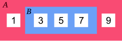

# Conjuntos { #sets }


(1)
{ .annotate }

1. :fontawesome-regular-copyright: [Duy Pham](https://unsplash.com/es/@miinyuii) :material-at: [Unsplash](https://unsplash.com) 

Un **conjunto** en Python es una estructura de datos que almacena valores **únicos** y **sin orden** establecido. Mantiene muchas similitudes con el [concepto matemático de conjunto](https://es.wikipedia.org/wiki/Conjunto).

## Creando conjuntos { #create }

Para crear un conjunto usamos llaves `{}` rodeando valores separados por comas.

Veamos algunos <span class="example">ejemplos:material-flash:</span> de conjuntos:

```pycon
>>> marks = {1, 2, 3, 4, 5, 6, 7, 8, 9, 10}#(1)!

>>> vowels = {'a', 'e', 'i', 'o', 'u'}#(2)!

>>> continents = {'Europa', 'América', 'Asia', 'África', 'Oceanía'}#(3)!
```
{ .annotate }

1. Un conjunto con las posibles notas de una prueba.
2. Un conjunto con las vocales (en español).
3. Un conjunto con los continentes.

La excepción la tenemos a la hora de crear un **conjunto vacío**, ya que, siguiendo la lógica de apartados anteriores, deberíamos hacerlo a través de llaves:

```pycon
# DON'T DO THIS!
>>> wrong_empty_set = {}#(1)!

>>> type(wrong_empty_set)
dict
```
{ .annotate }

1. Si hacemos esto, estaremos creando un **diccionario vacío**.

La única opción para crear un _conjunto vacío_ es utilizar la función `#!python set()`:

```pycon
>>> empty_set = set()

>>> type(empty_set)
set
```

!!! exercise "Ejercicio"

    Entra en el intérprete interactivo de Python <span class="green">❯❯❯</span> y crea un conjunto con tus tres colores favoritos.

## Conversión { #cast }

Para convertir otros tipos de datos en un conjunto podemos usar la función `#!python set()`.

Veamos varios <span class="example">ejemplos:material-flash:</span> donde creamos un conjunto a partir de...

=== "... una cadena de texto"

    ```pycon
    >>> set('aplatanada')
    {'a', 'd', 'l', 'n', 'p', 't'}
    ```

=== "... una lista"

    ```pycon
    >>> set([1, 2, 2, 3, 3, 3, 4, 4, 4, 4, 5, 5, 5, 5, 5])
    {1, 2, 3, 4, 5}
    ```

=== "... una tupla"

    ```pycon
    >>> set(('ADENINA', 'TIMINA', 'TIMINA', 'GUANINA', 'ADENINA', 'CITOSINA'))
    {'ADENINA', 'CITOSINA', 'GUANINA', 'TIMINA'}
    ```    

=== "... un diccionario"

    ```pycon
    >>> set({'manzana': 'rojo', 'plátano': 'amarillo', 'kiwi': 'verde'})
    {'kiwi', 'manzana', 'plátano'}
    ```

!!! info "Valores únicos"

    Como se puede ver en los ejemplos anteriores, `#!python set()` es utilizado habitualmente como mecanismo para **extraer los valores únicos** de otras estructuras de datos.

!!! warning "Orden"

    Python [almacena los conjuntos](https://www.reddit.com/r/learnpython/comments/1b0aama/comment/ks7bjvm/?utm_source=share&utm_medium=web3x&utm_name=web3xcss&utm_term=1&utm_content=share_button) ordenados según [el valor «hash»](dicts.md#hashables) de sus elementos. Pero esto es únicamente un «detalle de implementación» en el que no se puede confiar.[^1]

## Operaciones con conjuntos { #operations }

Existen multitud de operaciones que se pueden realizar sobre conjuntos. A continuación veremos la mayoría de ellas:

### Obtener un elemento { #get-item }

Como ya se ha indicado previamente los conjuntos no tienen un orden establecido, es por ello que **no podemos acceder a un elemento en concreto**.

Como consecuencia de lo anterior, **tampoco podemos modificar un elemento existente**, ya que ni siquiera tenemos acceso al mismo. Python sí nos permite añadir o borrar elementos de un conjunto.

### Añadir un elemento { #add }

Para añadir un elemento a un conjunto debemos utilizar la función `#!python add()`. Al no importar el orden dentro del conjunto, la inserción no establece a priori la posición donde se realizará.

A modo de <span class="example">ejemplo:material-flash:</span> vamos a partir de un conjunto que representa a los **cuatro integrantes originales** del la banda pop británica más famosa de todos los tiempos: [The Beatles](https://es.wikipedia.org/wiki/The_Beatles).

```pycon
>>> beatles = set(['Lennon', 'McCartney', 'Harrison', 'Starr'])#(1)!
```
{ .annotate }

1. John Lennon, Paul McCartney, George Harrison y Ringo Starr

Ahora vamos a añadir a [Pete Best](https://es.wikipedia.org/wiki/Pete_Best) a la banda...

```pycon
>>> beatles.add('Best')

>>> beatles
{'Best', 'Harrison', 'Lennon', 'McCartney', 'Starr'}
```

!!! warning "Recordatorio"

    No confundir la función [`append()`](lists.md#append) de las listas con la función `#!python add()` de los conjuntos. Ambas sirve para añadir elementos pero en estructuras de diferente naturaleza.

El siguiente fragmento de código nos demuestra claramente que, aunque lo intentemos por **fuerza bruta** :sweat_smile: nunca vamos a poder añadir _elementos repetidos_ en un conjunto:

```pycon
>>> items = set()#(1)!

>>> for _ in range(1_000_000):#(2)!
...     items.add('z')
...

>>> items#(3)!
{'z'}
```
{ .annotate }

1. Creamos un conjunto vacío.
2. Tratamos de añadir el emento `#!python 'z'` un millón de veces.
3. Sólo obtendremos una `#!python 'z'`.

!!! exercise "Ejercicio"

    [pypas](https://pypas.es) &nbsp;:fontawesome-solid-hand-holding-heart:{ .slide } `tuple-set`

### Borrar elementos { #remove }

Para borrar un elemento de un conjunto podemos utilizar la función `#!python remove()`. Siguiendo con el <span class="example">ejemplo:material-flash:</span> anterior, vamos a borrar el último «beatle» añadido:

```pycon
>>> beatles
{'Best', 'Harrison', 'Lennon', 'McCartney', 'Starr'}

>>> beatles.remove('Best')

>>> beatles
{'Harrison', 'Lennon', 'McCartney', 'Starr'}
```

Si tratamos de **borrar un elemento que no existe** obrendremos un `#!python KeyError` (al igual que ocurría en los [diccionarios](dicts.md#get-item)):

```pycon hl_lines="5"
>>> beatles.remove('Sinatra')
Traceback (most recent call last):
  Cell In[1], line 1
    beatles.remove('Sinatra')
KeyError: 'Sinatra'
```

!!! tip "Borrado sin errores"

    Existe una función que permite borrar elementos de un conjunto sin quejarse cuando no existan:

    ```python
    >>> beatles.discard('Sinatra')
    ```

### Longitud de un conjunto { #length }

Podemos conocer el número de elementos ([cardinalidad](https://es.wikipedia.org/wiki/Cardinalidad)) que tiene un conjunto mediante la función `#!python len()`.

De vueltas con el <span class="example">ejemplo:material-flash:</span> de «The Beatles», tendríamos:

```pycon
>>> beatles
{'Harrison', 'Lennon', 'McCartney', 'Starr'}

>>> len(beatles)
4
```

!!! exercise "Ejercicio"

    [pypas](https://pypas.es) &nbsp;:fontawesome-solid-hand-holding-heart:{ .slide } `diverse-word`

### Iterar sobre un conjunto { #iterate }    

Tal y como se ha visto para otros tipos de datos _iterables_, la forma de recorrer los elementos de un conjunto es utilizar la sentencia `#!python for`.

Para el <span class="example">ejemplo:material-flash:</span> anterior sería muy sencillo:

```pycon
>>> for beatle in beatles:
...     print(beatle)
...
Harrison
McCartney
Starr
Lennon
```

### Pertenencia de un elemento { #in }

Al igual que con otros tipos de datos, Python nos ofrece el operador `#!python in` para determinar si un elemento pertenece a un conjunto.

Veamos cómo aplicarlo en el <span class="example">ejemplo:material-flash:</span> de «The Beatles»:

```pycon
>>> beatles
{'Harrison', 'Lennon', 'McCartney', 'Starr'}

>>> 'Lennon' in beatles
True

>>> 'Fari' in beatles
False

>>> 'Fari' not in beatles
True
```

!!! exercise "Ejercicio"

    [pypas](https://pypas.es) &nbsp;:fontawesome-solid-hand-holding-heart:{ .slide } `half-out`

### Ordenar un conjunto { #sort }

Ya hemos comentado que los conjuntos **no mantienen un orden**. ¿Pero qué ocurre si intentamos ordenarlo?

Veamos el comportamiento a través del <span class="example">ejemplo:material-flash:</span> anterior:

```pycon
>>> beatles
{'McCartney', 'Starr', 'Lennon', 'Harrison'}

>>> sorted(beatles)#(1)!
['Harrison', 'Lennon', 'McCartney', 'Starr']
```
{ .annotate }

1. Lo que obtenemos es **una lista** con los elementos ordenados.

Obviamente, el uso de `#!python .sort()` no está permitido sobre un conjunto:

```pycon hl_lines="5"
>>> beatles.sort()
Traceback (most recent call last):
  Cell In[1], line 1
    beatles.sort()
AttributeError: 'set' object has no attribute 'sort'
```

## Teoría de conjuntos { #set-theory }

A continuación veremos las distintas operaciones sobre conjuntos que se pueden hacer en Python basadas en los [Diagramas de Venn](https://es.wikipedia.org/wiki/Diagrama_de_Venn) y la [Teoría de conjuntos](https://es.wikipedia.org/wiki/Teor%C3%ADa_de_conjuntos):

### Aritmética { #arithmetic }

Partimos de dos conjuntos $A = \{1, 2\}$ y $B = \{2, 3\}$:

```pycon
>>> A = {1, 2}
>>> B = {2, 3}
```

Se definen las siguientes operaciones «aritméticas» entre conjuntos:


<div class="grid cards" markdown>

-   **Intersección** :material-set-center: $A \cap B$

    ---

    Elementos comunes de $A$ y $B$.

    
    

    ```pycon
    >>> A & B#(1)!
    {2}
    ```
    { .annotate }
    
    1. Equivalente: `#!python A.intersection(B)`

-   **Unión** :material-set-all: $A \cup B$

    ---

    Elementos que están en $A$, en $B$ o ambos.

    
    

    ```pycon
    >>> A | B#(1)!
    {1, 2, 3}
    ```
    { .annotate }
    
    1. Equivalente: `#!python A.union(B)`

-   **Diferencia** :material-set-left: $A \setminus B$

    ---

    Elementos de $A$ que no están en $B$.

    
    

    ```pycon
    >>> A - B#(1)!
    {1}
    ```
    { .annotate }
    
    1. Equivalente: `#!python A.difference(B)`

-   **Diferencia simétrica** :material-set-left-right: $A \triangle B$

    ---

    Elementos no comunes de $A$ y $B$.

    
    

    ```pycon
    >>> A ^ B#(1)!
    {1, 3}
    ```
    { .annotate }
    
    1. Equivalente: `#!python A.symmetric_difference(B)`

</div>

Todos las operaciones anteriores admiten una versión funcional:

| Operación | Equivalente | Actualizando $A$ |
| --- | --- | --- |
| $A \cap B$ | `#!python A.intersection(B)` | `#!python A.intersection_update(B)` |
| $A \cup B$ | `#!python A.union(B)` | `#!python A.update(B)` |
| $A \setminus B$ | `#!python A.difference(B)` | `#!python A.difference_update(B)` |
| $A \triangle B$ | `#!python A.symmetric_difference(B)` | `#!python A.symmetric_difference_update(B)` |

### Inclusión { #inclusion }

Partimos de dos conjuntos $A = \{1, 2\}$ y $B = \{2, 3\}$:

```pycon
>>> A = {1, 3, 5, 7, 9}
>>> B = {3, 5, 7}
```

Las operaciones de inclusión tratan de descubrir si un conjunto «abarca» a otro (o viceversa).

<div class="grid cards" markdown>

-   **Subconjunto** $B \subset A$

    ---

    Todos los elementos de $B$ están en $A$.

    

    «$B$ es un subconjunto de $A$»

    ```pycon
    >>> B < A#(1)!
    True
    ```
    { .annotate }
    
    1. También existe `#!python B <= A`

-   **Superconjunto** $A \supset B$

    ---

    Los elementos de $A$ contienen a los de $B$.

    

    «$A$ es un superconjunto de $B$»

    ```pycon
    >>> A > B#(1)!
    True
    ```
    { .annotate }
    
    1. También existe `#!python A >= B`

</div>

## Conjuntos por comprensión { #comprehension }

Los conjuntos, al igual que las [listas](lists.md#comprehension) y los [diccionarios](dicts.md#comprehension), también se pueden crear por **comprensión**.

Veamos un <span class="example">ejemplo:material-flash:</span> en el que construimos un _conjunto por comprensión_ con aquellos números enteros múltiplos de 3 en el rango $[0,20)$:

```pycon
>>> m3 = {number for number in range(0, 20) if number % 3 == 0}

>>> m3
{0, 3, 6, 9, 12, 15, 18}
```

!!! exercise "Ejercicio"

    [pypas](https://pypas.es) &nbsp;:fontawesome-solid-hand-holding-heart:{ .slide } `common-consonants`

## Conjuntos inmutables { #frozensets }

Python ofrece la posibilidad de crear **conjuntos inmutables** haciendo uso de la función `#!python frozenset()` que recibe cualquier iterable como argumento.

Supongamos por <span class="example">ejemplo:material-flash:</span> que recibimos una serie de calificaciones de exámenes y queremos crear un conjunto inmutable con los posibles niveles (categorías) de calificaciones:

```pycon hl_lines="6"
>>> marks = [1, 3, 2, 3, 1, 4, 2, 4, 5, 2, 5, 5, 3, 1, 4]

>>> mark_levels = frozenset(marks)

>>> mark_levels
frozenset({1, 2, 3, 4, 5})
```

Veamos qué ocurre si intentamos modificar este conjunto:

```pycon hl_lines="5"
>>> mark_levels.add(100)#(1)!
Traceback (most recent call last):
  Cell In[1], line 1
    mark_levels.add(100)
AttributeError: 'frozenset' object has no attribute 'add'
```
{ .annotate }

1. Al ser inmutable no permite su modificación.

!!! tip "Correspondencia"

    Un `frozenset` es a un `set` lo que una `tuple` es a una `list`: una forma de «congelar» los valores para que no se puedan modificar.

## Objetos «hashables» { #hashables }

La única restricción que deben cumplir los elementos de un conjunto es ser [hashables](dicts.md#hashables). Un objeto es «hashable» si se le puede asignar un valor «hash» que no cambia en ejecución durante toda su vida.

Supongamos un <span class="example">ejemplo:material-flash:</span> en el que estamos construyendo un conjunto con los [elementos químicos](https://es.wikipedia.org/wiki/Elemento_qu%C3%ADmico) de la tabla periódica.

Si intentamos añadir una [lista](./lists.md) como clave de un diccionario obtendremos el siguiente error:

```pycon hl_lines="8"
>>> periodic_table = set()
>>> metals = ['Fe', 'Mg', 'Au', 'Au', 'Zn']

>>> periodic_table.add(metals)#(1)!
Traceback (most recent call last):
  Cell In[3], line 1
    periodic_table.add(metals)
TypeError: unhashable type: 'list'
```
{ .annotate }

1. Una lista no es un objeto «hashable» derivado de su condición de mutabilidad.

Sin embargo, podríamos conseguir lo que buscamos si, en vez de listas, usáramos **tuplas** para almacenar los elementos químicos (ya que sí son «hashables»):

```pycon
>>> periodic_table = set()

>>> metals = ('Fe', 'Mg', 'Au', 'Au', 'Zn')
>>> periodic_table.add(metals)

>>> non_metals = ('C', 'H', 'O', 'F', 'Cl')
>>> periodic_table.add(non_metals)

>>> periodic_table
{('Fe', 'Mg', 'Au', 'Au', 'Zn'), ('C', 'H', 'O', 'F', 'Cl')}
```

!!! exercise "Ejercicio"

    [pypas](https://pypas.es) &nbsp;:fontawesome-solid-hand-holding-heart:{ .slide } `is-binary`


[^1]: La ordenación de los elementos de un conjunto no está definida en el estándar de Python. Otra cuestión es que exista una ordenación por su «hash» para la implementación concreta de CPython.
