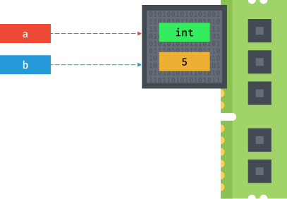

# Datos { #data }


(1)
{ .annotate }

1. :fontawesome-regular-copyright: [Alexander Sinn](https://unsplash.com/es/@swimstaralex) (Unsplash)

Los programas están formados por **código** y **datos**[^1]. Pero a nivel interno de la memoria del ordenador (RAM) no son más que una secuencia de bits. La interpretación de estos bits depende del lenguaje de programación, que almacena en la memoria no sólo el puro dato sino distintos metadatos[^2].

!!! quote "Rich Hickey"

    «Programming is not about typing, it's about thinking»

Desde la perspectiva de un lenguaje de programación, cada «trozo» de memoria contiene realmente un objeto, de ahí que se diga que en Python **todo son objetos**. Y cada objeto contiene, al menos, los siguientes campos:

- [x] El **tipo** del dato almacenado.
- [x] Un **identificador** único (para distinguirlo de otros objetos).
- [x] El **valor** del objeto (consistente con su tipo).


## Tipos de datos { #datatypes }

A continuación se muestran los distintos [tipos de datos](https://docs.python.org/es/3/library/stdtypes.html) que podemos encontrar en Python, sin incluir aquellos que proveen paquetes externos:

| Nombre 🇪🇸 | Tipo :material-language-python: | Ejemplos :material-cube-unfolded: |
| --- | --- | --- |
| Booleano | [`bool`](numbers.md#booleans) | `#!python True`, `#!python False`
| Entero | [`int`](numbers.md#integers) | `#!python 21`, `#!python 34500`, `#!python 34_500`
| Flotante | [`float`](numbers.md#floats) | `#!python 3.14`, `#!python 0.00314e3`
| Complejo | `#!python complex` | `#!python 2j`, `#!python 3+5j`
| Cadena | [`str`](strings.md) | `#!python 'tfn'`, `#!python "tenerife"`
| Tupla | [`tuple`](../datastructures/tuples.md) | `#!python (1, 3, 5)`
| Lista | [`list`](../datastructures/lists.md) | `#!python ['Chrome', 'Firefox', 'Safari']`
| Conjunto | [`set`](../datastructures/sets.md) | `#!python {2, 4, 6}`
| Diccionario | [`dict`](../datastructures/dicts.md) | `#!python {'Spiderman': 'Marvel', 'Superman': 'DC'}`

## Variables { #variables }

Las variables son fundamentales ya que permiten definir **nombres** para los **valores** que tenemos en memoria y que vamos a usar en nuestro programa.

### Reglas para nombrar variables { #naming-rules }

En Python existen una serie de reglas para los nombres de variables:

<div class="annotate" markdown>
1. Sólo pueden contener los siguientes caracteres[^3]:
    - Letras mayúsculas.
    - Letras minúsculas.
    - Dígitos.
    - Guiones bajos `_`
2. Deben empezar con una letra o un guión bajo, nunca con un dígito.
3. No pueden ser una palabra reservada del lenguaje («keywords»)(1)
</div>

1. Podemos obtener un listado de las palabras reservadas del lenguaje de la siguiente forma:
```pycon
>>> help('keywords')

Here is a list of the Python keywords.  Enter any keyword to get more help.

False               class               from                or
None                continue            global              pass
True                def                 if                  raise
and                 del                 import              return
as                  elif                in                  try
assert              else                is                  while
async               except              lambda              with
await               finally             nonlocal            yield
break               for                 not
```

!!! info "In english, please! 🇬🇧"

    Por lo general se prefiere dar nombres en **inglés** a las variables que utilicemos, ya que así hacemos nuestro código más «internacional» y con la posibilidad de que otras personas puedan leerlo, entenderlo y –-llegado el caso-– modificarlo. Es sólo una recomendación, nada impide que se haga en castellano.

### Convenciones para nombres { #naming-standards }

Mientras se sigan las [reglas](#naming-rules) que hemos visto para nombrar variables no hay problema en la forma en la que se escriban, pero sí existe una convención para la **nomenclatura de las variables**. Se utiliza el llamado `snake_case`(1) en el que utilizamos **caracteres en minúsculas** (incluyendo dígitos si procede) junto con **guiones bajos** (cuando sean necesarios para su legibilidad).
{ .annotate }

1. Nomenclaturas «case»:

    - [ ] `kebab-case`
    - [ ] `camelCase`
    - [ ] `PascalCase`
    - [x] `snake_case`

Por ejemplo, para nombrar una variable que almacene el _número de canciones_ en nuestro ordenador, podríamos usar `num_songs`.

Esta convención, y muchas otras, están definidas en un documento denominado [PEP 8](https://peps.python.org/pep-0008/#naming-conventions). Se trata de una **guía de estilo** para escribir código Python. Los PEP son las propuestas que se hacen para la mejora del lenguaje.

#### Constantes { #constants }

Un caso especial y que vale la pena destacar son las **constantes**. Podríamos decir que es un tipo de variable pero que su valor no ~~cambia~~ debería cambiar a lo largo de nuestro programa.

Por ejemplo la velocidad de la luz. Sabemos que su valor es constante de 300.000 km/s. En el caso de las constantes utilizamos **mayúsculas** (incluyendo guiones bajos si es necesario) para nombrarlas. Para la velocidad de la luz nuestra constante se podría llamar: `LIGHT_SPEED`.

#### Elegir buenos nombres { #good-names }

Se suele decir que una persona programadora (con cierta experiencia), a lo que dedica más tiempo, es a buscar un buen nombre para sus variables. Quizás pueda resultar algo excesivo pero da una idea de lo importante que es esta tarea. Es fundamental que los nombres de variables sean **autoexplicativos**, pero siempre llegando a un compromiso entre ser concisos y claros.

Supongamos que queremos buscar un nombre de variable para almacenar el **número de elementos que se deben manejar en un pedido**. Se nos ocurren cuatro posibilidades:

- [ ] `n`
- [x] `num_items`
- [ ] `number_of_items`
- [ ] `number_of_items_to_be_handled`

No existe una regla mágica que nos diga cuál es el nombre perfecto, pero podemos aplicar el sentido común y, a través de la experiencia, ir detectando aquellos nombres que sean más adecuados. En el ejemplo anterior, quizás podríamos descartar de principio la opción 1 y la 4 (por ser demasiado cortas o demasiado largas); nos quedaríamos con las otras dos. Si nos fijamos bien, casi no hay mucha información adicional de la opción 3 con respecto a la 2. Así que podríamos concluir que **la opción 2 es válida para nuestras necesidades**. En cualquier caso esto dependerá siempre del contexto del problema que estemos tratando.

Como regla general:

- Usar **sustantivos** para los nombres de [variables](#variables) :material-arrow-right: `article`
- Usar **verbos** para los nombres de [funciones](../modularity/functions.md) :material-arrow-right: `get_article()`
- Usar **adjetivos** para los nombres de [booleanos](numbers.md#booleans) :material-arrow-right: `available`

## Asignación { #assignment }

En Python se utiliza el símbolo `=` para **asignar** un valor a una variable:


Hay que diferenciar la asignación en Python con la igualación en matemáticas. El símbolo `=` lo hemos aprendido desde siempre como una equivalencia entre dos expresiones algebraicas, sin embargo en Python nos indica una sentencia de asignación, del valor (en la derecha) al nombre (en la izquierda).

!!! example "Lados de una asignación"

    En una asignación de Python siempre encontramos dos «lados» el izquierdo y el derecho:

    ```pycon
    lado_izquierdo = lado_derecho
    ```

    - El lado izquierdo se denomina LHS.
    - El lado derecho se denomina RHS.

Algunos ejemplos de asignaciones a _variables_:

```pycon
>>> total_population = 157_503
>>> avg_temperature = 16.8
>>> city_name = 'San Cristóbal de La Laguna'
```

Algunos ejemplos de asignaciones a _constantes_:

```pycon
>>> SOUND_SPEED = 343.2
>>> WATER_DENSITY = 997
>>> EARTH_NAME = 'La Tierra'
```

En un escenario donde queramos asignar el mismo valor a tres variables distintas tendríamos que hacer lo siguiente:

```pycon
>>> tres = 3
>>> three = 3
>>> drei = 3
```

Para estos casos Python nos ofreces la posibilidad de realizar una **asignación múltiple** en una única línea:

```pycon
>>> tres = three = drei = 3
```

Recordemos que los nombres de variables deben seguir unas [reglas establecidas](#naming-rules), de lo contrario obtendremos un error sintáctico del intérprete de Python:

```pycon hl_lines="1 7 13"
>>> 7floor = 40  # el nombre empieza por un dígito
  Cell In[1], line 1
    7floor = 40
    ^
SyntaxError: invalid decimal literal

>>> for = 'Bucle'  # el nombre usa la palabra reservada "for"
  Cell In[2], line 1
    for = 'Bucle'
        ^
SyntaxError: invalid syntax

>>> screen-size = 14  # el nombre usa un carácter no válido
  Cell In[3], line 1
    screen-size = 14
    ^
SyntaxError: cannot assign to expression here. Maybe you meant '==' instead of '='?
```

### Asignar una variable a otra { #assign-variables }

Las asignaciones que hemos hecho hasta ahora han sido de un **valor literal** a una variable. Pero nada impide que podamos hacer asignaciones de una variable a otra variable:

```pycon
>>> people = 157503
>>> total_population = people
>>> total_population
157503
```

Eso sí, la variable que utilicemos como valor de asignación debe existir previamente, ya que si no es así, obtendremos un error informando de que no está definida:

```pycon
>>> total_population = lot_of_people
Traceback (most recent call last):
  Cell In[1], line 1
    total_population = lot_of_people
NameError: name 'lot_of_people' is not defined
```

De hecho, en el RHS de la asignación pueden aparecer **expresiones** más complejas que se verán más adelante.

### Conocer el valor de una variable { #get-value }

Hemos visto previamente cómo asignar un valor a una variable, pero aún no sabemos cómo «comprobar» el valor que tiene dicha variable. Para ello podemos utilizar dos estrategias en función de dónde nos encontremos:

=== "Intérprete Python ❯❯❯"

    Basta con que usemos el nombre de la variable (y ++enter++):

    ```pycon
    >>> final_stock = 38934
    >>> final_stock
    38934
    ```

=== "Editor de código :material-microsoft-visual-studio-code:"

    Debemos hacer uso de `print()`:

    ```python
    final_stock = 38934
    print(final_stock)
    # 38934
    ```    

### Conocer el tipo de una variable { #get-type }

Para poder descubrir el tipo de un literal o una variable, Python nos ofrece la función `type()`. Veamos algunos ejemplos de su uso:

```pycon
>>> type(9)
int

>>> type(1.2)
float

>>> height = 3718
>>> type(height)
int

>>> SOUND_SPEED = 343.2
>>> type(SOUND_SPEED)
float
```

!!! warning "Advertencia"

    Aunque está permitido, **NUNCA** llames `type` a una variable porque destruirías la función que nos permite conocer el tipo de un objeto.

!!! exercise "Ejercicio"

    Utilizando la consola interactiva de Python <span class="green">❯❯❯</span> realiza las siguientes tareas:

    1. Asigna un valor entero `#!python 2001` a la variable `#!python space_odyssey` y muestra su valor.
    2. Descubre el tipo del literal `#!python 'Good night & Good luck'`.
    3. Identifica el tipo del literal `#!python True`.
    4. Asigna la expresión `#!python 10 * 3.0` a la variable `result` y muestra su tipo.

## Mutabilidad { #mutability }

Las [variables](#variables) son **nombres**, no lugares. Detrás de esta frase se esconde la reflexión de que cuando asignamos un valor a una variable, lo que realmente está ocurriendo es que se hace **apuntar** el nombre de la variable a una zona de memoria en la que se representa el objeto (con su valor). Por ejemplo:

```pycon
>>> a = 5
```


Si ahora «copiamos» el valor de `a` en otra variable `b` se podría esperar que hubiera otro espacio en memoria para dicho valor, pero como ya hemos dicho, son referencias a memoria:

```pycon
>>> b = a
```



A continuación vamos a modificar el valor de la variable `a`. Lo que ocurre es que se busca una nueva zona de memoria para almacenar el valor y se hace que `a` apunte a dicho valor:

```pycon
>>> a = 7
```


Con la función `id()` podemos conocer la dirección de memoria[^4] de un objeto en Python. A través de ella podemos comprobar que los dos objetos que hemos creado «apuntan» a la misma zona de memoria:

```pycon
>>> a = 5
>>> b = a

>>> id(a)
4393605176
>>> id(b)
4393605176
```

La prueba de que la zona de memoria no la ocupa el «nombre» de la variable, es que podemos ver cómo se asigna una dirección de memoria únicamente al «valor» literal:

```pycon
>>> id(5)
4393605176
```

Cada vez que asignamos un nuevo valor a una variable, ésta apunta a una nueva zona de memoria:

```pycon
>>> id(a)
4393605176

>>> a = 7
>>> id(a)
4393605240
```

!!! info "Mutabilidad"

    Cuando la zona de memoria que ocupa el objeto se puede modificar hablamos de tipos de datos **mutables**. En otro caso hablamos de tipos de datos **inmutables**.

Un ejemplo de tipos de datos mutables son las **listas**. Esto se debe a que podemos modificar su contenido en la misma zona de memoria:

```pycon
>>> a = [4, 3, 2]
```


Vamos a hacer una «copia» de la variable:

```pycon
>>> b = a
```


Y ahora vamos a modificar la lista `a` añadiendo un valor al final. Dado que la modificación se produce en la **misma zona de memoria** la variable `b` también se ve afectada por este cambio:

```pycon
>>> a.append(1)
```


Por tanto, podemos clasificar los **tipos de datos** en Python según su **naturaleza de cambio**:

=== "Tipos inmutables :classical_building:"

    - `#!python bool`
    - `#!python int`
    - `#!python float`
    - `#!python str`
    - `#!python tuple`

=== "Tipos mutables :fontawesome-solid-droplet:"

    - `#!python list`
    - `#!python dict`
    - `#!python set`

!!! success "Cambio de valor"

    El hecho de que un tipo de datos sea inmutable significa que no podemos modificar su valor «in-situ», pero siempre podremos asignarle un nuevo valor (hacerlo apuntar a otra zona de memoria).

## Funciones «built-in» { #built-in-functions }

Hemos ido usando una serie de [funciones](../modularity/functions.md) sin ser especialmente conscientes de ello. Esto se debe a que son funciones «built-in» o incorporadas por defecto en el propio lenguaje Python.

A continuación se muestra el listado de **funciones «built-in»** por orden alfabético:

=== "A"

    ```
    abs()
    aiter()
    all()
    anext()
    any()
    ascii()
    ```

=== "B"

    ```
    bin()
    bool()
    breakpoint()
    bytearray()
    bytes()
    ```

=== "C"

    ```
    callable()
    chr()
    classmethod()
    compile()
    complex()
    ```

=== "D"

    ```
    delattr()
    dict()
    dir()
    divmod()
    ```

=== "E"

    ```
    enumerate()
    eval()
    exec()
    ```

=== "F"

    ```
    filter()
    float()
    format()
    frozenset()
    ```

=== "G"

    ```
    getattr()
    globals()
    ```

=== "H"

    ```
    hasattr()
    hash()
    help()
    hex()
    ```

=== "I"

    ```
    id()
    input()
    int()
    isinstance()
    issubclass()
    iter()
    ```

=== "L"

    ```
    len()
    list()
    locals()
    ```

=== "M"

    ```
    map()
    max()
    memoryview()
    min()    
    ```

=== "N"

    ```
    next()
    ```

=== "O"

    ```
    object()
    oct()
    open()
    ord()
    ```

=== "P"

    ```
    pow()
    print()
    property()
    ```

=== "R"

    ```
    range()
    repr()
    reversed()
    round()
    ```

=== "S"

    ```
    set()
    setattr()
    slice()
    sorted()
    staticmethod()
    str()
    sum()
    super()
    ```

=== "T"

    ```
    tuple()
    type()
    ```

=== "V"

    ```
    vars()
    ```

=== "Z"

    ```
    zip()
    ```

=== "_"

    ```
    __import__()
    ```

Los detalles de cada función se pueden consultar en la [documentación oficial de Python](https://docs.python.org/3/library/functions.html#built-in-functions).


## Pidiendo ayuda { #help }

En Python, como en muchas otras situaciones de la vida, podemos pedir ayuda con la función `help()`.

Supongamos que queremos obtener información sobre id. Desde el intérprete de Python <span class="green">❯❯❯</span> ejecutamos lo siguiente:

```pycon
>>> help(id)
Help on built-in function id in module builtins:

id(obj, /)
    Return the identity of an object.

    This is guaranteed to be unique among simultaneously existing objects.
    (CPython uses the object's memory address.)
```

Existe una _forma alternativa_ de obtener ayuda: añadiendo el signo de interrogación `?` al término de búsqueda:

```pycon
>>> id?
Signature: id(obj, /)
Docstring:
Return the identity of an object.

This is guaranteed to be unique among simultaneously existing objects.
(CPython uses the object's memory address.)
Type:      builtin_function_or_method
```


[^1]: Ya en 1946, John Von Neuman [propuso](../introduction/history.md#computing-milestones) guardar en memoria no sólo los datos sino también el código.
[^2]: Los metadatos son datos que describen otros datos.
[^3]: Para ser exactos, sí se pueden utilizar otros caracteres, e incluso emojis en los nombres de variables, aunque no suele ser una práctica extendida, ya que podría dificultar la legibilidad.
[^4]: Esto es un detalle de implementación de CPython.
