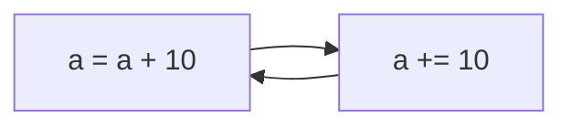

# Números { #numbers }


(1)
{ .annotate }

1. :fontawesome-regular-copyright: [Brett Jordan](https://unsplash.com/es/@brett_jordan) (Unsplash)

En esta sección veremos los tipos de datos númericos que ofrece Python centrándonos en **booleanos**, **enteros** y **flotantes**.

## Booleanos { #booleans }

[George Boole](https://es.wikipedia.org/wiki/George_Boole) es considerado como uno de los fundadores del campo de las ciencias de la computación y fue el creador del [Álgebra de Boole](https://es.wikipedia.org/wiki/%C3%81lgebra_de_Boole) que da lugar, entre otras estructuras algebraicas, a la [Lógica binaria](https://es.wikipedia.org/wiki/L%C3%B3gica_binaria). En esta lógica las variables sólo pueden tomar dos valores discretos: **Verdadero :octicons-shield-check-16:{ .green }** o **Falso :octicons-shield-x-16:{ .red }**.

El tipo de datos `bool` en _Python_ proviene de lo explicado anteriormente y admite dos posibles valores:

- `#!python True` que se corresponde con **verdadero**.
- `#!python False` que se corresponde con **falso**.

Veamos un <span class="example">ejemplo:material-flash:</span> de su uso:

```pycon
>>> is_opened = True
>>> is_opened
True

>>> has_sugar = False
>>> has_sugar
False
```

La primera variable `is_opened` está representando el hecho de que algo esté abierto, y al tomar el valor `True` podemos concluir que sí. La segunda variable `has_sugar` nos indica si una bebida tiene azúcar; dado que toma el valor `False` inferimos que no lleva azúcar.

!!! failure "Atención"

    Tal y como se explicó en [este apartado](data.md#naming-rules), los nombres de variables son «case-sensitive». De igual modo el tipo booleano toma valores `True` y `False` con **la primera letra en mayúsculas**. De no ser así obtendríamos un error sintáctico.

```pycon hl_lines="1 7"
>>> is_opened = true
Traceback (most recent call last):
  Cell In[1], line 1
    is_opened = true
NameError: name 'true' is not defined

>>> has_sugar = false
Traceback (most recent call last):
  Cell In[2], line 1
    has_sugar = false
NameError: name 'false' is not defined
```

## Enteros { #integers }

Los números enteros no tienen decimales pero sí pueden contener signo y estar expresados en alguna base distinta de la habitual (base 10).

### Literales enteros { #integer-literals }

Veamos algunos ejemplos de números enteros:

```pycon
>>> 8
8
>>> +8
8
>>> -8
-8
>>> 08
  Cell In[4], line 1
    08
    ^
SyntaxError: leading zeros in decimal integer literals are not permitted; use an 0o prefix for octal integers

>>> 8000000
8000000
>>> 8_000_000
8000000
```

Dos detalles a tener en cuenta:

- No podemos comenzar un número entero por `0`.
- Python permite dividir los números enteros con _guiones bajos_ `_` para clarificar su lectura/escritura. A efectos prácticos es como si estos guiones bajos no existieran.

### Operaciones con enteros { #integer-operations }

A continuación se muestra una tabla con las distintas operaciones sobre enteros que podemos realizar en Python:

| Operador |     Descripción     |      Ejemplo      | Resultado |
| -------- | ------------------- | ----------------- | --------- |
| `+`      | Suma                | `#!python 3 + 9`  | 12        |
| `-`      | Resta               | `#!python 6 - 2`  | 4         |
| `*`      | Multiplicación      | `#!python 5 * 5`  | 25        |
| `/`      | División _flotante_ | `#!python 9 / 2`  | 4.5       |
| `//`     | División _entera_   | `#!python 9 // 2` | 4         |
| `%`      | Módulo              | `#!python 9 % 4`  | 1         |
| `**`     | Exponenciación      | `#!python 2 ** 4` | 16        |

Veamos algunas pruebas con estos operadores:

```pycon
>>> 2 + 8 + 4
14
>>> 4 ** 4
256
>>> 7 / 3
2.3333333333333335
>>> 7 // 3
2
>>> 6 / 0
Traceback (most recent call last):
  Cell In[5], line 1
    6 / 0
ZeroDivisionError: division by zero
```

Es de buen estilo de programación **dejar un espacio** entre cada operador. Además hay que tener en cuenta que podemos obtener errores dependiendo de la operación (más bien de los operandos) que estemos utilizando, como es el caso de la _división por cero_.

#### Prioridad { #priority }

Cada operador tiene una **prioridad** que hace que se ejecute antes (o después) de otro operador:

| Prioridad | Operador |
| --- | --- |
| :material-size-xxl: | `()` |
| :material-size-xl: | `**` |
| :material-size-l: | `-a` `+a` |
| :material-size-m: | `*` `/` `//` `%` |
| :material-size-s: | `+` `-` |

Veamos algunas expresiones donde se aplica esta prioridad de operadores:

```pycon
>>> 2 ** 2 + 4 / 2
6.0

>>> 2 ** (2 + 4) / 2
32.0

>>> 2 ** (2 + 4 / 2)
16.0
```

!!! exercise "Ejercicio"

    [pypas](https://pypas.es) &nbsp;:fontawesome-solid-hand-holding-heart:{ .slide } `add`

#### Asignación aumentada { #augmented-assignment }

Python nos ofrece la posibilidad de escribir una [asignación aumentada](https://www.python.org/dev/peps/pep-0577/) mezclando la _asignación_ y un _operador_.



Supongamos que disponemos de 100 vehículos en stock y que durante el pasado mes se han vendido 20 de ellos. Veamos cómo sería el código con asignación tradicional vs. asignación aumentada:

=== "Asignación tradicional :material-meditation:"

    ```python hl_lines="3"
    >>> total_cars = 100
    >>> sold_cars = 20
    >>> total_cars = total_cars - sold_cars
    >>> total_cars
    80
    ```

=== "Asignación aumentada :material-elevation-rise:"

    ```python hl_lines="3"
    >>> total_cars = 100
    >>> sold_cars = 20
    >>> total_cars -= sold_cars
    >>> total_cars
    80
    ```

Estas dos formas son equivalentes a nivel de resultados y funcionalidad, pero obviamente tienen diferencias de escritura y legibilidad. De este mismo modo, podemos aplicar un formato compacto al resto de operaciones:

```pycon
>>> random_number = 15

>>> random_number += 5
>>> random_number
20

>>> random_number *= 3
>>> random_number
60

>>> random_number //= 4
>>> random_number
15

>>> random_number **= 1
>>> random_number
15
```

#### Módulo { #modulo }

La operación **módulo** (también llamado **resto**), cuyo símbolo en Python es `%` se define como el **resto de dividir dos números**. Veamos un <span class="example">ejemplo:material-flash:</span> para enteder bien su funcionamiento:


```pycon
>>> dividendo = 17
>>> divisor = 5

>>> cociente = dividendo // divisor  # división entera
>>> resto = dividendo % divisor

>>> cociente
3
>>> resto
2
```

Si miramos el módulo en **forma espiral** se entiende mejor lo que ocurre. Podemos distinguir tres casos:

=== "a) Dividendo :material-code-less-than: divisor"

    ```pycon
    >>> 6 % 8
    6
    ```

    
    

=== "b) Dividendo :material-equal-box: divisor"

    ```pycon
    >>> 8 % 8
    0
    ```

    
    

=== "c) Dividendo :material-code-greater-than: divisor"

    ```pycon
    >>> 11 % 8
    3
    ```

    
    

##### Desplazamiento circular { #circular-shift }

Una de las aplicaciones más habituales del operador módulo `%` es el **desplazamiento circular**.

=== "Desplazamiento con paso 1"

    Veamos un <span class="example">ejemplo:material-flash:</span> en el que disponemos de **4 «casillas»** y la «ficha» avanza **de uno en uno**. Después de la última casilla debemos volver a la casilla de salida:

    
    

    Veamos la implementación en Python:

    ```pycon
    >>> a = 0
    >>> a
    0  🟪
    >>> a = (a + 1) % 4  # 1 % 4
    >>> a
    1  🟦
    >>> a = (a + 1) % 4  # 2 % 4
    >>> a
    2  🟩
    >>> a = (a + 1) % 4  # 3 % 4
    >>> a
    3  🟪
    >>> a = (a + 1) % 4  # 4 % 4
    >>> a
    0  🟦
    >>> a = (a + 1) % 4  # 1 % 4
    >>> a
    1  🟩
    >>> a = (a + 1) % 4  # 2 % 4
    >>> a
    2  🟪
    >>> a = (a + 1) % 4  # 3 % 4
    >>> a
    3  🟦
    >>> a = (a + 1) % 4  # 4 % 4
    >>> a
    0  🟩
    >>> a = (a + 1) % 4  # 1 % 4
    >>> a
    1  🟪
    ```

=== "Desplazamiento con paso 3"

    Supongamos ahora que, en vez de ir de uno en uno, movemos la «ficha» **de tres en tres**:

    
    

    Veamos la implementación en Python:

    ```pycon
    >>> a = 0
    >>> a
    0  🟪
    >>> a = (a + 3) % 4  # 3 % 4
    >>> a
    3  🟦
    >>> a = (a + 3) % 4  # 6 % 4
    >>> a
    2  🟩
    >>> a = (a + 3) % 4  # 5 % 4
    >>> a
    1  🟪
    ```
    
!!! tip "Módulo jaula"

    Haciendo el módulo estamos «encerrando» el valor dentro de unos límites: `[0, dividendo]`.

#### Exponenciación { #power }

Para elevar un número a otro en Python utilizamos el operador de exponenciación `**`:

```pycon
>>> 4 ** 3#(1)!
64
```
{ .annotate }

1. `#!python 4 * 4 * 4 = 64`

Se debe tener en cuenta que también podemos **elevar un número entero a un número decimal**. En este caso es como si estuviéramos haciendo una raíz[^1]. Por ejemplo:

$4^{1/2} = 4^{0.5} = \sqrt{4} = 2$

Hecho en Python:

```pycon
>>> 4 ** 0.5
2.0
```

#### Valor absoluto { #absolute-value }

Python ofrece la función `#!python abs()` para obtener el **valor absoluto** $|n|$ de un número $n$.

Veamos algunos <span class="example">ejemplos:material-flash:</span>:

```pycon
>>> abs(-1)
1

>>> abs(1)
1

>>> abs(-3.14)
3.14

>>> abs(3.14)
3.14
```

!!! exercise "Ejercicio"

    [pypas](https://pypas.es) &nbsp;:fontawesome-solid-hand-holding-heart:{ .slide } `quadratic`

### Límite de un entero { #int-limit }

¿Cómo de grande puede ser un `int` en Python? La respuesta es: **el tamaño que quieras**[^2].

Por poner un <span class="example">ejemplo:material-flash:</span> supongamos que queremos representar un [centillón](https://es.wikipedia.org/wiki/Centill%C3%B3n). Este valor viene a ser un «1» seguido de ¡600 ceros! ¿Será capaz Python de almacenarlo?

```pycon
>>> centillion = 10 ** 600

>>> centillion
1000000000000000000000000000000000000000000000000000000000000000000000000000000000000000000000000000000000000000000000000000000000000000000000000000000000000000000000000000000000000000000000000000000000000000000000000000000000000000000000000000000000000000000000000000000000000000000000000000000000000000000000000000000000000000000000000000000000000000000000000000000000000000000000000000000000000000000000000000000000000000000000000000000000000000000000000000000000000000000000000000000000000000000000000000000000000000000000000000000000000000000000000000000000000000000000000000000000000000000000000
```

!!! bug "Integer Overflow"

    En otros muchos lenguajes tratar con enteros tan largos causaría un «integer overflow». No es el caso de Python que puede manejar estos valores sin problema.

¿Qué pasaría si quisiéramos «romper» todas las barreras? Pongamos 10.000 dígitos...

```pycon
>>> 10 ** 10_000
ValueError: Exceeds the limit (4300 digits) for integer string conversion; use sys.set_int_max_str_digits() to increase the limit
```

Obtenemos un error... pero subsanable, ya que hay forma de ampliar este **límite inicial de 4300 dígitos** usando la función [`sys.set_int_max_str_digits()`](https://docs.python.org/3/library/stdtypes.html#int-max-str-digits) :fontawesome-solid-wand-magic-sparkles:

## Flotantes { #floats }

Los números en punto flotante[^3] tienen parte decimal. Veamos algunos ejemplos de flotantes en Python.

Veamos todas las formas que hay en Python para representar el número flotante `4.0`:

```pycon
>>> 4.0
4.0
>>> 4.
4.0
>>> 04.0#(1)!
4.0
>>> 04.
4.0
>>> 4.000_000
4.0
>>> 0.4e1#(2)!
4.0
```
{ .annotate }

1. A diferencia de los [números enteros](#integers), los valores flotantes ^^sí pueden^^ empezar por 0.
2. `#!python 0.4e1 = 0.4 * (10 ** 1)`

### Conversión de tipos { #typecast }

El hecho de que existan distintos tipos de datos en Python (y en el resto de lenguajes de programación) es una ventaja a la hora de representar la información del mundo real de la mejor manera posible. Pero también se hace necesario buscar mecanismos para convertir unos tipos de datos en otros.

#### Conversión implícita { #implicit-typecast }

Cuando mezclamos enteros, booleanos y flotantes, Python realiza automáticamente una conversión implícita (o promoción) de los valores al tipo de «mayor rango». Veamos algunos ejemplos de esto:

```pycon
>>> True + 25
26
>>> 7 * False
0
>>> True + False
1
>>> 21.8 + True
22.8
>>> 10 + 11.3
21.3
```

!!! tip "Booleanos como números"

    De los ejemplos anteriores se deduce claramente que los valores booleanos asumen un valor numérico concreto cuando así se requiere:

    - `#!python True` :octicons-shield-check-16:{ .green } → `1`
    - `#!python False` :octicons-shield-x-16:{ .red } → `0`

Podemos resumir la conversión implícita de la siguiente manera:

- `#!python bool` :material-bowl-mix-outline: `#!python int` → `#!python int`
- `#!python bool` :material-bowl-mix-outline: `#!python float` → `#!python float`
- `#!python int` :material-bowl-mix-outline: `#!python float` → `#!python float`

#### Conversión explícita { #explicit-typecast }

Aunque más adelante veremos el concepto de **función**, desde ahora podemos decir que existen una serie de funciones para realizar conversiones explícitas de un tipo a otro:

- `bool()` convierte al tipo [booleano](#booleans).
- `int()` convierte al tipo [entero](#integers).
- `float()` convierte al tipo [flotante](#floats).

Veamos algunos <span class="example">ejemplos:material-flash:</span> de estas funciones:

```pycon
>>> bool(1)
True
>>> bool(0)
False

>>> int(True)
1
>>> int(False)
0

>>> float(1)
1.0
>>> float(0)
0.0
>>> float(True)
1.0
>>> float(False)
0.0
```

En el caso de que usemos la función `#!python int()` sobre un valor flotante nos retornará su **parte baja**:

$int(x) = \lfloor x \rfloor$

Por <span class="example">ejemplo:material-flash:</span>:

```pycon
>>> int(3.1)
3
>>> int(3.5)
3
>>> int(3.9)
3
```

Para **obtener el tipo** de una variable [ya hemos visto](data.md#get-type) la función `#!python type()`:

```pycon
>>> is_raining = False
>>> type(is_raining)
bool

>>> sound_level = 35
>>> type(sound_level)
int

>>> temperature = 36.6
>>> type(temperature)
float
```

Pero también existe la posibilidad de **comprobar el tipo** que tiene una variable mediante la función `#!python isinstance()`:

```pycon
>>> isinstance(is_raining, bool)
True
>>> isinstance(sound_level, int)
True
>>> isinstance(temperature, float)
True
```

!!! exercise "Ejercicio"

    [pypas](https://pypas.es) &nbsp;:fontawesome-solid-hand-holding-heart:{ .slide } `sin-approx`

### Errores de aproximación { #approx-errors }

Todo hace pensar que el siguiente cálculo debería dar 1...

$$
\require{cancel}
\frac{19}{155} * \frac{155}{19} = 1
$$

Pero si lo pasamos a Python nos llevamos una sorpresa :fontawesome-regular-face-surprise:

```pycon
>>> (19 / 155) * (155 / 19)
0.9999999999999999
```

Efectivamente debería dar **1.0**. En este caso no es así ya que la representación interna de los valores en **coma flotante** sigue el estándar [IEEE 754](https://es.wikipedia.org/wiki/IEEE_754) y estamos trabajando con [aritmética finita](https://www.unioviedo.es/compnum/laboratorios_py/Aritmetica_finita/Aritmetica_finita_y_error.html#Representaci%C3%B3n-de-los-n%C3%BAmeros-reales).

Vamos a fijarnos en el valor de la fracción:

$$
\frac{19}{155} = 0.1225806451612903225806451612903225806451612903225806451612903225\ldots
$$

Estamos hablando de un [decimal periódico puro :simple-wolfram:](https://www.wolframalpha.com/input?i=19%2F155&lang=es) $0.\overline{1225806451612903}$. Pero cuando lo calculamos en Python obtenemos un número con «solo» **17 cifras decimales**:

```pycon
>>> 19 / 155
0.12258064516129032
```

Para el caso de la segunda fracción el planteanmiento es totalmente análogo:

$$
\frac{155}{19} = 8.1578947368421052631578947368421052631578947368421052631578947368\ldots
$$

Estamos hablando de otro [decimal periódico puro :simple-wolfram:](https://www.wolframalpha.com/input?i=155%2F19&lang=es) $8.\overline{157894736842105263}$. Pero cuando lo calculamos en Python obtenemos un número con «solo» **15 cifras decimales**:

```pycon
>>> 155 / 19
8.157894736842104
```

Por tanto es entendible que esta «pérdida» de información se refleje en los cálculos subsiguientes:

```pycon
>>> 0.12258064516129032 * 8.157894736842104
0.9999999999999999
```

Aunque existen distintas formas de solventar esta limitación, de momento veremos una de las más sencillas utilizando la función «built-in» `#!python round()` que nos permite redondear un número flotante a un número determinado de decimales:

```pycon
>>> result = (19 / 155) * (155 / 19)

>>> round(result, 1)
1.0
```

Veamos otros <span class="example">ejemplos:material-flash:</span> de `#!python round()` aplicados sobre $\pi$:

```pycon
>>> PI = 3.141_592_653_589

>>> round(PI)
3
>>> round(PI, 1)
3.1
>>> round(PI, 2)
3.14
>>> round(PI, 3)
3.142
>>> round(PI, 4)
3.1416
>>> round(PI, 5)
3.14159
```

!!! info "Redondear vs truncar"

    `#!python round()` aproxima (redondea) al valor más cercano, mientras que `#!python int()` obtiene el entero «por abajo» (trunca).

## Bases { #bases }

Los valores numéricos con los que estamos acostumbrados a trabajar están en **base 10** (o decimal). Esto indica que disponemos de 10 «símbolos» para representar cada cifra: en este caso del `0` al `9`.

Pero también es posible representar números en **otras bases**. Python nos ofrece una serie de **prefijos** y **funciones** para este cometido.

### Base binaria { #binary }

Cuenta con **2** símbolos para representar los valores: `0` y `1`.

=== "Prefijo: `#!python 0b`"

    Permite introducir un número binario directamente:

    ```pycon
    >>> 0b1001
    9
    >>> 0b1100
    12
    ```    

    :material-check-all:{ .blue } El valor queda almacenado como un **número entero**.    

=== "Función: `#!python bin()`"

    Permite convertir un número entero a su correspondiente valor binario:

    ```pycon
    >>> bin(9)
    '0b1001'
    >>> bin(12)
    '0b1100'
    ```

    !!! danger "Resultado"
    
        Esta función devuelve una [cadena de texto](strings.md).

### Base octal { #octal }

Cuenta con **8** símbolos para representar los valores: `0`, `1`, `2`, `3`, `4`, `5`, `6` y `7`.

=== "Prefijo: `#!python 0o`"

    Permite introducir un número octal directamente:

    ```pycon
    >>> 0o6243
    3235
    >>> 0o1257
    687
    ```    

    :material-check-all:{ .blue } El valor queda almacenado como un **número entero**.    

=== "Función: `#!python oct()`"

    Permite convertir un número entero a su correspondiente valor octal:

    ```pycon
    >>> oct(3235)
    '0o6243'
    >>> oct(687)
    '0o1257'
    ```

    !!! danger "Resultado"
    
        Esta función devuelve una [cadena de texto](strings.md).

### Base hexadecimal { #hex }

Cuenta con **16** símbolos para representar los valores: `0`, `1`, `2`, `3`, `4`, `5`, `6`, `7`, `8`, `9`, `A`, `B`, `C`, `D`, `E` y `F`.

=== "Prefijo: `#!python 0x`"

    Permite introducir un número hexadecimal directamente:

    ```pycon
    >>> 0x7F2A
    32554
    >>> 0x48FF
    18687
    ```    

    :material-check-all:{ .blue } El valor queda almacenado como un **número entero**.    

=== "Función: `#!python hex()`"

    Permite convertir un número entero a su correspondiente valor hexadecimal:

    ```pycon
    >>> hex(32554)
    '0x7f2a'
    >>> hex(18687)
    '0x48ff'
    ```

    !!! danger "Resultado"
    
        Esta función devuelve una [cadena de texto](strings.md).

    :material-check-all:{ .blue } Las letras en representación hexadecimal no atienden a mayúsculas y minúsculas. Es decir que `#!python 0x4af` :material-approximately-equal: `#!python 0x4AF`.

## Ejercicios { #exercises }

1. [pypas](https://pypas.es) &nbsp;:fontawesome-solid-hand-holding-heart:{ .slide } `circle-area`
2. [pypas](https://pypas.es) &nbsp;:fontawesome-solid-hand-holding-heart:{ .slide } `sphere-volume`
3. [pypas](https://pypas.es) &nbsp;:fontawesome-solid-hand-holding-heart:{ .slide } `triangle-area`
4. [pypas](https://pypas.es) &nbsp;:fontawesome-solid-hand-holding-heart:{ .slide } `interest-rate`
5. [pypas](https://pypas.es) &nbsp;:fontawesome-solid-hand-holding-heart:{ .slide } `euclid-distance`
6. [pypas](https://pypas.es) &nbsp;:fontawesome-solid-hand-holding-heart:{ .slide } `century-year`
7. [pypas](https://pypas.es) &nbsp;:fontawesome-solid-hand-holding-heart:{ .slide } `red-square`
7. [pypas](https://pypas.es) &nbsp;:fontawesome-solid-hand-holding-heart:{ .slide } `igic`
8. [pypas](https://pypas.es) &nbsp;:fontawesome-solid-hand-holding-heart:{ .slide } `super-fast`
9. [pypas](https://pypas.es) &nbsp;:fontawesome-solid-hand-holding-heart:{ .slide } `move-twice`
10. [pypas](https://pypas.es) &nbsp;:fontawesome-solid-hand-holding-heart:{ .slide } `pillars`
11. [pypas](https://pypas.es) &nbsp;:fontawesome-solid-hand-holding-heart:{ .slide } `clock-time`
12. [pypas](https://pypas.es) &nbsp;:fontawesome-solid-hand-holding-heart:{ .slide } `xor-sim`
13. [pypas](https://pypas.es) &nbsp;:fontawesome-solid-hand-holding-heart:{ .slide } `ring-area`


[^1]: No siempre es una raíz cuadrada porque se invierten numerador y denominador.
[^2]: Siempre y cuando tu memoria RAM sea capaz de soportarlo :sweat_smile:.
[^3]: Punto o coma flotante es una [notación científica](https://es.wikipedia.org/wiki/Coma_flotante#:~:text=La%20representaci%C3%B3n%20de%20punto%20flotante,se%20pueden%20realizar%20operaciones%20aritm%C3%A9ticas.) usada por computadores para almacenar valores decimales.
