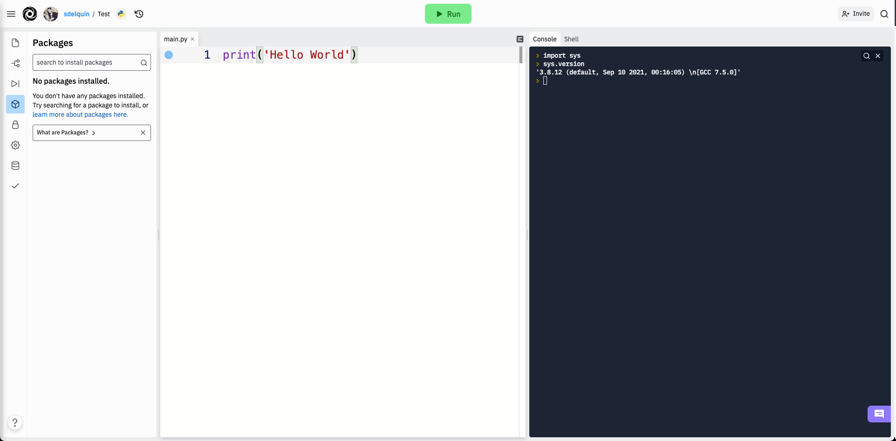

# Contexto real { #real-context }


(1)
{ .annotate }

1. :fontawesome-regular-copyright: [SpaceX](https://unsplash.com/es/@spacex) (Unsplash)

Hemos visto que [Thonny](thonny.md) es una herramienta especialmente diseñada para el aprendizaje de Python, integrando diferentes módulos que facilitan su gestión. Si bien lo podemos utilizar para un desarrollo más «serio», se suele recurrir a un flujo de trabajo algo diferente en **contextos más reales**.

## Python { #python }

La forma más habitual de instalar Python (junto con sus librerías) es descargarlo e instalarlo desde su página oficial:

=== ":fontawesome-brands-windows: Windows"

    [Descargar Python para Windows](https://www.python.org/downloads/windows/)
    !!! info "Ayuda"

        [Tutorial para instalar Python en Linux](https://www.freecodecamp.org/news/how-to-install-python-in-windows-operating-system/)

=== ":simple-apple: MacOS"

    [Descargar Python para MacOS](https://www.python.org/downloads/macos/)

=== ":simple-linux: Linux"

    [Descargar Python para Linux](https://www.python.org/downloads/linux/)

### Anaconda { #anaconda }

Otra de las alternativas para disponer de Python en nuestro sistema y que además es muy utilizada, es **Anaconda**. Se trata de un _conjunto de herramientas_, orientadas en principio a la _ciencia de datos_, pero que podemos utilizarlas para desarrollo general en Python (junto con otras librerías adicionales).

Existen versiones de pago, pero también se ofrece una distribución «open-source» y gratuita. Se puede [descargar](https://www.anaconda.com/download) desde su página web. Anaconda trae por defecto una gran cantidad de [paquetes](https://docs.anaconda.com/anaconda/pkg-docs/) Python en su distribución.

!!! abstract "Miniconda"

    [Miniconda](https://docs.anaconda.com/miniconda/) es un instalador «mínimo» que viene con Python y un pequeño número de paquetes útiles.

## Gestión de paquetes { #package-managers }

La instalación limpia[^1] de Python ya ofrece de por sí muchos paquetes y módulos que vienen por defecto. Es lo que se llama la [librería estándar](https://docs.python.org/es/3.12/tutorial/stdlib.html). Pero una de las características más destacables de Python es su inmenso «ecosistema» de paquetes disponibles en el [Python Package Index (PyPI)](https://pypi.org/).

Para gestionar los paquetes que tenemos en nuestro sistema se utiliza la herramienta [pip](https://pip.pypa.io/en/stable/), una utilidad que también se incluye en la instalación (por defecto) de Python. Con ella podremos instalar, desinstalar y actualizar paquetes, según nuestras necesidades. A continuación se muestran las instrucciones que usaríamos para cada una de estas operaciones:

=== ":octicons-diff-added-24: Instalar"

    ```console
    $ pip install pytest  # pytest es sólo un ejemplo
    ```

    En el caso de querer **instalar dependencias desde un fichero** `requirements.txt`(1) tendríamos que ejecutar:
    { .annotate }

    1. Como regla general los proyectos hechos en Python suelen tener un fichero `requirements.txt` con las dependencias del proyecto. Un paquete por cada línea con la opción de fijar su versión.

    ```console
    $ pip install -r requirements.txt
    ```

    !!! tip "Caché"

        Utiliza el siguiente comando si quieres deshabilitar la caché[^2] a la hora de instalar paquetes:

        ```console
        $ pip install --no-cache-dir pytest
        ```

=== ":octicons-diff-removed-24: Desinstalar"

    ```console
    $ pip uninstall pytest
    ```

=== ":material-update: Actualizar"

    ```console
    $ pip install -U pytest
    ```

Para el caso de [Anaconda](#anaconda) usaríamos el comando:

```console
$ conda install pytest
```

## Entornos virtuales { #virtualenvs }

Cuando trabajamos en distintos proyectos, no todos ellos requieren los mismos paquetes ni siquiera la misma versión de Python. La gestión de estas situaciones no es sencilla si únicamente instalamos paquetes y manejamos configuraciones a nivel global (a nivel del sistema). Es por ello que surge el concepto de **entornos virtuales**. Como su propio nombre indica se trata de crear distintos entornos en función de las necesidades de cada proyecto, lo que nos permite establecer qué versión de Python usaremos y qué paquetes instalaremos dentro del mismo.

La manera más sencilla de [crear un entorno virtual](https://docs.python.org/es/3/library/venv.html#creating-virtual-environments) es la siguiente:

```console
$ cd myproject #(1)!
$ python -m venv --prompt myproject .venv #(2)!
$ source .venv/bin/activate #(3)!
```

1. Entrar en la carpeta de nuestro proyecto.
2. Este comando crea una carpeta `.venv`[^3] con los ficheros que constituyen el entorno virtual.
3. Activar el entorno virtual. A partir de aquí todo lo que se instale quedará dentro del entorno virtual.

!!! note "VIRTUAL_ENV"

    Cuando activamos el entorno virtual se «crea» una variable de entorno `VIRTUAL_ENV` que contiene la ruta al entorno virtual. _Esto es muy útil para tomar decisiones en función de si está activo o no el entorno virtual actual_.

### pyenv { #pyenv }

**pyenv** es una herramienta que permite instalar/cambiar fácilmente entre múltiples versiones de Python en un mismo sistema. Su instalación engloba varios pasos y está bien explicada en la [página del proyecto](https://github.com/pyenv/pyenv#installation).

Veamos algunas de sus ^^funcionalidades^^ más interesantes:

<div class="grid cards" markdown>

- Listar las versiones instaladas de Python:

    ---
    ```console
    $ pyenv versions
      system
      3.12.0
    * 3.12.5 (set by /home/sdelquin/.pyenv/version)
    ```

    Podemos comprobar la versión de Python:
    ```console
    $ python --version
    Python 3.12.5
    ```

- Cambiar la versión **global** de Python:

    ---
    ```console
    $ pyenv global 3.12.0
    ```

    Podemos comprobar la versión de Python:
    ```console
    $ python --version
    Python 3.12.0
    ```

- Instalar una nueva versión de Python:

    ---
    ```console
    $ pyenv install 3.12.6
    ```

    Comprobamos de nuevo las versiones:
    ```console
    $ pyenv versions
      system
      3.12.0
    * 3.12.5 (set by /home/sdelquin/.pyenv/version)
      3.12.6
    ```

- Activar una versión **local** de Python:
  
    ---
    ```console
    $ cd myproject
    $ pyenv local 3.12.6
    $ python --version
    Python 3.12.6
    ```

    Se crea un fichero «oculto»:

    ```console
    $ ls -a
    .  ..  .python-version
    ```

</div>

!!! info "pyenv-virtualenv"

    También existe un módulo denominado [pyenv-virtualenv](https://github.com/pyenv/pyenv-virtualenv) para manejar entornos virtuales utilizando las ventajas que proporciona _pyenv_.

### uv { #uv }

**uv** es una herramienta para gestionar paquetería y proyectos de Python. Es [extremadamente rápida](https://github.com/astral-sh/uv/blob/main/BENCHMARKS.md) y está escrita en lenguaje [Rust](https://www.rust-lang.org/es).

La [documentación](https://docs.astral.sh/uv/) está muy bien conseguida. A continuación vamos a mostrar algunas de sus ^^funcionalidades^^ más interesantes:

<div class="grid cards" markdown>

- [Instalar](https://docs.astral.sh/uv/concepts/python-versions/#installing-a-python-version) una versión de Python:

    ---
    ```console
    $ uv python install  # latest
    $ uv python install 3.11
    ```
    La versión de Python que instala uv no está disponible a nivel global del sistema. Se utiliza para crear proyectos o entornos virtuales.

- [Listar](https://docs.astral.sh/uv/concepts/python-versions/#viewing-available-python-versions) las versiones disponibles de Python:

    ---
    ```console
    $ uv python list
    ```
    Este comando no sólo muestra las versiones de Python instaladas con uv sino también aquellas instaladas a nivel de sistema.

- [Crear un proyecto](https://docs.astral.sh/uv/guides/projects/#creating-a-new-project) Python:

    ---
    ```console
    $ uv init --no-package
    ```
    Este comando crea la estructura necesaria de ficheros para que se pueda mantener el estado del proyecto de manera ^^local^^. El fichero principal de esta configuración es `pyproject.toml`.

- [Añadir dependencias](https://docs.astral.sh/uv/guides/projects/#managing-dependencies) a un proyecto:

    ---
    ```console
    $ uv add pytest  # ejemplo
    ```
    Este comando creará automáticamente un entorno virtual `.venv` dentro de la carpeta del proyecto si aún no está creado, instalará el paquete `pytest` y actualizará las dependencias en `pyproject.toml`.

- Crear un [entorno virtual](https://docs.astral.sh/uv/pip/environments/):

    ---
    ```console
    $ uv venv
    ```
    Este comando crea un entorno virtual en la carpeta `.venv`

- [Lanzar un programa](https://docs.astral.sh/uv/guides/scripts/) Python:

    ---
    ```console
    $ uv run example.py
    ```
    Este comando permite ejecutar un «script» Python directamente desde uv.
    
    En el caso de que el «script» tuviera dependencias externas, podemos usar el siguiente comando:
    ```console
    $ uv run --with pytest example.py
    ```

</div>

## Editores { #editors }

Existen multitud de editores en el mercado que nos pueden servir perfectamente para escribir código Python. Algunos de ellos incorporan funcionalidades extra y otros simplemente nos permiten editar ficheros.

Cabe destacar aquí el concepto de **Entorno de Desarrollo Integrado**, más conocido por sus siglas en inglés **IDE**. Se trata de una aplicación que proporciona servicios integrales para el desarrollo de software.

=== "Editores/IDEs con soporte Python"

    - [Vim :simple-vim:](https://www.vim.org/)
    - [Emacs :simple-gnuemacs:](https://www.gnu.org/software/emacs/)
    - [Sublime Text :simple-sublimetext:](https://www.sublimetext.com/)
    - [Eclipse :simple-eclipseide:](https://www.eclipse.org/) :material-plus: [PyDev](https://www.pydev.org/)
    - [IntelliJ IDEA :simple-intellijidea:](https://www.jetbrains.com/help/idea/getting-started.html) :material-plus: [Python Plugin](https://www.jetbrains.com/help/idea/plugin-overview.html)
    - [Visual Studio :material-microsoft-visual-studio:](https://visualstudio.microsoft.com/es/vs/) :material-plus: [Python Tools](https://visualstudio.microsoft.com/es/vs/features/python/)
    - [Visual Studio Code :material-microsoft-visual-studio-code:](https://code.visualstudio.com/) :material-plus: [Python Extension](https://marketplace.visualstudio.com/items?itemName=ms-python.python)

=== "Editores/IDEs específicos para Python"

    - [PyCharm :simple-pycharm:](https://www.jetbrains.com/pycharm/)
    - [Spyder :simple-spyderide:](https://www.spyder-ide.org/)
    - [Thonny](https://thonny.org/)
    - [PyDev](https://www.pydev.org/)
    - [Wing](https://wingware.com/)

Cada editor tiene sus características (ventajas e inconvenientes). Supongo que la preferencia por alguno de ellos estará en base a la experiencia y a las necesidades que surjan. La parte buena es que hay diversidad de opciones para elegir.

## Plataformas { #platforms }

### Jupyter { #jupyter }

[Jupyter :simple-jupyter:](https://jupyter.org/) es un proyecto «open-source» que permite crear y compartir documentos que contienen código, ecuaciones, visualizaciones y texto narrativo. Podemos utilizarlo para propósito general aunque suele estar más enfocado a ciencia de datos: limpieza y transformación de datos, simulación numérica, modelado estadístico, visualización o «machine-learning»[^4].

Podemos verlo como un intérprete de Python (contiene un «kernel»[^5] que permite ejecutar código) con la capacidad de incluir documentación en formato [Markdown :material-language-markdown-outline:](https://markdown.es/) lo que potencia sus funcionalidades y lo hace adecuado para preparar cualquier tipo de material vinculado con lenguajes de programación.

!!! example "Kernels"

    Aunque su uso está más extendido en el mundo Python, existen [muchos otros «kernels»](https://github.com/jupyter/jupyter/wiki/Jupyter-kernels) sobre los que trabajar con Jupyter.

### repl.it { #replit }

[repl.it :simple-replit:](https://replit.com/) es un **servicio web que ofrece un entorno de desarrollo integrado** para programar en más de 50 lenguajes (Python incluido).

Es gratuito y de uso colaborativo. Se requiere una cuenta en el sistema para utilizarlo. El hecho de no requerir instalación ni configuración previa lo hace atractivo en determinadas circunstancias.

<figure markdown="span">
    
    <figcaption>Interfaz de repl.it para Python</figcaption>
</figure>

En su versión gratuita[^6] («Starter») repl.it ofrece:

- 2Gb de almacenamiento en disco.
- 1Gb de memoria RAM.
- Python 3.11.9.
- Hasta 3 repositorios públicos.
- Explorador (y subida) de ficheros.
- Gestor de paquetes integrado.
- Integración con GitHub.
- Gestión de secretos (datos sensibles).
- Bases de datos clave-valor ya integrada.
- Acceso (limitado) al sistema operativo y sistema de archivos.

### WSL { #wsl }

Si estamos trabajando en un sistema **Windows** (versión 10/11/...) es posible que nos encontremos más cómodos usando una terminal tipo «Linux», entre otras cosas para poder usar con facilidad las herramientas vistas en esta sección y preparar el entorno de desarrollo Python. Durante mucho tiempo esto fue difícil de conseguir hasta que Microsoft ofreció WSL.

[WSL](https://learn.microsoft.com/es-es/windows/wsl/) nos proporciona una consola con entorno Linux que podemos utilizar en nuestro sistema operativo Windows sin necesidad de instalar una máquina virtual o crear una partición para un Linux nativo. Es importante saber también que existen [dos versiones de WSL](https://learn.microsoft.com/es-es/windows/wsl/compare-versions) hoy en día: WSL y WSL2. La segunda tiene mejor rendimiento y se adhiere más al comportamiento de un Linux nativo.

La instalación de WSL debería ser tan fácil como :material-powershell:`#!console wsl --install` pero quizás deberías echar un vistazo a la [documentación](https://learn.microsoft.com/es-es/windows/wsl/install) por si hay algo que debas saber...


[^1]: También llamada «vanilla installation» ya que es la que viene por defecto y en la que no se realiza ninguna personalización.
[^2]: La caché de pip es un almacenamiento temporal que acelera la instalación de paquetes.
[^3]: Es una **convención** llamar `.venv` al directorio/carpeta que contiene el entorno virtual Python.
[^4]: Término inglés utilizado para hacer referencia a algoritmos de aprendizaje automático.
[^5]: Proceso específico para un lenguaje de programación que ejecuta instrucciones y actúa como interfaz de entrada/salida.
[^6]: Información disponible a la fecha de escritura de este documento. Puede no ser correcta a la fecha de lectura del mismo.
