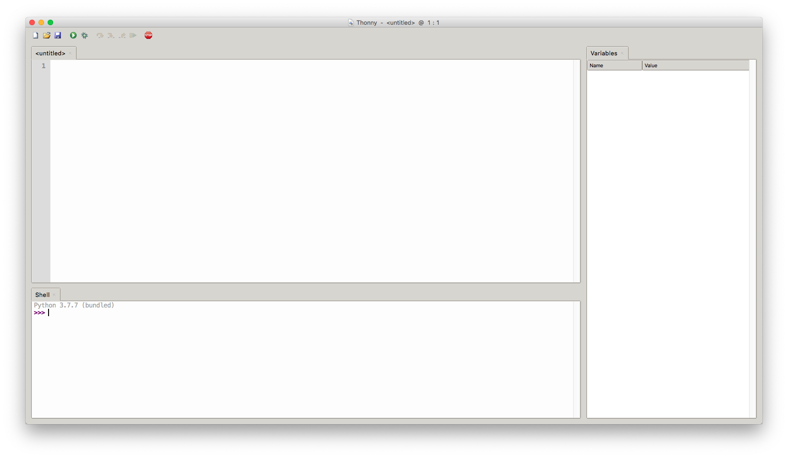
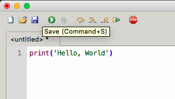
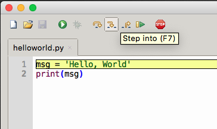

# Thonny { #thonny }


/// caption
Imagen generada con Inteligencia Artificial
///

[Thonny](https://thonny.org/) es un programa muy interesante para empezar a aprender Python porque ofrece un entorno amigable en el que sólo te debes preocupar por escribir código y mejorar tus detrezas en Python.

El programa además integra tres de las herramientas fundamentales para trabajar en programación: **intérprete**, **editor** y **depurador**.

Cuando vamos a trabajar con Python debemos tener instalado, como mínimo, un [intérprete](../introduction/machine.md#compilers) del lenguaje (para otros lenguajes sería un _compilador_). El **intérprete** nos permitirá ejecutar nuestro código para obtener los resultados deseados. La idea del intéprete es lanzar instrucciones «sueltas» para probar determinados aspectos.

Pero normalmente queremos ir un poco más allá y poder escribir programas algo más largos, por lo que también necesitaremos un **editor**. Un editor es un programa que nos permite crear ficheros de código (en nuestro caso con extensión `*.py`), que luego son ejecutados por el intérprete.

Hay otra herramienta interesante dentro del entorno de desarrollo que sería el **depurador**. Lo podemos encontrar habitualmente en la bibliografía por su nombre inglés «debugger». Es el módulo que nos permite ejecutar paso a paso nuestro código y visualizar qué está ocurriendo en cada momento. Se suele usar normalmente para encontrar fallos («bugs») en nuestros programas y poder solucionarlos («debug & fix»).

Cuando nos encontramos con un programa que proporciona estas funciones (e incluso otras adicionales) para el trabajo de programación, nos referimos a él como un _Entorno Integrado de Desarrollo_, conocido popularmente por sus siglas en inglés IDE. Thonny es un IDE gratuito, sencillo y apto para principiantes.

## Instalación { #installation }

Para instalar Thonny debemos [acceder a su web](https://thonny.org/) y descargar la aplicación para nuestro sistema operativo. La ventaja es que está disponible tanto para **Windows**, **MacOS** y **Linux**. Una vez descargado el fichero lo ejecutamos y seguimos su instalación paso por paso.

Una vez terminada la instalación ya podemos lanzar la aplicación que se verá parecida a la siguiente imagen:


///caption
Aspecto de Thonny una vez arrancado
///


!!! tip "Aspecto"

    Es posible que el aspecto del programa varíe ligeramente según el sistema operativo, configuración de escritorio, versión utilizada o idioma (en mi caso está en inglés), pero a efectos de funcionamiento no hay diferencia.

Podemos observar que la pantalla está dividida en **3 paneles**:

- ^^Panel principal^^ que contiene el **editor** e incluye la etiqueta `<untitled>` donde escribiremos nuestro código fuente Python.
- ^^Panel inferior^^ con la etiqueta «Shell» que contiene el **intérprete** de Python. En el momento de la escritura del presente documento, Thonny incluye la versión de Python 3.10.
- ^^Panel derecho^^ que contiene el **depurador**. Más concretamente se trata de la ventana de variables donde podemos inspeccionar el valor de las mismas.

!!! warning "Versión de Python"

    Las actualizaciones de Thonny no están «alineadas» con las últimas versiones de Python, por lo que es probable que no dispongas de la última versión estable de Python en Thonny. En cualquier caso, siempre se podrá configurar el editor para utilizar una instalación personalizada de Python más actualizada.

## Intérprete { #interpreter }

El intérprete de Python (por lo general) se identifica claramente porque posee un **prompt**(1)con tres angulos hacia la derecha `#!pycon >>>`. En Thonny lo podemos encontrar en el panel inferior, pero se debe tener en cuenta que el intérprete de Python es una herramienta autocontenida y que la podemos ejecutar desde el símbolo del sistema o la terminal:
{ .annotate }

1. Término inglés que se refiere al símbolo que precede la línea de comandos.

```console
$ python
Python 3.12.5 (main, Aug 14 2024, 04:32:18) [Clang 18.1.8 ] on darwin
Type "help", "copyright", "credits" or "license" for more information.
>>>
```

Para hacer una prueba inicial del intérprete vamos a retomar el primer programa que se suele hacer. Es el llamado [«Hello, World»](../introduction/machine.md/#assembly). Para ello escribimos lo siguiente en el intérprete y pulsamos la tecla ++enter++:

```pycon
>>> print('Hello, World')
Hello, World
```

Lo que hemos hecho es indicarle a Python que ejecute como **entrada** la instrucción `#!python print('Hello, World')`. La **salida** es el texto `Hello, World` que lo vemos en la siguiente línea (ya sin el prompt `#!pycon >>>`).

## Editor { #editor }

Ahora vamos a realizar la misma operación, pero en vez de ejecutar la instrucción directamente en el intérprete, vamos a crear un fichero y guardarlo con la sentencia que nos interesa. Para ello escribimos `#!python print('Hello, World')` en el panel de edición (_superior_) y luego guardamos el archivo con el nombre `helloworld.py`[^1]:



!!! info "Extensión .py"

    Los ficheros que contienen programas hechos en Python siempre deben tener la extensión `.py`

Ahora ya podemos ejecutar nuestro fichero `helloworld.py`. Para ello pulsamos el botón verde con triángulo blanco :octicons-triangle-right-24: (en la barra de herramientas) o bien damos a la tecla ++f5++. Veremos que en el panel de «Shell» nos aparece la salida esperada. Lo que está pasando «entre bambalinas» es que el intérprete de Python está recibiendo como entrada el fichero que hemos creado; lo ejecuta y devuelve la salida para que Thonny nos lo muestre en el panel correspondiente.

## Depurador { #debugger }

Nos falta por probar el depurador o «debugger». Aunque su funcionamiento va mucho más allá de lo que vemos aquí, nos vamos a quedar de momento con la posibilidad de inspeccionar variables de nuestro programa. Desafortunadamente `helloworld.py` es muy simple y ni siquiera contiene variables, pero podemos hacer una pequeña modificación al programa para incorporarlas:

```python linenums="1"
msg = 'Hello, World'
print(msg)
```

Aunque [ya lo veremos en profundidad](../datatypes/data.md#variables), lo que hemos hecho es añadir una variable `#!python msg` en la ^^línea 1^^ para luego utilizarla al mostrar por pantalla su contenido (^^línea 2^^). Si ahora volvemos a ejecutar nuestro programa veremos que en el panel de variables nos aparece la siguiente información:

| Name           | Value                     |
| -------------- | ------------------------- |
| `#!python msg` | `#!python 'Hello, World'` |

También existe la posibilidad, a través del depurador, de ir ejecutando nuestro programa **paso a paso**. Para ello basta con pulsar en el botón que tiene un insecto :octicons-bug-24:. Ahí comienza la sesión de depuración y podemos avanzar instrucción por instrucción usando la tecla ++f7++:



[^1]: La carpeta donde se guarden los archivos de código no es crítico para su ejecución, pero sí es importante mantener un orden y una organización para tener localizados nuestros ficheros y proyectos.
