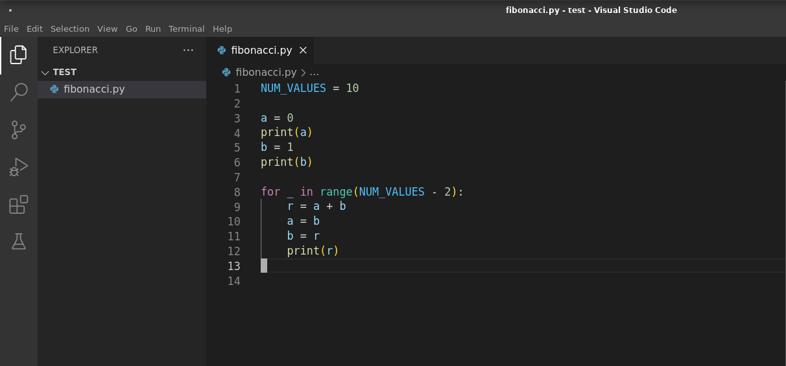
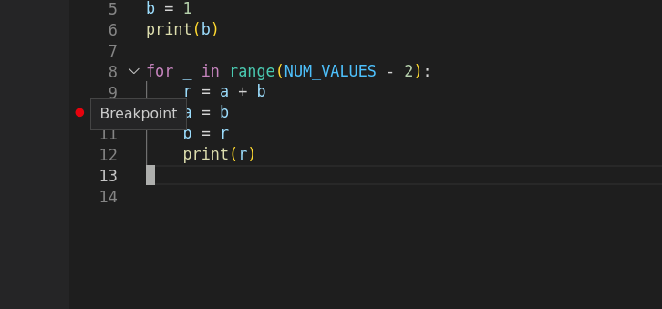
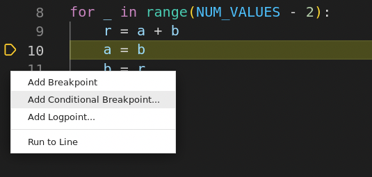
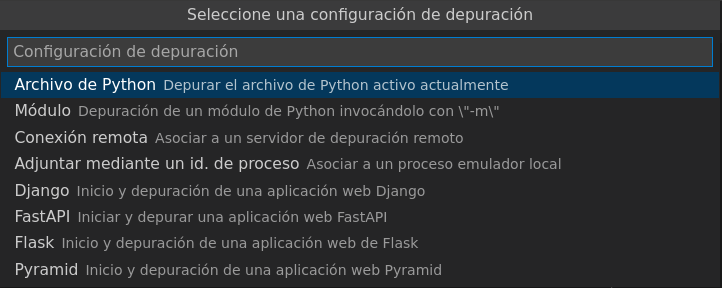
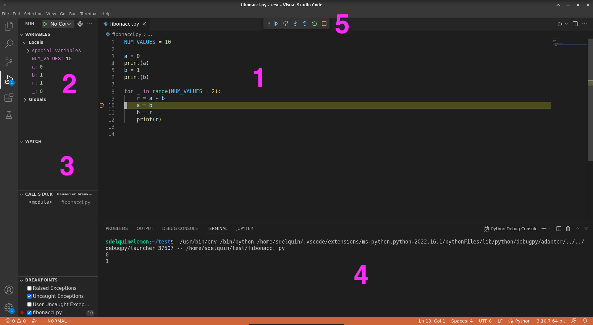
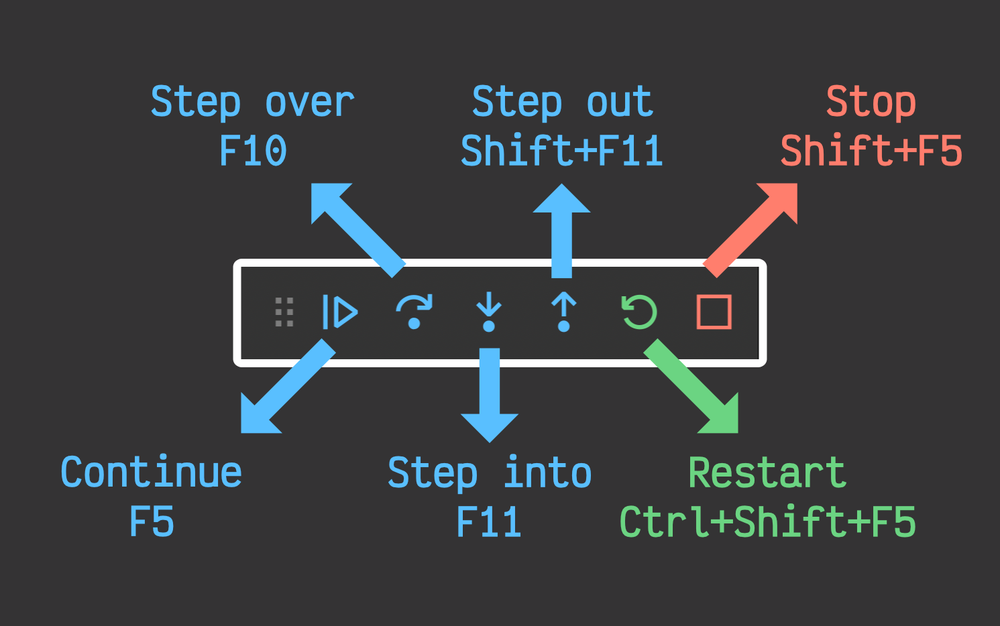
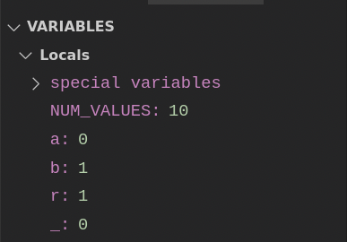
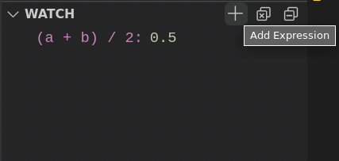

# Visual Studio Code { #vscode }

/// caption
Imagen generada con Inteligencia Artificial
///

[Visual Studio Code](https://code.visualstudio.com/) (también conocido por _VSCode_) es un entorno de desarrollo integrado IDE gratuito y de código abierto desarrollado por **Microsoft** :material-microsoft: que ha ganado mucha relevancia en los últimos años. Permite trabajar fácilmente con multitud de lenguajes de programación y dispone de una gran cantidad de extensiones.

## Instalación { #installation }

VSCode está disponible para distintos sistemas operativos con paquetes autoinstalables que se pueden descargar desde [este enlace](https://code.visualstudio.com/download).

## Extensiones { #extensions }

VSCode proporciona muchas extensiones que facilitan la escritura de código **Python :material-language-python:**{.green}. Personalmente recomiendo las siguientes:

- [Python](https://marketplace.visualstudio.com/items?itemName=ms-python.python) → Soporte para el lenguaje Python con múltiples características.
- [Ruff](https://marketplace.visualstudio.com/items?itemName=charliermarsh.ruff) → Linter[^1] y formateador de código para Python (extremadamente rápido): [astral.sh/ruff](https://astral.sh/ruff).
- [Mypy Type Checker](https://marketplace.visualstudio.com/items?itemName=ms-python.mypy-type-checker) → Chequeador de tipos estáticos para Python: [mypy-lang.org](https://mypy-lang.org/).

## Atajos de teclado { #shortcuts }

Conocer los atajos de teclado de tu editor favorito es fundamental para mejorar el flujo de trabajo y ser más productivo. Veamos los principales atajos de teclado[^2] de Visual Studio Code:

=== "Ajustes generales"

    | Acción | Atajo |
    | --- | --- |
    | Abrir paleta de comandos | ++ctrl+shift+p++ |
    | Abrir archivo | ++ctrl+p++ |
    | Nueva ventana | ++ctrl+shift+n++ |
    | Cerrar ventana | ++ctrl+shift+w++ |

=== "Usabilidad"

    | Acción | Atajo |
    | --- | --- |
    | Crear un nuevo archivo | ++ctrl+n++ |
    | Abrir archivo | ++ctrl+o++ |
    | Guardar archivo | ++ctrl+s++ |
    | Cerrar | ++ctrl+f4++ |
    | Panel de problemas | ++ctrl+shift+m++ |

=== "Edición básica"

    | Acción | Atajo |
    | --- | --- |
    | Cortar línea | ++ctrl+x++ |
    | Copiar línea | ++ctrl+c++ |
    | Borrar línea | ++ctrl+shift+k++ |
    | Insertar línea debajo | ++enter++ |
    | Insertar línea encima | ++ctrl+shift+enter++ |
    | Buscar en archivo abierto | ++ctrl+f++ |
    | Reemplazar | ++ctrl+h++ |
    | Línea de comentario | ++ctrl+shift+7++ |
    | Bloque de comentario | ++shift+alt+a++ |
    | Salto de línea | ++alt+z++ |
    | Tabular línea | ++tab++ |
    | Destabular línea | ++shift+tab++ |
    | Renombrar símbolo | ++f2++ |

=== "Pantalla"

    | Acción | Atajo |
    | --- | --- |
    | Mostrar barra lateral | ++ctrl+b++ |
    | Abrir debug | ++ctrl+shift+d++ |
    | Panel de salida | ++ctrl+shift+u++ |
    | Control de source | ++ctrl+shift+g++ |
    | Extensiones | ++ctrl+shift+x++ |

!!! tip "macOS"

    En **macOS :material-apple:** sustituye ++ctrl++ por ++command++

## Depurando código { #debugging }

La **depuración de programas** es el proceso de **identificar y corregir errores de programación**.​ Es conocido también por el término inglés «debugging», cuyo significado es eliminación de bugs (bichos), manera en que se conoce informalmente a los errores de programación.

Existen varias herramientas de depuración (o _debuggers_). Algunas de ellas en modo texto (terminal) y otras con entorno gráfico (ventanas):

- La herramienta más extendida en el mundo Python para **depurar en modo texto** es el módulo [pdb](https://docs.python.org/3/library/pdb.html) (The Python Debugger). Viene incluido en la instalación base de Python y es realmente potente.
- Aunque existen varias herramientas para **depurar en entorno gráfico** nos vamos a centrar en **Visual Studio Code**.

Lo primero será abrir el fichero `fibonacci.py` (como ejemplo:material-flash:) sobre que el que vamos a trabajar:

### Punto de ruptura { #breakpoint }

A continuación pondremos un **punto de ruptura** (también llamado «breakpoint»). Esto implica que la ejecución se pare en ese punto que viene indicado por un punto rojo :octicons-dot-fill-16:{ .red }. Para ponerlo nos tenemos que acercar a la columna que hay a la izquierda del número de línea y hacer clic.

En este ejemplo ponemos un punto de ruptura en la ^^línea 10^^:

///caption
Punto de ruptura en VSCode
///

También es posible añadir **puntos de ruptura condicionales** pulsando con el botón derecho y luego «Add Conditional Breakpoint»:

///caption
Condiciones para punto de ruptura en VSCode
///

### Lanzar la depuración { #launch-debug }

Ahora ya podemos lanzar la depuración pulsando la tecla ++f5++. Nos aparecerá el siguiente mensaje en el que dejaremos la opción por defecto «Archivo de Python» y pulsamos ++enter++:

///caption
Configuración de depuración en VSCode
///

Ahora ya se inicia el «modo depuración» y veremos una pantalla similar a la siguiente:

///caption
Paneles de depuración en VSCode
///

Zonas de la interfaz en modo depuración:

1. Código con barra en amarillo que indica la próxima línea que se va a ejecutar.
2. Visualización automática de valores de variables.
3. Visualización personalizada de valores de variables (o expresiones).
4. Salida de la terminal.
5. Barra de herramientas para depuración.

### Controles para depuración { #debug-controls }

Veamos con mayor detalle la **barra de herramientas** para depuración:

|    Acción     |       Atajo       |                                          Significado                                           |
| ------------- | ----------------- | ---------------------------------------------------------------------------------------------- |
| **Continue**  | ++f5++            | Continuar la ejecución del programa hasta el próximo punto de ruptura o hasta su finalización. |
| **Step over** | ++f10++           | Ejecutar la siguiente instrucción del programa.                                                |
| **Step into** | ++f11++           | Ejecutar la siguiente instrucción del programa entrando en un contexto inferior.               |
| **Step out**  | ++shift+f11++     | Ejecutar la siguiente instrucción del programa saliendo a un contexto superior.                |
| **Restart**   | ++ctrl+shift+f5++ | Reiniciar la depuración del programa.                                                          |
| **Stop**      | ++shift+f5++      | Detener la depuración del programa.                                                            |

### Seguimiento de variables { #debug-variables }

Como hemos indicado previamente, la zona «VARIABLES» ya nos informa automáticamente de los valores de las variables que tengamos en el contexto actual de ejecución:

Pero también es posible añadir manualmente el seguimiento de otras variables o expresiones personalizadas desde la zona «WATCH»:

[^1]: Un «linter» es una herramienta software que permite detectar errores en el código previo a su ejecución.
[^2]: Fuente: [Gastón Danielsen](https://dev.to/gastondanielsen/atajos-de-teclado-shortcuts-en-vscode-430a).
