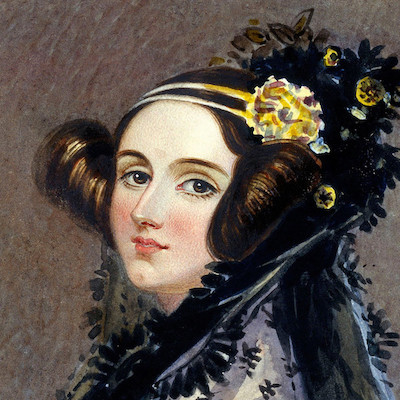
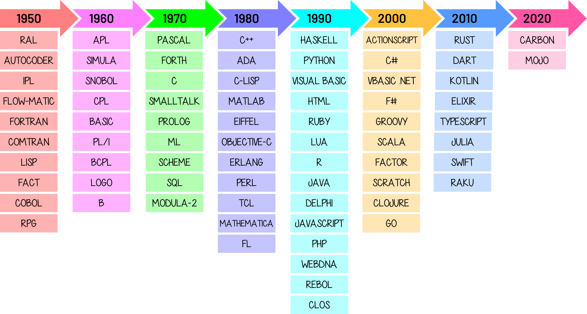

# Algo de historia { #brief-history }

(1)
{ .annotate }

1. :fontawesome-regular-copyright: [Dario Veronesi](https://unsplash.com/es/@dariovero_) (Unsplash)

La historia de la programación está relacionada directamente con la aparición de los computadores, que ya desde el siglo XV tuvo sus inicios con la construcción de una máquina que realizaba operaciones básicas y raíces cuadradas ([Gottfried Wilheml von Leibniz](https://es.wikipedia.org/wiki/Gottfried_Leibniz)); aunque en realidad la primera gran influencia hacia la creación de los computadores fue la máquina diferencial para el cálculo de polinomios, proyecto no concluido de [Charles Babbage](https://es.wikipedia.org/wiki/Charles_Babbage) (1793-1871) con el apoyo de [Lady Ada Countess of Lovelace](https://es.wikipedia.org/wiki/Ada_Lovelace) (1815-1852), primera persona que incursionó en la programación y de quien proviene el nombre del lenguaje de programación [ADA](<https://es.wikipedia.org/wiki/Ada_(lenguaje_de_programaci%C3%B3n)>) creado por el DoD en la década de 1970.

## Hitos de la computación { #computing-milestones }

La siguiente tabla es un ~~resumen~~ _granito de arena_ de los principales hitos en la historia de la computación:

| Año :material-calendar: | Personaje :fontawesome-regular-user:                                                             | Aporte :octicons-light-bulb-16:                                                                                                                                                                                                                                                                                                                       |
| ---- | --------------------------------------------------------------------- | ----------------------------------------------------------------------------------------------------------------------------------------------------------------------------------------------------------------------------------------------------------------------------------------------------------------------------- |
| 1694 | [Gottfried Leibniz](https://es.wikipedia.org/wiki/Gottfried_Leibniz)  | Máquina de **operaciones básicas**.                                                                                                                                                                                                                                                                                           |
| 1835 | [Charles Babbage](https://es.wikipedia.org/wiki/Charles_Babbage)      | **Máquina diferencial** para el cálculo de polinomios.                                                                                                                                                                                                                                                                        |
| 1842 | [Ada Lovelace](https://es.wikipedia.org/wiki/Ada_Lovelace)            | Matemática, informática y escritora británica. [Primera programadora de la historia](https://www.xataka.com/historia-tecnologica/asi-fue-como-ada-lovelace-ayudo-a-crear-informatica-cuando-nadie-vio-potencial-real-que-tenia-maquina-babbage) por el desarrollo de ^^algoritmos^^ para la máquina analítica de Babbage[^1]. |
| 1854 | [George Boole](https://es.wikipedia.org/wiki/George_Boole)            | Contribuyó al **algebra binaria** y a los sistemas de circuitos de computadora (álgebra booleana).                                                                                                                                                                                                                            |
| 1890 | [Herman Hollerit](https://es.wikipedia.org/wiki/Herman_Hollerith)     | Creador de un **sistema para automatizar** el censo de Estados Unidos.                                                                                                                                                                                                                                                         |
| 1936 | [Alan Turing](https://es.wikipedia.org/wiki/Alan_Turing)              | **Máquina de Turing** - una máquina capaz de resolver problemas - Aportes de Lógica Matemática - Computadora con tubos de vacío.                                                                                                                                                                                              |
| 1942 | [John Atanasoff](https://es.wikipedia.org/wiki/John_Atanasoff)        | Desarrolló (junto con [Clifford Berry](https://es.wikipedia.org/wiki/Clifford_Berry)) la **primera computadora digital** electrónica patentada: Atanasoff Berry Computer (ABC).                                                                                                                                                                                                                                        |
| 1944 | [Howard Aiken](https://es.wikipedia.org/wiki/Howard_H._Aiken)         | En colaboración con IBM desarrolló el **Mark I**, una computadora electromecánica (16m. de largo y 2m. de alto) que podía realizar las cuatro operaciones básicas y trabajar con información tabular.                                                                                                                         |
| 1945 | [Grace Hopper](https://es.wikipedia.org/wiki/Grace_Murray_Hopper)     | Primera ^^programadora^^ que utilizó el Mark I (instrucciones en código máquina).                                                                                                                                                                                                                                                                               |
| 1946 | [John W. Mauchly](https://es.wikipedia.org/wiki/John_William_Mauchly) | Junto a [John P. Eckert](https://es.wikipedia.org/wiki/John_Presper_Eckert) desarrolló una **computadora electrónica** completamente operacional a gran escala llamada **ENIAC**.                                                                                                                                                                                                  |
| 1946 | [John Von Neumann](https://es.wikipedia.org/wiki/John_von_Neumann)    | Propuso guardar en **memoria** no solo la **información**, sino también los **programas**, acelerando los procesos.                                                                                                                                                                                                           |

<figure markdown="span">
  { width="300" }
  <figcaption>Ada Lovelace: primera programadora de la historia</figcaption>
</figure>

A partir de los años 50 los avances en las ciencias de la computación se aceleraron de manera significativa. Se reemplazaron los [tubos de vacío](https://es.wikipedia.org/wiki/Computadora_de_tubos_de_vac%C3%ADo) por [transistores](https://es.wikipedia.org/wiki/Transistor) en 1958 y en el mismo año, se sustituyeron por [circuitos integrados](https://es.wikipedia.org/wiki/Circuito_integrado); y en 1961 se miniaturizaron en **chips de silicio**. En 1971 apareció el primer microprocesador de Intel; y en 1973 el primer sistema operativo CP/M. El primer computador personal es comercializado por IBM en el año 1980.

## De los computadores a la programación { #from-computers-to-programming }

De acuerdo con este breve viaje por la historia, la programación —obviamente— está vinculada a la aparición de los computadores, y los lenguajes tuvieron también su evolución. Inicialmente, como ya hemos visto, se programaba en **código binario**, es decir en cadenas de 0s y 1s, que es el lenguaje que entiende directamente el computador, tarea extremadamente difícil; luego se creó el **lenguaje ensamblador**, que ya introdujo un nivel de abstracción permitiendo usar instrucciones (aunque bastante rudimentarias) lo que resultaba más cómodo. Posteriormente aparecieron los **lenguajes de alto nivel**, que en general, utilizan palabras en inglés, para dar las órdenes a seguir, para lo cual utilizan un proceso intermedio entre el lenguaje máquina y el nuevo código llamado **código fuente**; este proceso se realiza por parte de un [compilador](machine.md#compilers).

## Cronología de los lenguajes de programación { #programming-languages-chronology }

Desde la década de 1950 se han sucedido multitud de lenguajes de programación que cada vez incorporan más funcionalidades destinadas a cubrir las necesidades del desarrollo de aplicaciones. A continuación se muestra una tabla con la historia de los lenguajes de programación más destacados:

El **número** actual de lenguajes de programación depende de lo que se considere un lenguaje de programación y a quién se pregunte:

| Organismo | Número de lenguajes |
| --- | --- |
| [TIOBE](https://www.tiobe.com/tiobe-index/programming-languages-definition/#instances) | :material-approximately-equal:250 |
| [Wikipedia](https://en.wikipedia.org/wiki/List_of_programming_languages) | :material-approximately-equal:700 |
| [Language List](http://www.info.univ-angers.fr/~gh/hilapr/langlist/langlist.htm) | :material-approximately-equal:2500 |
| [Online Historical Encyclopaedia of Programming Languages](http://hopl.info/) | :material-approximately-equal:9000 |

## Creadores de lenguajes de programación { #programming-languages-creators }

El avance de la computación está íntimamente relacionado con el desarrollo de los lenguajes de programación. Sus creadores y creadoras juegan un _rol fundamental_ en la historia tecnológica. Veamos algunas de estas personas[^2]:

| Año :material-calendar: | Creador/a :fontawesome-regular-user-alt:                                                                                      | Lenguaje :material-invoice-text-outline:                                                                                                                                                   |
| ---- | ----------------------------------------------------------------------------------------------- | ----------------------------------------------------------------------------------------------------------------------------------------------------------- |
| 1954 | [Nathaniel Rochester](<https://en.wikipedia.org/wiki/Nathaniel_Rochester_(computer_scientist)>) | [Ensamblador: IBM 701](https://bitsavers.org/pdf/ibm/701/Buchholz_IBM_701_System_Design_Oct53.pdf)                                                          |
| 1955 | [Grace Hopper](https://es.wikipedia.org/wiki/Grace_Murray_Hopper)                               | [Flow-Matic](https://en.wikipedia.org/wiki/FLOW-MATIC) :material-arrow-right: [COBOL](https://www.ibm.com/docs/es/i/7.5?topic=cobol-ile-language-reference) |
| 1957 | [John Backus](https://es.wikipedia.org/wiki/John_Backus)                                        | [:simple-fortran: FORTRAN](https://fortran-lang.org/)                                                                                                       |
| 1958 | [John McCarthy](https://es.wikipedia.org/wiki/John_McCarthy)                                    | [:simple-commonlisp: LISP](https://lisp-lang.org/)                                                                                                                              |
| 1962 | [Kenneth E. Iverson](https://es.wikipedia.org/wiki/Kenneth_Iverson)                             | [APL](https://tryapl.org/)                                                                                                                                  |
| 1967 | [Seymour Papert](https://es.wikipedia.org/wiki/Seymour_Papert)                                  | [Logo](https://el.media.mit.edu/logo-foundation/what_is_logo/logo_programming.html)                                                                         |
| 1968 | [Stephen Wolfram](https://es.wikipedia.org/wiki/Stephen_Wolfram)                                | [:simple-wolframmathematica: Mathematica](https://www.wolfram.com/mathematica/)                                                                             |
| 1970 | [Niklaus Wirth](https://es.wikipedia.org/wiki/Niklaus_Wirth)                                    | [Pascal](https://www.freepascal.org/)                                                                                                                       |
| 1972 | [Dennis Ritchie](https://es.wikipedia.org/wiki/Dennis_Ritchie)                                  | [C](https://learn.microsoft.com/es-es/cpp/c-language/c-language-reference?view=msvc-170)                                                                    |
| 1972 | [Alan Kay](https://es.wikipedia.org/wiki/Alan_Kay)                                              | [Smalltalk](https://squeak.org/)                                                                                                                            |
| 1973 | [Robin Milner](https://es.wikipedia.org/wiki/Robin_Milner)                                      | [ML](http://www.faqs.org/faqs/meta-lang-faq/)                                                                                                               |
| 1977 | [Brian Kernighan](https://es.wikipedia.org/wiki/Brian_Kernighan)                                | [Awk](http://www.awklang.org/)                                                                                                                              |
| 1983 | [Anders Hejlsberg](https://es.wikipedia.org/wiki/Anders_Hejlsberg)                              | [Turbo Pascal](https://turbopascal.org/)                                                                                                                    |
| 1983 | [Bjarne Stroustrup](https://es.wikipedia.org/wiki/Bjarne_Stroustrup)                            | [:simple-cplusplus: C++](https://cpp-lang.net/)                                                                                                             |
| 1985 | [Bertrand Meyer](https://es.wikipedia.org/wiki/Bertrand_Meyer)                                  | [Eiffel](https://www.eiffel.org/)                                                                                                                           |
| 1986 | [Joe Armstrong](https://es.wikipedia.org/wiki/Joe_Armstrong)                                    | [:simple-erlang: Erlang](https://www.erlang.org/)                                                                                                                           |
| 1987 | [Larry Wall](https://es.wikipedia.org/wiki/Larry_Wall)                                          | [:simple-perl: Perl](https://www.perl.org/)                                                                                                                 |
| 1991 | [Alan Cooper](https://es.wikipedia.org/wiki/Alan_Cooper)                                        | [Visual Basic](https://learn.microsoft.com/es-es/dotnet/visual-basic/)                                                                                      |
| 1991 | [Guido van Rossum](https://es.wikipedia.org/wiki/Guido_van_Rossum)                              | [:simple-python: Python](https://python.org)                                                                                                                |
| 1991 | [James Gosling](https://es.wikipedia.org/wiki/James_Gosling)                                    | [Oak](https://oaklang.org/) :material-arrow-right: [:fontawesome-brands-java: Java](https://docs.oracle.com/javase/8/)                                      |
| 1995 | [Yukihiro Matsumoto](https://es.wikipedia.org/wiki/Yukihiro_Matsumoto)                          | [:simple-ruby: Ruby](https://www.ruby-lang.org/es/)                                                                                                         |
| 1995 | [Brendan Eich](https://es.wikipedia.org/wiki/Brendan_Eich)                                      | [:simple-javascript: JavaScript](https://developer.mozilla.org/es/docs/Web/JavaScript)                                                                      |
| 2003 | [Martin Odersky](https://en.wikipedia.org/wiki/Martin_Odersky)                                  | [:simple-scala: Scala](https://www.scala-lang.org/)                                                                                                         |
| 2006 | [Graydon Hoare](http://www.ctkf.org/index-140.html)                                             | [:simple-rust: Rust](https://www.rust-lang.org/)                                                                                                            |
| 2007 | [Mitch Resnick](https://es.wikipedia.org/wiki/Mitchel_Resnick)                                  | [:simple-scratch: Scratch](https://scratch.mit.edu/)                                                                                                        |
| 2009 | [Ken Thompson](https://es.wikipedia.org/wiki/Ken_Thompson)                                      | [:fontawesome-brands-golang: Go](https://go.dev/)                                                                                                           |
| 2012 | [Anders Heijlsberg](https://es.wikipedia.org/wiki/Anders_Hejlsberg)                             | [:simple-typescript: TypeScript](https://www.typescriptlang.org/)                                                                                           |

[^1]: Foto de Ada Lovelace tomada desde [Meatze](https://www.meatze.eus/blog-igualdad/la-primera-programadora-pertenece-al-siglo-xix-ada-lovelace/).
[^2]: Fuente: [Wikpedia](https://es.wikipedia.org/wiki/Historia_de_los_lenguajes_de_programaci%C3%B3n)
