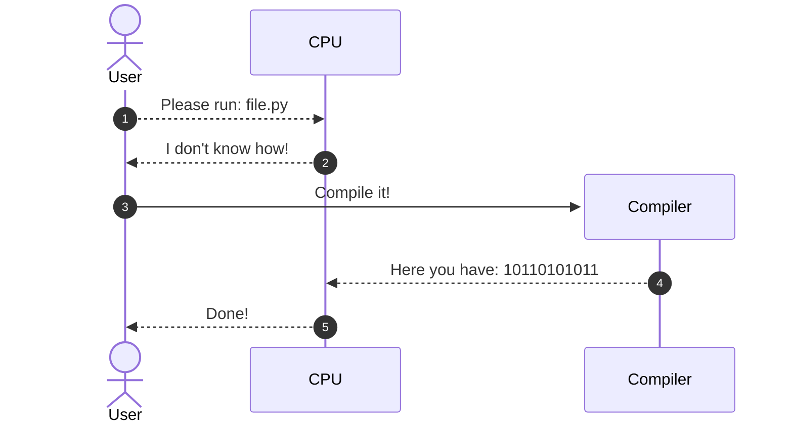
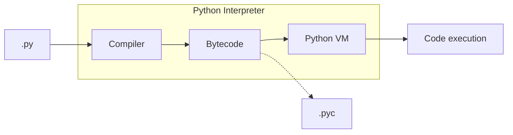

# Hablando con la máquina { #talking-to-machine }


(1)
{ .annotate }

1. :fontawesome-regular-copyright: [Garett Mizunaka](https://unsplash.com/@garett3) (Unsplash)

Los ordenadores son dispositivos complejos pero están diseñados para hacer una cosa bien: **ejecutar aquello que se les indica**. La cuestión radica en cómo indicarle a una máquina lo que queremos que haga. Esas indicaciones se llaman técnicamente **instrucciones** y se expresan en un **lenguaje**. Podríamos decir que _programar consiste en escribir instrucciones para que sean ejecutadas por un ordenador_. El lenguaje que utilizamos para ello se denomina _lenguaje de programación_.

## Código máquina { #machine-code }

Pero aún no hemos resuelto el problema de cómo hacer que un ordenador (o máquina) entienda un lenguaje de programación. A priori se podría decir que un ordenador sólo entiende un lenguaje muy «simple» denominado [código máquina](https://es.wikipedia.org/wiki/Lenguaje_de_m%C3%A1quina). En este lenguaje se utilizan únicamente los símbolos <span class="red">0</span> y <span class="green">1</span> en representación de los niveles de tensión alto y bajo, que al fin y al cabo, son los estados que puede manejar un [circuito digital](https://es.wikipedia.org/wiki/Circuito_digital). En este contexto, por tanto, hablamos de [sistema binario](https://es.wikipedia.org/wiki/Sistema_binario). Si tuviéramos que escribir programas de ordenador en este formato sería una tarea ardua, pero afortunadamente con el tiempo se han ido creando lenguajes de programación intermedios que, posteriormente, son convertidos a código máquina.

Si intentamos visualizar un programa en código máquina, únicamente obtendríamos una secuencia de ceros y unos:

```
00001000 00000010 01111011 10101100 10010111 11011001 01000000 01100010
00110100 00010111 01101111 10111001 01010110 00110001 00101010 00011111
10000011 11001101 11110101 01001110 01010010 10100001 01101010 00001111
11101010 00100111 11000100 01110101 11011011 00010110 10011111 01010110
```

## Ensamblador { #assembly }

El primer lenguaje de programación que encontramos en esta «escalada» es **ensamblador**. Veamos a continuación un [ejemplo de código en ensamblador](https://medium.com/nabucodonosor-editorial/hola-mundo-ensamblado-x86-ff62789ab9b0) del típico programa que se escribe por primera vez, el _«Hello, World»_:

```asm
SYS_SALIDA equ 1

section .data
    msg db "Hello, World",0x0a
    len equ $ - msg ;longitud de msg

section .text
global _start ;para el linker
_start: ;marca la entrada
    mov eax, 4 ;llamada al sistema (sys_write)
    mov ebx, 1 ;descripción de archivo (stdout)
    mov ecx, msg ;msg a escribir
    mov edx, len ;longitud del mensaje
    int 0x80 ;llama al sistema de interrupciones

fin: mov eax, SYS_SALIDA ;llamada al sistema (sys_exit)
    int 0x80
```

Aunque resulte difícil de creer, lo «único» que hace este programa es mostrar en la pantalla de nuestro ordenador el texto `Hello, World`.

Un detalle fundamental es que sólo funcionará para una [arquitectura x86](https://es.wikipedia.org/wiki/X86), ya que las instrucciones en ensamblador están vinculadas con el tipo de arquitectura del procesador.

## C { #c }

Aunque el lenguaje ensamblador nos facilita un poco la tarea de desarrollar programas, sigue siendo bastante complicado ya que las instrucciones son muy específicas y no proporcionan una semántica entendible. Uno de los lenguajes que vino a suplir – en parte – estos obstáculos fue [C](<https://es.wikipedia.org/wiki/C_(lenguaje_de_programaci%C3%B3n)>). Considerado para muchas personas como un referente en cuanto a los lenguajes de programación, permite hacer uso de instrucciones más claras y potentes. El mismo ejemplo anterior del programa _«Hello, World»_ se escribiría así en lenguaje C:

```c
#include <stdio.h>

int main() {
    printf("Hello, World");
    return 0;
}
```

## Python { #python }

Si seguimos «subiendo» en esta lista de lenguajes de programación, podemos llegar hasta [Python](https://es.wikipedia.org/wiki/Python). Se dice que es un lenguaje de más alto nivel en el sentido de que sus instrucciones son más entendibles por un humano. Veamos cómo se escribiría el programa _«Hello, World»_ en el lenguaje de programación Python:

```python
print('Hello, World')
```

¡Pues así de fácil! :material-robot-happy-outline:{.hl} Hemos pasado de _código máquina_ (ceros y unos) a código Python en el que se puede entender perfectamente lo que estamos indicando al ordenador. La pregunta que surge es: ¿cómo entiende una máquina lo que tiene que hacer si le pasamos un programa hecho en Python (o cualquier otro lenguaje de programación de alto nivel)? La respuesta es un **compilador**.

## Compiladores { #compilers }

Los [compiladores](https://es.wikipedia.org/wiki/Compilador) son programas que convierten un lenguaje «cualquiera» en _código máquina_. Se pueden ver como traductores, permitiendo a la máquina interpretar lo que queremos hacer.



En el caso particular de Python el proceso de compilación genera un código intermedio denominado **bytecode**.

Si partimos del ejemplo anterior:

```python
print('Hello, World')
```

el programa se compilaría[^1] al siguiente «bytecode»:

```asm
0           0 RESUME                   0

1           2 PUSH_NULL
            4 LOAD_NAME                0 (print)
            6 LOAD_CONST               0 ('Hello, World')
            8 PRECALL                  1
           12 CALL                     1
           22 RETURN_VALUE
```

A continuación estas instrucciones básicas son ejecutadas por el intérprete de «bytecode» de Python (o máquina virtual)[^2]:



!!! note "Nota"

    Si queremos ver una diferencia entre un lenguaje compilado como C y un lenguaje «interpretado» como Python es que, aunque ambos realizan un proceso de traducción del código fuente, la compilación de C genera un código objeto que debe ser ejecutado en una segunda fase explícita, mientras que la compilación de Python genera un «bytecode» que se ejecuta (interpreta) de forma «transparente».

[^1]: Consulta aquí más información sobre el [intérprete de bytecode](https://devguide.python.org/internals/interpreter/).
[^2]: Imagen basada en el artículo [Python bytecode analysis](https://nowave.it/python-bytecode-analysis-1.html).
