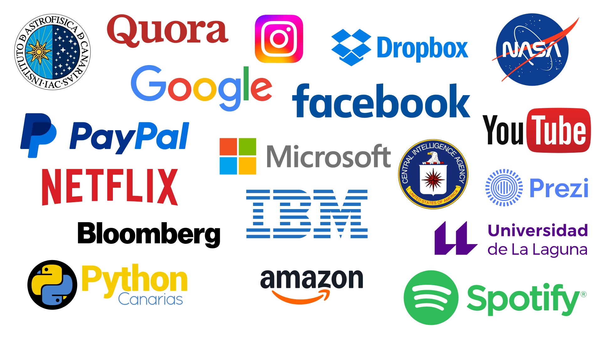
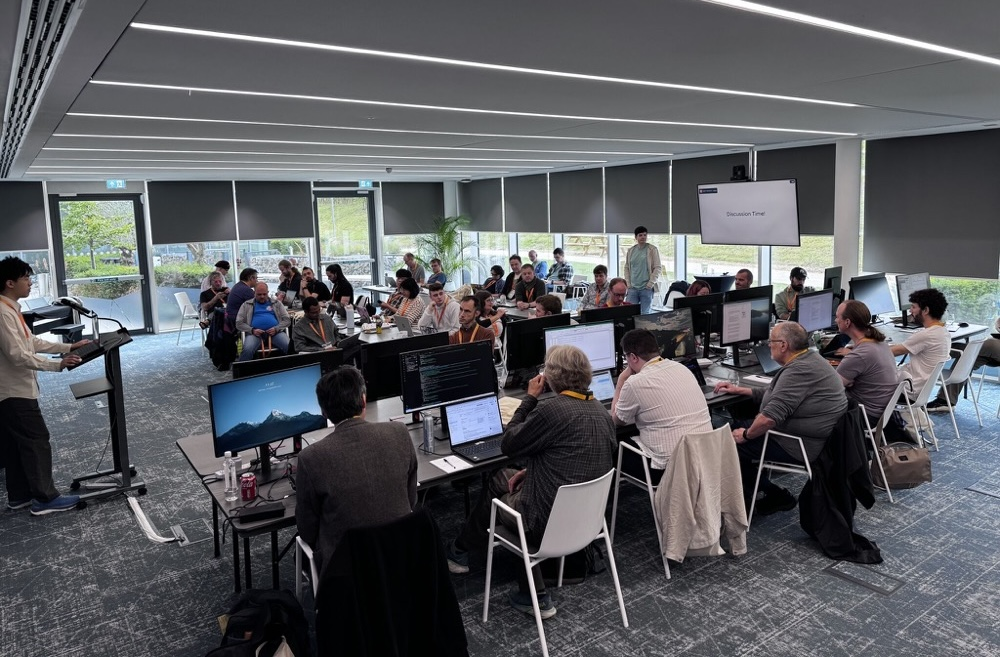

# Python { #python }


/// caption
Imagen generada con Inteligencia Artificial
///

[Python](https://www.python.org/) es un **lenguaje de programación** de [alto nivel](https://aprendepython.es/core/introduction/machine/#python) creado a principios de los años 90 por [Guido van Rossum](https://es.wikipedia.org/wiki/Guido_van_Rossum) que trabajaba por aquella época en el _Centro para las Matemáticas y la Informática de los Países Bajos_ ([CWI](https://www.cwi.nl/en/)).

Sus instrucciones están muy cercanas al **lenguaje natural** (en inglés) y favorecen la **legibilidad** del código. Toma su nombre de los [Monty Python](https://es.wikipedia.org/wiki/Monty_Python), grupo humorista de los 60 que gustaban mucho a Guido. Python fue creado como sucesor del lenguaje [ABC](https://homepages.cwi.nl/~steven/abc/).

!!! abstract "Python: El Documental"

    De cara a conocer los detalles tras este lenguaje de programación, resulta muy interesante visionar [este documental de Python :simple-youtube:](https://www.youtube.com/watch?v=GfH4QL4VqJ0) que fue lanzado en agosto de 2025 y producido por [Cult.Repo](https://www.linkedin.com/company/cult-repo/).


## Características del lenguaje { #language-features }

A partir de su [definición de la Wikipedia](https://es.wikipedia.org/wiki/Python):

- Python es un lenguaje de programación **interpretado** y **multiplataforma** cuya filosofía hace hincapié en una sintaxis que favorezca un **código legible**.
- Se trata de un lenguaje de programación **multiparadigma**, ya que soporta **orientación a objetos**, **programación imperativa** y, en menor medida, **programación funcional**.
- En base a su campo obetivo, se trata de un lenguaje de **propósito general**.

### Ventajas { #advantages }

<div class="annotate" markdown>

- Libre y gratuito (OpenSource).
- Fácil de leer, parecido a pseudocódigo.
- Aprendizaje relativamente fácil y rápido: claro e intuitivo.
- Alto nivel.
- Alta productividad: simple y rápido.
- Tiende a producir un buen código: orden, limpieza, elegancia, flexibilidad, ...
- Multiplataforma. Portable.
- Multiparadigma: programación imperativa, orientada a objetos, funcional, ...
- Interactivo, modular, dinámico.
- Librerías extensivas («pilas incluídas»).
- Gran cantidad de librerías de terceros.
- Extensible (C, C++, ..) y «embebible».
- Gran comunidad, amplio soporte.
- [Interpretado](machine.md#compilers).
- Tipado dinámico.(1)
- Fuertemente tipado.(2)

</div>

1. Tipado dinámico significa que una variable puede cambiar de tipo durante el tiempo de vida de un programa. Al contrario que Python, _C_ es un lenguaje de tipado estático.
2. Fuertemente tipado significa que, de manera nativa, no podemos operar con dos variables de tipos distintos, a menos que realice una conversión explícita. Al contrario que Python, _JavaScript_ es un lenguaje débilmente tipado.

### Inconvenientes { #disadvantages }

- «Interpretado» (velocidad de ejecución, multithread vs GIL[^1], ...).
- Consumo de memoria.
- Errores no fácilmente detectables en tiempo de compilación.
- Desarrollo móvil.
- Documentación a veces dispersa e incompleta.
- Varios módulos para la misma funcionalidad.
- Librerías de terceros no siempre del todo maduras.

## Uso de Python { #python-usage }

Al ser un lenguaje de ^^propósito general^^, podemos encontrar aplicaciones en prácticamente en todos los ámbitos:

- Análisis de datos.
- Aplicaciones de escritorio.
- Bases de datos relacionales / NoSQL
- Buenas prácticas de programación / Patrones de diseño.
- Concurrencia.
- Criptomonedas / Blockchain.
- Desarrollo de aplicaciones multimedia.
- Desarrollo de juegos.
- Desarrollo en dispositivos embebidos.
- Desarrollo web.
- DevOps / Administración de sistemas / Scripts de automatización.
- Gráficos por ordenador.
- Inteligencia artificial.
- Internet de las cosas.
- Machine Learning.
- Programación de parsers / scrapers / crawlers.
- Programación de redes.
- Propósitos educativos.
- Prototipado de software.
- Seguridad.
- Tests automatizados.

### Organizaciones { #organizations }

Afortunadamente Python ya superó hace muchos años esa idea de ser un lenguaje utilizado en entornos reducidos.
Son muchas las empresas, instituciones y organismos que utilizan Python en su día a día para mejorar sus sistemas de información. Veamos algunas de las más relevantes:


///caption
Empresas u organizaciones que usan Python
///

### Rankings { #rankings }

Existen ránkings y estudios de mercado que sitúan a Python como uno de los lenguajes más **usados** y la vez, más **amados** dentro del mundo del desarrollo de software.

=== "TIOBE"

    En el momento de la escritura de este documento, la última actualización del [Índice TIOBE](https://www.tiobe.com/tiobe-index/) es de **septiembre de 2025** en el que **Python ocupaba el primer puesto** de los ^^lenguajes de programación más usados^^, por delante de C y C++.

    | Puesto | Lenguaje |  Uso   |
    | ------ | -------- | ------ |
    | 1      | Python   | 25.98% |
    | 2      | C++      | 8.80%  |
    | 3      | C        | 8.65%  |

=== "Stack Overflow"

    En el momento de la escritura de este documento, la última actualización de la [encuesta a desarrolladores/as de Stack Overflow](https://survey.stackoverflow.co/2025/technology#admired-and-desired) es de **mayo de 2025** en la que **Python ocupaba el primer puesto** de los ^^lenguajes de programación más deseados y admirados^^, por delante de SQL y HTML/CSS.

    | Puesto | Lenguaje | Deseado :material-heart: | Admirado :fontawesome-solid-hands-clapping: |
    | ------ | -------- | ------------------------ | ------------------------------------------- |
    | 1      | Python   | 39.3%                    | 56.4%                                       |
    | 2      | SQL      | 35.6%                    | 56.4%                                       |
    | 3      | HTML/CSS | 33.8%                    | 52.1%                                       |

=== "GitHub"

    En el momento de la escritura de este documento, la última actualización del [informe sobre tecnologías en la plataforma GitHub](https://github.blog/news-insights/octoverse/octoverse-2024/#the-most-popular-programming-languages) es de **octubre de 2024** en la que **Python ocupaba el primer puesto** de los ^^lenguajes de programación más usados^^, por delante de JavaScript y TypeScript.

    | Puesto |  Lenguaje  |
    | ------ | ---------- |
    | 1      | Python     |
    | 2      | JavaScript |
    | 3      | TypeScript |

=== "IEEE Spectrum"

    En el momento de la escritura de este documento, la última actualización del [ranking anual IEEE Spectrum sobre lenguajes de programación](https://spectrum.ieee.org/top-programming-languages-2024) es de **agosto de 2024** en la que **Python ocupaba el primer puesto** de los ^^lenguajes de programación más populares^^, por delante de Java y JavaScript.

    | Puesto |  Lenguaje  | Popularidad |
    | ------ | ---------- | ----------- |
    | 1      | Python     | 1           |
    | 2      | Java       | 0.4855      |
    | 3      | JavaScript | 0.4451      |

## Versiones de Python { #python-releases }

De acuerdo con el propio [blog de Guido Van Rossum](https://python-history.blogspot.com/2009/01/brief-timeline-of-python.html) la implementación de Python comenzó en **diciembre de 1989**[^2] liberando distintas versiones internas `0.x` durante los siguientes 4 años.

A partir de ese momento se empezaron a desarrollar las versiones estables «mayores» indicadas en la siguiente tabla:

<div class="annotate" markdown>
|                    Versión                     | Fecha de lanzamiento |  Release manager(1)   |
| ---------------------------------------------- | -------------------- | --------------------- |
| **Python 1.0**                                 | Enero 1994           | Guido van Rossum      |
| Python 1.5                                     | Diciembre 1997       | Guido van Rossum      |
| Python 1.6                                     | Septiembre 2000      | Guido van Rossum      |
| **Python 2.0**                                 | Octubre 2000         | Guido van Rossum      |
| Python 2.1                                     | Abril 2001           | Guido van Rossum      |
| Python 2.2                                     | Diciembre 2001       | Guido van Rossum      |
| Python 2.3                                     | Julio 2003           | Guido van Rossum      |
| Python 2.4                                     | Noviembre 2004       | Guido van Rossum      |
| Python 2.5                                     | Septiembre 2006      | Guido van Rossum      |
| [Python 2.6](https://docs.python.org/2.6/)     | Octubre 2008         | Barry Warsaw          |
| [Python 2.7](https://docs.python.org/2.7/)     | Julio 2010           | Benjamin Peterson     |
| [**Python 3.0**](https://docs.python.org/3.0/) | Diciembre 2008       | Barray Warsaw         |
| [Python 3.1](https://docs.python.org/3.1/)     | Junio 2009           | Benjamin Peterson     |
| [Python 3.2](https://docs.python.org/3.2/)     | Febrero 2011         | Georg Brandl          |
| [Python 3.3](https://docs.python.org/3.3/)     | Septiembre 2012      | Georg Brandl          |
| [Python 3.4](https://docs.python.org/3.4/)     | Marzo 2014           | Larry Hastings        |
| [Python 3.5](https://docs.python.org/3.5/)     | Septiembre 2015      | Larry Hastings        |
| [Python 3.6](https://docs.python.org/3.6/)     | Diciembre 2016       | Ned Deily             |
| [Python 3.7](https://docs.python.org/3.7/)     | Junio 2018           | Ned Deily             |
| [Python 3.8](https://docs.python.org/3.8/)     | Octubre 2019         | Łukasz Langa          |
| [Python 3.9](https://docs.python.org/3.9/)     | Octubre 2020         | Łukasz Langa          |
| [Python 3.10](https://docs.python.org/3.10/)   | Octubre 2021         | Pablo Galindo Salgado |
| [Python 3.11](https://docs.python.org/3.11/)   | Octubre 2022         | Pablo Galindo Salgado |
| [Python 3.12](https://docs.python.org/3.12/)   | Octubre 2023         | Thomas Wouters        |
| [Python 3.13](https://docs.python.org/3.13/)   | Octubre 2024         | Thomas Wouters        |
| [Python 3.14](https://docs.python.org/3.14/)   | Octubre 2025         | Hugo van Kemenade     |
| [Python 3.15](https://docs.python.org/3.15/)   | Octubre 2026         | Hugo van Kemenade     |
</div>
1. El «release manager» de una versión de Python es un/una [«core developer»](https://hugovk.github.io/python-core-devs/) encargado/a de coordinar y responsabilizarse de liberar dicha versión de Python en tiempo y forma.

!!! abstract "Dato curioso"

    Desde <span class="pyversion"><a href="https://docs.python.org/3.8/">Python <span class="version">:octicons-tag-24: 3.8</span></a></span>, cada nueva versión estable de Python se libera en el mes de **Octubre**.

!!! info "Soporte"

    Es importante tener en cuenta el [calendario de soporte](https://devguide.python.org/versions/#full-chart) de cada una de las versiones de Python.

### Core developers { #core-developers }

Los «core developers» de Python constituyen el equipo de personas que desarrollan/mantienen el lenguaje de programación Python.

Convertirse en «core developer» exige superar una serie de [requisitos](https://devguide.python.org/core-team/join-team/). El listado de todas las personas que han formado parte de este equipo puede consultarse [aquí](https://devguide.python.org/core-team/team-log/index.html).

Cada cierto tiempo se reúnen en «sprints»[^3] donde toman decisiones sobre el futuro de Python y programan los cambios que han sido aceptados mediante los PEP.


(1)
{ .annotate }

1.  CPython [Core Dev Sprint 2025](https://www.linkedin.com/feed/update/ugcPost:7375230884591083520/) en [ARM](https://www.arm.com/) (Cambridge)  
    :fontawesome-regular-copyright: [Diego R.](https://www.linkedin.com/in/diegor/) (Linkedin)

### Python 3 { #python3 }

El cambio **de Python 2 a Python 3** fue bastante «traumático» ya que **se perdió la compatibilidad** en muchas de las estructuras del lenguaje. Los [«core-developers»](#core-developers), con _Guido van Rossum_ a la cabeza, vieron la necesidad de aplicar estas modificaciones en beneficio del rendimiento y expresividad del lenguaje de programación. Este cambio implicaba que el código escrito en Python 2 no funcionaría (de manera inmediata) en Python 3.

El pasado **1 de enero de 2020** finalizó oficialmente el **soporte a la versión 2.7** del lenguaje de programación Python. Es por ello que se recomienda lo siguiente:

1. Si aún desarrollas aplicaciones escritas en Python 2, deberías migrar a Python 3.
2. Si vas a desarrollar una nueva aplicación, deberías hacerlo directamente en Python 3.

!!! warning "Advertencia"

    Únete a **Python 3** y aprovecha todas sus ventajas.

### CPython { #cpython }

Existen múltiples **implementaciones** de Python según el lenguaje de programación que se ha usado para desarrollarlo. Veamos algunas de ellas:

| Implementación                                   | Lenguaje                       |
| ------------------------------------------------ | ------------------------------ |
| **[CPython](https://github.com/python/cpython)** | :fontawesome-solid-c:          |
| [Jython](https://www.jython.org/)                | :fontawesome-brands-java: Java |
| [IronPython](https://ironpython.net/)            | :simple-cplusplus: C++         |
| [Brython](https://brython.info/)                 | :simple-javascript: JavaScript |
| [RustPython](https://rustpython.github.io/)      | :simple-rust: Rust             |
| [MicroPython](https://micropython.org/)          | :fontawesome-solid-c:          |

!!! info "CPython"

    Cuando hacemos referencia a Python hablamos (implícitamente) de CPython. Este manual versa exclusivamente sobre CPython.

## Orientaciones { #orientations }

### Zen de Python { #zen-of-python }

Existen una serie de _reglas_ «filosóficas» que indican una **manera de hacer y de pensar** dentro del mundo **pitónico**[^4] creadas por [Tim Peters](<https://en.wikipedia.org/wiki/Tim_Peters_(software_engineer)>), llamadas el [Zen de Python](https://www.python.org/dev/peps/pep-0020/) y que se pueden aplicar incluso más allá de la programación:

=== "Zen of Python 🇬🇧"

    ```pycon
    >>> import this
    The Zen of Python, by Tim Peters

    Beautiful is better than ugly.
    Explicit is better than implicit.
    Simple is better than complex.
    Complex is better than complicated.
    Flat is better than nested.
    Sparse is better than dense.
    Readability counts.
    Special cases aren't special enough to break the rules.
    Although practicality beats purity.
    Errors should never pass silently.
    Unless explicitly silenced.
    In the face of ambiguity, refuse the temptation to guess.
    There should be one-- and preferably only one --obvious way to do it.
    Although that way may not be obvious at first unless you're Dutch.
    Now is better than never.
    Although never is often better than *right* now.
    If the implementation is hard to explain, it's a bad idea.
    If the implementation is easy to explain, it may be a good idea.
    Namespaces are one honking great idea -- let's do more of those!
    ```

=== "Zen de Python 🇪🇸"

    En su [traducción de la Wikipedia](https://es.wikipedia.org/wiki/Zen_de_Python):

    - Bello es mejor que feo.
    - Explícito es mejor que implícito.
    - Simple es mejor que complejo.
    - Complejo es mejor que complicado.
    - Plano es mejor que anidado.
    - Espaciado es mejor que denso.
    - La legibilidad es importante.
    - Los casos especiales no son lo suficientemente especiales como para romper las reglas.
    - Sin embargo la practicidad le gana a la pureza.
    - Los errores nunca deberían pasar silenciosamente.
    - A menos que se silencien explícitamente.
    - Frente a la ambigüedad, evitar la tentación de adivinar.
    - Debería haber una, y preferiblemente solo una, manera obvia de hacerlo.
    - A pesar de que esa manera no sea obvia a menos que seas Holandés.
    - Ahora es mejor que nunca.
    - A pesar de que nunca es muchas veces mejor que ahora mismo.
    - Si la implementación es difícil de explicar, es una mala idea.
    - Si la implementación es fácil de explicar, puede que sea una buena idea.
    - Los espacios de nombres son una gran idea, ¡tengamos más de esos!

!!! tip "Fondo de pantalla"

    Si quieres darle un toque a tu escritorio, puedes descargar este [fondo de pantalla](https://www.gnome-look.org/p/1042303) del Zen de Python que queda muy chulo.

### Consejos para programar { #programming-advices }

Por aquí te dejo una lista de consejos muy interesantes cuando nos enfrentamos a la _ardua tarea de programar_[^5]:

1. Escribir código es el último paso del proceso.
2. Para resolver problemas: pizarra mejor que teclado.
3. Escribir código sin planificar = estrés.
4. Pareces más inteligente siendo claro, no siendo listo.
5. La constancia a largo plazo es mejor que la intensidad a corto plazo.
6. La solución primero. La optimización después.
7. Gran parte de la programación es resolución de problemas.
8. Piensa en múltiples soluciones antes de decidirte por una.
9. Se aprende construyendo proyectos, no tomando cursos.
10. Siempre elije simplicidad. Las soluciones simples son más fáciles de escribir.
11. Los errores son inevitables al escribir código. Sólo te informan sobre lo que no debes hacer.
12. Fallar es barato en programación. Aprende mediante la práctica.
13. Gran parte de la programación es investigación.
14. La programación en pareja te enseñará mucho más que escribir código tu solo.
15. Da un paseo cuando estés bloqueado con un error.
16. Convierte en un hábito el hecho de pedir ayuda. Pierdes cero credibilidad pidiendo ayuda.
17. El tiempo gastado en entender el problema está bien invertido.
18. Cuando estés bloqueado con un problema: sé curioso, no te frustres.
19. Piensa en posibles escenarios y situaciones extremas antes de resolver el problema.
20. No te estreses con la sintaxis de lenguaje de programación. Entiende conceptos.
21. Aprende a ser un buen corrector de errores. Esto se amortiza.
22. Conoce pronto los atajos de teclado de tu editor favorito.
23. Tu código será tan claro como lo tengas en tu cabeza.
24. Gastarás el doble de tiempo en corregir errores que en escribir código.
25. Saber buscar bien en Google es una habilidad valiosa.
26. Lee código de otras personas para inspirarte.
27. Únete a comunidades de desarrollo para aprender con otros/as programadores/as. Por ejemplo: [Python Canarias](https://pythoncanarias.es).

[^1]: Amplía información sobre el GIL en [este enlace](https://codigofacilito.com/articulos/gil-python).
[^2]: El primer «commit» de CPython registrado por Guido van Rossum está disponible en [Github](https://github.com/python/cpython/commit/7f777ed95a19224294949e1b4ce56bbffcb1fe9f).
[^3]: Ciclo de trabajo de duración fija enfocado en desarrollar determinados aspectos software.
[^4]: Dícese de algo/alguien que sigue las convenciones de Python.
[^5]: Consejos obtenidos de la cuenta :simple-x: de [@codewithvoid](https://twitter.com/codewithvoid).
