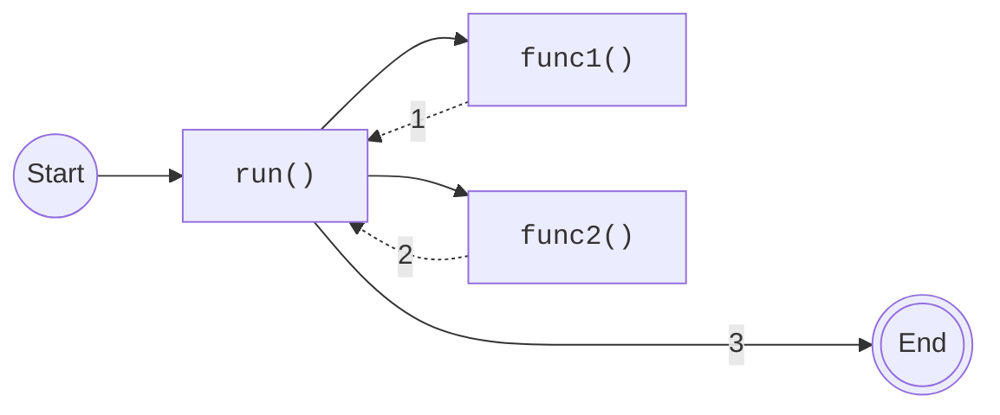
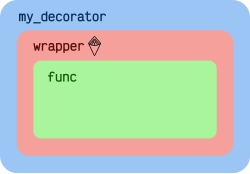
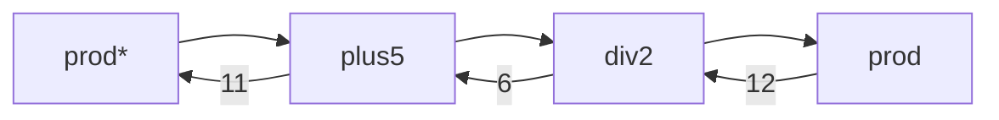
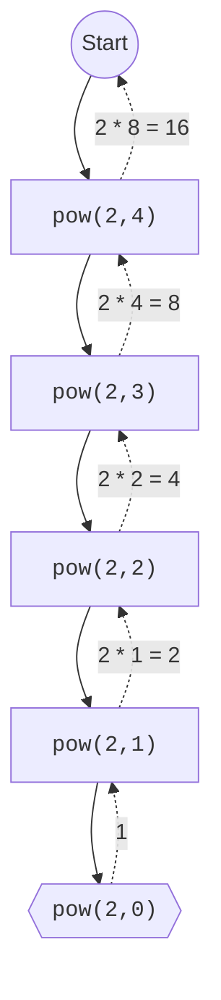

# Funciones { #functions }


(1)
{ .annotate }

1. :fontawesome-regular-copyright: [Nathan Dumlao](https://unsplash.com/es/@nate_dumlao) :material-at: [Unsplash](https://unsplash.com) 

El concepto de **función** es básico en prácticamente cualquier lenguaje de programación. Se trata de un artefacto que nos permite agrupar código. Persigue dos objetivos claros:

1. **No repetir** fragmentos de código en un programa.
2. **Reutilizar** el código en distintos escenarios.

Una función viene definida por su **nombre**, sus **parámetros** y su **valor de retorno**. Esta parametrización de las funciones las convierten en una poderosa herramienta ajustable a distintas circunstancias. Al invocarla estaremos solicitando su ejecución y obtendremos unos resultados.

## Definir una función { #define }

Para **def**{ .blue }inir (_define_) una función utilizamos la palabra reservada `#!python def` seguida del **nombre** de la función. A continuación aparecerán 0 o más **parámetros** separados por comas (entre paréntesis), finalizando la línea con **dos puntos** `:` En la siguiente línea empezaría el **cuerpo** de la función que puede contener 1 o más **sentencias**, incluyendo (o no) una **sentencia de retorno** con el resultado mediante `#!python return`.


!!! tip "Dos puntos"

    Prestar especial atención a los dos puntos `:` porque suelen olvidarse en la _definición _ de la función.

Veamos una primera función muy sencilla:

```python
def say_hello():#(1)!
    print('Hello!')#(2)!
```
{ .annotate }

1.  - Los **nombres** de las funciones siguen [las mismas reglas que las variables](../datatypes/data.md#variables).
    - Como regla general, se suelen utilizar **verbos** en infinitivo para su definicón: `load_data`, `store_vaues`, `reset_card`, `filter_results`, `block_request`, ...
2. Nótese la [indentación](../controlflow/conditionals.md#blocks) del _cuerpo_ de la función.

## Invocar una función { #invoke }

Para **invocar** (o «llamar») a una función sólo tendremos que escribir su nombre seguido de paréntesis.

En el caso de la función sencilla (vista anteriormente) sería así:

```pycon hl_lines="4"
>>> def say_hello():
...     print('Hello!')
...
>>> say_hello()#(1)!
Hello!
```
{ .annotate }

1. La invocación (o llamada) a la función desencadena la ejecución de su código. Por ello obtenemos la salida esperada.

Es importante entender que la definición de la función debe ser **previa** a su llamada, de lo contrario recibiremos un error:

```pycon hl_lines="7"
>>> say_hello()
---------------------------------------------------------------------------
NameError                                 Traceback (most recent call last)
Cell In[1], line 1
----> 1 say_hello()

NameError: name 'say_hello' is not defined
```

## Retornar un valor { #return }

Las funciones pueden retornar (o «devolver») un valor. Veamos un <span class="example">ejemplo:material-flash:</span> muy sencillo:

```pycon
>>> def one():
...     return 1#(1)!
...
>>> one()
1
```
{ .annotate }

1.  - No confundir `#!python return` con `#!python print()`
    - El valor de retorno de una función nos permite usarlo fuera de su contexto.
    - El hecho de añadir `#!python print()` al cuerpo de una función es algo «coyuntural» y no modifica el resultado de la lógica interna.

Pero no sólo podemos invocar a la función directamente, también la podemos asignar a variables y utilizarla:

```pycon
>>> value = one()
>>> print(value)
1
```

También la podemos integrar en otras expresiones, por ejemplo en condicionales:

```pycon
>>> if one() == 1:
...     print('It works!')
... else:
...     print('Something is broken')
...
It works!
```

Si una función no incluye un `#!python return` de forma explícita, devolverá `#!python None` de forma implícita:

```pycon
>>> def empty():
...     x = 0

>>> print(empty())
None
```

!!! warning "Explícito es mejor que implícito"

    En general, usar `#!python return` ^^implícito^^ **no se considera una buena práctica** salvo que sepamos lo que estamos haciendo. Si la función debe devolver `#!python None` **es preferible ser explícito** y utilizar `#!python return None`.

#### Retornando múltiples valores { #multiple-return }

Una función puede retornar más de un valor. El «secreto» es hacerlo **mediante una tupla**.

A continuación se muestra un <span class="example">ejemplo:material-flash:</span> muy sencillo de función que retorna dos valores:

```pycon
>>> def multiple():
...     return 0, 1#(1)!
...
```
{ .annotate }

1.  - `#!python 0, 1` es una tupla!
    - Sería equivalente a: `#!python return (0, 1)`

Veamos qué ocurre si invocamos esta función:

```pycon
>>> result = multiple()

>>> result
(0, 1)

>>> type(result)
tuple
```

Por tanto, también podremos aplicar [desempaquetado de tuplas](../datastructures/tuples.md#unpack) sobre el valor retornado por la función:

```pycon
>>> a, b = multiple()

>>> a
0
>>> b
1
```

## Funciones auxiliares { #aux-funcs }

Es bastante probable que en un programa ~~utilicemos~~ necesitemos funciones para resolver un determinado problema.

En este sentido, hay que entender que podemos definir y utilizar todas aquellas funciones que consideremos necesarias (funciones auxiliares) para conseguir el fin deseado.

Veamos un <span class="example">ejemplo:material-flash:</span> muy sencillo:

```python
def func1():
    return 1

def func2():
    return 2

def run():
    return func1() + func2()

run()
```



!!! warning "Orden de las funciones"

    Es importante definir las funciones ^^antes^^ de utilizarlas.

## Parámetros y argumentos { #parameters }

Si una función no dispusiera de valores de entrada, su comportamiento quedaría muy limitado. Es por ello que los **parámetros** nos permiten variar los datos que consume una función y obtener distintos resultados.

Vamos a empezar a crear funciones que reciben parámetros. En este primer <span class="example">ejemplo:material-flash:</span> se define una función que recibe un valor numérico y devuelve su raíz cuadrada:

```pycon
>>> def sqrt(value):#(1)!
...     return value ** (1/2)
...
>>> sqrt(4)#(2)!
2.0
```
{ .annotate }

1. `#!python value` es un **parámetro**.
2. `#!python 4` es un **argumento**.

Cuando llamamos a una función, los valores que pasamos se denominan **argumentos** y se copian en los respectivos _parámetros_ de la función:


Veamos otro <span class="example">ejemplo:material-flash:</span> de función pero ahora con **dos parámetros** y algo más de _lógica de negocio_[^1]:

```pycon
>>> def _min(a, b):
...     if a < b:
...         return a
...     else:#(1)!
...         return b
...
>>> _min(7, 9)
7
```
{ .annotate }

1. Esta sentencia `#!python else` es **prescindible** ya que la sentencia anterior es un `#!python return`.

!!! info "Múltiples sentencias de retorno"

    Nótese que la sentencia `#!python return` puede aparecer **varias veces** en el cuerpo de una función (y no siempre al final). Esta técnica puede ser beneficiosa en determinados escenarios.[^2]

!!! exercise "Ejercicio"

    [pypas](https://pypas.es) &nbsp;:fontawesome-solid-hand-holding-heart:{ .slide } `sum-squares`

### Argumentos posicionales { #args }

Los **argumentos posicionales** son aquellos argumentos que se copian en sus correspondientes parámetros **por orden de escritura**.

Vamos a mostrar un <span class="example">ejemplo:material-flash:</span> definiendo una función que «construye» una CPU a partir de tres parámetros:

```pycon
>>> def build_cpu(vendor, num_cores, freq):
...     return dict(
...         vendor=vendor,
...         num_cores=num_cores,
...         freq=freq
...     )
...
```

Una posible llamada a esta función —con argumentos posicionales— sería la siguiente:

```pycon
>>> build_cpu('AMD', 8, 2.7)#(1)!
{'vendor': 'AMD', 'num_cores': 8, 'freq': 2.7}
```
{ .annotate }

1. Mapeo entre argumentos y parámetros:
    - `AMD` :material-arrow-right-bold: `vendor`
    - `8` :material-arrow-right-bold: `num_cores`
    - `2.7` :material-arrow-right-bold: `freq`

En el uso de argumentos posicionales hay un inconveniente: **recordar el orden**. Un error en la posición de los argumentos puede dar lugar a resultados indeseados:

```pycon
>>> build_cpu(8, 2.7, 'AMD')
{'vendor': 8, 'num_cores': 2.7, 'freq': 'AMD'}
```

### Argumentos nominales { #kwargs }

En esta aproximación los argumentos no son copiados en un orden específico sino que **se asignan por nombre a cada parámetro**. Esto nos permite evitar el problema de conocer cuál debe ser el orden de los parámetros en la definición de la función. Para utilizarlo, basta con realizar una asignación de cada argumento en la propia llamada a la función.

Veamos la misma llamada que hemos hecho en el <span class="example">ejemplo:material-flash:</span> de «construcción» de la CPU pero ahora utilizando paso de argumentos nominales:

```pycon
>>> build_cpu(vendor='AMD', num_cores=8, freq=2.7)#(1)!
{'vendor': 'AMD', 'num_cores': 8, 'freq': 2.7}
```
{ .annotate }

1. Mapeo entre argumentos y parámetros (por su nombre).

Se puede comprobar que el _orden de los argumentos_ no influye en el resultado final:

```pycon
>>> build_cpu(num_cores=8, freq=2.7, vendor='AMD')
{'vendor': 'AMD', 'num_cores': 8, 'freq': 2.7}
```

### Argumentos posicionales y nominales { #args-kwargs }

Python permite **mezclar argumentos posicionales y nominales** en la llamada a una función:

```pycon
>>> build_cpu('INTEL', num_cores=4, freq=3.1)
{'vendor': 'INTEL', 'num_cores': 4, 'freq': 3.1}
```

Pero hay que tener en cuenta que, en este escenario, **los argumentos posicionales siempre deben ir antes que los argumentos nominales**. Esto tiene mucho sentido ya que, de no hacerlo así, Python no tendría forma de discernir a qué parámetro corresponde cada argumento:

```pycon hl_lines="5"
>>> build_cpu(num_cores=4, 'INTEL', freq=3.1)
  Cell In[1], line 1
    build_cpu(num_cores=4, 'INTEL', freq=3.1)
                                            ^
SyntaxError: positional argument follows keyword argument
```

### Argumentos mutables e inmutables { #mutable-args }

Cuando realizamos modificaciones a los argumentos de una función es importante tener en cuenta si son **mutables** (listas, diccionarios, conjuntos, ...) o **inmutables** (tuplas, enteros, flotantes, cadenas de texto, ...) ya que podríamos obtener efectos colaterales no deseados.

Supongamos un <span class="example">ejemplo:material-flash:</span> en el que nos piden escribir una función **que reciba una lista y que devuelva sus valores elevados al cuadrado**. Una primera aproximación...

```pycon
>>> values = [2, 3, 4]

>>> def square_it(values):
...     for index in range(len(values)):
...         values[index] **= 2#(1)!
...     return values

>>> square_it(values)
[4, 9, 16]

>>> values#(2)!
[4, 9, 16]
```
{ .annotate }

1. Aquí estamos modificando la lista de entrada.
2. Efectivamente la lista se ha modificado.

!!! warning "Modificaciones controladas"

    Es totalmente válido implementar una solución como la que hemos visto, pero como **norma general** no se recomienda que las funciones modifiquen sus argumentos. Habitualmente se suele retornar un resultado con los nuevos valores.

### Parámetros con valores por defecto { #default }

Es posible especificar **valores por defecto** en los parámetros de una función. En el caso de que no se proporcione un valor al argumento en la llamada a la función, el parámetro correspondiente tomará el valor definido por defecto.

Siguiendo con el <span class="example">ejemplo:material-flash:</span> de la CPU, podemos asignar _2.0GHz_ como frecuencia de reloj por defecto. La definición de la función cambiaría ligeramente:

```pycon
>>> def build_cpu(vendor, num_cores, freq=2.0):
...     return dict(
...         vendor=vendor,
...         num_cores=num_cores,
...         freq=freq
...     )
...
```

=== "Llamada sin frecuencia"

    Llamada a la función sin especificar frecuencia de CPU:

    ```pycon
    >>> build_cpu('INTEL', 2)
    {'vendor': 'INTEL', 'num_cores': 2, 'freq': 2.0}
    ```

=== "Llamada con frecuencia"

    Llamada a la función indicando una frecuencia concreta de CPU:

    ```pycon
    >>> build_cpu('INTEL', 2, 3.4)
    {'vendor': 'INTEL', 'num_cores': 2, 'freq': 3.4}
    ```

Es importante tener presente que **los valores por defecto en los parámetros se calculan cuando se define la función**, no cuando se ejecuta. Veamos un <span class="example">ejemplo:material-flash:</span> siguiendo con el caso anterior:

```pycon hl_lines="12 17"
>>> DEFAULT_FREQ = 2.0

>>> def build_cpu(vendor, num_cores, freq=DEFAULT_FREQ):
...     return dict(
...         vendor=vendor,
...         num_cores=num_cores,
...         freq=freq
...     )
...

>>> build_cpu('AMD', 4)
{'vendor': 'AMD', 'num_cores': 4, 'freq': 2.0}

>>> DEFAULT_FREQ = 3.5#(1)!

>>> build_cpu('AMD', 4)
{'vendor': 'AMD', 'num_cores': 4, 'freq': 2.0}
```
{ .annotate }

1. El hecho de modificar esta «constante» no afecta a la función ya que se definió previamente.

!!! exercise "Ejercicio"

    [pypas](https://pypas.es) &nbsp;:fontawesome-solid-hand-holding-heart:{ .slide } `factorial`

### Número variable de argumentos { #variable-arguments }

Si nos quedamos en lo visto hasta ahora, una función podría recibir un gran número de argumentos, pero siempre sería un **número fijo**. Sin embargo hay ocasiones en las que necesitamos que una función reciba un número variable (a priori desconocido) de argumentos.

Python nos ofrece la posibilidad de **empaquetar y desempaquetar argumentos** cuando estamos invocando a una función, tanto para [argumentos posicionales](#args) como para [argumentos nominales](#kwargs), lo que facilita la gestión de número variable de argumentos.

=== "Argumentos variables ^^posicionales^^"

    Supongamos un <span class="example">ejemplo:material-flash:</span> de función que «construye» una hamburguesa :material-hamburger-plus:{.hl}:

    ```pycon
    >>> def make_burguer(*ingredients):#(1)!
    ...     print('Making burguer with...', end=' ')
    ...     print(', '.join(ingredients))#(2)!
    ...
    >>> make_burguer('chicken', 'tomato', 'cheese')
    Making burguer with... chicken, tomato, cheese

    >>> make_burguer('chicken', 'tomato', 'cheese', 'bacon', 'mayonnaise')
    Making burguer with... chicken, tomato, cheese, bacon, mayonnaise
    ```
    { .annotate }

    1. Se usa el **asterisco** para indicar un número variable de argumentos posicionales.
    2. `ingredients` es una **tupla** que contiene (**empaqueta**) los argumentos pasados a la función.

    También podríamos llamar a la función **desempaquetando** argumentos:

    ```pycon
    >>> ingredients = ['chicken', 'tomato', 'cheese']
    >>> make_burguer(*ingredients)#(1)!
    Making burguer with... chicken, tomato, cheese
    ```
    { .annotate }

    1.  - En este contexto, el asterisco separa los argumentos al llamar a la función.
        - Serviría para cualquier estructura de datos que fuera **iterable**.

=== "Argumentos variables ^^nominales^^"

    Supongamos un <span class="example">ejemplo:material-flash:</span> de función que «construye» una hamburguesa :material-hamburger-plus: pero donde no sólo queremos indicar los ingredientes sino las cantidades de cada ingrediente:

    ```pycon
    >>> def make_burguer(**ingredients):#(1)!
    ...     print('Making burguer with...', end=' ')
    ...     print(', '.join(f'{qty}g of {ing}' for ing, qty in ingredients.items()))#(2)!
    ...
    >>> make_burguer(chicken=200, tomato=20, cheese=75)
    Making burguer with... 200g of chicken, 20g of tomato, 75g of cheese

    >>> make_burguer(chicken=200, tomato=20, cheese=75, bacon=80, mayonnaise=15)
    Making burguer with... 200g of chicken, 20g of tomato, 75g of cheese, 80g of bacon, 15g of mayonnaise
    ```
    { .annotate }

    1. Se usa el **doble asterisco** para indicar un número variable de argumentos nominales.
    2. `ingredients` es un **diccionario** que contiene (**empaqueta**) los argumentos pasados a la función.

    También podríamos llamar a la función **desempaquetando** argumentos:

    ```pycon
    >>> ingredients = {'chicken': 200, 'tomato': 20, 'cheese': 75}
    >>> make_burguer(**ingredients)#(1)!
    Making burguer with... 200g of chicken, 20g of tomato, 75g of cheese
    ```
    { .annotate }

    3. En este contexto, el doble asterisco separa los argumentos al llamar a la función.

#### Convenciones { #args-standard }

Es habitual encontrar la definición de **funciones genéricas** con un número variable de argumentos posicionales y/o nominales de la siguiente manera:

```pycon
>>> def func(*args, **kwargs):
...     ...
...
```

:material-check-all:{ .blue } El hecho de llamar `args` (por «arguments») a los argumentos posicionales y `kwargs` (por «keyword arguments») a los argumentos nominales es sólo una **convención**.

### Forzando modo de paso de argumentos { #force-arguments-mode }

Si bien Python nos da flexibilidad para pasar argumentos a nuestras funciones en modo nominal o posicional, existen opciones para forzar que dicho paso sea obligatorio en una determinada modalidad.

=== "Argumentos sólo ^^nominales^^"

    A partir de <span class="pyversion"><a href="https://docs.python.org/3.0/">Python <span class="version">:octicons-tag-24: 3.0</span></a></span> se ofrece la posibilidad de obligar a que determinados parámetros de la función sean pasados sólo por nombre.

    Para ello, en la definición de los parámetros de la función, tendremos que incluir un parámetro especial **asterisco** `*` que delimitará el tipo de parámetros. Así, **todos los parámetros a la derecha del asterisco estarán obligados a ser nominales**:

    
    

    Veamos un sencillo <span class="example">ejemplo:material-flash:</span> con una función que construye un nombre:

    ```pycon hl_lines="13"
    >>> def fullname(name, surname, *, to_upper=False):
    ...     result = f'{name} {surname}'
    ...     if to_upper:
    ...         result = result.upper()
    ...     return result
    ...
    >>> fullname('John', 'Romita')
    'John Romita'
    >>> fullname(name='John', surname='Romita')
    'John Romita'
    >>> fullname('John', 'Romita', to_upper=True)
    'JOHN ROMITA'
    >>> fullname('John', 'Romita', True)#(1)!
    Traceback (most recent call last):
      Cell In[5], line 1
        fullname('John', 'Romita', True)
    TypeError: fullname() takes 2 positional arguments but 3 were given
    ```
    { .annotate }
    
    1. Esta llamada no está permitida ya que el parámetro `to_upper` debe pasarse como **nominal**.

=== "Argumentos sólo ^^posicionales^^"

    A partir de <span class="pyversion"><a href="https://docs.python.org/3.8/">Python <span class="version">:octicons-tag-24: 3.8</span></a></span> se ofrece la posibilidad de obligar a que determinados parámetros de la función sean pasados sólo por posición.

    Para ello, en la definición de los parámetros de la función, tendremos que incluir un parámetro especial **barra** `/` que delimitará el tipo de parámetros. Así, **todos los parámetros a la izquierda del delimitador estarán obligados a ser posicionales**:

    
    

    Veamos un sencillo <span class="example">ejemplo:material-flash:</span> con una función que construye un nombre:

    ```pycon hl_lines="13"
    >>> def fullname(name, surname, /, to_upper=False):
    ...     result = f'{name} {surname}'
    ...     if to_upper:
    ...         result = result.upper()
    ...     return result
    ...
    >>> fullname('John', 'Romita')
    'John Romita'
    >>> fullname('John', 'Romita', True)
    'JOHN ROMITA'
    >>> fullname('John', 'Romita', to_upper=True)
    'JOHN ROMITA'
    >>> fullname(name='John', surname='Romita', to_upper=True)#(1)!
    Traceback (most recent call last):
      Cell In[5], line 1
        fullname(name='John', surname='Romita', to_upper=True)
    TypeError: fullname() got some positional-only arguments passed as keyword arguments: 'name, surname'
    ```
    { .annotate }
    
    1. Esta llamada no está permitida ya que los parámetros `name` y `surname` deben pasarse como **posicionales**.

=== "Nominales y posicionales"

    Si mezclamos las dos estrategias anteriores podemos forzar a que una función reciba argumentos de un único modo.

    Veamos esta aproximación aplicada al <span class="example">ejemplo:material-flash:</span> de la función que construye nombres:

    ```pycon
    >>> def fullname(name, surname, /, *, to_upper=False):
    ...     result = f'{name} {surname}'
    ...     if to_upper:
    ...         result = result.upper()
    ...     return result
    ...
    >>> fullname('John', 'Romita')
    'John Romita'
    >>> fullname('John', 'Romita', to_upper=True)
    'JOHN ROMITA'

    >>> fullname('John', 'Romita', True)
    Traceback (most recent call last):
      Cell In[4], line 1
        fullname('John', 'Romita', True)
    TypeError: fullname() takes 2 positional arguments but 3 were given

    >>> fullname(name='John', surname='Romita', to_upper=True)
    Traceback (most recent call last):
      Cell In[42], line 1
        fullname(name='John', surname='Romita', to_upper=True)
    TypeError: fullname() got some positional-only arguments passed as keyword arguments: 'name, surname' 
    ```

!!! exercise "Ejercicio"

    [pypas](https://pypas.es) &nbsp;:fontawesome-solid-hand-holding-heart:{ .slide } `consecutive-freqs`

### Funciones como parámetros { #func-as-params }

Las funciones se pueden utilizar en cualquier contexto de nuestro programa. Son objetos que pueden ser asignados a variables, usados en expresiones, devueltos como valores de retorno o pasados como argumentos a otras funciones.

Veamos un primer <span class="example">ejemplo:material-flash:</span> en el que pasamos una función como argumento:

```pycon
>>> def success():
...     print('Yeah!')
...
>>> type(success)
<class 'function'>

>>> def doit(func):#(1)!
...     func()#(2)!
...
>>> type(doit)
<class 'function'>

>>> doit(success)#(3)!
Yeah!
```
{ .annotate }

1.  En este contexto `func` es un parámetro de la función `doit()`.
2.  Dado que `func` es una función, podemos invocarla.
3.  Pasamos la función `success` como argumento.

Veamos un segundo <span class="example">ejemplo:material-flash:</span> en el que pasamos, no sólo una función como argumento, sino los valores con los que debe operar:

```pycon
>>> def success(msg):
...     print(f'{msg}. Yeah!')
...
>>> type(success)
<class 'function'>

>>> def doit(func, func_arg):#(1)!
...     func(func_arg)#(2)!
...
>>> type(doit)
<class 'function'>

>>> doit(success, 'Functions as params')#(3)!
Functions as params. Yeah!
```
{ .annotate }

1. En este contexto `func_arg` es un argumento de la función `doit()` pero en realidad será el argumento de la función `func()`.
2.  Dado que `func` es una función, podemos invocarla (con sus argumentos).
3.  Pasamos la función `success` y el mensaje `#!python 'Functions as params'` como argumentos.

## Documentación { #docs }

Ya hemos visto que en Python podemos incluir [comentarios](../controlflow/conditionals.md#comments) para explicar mejor determinadas zonas de nuestro código.

Del mismo modo podemos (y en muchos casos **debemos**) _adjuntar documentación_ a la definición de una función incluyendo una cadena de texto («docstring») al comienzo de su cuerpo.

Empecemos por un primer <span class="example">ejemplo:material-flash:</span> de documentación en una función:

```pycon hl_lines="2"
>>> def closest_int(value):
...     'Returns the closest integer to the given value'
...     floor = int(value)
...     if value - floor < 0.5:
...         return floor
...     return floor + 1
...
>>> closest_int(3.1)
3
>>> closest_int(3.7)
4
```

Sin embargo la forma más ortodoxa de escribir un «docstring» es utilizando [triples comillas](../datatypes/strings.md#triple-quotes):

```pycon hl_lines="2-7"
>>> def closest_int(value):
...     """Returns the closest integer to the given value.
...     The operation is:
...         1. Compute distance to floor.
...         2. If distance less than a half, return floor.
...            Otherwise, return ceil.
...     """
...     floor = int(value)
...     if value - floor < 0.5:
...         return floor
...     else:
...         return floor + 1
...
```

Si utilizamos `#!python help` sobre una función, Python nos devolverá su «docstring» correspondiente:

```pycon
>>> help(closest_int)#(1)!
Help on function closest_int in module __main__:

closest_int(value)
    Returns the closest integer to the given value.
    The operation is:
        1. Compute distance to floor.
        2. If distance less than a half, return floor.
           Otherwise, return ceil.
```
{ .annotate }

1.  - Otra forma de «pedir ayuda» es:
    ```pycon
    >>> closest_int?`
    ```
    - Esto no sólo se aplica a funciones propias, sino a cualquier otra función definida en el lenguaje.
    - Si queremos ver el «docstring» de una función «en crudo» (sin formatear), podemos usar `#!python func.__doc__`

### Descripción de parámetros { #param-description }

Como ya se ha visto, es posible documentar una función utilizando un «docstring». Pero la _redacción y el formato_ de esta cadena de texto puede ser muy variada.

Existen distintos formatos para documentar una función (u otros objetos)[^3]:

| Tipo de formato | Descripción | Soporta [Sphinx](https://www.sphinx-doc.org/)
| --- | --- | --- |
| [reStructuredText](https://peps.python.org/pep-0287/) | Formato de documentación **recomendado** por [Python](https://www.python.org/). | :material-check:{.green} |
| [Google](https://github.com/google/styleguide/blob/gh-pages/pyguide.md#38-comments-and-docstrings) | Formato de documentación utilizado por [Google](https://google.com). | :material-check:{.green} |
| [NumPy](https://numpydoc.readthedocs.io/en/latest/format.html#docstring-standard) | Formato de documentación utilizado por [NumPy](https://numpy.org/)[^4]. | :material-check:{.green} |
| [Epytext](https://epydoc.sourceforge.net/epytext.html) | Formato de documentación utilizado por [Epydoc](https://epydoc.sourceforge.net/)[^5]. | :octicons-x-12:{.red}

Aunque cada uno tienes sus particularidades, todos comparten una misma estructura:

1. Una primera línea de **descripción de la función**.
2. A continuación se especifican las **características de los parámetros** (incluyendo sus tipos).
3. Por último, indicamos si la función **retorna un valor** y sus características.

:material-check-all:{ .blue } Aunque todos los formatos son válidos, nos centraremos en **reStructuredText** por ser el estándar propuesto por Python para la documentación.

#### Sphinx { #sphinx }

Sphinx es una **herramienta para generar documentación** usando el lenguaje [reStructuredText](https://www.sphinx-doc.org/es/master/usage/restructuredtext/index.html) (RST). Incluye un módulo «built-in» denominado [`autodoc`](https://www.sphinx-doc.org/en/master/usage/extensions/autodoc.html) el cual permite la _autogeneración de documentación_ a partir de los «docstrings» definidos en el código.

Veamos un <span class="example">ejemplo:material-flash:</span> de aplicación de este formato de documentación sobre la función definida previamente:

```python title="functions.py" hl_lines="2-11"
def power(x, n):
    """Calculates powers of numbers.

    :param x: number representing the base of the operation
    :type x: int
    :param n: number representing the exponent of the operation
    :type n: int

    :return: x raised to the power of n
    :rtype: int
    """
    result = 1
    for _ in range(n):
        result *= x
    return result

```

Si preparamos un [proyecto sobre Sphinx](./files/functions/docs.zip) y generamos la documentación, obtendremos algo similar a la siguiente página:


!!! info "Read the Docs"

    La plataforma [Read the Docs](https://about.readthedocs.com/) aloja la documentación de gran cantidad de proyectos. En muchos de los casos se han usado «docstrings» con el formato Sphinx (_reStructuredText_) visto anteriormente. Un <span class="example">ejemplo:material-flash:</span> de esta documentación es la popular librería de Python [requests](https://requests.readthedocs.io/en/latest/api/).        

### Anotación de tipos { #type-hints }

Las anotaciones de tipos (o «type-hints») se introdujeron en <span class="pyversion"><a href="https://docs.python.org/3.5/">Python <span class="version">:octicons-tag-24: 3.5</span></a></span> y permiten indicar tipos para los parámetros de una función y/o para su valor de retorno (_aunque también funcionan en creación de variables_).

Veamos un <span class="example">ejemplo:material-flash:</span> en el que creamos una función para **dividir una cadena de texto** por la posición especificada en el parámetro:

```pycon hl_lines="1"
>>> def ssplit(text: str, split_pos: int) -> tuple:#(1)!
...     'Split text at the index given by split_post'
...     return text[:split_pos], text[split_pos:]
...
>>> ssplit('Always remember us this way', 15)
('Always remember', ' us this way')
```
{ .annotate }

1.  - Cada parámetro incluye **dos puntos** `:` y el tipo de dato que «debería» recibir.
    - Para el valor de retorno utilizamos una **flecha** `->`

Probemos ahora el siguiente código:

```pycon
>>> ssplit([1, 2, 3, 4, 5, 6, 7, 8, 9, 10], 5)
([1, 2, 3, 4, 5], [6, 7, 8, 9, 10])
```

¿Cómo ha podido funcionar si `ssplit()` espera ver una _cadena de texto_ y estamos pasando una _lista de enteros_?

Esto ocurre porque lo que hemos definido es simplemente una **anotación de tipo**, no una declaración de tipo[^6]. Lo podríamos ver como **una forma más de documentar la función**.

#### Valores por defecto { #type-hints-default }

Al igual que ocurre en la definición ordinaria de funciones, cuando usamos anotaciones de tipos también podemos indicar un valor por defecto para los parámetros.

Veamos la forma de hacerlo continuando con el <span class="example">ejemplo:material-flash:</span> anterior:

```pycon
>>> def ssplit(text: str, split_pos: int = None) -> tuple:#(1)!
...     """
...     Split text at the index given by split_post.
...     If split_pos is not defined, text will be splitted by half.
...     """
...     if split_pos is None:
...         split_pos = len(text) // 2
...     return text[:split_pos], text[split_pos:]
...
>>> ssplit('Always remember us this way')
('Always rememb', 'er us this way')
```
{ .annotate }

1. Simplemente se añade el valor por defecto después del tipo.

#### Tipos compuestos { #type-hints-composed }

Hay escenarios en los que necesitamos más expresividad de cara a la anotación de tipos. Por <span class="example">ejemplo:material-flash:</span> ¿qué ocurre si queremos indicar una _lista de cadenas de texto_ o un _conjunto de enteros_?

En la siguiente tabla se muestran distintos métodos para **anotaciones de tipos compuestos**:

| Anotación | Ejemplo |
| --- | --- |
| `#!python list[str]` | `#!python ['A', 'B', 'C']` |
| `#!python set[int]` | `#!python {4, 3, 9}` |
| `#!python dict[str, float]` | `#!python {'x': 3.786, 'y': 2.198, 'z': 4.954}` |
| `#!python tuple[str, int]` | `#!python ('Hello', 10)` |
| `#!python tuple[float, ...]` | `#!python (7.11,)` :material-slash-forward: `#!python (4.31, 6.87)` :material-slash-forward: `#!python (1.23, 5.21, 3.62)` |

#### Múltiples tipos { #type-hints-multiple }

A partir de <span class="pyversion"><a href="https://docs.python.org/3.10/">Python <span class="version">:octicons-tag-24: 3.10</span></a></span> podemos indicar (anotar) que un parámetro sea de un tipo u otro utilizando el operador `|`.

Veamos algunos <span class="example">ejemplos:material-flash:</span> válidos:

| Anotación | Significado |
| --- | --- |
| `#!python tuple|dict` | Tupla o diccionario |
| `#!python list[str|int]` | Lista de cadenas de texto y/o enteros |
| `#!python set[int|float]` | Conjunto de enteros y/o flotantes |

#### Número variable de argumentos { #type-hints-variable }

Cuando trabajamos con funciones que pueden recibir un [número variable de argumentos](#variable-arguments) las anotaciones de tipo **sólo deben hacer referencia al tipo que contiene la tupla**, no es necesario indicar que se trata de una tupla (empaquetada).

En el siguiente <span class="example">ejemplo:material-flash:</span> se define una función que calcula el máximo de una serie de valores enteros o flotantes, pero no indicamos que se reciben como tupla:

```pycon
>>> def _max(*args: int | float):
...     ...
...
```

!!! exercise "Ejercicio"

    [pypas](https://pypas.es) &nbsp;:fontawesome-solid-hand-holding-heart:{ .slide } `mcount`

## Tipos de funciones { #func-types }

En este apartado veremos los distintos tipos de funciones existentes en Python y sus características.

### Funciones anónimas «lambda» { #lambda }

Una función «lambda» tiene las siguientes propiedades:

1. Se escribe en una única sentencia (línea).
2. No tiene nombre (por eso es anónima).
3. Su cuerpo conlleva un `#!python return` implícito.
4. Puede recibir cualquier número de parámetros (si así se define).

Veamos un primer <span class="example">ejemplo:material-flash:</span> de función «lambda» que permite **contar el número de «palabras» de una cadena de texto dada**:

```pycon
>>> lambda t: len(t.split())#(1)!
<function <lambda> at 0x103d277e0>
```
{ .annotate }

1. En funciones «lambda» hay una cierta «licencia» para abreviar nombres de variables y que no ocupen tanto espacio.

Visto así quizás haya dudas de su escritura, pero analicemos cuál es la transformación que se ha llevado a cabo:


A continuación probamos el comportamiento de la función anónima «lambda» creada previamente:

```pycon
>>> num_words = lambda t: len(t.split())#(1)!
>>> type(num_words)#(2)!
<class 'function'>
>>> num_words
<function <lambda> at 0x103ca9da0>
>>> num_words('This is a lambda function')#(3)!
5
```
{ .annotate }

1. Para poder invocarla, es necesario asignar una variable.
2. Obviamene se trata de una función.
3. La llamada es análoga a la de una función «tradicional».

#### Una «lambda» como argumento { #lambda-arg }

Las funciones «lambda» son habitualmente **utilizadas como argumentos a otras funciones**.

Un claro <span class="example">ejemplo:material-flash:</span> de ello es la función `sorted()` que recibe un parámetro opcional `key` donde se define la _clave de ordenación_.

Partimos de una tupla con pares _latitud-longitud_:

```pycon
>>> geoloc = (
... (15.623037, 13.258358),
... (55.147488, -2.667338),
... (54.572062, -73.285171),
... (3.152857, 115.327724),
... (-40.454262, 172.318877)
... )
```

Ahora veamos el comportamiento de la ordenación en función de la clave indicada:

=== "Ordenación por defecto :octicons-sort-asc-16:"

    ```pycon
    >>> sorted(geoloc)#(1)!
    [(-40.454262, 172.318877),
     (3.152857, 115.327724),
     (15.623037, 13.258358),
     (54.572062, -73.285171),
     (55.147488, -2.667338)]
    ```
    { .annotate }
    
    1. Por defecto las tuplas se ordenan por el primer elemento de la tupla :material-arrow-right-bold: latitud.

=== "Ordenación con «lambda» :material-lambda:"

    ```pycon
    >>> sorted(geoloc, key=lambda geo: geo[1])#(1)!
    [(54.572062, -73.285171),
     (55.147488, -2.667338),
     (15.623037, 13.258358),
     (3.152857, 115.327724),
     (-40.454262, 172.318877)]
    ```
    { .annotate }
    
    1. `#!python geo[1]` hace referencia al segundo elemento de la tupla :material-arrow-right-bold: longitud.

!!! exercise "Ejercicio"

    [pypas](https://pypas.es) &nbsp;:fontawesome-solid-hand-holding-heart:{ .slide } `order-by-age`

#### Enfoque funcional { #functional-approach }

Como ya se comentó [aquí](../introduction/python.md#language-features) Python es un lenguaje de programación **multiparadigma**. Uno de los paradigmas[^7]
menos explotados en este lenguaje es la [programación funcional](https://es.wikipedia.org/wiki/Programaci%C3%B3n_funcional).

Python nos ofrece tres funciones que encajan verdaderamente bien en este enfoque: `#!python map()`, `#!python filter()` y `#!python reduce()`:


=== "`map()`"

    Esta función **aplica** otra función sobre cada elemento de un iterable:

    ```pycon
    >>> map_gen = map(lambda x: 2*x, range(1, 6))#(1)!
    >>> map_gen#(2)!
    <map at 0x10781b0a0>
    >>> list(map_gen)#(3)!
    [2, 4, 6, 8, 10]
    ```
    { .annotate }
    
    1. Utilizamos una función «lambda» sobre `map`.
    2. `map()` retorna una especie de _generador_.
    3. Al convertirlo a lista podemos ver el resultado esperado.

    !!! tip "Lista por comprensión"
    
        Este comportamiento se puede implementar igualmente con una [lista por comprensión](../datastructures/lists.md#comprehension):

        ```pycon
        >>> [x**2 for x in range(1, 6)]
        [1, 4, 9, 16, 25]
        ```

=== "`filter()`"

    Esta función **selecciona** los elementos de un iterable que cumplen una determinada condición:

    ```pycon
    >>> filter_gen = filter(lambda x: x > 2, range(1, 6))#(1)!
    >>> filter_gen#(2)!
    <filter at 0x1078e7df0>
    >>> list(filter_gen)#(3)!
    [3, 4, 5]
    ```
    { .annotate }
    
    1. Utilizamos una función «lambda» sobre `filter`.
    2. `filter()` retorna una especie de _generador_.
    3. Al convertirlo a lista podemos ver el resultado esperado.

    !!! tip "Lista por comprensión"
    
        Este comportamiento se puede implementar igualmente con una [lista por comprensión](../datastructures/lists.md#comprehension):

        ```pycon
        >>> [x for x in range(1, 6) if x > 2]
        [3, 4, 5]
        ```
    
=== "`reduce()`"

    Esta función **reduce** el resultado aplicando sucesivamente una función sobre un iterable:

    ```pycon
    >>> from functools import reduce#(1)!

    >>> reduce(lambda x, y: x + y, range(1, 6))#(2)!
    15
    ```
    { .annotate }
    
    1. Importamos la función `reduce()` desde el módulo [`functools`](https://docs.python.org/es/3/library/functools.html).
    2. Utilizamos una función «lambda» sobre `reduce`.

#### Hazlo pitónico { #pythonic }

[Trey Hunner](https://treyhunner.com/) explica en una de sus «newsletters» lo que él entiende por **código pitónico**:

!!! quote "Código pitónico"

    Pitónico es un término extraño que significa diferentes cosas para diferentes personas. Algunas personas piensan que código pitónico va sobre legibilidad. Otras personas piensan que va sobre adoptar características particulares de Python. Mucha gente tiene una definición difusa que no va sobre legibilidad ni sobre características del lenguaje.
    
    Yo normalmente uso el término código pitónico como un sinónimo de **código idiomático** o la forma en la que la comunidad de Python tiende a hacer las cosas cuando escribe Python. Eso deja mucho espacio a la interpretación, ya que lo que hace algo idiomático en Python no está particularmente bien definido.
    
    Yo argumento que código pitónico implica adoptar el [desempaquetado de tuplas](../datastructures/tuples.md#unpack), usar [listas por comprensión](../datastructures/lists.md#comprehension) cuando sea apropiado, usar [argumentos nominales](#kwargs) cuando tenga sentido, evitar el uso excesivo de clases, usar las [estructuras de iteración adecuadas](../controlflow/loops.md) o [evitar recorrer mediante índices](../datastructures/lists.md#iterate).
    
    Para mí, código pitónico significa intentar ver el código desde la perspectiva de las herramientas específicas que Python nos proporciona, en oposición a la forma en la que resolveríamos el mismo problema usando las herramientas que nos proporciona JavaScript, Java, C, ...

### Generadores { #generators }

Un **generador** es un artefacto que se encarga de generar «valores» que podemos tratar de manera individual (y aislada).

Es decir, no construye una secuencia de forma explícita, sino que nos permite ir «consumiendo» un valor de cada vez. Esta propiedad los hace idóneos para situaciones en las que el tamaño de las secuencias podría tener un impacto negativo en el consumo de memoria.

De hecho ya hemos visto algunos generadores y los hemos estado usando sin ser del todo conscientes. Un <span class="example">ejemplo:material-flash:</span> de ello es `#!python range()`[^8] que ofrece la posibilidad de crear secuencias de números.

Básicamente existen dos implementaciones de generadores:

1. Funciones generadoras.
2. Expresiones generadoras.

!!! note "Recordar el estado"

    A diferencia de las funciones ordinarias, los generadores tienen la capacidad de **«recordar» su estado** para recuperarlo en la siguiente iteración y continuar devolviendo nuevos valores.

#### Funciones generadoras { #genfun }

Una función generadora es una factoría de generadores, o dicho de otra manera, es una función que devuelve generadores.

Se escribe exactamente igual que una función ordinaria salvo por el hecho de que en vez de la sentencia `#!python return` aquí vamos a utilizar `#!python yield`.

Veamos un <span class="example">ejemplo:material-flash:</span> en el que escribimos una **función generadora de números pares**:

```pycon
>>> def evens(lim: int):
...     for num in range(0, lim + 1, 2):
...         yield num#(1)!
...
>>> type(evens)#(2)!
function
>>> evens_gen = evens(20)#(3)!
>>> type(evens_gen)#(4)!
generator
```
{ .annotate }

1.  - Se retorna `num` sea cual sea su valor en este momento.
    - La ejecución de la función se **congela** :fontawesome-solid-ice-cream: (hasta la próxima llamada).
2. Efectivamente `evens` es una función.
3. Usamos la _factoría de generadores_ `evens()` para crear un generador con `#!python lim=20`.
4. Efectivamente `evens_gen` es un generador.

¿Cómo obtengo entonces los valores «finales» a partir de un generador? Hay dos enfoques para resolver esta pregunta:

=== "Poco a poco :material-walk:"

    ```pycon
    >>> for even in evens_gen:#(1)!
    ...     print(even)
    ...
    0
    2
    4
    6
    8
    10
    12
    14
    16
    18
    20
    ```
    { .annotate }
    
    1.  - Cada vez que iteramos sobre el generador, solicitamos un nuevo valor.
        - Efectivamente la función se congela hasta la próxima «petición».
        - El bucle acaba cuando ya no quedan valores que devolver desde el generador.

=== "Todo a la vez :material-run:"

    ```pycon
    >>> list(evens_gen)#(1)!
    [0, 2, 4, 6, 8, 10, 12, 14, 16, 18, 20]
    ```
    { .annotate }
    
    1. La conversión a lista obliga al generador a devolver todos sus valores.

!!! warning "Los generadores se agotan"

    Es importante entender que los generadores se agotan. Es decir, una vez que hayamos consumido todos sus elementos, no obtendremos nuevos valores:

    ```pycon
    >>> evens_gen = evens(10)

    >>> for even in evens_gen:
    ...     print(even)
    ...
    0
    2
    4
    6
    8
    10
    >>> list(evens_gen)#(1)!
    []
    ```
    { .annotate }
    
    1. Obtenemos la lista vacía porque los valores ya han sido generados (y consumidos) en el bucle anterior.

!!! exercise "Ejercicio"

    [pypas](https://pypas.es) &nbsp;:fontawesome-solid-hand-holding-heart:{ .slide } `genfun-squares`

#### Expresiones generadoras { #genexp }

Una **expresión generadora** es sintácticamente muy similar a una [lista por comprensión](../datastructures/lists.md#comprehension), pero utilizamos ^^paréntesis^^ en vez de corchetes.

Podemos tratar de reproducir el <span class="example">ejemplo:material-flash:</span> visto en [funciones generadoras](#genfun) donde se producían números pares:

```pycon
>>> evens_gen = (n for n in range(0, 20, 2))

>>> type(evens_gen)#(1)!
generator

>>> for even in evens_gen:
...     print(even)
...
0
2
4
6
8
10
12
14
16
18
```
{ .annotate }

1. Hay que tener en cuenta que una **expresión generadora es ya un generador**, por tanto su aplicación es directa.

Una expresión generadora se puede explicitar[^9], sumar, buscar su máximo o su mínimo, o lo que queramos, tal y como lo haríamos con un iterable cualquiera:

```pycon
>>> list(n for n in range(0, 20, 2))
[0, 2, 4, 6, 8, 10, 12, 14, 16, 18]
>>> sum(n for n in range(0, 20, 2))
90
>>> min(n for n in range(0, 20, 2))
0
>>> max(n for n in range(0, 20, 2))
18
```

!!! exercise "Ejercicio"

    [pypas](https://pypas.es) &nbsp;:fontawesome-solid-hand-holding-heart:{ .slide } `genexp-squares`

### Funciones interiores { #inner-functions }

Está permitido definir una función dentro de otra función. Es lo que se conoce como **función interior**.

Veamos un <span class="example">ejemplo:material-flash:</span> en el que extraemos las palabras de un texto que contienen todas las vocales, haciendo uso de una función interior que nos indica si la palabra contiene todas las vocales:

```pycon hl_lines="2-3"
>>> def get_words_with_all_vowels(text: str) -> list[str]:
...     def has_all_vowels(word: str, vowels: str = 'aeiou') -> bool:#(1)!
...         return len(set(vowels) - set(word.lower())) == 0
...
...     return [w for w in text.split() if has_all_vowels(w)]#(2)!
...
>>> get_words_with_all_vowels('La euforia de ver el riachuelo fue inmensa')
['euforia', 'riachuelo']
```
{ .annotate }

1. Una función interior no se diferencia en nada de una función «clásica» simplemente está dentro de otra.
2. Llamada a nuestra función interior.

### Clausuras { #closures }

Una **clausura** (del término inglés «closure») establece el uso de una [función interior](#inner-functions) que se genera dinámicamente y recuerda los valores de los argumentos con los que fue creada.

Veamos una clausura en acción para un <span class="example">ejemplo:material-flash:</span> de _tablas de multiplicar_:

```pycon
>>> def make_multiplier_of(n: int):
...     def multiplier(x: int) -> int:#(1)!
...         return x * n#(2)!
...     return multiplier#(3)!
...
>>> m3 = make_multiplier_of(3)#(4)!
>>> type(m3)
function
>>> m3(7)#(5)!
21

>>> m5 = make_multiplier_of(5)#(6)!
>>> type(m5)
function
>>> m5(8)#(7)!
40

>>> make_multiplier_of(7)(8)#(8)!
56
```
{ .annotate }

1. Función interior que se genera dinámicamente.
2. El valor de `n` viene determinado por el parámetro `n` que recibe la función `make_multiplier_of()`
3. ¡Se devuelve una función!
4. `m3` es una función que da la _tabla de multiplicar del 3_.
5. $3 \cdot 7 = 21$
6. `m5` es una función que da la _tabla de multiplicar del 5_.
7. $8 \cdot 5 = 40$
8.  - Aunque menos frecuente, también es posible hacer la ~~doble~~ llamada directamente. 
    - $7 \cdot 8 = 56$

!!! tip "Factoría de funciones"

    En una clausura se retorna una función, no un valor. Es por ello que se dice que **una clausura es una factoría de funciones**.

### Decoradores { #decorators }

Hay situaciones en las que necesitamos modificar el comportamiento de funciones existentes pero sin alterar su código. Para estos casos es muy útil usar decoradores.

**Un decorador es una función que recibe como parámetro una función y devuelve otra función** (_se podría ver como un caso particular de una clausura_).


El _esqueleto básico_ de un decorador es el siguiente:

```python
def my_decorator(func):#(1)!
    def wrapper(*args, **kwargs):#(2)!
        ... #(3)!
        return func(*args, **kwargs)#(4)!
        ... #(5)!
    return wrapper#(6)!

```
{ .annotate }

1.  Cada función envuelve («wraps») a la siguiente:

    

2. Función interior que «enmascara» a la función de decorada y recibe sus argumentos (posicionales y nominales).
3. Acciones a tomar ^^antes^^ de invocar a la función decorada.
4. Llamada a la función decorada.
5. Acciones a tomar ^^después^^ de invocar a la función decorada.
6. Se devuelve la función interior que modifica la función original.

Veamos un <span class="example">ejemplo:material-flash:</span> de decorador que **convierte el resultado numérico de una función a su representación binaria**:

```pycon
>>> def binarize(func):
...     def wrapper(*args, **kwargs):
...         result = func(*args, **kwargs)
...         return bin(result)
...     return wrapper
...
```

Este decorador lo podemos aplicar a cualquier función. Supongamos que lo queremos aplicar sobre la siguiente:

```pycon hl_lines="4"
>>> def add(a, b):
...     return a + b
...
>>> bin_add = binarize(add)#(1)!

>>> add(3, 6)#(2)!
9
>>> bin_add(3, 6)#(3)!
'0b1001'
```
{ .annotate }

1. Aplicamos el decorador y obtenemos una nueva función modificada (decorada).
2.  - La función original tiene un comportamiento normal.
    - $3+6=9$
3.  - La función decorada devuelve el resultado en base binaria.
    - $bin(3+6)=bin(9)=1001$


#### Usando `@` para decorar { #at-decorator }

Python nos ofrece un «[syntactic sugar](https://es.wikipedia.org/wiki/Az%C3%BAcar_sint%C3%A1ctico)» para simplificar la aplicación de los decoradores a través del operador `@` justo antes de la definición de la función que queremos decorar.

Veamos su aplicación con el <span class="example">ejemplo:material-flash:</span> del decorador creado previamente:

```pycon hl_lines="1"
>>> @binarize#(1)!
... def add(a, b):
...     return a + b
...
>>> add(3, 6)#(2)!
'0b1001'
```
{ .annotate }

1. Aplicación del decorador.
2. La función `add()` ya está modificada con lo que su resultado es directamente en binario.

#### Manipulando argumentos { #mangling-args }

Supongamos un <span class="example">ejemplo:material-flash:</span> en el que queremos implementar un **decorador que pase a minúsculas todos los argumentos** de tipo _cadena de texto_.

El planteamiento varía según el número de argumentos que queramos manipular. Para funciones con...

=== "1 argumento"

    Si queremos manipular únicamente el primer argumento en funciones de 1 argumento...

    ```pycon
    >>> def args_to_lower(func):
    ...     def wrapper(data):#(1)!
    ...         return func(data.lower())#(2)!
    ...     return wrapper
    ...
    >>> @args_to_lower
    ... def count_a(text: str) -> str:
    ...     return sum(c == 'a' for c in text)
    ...
    >>> count_a('I USUALLY see you in the area EVERY EVENING')
    3
    ```
    { .annotate }
    
    1. Como sólo vamos a decorar funciones con un parámetro, lo recibimos aquí en `data`.
    2. Llamamos a la función decorada pasando previamente su argumento a minúsculas.

=== "2 argumentos"

    Si queremos manipular únicamente el primer argumento en funciones con 2 argumentos...

    ```pycon
    >>> def args_to_lower(func):
    ...     def wrapper(data, arg):#(1)!
    ...         return func(data.lower(), arg)#(2)!
    ...     return wrapper
    ...
    >>> @args_to_lower
    ... def count_char(text: str, char: str) -> str:
    ...     return sum(c == char for c in text)
    ...
    >>> count_char('I USUALLY see you in the area EVERY EVENING', 'e')
    8
    ```
    { .annotate }
    
    1.  - Como sólo vamos a decorar funciones con dos parámetros, los recibimos aquí en `data` y `arg`.
        - El parámetro `data` debe ser la cadena de texto mientras que `arg` es «otro parámetro».
    2. Llamamos a la función decorada pasando previamente el primer argumento a minúsculas y el segundo tal cual está.

=== "$n$ argumentos"

    Si queremos manipular todos los argumentos posicionales...

    ```pycon
    >>> def args_to_lower(func):
    ...     def wrapper(*args):#(1)!
    ...         mod_args = [a.upper() if isinstance(a, str) else a for a in args]#(2)!
    ...         return func(*mod_args)#(3)!
    ...     return wrapper
    ...
    >>> @args_to_lower
    ... def count_chars(text: str, *chars) -> str:
    ...     return sum(c in chars for c in text)
    ...
    >>> count_chars('I USUALLY see you in the area EVERY EVENING', 'a', 'i', 'u')
    9    
    ```
    { .annotate }
    
    1. Los argumentos posicionales [se capturan](#variable-arguments) con `#!python *args`.
    2. Pasamos a minúsculas los argumentos de tipo cadena de texto.
    3. Llamamos a la función decorada desempaquetando los argumentos modificados.
    
=== "$n$ argumentos (posicionales y nominales)"

    Si queremos manipular todos los argumentos posicionales y nominales...

    ```pycon
    >>> def args_to_lower(func):
    ...     def wrapper(*args, **kwargs):#(1)!
    ...         mod_args = [a.upper() if isinstance(a, str) else a for a in args]#(2)!
    ...         mod_kwargs = {k: v.lower() if isinstance(v, str) else v for k, v in kwargs.items()}#(3)!
    ...         return func(*mod_args, **mod_kwargs)#(4)!
    ...     return wrapper
    ...
    >>> @args_to_lower
    ... def count_chars(text: str, *chars, exclude: bool = False) -> str:
    ...     if exclude:
    ...         return sum(c not in chars for c in text)
    ...     return sum(c in chars for c in text)
    ...
    >>> count_chars('I USUALLY see you in the area EVERY EVENING', 'a', 'i', 'u', exclude=True)
    34
    ```
    { .annotate }
    
    1.  - Los argumentos posicionales [se capturan](#variable-arguments) con `#!python *args`.
        - Los argumentos nominales [se capturan](#variable-arguments) con `#!python **kwargs`.
    2. Pasamos a minúsculas los argumentos posicionales de tipo cadena de texto.
    3. Pasamos a minúsculas los argumentos nominales de tipo cadena de texto.
    4. Llamamos a la función decorada desempaquetando los argumentos modificados.

!!! exercise "Ejercicio"

    [pypas](https://pypas.es) &nbsp;:fontawesome-solid-hand-holding-heart:{ .slide } `deco-abs`

#### Múltiples decoradores { #multiple-decorators }

Python permite aplicar múltiples decoradores sobre una misma función. Lo más difícil aquí es entender el **orden de ejecución**.

Veamos el siguiente <span class="example">ejemplo:material-flash:</span> para comprobar el orden en el que se ejecutan los decoradores:

```pycon
>>> def deco1(func):
...     def wrapper():
...         print('Running deco1 before function')
...         func()
...         print('Running deco1 after function')
...     return wrapper
...

>>> def deco2(func):
...     def wrapper():
...         print('Running deco2 before function')
...         func()
...         print('Running deco2 after function')
...     return wrapper
...

>>> @deco1
... @deco2
... def my_function():
...     print('Running function')
...

>>> my_function()
Running deco1 before function
Running deco2 before function
Running function
Running deco2 after function
Running deco1 after function
```

:material-check-all:{ .blue } Cuando se aplican múltiples decoradores a una función, **se ejecutan en orden de arriba hacia abajo**, pero **se aplican en orden de abajo hacia arriba**.

Veamos un <span class="example">ejemplo:material-flash:</span> más concreto con un par de operaciones aritméticas.

Definimos los siguientes decoradores:

```pycon
>>> def plus5(func):
...     def wrapper(*args, **kwargs):
...         result = func(*args, **kwargs)
...         return result + 5
...     return wrapper
...

>>> def div2(func):
...     def wrapper(*args, **kwargs):
...         result = func(*args, **kwargs)
...         return result // 2
...     return wrapper
...
```

Aplicamos los decoradores a una función producto:

=== "Versión :material-at:"

    ```pycon
    >>> @plus5
    ... @div2
    ... def prod(a, b):
    ...     return a * b
    ...

    >>> prod(4, 3)#(1)!
    11
    ```
    { .annotate }

    1. $$\frac{(4 \cdot 3)}{2}+5 = \frac{12}{2}+5 = 6+5 = 11$$

=== "Versión funcional"

    ```pycon
    >>> def prod(a, b):
    ...     return a * b
    ...

    >>> f = plus5(div2(prod))
    
    >>> f(4, 3)#(1)!
    11
    ```
    { .annotate }

    1. $$\frac{(4 \cdot 3)}{2}+5 = \frac{12}{2}+5 = 6+5 = 11$$
    


#### Decoradores con parámetros { #deco-params }

El último «salto mortal» dentro del mundo de los decoradores sería definir **decoradores con parámetros**.

El _esqueleto básico_ de un decorador con parámetros es el siguiente:

```pycon
>>> def my_decorator_with_params(*deco_args, **deco_kwargs):
...     def decorator(func):
...         def wrapper(*args, **kwargs):
...             return func(*args, **kwargs)
...         return wrapper
...     return decorator
...
```
!!! info "Factoría de decoradores"

    Nótese que `my_decorator_with_params()` no es exactamente un decorador sino que es una _factoría de decoradores_ ([clausura](#closures)) que devuelve un decorador según los argumentos pasados.

Supongamos un <span class="example">ejemplo:material-flash:</span> donde queremos implementar un decorador que convierta el resultado de una función a una base determinada:

```pycon
>>> def basify(base: int = 10):#(1)!
...     def decorator(func):
...         def wrapper(*args, **kwargs):
...             result = func(*args, **kwargs)
...             match base:
...                 case 2:
...                     result = bin(result)
...                 case 8:
...                     result = oct(result)
...                 case 16:
...                     result = hex(result)
...                 case 10:
...                     result = result
...                 case _:
...                     result = None
...             return result
...         return wrapper
...     return decorator
...
```
{ .annotate }

1. Es posible definir valores por defecto para los argumentos, como cualquier otra función en Python.

Ahora podemos aplicarlo variando la base de representación:

=== "Base binaria"

    ```pycon
    >>> @basify(2)
    ... def add(a, b):
    ...     return a + b
    ...

    >>> add(349, 125)#(1)!
    '0b111011010'
    ```
    { .annotate }
    
    1. $\equiv$ `#!python bin(349+125)`

=== "Base octal"

    ```pycon
    >>> @basify(8)
    ... def add(a, b):
    ...     return a + b
    ...

    >>> add(349, 125)#(1)!
    '0o732'
    ```
    { .annotate }
    
    1. $\equiv$ `#!python oct(349+125)`

=== "Base hexadecimal"

    ```pycon
    >>> @basify(16)
    ... def add(a, b):
    ...     return a + b
    ...

    >>> add(349, 125)#(1)!
    '0x1da'
    ```
    { .annotate }
    
    1. $\equiv$ `#!python hex(349+125)`

=== "Sin base :octicons-circle-slash-24:"

    ```pycon
    >>> @basify()#(1)!
    ... def add(a, b):
    ...     return a + b
    ...
    
    >>> add(349, 125)#(2)!
    474    
    ```
    { .annotate }
    
    1. Se aplica la base por defecto :octicons-arrow-right-24: Base 10.
    2. $349+125=474$

    ??? warning "Uso de paréntesis"
    
        En decoradores con parámetros que contengan valores por defecto, aunque no pasemos nada al propio decorador, es obligatorio el uso de paréntesis, ya que de otro modo obtendríamos un error:

        ```pycon hl_lines="1 10"
        >>> @basify
        ... def add(a, b):
        ...     return a + b
        ...
        
        >>> add(349, 125)
        Traceback (most recent call last):
          Cell In[2], line 1
            add(349, 125)
        TypeError: basify.<locals>.decorator() takes 1 positional argument but 2 were given
        ```

!!! exercise "Ejercicio"

    [pypas](https://pypas.es) &nbsp;:fontawesome-solid-hand-holding-heart:{ .slide } `deco-sort`

### Funciones recursivas { #recursion }

La **recursividad** es el mecanismo por el cual una función se llama a sí misma.

Si sólo tuviéramos esto en cuenta podría ocurrirnos algo así...

```pycon
>>> def yeah():
...     print('Yeah!')
...     yeah()
...

>>> yeah()
Yeah!
Yeah!
Yeah!
Yeah!
Yeah!
... 2995 times

Cell In[1], line 3, in yeah()
      1 def yeah():
      2     print('Yeah!')
----> 3     yeah()

RecursionError: maximum recursion depth exceeded
```

!!! bug "Límite de recursión"

    Podemos observar que existe un número máximo de llamadas recursivas. Python controla esta situación por nosotros, ya que, de no ser así, podríamos deteriorar el funcionamiento del sistema consumiendo excesivos recursos.
    
Veamos ahora un <span class="example">ejemplo:material-flash:</span> concreto en el que tratamos de calcular una potencia $x^n$ de manera recursiva.

La idea detrás de esto es «sencilla» si manejamos ciertas nociones básicas de cálculo:

$$
x^n = \begin{cases}
    1 & \text{si $n=0$}\enspace (A)\\
    x \cdot x^{n-1} & \text{en otro caso}\enspace (B)
\end{cases}
$$

Cuando trabajamos con recursividad hay que detectar (al menos) dos casos:

- [x] El caso base o _condición de parada_ $(A)$.
- [x] El caso recursivo $(B)$.

Veamos una posible implementación pensando en `base` $\equiv x$ y `exponent` $\equiv n$

```pycon
>>> def pow(base: int, exponent: int) -> int:
...     if exponent == 0:#(1)!
...         return 1
...     return base * pow(base, exponent - 1)#(2)!
...

>>> pow(2, 4)
16

>>> pow(3, 5)
243
```
{ .annotate }

1. Caso base :material-arrow-right-bold: condición de parada $(A)$.
2. Caso recursivo $(B)$.

La «pila de llamadas» para el ejemplo de `#!python pow(2, 4)` sería la siguiente:



!!! exercise "Ejercicio"

    [pypas](https://pypas.es) &nbsp;:fontawesome-solid-hand-holding-heart:{ .slide } `factorial-recursive`

Otra aproximación a la recursividad se da en problemas donde tenemos que **procesar una secuencia de elementos**.

Supongamos por <span class="example">ejemplo:material-flash:</span> que nos piden **calcular la suma de las longitudes de una serie de palabras** definidas en una lista:

```pycon
>>> def get_size(words: list[str]) -> int:
...     if len(words) == 0:
...         return 0
...     return len(words[0]) + get_size(words[1:])
...

>>> words = ['this', 'is', 'recursive']
>>> get_size(words)
15
```

:material-check-all:{ .blue } La idea recursiva que hay detrás de esta implementación es que la longitud de todos los elementos de la lista es igual a la longitud del primer elemento más la longitud del resto.

## Espacios de nombres { #namespaces }

!!! quote "Zen de Python"

    Namespaces are one honking great idea — let’s do more of those!    

Los **espacios de nombres** permiten definir **ámbitos** o **contextos** en los que **agrupar nombres de objetos**.

Los espacios de nombres proporcionan un mecanismo de empaquetado, de tal forma que podamos tener incluso nombres iguales que no hacen referencia al mismo objeto (siempre y cuando estén en ámbitos distintos).

Cada función define su propio espacio de nombres y es diferente del espacio de nombres global aplicable a todo nuestro programa:


Veamos un <span class="example">ejemplo:material-flash:</span> de aplicación de los espacios de nombres:

=== "Acceso global"

    ```pycon
    >>> language = 'castellano'#(1)!
    
    >>> def catalonia():
    ...     print(f'{language=}')#(2)!
    ...
    
    >>> language#(3)!
    'castellano'
    
    >>> catalonia()#(4)!
    language='castellano'
    ```
    { .annotate }
    
    1. Creación de variable global.
    2. Acceso a variable global dentro de la función.
    3. Comprobación de acceso a variable global en el contexto (espacio de nombres) global.
    4. Comprobación de acceso a variable global en el contexto (espacio de nombres) local de la función.

=== "Acceso local"

    ```pycon
    >>> language = 'castellano'#(1)!
    
    >>> def catalonia():
    ...     language = 'catalan'#(2)!
    ...     print(f'{language=}')
    ...
    
    >>> language#(3)!
    'castellano'
    
    >>> catalonia()#(4)!
    language='catalan'
    
    >>> language#(5)!
    'castellano'
    ```
    { .annotate }
    
    1. Creación de variable global.
    2.  - Creación de variable local (independientemente de que se llame igual que la global).
        - Es posible modificar el valor de una variable global usando la sentencia [`global`](https://docs.python.org/3/reference/simple_stmts.html#global) aunque no es especialmente recomendable.
    3. Comprobación de acceso a variable global en el contexto (espacio de nombres) global, antes de llamar a la función.
    4. Comprobación de acceso a variable ~~global~~ local en el contexto (espacio de nombres) local de la función.
    5. Comprobación de acceso a variable global en el contexto (espacio de nombres) global, después de llamar a la función.

??? tip "Contenido de los espacios de nombres"

    Python permite acceder a todos los items existentes en los espacios de nombres de un programa:

    - [`locals()`](https://docs.python.org/3/library/functions.html#locals) devuelve un diccionario con los nombres de ~~variables~~ objetos y sus valores dentro del **espacio de nombres local**.
    - [`globals()`](https://docs.python.org/3/library/functions.html#globals) devuelve un diccionario con los nombres de ~~variables~~ objetos y sus valores dentro del **espacio de nombres global**.

## Consejos para programar mejor { #programming-advices }

Chris Staudinger (cofundador de [Level Up Coding](https://blog.levelupcoding.com/)) compartió en su día [estos 7 consejos](https://twitter.com/chrisstaud/status/1631919411236831235) para mejorar nuestro código:

<div class="annotate" markdown>
1. Las funciones deberían hacer una única cosa.(1)
2. Utiliza nombres descriptivos y con significado.(2)
3. No uses variables globales.(3)
4. Refactoriza regularmente.(4)
5. No utilices «números mágicos» o valores «hard-codeados».(5)
6. Escribe lo que necesites ahora, no lo que pienses que podrías necesitar en el futuro.(6)
7. Usa comentarios para explicar el «por qué» y no el «qué».(7)
</div>
1. :material-format-quote-open:_Por ejemplo, un mal diseño sería tener una única función que calcule el total de una cesta de la compra, los impuestos y los gastos de envío. Sin embargo esto se debería hacer con tres funciones separadas. Así conseguimos que el código sea más fácil de matener, reutilizar y depurar_:material-format-quote-close:
2. :material-format-quote-open:_Los nombres autoexplicativos de variables y funciones mejoran la legibilidad del código. Por ejemplo – deberíamos llamar «total_cost» a una variable que se usa para almacenar el total de un carrito de la compra en vez de «x» ya que claramente explica su propósito_:material-format-quote-close:
3. :material-format-quote-open:_Las variables globales pueden introducir muchos problemas, incluyendo efectos colaterales inesperados y errores de programación difíciles de trazar. Supongamos que tenemos dos funciones que comparten una variable global. Si una función cambia su valor la otra función podría no funcionar como se espera_:material-format-quote-close:
4. :material-format-quote-open:_El código inevitablemente cambia con el tiempo, lo que puede derivar en partes obsoletas, redundantes o desorganizadas. Trata de mantener la calidad del código revisando y refactorizando aquellas zonas que se editan_:material-format-quote-close:
5. :material-format-quote-open:_No es lo mismo escribir «99 * 3» que «price * quantity». Esto último es más fácil de entender y usa variables con nombres descriptivos haciéndolo autoexplicativo. Trata de usar constantes o variables en vez de valores «hard-codeados»_:material-format-quote-close:
6. :material-format-quote-open:_Los programas simples y centrados en el problema son más flexibles y menos complejos_:material-format-quote-close:
7. :material-format-quote-open:_El código limpio es autoexplicativo y por lo tanto los comentarios no deberían usarse para explicar lo que hace el código. En cambio, los comentarios debería usarse para proporcionar contexto adicional, como por qué el código está diseñado de una cierta manera_:material-format-quote-close:

## Ejercicios { #exercises }

1. [pypas](https://pypas.es) &nbsp;:fontawesome-solid-hand-holding-heart:{ .slide } `num-in-interval`
2. [pypas](https://pypas.es) &nbsp;:fontawesome-solid-hand-holding-heart:{ .slide } `extract-evens`
3. [pypas](https://pypas.es) &nbsp;:fontawesome-solid-hand-holding-heart:{ .slide } `split-case`
4. [pypas](https://pypas.es) &nbsp;:fontawesome-solid-hand-holding-heart:{ .slide } `perfect`
5. [pypas](https://pypas.es) &nbsp;:fontawesome-solid-hand-holding-heart:{ .slide } `palindrome`
6. [pypas](https://pypas.es) &nbsp;:fontawesome-solid-hand-holding-heart:{ .slide } `count-vowels-recursive`
7. [pypas](https://pypas.es) &nbsp;:fontawesome-solid-hand-holding-heart:{ .slide } `pangram`
8. [pypas](https://pypas.es) &nbsp;:fontawesome-solid-hand-holding-heart:{ .slide } `cycle-alphabet`
9. [pypas](https://pypas.es) &nbsp;:fontawesome-solid-hand-holding-heart:{ .slide } `bubble-sort`
10. [pypas](https://pypas.es) &nbsp;:fontawesome-solid-hand-holding-heart:{ .slide } `consecutive-seq`
11. [pypas](https://pypas.es) &nbsp;:fontawesome-solid-hand-holding-heart:{ .slide } `magic-square`
12. [pypas](https://pypas.es) &nbsp;:fontawesome-solid-hand-holding-heart:{ .slide } `nested-add`
13. [pypas](https://pypas.es) &nbsp;:fontawesome-solid-hand-holding-heart:{ .slide } `fibonacci-recursive`
14. [pypas](https://pypas.es) &nbsp;:fontawesome-solid-hand-holding-heart:{ .slide } `hyperfactorial`
15. [pypas](https://pypas.es) &nbsp;:fontawesome-solid-hand-holding-heart:{ .slide } `fibonacci-generator`
16. [pypas](https://pypas.es) &nbsp;:fontawesome-solid-hand-holding-heart:{ .slide } `palindrome-recursive`
17. [pypas](https://pypas.es) &nbsp;:fontawesome-solid-hand-holding-heart:{ .slide } `deco-positive`
18. [pypas](https://pypas.es) &nbsp;:fontawesome-solid-hand-holding-heart:{ .slide } `slice-recursive`


[^1]: Término para identificar el «algoritmo» o secuencia de instrucciones derivadas del procesamiento que corresponda.
[^2]: Uno de los escenarios de múltiples sentencias de retorno en una función son las _cláusulas guarda_: una pieza de código que normalmente está al comienzo de la función y que comprueba una serie de condiciones para continuar o cortar la ejecución.
[^3]: Fuente: [Real Python](https://realpython.com/documenting-python-code/#docstring-formats)
[^4]: [NumPy](https://numpy.org/) es una biblioteca de Python que proporciona soporte para arrays multidimensionales y funciones matemáticas de alto rendimiento.
[^5]: Epydoc es una adaptación de [Javadoc](https://es.wikipedia.org/wiki/Javadoc) un conocido sistema de documentación para Java.
[^6]: Existen herramientas como [`mypy`](https://mypy-lang.org/) que sí se encargan de comprobar estas restricciones de tipos. Dispone de una [guía rápida para anotación de tipos](https://mypy.readthedocs.io/en/stable/cheat_sheet_py3.html).
[^7]: Véase [paradigmas de programación](https://es.wikipedia.org/wiki/Paradigma_de_programaci%C3%B3n).
[^8]: La función `#!python range()` es un tanto especial. Véase [este artículo](https://treyhunner.com/2018/02/python-range-is-not-an-iterator/) de Trey Hunner.
[^9]: Cuando hablamos de «explicitar» un generador nos referimos a obtener todos sus valores de forma directa como una lista (o sucedáneo).
