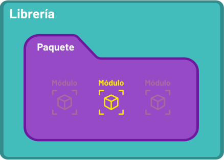
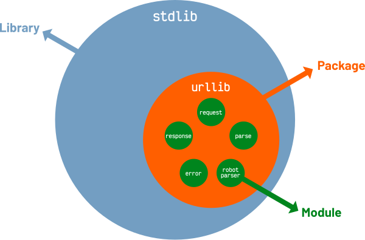
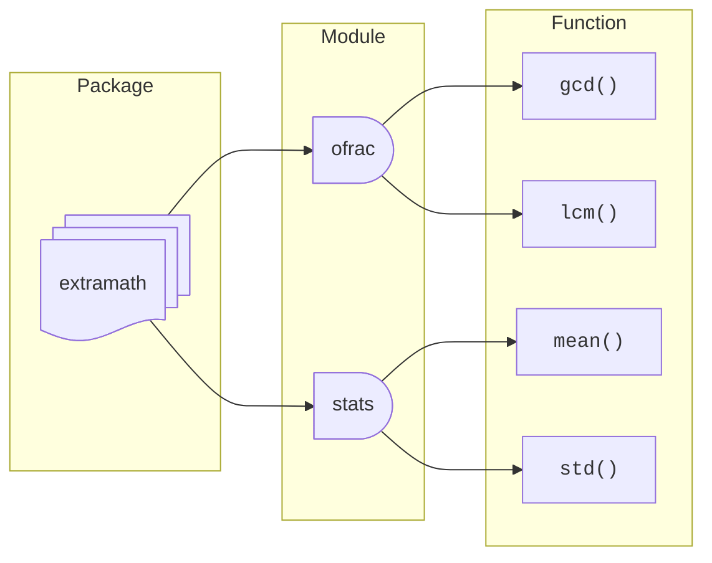

# Módulos { #modules }


(1)
{ .annotate }

1. :fontawesome-regular-copyright: [Xavi Cabrera](https://unsplash.com/@xavi_cabrera) :material-at: [Unsplash](https://unsplash.com) 

Escribir pequeños trozos de código puede resultar interesante para realizar determinadas pruebas o funcionalidades sencillas. Pero a la larga, **nuestros programas tenderán a crecer** y será necesario agrupar el código en piezas/artefactos más manejables.

## Módulos { #modules }

Un **módulo** en Python es simplemente un ^^fichero de texto^^ que contiene ^^código fuente^^. Permite evitar la repetición y favorece la reutilización.

Los módulos pueden agruparse en carpetas denominadas **paquetes** mientras que estas carpetas, a su vez, pueden dar lugar a **librerías**.



Un ejemplo de todo ello lo encontramos en la [librería estándar](https://docs.python.org/es/3/library/). Se trata de una librería que ya viene incorporada en Python y que, a su vez, dispone de una serie de paquetes que incluyen distintos módulos.

Un caso concreto dentro de la `stdlib` (libería estándar) podría ser el del paquete `urllib` —para operaciones con URLs— que dispone de 5 módulos:



### Importar un módulo completo { #full-import }

Para hacer uso del código de otros módulos usaremos la sentencia `#!python import`. Permite importar el código y las variables de dicho módulo para tenerlas disponibles en nuestro programa.

La forma más sencilla de importar un módulo es `#!python import module` donde `module` es el nombre de otro fichero Python, sin la extensión `.py`.

Partiremos del siguiente <span class="example">ejemplo:material-flash:</span> donse se ha implementado un módulo para cálculos estadísticos:

```python title="stats.py"
def mean(*values: int | float) -> float:
    """Calculate mean of values"""
    return sum(values) / len(values)


def std(*values: int | float) -> float:
    """Calculate standard deviation of values"""
    m = mean(*values)
    p = sum((v - m) ** 2 for v in values)
    return (p / (len(values) - 1)) ** (1 / 2)
```

Desde otro fichero (_en principio en la misma carpeta_) podríamos importar el contenido de `stats.py` para hacer uso de sus funcionalidades:

```pycon hl_lines="1"
>>> import stats

>>> stats.mean(6, 3, 9, 5)#(1)!
5.75
>>> stats.std(6, 3, 9, 5)#(2)!
2.5
```
{ .annotate }

1. Es necesario anteponer a la función `mean()` el [espacio de nombres](functions.md#namespaces) que define el módulo `stats`.
2. Es necesario anteponer a la función `std()` el [espacio de nombres](functions.md#namespaces) que define el módulo `stats`.

!!! info "Librería estándar"

    En el caso de utilizar un módulo de la librería estándar, basta con saber su nombre e importarlo directamente:

    ```python
    import os
    ```

#### Ruta de búsqueda de módulos { #pythonpath }

Cuando importamos un módulo en Python el intérprete trata de encontrarlo (por orden) en las rutas definidas dentro de la variable `sys.path`.

Veamos el contenido de la variable `sys.path` para el caso concreto de mi entorno de desarrollo:

```pycon linenums="1"
>>> import sys

>>> sys.path
['/Users/sdelquin/code/personal/aprendepython/.venv/bin',
 '/Users/sdelquin/.local/share/uv/python/cpython-3.13.2-macos-aarch64-none/lib/python313.zip',
 '/Users/sdelquin/.local/share/uv/python/cpython-3.13.2-macos-aarch64-none/lib/python3.13',
 '/Users/sdelquin/.local/share/uv/python/cpython-3.13.2-macos-aarch64-none/lib/python3.13/lib-dynload',
 '',
 '/Users/sdelquin/code/personal/aprendepython/.venv/lib/python3.13/site-packages']
```

- L4 :material-arrow-right-bold: Comandos ejecutables del entorno virtual.
- L5 :material-arrow-right-bold: Contiene módulos de la librería estándar en formato comprimido.
- L6 :material-arrow-right-bold: Carpeta con módulos adicionales que no pueden estar comprimidos (por ejemplo, archivos compilados en C).
- L7 :material-arrow-right-bold: Contiene las extensiones compartidas (`.so`, `.pyd`) que no pueden ejecutarse desde un ZIP.
- L8 :material-arrow-right-bold: Representa el directorio (carpeta) actual.
- L9 :material-arrow-right-bold: Paquetes instalados en el entorno virtual.

Podemos **modificar la ruta de búsqueda** de paquetes Python. Para ello existen dos opciones:

=== "Mediante `PYTHONPATH`"

    Modificando directamente la variable de entorno `PYTHONPATH`:

    ```bash
    export PYTHONPATH=/tmp
    ```

    Comprobamos que se ha modificado en `sys.path`:

    ```pycon hl_lines="5"
    >>> import sys
    
    >>> sys.path
    ['/Users/sdelquin/code/personal/aprendepython-mkdocs/.venv/bin',
     '/tmp',
     '/Users/sdelquin/.local/share/uv/python/cpython-3.13.2-macos-aarch64-none/lib/python313.zip',
     '/Users/sdelquin/.local/share/uv/python/cpython-3.13.2-macos-aarch64-none/lib/python3.13',
     '/Users/sdelquin/.local/share/uv/python/cpython-3.13.2-macos-aarch64-none/lib/python3.13/lib-dynload',
     '',
     '/Users/sdelquin/code/personal/aprendepython-mkdocs/.venv/lib/python3.13/site-packages']
    ```

=== "Mediante `sys.path`"

    Para ello accedemos directamente a la lista que está en el módulo `sys` de la librería estandar:

    ```pycon
    >>> import sys

    >>> sys.path.insert(0, '/tmp')#(1)!
    >>> sys.path[0]
    '/tmp'
    
    >>> sys.path.append('/tmp')#(2)!
    >>> sys.path[-1]
    '/tmp'
    ```
    { .annotate }
    
    1. Insertar por el principio.
    2. Insertar por el final.

!!! tip "Orden de rutas"

    El hecho de poner nuestra ruta al principio o al final de `sys.path` influye en la búsqueda, ya que si existen dos (o más módulos) que se llaman igual en nuestra ruta de búsqueda, Python usará el primero que encuentre.

### Importar partes de un módulo { #partial-import }

Es posible que no necesitemos todo aquello que está definido en `stats.py`. Por <span class="example">ejemplo:material-flash:</span> sólo vamos a calcular medias. En este caso la importación se hace de manera diferente:

```pycon hl_lines="1"
>>> from stats import mean

>>> mean(6, 3, 9, 5)#(1)!
5.75
```
{ .annotate }

1.  La función se utiliza sin ningún prefijo.

Este esquema tiene el inconveniente de la **posible colisión de nombres**, en aquellos casos en los que tuviéramos algún objeto con el mismo nombre que el objeto que estamos importando. Para estas (u otras) situaciones Python permite usar **alias** a través de la sentencia `#!python as`:

```pycon hl_lines="1"
>>> from stats import mean as avg

>>> avg(6, 3, 9, 5)
5.75
```

Para **importar varios objetos** (funciones en este caso) desde un mismo módulo, podemos especificarlos separados por comas en la misma línea:

```pycon
>>> from stats import mean, std
```

Es posible hacer `#!python from stats import *` pero estaríamos importando todos los componentes del módulo, cuando a lo mejor no es lo que necesitamos. A continuación una imagen que define bien este escenario:


## Paquetes { #packages }

Un **paquete** es simplemente una **carpeta** que contiene ficheros `.py`. Además permite tener una jerarquía con más de un nivel de subcarpetas anidadas.

Pongamos un <span class="example">ejemplo:material-flash:</span> creando un paquete `extramath` que contendrá dos módulos:

- [x] `stats.py` para cálculos estadísticos.
- [x] `ofrac.py` para operaciones auxiliares con fracciones.

El módulo `stats.py` ya se definió previamente [aquí](#full-import) y el código del módulo `ofrac.py` se presenta a continuación:

```python title="ofrac.py"
def gcd(a: int, b: int) -> int:
    """Greatest common divisor through Euclides Algorithm"""
    while b > 0:
        a, b = b, a % b
    return a


def lcm(a: int, b: int) -> int:
    """Least common multiple through Euclides Algorithm"""
    return a * b // gcd(a, b)
```

Si nuestro código principal va a estar en `main.py` (a primer nivel), la estructura de ficheros nos quedaría tal que así:

<div class="annotate" markdown>
```
.
├── main.py(1)
└── extramath(2)
    ├── ofrac.py(3)
    └── stats.py(4)

1 directory, 3 files
```
</div>
1. Punto de entrada de nuestro programa a partir del fichero `main.py`
2. Carpeta que define el paquete `extramath`.
3. Módulo para operaciones auxiliares de fracciones.
4. Módulo para cálculos estadísticos.

Si lo ponemos todo junto, nos quedaría un esquema como el siguiente:



### Importar desde un paquete { #import-from-package }

Si ya estamos en el fichero `main.py` (o a ese nivel) podremos hacer uso de nuestro paquete de la siguiente forma:

```pycon hl_lines="1"
>>> from extramath import frac, stats#(1)!

>>> frac.gcd(21, 35)#(2)!
7

>>> stats.mean(6, 3, 9, 5)#(3)!
5.75
```
{ .annotate }

1. Importar los módulos `frac` y `stats` del paquete `extramath` 
2. Uso de la función `gcd` que está definida en el módulo `frac` 
3. Uso de la función `mean` que está definida en el módulo `stats` 

## Programa principal { #main }

Cuando decidimos desarrollar un artefacto de software en Python, normalmente usamos distintos ficheros para ello. Algunos de esos ficheros se convertirán en [módulos](#modules), otros se englobarán en [paquetes](#packages) y existirá uno en concreto que será nuestro **punto de entrada**, también llamado **programa principal**.

La anatomía de un programa principal (habitualmente llamado `main.py`) es la siguiente:

```python title="main.py"
# imports de la librería estándar
# imports de librerías de terceros
# imports de módulos propios

# CÓDIGO PROPIO
# ...

if __name__ == '__main__':
    # punto de entrada real
```

Si queremos **ejecutar este fichero `main.py` desde línea de comandos**, tendríamos que hacer:

```bash
python main.py
```

### Punto de entrada { #entrypoint }

Tratemos de explicar cuál es el cometido de la sentencia: `#!python if __name__ == '__main__'`

Esta condición permite, en el programa principal, diferenciar qué codigo se lanzará cuando el fichero se ejecuta directamente o cuando el fichero se importa desde otro lugar.

La variable `__name__` puede tomar dos posibles valores:

- El nombre del módulo (o paquete) al **importar** el fichero.
- El valor `#!python '__main__'` al **ejecutar** el fichero.

Veamos el siguiente <span class="example">ejemplo:material-flash:</span> con el programa `hello.py` y analicemos su comportamiento según el escenario escogido:

```python title="hello.py" linenums="1"
import blabla


def myfunc():
    print('Inside myfunc')
    blabla.hi()


if __name__ == '__main__':
    print('Entry point')
    myfunc()
```


<div class="grid cards" markdown>

-   `#!python import hello`

    ---

    Se ejecutan las siguientes líneas (_desde arriba hacia abajo_):

    **L1**{.hl} :material-arrow-right-bold: se importa el módulo `blabla`.  
    **L4**{.hl} :material-arrow-right-bold: se define la función `myfunc` y estará disponible para usarse.  
    **L9**{.hl} :material-arrow-right-bold: **esta condición no se cumple**, ya que estamos ^^importando^^ y la variable especial `__name__` no toma ese valor. Con lo cual finaliza la ejecución.

    _:material-monitor-off: No hay salida por pantalla._{ .acc }

-   `#!bash python main.py`

    ---

    Se ejecutan las siguientes líneas (_desde arriba hacia abajo_):

    **L1**{.hl} :material-arrow-right-bold: se importa el módulo `blabla`.  
    **L4**{.hl} :material-arrow-right-bold: se define la función `myfunc` y estará disponible para usarse.  
    **L9**{.hl} :material-arrow-right-bold: **esta condición sí se cumple**, ya que estamos ejecutando directamente el fichero (_como programa principal_) y la variable especial `__name__` toma el valor `#!python '__main__'`.  
    **L10**{.hl} :material-arrow-right-bold: _:material-monitor: Entry point_{ .acc }  
    **L11**{.hl} :material-arrow-right-bold: llamada a la función `myfunc()`.  
    **L5**{.hl} :material-arrow-right-bold: _:material-monitor: Inside myfunc_{ .acc }  
    **L6**{.hl} :material-arrow-right-bold: llamada a la función `hi()` del módulo `blabla`.

</div>
