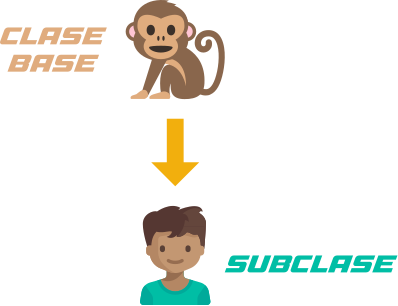

# Programación orientada a objetos { #oop }


(1)
{ .annotate }

1. :fontawesome-regular-copyright: [Rabie Madaci](https://unsplash.com/es/@rbmadaci) :material-at: [Unsplash](https://unsplash.com) 

La programación orientada a objetos ([POO](https://es.wikipedia.org/wiki/Programaci%C3%B3n_orientada_a_objetos)) o en sus siglas inglesas OOP es una manera de programar (paradigma) que permite llevar al código mecanismos similares a los utilizados con entidades de la vida real.

Algunos de sus beneficios son los siguientes:

<div class="grid cards" markdown>

-   Encapsulamiento

    ---

    Permite **empaquetar**{.hl} el código dentro de una unidad (objeto) donde se puede determinar el ámbito de actuación.

-   Abstracción

    ---

    Permite **generalizar**{.hl} los tipos de objetos a través de las clases y simplificar el programa.

-   Herencia

    ---

    Permite **reutilizar**{.hl} código al poder heredar atributos y comportamientos de una clase a otra.

-   Polimorfismo

    ---

    Permite **crear**{.hl} múltiples objetos a partir de una misma pieza flexible de código.

</div>

## Objetos { #objects }

Un **objeto** es una **estructura de datos personalizada** que contiene **datos** y **código**:

- Los **datos** son _variables_ que reciben el nombre de **atributos** en POO.
- El **código** son _funciones_ que reciben el nombre de **métodos** en POO.

Un objeto representa una **instancia única** de alguna entidad (a través de los valores de sus atributos) e interactúa con otros objetos (o consigo mismo) a través de sus métodos:


Para crear un objeto primero debemos definir **la clase que lo contiene**. Podemos pensar en **la clase como el molde** con el que se crean nuevos objetos de ese tipo:


:material-check-all:{ .blue } En el **proceso de diseño de una clase** hay que tener en cuenta —entre otros— el **principio de responsabilidad única**[^1], intentando que los atributos y los métodos que contenga esa clase estén enfocados a un objetivo único y bien definido.

### Creando clases { #making-classes }

Empecemos por crear nuestra **primera clase**. Durante todo este bloque pondremos <span class="example">ejemplos:material-flash:</span> de [droides de la saga StarWars](https://en.wikipedia.org/wiki/Droid_(Star_Wars)).


(1)
{ .annotate }

1. :fontawesome-regular-copyright: [Astro Mech Droids](https://www.facebook.com/astromechdroids/)

Para crear una clase en Python hay que utilizar la palabra reservada `#!python class` seguida del nombre de la clase:

```pycon
>>> class StarWarsDroid:#(1)!
...     pass#(2)!
...
```
{ .annotate }

1. Los nombres de las clases se suelen escribir en **singular** y con formato [`CamelCase`](https://peps.python.org/pep-0008/#class-names).
2. La sentencia `#!python pass` no hace nada, es simplemente un «placeholder».

### Creando objetos { #making-objects }

Existen multitud de droides en el universo StarWars. Una vez que hemos definido la clase genérica podemos crear **instancias/objetos** (droides) concretos:

```pycon
>>> c3po = StarWarsDroid()
>>> r2d2 = StarWarsDroid()
>>> bb8 = StarWarsDroid()
```

### Añadiendo métodos { #adding-methods }

Un **método** es una función que forma parte de una clase o de un objeto. En su ámbito tiene acceso a otros métodos y atributos de la clase o del objeto al que pertenece.

La definición de un método (de instancia) es análoga a la de una función ordinaria, pero incorporando un primer parámetro [`self`](https://docs.python.org/3/faq/design.html#why-must-self-be-used-explicitly-in-method-definitions-and-calls) que hace referencia a la instancia del objeto actual.

Veamos un <span class="example">ejemplo:material-flash:</span> sobre los droides. Una de las acciones más sencillas que se pueden hacer sobre un droide es **encenderlo o apagarlo**. La implementación podría ser algo así:

```pycon
>>> class Droid:#(1)!
...     def switch_on(self):
...         print("Hi! I'm a droid. Can I help you?")
...
...     def switch_off(self):
...         print("Bye! I'm going to sleep")
...
```
{ .annotate }

1. Por simplicidad llamaremos `Droid` a la clase de aquí en adelante.

Ahora ya podríamos utilizar estos métodos recién creados:

```pycon
>>> k2so = Droid()

>>> k2so.switch_on()
Hi! I'm a droid. Can I help you?

>>> k2so.switch_off()
Bye! I'm going to sleep
```

!!! tip "Orden de los métodos"

    El orden de definición de métodos dentro de la clase —a priori— no es importante.

### Añadiendo atributos { #adding-attributes }

Un **atributo** no es más que una variable, un nombre al que asignamos un valor, con la particularidad de _vivir dentro de una clase o de un objeto_.

Supongamos por <span class="example">ejemplo:material-flash:</span> que queremos **guardar el estado del droide** (encendido/apagado):

```pycon
>>> class Droid:
...     def switch_on(self):
...         self.power_on = True#(1)!
...         print("Hi! I'm a droid. Can I help you?")
...
...     def switch_off(self):
...         self.power_on = False#(2)!
...         print("Bye! I'm going to sleep")
...
```
{ .annotate }

1. Para que una variable se convierta en atributo de un objeto, debemos usar el prefijo `self.`
2. Modificamos el valor del atributo en función del método.

Probemos este código para ver su comportamiento:

```pycon
>>> k2so = Droid()

>>> k2so.switch_on()
Hi! I'm a droid. Can I help you?
>>> k2so.power_on
True

>>> k2so.switch_off()
Bye! I'm going to sleep
>>> k2so.power_on
False
```

### Inicialización { #init }

Existe un **método especial** que se ejecuta cuando creamos una instancia de un objeto. Este método es `#!python __init__` y nos permite asignar atributos y realizar operaciones con el objeto en el momento de su creación. También es ampliamente conocido como el **constructor**.

Veamos un <span class="example">ejemplo:material-flash:</span> de este método con nuestros droides en el que únicamente guardaremos el nombre del droide como un atributo del objeto:

```pycon
>>> class Droid:
...     def __init__(self, name: str):#(1)!
...         print('Running __init__')#(2)!
...         self.name = name#(3)!
...

>>> bb8 = Droid('BB-8')#(4)!
Running __init__

>>> bb8.name#(5)!
'BB-8'
```
{ .annotate }

1.  - El constructor recibe el nombre del droide.
    - Obviamente también recibe `#!python self` pero eso es generalizado.
2. Este mensaje es únicamente a efectos académicos.
3. Creamos un atributo y le asignamos el nombre indicado en el parámetro.
4. Al «llamar» a la clase se está invocando el método `#!python __init__()`
5. Ahora tendremos acceso al atributo `name` del objeto creado en el constructor.

Es importante tener en cuenta que si no usamos `#!python self` estaremos creando una variable local en vez de un atributo del objeto:

```pycon
>>> class Droid:
...     def __init__(self, name: str):
...         name = name  # 🤔
...

>>> bb8 = Droid('BB-8')

>>> bb8.name
Traceback (most recent call last):
  Cell In[3], line 1
    bb8.name
AttributeError: 'Droid' object has no attribute 'name'
```

!!! exercise "Ejercicio"

    [pypas](https://pypas.es) &nbsp;:fontawesome-solid-hand-holding-heart:{ .slide } `mobile-phone`

## Atributos { #attributes }

En esta sección se tratará en profundidad todo lo relacionado con los atributos.

### Acceso directo { #direct-access }

En el siguiente <span class="example">ejemplo:material-flash:</span> vemos que, aunque el atributo `name` se ha creado en el constructor de la clase, también podemos modificarlo desde «fuera» con un acceso directo:

```pycon
>>> class Droid:
...     def __init__(self, name: str):
...         self.name = name
...

>>> droid = Droid('C-3PO')

>>> droid.name
'C-3PO'

>>> droid.name = 'waka-waka'#(1)!
```
{ .annotate }

1. Esto sería válido.

Python nos permite **añadir atributos dinámicamente** a un objeto incluso después de su creación:

```pycon
>>> droid.manufacturer = 'Cybot Galactica'
>>> droid.height = 1.77
```
### Propiedades { #properties }

Aunque el uso de propiedades puede ir destinado a la «privacidad» de ciertos atributos, lo cierto es que en la mayoría de ocasiones, las utilizamos como **valores calculados**.

Mediante el [decorador](functions.md#decorators) `#!python @property` indicamos que un método se convierte en propiedad.

A modo de <span class="example">ejemplo:material-flash:</span>, supongamos que **la altura del periscopio** de los [droides astromecánicos](https://www.astromech.com.es/) se calcula siempre como un ^^porcentaje de su altura^^:

```pycon
>>> class AstromechDroid:
...     def __init__(self, name: str, height: float):#(1)!
...         self.name = name
...         self.height = height
...
...     @property#(2)!
...     def periscope_height(self) -> float:#(3)!
...         return 0.3 * self.height#(4)!
...
```
{ .annotate }

1. El constructor recibe el _nombre del droide_ y su _altura_.
2. Indicamos la creación de una propiedad.
3. Se aplica sobre un método que devuelve la altura del periscopio del droide (valor _flotante_).
4. 30% de la altura del droide.

Ahora veamos su aplicación práctica:

```pycon
>>> droid = AstromechDroid('R2-D2', 1.05)
>>> droid.periscope_height#(1)!
0.315
```
{ .annotate }

1. El acceso se realiza **como una atributo**, no se «llama» al método.

Una propiedad **no puede modificarse**[^2]:

```pycon hl_lines="5"
>>> droid.periscope_height = 0.645
Traceback (most recent call last):
  Cell In[1], line 1
    droid.periscope_height = 0.645
AttributeError: property 'periscope_height' of 'AstromechDroid' object has no setter
```

Las propiedades **no pueden recibir parámetros** ya que ni siquiera pueden ser invocadas:

```pycon hl_lines="17"
>>> class AstromechDroid:
...     def __init__(self, name: str, height: float):
...         self.name = name
...         self.height = height
...
...     @property
...     def periscope_height(self, from_ground: bool = False) -> float:
...         height_factor = 1.3 if from_ground else 0.3
...         return height_factor * self.height
...
>>> droid = AstromechDroid('R2-D2', 1.05)

>>> droid.periscope_height(from_ground=True)#(1)!
Traceback (most recent call last):
  Cell In[3], line 1
    droid.periscope_height(from_ground=True)
TypeError: 'float' object is not callable
```
{ .annotate }

1. En este caso tendríamos que implementar un método para resolver el escenario planteado.

!!! tip "Valores calculados"

    La ventaja de usar valores calculados sobre simples atributos es que el cambio de valor en un atributo no asegura que actualicemos otro atributo, y además siempre podremos modificar directamente el valor del atributo, con lo que podríamos obtener efectos colaterales indeseados.

#### Cacheando propiedades { #caching-properties }

En los casos anteriores hemos creado una propiedad que calcula el alto del periscopio de un droide astromecánico a partir de su altura. El «coste» de este cálculo es bajo, pero imaginemos por un momento que fuera muy alto. Si cada vez que accedemos a dicha propiedad tenemos que realizar ese cálculo, estaríamos siendo muy ineficientes (en el caso de que la altura del droide no cambiara).

A continuación se muestra un <span class="example">ejemplo:material-flash:</span> en el que usamos **cacheado de propiedades** para evitar ciertos cálculos innecesarios:

```pycon
>>> class AstromechDroid:
...     def __init__(self, name: str, height: float):
...         self.name = name
...         self.height = height#(1)!
...
...     @property
...     def height(self) -> float:
...         return self._height#(2)!
...
...     @height.setter#(3)!
...     def height(self, height: float) -> None:
...         self._height = height#(4)!
...         self._periscope_height = None#(5)!
...
...     @property
...     def periscope_height(self) -> float:
...         if self._periscope_height is None:#(6)!
...             print('Calculating periscope height...')
...             self._periscope_height = 0.3 * self.height
...         return self._periscope_height#(6)!
```
{ .annotate }

1. Lo que ocurre aquí es que se hace una llamada al «setter» `#!python @height.setter`.
2. Se utiliza un atributo `_height` para fijar la altura (de forma interna).
3. El [decorador](functions.md#decorators) `#!python @height.setter` hace que el método se llame cuando se asigne un valor al atributo `height`.
4. Modificación del atributo `_height` mediante el «setter».
5. Cuando la altura del droide cambia, es necesario **invalidar la caché**.
6. Sólo si se ha invalidado la caché se recalcula la altura del periscopio.
7. Se devuelve el atributo (interno) que lleva la altura del periscopio.

Probemos ahora la implementación diseñada:

```pycon
>>> droid = AstromechDroid('R2-D2', 1.05)

>>> droid.periscope_height#(1)!
Calculating periscope height...
0.315
>>> droid.periscope_height#(2)!
0.315

>>> droid.height = 1.15

>>> droid.periscope_height#(3)!
Calculating periscope height...
0.345
>>> droid.periscope_height#(4)!
0.345
```
{ .annotate }

1. La altura del droide ha cambiado (asignación en el constructor), por lo tanto se recalcula la altura del periscopio.
2. La altura del droide no ha cambiado, por lo tanto se devuelve la altura del periscopio precalculada.
3. La altura del droide ha cambiado (asignación manual), por lo tanto se recalcula la altura del periscopio.
4. La altura del droide no ha cambiado, por lo tanto se devuelve la altura del periscopio precalculada.

### Ocultando atributos { #hide-attributes }

Python tiene una convención sobre aquellos atributos que queremos hacer **«privados»** (u ocultos): comenzar el nombre con doble subguión `__`

A continuación se presenta un <span class="example">ejemplo:material-flash:</span> ocultando el nombre del droide:

```pycon
>>> class Droid:
...     def __init__(self, name: str):
...         self.__name = name
...
```

A la hora de acceder a este atributo obtendríamos un error:

```pycon hl_lines="7"
>>> droid = Droid('BC-44')

>>> droid.__name
Traceback (most recent call last):
  Cell In[2], line 1
    droid.__name
AttributeError: 'Droid' object has no attribute '__name'
```

Lo que realmente ocurre tras el telón se conoce como «name mangling» y consiste en modificar el nombre del atributo ^^incorporando la clase como un prefijo^^. Sabiendo esto podemos acceder al valor del atributo supuestamente privado:

```pycon
>>> droid._Droid__name
'BC-44'
```

### Atributos de clase { #class-attributes }

Hasta ahora hemos visto _atributos de objeto_ pero también es posible crear **atributos de clase**. Estos ^^serán asumidos por todos los objetos^^ instanciados a partir de dicha clase.

A modo de <span class="example">ejemplo:material-flash:</span> podemos suponer que **todos los droides están diseñados para que obedezcan a su dueño**. Esto lo podemos conseguir a nivel de clase, salvo que ese comportamiento se quisiera sobreescribir:

```pycon
>>> class Droid:
...     obeys_onwer = True#(1)!
...

>>> good_droid = Droid()
>>> good_droid.obeys_onwer#(2)!
True

>>> t1000 = Droid()
>>> t1000.obeys_onwer
True
>>> t1000.obeys_onwer = False#(3)!
>>> t1000.obeys_onwer
False

>>> Droid.obeys_onwer#(4)!
True
```
{ .annotate }

1.  - Un atributo de clase se define dentro de la clase asignándole un valor inicial.
    - Habitualmente van **antes que los métodos**.
2. Cualquier objeto creado contendrá este atributo de clase.
3. Python permite la modificación del atributo de clase (para una instancia concreta).
4. El cambio no afecta a nivel global de la clase.

!!! tip "Acceso"

    Los atributos de clase son accesibles tanto desde la clase como desde las instancias creadas.

Hay que tener en cuenta lo siguiente:

1. Si modificamos un atributo de clase desde un objeto, sólo modificamos el valor en el objeto y no en la clase.
2. Si modificamos un atributo de clase desde una clase, **modificamos el valor en todos los objetos pasados y futuros**.

Veamos un <span class="example">ejemplo:material-flash:</span> de este segundo caso:

```pycon hl_lines="13"
>>> class Droid:
...     obeys_owner = True
...

>>> droid1 = Droid()
>>> droid1.obeys_owner
True

>>> droid2 = Droid()
>>> droid2.obeys_owner
True

>>> Droid.obeys_owner = False#(1)!

>>> droid1.obeys_owner
False
>>> droid2.obeys_owner
False

>>> droid3 = Droid()
>>> droid3.obeys_owner
False
```
{ .annotate }

1. Cambia pasado y futuro.

La ^^explicación de este fenómeno^^ es la siguiente :material-arrow-right-bold: Todas las instancias (pasadas y futuras) del droide tienen un «atributo» `obeys_owner` que «apunta» a la misma zona de memoria que la del atributo `obeys_owner` de la clase:

```pycon
>>> id(Droid.obeys_owner)
4385213672
>>> id(droid1.obeys_owner)
4385213672
>>> id(droid2.obeys_owner)
4385213672
>>> id(droid3.obeys_owner)
4385213672
```


Supongamos que tras el cambio «global» de `obeys_owner` lo que buscamos es que **sólo se modifiquen los droides futuros pero no los pasados**.

Para poder abordar este escenario debemos recurrir a ^^atributos de instancia^^:

```pycon
>>> class Droid:
...     obeys_owner = True
...
...     def __init__(self):
...         self.obeys_owner = Droid.obeys_owner#(1)!
...
```
{ .annotate }

1. En este punto se crea un atributo propio del objeto creado, que toma el valor del atributo de clase, pero se desvincula de su posición de memoria.

Ahora veamos cuál es su comportamiento:

```pycon hl_lines="9"
>>> droid1 = Droid()
>>> droid1.obeys_owner
True

>>> droid2 = Droid()
>>> droid2.obeys_owner
True

>>> Droid.obeys_owner = False

>>> droid1.obeys_owner
True
>>> droid2.obeys_owner
True

>>> droid3 = Droid()
>>> droid3.obeys_owner
False
```


## Métodos { #methods }

En esta sección se tratará en profundidad todo lo relacionado con los métodos.

### Métodos de instancia { #instance-methods }

Un **método de instancia** es un método que ^^accede o modifica el estado del objeto^^ al que hace referencia. Recibe `#!python self` como primer parámetro, el cual se convierte en el propio objeto sobre el que estamos trabajando. Python envía este argumento de forma transparente: no hay que pasarlo como argumento.

Veamos un <span class="example">ejemplo:material-flash:</span> en el que, además del constructor, creamos un método de instancia para hacer que un droide se mueva:

```pycon
>>> class Droid:
...     def __init__(self, name: str):#(1)!
...         self.name = name
...         self.covered_distance = 0
...
...     def move_up(self, steps: int) -> None:#(2)!
...         self.covered_distance += steps
...         print(f'Moving {steps} steps')
...
```
{ .annotate }

1. El constructor también es un método de instancia.
2. Método de instancia para mover el droide.

Veamos su comportamiento:

```pycon
>>> droid = Droid('C1-10P')

>>> droid.move_up(10)
Moving 10 steps
```

#### Propiedades vs Métodos { #properties-vs-methods }

Es razonable plantearse cuándo usar [propiedades](#properties) o cuándo usar [métodos de instancia](#instance-methods). Si la implementación requiere de parámetros, no hay confusión, necesitamos usar métodos.

Pero más allá de esto, no existe una respuesta clara y concisa a la pregunta. Aunque sí podemos dar algunas «pistas» para saber cuándo usar propiedades o cuándo usar métodos:


### Métodos de clase { #class-methods }

Un **método de clase** es un método que ^^accede o modifica el estado de la clase^^ a la que hace referencia. Recibe `#!python cls` como primer parámetro, el cual se convierte en la propia clase (una referencia) sobre la que estamos trabajando. Python envía este argumento de forma transparente. La identificación de estos métodos se completa aplicando el [decorador](./functions.md#decorators) `#!python @classmethod` a la función.

Veamos un <span class="example">ejemplo:material-flash:</span> en el que implementamos un _método de clase_ que **muestra el número de droides creados**:

```pycon
>>> class Droid:
...     count = 0#(1)!
...
...     def __init__(self):
...         Droid.count += 1#(2)!
...
...     @classmethod#(3)!
...     def get_total_droids(cls) -> None:#(4)!
...         print(f'{cls.count} droids built so far!')#(5)!
...
```
{ .annotate }

1. Se trata de una variable de clase.
2. Incrementamos la variable de clase cada vez que se «construye» nuevo droide.
3. Uso del decorador que define un método de clase.
4. Los métodos de clase siempre reciben como primer parámetro `cls` haciendo referencia a la propia clase.
5. Accedemos a la cuenta de droides construidos.

Probemos el código anterior:

```pycon
>>> droid1 = Droid()
>>> droid2 = Droid()
>>> droid3 = Droid()

>>> Droid.get_total_droids()
3 droids built so far!
```

### Métodos estáticos { #static-methods }

Un **método estático** es un método que ^^no «debería» modificar el estado del objeto ni de la clase^^. No recibe ningún parámetro especial. La identificación de estos métodos se completa aplicando el [decorador](./functions.md#decorators) `#!python @staticmethod` a la función.

Veamos un <span class="example">ejemplo:material-flash:</span> en el que creamos un método estático para devolver **las categorías de droides** que existen en _StarWars_:

```pycon
>>> class Droid:
...     def __init__(self, name: str):
...         self.name = name
...
...     @staticmethod#(1)!
...     def get_droid_categories() -> tuple[str]:#(2)!
...         return ('MESSENGER', 'ASTROMECH', 'POWER', 'PROTOCOL')
...

>>> Droid.get_droid_categories()
('MESSENGER', 'ASTROMECH', 'POWER', 'PROTOCOL')
```
{ .annotate }

1. Uso del decorador para especificar que es un método estático.
2. El método no recibe ningún parámetro especial.

#### Decoradores en clases { #class-decorators }

Hay escenarios en los que puede interesar aplicar decoradores propios en métodos de una clase. El enfoque es el mismo que ya se ha visto en la sección de [decoradores](functions.md#decorators) pero con ciertos matices. Un decorador dentro de una clase debe ser un **método estático**.

A continuación veremos un <span class="example">ejemplo:material-flash:</span> en el que creamos un decorador **para comprobar que el droide está encendido** antes de realizar determinadas operaciones:

```pycon hl_lines="6-14"
>>> class Droid:
...     def __init__(self, name: str):
...         self.name = name
...         self.powered = False
...
...     @staticmethod#(1)!
...     def power_required(method):#(2)!
...         def wrapper(self, *args, **kwargs):#(3)!
...             if self.powered:#(4)!
...                 return method(self, *args, **kwargs)#(5)!
...             else:
...                 print('Droid must be powered to perform this action!')
...                 return None
...         return wrapper
...
...     def power_on(self):
...         self.powered = True
...
...     def power_off(self):
...         self.powered = False
...
...     @power_required#(6)!
...     def greet(self):
...         print(f"Hi there! I'm {self.name} at your service")
...
```
{ .annotate }

1. Un decorador debe ser un método estático.
2.  - Habitualmente usamos `func` como parámetro.
    - En este caso tiene sentido usar `method` ya que es una clase.
    - Al fin y al cabo sólo son convenciones.
3. Es un «wrapper» habitual.
4. Sólo se llamará al método decorado si el droide está encendido.
5.  - :fontawesome-solid-triangle-exclamation:{ .yellow } **Sólo en este caso** la llamada al método cambia.
    - `#!python self.method(*args, **kwargs)` :material-arrow-right-bold: `#!python method(self, *args, **kwargs)`
    - De no hacerlo así obtendríamos un error: `AttributeError: 'Droid' object has no attribute 'method'`
6. Aplicamos el decorador sobre este método.

Vamos ahora a poner en funcionamiento el código anterior y comprobar que el decorador está funcionando correctamente:

```pycon
>>> droid = Droid('B1')

>>> droid.greet()#(1)!
Droid must be powered to perform this action!

>>> droid.power_on()

>>> droid.greet()#(2)!
Hi there! I'm B1 at your service
```
{ .annotate }

1. El droide está apagado.
2. El droide está encendido.

!!! tip "Encapsulamiento"

    El decorador también se podría implementar fuera de la clase. Por una cuestión de encapsulamiento podría tener sentido dejarlo **dentro de la clase como método estático**.

### Métodos mágicos { #magic-methods }

Cuando escribimos `#!python 'hello world' * 3` ¿cómo sabe el objeto `#!python 'hello world'` lo que debe hacer para multiplicarse con el objeto entero `#!python 3`? O dicho de otra forma, ¿cuál es la implementación del operador `*` para «strings» e «int»? En valores numéricos puede parecer evidente (siguiendo los operadores matemáticos clásicos), pero no es así para otros objetos. La solución que proporciona Python para estas (y otras) situaciones son los **métodos mágicos**.

Los métodos mágicos empiezan y terminan por doble subguión `__` (es por ello que también se les conoce como «dunder-methods»). Uno de los «dunder-methods» más famosos ya lo hemos visto y es el constructor de la clase: `#!python __init__()`.

:material-check-all:{ .blue } Los métodos mágicos se «disparan» ~~automágicamente~~ automáticamente cuando utilizamos ciertas estructuras y expresiones del lenguaje.

#### Operadores { #magic-operators }

```mermaid
flowchart LR
    code["<tt>a == b</tt>"] --->|⚡| eq["<tt>\_\_eq__</tt>"]
```

Para el caso de los operadores también existe un método mágico asociado (que podemos personalizar). Por <span class="example">ejemplo:material-flash:</span> la **comparación de dos objetos** lanza el método mágico `#!python __eq__()`:



Extrapolando esta idea a nuestro universo _StarWars_, podríamos establecer que **dos droides son iguales si su nombre es igual**, independientemente de que tengan distintos números de serie:

```pycon hl_lines="6-7"
>>> class Droid:
...     def __init__(self, name: str, serial_number: int):
...         self.name = name
...         self.serial_number = serial_number
...
...     def __eq__(self, droid: Droid) -> bool:#(1)!
...         return self.name == droid.name#(2)!
...
```
{ .annotate }

1.  - El argumento que recibimos es el droide con el que comparar.
    - Para evitar un error de tipo (en la anotación) `NameError: name 'Droid' is not defined` es necesario importar esto: `#!python from __future__ import annotations`
2. La comparación se realiza a nivel de nombre de droide.

Comprobemos entonces si dos droides son iguales:

```pycon
>>> droid1 = Droid('C-3PO', 43974973242)
>>> droid2 = Droid('C-3PO', 85094905984)

>>> droid1 == droid2#(1)!
True
```
{ .annotate }

1. Llamada implícita a: `#!python droid1.__eq__(droid2)`

¿Pero qué pasaría si tratamos de comparar un droide con «cualquier otra cosa»?

```pycon hl_lines="7"
>>> droid1 == 'C-3PO'
Traceback (most recent call last):
  Cell In[8], line 1
    droid1 == 'C-3PO'
  Cell In[1], line 7 in __eq__
    return self.name == droid.name
AttributeError: 'str' object has no attribute 'name'
```

Obtendremos un error ya que un objeto de tipo «string» no dispone de un atributo `name`. Para resolver esto debemos cribar el objeto que vamos a comparar en función de su naturaleza:

```pycon hl_lines="7"
>>> class Droid:
...     def __init__(self, name: str, serial_number: int):
...         self.name = name
...         self.serial_number = serial_number
...
...     def __eq__(self, other) -> bool:
...         if isinstance(other, Droid):#(1)!
...             return self.name == droid.name
...         return False
...
```
{ .annotate }

1. Si es un droide lo tratamos como tal, en otro caso, los objetos no pueden ser iguales.

Ahora se puede comprobar que todo funciona según lo esperado:

```pycon
>>> droid1 = Droid('IG-88', 56548988761)
>>> droid2 = Droid('HK-47', 56548988761)

>>> droid1 == 'IG-88'
False

>>> droid1 == droid2
True
```

A continuación se presenta una tabla con métodos mágicos para operadores:

<div class="annotate" markdown>
<div class="grid cards" markdown>

-   Operadores de comparación

    ---

    | Operador | Método mágico |
    | --- | --- |
    | :material-code-equal: | `#!python __eq__` |
    | :material-code-not-equal: | `#!python __ne__` |
    | :material-code-less-than: | `#!python __lt__` |
    | :material-code-greater-than: | `#!python __gt__` |
    | :material-code-less-than-or-equal: | `#!python __le__` |
    | :material-code-greater-than-or-equal: | `#!python __ge__` |
    
-   Operadores aritméticos

    ---

    | Operador | Método mágico |
    | --- | --- |
    | :material-plus-box: | `#!python __add__` |
    | :material-minus-box: | `#!python __sub__` |
    | :material-multiplication-box: | `#!python __mul__` |
    | :material-slash-forward-box: | `#!python __truediv__`(1) |
    | :material-percent-box: | `#!python __mod__` |
    | :material-exponent-box: | `#!python __pow__` |

</div>
</div>
1. La división entera `//` lanza el método mágico `#!python __floordiv__`

!!! tip "Métodos especiales"

    Los métodos mágicos no sólo están restringidos a operadores de comparación o aritméticos. Existen muchos otros en la documentación oficial de Python, donde son llamados [métodos especiales](https://docs.python.org/es/3/reference/datamodel.html#special-method-names).

Veamos otro <span class="example">ejemplo:material-flash:</span> en el que **«sumamos» dos droides** (_esto se podría ver como una fusión_). Supongamos que la suma de dos droides implica: **a)** que el nombre del droide resultante es la concatenación de los nombres de los droides de entrada; **b)** que la energía del droide resultante es la suma de la energía de los droides de entrada:

```pycon
>>> class Droid:
...     def __init__(self, name: str, power: int):
...         self.name = name
...         self.power = power
...
...     def __add__(self, other):
...         if isinstance(other, Droid):
...             new_power = self.power + other.power#(1)!
...         elif isinstance(other, int):
...             new_power = self.power + other#(2)!
...         else:
...             new_power = self.power#(3)!
...         return Droid(self.name, new_power)
...
```
{ .annotate }

1. Suma de droide con droide.
2. Suma de droide con entero.
3. Suma de droide con cualquier otro tipo de dato.

Probamos ahora el operador en distintos escenarios:

```pycon
>>> droid1 = Droid('L3-37', 75)
>>> droid2 = Droid('M5-BZ', 47)

>>> droid = droid1 + droid2
>>> droid.power
122

>>> droid = droid1 + 25
>>> droid.power
100

>>> droid = droid2 + 'starwars'
>>> droid.power
47
```

#### `__str__` { #str }

Uno de los métodos mágicos más utilizados es `#!python __str__` y permite establecer la forma en la que un objeto es representado como _cadena de texto_.

Siguiendo con el <span class="example">ejemplo:material-flash:</span> del droide, veamos una implementación de este método:

```pycon
>>> class Droid:
...     def __init__(self, name: str, serial_number: int):
...         self.serial_number = serial_number
...         self.name = name
...
...     def __str__(self):#(1)!
...         return f'🤖 Droid "{self.name}" serial-no {self.serial_number}'
...
```
{ .annotate }

1. Este método **siempre** debe devolver un `#!python str`.

Existen tres ocasiones en las que se «dispara» el método mágico `#!python __str__()`:

```pycon
>>> print(droid)#(1)!
🤖 Droid "K-2SO" serial-no 8403898409432

>>> str(droid)#(2)!
'🤖 Droid "K-2SO" serial-no 8403898409432'

>>> f'Droid --> {droid}'#(3)!
'Droid --> 🤖 Droid "K-2SO" serial-no 8403898409432'
```
{ .annotate }

1. Imprimir el valor de un objeto.
2. Convertir a cadena de texto.
3. Interpolar un «f-string».

#### `__repr__` { #repr }

¿Por qué sale esto al ver el contenido de un objeto en un intérprete interactivo de Python ❯❯❯?

```pycon
>>> droid
<__main__.Droid object at 0x1052bb380>
```

Porque el método mágico que se ejecuta cuando mostramos un objeto en el intérprete es `#!python __repr__`(1) y suele estar más enfocado a una representación «técnica» del mismo.
{ .annotate }

1. También cuando usamos la función «built-in» `#!python repr()`.

!!! exercise "Ejercicio"

    [pypas](https://pypas.es) &nbsp;:fontawesome-solid-hand-holding-heart:{ .slide } `fraction`

#### Gestores de contexto { #context-manager }

Otra de las aplicaciones interesantes de los métodos mágicos/especiales son los **gestores de contexto**. Un gestor de contexto permite aplicar una serie de **acciones a la entrada y a la salida** del bloque de código que engloba.

Hay dos métodos que son utilizados para implementar los gestores de contexto:

| Método | Descripción |
| --- | --- |
| `__enter__` | :material-download-network: Acciones que se llevan a cabo al entrar al contexto. |
| `__exit__` | :material-upload-network: Acciones que se llevan a cabo al salir al contexto. |

Podemos encontrar gestores de contexto...

=== "... que no devuelven nada"

    A continuación se presenta un <span class="example">ejemplo:material-flash:</span> que muestra mensajes al comienzo y al final del contexto:

    ```pycon
    >>> class Greeting:#(1)!
    ...     def __enter__(self):#(2)!
    ...         print('Dear user, welcome to this context manager 👋')
    ...
    ...     def __exit__(self, exc_type, exc_value, exc_traceback):#(3)!
    ...         print('Bye bye! Have a nice day 🌻')
    ...
    ```
    { .annotate }
    
    1. Se trata de una clase como otra cualquiera.
    2. Acciones a realizar a la entrada del contexto.
    3.  - Acciones a realizar a la salida del contexto.
        - Es obligatorio definir los parámetros para control de excepciones: `exc_type` contendrá el tipo de la excepción, `exc_value` el valor de la excepción y `exc_traceback` la traza de la excepción.
        - Si el contexto terminó sin ningún error, los argumentos anteriores valdrán `#!python None`.

    Ahora podemos probar nuestro gestor de contexto:

    ```pycon
    >>> with Greeting():
    ...     items = [i**2 for i in range(10)]
    ...     print(items)
    ...
    Dear user, welcome to this context manager 👋
    [0, 1, 4, 9, 16, 25, 36, 49, 64, 81]
    Bye bye! Have a nice day 🌻
    ```

=== "... que devuelven un objeto"

    A continuación se presenta un <span class="example">ejemplo:material-flash:</span> que borra el rastro de un droide.

    Lo primero será definir la clase del droide:

    ```pycon
    >>> class Droid:
    ...     def __init__(self, name: str):
    ...         self.name = name
    ...         self.steps = []
    ...
    ...     def move(self, x: int, y: int) -> None:
    ...         self.steps.append((x, y))
    ...
    ```
    
    Ahora crearemos el gestor de contexto en sí mismo:

    ```pycon
    >>> class LazyDroid:
    ...     def __init__(self, name: str):#(1)!
    ...         self.droid = Droid(name)
    ...
    ...     def __enter__(self, name: str):#(2)!
    ...         return self.droid
    ...
    ...     def __exit__(self, exc_type, exc_value, exc_traceback):
    ...         self.droid.steps.clear()
    ...
    ```
    { .annotate }
    
    1. Los gestores de contexto también puede incluir constructor.
    2. Devolvemos el droide creado.
    3. Borramos sus pasos.

    Por último probemos la implementación:

    ```pycon
    >>> with LazyDroid('KT-QT') as droid:
    ...     droid.move(3, 7)
    ...     droid.move(4, 4)
    ...     droid.move(2, 9)
    ...     droid.move(5, 1)
    ...
    >>> droid.steps#(1)!
    []    
    ```
    { .annotate }
    
    1. Los pasos se han borrado gracias al gestor de contexto.

## Herencia { #inheritance }

La herencia es un mecanismo de OOP que consiste en construir una nueva clase partiendo de otra ya existente, añadiendo o modificando ciertos aspectos. La herencia se considera una buena práctica de programación tanto para reutilizar código como para realizar generalizaciones.

Se denomina **clase base** a la clase desde la que se hereda y **subclase** a la clase que ha heredado:



### Mecanismo de herencia { #inheritance-mecanism }

Para que una clase «herede» de otra, basta con indicar la clase base entre paréntesis en la definición de la subclase.

Empecemos con un <span class="example">ejemplo:material-flash:</span> sencillo en el que un _droide de protocolo_ hereda de un _droide_:

```pycon
>>> class Droid:#(1)!
...     pass#(2)!
...

>>> class ProtocolDroid(Droid):#(3)!
...     pass#(4)!
...
```
{ .annotate }

1. Clase base.
2. Por simplicidad no se ha añadido ningún código en la clase.
3. Subclase.
4. Por simplicidad no se ha añadido ningún código en la clase.

Hecho esto, podemos comprobar que realmente se cumple la herencia:

```pycon
>>> issubclass(ProtocolDroid, Droid)#(1)!
True
```
{ .annotate }

1. ¿Es `ProtocolDroid` una subclase de `Droid`? :material-check-circle:{.green}

Vamos ahora a añadir cierta funcionalidad a la clase base:

```pycon
>>> class Droid:
...     def switch_on(self):
...         print("Hi! I'm a droid. Can I help you?")
...
...     def switch_off(self):
...         print("Bye! I'm going to sleep")
...

>>> class ProtocolDroid(Droid):
...     pass
...
```

Y comprobemos cuál es el comportamiento en función de la herencia definida:

```pycon
>>> r2d2 = Droid()#(1)!
>>> c3po = ProtocolDroid()#(2)!

>>> r2d2.switch_on()#(3)!
Hi! I'm a droid. Can I help you?
>>> r2d2.switch_off()#(4)!
Bye! I'm going to sleep

>>> c3po.switch_on()#(5)!
Hi! I'm a droid. Can I help you?
>>> c3po.switch_off()#(6)!
Bye! I'm going to sleep
```
{ .annotate }

1. Creación de una instancia de droide (_clase base_).
2. Creación de una instancia de droide de protocolo (_subclase_).
3. Método definido en la clase base.
4. Método definido en la clase base.
5. Método definido en la clase base pero no en la subclase. Al haber heredado se puede utilizar sin ningún inconveniente.
5. Método definido en la clase base pero no en la subclase. Al haber heredado se puede utilizar sin ningún inconveniente.

### Sobreescribir un método { #method-override }

Como hemos visto, la subclase hereda todo lo que contiene su clase base. Pero hay ocasiones en las que nos interesa modificar este comportamiento.

En el siguiente <span class="example">ejemplo:material-flash:</span> vamos a personalizar el saludo de la subclase de _droide de protocolo_:

```pycon hl_lines="10-11"
>>> class Droid:
...     def switch_on(self):
...         print("Hi! I'm a droid. Can I help you?")
...
...     def switch_off(self):
...         print("Bye! I'm going to sleep")
...

>>> class ProtocolDroid(Droid):
...     def switch_on(self):
...         print("Hi! I'm a PROTOCOL droid. Can I help you?")
...
```

Veamos cómo afecta este cambio al comportamiento de los objetos creados:

```pycon hl_lines="9-10"
>>> r2d2 = Droid()#(1)!
>>> c3po = ProtocolDroid()#(2)!

>>> r2d2.switch_on()#(3)!
Hi! I'm a droid. Can I help you?
>>> r2d2.switch_off()#(4)!
Bye! I'm going to sleep

>>> c3po.switch_on()#(5)!
Hi! I'm a PROTOCOL droid. Can I help you?
>>> c3po.switch_off()#(6)!
Bye! I'm going to sleep
```
{ .annotate }

1. Creación de una instancia de droide (_clase base_).
2. Creación de una instancia de droide de protocolo (_subclase_).
3. Método definido en la clase base.
4. Método definido en la clase base.
5. Método definido en la clase base y en la subclase. Se aplica el de la subclase ya que sobreescribe al de la clase base.
5. Método definido en la clase base pero no en la subclase. Al haber heredado se puede utilizar sin ningún inconveniente.

### Añadir un método { #inheritance-add-method }

La subclase puede, como cualquier otra clase «ordinaria», añadir métodos que no estaban presentes en su clase base.

En el siguiente <span class="example">ejemplo:material-flash:</span> vamos a añadir un método `translate()` que permita a los _droides de protocolo_ **traducir cualquier mensaje**:

```pycon hl_lines="13-15"
>>> class Droid:
...     def switch_on(self):
...         print("Hi! I'm a droid. Can I help you?")
...
...     def switch_off(self):
...         print("Bye! I'm going to sleep")
...

>>> class ProtocolDroid(Droid):
...     def switch_on(self):
...         print("Hi! I'm a PROTOCOL droid. Can I help you?")
...
...     def translate(self, msg: str, *, from_lang: str) -> str:
...         """ Translate from language to Human understanding """
...         return f'{msg} means "ZASCA" in {from_lang}'
...
```

Probemos ahora esta implementación:

```pycon hl_lines="11"
>>> r2d2 = Droid()
>>> c3po = ProtocolDroid()

>>> c3po.translate('kiitos', from_lang='Hutese')#(1)!
'kiitos means "ZASCA" in Hutese'

>>> r2d2.translate('kiitos', from_lang='Huttese')#(2)!
Traceback (most recent call last):
  Cell In[4], line 1
    r2d2.translate('kiitos', from_lang='Huttese')
AttributeError: 'Droid' object has no attribute 'translate'
```
{ .annotate }

1.  Método definido en la subclase.
2.  - Este método sólo está definido en la subclase con lo cual no se puede utilizar desde la clase base.
    - Tiene sentido que falle ya que los droides que no son de protocolo no pueden traducir.

:material-check-all:{ .blue } Con esto ya hemos aportado una personalidad diferente a los droides de protocolo, a pesar de que heredan de la clase genérica de droides de StarWars.

### Resolver colisiones { #solving-collides }

Cuando tenemos métodos (o atributos) definidos con el mismo nombre en la clase base y en la clase derivada se produce una **colisión** y debe existir un mecanismo para diferenciarlos.

Para estos casos Python nos ofrece `#!python super()` como función para acceder a métodos (o atributos) de la clase base.

Este escenario es especialmente recurrente en el constructor de aquellas clases que heredan de otras y necesitan inicializar la clase base.

Veamos un <span class="example">ejemplo:material-flash:</span> más elaborado con nuestros droides:

```pycon hl_lines="8"
>>> class Droid:
...     def __init__(self, name: str):
...         self.name = name
...

>>> class ProtocolDroid(Droid):
...     def __init__(self, name: str, languages: list[str]):
...         super().__init__(name)#(1)!
...         self.languages = languages
...
```
{ .annotate }

1. Llamada al constructor de la clase base.

Probemos ahora la implementación anterior:

```pycon
>>> droid = ProtocolDroid('C-3PO', ['Ewokese', 'Huttese', 'Jawaese'])

>>> droid.name#(1)!
'C-3PO'

>>> droid.languages#(2)!
['Ewokese', 'Huttese', 'Jawaese']
```
{ .annotate }

1. Fijado en el constructor de la clase base.
2. Fijado en el constructor de la subclase.

### Herencia múltiple { #multiple-inheritance }

Aunque no está disponible en todos los lenguajes de programación, Python sí permite **heredar de múltiples clases base**.

Supongamos por <span class="example">ejemplo:material-flash:</span> que queremos modelar la siguiente estructura de clases con herencia múltiple:


La forma de definir herencia múltiple en Python es indicar las clases base dentro del paréntesis:

```pycon hl_lines="16 20"
>>> class Droid:
...     def greet(self):
...         return 'Here a droid'
...

>>> class ProtocolDroid(Droid):
...     def greet(self):
...         return 'Here a protocol droid'
...

>>> class AstromechDroid(Droid):
...     def greet(self):
...         return 'Here an astromech droid'
...

>>> class SuperDroid(ProtocolDroid, AstromechDroid):
...     pass
...

>>> class HyperDroid(AstromechDroid, ProtocolDroid):
...     pass
```

!!! warning "Orden de herencia"

    El orden en el que especificamos las clases base influye en el resultado final.

Podemos comprobar esta herencia múltiple de la siguiente manera:

```pycon
>>> issubclass(SuperDroid, (ProtocolDroid, AstromechDroid, Droid))#(1)!
True

>>> issubclass(HyperDroid, (AstromechDroid, ProtocolDroid, Droid))#(2)!
True
```
{ .annotate }

1.  - Un «superdroide» es una subclase de «droide de protocolo», «droide astromecánico» y «droide».
    - La función `issubclass()` también funciona con varias clases pasando una tupla.
2.  - Un «hiperdroide» es una subclase de «droide de astromecánico», «droide de protocolo» y «droide».
    - La función `issubclass()` también funciona con varias clases pasando una tupla.

¿Cómo se comportarán los métodos definidos en esta herencia múltiple?

```pycon
>>> super_droid = SuperDroid()
>>> hyper_droid = HyperDroid()

>>> super_droid.greet()#(1)!
'Here a protocol droid'

>>> hyper_droid.greet()#(2)!
'Here an astromech droid'
```
{ .annotate }

1. El método `greet()` más «cercano» en alguna clase base de `SuperDroid` sería el de `ProtocolDroid`.
2. El método `greet()` más «cercano» en alguna clase base de `HyperDroid` sería el de `AstromechDroid`.

#### Orden de resolución de métodos { #mro }

Si en una clase se hace referencia a un método o atributo que no existe, Python lo buscará en todas sus clases base. Pero es posible que exista una colisión en caso de que el método o el atributo buscado esté, a la vez, en varias clases base. En este caso, Python resuelve el conflicto a través del **orden de resolución de métodos**.

Todas las clases en Python disponen de un método especial llamado `mro()` «method resolution order» que devuelve una lista de las clases que se visitarían en caso de acceder a un método o a un atributo.

Podemos comprobar este hecho en el <span class="example">ejemplo:material-flash:</span> anterior de herencia múltiple de droides:

```pycon
>>> SuperDroid.mro()
[<class '__main__.SuperDroid'>,
 <class '__main__.ProtocolDroid'>,
 <class '__main__.AstromechDroid'>,
 <class '__main__.Droid'>,
 <class 'object'>]

>>> HyperDroid.mro()
[<class '__main__.HyperDroid'>,
 <class '__main__.AstromechDroid'>,
 <class '__main__.ProtocolDroid'>,
 <class '__main__.Droid'>,
 <class 'object'>]
```

:material-check-all:{ .blue } Todos los objetos en Python heredan, en primera instancia, de [`object`](https://docs.python.org/3/reference/datamodel.html). Esto se puede comprobar con el correspondiente `mro()` de cada objeto:

```pycon
>>> int.mro()
[int, object]

>>> str.mro()
[str, object]

>>> float.mro()
[float, object]

>>> tuple.mro()
[tuple, object]

>>> list.mro()
[list, object]

>>> bool.mro()#(1)!
[bool, int, object]
```
{ .annotate }

1. Es por este motivo que podemos encontrar comportamientos «numéricos» de valores booleanos.

Otra forma de comprobar lo anteriormente dicho sería ejecutar el siguiente fragmento de código:

```pycon
>>> PY_TYPES = (int, str, float, tuple, list, bool)
>>> all(issubclass(_type, object) for _type in PY_TYPES)
True
```

### Mixins { #mixins }

Hay situaciones en las que nos interesa incorporar una clase base «independiente» de la jerarquía establecida, y sólo a efectos de **tareas auxiliares o transversales**. Esta aproximación podría ayudar a evitar colisiones en métodos o atributos reduciendo la ambigüedad que añade la herencia múltiple. A estas clases auxiliares se las conoce como **«mixins»**.

Veamos une <span class="example">ejemplo:material-flash:</span> de un «mixin» que permite dejar registro de las operaciones realizadas:

```pycon hl_lines="1-3 11"
>>> class LoggerMixin:#(1)!
...     def log(self, message):#(2)!
...         print(f'[LOG] {message}')
...
>>> class Droid:#(3)!
...     def __init__(self):
...         self.pos = (0, 0)
...
>>> class ProtocolDroid(Droid, LoggerMixin):#(4)!
...     def move(self, x: int, y: int) -> None:
...         self.log(f'Moving droid to ({x}, {y})')#(5)!
...         self.pos = (x, y)
...
```
{ .annotate }

1. Un «mixin» debería ser algo genérico y no acoplado al contexto del problema.
2. Se define un método para mostrar mensajes.
3. Esta clase sería la clase base de la jerarquía propiamente del contexto del problema
4. Este clase hereda de la clase base `Droid` pero a su vez le otorgamos funcionalidades extra mediante el «mixin» `LoggerMixin`.
5. Podemos hacer uso del método `log()` ya que se ha heredado del «mixin» `LoggerMixin`.

Comprobemos el funcionamiento del código anterior:

```pycon hl_lines="6-7"
>>> droid = ProtocolDroid()

>>> droid.pos
(0, 0)

>>> droid.move(7, 2)
[LOG] Moving droid to (7, 2)

>>> droid.pos
(7, 2)
```

!!! exercise "Ejercicio"

    [pypas](https://pypas.es) &nbsp;:fontawesome-solid-hand-holding-heart:{ .slide } `file-inheritance`

### Agregación y composición { #aggcomp }

Aunque la herencia de clases nos permite modelar una gran cantidad de casos de uso en términos de **«is-a»** (_es un_), existen muchas otras situaciones en las que la ^^agregación^^ o la ^^composición^^ son una mejor opción. En este último caso ^^una clase se compone de otras clases^^: hablamos de una relación **«has-a»** (_tiene un_).

<div class="grid cards" markdown>

-  **Agregación** 

    ---

    La agregación implica que el objeto utilizado puede funcionar por sí mismo.

    

    «Una bicicleta tiene una linterna» 

-  **Composición** 

    ---

    La composición implica que el objeto utilizado no puede «funcionar» sin la presencia de su propietario.

    

    «Un ordenador tiene una CPU»
</div>

Veamos un <span class="example">ejemplo:material-flash:</span> de cada uno de ellos en el contexto de los droides de _StarWars_:

=== "Agregación"

    Hay droides que pueden ir «armados» con ciertas herramientas:

    ```pycon
    >>> class Tool:
    ...     def __init__(self, name: str):
    ...         self.name = name
    ...
    ...     def __str__(self):
    ...         return self.name.upper()
    ...
    >>> class Droid:
    ...     def __init__(self, name: str, serial_number: int, tool: Tool = None):#(1)!
    ...         self.name = name
    ...         self.serial_number = serial_number
    ...         self.tool = tool#(2)!
    ...
    ...     def __str__(self):
    ...         msg = f'Droid {self.name}'
    ...         if self.tool:
    ...             msg += f' armed with a {self.tool}'
    ...         return msg
    ...
    ```    
    { .annotate }
    
    1. En un modelo de agregación el objeto (herramienta) es opcional.
    2. Agregación de una herramienta al droide.

    Veamos una aplicación de la implementación anterior:

    ```pycon
    >>> lighter = Tool('lighter')
    >>> bb8 = Droid('BB-8', 48050989085439, lighter)
    >>> print(bb8)
    Droid BB-8 armed with a LIGHTER
    ```

=== "Composición"

    Todos los droides necesitan una batería para funcionar:

    ```pycon
    >>> class Battery:
    ...     def __init__(self, kw: float):
    ...         self.kw = kw
    ...
    ...     def __str__(self):
    ...         return f'{self.kw}kW BATTERY'
    ...
    >>> class Droid:
    ...     def __init__(self, name: str, serial_number: int, battery: Battery):#(1)!
    ...         self.name = name
    ...         self.serial_number = serial_number
    ...         self.battery = battery#(2)!
    ...
    ...     def __str__(self):
    ...         return f'Droid {self.name} built with a {self.battery}'
    ...
    ```
    { .annotate }
    
    1. En un modelo de composición el objeto (batería) es requerido.
    2. Composición de una batería en el droide.

    Veamos una aplicación de la implementación anterior:

    ```pycon
    >>> battery = Battery(47)
    >>> bb8 = Droid('BB-8', 48050989085439, battery)
    >>> print(bb8)
    Droid BB-8 built with a 47kW BATTERY
    ```

## Estructuras mágicas { #magic-structures }

Obviamente no existen estructuras mágicas, pero sí que hay estructuras de datos que deben implementar ciertos métodos mágicos (o especiales) para desarrollar su comportamiento.

En este apartado veremos algunas de ellas.

### Secuencias { #sequences }

Una **secuencia** en Python es un objeto en el que podemos **acceder a cada uno de sus elementos a través de un índice**, así como **calcular su longitud** total.

Algunos ejemplos de secuencias que ya se han visto incluyen [cadenas de texto](../datatypes/strings.md), [listas](../datastructures/lists.md) o [tuplas](../datastructures/tuples.md).

Una secuencia debe implementar, al menos, los siguientes métodos mágicos:


Como <span class="example">ejemplo:material-flash:</span>, podemos asumir que los droides de _StarWars_ **están ensamblados con distintas partes/componentes**. Veamos una implementación de este escenario:

```pycon
>>> class Droid:
...     def __init__(self, name: str, parts: list[str]):
...         self.name = name
...         self.parts = parts
...
...     def __getitem__(self, index: int) -> str:
...         return self.parts[index]
...
...     def __setitem__(self, index: int, part: str) -> None:
...         self.parts[index] = part
...
...     def __len__(self):
...         return len(self.parts)
...
```

Ahora podemos instanciar la clase anterior y probar su comportamiento:

```pycon
>>> droid = Droid('R2-D2', ['Radar Eye', 'Pocket Vent', 'Battery Box'])

>>> droid.parts
['Radar Eye', 'Pocket Vent', 'Battery Box']

>>> droid[0]#(1)!
'Radar Eye'
>>> droid[1]#(2)!
'Pocket Vent'
>>> droid[2]#(3)!
'Battery Box'

>>> droid[1] = 'Holographic Projector'#(4)!

>>> droid.parts
['Radar Eye', 'Holographic Projector', 'Battery Box']

>>> len(droid)#(5)!
3
```
{ .annotate }

1. `#!python droid.__getitem__(0)`
2. `#!python droid.__getitem__(1)`
3. `#!python droid.__getitem__(2)`
4. `#!python droid.__setitem__(1, 'Holographic Projector')`
5. `#!python droid.__len__()`

!!! exercise "Ejercicio"

    [pypas](https://pypas.es) &nbsp;:fontawesome-solid-hand-holding-heart:{ .slide } `infinite-list`

### Diccionarios { #dicts }

Los métodos `__getitem__()` y `__setitem()__` también se pueden aplicar para obtener o fijar valores en un estructura de tipo **diccionario**. La diferencia es que **en vez de manejar un índice manejamos una clave**.

Retomando el <span class="example">ejemplo:material-flash:</span> anterior de las partes de un droide vamos a plantear que **cada componente tenga asociada una versión**, lo que nos proporciona una estructura de tipo diccionario con clave (nombre de la parte) y valor (versión de la parte):

```pycon
>>> class Droid:
...     def __init__(self, name: str, parts: dict[str, float]):
...         self.name = name
...         self.parts = parts
...
...     def __getitem__(self, part: str) -> float | None:
...         return self.parts.get(part)
...
...     def __setitem__(self, part: str, version: float) -> None:
...         self.parts[part] = version
...
...     def __len__(self):
...         return len(self.parts)
```

Ahora podemos instanciar la clase anterior y probar su comportamiento:

```pycon
>>> droid = Droid(
...     'R2-D2',
...     {
...         'Radar Eye': 1.1,
...         'Pocket Vent': 3.0,
...         'Battery Box': 2.8
...     }
... )

>>> droid.parts
{'Radar Eye': 1.1, 'Pocket Vent': 3.0, 'Battery Box': 2.8}

>>> droid['Radar Eye']#(1)!
1.1
>>> droid['Pocket Vent']#(2)!
3.0
>>> droid['Battery Box']#(3)!
2.8

>>> droid['Pocket Vent'] = 3.1#(4)!

>>> droid.parts
{'Radar Eye': 1.1, 'Pocket Vent': 3.1, 'Battery Box': 2.8}

>>> len(droid)#(5)!
3
```
{ .annotate }

1. `#!python droid.__getitem__('Radar Eye')`
2. `#!python droid.__getitem__('Pocker Vent')`
3. `#!python droid.__getitem__('Battery Box')`
4. `#!python droid.__setitem__('Pocker Vent', 3.1)`
5. `#!python droid.__len__()`

### Iterables { #iterables }

Un objeto en Python se dice **iterable** si implementa el **protocolo de iteración**. Este protocolo permite «entregar» un valor del iterable cada vez que se «solicite».

Hay muchos tipos de datos iterables en Python que ya se han estudiado: [cadenas de texto](../datatypes/strings.md), [listas](../datastructures/lists.md), [tuplas](../datastructures/tuples.md), [conjuntos](../datastructures/sets.md), [diccionarios](../datastructures/dicts.md) o [ficheros](../datastructures/files.md).

Para ser un objeto iterable sólo es necesario implementar el método mágico `__iter__`. Este método **debe proporcionar una referencia al objeto iterador** que es quien se encargará de desarrollar el protocolo de iteración a través del método mágico `__next__`.


Veamos un <span class="example">ejemplo:material-flash:</span> del universo _StarWars_ partiendo de un modelo sencillo de droide:

```pycon
>>> class Droid:
...     def __init__(self, serial: int):
...         self.serial = serial
...
...     def __repr__(self):
...         return f'Droid: SN={self.serial}'
...
```

A continuación implementamos una factoría de droides ([Geonosis](https://starwars.fandom.com/es/wiki/F%C3%A1bricas_de_droides_de_Geonosis)) como un iterable:

```pycon
>>> class Geonosis:
...     def __init__(self, num_droids: int):
...         self.num_droids = num_droids
...         self.pointer = 0
...
...     def __iter__(self) -> object:#(1)!
...         return self
...
...     def __next__(self) -> Droid:#(2)!
...         if self.pointer >= self.num_droids:
...             raise StopIteration
...         droid = Droid(self.pointer)
...         self.pointer += 1
...         return droid
...
```
{ .annotate }

1. En este caso el iterador es el propio objeto, pero podría haber sido otro.
2. Protocolo de iteración.

Ahora podemos recorrer el iterable y obtener los droides que genera la factoría:

```pycon
>>> for droid in Geonosis(10):
...     print(droid)
...
Droid: SN=0
Droid: SN=1
Droid: SN=2
Droid: SN=3
Droid: SN=4
Droid: SN=5
Droid: SN=6
Droid: SN=7
Droid: SN=8
Droid: SN=9
```

Cuando utilizamos un bucle `for` para recorrer los elementos de un iterable, ocurren varias cosas:

1. Se obtiene el objeto iterador del iterable mediante `#!python iter()`.
2. Se hacen llamadas sucesivas a `#!python next()` sobre dicho iterador para obtener cada elemento del iterable.
3. Se para la iteración cuando el iterador lanza la excepción `StopIteration` (_protocolo de iteración_).

!!! exercise "Ejercicio"

    [pypas](https://pypas.es) &nbsp;:fontawesome-solid-hand-holding-heart:{ .slide } `fibonacci-iterable`

#### Iterables desde fuera { #iterables-outside }

Ahora que conocemos las interiodades de los iterables, podemos ver qué ocurre si los usamos desde un enfoque más funcional.

En primer lugar hay que conocer el uso de los métodos mágicos en el protocolo de iteración:

- `__iter()__` se invoca cuando se hace uso de la función `iter()`.
- `__next()__` se invoca cuando se hace uso de la función `next()`.

Teniendo esto en cuenta, probemos este <span class="example">ejemplo:material-flash:</span> para generar droides de una forma más «artesanal»:

```pycon
>>> factory = Geonosis(3)#(1)!

>>> factory_iterator = iter(factory)#(2)!

>>> next(factory_iterator)#(3)!
Droid: SN=0
>>> next(factory_iterator)#(4)!
Droid: SN=1
>>> next(factory_iterator)#(5)!
Droid: SN=2

>>> next(factory_iterator)#(6)!
Traceback (most recent call last):
  Cell In[6], line 1
    next(factory_iterator)
  Cell In[], line 11 in __next__
    raise StopIteration
StopIteration
```
{ .annotate }

1. Factoria para construir 3 droides.
2. Obtenemos el objeto iterador :material-arrow-right-bold: `#!python factory.__iter__()`
3. Pedimos el siguiente droide :material-arrow-right-bold: `#!python factory_iterator.__next__()`
4. Pedimos el siguiente droide :material-arrow-right-bold: `#!python factory_iterator.__next__()`
5. Pedimos el siguiente droide :material-arrow-right-bold: `#!python factory_iterator.__next__()`
6. No hay más droides, con lo cual el protocolo de iteración acaba con `StopIteration`.

Se da la circunstancia de que, en este caso, **no tenemos que crear el iterador** para poder obtener nuevos elementos:

```pycon
>>> next(Geonosis(3))
Droid: SN=0
```

Esto se debe básicamente a que **el iterador es el propio iterable**:

```pycon
>>> geon_iterable = Geonosis(3)
>>> geon_iterator = iter(geon_iterable)

>>> geon_iterable is geon_iterator
True
```

Otra característica importante es que **los iterables se agotan**. Lo podemos comprobar con el siguiente código:

```pycon
>>> geon = Geonosis(3)

>>> for droid in geon:
...     print(droid)
...
Droid: SN=0
Droid: SN=1
Droid: SN=2

>>> for droid in geon:#(1)!
...     print(droid)
```
{ .annotate }

1.  - El puntero `geon.pointer` vale 3, y por tanto ya no puede generar más droides.
    - Tendríamos que volver a inicializar el iterable.

#### Ejemplos de iterables { #iterable-examples }

Vamos a analizar herramientas ya vistas —entendiendo mejor su funcionamiento interno— en base a lo que ya sabemos sobre iterables.

=== "Enumeración"

    ```pycon
    >>> tool = enumerate([1, 2, 3])
    
    >>> iter(tool) is not None#(1)!
    True
    
    >>> iter(tool) == tool#(2)!
    True
    
    >>> next(tool)
    (0, 1)
    >>> next(tool)
    (1, 2)
    >>> next(tool)
    (2, 3)
    
    >>> next(tool)
    Traceback (most recent call last):
      Cell In[7], line 1
        next(tool)
    StopIteration
    ```
    { .annotate }
    
    1. Es iterable.
    2. Es su propio iterador.

=== "Rangos"

    ```pycon
    >>> tool = range(1, 4)
    
    >>> iter(tool) is not None#(1)!
    True
    
    >>> iter(tool) == tool#(2)!
    False
    
    >>> tool_iterator = iter(tool)
    
    >>> tool_iterator
    <range_iterator at 0x1100e6d60>
    
    >>> next(tool_iterator)
    1
    >>> next(tool_iterator)
    2
    >>> next(tool_iterator)
    3
    
    >>> next(tool_iterator)
    Traceback (most recent call last):
      Cell In[7], line 1
        next(tool_iterator)
    StopIteration
    ```
    { .annotate }
    
    1. Es iterable.
    2. Usa otro iterador.

    !!! info "Objetos de tipo rango"
    
        Los objetos de tipo `range` representan una secuencia inmutable de números. La ventaja de usar este tipo de objetos es que siempre se usa una cantidad fija (y pequeña) de memoria, independientemente del rango que represente (ya que solamente necesita almacenar los valores para start, stop y step, y calcula los valores intermedios a medida que los va necesitando).

=== "Invertir"

    ```pycon
    >>> tool = reversed([1, 2, 3])
    
    >>> iter(tool) is not None#(1)!
    True
    
    >>> iter(tool) == tool#(2)!
    True
    
    >>> next(tool)
    3
    >>> next(tool)
    2
    >>> next(tool)
    1
    
    >>> next(tool)  # protocolo de iteración!
    Traceback (most recent call last):
      Cell In[7], line 1
        next(tool)
    StopIteration
    ```
    { .annotate }
    
    1. Es iterable.
    2. Es su propio iterador.

=== "Comprimir"

    ```pycon
    >>> tool = zip([1, 2], [3, 4])
    
    >>> iter(tool) is not None#(1)!
    True
    
    >>> iter(tool) == tool#(2)!
    True
    
    >>> next(tool)
    (1, 3)
    >>> next(tool)
    (2, 4)
    
    >>> next(tool)  # protocolo de iteración!
    Traceback (most recent call last):
      Cell In[6], line 1
        next(tool)
    StopIteration
    ```
    { .annotate }
    
    1. Es iterable.
    2. Es su propio iterador.

=== "Generadores"

    ```pycon
    >>> def seq(n):
    ...     for i in range(1, n+1):
    ...         yield i
    ...
    
    >>> tool = seq(3)
    
    >>> iter(tool) is not None#(1)!
    True
    
    >>> iter(tool) == tool#(2)!
    True
    
    >>> next(tool)
    1
    >>> next(tool)
    2
    >>> next(tool)
    3
    
    >>> next(tool)  # protocolo de iteración!
    Traceback (most recent call last):
      Cell In[8], line 1
        next(tool)
    StopIteration
    ```    
    { .annotate }
    
    1. Es iterable.
    2. Es su propio iterador.

    !!! tip "Expresiones generadoras"
    
        Las mismas propiedades se aplican a expresiones generadoras.

=== "Listas"

    ```pycon
    >>> tool = [1, 2, 3]
    
    >>> iter(tool) is not None#(1)!
    True
    
    >>> iter(tool) == tool#(2)!
    False
    
    >>> tool_iterator = iter(tool)
    
    >>> tool_iterator
    <list_iterator at 0x1102492d0>
    
    >>> next(tool_iterator)
    1
    >>> next(tool_iterator)
    2
    >>> next(tool_iterator)
    3
    
    >>> next(tool_iterator)
    Traceback (most recent call last):
      Cell In[9], line 1
        next(tool_iterator)
    StopIteration
    ```
    { .annotate }
    
    1. Es iterable.
    2. Usa otro iterador.

=== "Tuplas"

    ```pycon
    >>> tool = tuple([1, 2, 3])
    
    >>> iter(tool) is not None#(1)!
    True
    
    >>> iter(tool) == tool#(2)!
    False
    
    >>> tool_iterator = iter(tool)
    
    >>> tool_iterator
    <tuple_iterator at 0x107255a50>
    
    >>> next(tool_iterator)
    1
    >>> next(tool_iterator)
    2
    >>> next(tool_iterator)
    3
    
    >>> next(tool_iterator)
    Traceback (most recent call last):
      Cell In[9], line 1
        next(tool_iterator)
    StopIteration
    ```
    { .annotate }
    
    1. Es iterable.
    2. Usa otro iterador.

=== "Cadenas de texto"

    ```pycon
    >>> tool = 'abc'
    
    >>> iter(tool) is not None#(1)!
    True
    
    >>> iter(tool) == tool#(2)!
    False
    
    >>> tool_iterator = iter(tool)
    
    >>> tool_iterator
    <str_ascii_iterator at 0x1078da7d0>
    
    >>> next(tool_iterator)
    'a'
    >>> next(tool_iterator)
    'b'
    >>> next(tool_iterator)
    'c'
    
    >>> next(tool_iterator)
    Traceback (most recent call last):
      Cell In[9], line 1
        next(tool_iterator)
    StopIteration
    ```
    { .annotate }
    
    1. Es iterable.
    2. Usa otro iterador.

=== "Diccionarios"

    ```pycon
    >>> tool = {'a': 1, 'b': 1}
    
    >>> iter(tool) is not None#(1)!
    True
    
    >>> iter(tool) == tool#(2)!
    False
    
    >>> tool_iterator = iter(tool)
    
    >>> tool_iterator
    <dict_keyiterator at 0x1070200e0>
    
    >>> next(tool_iterator)
    'a'
    >>> next(tool_iterator)
    'b'
    
    >>> next(tool_iterator)
    Traceback (most recent call last):
      Cell In[8], line 1
        next(tool_iterator)
    StopIteration
    ```
    { .annotate }
    
    1. Es iterable.
    2. Usa otro iterador.

    En el caso de los diccionarios existen varios iteradores disponibles:

=== "Conjuntos"

    ```pycon
    >>> tool = set([1, 2, 3])
    
    >>> iter(tool) is not None#(1)!
    True
    
    >>> iter(tool) == tool#(2)!
    False
    
    >>> tool_iterator = iter(tool)
    
    >>> tool_iterator
    <set_iterator at 0x10700e900>
    
    >>> next(tool_iterator)
    1
    >>> next(tool_iterator)
    2
    >>> next(tool_iterator)
    3
    
    >>> next(tool_iterator)
    Traceback (most recent call last):
      Cell In[9], line 1
        next(tool_iterator)
    StopIteration
    ```
    { .annotate }
    
    1. Es iterable.
    2. Usa otro iterador.

=== "Ficheros"

    ```pycon
    >>> f = open('data.txt')
    
    >>> iter(f) is not None#(1)!
    True
    
    >>> iter(f) == f#(2)!
    True
    
    >>> next(f)
    '1\n'
    >>> next(f)
    '2\n'
    >>> next(f)
    '3\n'
    
    >>> next(f)
    Traceback (most recent call last):
      Cell In[7], line 1
        next(f)
    StopIteration
    ```
    { .annotate }
    
    1. Es iterable.
    2. Es su propio iterador.

A continuación se presenta una tabla resumen de lo explicado anteriormente:

| Herramienta | Es iterable | Propio iterador | Múltiples iteradores |
| --- | --- | --- | --- |
| `enumerate()` | :material-check:{ .green } | :material-check:{ .green } | :material-cancel:{ .red }
| `reversed()` | :material-check:{ .green } | :material-check:{ .green } | :material-cancel:{ .red }
| `zip()` | :material-check:{ .green } | :material-check:{ .green } | :material-cancel:{ .red }
| `generator` | :material-check:{ .green } | :material-check:{ .green } | :material-cancel:{ .red }
| `file` | :material-check:{ .green } | :material-check:{ .green } | :material-cancel:{ .red }
| `list()` | :material-check:{ .green } | :material-cancel:{ .red } | :material-cancel:{ .red }
| `tuple()` | :material-check:{ .green } | :material-cancel:{ .red } | :material-cancel:{ .red }
| `str()` | :material-check:{ .green } | :material-cancel:{ .red } | :material-cancel:{ .red }
| `dict()` | :material-check:{ .green } | :material-cancel:{ .red } | :material-check:{ .green }
| `set()` | :material-check:{ .green } | :material-cancel:{ .red } | :material-cancel:{ .red }
| `range()` | :material-check:{ .green } | :material-cancel:{ .red } | :material-cancel:{ .red }

#### Generadores como iterables { #generators-as-iterables }

Como bien se ha visto en el apartado anterior, los generadores son iterables (e iteradores) en sí mismos. Nos podemos valer de esta propiedad para simplificar los artefactos implementados.

Veamos un <span class="example">ejemplo:material-flash:</span> de **factoría de droides** usando **generadores** en el _protocolo de iteración_:

```pycon
>>> class Geonosis:
...     def __init__(self, num_droids: int):
...         self.droids = (Droid(i) for i in range(num_droids))#(1)!
...
...     def __iter__(self) -> object:
...         return iter(self.droids)#(2)!
...
```
{ .annotate }

1.  - Usamos una [expresión generadora](functions.md#genexp) para construir los droides.
    - Al ser un generador los droides no son creados en este punto, sino cuando se requieran (comportamiento «lazy»).
2. El iterador que vamos a utilizar es el iterador del generador.

Probemos la implementación anterior:

```pycon
>>> for droid in Geonosis(3):
...     print(droid)
...
Droid: SN=0
Droid: SN=1
Droid: SN=2
```

??? tip "Listas como iterables"

    A nivel de rendimiento y escalabilidad, hay que entender que no es lo mismo utilizar una [lista](../datastructures/lists.md) que un [generador](functions.md#generators), aunque en muchos escenarios puede ser más que suficiente.
    
    A continuación se propone un <span class="example">ejemplo:material-flash:</span> de la **factoría de droides** mediante lista:

    ```pycon hl_lines="3"
    >>> class Geonosis:
    ...     def __init__(self, num_droids: int):
    ...         self.droids = [Droid(i) for i in range(num_droids)]#(1)!
    ...
    ...     def __iter__(self) -> object:
    ...         return iter(self.droids)#(2)!
    ...
    >>> for droid in Geonosis(3):
    ...     print(droid)
    ...
    Droid: SN=0
    Droid: SN=1
    Droid: SN=2
    ```
    { .annotate }

    1.  - Usamos una [lista](../datastructures/lists.md) para construir los droides.
        - Al ser una lista todos los droides son creados en este punto del código.
    2. El iterador que vamos a utilizar es el iterador de la lista.

!!! exercise "Ejercicio"

    [pypas](https://pypas.es) &nbsp;:fontawesome-solid-hand-holding-heart:{ .slide } `fibonacci-itergen`

## Anatomía de una clase { #class-anatomy }

Durante toda la sección hemos analizado con detalle los distintos componentes que forman una clase en Python. Pero cuando todo esto lo ponemos junto puede suponer un pequeño caos organizativo.

Aunque no existe ninguna indicación formal de la estructura de una clase, podríamos establecer el siguiente formato como guía de estilo:

```python
class CustomClass:
    """Descripción de la clase"""

    # ATRIBUTOS DE CLASE
    # CONSTRUCTOR
    # MÉTODOS MÁGICOS
    # PROPIEDADES
    # MÉTODOS DE INSTANCIA
    # MÉTODOS DE CLASE
    # MÉTODOS ESTÁTICOS
    # DECORADORES
```

## Ejercicios { #exercises }

1. [pypas](https://pypas.es) &nbsp;:fontawesome-solid-hand-holding-heart:{ .slide } `dna`
2. [pypas](https://pypas.es) &nbsp;:fontawesome-solid-hand-holding-heart:{ .slide } `istack`
3. [pypas](https://pypas.es) &nbsp;:fontawesome-solid-hand-holding-heart:{ .slide } `iqueue`
4. [pypas](https://pypas.es) &nbsp;:fontawesome-solid-hand-holding-heart:{ .slide } `date`


<!-- FOOTNOTES -->

[^1]: Principios [SOLID](https://es.wikipedia.org/wiki/SOLID).
[^2]: Las propiedades en Python son modificables cuando usamos mecanismos como los [setters](https://realpython.com/python-getter-setter/).
