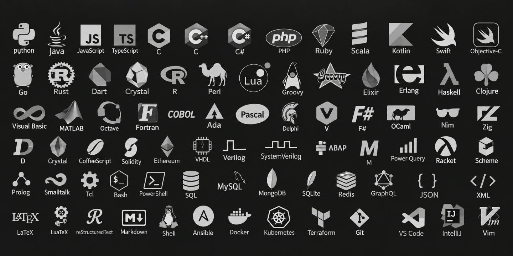

# Lenguajes de programación

/// caption
Imagen generada con Inteligencia Artificial
///

Un lenguaje de programación es un lenguaje formal que permite escribir instrucciones para que un ordenador pueda interpretarlas y ejecutar determinadas tareas.

## Número de lenguajes

El **número** actual de lenguajes de programación depende de lo que se considere un lenguaje de programación y a quién se pregunte:

| Organismo | Número de lenguajes |
| --- | --- |
| [TIOBE](https://www.tiobe.com/tiobe-index/programming-languages-definition/#instances) | :material-approximately-equal:250 |
| [Wikipedia](https://en.wikipedia.org/wiki/List_of_programming_languages) | :material-approximately-equal:700 |
| [Language List](http://www.info.univ-angers.fr/~gh/hilapr/langlist/langlist.htm) | :material-approximately-equal:2500 |
| [Online Historical Encyclopaedia of Programming Languages](http://hopl.info/) | :material-approximately-equal:9000 |

## Tipos de lenguajes según su paradigma

| Paradigma | Características principales | Ejemplos de lenguajes |
|---|---|---|
| **Imperativo** | El programa indica paso a paso las instrucciones que debe ejecutar el ordenador. | C, Pascal |
| **Procedimental** | Organiza el programa mediante procedimientos o funciones que realizan tareas concretas. | C, Pascal |
| **Orientado a objetos** | Organiza el programa mediante objetos que combinan datos y operaciones. | Java, C++, C# |
| **Funcional** | Se basa en funciones y en la transformación de datos, evitando en gran medida modificar estados. | Haskell, Lisp, Erlang |
| **Lógico** | El programa se describe mediante hechos y reglas, y el sistema obtiene las soluciones mediante inferencia lógica. | Prolog |
| **Declarativo** | Se especifica qué resultado se desea obtener, sin detallar necesariamente cómo debe calcularse. | SQL, Prolog |
| **Multiparadigma** | Permite utilizar características de varios paradigmas diferentes. | Python, JavaScript, C# |

## Tipos de lenguajes según su naturaleza

| Tipo | Características | Ejemplos |
|---|---|---|
| **Compilados** | El código fuente se traduce previamente a código máquina mediante un compilador, generando un programa ejecutable que puede ser ejecutado posteriormente. | C, C++, Rust, Go |
| **Interpretados** | El código fuente se ejecuta mediante un intérprete, que traduce y ejecuta las instrucciones durante la ejecución del programa. | JavaScript, Ruby |
| **Híbridos** | El código fuente se transforma primero a un código intermedio o «bytecode», que posteriormente es ejecutado por una máquina virtual o entorno de ejecución. | Java, C#, Python |

## Tipos de lenguajes según su compilación

| Tipo | Características | Ejemplos |
|---|---|---|
| **Sin máquina virtual** | El código se compila directamente a código máquina específico de la arquitectura del equipo. | C, C++, Rust, Go |
| **Con máquina virtual** | El código fuente se compila a un código intermedio («bytecode»), que posteriormente es ejecutado por una máquina virtual. | Java (JVM), C# (CLR), Kotlin (JVM) |
| **Con máquina virtual propia** | Utilizan una máquina virtual diseñada específicamente para el lenguaje o su implementación. | Python (PVM), Ruby (YARV) |

## Tipos de lenguajes según su propósito

| Tipo | Características | Ejemplos |
|---|---|---|
| **Propósito general (GPL)** | Diseñados para desarrollar una gran variedad de aplicaciones y resolver problemas de diferentes ámbitos. | C, C++, Java, Python, JavaScript |
| **Propósito específico (DSL)** | Diseñados para resolver problemas concretos o trabajar en un dominio determinado. | SQL, HTML, CSS, MATLAB, R |

## Tipos de lenguajes según su nivel de abstracción

| Nivel | Características | Ejemplos |
|---|---|---|
| **Bajo nivel** | Están muy próximos al funcionamiento interno del procesador y ofrecen poco nivel de abstracción respecto al hardware. | Lenguaje máquina, ensamblador |
| **Alto nivel** | Proporcionan un mayor nivel de abstracción, utilizando estructuras y conceptos más cercanos al lenguaje humano y al problema que se quiere resolver. | C, C++, Java, Python, JavaScript |
