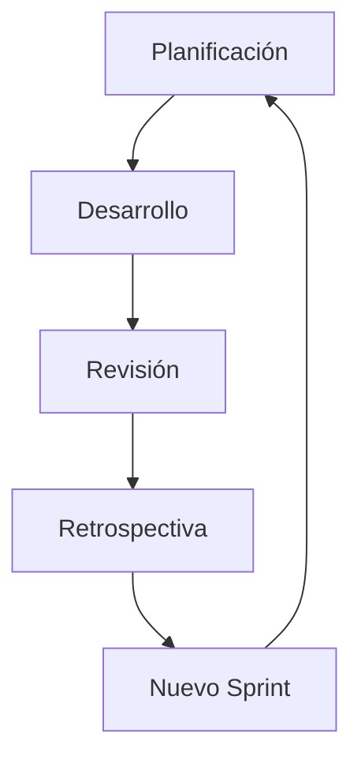
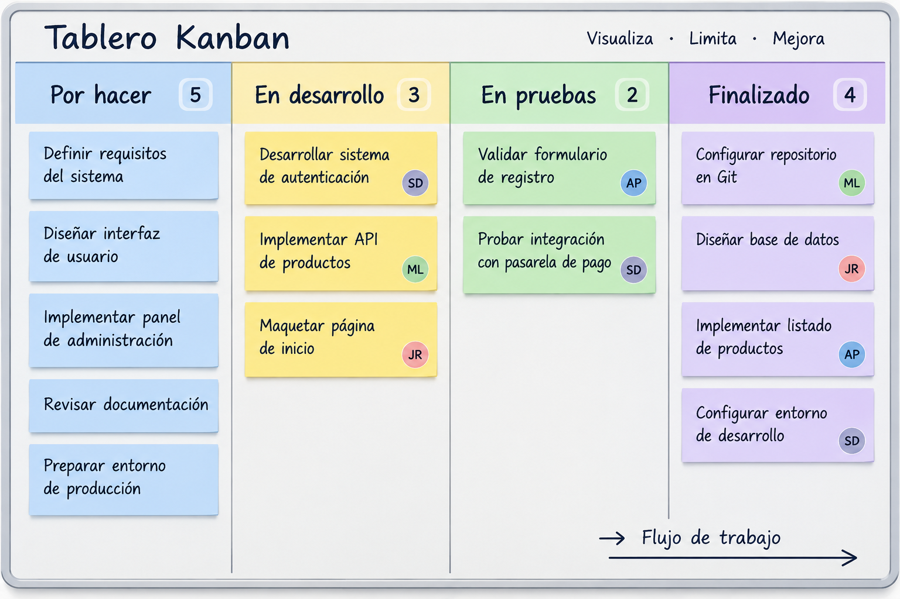

# Metodologías de desarrollo

/// caption
Imagen generada con Inteligencia Artificial
///

Las metodologías de desarrollo son conjuntos de métodos, técnicas y prácticas que permiten organizar y gestionar el proceso de desarrollo de una aplicación. Definen cómo se planifican las tareas, cómo se distribuye el trabajo y cómo se controla la evolución del proyecto. Existen diferentes metodologías, que pueden seguir un enfoque más tradicional y planificado o uno más flexible e iterativo, como ocurre con las metodologías ágiles.

## Scrum

Scrum es un marco de trabajo ágil utilizado para desarrollar productos, especialmente software, de forma iterativa e incremental. Su objetivo es dividir el trabajo en pequeños ciclos, denominados «sprints», de manera que el equipo pueda entregar incrementos funcionales del producto y adaptarse rápidamente a los cambios.

### Principios fundamentales

Scrum se basa en tres ideas principales:

1. Transparencia: el estado del trabajo y del producto debe ser visible y comprensible para todas las personas implicadas.
2. Inspección: el equipo revisa periódicamente el trabajo realizado para detectar problemas o desviaciones.
3. Adaptación: cuando se detecta un problema o cambia una necesidad, se modifica el plan para adaptarse a la nueva situación.

### Sprint

El desarrollo se organiza en períodos de tiempo fijos llamados «sprints», que normalmente duran entre una y cuatro semanas. Durante cada «sprint», el equipo trabaja en un conjunto de funcionalidades seleccionadas del producto.

Al finalizar el «sprint» se obtiene un incremento del producto, es decir, una versión funcional que aporta valor y que, idealmente, podría ponerse a disposición de los usuarios.

## Kanban

Kanban es un método ágil de gestión del trabajo que busca visualizar el flujo de tareas, limitar el trabajo en curso y mejorar continuamente el proceso. Se utiliza habitualmente en equipos de desarrollo de software, aunque puede aplicarse a muchos otros tipos de proyectos.

### Principios fundamentales

Kanban se basa en tres ideas principales:

1. Visualizar el trabajo: las tareas se representan en un tablero, permitiendo conocer fácilmente su estado.
2. Limitar el trabajo en curso (WIP): se establece un límite al número de tareas que pueden estar siendo realizadas simultáneamente, evitando la sobrecarga del equipo.
3. Mejorar continuamente: se analiza el flujo de trabajo para identificar problemas y realizar ajustes que permitan trabajar de forma más eficiente.

### Tablero

El elemento más característico de Kanban es el tablero, que representa las diferentes etapas por las que pasa una tarea.

Un tablero sencillo podría tener:

Cada tarea se representa mediante una tarjeta que se desplaza por las distintas columnas a medida que avanza el trabajo:

### Flujo continuo

A diferencia de Scrum, Kanban no requiere trabajar en iteraciones o sprints de duración fija. Las tareas se van incorporando al flujo de trabajo cuando existe capacidad para realizarlas.

Por tanto, mientras que Scrum organiza el trabajo en ciclos:

`Sprint → Sprint → Sprint → ...`

Kanban busca mantener un flujo continuo:

`Tarea → Tarea → Tarea → Tarea → ...`

Esto hace que Kanban sea especialmente adecuado para equipos que reciben trabajo de manera continua, como equipos de mantenimiento o soporte.

## Extreme programming

Extreme Programming (XP) es una metodología ágil de desarrollo de software que pone especial énfasis en la calidad del código, la colaboración del equipo y la capacidad de adaptarse a los cambios en los requisitos. Propone realizar entregas frecuentes y pequeñas, obteniendo continuamente información del cliente para mejorar el producto.

### Principios fundamentales

XP se basa en cinco ideas principales:

1. Comunicación: los desarrolladores y el cliente mantienen una comunicación constante para conocer las necesidades del proyecto.
2. Simplicidad: se implementa únicamente lo necesario, evitando añadir funcionalidades que no aporten valor.
3. Feedback: se busca obtener información rápidamente mediante pruebas y entregas frecuentes.
4. Coraje: el equipo debe estar dispuesto a modificar decisiones o código cuando sea necesario.
5. Respeto: todos los miembros del equipo deben colaborar y valorar el trabajo de los demás.

### Prácticas principales

XP destaca por utilizar prácticas concretas de programación:

* Programación por parejas (Pair Programming): dos desarrolladores trabajan juntos sobre el mismo código. Uno escribe y el otro revisa y propone mejoras.
* Desarrollo guiado por pruebas (TDD): primero se escriben las pruebas y después el código necesario para superarlas.
* Integración continua: los cambios se integran frecuentemente en el código principal para detectar problemas cuanto antes.
* Refactorización: se mejora continuamente la estructura interna del código sin modificar su comportamiento.
* Entregas frecuentes: se proporcionan versiones funcionales del producto de forma periódica.
* Diseño sencillo: se busca mantener el diseño lo más simple posible, evitando complejidad innecesaria.
