# Visual Studio Code


/// caption
Imagen generada con Inteligencia Artificial
///

[Visual Studio Code](https://code.visualstudio.com/) (también conocido por _VSCode_) es un entorno de desarrollo integrado IDE gratuito y de código abierto desarrollado por **Microsoft** :material-microsoft: que ha ganado mucha relevancia en los últimos años. Permite trabajar fácilmente con multitud de lenguajes de programación y dispone de una [gran cantidad de extensiones](#extensiones).

## Instalación

VSCode está disponible para distintos sistemas operativos con paquetes autoinstalables que se pueden descargar desde [este enlace](https://code.visualstudio.com/download).

## Interfaz de usuario

A continuación se presenta la interfaz de usuario de Visual Studio Code con sus principales componentes:

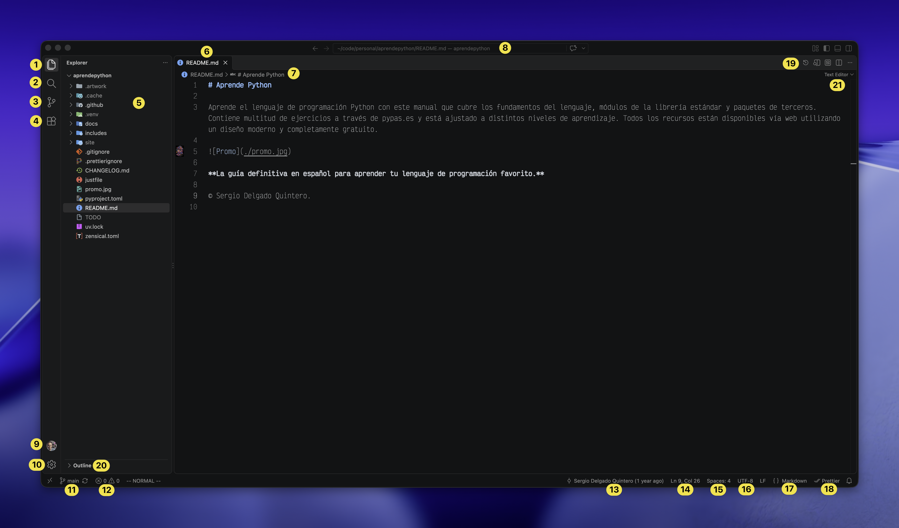

<div class="annotate" markdown>
1. Navegador de archivos.
2. Búsqueda de texto en todo el proyecto.(1)
3. Control de versiones.
4. Extensiones.
5. Árbol de carpetas y ficheros del proyecto.
6. Pestaña con el archivo actual abierto.
7. Migas de pan «breadcrumbs» (ruta) hasta el archivo actual.(2)
8. Ruta absoluta al archivo actual.
9. Cuenta de usuario (si se ha iniciado sesión).
10. Configuraciones generales.
11. Rama seleccionada del control de versiones.
12. Advertencias (_warnings_) o Errores (_errors_) en el proyecto.
13. Persona y fecha de los últimos cambios en el fichero actual.(3)
14. Número de línea y número de columna en el fichero actual.
15. Número de espacios definidos para un tabulador.
16. Codificación del archivo.(4)
17. Tipo de archivo.
18. Autoformateador activo para el archivo actual.(5)
19. Disposición de paneles.
20. Esquema «outline» del archivo actual.(6)
21. Opciones de visualización del archivo actual.(7)
</div>
1.  - Permite buscar un texto incluso mediante una [expresión regular](../../libreria/texto/re.md).
    - También permite especificar qué rutas se deben incluir y qué rutas se deben excuir.
2. Suele aparecer la almohadilla :octicons-hash-16: para identificar el símbolo actual.
3. Esto solo aparecerá si se tiene activa la opción «Git Blame Information» con botón derecho sobre la barra de estado.
4. Lo más habitual es que el fichero esté codificado en [UTF-8](https://es.wikipedia.org/wiki/UTF-8).
5. Esta opción solo estará disponible si realmente hay un autoformateador configurado.
6. Para el caso de ficheros markdown —por ejemplo— muestra los epígrafes del documento en modo árbol.
7. Para el caso de ficheros markdown —por ejemplo— permite mostrar la previsualización del documento.

!!! info "Diferencias en la interfaz"

    Es posible que tu interfaz de Visual Studio Code no sea exactamente igual a la que se presenta aquí. Esto puede deberse a múltiples factores: actualizaciones, configuraciones, personalizaciones etc. No te preocupes, lo importante es enteder los componentes del programa y su funcionalidad.

## Extensiones

VSCode proporciona muchas [extensiones](https://marketplace.visualstudio.com/vscode) que facilitan prácticamente cualquier tarea involucrada en el [desarrollo de software](../desarrollo/index.md).

### Instalación

Para [instalar extensiones](https://code.visualstudio.com/docs/configure/extensions/extension-marketplace) desde la propia interfaz de Visual Studio Code basta con acceder al icono :octicons-git-branch-16:{.acc} de la barra lateral izquierda, buscar la extensión en cuestión e instalarla.

También es posible [instalar extensiones desde línea de comandos](https://code.visualstudio.com/docs/configure/command-line#_working-with-extensions) de la siguiente manera:

```console
$ code --install-extension <extension-id>
```

??? info "Identificador de extensión"

    La forma de averiguar el `id` de una extensión es localizar el campo «Identifier» que está en los resultados de búsqueda de la propia extensión.

    Por <span class="example">ejemplo:material-flash:</span> para la extensión [Prettier](https://marketplace.visualstudio.com/items?itemName=esbenp.prettier-vscode) su identificador es `esbenp.prettier-vscode`:

    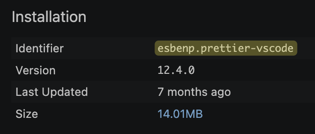

### Extensiones para Python

En el caso particular de desarrollo de código **Python :material-language-python:**{.green}, personalmente recomiendo las siguientes extensiones:

- [Python](https://marketplace.visualstudio.com/items?itemName=ms-python.python) → Soporte para el lenguaje Python con múltiples características.
- [Ruff](https://marketplace.visualstudio.com/items?itemName=charliermarsh.ruff) → Linter[^1] y formateador de código para Python (extremadamente rápido): [astral.sh/ruff](https://astral.sh/ruff).
- [Ty](https://marketplace.visualstudio.com/items?itemName=astral-sh.ty) → Servidor de lenguaje + Chequeador de tipos para Python: [astra.sh/ty](https://docs.astral.sh/ty/).

#### Ficheros de configuración

A continuación se muestran los ficheros de configuración _que yo utilizo_ para las **extensiones de Python**. Por supuesto, cada persona puede personalizarlos a su gusto:

=== "VSCode"

    ```yaml title="settings.json"
    {
        "python.languageServer": "None",#(1)!
        "python.analysis.ignore": ["*"],#(2)!
        "[python]": {
          "editor.formatOnSave": true,#(3)!
          "editor.defaultFormatter": "charliermarsh.ruff",#(4)!
          "editor.codeActionsOnSave": {#(5)!
            "source.organizeImports": "explicit",
            "source.fixAll": "explicit",
          },
        },
    }
    ```
    { .annotate }
    
    1. Deshabilitamos el servidor de lenguaje de Python que viene por defecto en la extensión oficial de Microsoft para Python para que no interfiera con **ty**.
    2. Deshabilitamos el análisis de código que viene por defecto en la extensión oficial de Microsoft para Python para que no interfiera con **ruff**.
    3. Habilitamos el formateo automático al guardar.
    4. Indicamos que el formateador por defecto para Python es **ruff**.
    5. Indicamos que al guardar se apliquen las acciones de organizar «imports» y arreglar todo lo posible.

    Ubicación del fichero de configuración de VSCode:

    === ":fontawesome-brands-windows: Windows"
    
        `%APPDATA%\Code\User\settings.json`

    === ":simple-apple: macOS"

        `~/Library/Application Support/Code/User/settings.json`

    === ":simple-linux: Linux"

        `~/.config/Code/User/settings.json`

=== "Ruff"

    ```toml title="ruff.toml"
    line-length = 100#(1)!
    
    [lint]
    extend-select = ["Q", "ARG001"]#(2)!
    
    [lint.flake8-quotes]
    inline-quotes = "single"#(3)!
    
    [format]
    quote-style = "single"#(4)!
    
    [lint.flake8-unused-arguments]
    ignore-variadic-names = true#(5)!
    ```    
    { .annotate }
    
    1. [https://docs.astral.sh/ruff/settings/#line-length](https://docs.astral.sh/ruff/settings/#line-length)
    2. [https://docs.astral.sh/ruff/settings/#lint_extend-select](https://docs.astral.sh/ruff/settings/#lint_extend-select)
    3. [https://docs.astral.sh/ruff/settings/#lint_flake8-quotes_inline-quotes](https://docs.astral.sh/ruff/settings/#lint_flake8-quotes_inline-quotes)
    4. [https://docs.astral.sh/ruff/settings/#format_quote-style](https://docs.astral.sh/ruff/settings/#format_quote-style)
    5. [https://docs.astral.sh/ruff/settings/#lint_flake8-unused-arguments_ignore-variadic-names](https://docs.astral.sh/ruff/settings/#lint_flake8-unused-arguments_ignore-variadic-names)

    Ubicación del fichero de configuración de Ruff:

    === ":fontawesome-brands-windows: Windows"
    
        `%APPDATA%\ruff\ruff.toml`

    === ":simple-apple: macOS"

        `~/.config/ruff/ruff.toml`

    === ":simple-linux: Linux"

        `~/.config/ruff/ruff.toml`

=== "Ty"

    ```toml title="ty.toml"
    [rules]
    unresolved-attribute = "ignore"#(1)!
    invalid-parameter-default = "ignore"#(2)!
    possibly-missing-attribute = "ignore"#(3)!
    ```
    { .annotate }
    
    1. [https://docs.astral.sh/ty/reference/rules/#unresolved-attribute](https://docs.astral.sh/ty/reference/rules/#unresolved-attribute)
    2. [https://docs.astral.sh/ty/reference/rules/#invalid-parameter-default](https://docs.astral.sh/ty/reference/rules/#invalid-parameter-default)
    3. [https://docs.astral.sh/ty/reference/rules/#possibly-missing-attribute](https://docs.astral.sh/ty/reference/rules/#possibly-missing-attribute)

    Ubicación del fichero de configuración de Ty:

    === ":fontawesome-brands-windows: Windows"
    
        `%APPDATA%\ty\ty.toml`

    === ":simple-apple: macOS"

        `~/.config/ty/ty.toml`

    === ":simple-linux: Linux"

        `~/.config/ty/ty.toml`
    
!!! danger "Extensiones y rendimiento"

    Hay que tener presente que cada extensión instalada es un «servicio» más que se añade a Visual Studio Code, y como tal, consume recursos. Esto significa que debemos llegar a un compromiso entre el número de extensiones instaladas y el rendimiento global del programa, ya que, si no lo controlamos, puede que se deteriore el funcionamiento del mismo.

## Atajos de teclado

Conocer los atajos de teclado de tu editor favorito es fundamental para mejorar el flujo de trabajo y ser más productivo. Veamos los principales atajos de teclado[^2] de Visual Studio Code:

=== "Ajustes generales"

    | Acción | Atajo |
    | --- | --- |
    | Abrir paleta de comandos | ++ctrl+shift+p++ |
    | Abrir archivo | ++ctrl+p++ |
    | Nueva ventana | ++ctrl+shift+n++ |
    | Cerrar ventana | ++ctrl+shift+w++ |

=== "Usabilidad"

    | Acción | Atajo |
    | --- | --- |
    | Crear un nuevo archivo | ++ctrl+n++ |
    | Abrir archivo | ++ctrl+o++ |
    | Guardar archivo | ++ctrl+s++ |
    | Cerrar | ++ctrl+f4++ |
    | Panel de problemas | ++ctrl+shift+m++ |

=== "Edición básica"

    | Acción | Atajo |
    | --- | --- |
    | Cortar línea | ++ctrl+x++ |
    | Copiar línea | ++ctrl+c++ |
    | Borrar línea | ++ctrl+shift+k++ |
    | Insertar línea debajo | ++enter++ |
    | Insertar línea encima | ++ctrl+shift+enter++ |
    | Buscar en archivo abierto | ++ctrl+f++ |
    | Buscar símbolo en archivo abierto | ++alt+shift+o++ |
    | Reemplazar | ++ctrl+h++ |
    | Línea de comentario | ++ctrl+shift+7++ |
    | Bloque de comentario | ++shift+alt+a++ |
    | Salto de línea | ++alt+z++ |
    | Tabular línea | ++tab++ |
    | Destabular línea | ++shift+tab++ |
    | Renombrar símbolo | ++f2++ |

=== "Pantalla"

    | Acción | Atajo |
    | --- | --- |
    | Mostrar barra lateral | ++ctrl+b++ |
    | Abrir debug | ++ctrl+shift+d++ |
    | Panel de salida | ++ctrl+shift+u++ |
    | Control de source | ++ctrl+shift+g++ |
    | Extensiones | ++ctrl+shift+x++ |

!!! tip "macOS"

    En **macOS :material-apple:** sustituye ++ctrl++ por ++command++

## Depurando código

La **depuración de programas** es el proceso de **identificar y corregir errores de programación**.​ Es conocido también por el término inglés «debugging», cuyo significado es eliminación de bugs (bichos), manera en que se conoce informalmente a los errores de programación.

Existen varias herramientas de depuración (o _debuggers_). Algunas de ellas en modo texto (terminal) y otras con entorno gráfico (ventanas):

- La herramienta más extendida en el mundo Python para **depurar en modo texto** es el módulo [pdb](https://docs.python.org/3/library/pdb.html) (The Python Debugger). Viene incluido en la instalación base de Python y es realmente potente.
- Aunque existen varias herramientas para **depurar en entorno gráfico** nos vamos a centrar en [Visual Studio Code](https://code.visualstudio.com/docs/python/debugging)

!!! success "Python Debugger Extension"

    Para poder depurar código Python en Visual Studio Code necesitamos tener instalada la extensión [Python Debugger](https://marketplace.visualstudio.com/items?itemName=ms-python.debugpy).

Lo primero será abrir el fichero [`fibonacci.py`](./files/vscode/fibonacci.py) (como <span class="example">ejemplo:material-flash:</span>) sobre que el que vamos a trabajar:

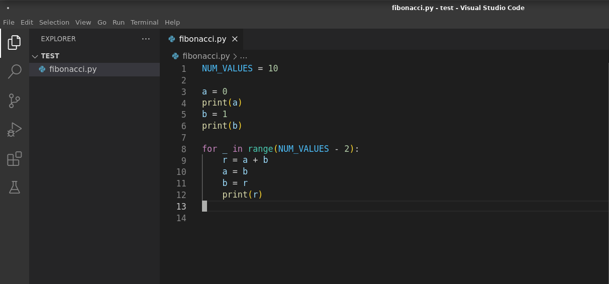

### Punto de ruptura

A continuación pondremos un **punto de ruptura** (también llamado «breakpoint»). Esto implica que la ejecución se pare en ese punto que viene indicado por un punto rojo :octicons-dot-fill-16:{ .red }. Para ponerlo nos tenemos que acercar a la columna que hay a la izquierda del número de línea y hacer clic.

En este ejemplo ponemos un punto de ruptura en la ^^línea 10^^:

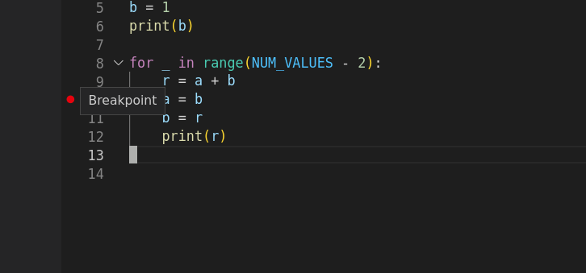
///caption
Punto de ruptura en VSCode
///

También es posible añadir **puntos de ruptura condicionales** pulsando con el botón derecho y luego «Add Conditional Breakpoint»:

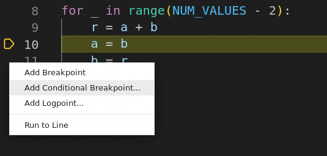
///caption
Condiciones para punto de ruptura en VSCode
///

### Lanzar la depuración

Ahora ya podemos lanzar la depuración pulsando la tecla ++f5++.

Nos aparecerá una primera pantalla donde tendremos que elegir el depurador. Aquí dejaremos la opción por defecto «Python Debugger» (o en español «Depurador de Python») y pulsamos ++enter++:

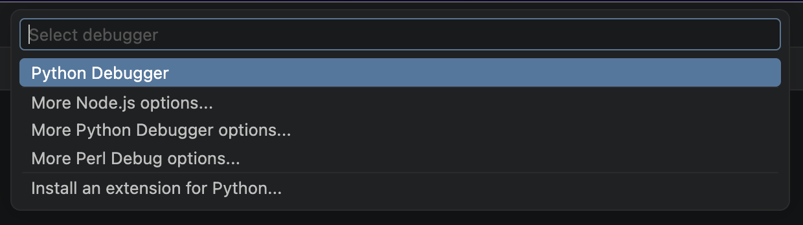
///caption
Elección del depurador en VSCode
///

Después de esto tendremos una segunda pantalla para elegir la configuración de la depuración. La opción por defecto «Python File» (o en español «Fichero de Python») es suficiente:

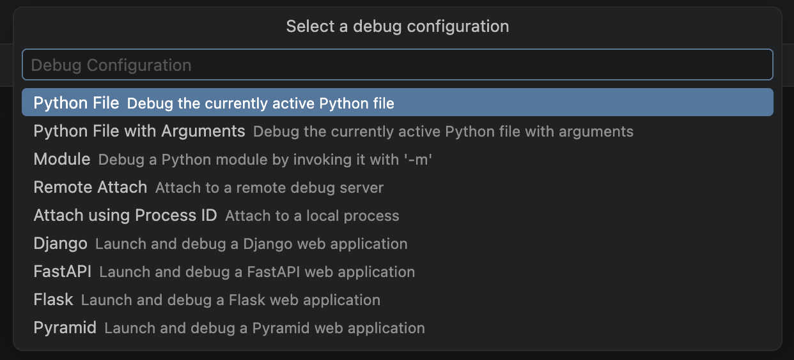
///caption
Configuración de depuración en VSCode
///

!!! tip "Argumentos"

    La opción «Python File with Arguments» es interesante ya que nos permite depurar un fichero Python pasándole ciertos [argumentos por línea de comandos](../../fundamentos/estructuras/listas.md#sysargv).

Ahora ya se inicia el «modo depuración» y veremos una pantalla similar a la siguiente:

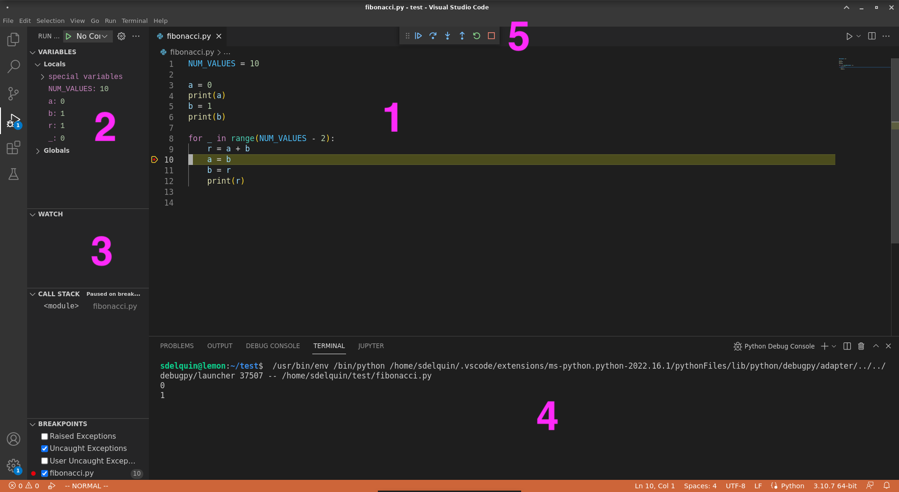
///caption
Paneles de depuración en VSCode
///

Zonas de la interfaz en modo depuración:

1. Código con barra en amarillo que indica la próxima línea que se va a ejecutar.
2. Visualización automática de valores de variables.
3. Visualización personalizada de valores de variables (o expresiones).
4. Salida de la terminal.
5. Barra de herramientas para depuración.

### Controles para depuración

Veamos con mayor detalle la **barra de herramientas** para depuración:

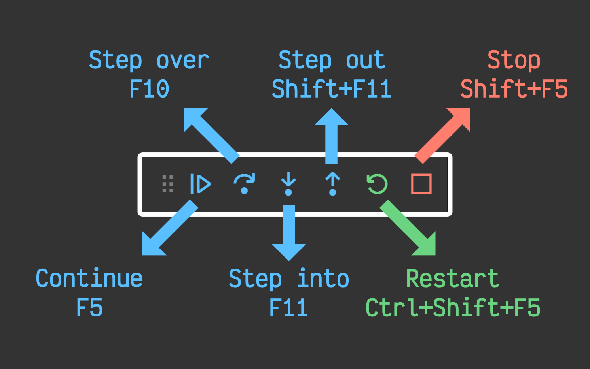

|    Acción     |       Atajo       |                                          Significado                                           |
| ------------- | ----------------- | ---------------------------------------------------------------------------------------------- |
| **Continue**  | ++f5++            | Continuar la ejecución del programa hasta el próximo punto de ruptura o hasta su finalización. |
| **Step over** | ++f10++           | Ejecutar la siguiente instrucción del programa.                                                |
| **Step into** | ++f11++           | Ejecutar la siguiente instrucción del programa entrando en un contexto inferior.               |
| **Step out**  | ++shift+f11++     | Ejecutar la siguiente instrucción del programa saliendo a un contexto superior.                |
| **Restart**   | ++ctrl+shift+f5++ | Reiniciar la depuración del programa.                                                          |
| **Stop**      | ++shift+f5++      | Detener la depuración del programa.                                                            |

### Seguimiento de variables

Como hemos indicado previamente, la zona «VARIABLES» ya nos informa automáticamente de los valores de las variables que tengamos en el contexto actual de ejecución:

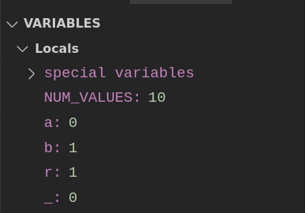

Pero también es posible añadir manualmente el seguimiento de otras variables o expresiones personalizadas desde la zona «WATCH»:

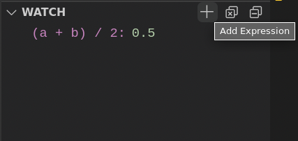


[^1]: Un «linter» es una herramienta software que permite detectar errores en el código previo a su ejecución.
[^2]: Fuente: [Gastón Danielsen](https://dev.to/gastondanielsen/atajos-de-teclado-shortcuts-en-vscode-430a).
