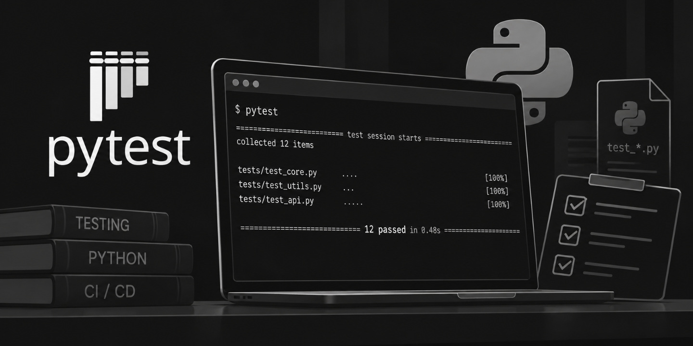

# Pytest


///caption
Imagen generada con Inteligencia Artificial
///

[`pytest`](https://docs.pytest.org/) es es uno de los paquetes más conocidos del ecosistema Python. Permite escribir _tests_ (unidades de prueba) legibles y escalables de forma muy cómoda.

## Instalación

La instalación del paquete es muy sencilla:

=== "*venv* :octicons-package-24:{.blue}"

    ```console
    $ pip install pytest
    ```

=== "*uv* &nbsp;:simple-uv:{.uv}"

    ```console
    $ uv add pytest
    ```

## Estructura

Supongamos el siguiente fragmento de código Python como <span class="example">ejemplo:material-flash:</span> de partida:

```python title="main.py"
def add(x: int, y: int) -> int:
    return x + y
```

Se trata de una función muy sencilla que suma dos números enteros. Para comprobar que esté funcionando adecuadamente obviamente podríamos lanzar el programa y darle algunos valores, pero aquí es donde tiene interés el uso de pruebas automatizadas.

Los «tests» deben estar ubicados en la carpeta `tests/` de nuestro proyecto y deben tener un nombre `test_<contexto>.py` donde `<contexto>` hace referencia a un nombre que identifique el tipo de pruebas que se están realizando.

Para nuestro <span class="example">ejemplo:material-flash:</span> vamos a crear el siguiente archivo:

```python title="tests/test_main.py"
from main import add#(1)!


def test_add():#(2)!
    assert add(2, 3) == 5#(3)!
```
{ .annotate }

1. Importamos la función que vamos a testear.
2. Definimos la función de «testing» que siempre debe comenzar por `test_`
3. Utilizamos una [aserción](../../fundamentos/modularidad/excepciones.md#aserciones) para comprobar el resultado.

!!! warning "Advertencia"

    Para que no tengamos problemas a la hora de lanzar los tests es altamente recomendable crear el fichero `__init__.py` (vacío) dentro de la carpeta `tests`.

La estructura —por tanto— del proyecto, quedaría de momento de la siguiente manera:

```console
.
├── main.py
└── tests
    ├── __init__.py
    └── test_main.py
```

## Lanzando tests

Ahora ya estamos en disposición de lanzar los tests mediante `pytest`:

=== "*venv* :octicons-package-24:{.blue}"

    ```console
    $ source .venv/bin/activate
    $ pytest
    ====================================================================== test session starts =======================================================================
    platform darwin -- Python 3.14.7, pytest-9.1.1, pluggy-1.6.0
    rootdir: /Users/sdelquin/code/personal/sandbox/pruebas
    configfile: pyproject.toml
    collected 1 item
    
    tests/test_main.py .                                                                                                                                       [100%]
    
    ======================================================================= 1 passed in 0.00s ========================================================================
    ```

=== "*uv* &nbsp;:simple-uv:{.uv}"

    ```console
    $ uv run pytest
    ====================================================================== test session starts =======================================================================
    platform darwin -- Python 3.14.7, pytest-9.1.1, pluggy-1.6.0
    rootdir: /Users/sdelquin/code/personal/sandbox/pruebas
    configfile: pyproject.toml
    collected 1 item
    
    tests/test_main.py .                                                                                                                                       [100%]
    
    ======================================================================= 1 passed in 0.00s ========================================================================
    ```

De la salida anterior podemos extraer bastante información:

- `test session starts` :material-arrow-right: Comienza la **sesión** de pruebas.
- `platform darwin -- Python 3.14.7, pytest-9.1.1, pluggy-1.6.0` :material-arrow-right: Plataforma sobre la que se está ejecutando (macOS en mi caso) junto con las versiones de Python, pytest y [pluggy](https://pluggy.readthedocs.io/en/stable/)[^1].
- `rootdir: /Users/sdelquin/code/personal/sandbox/pruebas` :material-arrow-right: Directorio (carpeta) raíz del proyecto[^2].
- `configfile: pyproject.toml` :material-arrow-right: Fichero de configuración del proyecto[^3].
- `collected 1 item` :material-arrow-right: Solo hay 1 test definido.
- `tests/test_main.py` :material-arrow-right: Fichero de tests que se está ejecutando.
- `1 passed in 0.00s` :material-arrow-right: Pasó 1 test en 0 segundos :octicons-checkbox-16:{.green}.

Supongamos ahora que introducimos un «bug» (error) en el código...

```python title="main.py" hl_lines="2"
def add(x: int, y: int) -> int:
    return x - y  # ERROR
```

Si volvemos a lanzar los tests obtendríamos un **error** :octicons-x-circle-16:{.red} como es esperable:

=== "*venv* :octicons-package-24:{.blue}"

    ```console hl_lines="15-17 21"
    $ source .venv/bin/activate
    $ pytest
    ====================================================================== test session starts =======================================================================
    platform darwin -- Python 3.14.7, pytest-9.1.1, pluggy-1.6.0
    rootdir: /Users/sdelquin/code/personal/sandbox/pruebas
    configfile: pyproject.toml
    collected 1 item
    
    tests/test_main.py F                                                                                                                                       [100%]
    
    ============================================================================ FAILURES ============================================================================
    ____________________________________________________________________________ test_add ____________________________________________________________________________
    
        def test_add():
    >       assert add(2, 3) == 5
    E       assert -1 == 5
    E        +  where -1 = add(2, 3)
    
    tests/test_main.py:5: AssertionError
    ==================================================================== short test summary info =====================================================================
    FAILED tests/test_main.py::test_add - assert -1 == 5
    ======================================================================= 1 failed in 0.02s ========================================================================
    ```

=== "*uv* &nbsp;:simple-uv:{.uv}"

    ```console hl_lines="14-16 20"
    $ uv run pytest
    ====================================================================== test session starts =======================================================================
    platform darwin -- Python 3.14.7, pytest-9.1.1, pluggy-1.6.0
    rootdir: /Users/sdelquin/code/personal/sandbox/pruebas
    configfile: pyproject.toml
    collected 1 item
    
    tests/test_main.py F                                                                                                                                       [100%]
    
    ============================================================================ FAILURES ============================================================================
    ____________________________________________________________________________ test_add ____________________________________________________________________________
    
        def test_add():
    >       assert add(2, 3) == 5
    E       assert -1 == 5
    E        +  where -1 = add(2, 3)
    
    tests/test_main.py:5: AssertionError
    ==================================================================== short test summary info =====================================================================
    FAILED tests/test_main.py::test_add - assert -1 == 5
    ======================================================================= 1 failed in 0.02s ========================================================================
    ```

Quizás la línea más importante es: `#!python assert -1 == 5` indicando que el resultado de nuestra función `add()` es **-1** pero el test espera un **5** por tanto aparece un [`AssertionError`](../../fundamentos/modularidad/excepciones.md#excepciones-predefinidas).

!!! tip "Valor esperado"

    Suele ser habitual que el valor esperado aparezca en el ^^lado derecho^^ de la **aserción**:

    ```python
    assert result == expected
    ```

## Parametrización

Si quisiéramos probar con más «números» para comprobar que nuestro código fuera correcto, la primera aproximación que se nos vendría a la cabeza es:

```python title="main.py" hl_lines="6-9"
from main import add


def test_add():
    assert add(2, 3) == 5
    assert add(1, 7) == 8
    assert add(0, 4) == 4
    assert add(-1, 3) == 2
    assert add(2, -8) == -6
```

Sin embargo no parece la mejor estrategia en términos de legibilidad y mantenibilidad del código. Es por ello que pytest proporciona [parametrización](https://docs.pytest.org/en/stable/how-to/parametrize.html):

```python linenums="1"
import pytest#(1)!

from main import add


@pytest.mark.parametrize(#(2)!
    'x,y,expected',#(3)!
    [(2, 3, 5), (1, 7, 8), (0, 4, 4), (-1, 3, 2), (2, -8, -6)],#(4)!
)
def test_add(x, y, expected):#(5)!
    assert add(x, y) == expected
```
{ .annotate }

1. Importamos el módulo pytest.
2. Aplicamos el [decorador](../../fundamentos/modularidad/funciones.md#decoradores) [`parametrize`](https://docs.pytest.org/en/stable/how-to/parametrize.html#pytest-mark-parametrize).
3. Indicamos los parámetros como una [cadena de texto](../../fundamentos/tipos/cadenas.md) con nombres separados por comas.
4. Establecemos los distintos casos de prueba como una [lista](../../fundamentos/estructuras/listas.md) de [tuplas](../../fundamentos/estructuras/tuplas.md).
5. Incorporamos los parámetros definidos a la función de prueba.

Si ahora lanzamos los tests veremos que hay algo que ha cambiado en la salida y es que se generan **5 items** en vez de 1 (_los 5 casos de prueba que hemos parametrizado_).

## Fixtures

Vamos a pasar a <span class="example">ejemplo:material-flash:</span> algo más avanzado en el que introducimos una [clase](../../fundamentos/modularidad/poo.md#creando-clases) como simil de una calculadora:

```python title="main.py" linenums="1"
class Calculator:
    def __init__(self, x: int, y: int):
        self.x = x
        self.y = y

    def add(self) -> int:
        return self.x + self.y

    def sub(self) -> int:
        return self.x - self.y

    def mul(self) -> int:
        return self.x * self.y

    def div(self) -> int:
        return self.x // self.y
```

Si tuviéramos que probar nuestro código, podríamos hacer algo así en pytest:

```python title="tests/test_main.py" linenums="1" hl_lines="5 10 15 20"
from main import Calculator


def test_calulator_add():
    calc = Calculator(6, 2)
    assert calc.add() == 8


def test_calulator_sub():
    calc = Calculator(6, 2)
    assert calc.sub() == 4


def test_calulator_mul():
    calc = Calculator(6, 2)
    assert calc.mul() == 12


def test_calulator_div():
    calc = Calculator(6, 2)
    assert calc.mul() == 3
```

Estos tests pasan perfectamente :octicons-checkbox-16:{.green} y son una manera válida de probar nuestro código, pero podemos fijarnos que estamos todo el tiempo repitiendo el mismo código al construir un objeto de tipo `Calculator`.

Para resolver este escenario (y muchos otros) podemos incorporar una [«fixture»](https://docs.pytest.org/en/stable/explanation/fixtures.html) y así refactorizar nuestro código:

```python title="tests/conftest.py" linenums="1"
import pytest#(1)!

from main import Calculator#(2)!


@pytest.fixture#(3)!
def calc():#(4)!
    return Calculator(6, 2)#(5)!
```
{ .annotate }

1. Importamos el módulo pytest.
2. Importamos la clase que vamos a probar.
3. Utilizamos el decorador [`@pytest.fixture`](https://docs.pytest.org/en/stable/reference/reference.html#pytest.fixture).
4. Definimos el nombre de la «fixture» (nombre de función).
5. Devolvemos un objeto «calculadora» instanciado ya con unos valores.

??? tip "Ubicación de «fixtures»"

    Aunque las «fixtures» se pueden implementar en cualquier lugar de nuestro código de prueba, es recomendable inclurlas en el fichero `tests/conftest.py` porque eso permite que estén [disponibles para múltiples ficheros](https://docs.pytest.org/en/stable/reference/fixtures.html#conftest-py-sharing-fixtures-across-multiple-files).

Con esto, podemos reescribir nuestros tests de una forma más elegante, tras aplicar el principio DRY:

```python title="tests/test_main.py" linenums="1"
def test_calulator_add(calc):
    assert calc.add() == 8


def test_calulator_sub(calc):
    assert calc.sub() == 4


def test_calulator_mul(calc):
    assert calc.mul() == 12


def test_calulator_div(calc):
    assert calc.div() == 3
```

Podemos observar que cada función de test tiene un parámetro llamado `calc` que proviene precisamente de una «fixture» y que se trata de un objeto de la clase `#!python Calculator`.

### Fixtures que reciben fixtures

No hay ningún inconveniente en que una «fixture» reciba como argumento otra «fixture». Podemos ver el siguiente <span class="example">ejemplo:material-flash:</span> de la calculadora:

```python title="tests/conftest.py" linenums="1" hl_lines="6-8 12"
import pytest

from main import Calculator


@pytest.fixture
def values():#(1)!
    return 6, 2


@pytest.fixture
def calc(values):#(2)!
    return Calculator(*values)#(3)!
```
{ .annotate }

1. Esta «fixture» devuelve una [tupla](../../fundamentos/estructuras/tuplas.md) con los valores para la calculadora.
2. Esta «fixture» recibe otra «fixture» que utiliza en el constructor de la calculadora.
3. Se aplica [desempaquetado de tuplas](../../fundamentos/estructuras/tuplas.md#desempaquetado-de-tuplas) en la llamada.

### Ámbito de una fixture

Por defecto, el ámbito ([«scope»](https://docs.pytest.org/en/stable/how-to/fixtures.html#fixture-scopes)) de una «fixture» es la propia función, es decir, se destruye una vez termine el test (función).

Esto lo podemos ver claramente si añadimos un mensaje informativo a la «fixture» creada previamente:

```python title="tests/conftest.py" linenums="1" hl_lines="8"
import pytest

from main import Calculator


@pytest.fixture(scope='session')
def calc():
    print('Creando fixture de calculadora...')
    return Calculator(6, 2)
```

Ahora ejecutamos los tests utilizando el argumento `-s` que nos sirve para mostrar la salida por pantalla:

=== "*venv* :octicons-package-24:{.blue}"

    ```console hl_lines="9-12"
    $ source .venv/bin/activate
    $ pytest -s
    ====================================================================== test session starts =======================================================================
    platform darwin -- Python 3.14.7, pytest-9.1.1, pluggy-1.6.0
    rootdir: /Users/sdelquin/code/personal/sandbox/pruebas
    configfile: pyproject.toml
    collected 4 items
    
    tests/test_main.py Creando fixture de calculadora...
    .Creando fixture de calculadora...
    .Creando fixture de calculadora...
    .Creando fixture de calculadora...
    .
    
    ======================================================================= 4 passed in 0.00s ========================================================================
    ```

=== "*uv* &nbsp;:simple-uv:{.uv}"

    ```console hl_lines="8-11"
    $ uv run pytest -s
    ====================================================================== test session starts =======================================================================
    platform darwin -- Python 3.14.7, pytest-9.1.1, pluggy-1.6.0
    rootdir: /Users/sdelquin/code/personal/sandbox/pruebas
    configfile: pyproject.toml
    collected 4 items
    
    tests/test_main.py Creando fixture de calculadora...
    .Creando fixture de calculadora...
    .Creando fixture de calculadora...
    .Creando fixture de calculadora...
    .
    
    ======================================================================= 4 passed in 0.00s ========================================================================
    ```

Efectivamente se están creando 4 «fixtures» correspondientes a los 4 tests que hemos definido.

Pero si ahora cambiamos el ámbito de la «fixture» al valor `#!python 'session'` esto hará que sólo se ejecute una vez en toda la sesión:

```python title="tests/conftest.py" linenums="1" hl_lines="6"
import pytest

from main import Calculator


@pytest.fixture(scope='session')
def calc():
    print('Creando fixture de calculadora...')
    return Calculator(6, 2)
```

Ejecutamos los tests de nuevo...

=== "*venv* :octicons-package-24:{.blue}"

    ```console hl_lines="9"
    $ source .venv/bin/activate
    $ pytest -s
    ====================================================================== test session starts =======================================================================
    platform darwin -- Python 3.14.7, pytest-9.1.1, pluggy-1.6.0
    rootdir: /Users/sdelquin/code/personal/sandbox/pruebas
    configfile: pyproject.toml
    collected 4 items
    
    tests/test_main.py Creando fixture de calculadora...
    ....
    
    ======================================================================= 4 passed in 0.00s ========================================================================
    ```

=== "*uv* &nbsp;:simple-uv:{.uv}"

    ```console hl_lines="8"
    $ uv run pytest -s
    ====================================================================== test session starts =======================================================================
    platform darwin -- Python 3.14.7, pytest-9.1.1, pluggy-1.6.0
    rootdir: /Users/sdelquin/code/personal/sandbox/pruebas
    configfile: pyproject.toml
    collected 4 items
    
    tests/test_main.py Creando fixture de calculadora...
    ....
    
    ======================================================================= 4 passed in 0.00s ========================================================================
    ```

### Fixtures autoincorporadas

Existe la posibilidad de definir «fixtures» sin necesidad de invocarlas explícitamente. Para esto surgen las llamadas [«autouse fixtures»](https://docs.pytest.org/en/stable/how-to/fixtures.html#autouse-fixtures-fixtures-you-don-t-have-to-request) («fixtures» autoincorporadas).

Supongamos por <span class="example">ejemplo:material-flash:</span> que queremos asegurar los valores `x` e `y` como **enteros** en nuestros «tests»:

```python title="tests/conftest.py" linenums="1" hl_lines="8 11-14"
import pytest

from main import Calculator


@pytest.fixture
def calc():
    return Calculator(6.17, 1.85)#(1)!


@pytest.fixture(autouse=True)#(2)!
def ensure_int(calc):#(3)!
    calc.x = int(round(calc.x, 0))#(4)!
    calc.y = int(round(calc.y, 0))#(5)!
```
{ .annotate }

1. Modificamos los valores «a propósito» con fines didácticos.
2. Indicamos que esta «fixture» debe ser autoincorporada.
3. Esta «fixture» recibe otra «fixture» como argumento.
4. Busca el entero más próximo.
5. Busca el entero más próximo.

Aunque los valores `x` e `y` ni siquiera son valores enteros, los tests pasan :octicons-checkbox-16:{.green} ya que la «fixture» se ejecuta automáticamente y los aproxima a valores enteros `#!python x=6; y=2`

## Línea de comandos

`pytest` no deja de ser una herramienta CLI que nos permite modificar su comportamiento a partir de distintos [modificadores](https://docs.pytest.org/en/stable/reference/reference.html#command-line-flags) en línea de comandos.

Hay una enorme cantidad de opciones. En la siguiente tabla se resumen aquellas que resultan más interesantes:

<div class="annotate" markdown>
| Modificador | Comportamiento |
| --- | --- |
| `-k` | Lanzar tests con búsqueda por nombre.(1) |
| `-m` | Lanzar tests con búsqueda por marcador.(2) |
| `-x` | Termina tras el primer test fallido. |
| `--lf` | Lanza solo los tests que fallaron en la última ejecución.  |
| `--sw` | Termina tras el primer test fallido y continúa desde el último test fallido. |
| `-v` | Aumenta la «verbosidad» (mensajes informativos) a nivel 1. |
| `-vv` | Aumenta la «verbosidad» (mensajes informativos) a nivel 2. |
| `-vvv` | Aumenta la «verbosidad» (mensajes informativos) a nivel 3. |
| `-q` | Disminute la «verbosidad» (mensajes informativos) a nivel 0. |
| `-s` | Muestra los «print» de usuario en la salida de los tests. |
</div>
1. Por <span class="example">ejemplo:material-flash:</span> lanzar los tests que incluyan en su nombre `typesafe`:
    ```console
    $ pytest -k typesafe
    ```
2. Por <span class="example">ejemplo:material-flash:</span> lanzar los tests con el marcador `typesafe`:
    ```console
    $ pytest -m typesafe
    ```


[^1]: Sistema de «plugins» de pytest.
[^2]: Importante para establecer las rutas de búsqueda de los módulos.
[^3]: En este caso estoy utilizando [uv](../../entornos/ide/uv.md) para el proyecto.
