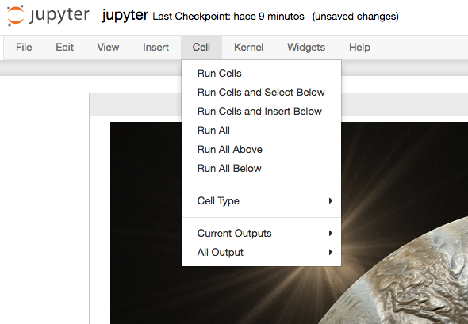
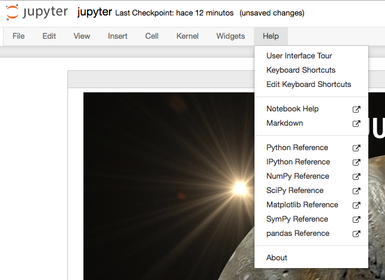

# Jupyter { #jupyter }


(1)
{ .annotate }

1. :fontawesome-regular-copyright: [NASA](https://unsplash.com/@nasa) :material-at: [Unsplash](https://unsplash.com) 

El módulo [`jupyter`](https://jupyter.org/) proporciona un **entorno de desarrollo integrado** para ciencia de datos (incluso generalista), que no es exclusivo de Python, sino que además admite otros lenguajes ([«kernels»](#kernel-menu)) en su «backend».

## Instalación { #install }

```console
pip install jupyter
```

## Modo de uso { #usage }

El paquete proporciona un comando `jupyter` que puede usarse para distintas funcionalidades. La más habitual es lanzar un servidor que permite trabajar con **cuadernos** («notebooks») sobre los que desarrollar código Python.

=== "`jupyter notebook`"

    Lanza un servidor «legacy» en http://localhost:8888

=== "`jupyter lab`"

    Lanza un [servidor «vitaminado»](#jupyterlab) en http://localhost:8888
    
=== "`jupyter console`"

    Lanza un intérprete interactivo en consola.

!!! tip "Jupyter en la nube"

    Es posible probar `jupyter` desde [este enlace](https://jupyter.org/try-jupyter/lab/) con lo que no necesitaríamos instalar nada en nuestra propia máquina.

## Notebooks { #notebooks }

Un «notebook» es un **documento interactivo** compuestos por **celdas** que contienen:

- [x] Texto en formato [Markdown](https://www.markdownguide.org/basic-syntax/) (incluyendo [fórmulas]()).
- [x] Código Python.
- [x] Elementos multimedia.

Para ejecutar (o renderizar) una celda basta con pulsar ++shift++ + ++enter++


!!! note "Formato de fichero"

    Los «notebooks» o cuadernos son básicamente **archivos de texto en formato json** con extensión `.ipynb` (que proviene de «IPython Notebook»).

## Interfaz { #interface }

Jupyter se presenta como una aplicación web en cuya interfaz podemos encontrar distintos elementos que nos permitirán desarrollar nuestras tareas de programación de una forma más cómoda.

### Explorador de archivos { #file-browser }

Lo primero que veremos al arrancar el servidor de «notebooks» será el **explorador de archivos** con un diseño muy similar al de cualquier sistema operativo.


:material-check-all:{ .blue } Los «notebooks» que se están ejecutando suelen tener un color verde en el icono, mientras que los que están parados aparecen en gris.

### Barra de menú { #menubar }

#### Menú Fichero { #file-menu }

Del estilo de los menús tradicionales de aplicaciones, aquí podemos encontrar las principales funciones sobre ficheros:


Los «checkpoints» permiten guardar el estado del «notebook» en un momento determinado para luego poder revertirlo a ese momento del tiempo.

Es posible exportar el «notebook» a una gran variedad de formatos, entre otros los siguientes:

- Asciidoc (`.asciidoc`)
- HTML (`.html`)
- LaTeX (`.tex`)
- Markdown (`.md`)
- PDF vía LaTeX (`.pdf`)
- Python (.`py`)
- reST (`.rst`)
- Reveal.js «slides» (`.html`)

!!! exercise "Ejercicio"

    Crea un «notebook» de prueba y descárgalo en formato **HTML** y **Markdown**.

#### Menú Edición  { #edit-menu }

Este menú contiene las acciones que podemos realizar sobre una o varias celdas:


Las funciones las podríamos agrupar en **gestión de celdas** (cortar, pegar, borrar, dividir, unir, mover, etc.) e **inserción de imágenes** seleccionando desde un cuadro de diálogo.

#### Menú Vista { #view-menu }

Permite modificar el aspecto visual de determinados elementos de la aplicación:


- Números de línea: Puede resultar interesante mostrar los números de línea en celdas que contengan código.
- Modo presentación (Cell toolbar :material-arrow-right-bold: Slideshow): Jupyter Notebook ofrece la posibilidad de crear una presentación sobre el documento en el que estamos trabajando. Cada celda se puede configurar con alguno de los siguientes tipos:
    - Slide.
    - Subslide.
    - Fragment.
    - Skip.
    - Notes
- Etiquetas (Cell toolbar :material-arrow-right-bold: Tags): Es interesante —entre otras— el uso de la etiqueta `raises-exception` ya que nos permite ejecutar todas las celdas de un «notebook» sin que el sistema se detenga por errores en la celda etiquetada, ya que estamos informando que lanzará una [excepción](../../core/modularity/exceptions.md).

#### Menú Insertar { #insert-menu }

Insertar celda antes o después de la actual:


#### Menú Celda { #cell-menu }

Principalmente enfocado a la ejecución de las celdas que componen el «notebook»:



- Ejecución de celdas: La ejecución de celdas se puede hacer de forma individual o grupal así como indicando el punto de partida (celda actual).
- Tipo de celdas: Define el tipo de la celda actual.
  - **Code**: para incluir código (se podrá ejecutar el lenguaje de programación según el «kernel» instalado).
  - **Markdown**: para escribir texto utilizando sintaxis [Markdown](https://www.markdownguide.org/basic-syntax/).
  - **Raw**: estas celdas no serán formateadas.
- Salida de celdas: La ejecución de las celdas de código tiene (suele tener) una salida. Esta salida se puede ocultar (si interesa). Incluso tenemos control sobre activar o desactivar el «scroll» en caso de que la salida sea muy larga.

#### Menú Kernel { #kernel-menu }

Permite gestionar el servicio que se encarga de lanzar los «notebooks»:


El **kernel** es la capa de software que se encarga de ejecutar las celdas de nuestro «notebook» que contienen código. Podemos tener instalados distintos «kernels» para un mismo Jupyter Notebook. El kernel se puede interrumpir o reiniciar.

Hay veces, que debido a un error de programación o a procesos muy largos, podemos encontrarnos con el «kernel» bloqueado durante un largo período de tiempo. En estas ocasiones es útil reiniciarlo para salvar esa situación:


#### Menú Ayuda { #help-menu }

Como cualquier aplicación, existe un menú de ayuda en el que se pueden encontrar enlaces a referencias y manuales:



Uno de los elementos más interesantes de la ayuda es el uso de los «shortcuts»[^1]. Aunque hay muchos, dejamos aquí algunos de los más útiles:

| Shortcut | Acción |
| --- | --- |
| ++shift++ + ++enter++ | Ejecutar la celda actual |
| ++alt++ + ++enter++ | Ejecutar la celda actual y «abrir» una celda debajo |
| ++a++ | Abrir una celda encima de la actual («above») |
| ++b++ | Abrir una celda debajo de la actual («below») |
| ++m++ | Convertir la celda actual a Markdown |
| ++y++ | Convertir la celda actual a código |
| ++d++ ++d++ | Borrar la celda actual |

## Mathjax { #mathjax }

[MathJax](https://www.mathjax.org/) es una biblioteca javascript que permite visualizar fórmulas matemáticas en navegadores web, utilizando (entre otros) el lenguajes de marcado [LaTeX](https://es.overleaf.com/learn/latex/Mathematical_expressions).

Para escribir fórmulas matemáticas la celda debe ser de tipo Markdown y tendremos que usar delimitadores especiales en función del formato:

=== "Fórmulas «en línea»"

    Se debe usar el delimitador dólar antes y después de la expresión `$ ... $` 

    Por <span class="example">ejemplo:material-flash:</span>:
    
    `$\sum_{x=1}^n sin(x) + cos(x)$` :material-arrow-right-bold: $\sum_{i=1}^n sin(x) + cos(x)$

=== "Fórmulas «en bloque»"

    Se debe usar el delimitador doble dólar antes y después de la expresión `$$ ... $$` 

    Por <span class="example">ejemplo:material-flash:</span>:

    `$$\sum_{x=1}^n sin(x) + cos(x)$$` :material-arrow-down-bold:

    $$
    $\sum_{x=1}^n sin(x) + cos(x)$
    $$

### Ejemplos de fórmulas { #formula-examples }

A continuación veremos distintas fórmulas inspiradas en [Motivating Examples](https://jupyter-notebook.readthedocs.io/en/latest/examples/Notebook/Typesetting%20Equations.html#Motivating-Examples) de la documentación oficial de Jupyter Notebook.

```latex title="Ecuaciones en varias líneas"
$$
\begin{align}
    \dot{x} &= \sigma(y-x) \\
    \dot{y} &= \rho x - y - xz \\
    \dot{z} &= -\beta z + xy
\end{align}
$$
```
<div class="result" markdown>
$$
\begin{align}
    \dot{x} &= \sigma(y-x) \\
    \dot{y} &= \rho x - y - xz \\
    \dot{z} &= -\beta z + xy
\end{align}
$$
</div>

```latex title="Usando paréntesis"
$$
\left( \sum_{k=1}^n a_k b_k \right)^2 \leq
\left( \sum_{k=1}^n a_k^2 \right) \left( \sum_{k=1}^n b_k^2 \right)
$$
```
<div class="result" markdown>
$$
\left( \sum_{k=1}^n a_k b_k \right)^2 \leq
\left( \sum_{k=1}^n a_k^2 \right) \left( \sum_{k=1}^n b_k^2 \right)
$$
</div>

```latex title="Trabajando con matrices"
$$
\mathbf{V}_1 \times \mathbf{V}_2 =
\begin{vmatrix}
    \mathbf{i} & \mathbf{j} & \mathbf{k} \\
    \frac{\partial X}{\partial u} &  \frac{\partial Y}{\partial u} & 0 \\
    \frac{\partial X}{\partial v} &  \frac{\partial Y}{\partial v} & 0
\end{vmatrix}
$$
```
<div class="result" markdown>
$$
\mathbf{V}_1 \times \mathbf{V}_2 =
\begin{vmatrix}
    \mathbf{i} & \mathbf{j} & \mathbf{k} \\
    \frac{\partial X}{\partial u} &  \frac{\partial Y}{\partial u} & 0 \\
    \frac{\partial X}{\partial v} &  \frac{\partial Y}{\partial v} & 0
\end{vmatrix}
$$
</div>

```latex title="Algo de probabilidad"
$$
P(E) = {n \choose k} p^k (1-p)^{ n-k}
$$
```
<div class="result" markdown>
$$
P(E) = {n \choose k} p^k (1-p)^{ n-k}
$$
</div>


```latex title="Uso de fracciones"
$$
1 +  \frac{q^2}{(1-q)}+\frac{q^6}{(1-q)(1-q^2)}+\cdots =
\prod_{j=0}^{\infty}\frac{1}{(1-q^{5j+2})(1-q^{5j+3})},
\quad\quad \text{for $|q|<1$}.
$$
```
<div class="result" markdown>
$$
1 +  \frac{q^2}{(1-q)}+\frac{q^6}{(1-q)(1-q^2)}+\cdots =
\prod_{j=0}^{\infty}\frac{1}{(1-q^{5j+2})(1-q^{5j+3})},
\quad\quad \text{for $|q|<1$}.
$$
</div>

```latex title="Alineación múltiple"
$$
\begin{eqnarray}
    x' &=&   &x \sin\phi &+& z \cos\phi \\
    z' &=& - &x \cos\phi &+& z \sin\phi
\end{eqnarray}
$$
```
<div class="result" markdown>
$$
\begin{eqnarray}
    x' &=&   &x \sin\phi &+& z \cos\phi \\
    z' &=& - &x \cos\phi &+& z \sin\phi
\end{eqnarray}
$$
</div>

!!! info "Recursos"

    - [Listado de símbolos matemáticos](https://www.cmor-faculty.rice.edu/~heinken/latex/symbols.pdf)
    - [Dibujar un símbolo y obtener su referencia con Detexify](https://detexify.kirelabs.org/classify.html)

!!! exercise "Ejercicio"

    Escribe en MathJax (usando Jupyter Notebook) las siguientes ecuaciones:

    $$
    (I)\quad
    \int_a^b f'(x)dx = f(b) - f(a)
    $$

    $$
    (II)\quad
    t' = t \frac{1}{\sqrt{1 - \frac{v^2}{c^2}}}
    $$

    $$
    (III)\quad
    \Big[
        M \frac{\partial}{\partial M} +
        \beta(g) \frac{\partial}{\partial g} +
        \eta \gamma
    \Big]
    G^n(x_1, x_2, \dots, x_n; M, g) = 0
    $$

    $$
    (IV)\quad
    R_{00} \approx
        -\frac{1}{2}
        \sum_i
        \frac{\partial^2 h_{00}}{\partial(x^i)^2}
        =
        \frac{4\pi G}{c^2}
        (\rho c^2)
        \Rightarrow
        \bigtriangledown^2 \phi_g
        =
        4\pi G \rho
    $$

    [:material-lightbulb: Solución](files/jupyter/equations.tex)

## Comandos especiales { #special-commands }

Jupyter Notebook ofrece una gama de comandos especiales que cubren gran variedad de funcionalidades.

### Comandos de shell { #shell-commands }

Podemos ejecutar comandos de «shell» usando el prefijo exclamación `!`

Por <span class="example">ejemplo:material-flash:</span>:

```pycon
>>> !whoami
sdelquin
```

```pycon
>>> !uname
Darwin
```

!!! exercise "Ejercicio"

    Ejecuta los siguientes comandos del sistema en una celda del «notebook»:

    | Windows | Linux & macOS |
    | --- | --- |
    | `time` | `date` |
    | `dir` | `ls` |
    | `mem` | `free` |

### Obteniendo ayuda { #help }

Una de las formas más sencillas de obtener información de librerías, funciones o módulos es utilizar el sufijo interrogación `?`

```pycon
>>> import random

>>> random.randint?
Signature: random.randint(a, b)
Docstring:
Return random integer in range [a, b], including both end points.

File:      ~/.local/share/uv/python/cpython-3.13.2-macos-aarch64-none/lib/python3.13/random.py
Type:      method
```

!!! exercise "Ejercicio"

    Encuentra la ayuda de las siguientes funciones:

    - `os.path.dirname`
    - `re.match`
    - `datetime.timedelta`

### Comandos mágicos

Jupyter Notebook, o mejor expresado [IPython](https://ipython.org/), admite un conjunto de [comandos mágicos](https://ipython.readthedocs.io/en/stable/interactive/magics.html) que permiten realizar distintas tareas, en muchos casos, no necesariamente relacionadas con Python.

La lista es bastante extensa pero puede consultarse con `%lsmagic`:

```pycon
>>> %lsmagic
Available line magics:
%aimport  %alias  %alias_magic  %autoawait  %autocall  %autoindent  %automagic
%autoreload  %bookmark  %cat  %cd  %clear  %code_wrap  %colors  %conda  %config
%cp  %cpaste  %debug  %dhist  %dirs  %doctest_mode  %ed  %edit  %env  %gui  %hist
%history  %killbgscripts  %ldir  %less  %lf  %lk  %ll  %load  %load_ext  %loadpy
%logoff  %logon  %logstart  %logstate  %logstop  %ls  %lsmagic  %lx  %macro
%magic  %mamba  %man  %matplotlib  %micromamba  %mkdir  %more  %mv  %notebook
%page  %paste  %pastebin  %pdb  %pdef  %pdoc  %pfile  %pinfo  %pinfo2  %pip  %popd
%pprint  %precision  %prun  %psearch  %psource  %pushd  %pwd  %pycat  %pylab
%quickref  %recall  %rehashx  %reload_ext  %rep  %rerun  %reset  %reset_selective
%rm  %rmdir  %run  %save  %sc  %set_env  %store  %sx  %system  %tb  %time  %timeit
%unalias  %unload_ext  %uv  %who  %who_ls  %whos  %xdel  %xmode

Available cell magics:
%%!  %%HTML  %%SVG  %%bash  %%capture  %%code_wrap  %%debug  %%file  %%html
%%javascript  %%js  %%latex  %%markdown  %%perl  %%prun  %%pypy  %%python  %%python2
%%python3  %%ruby  %%script  %%sh  %%svg  %%sx  %%system  %%time  %%timeit  %%writefile

Automagic is ON, % prefix IS NOT needed for line magics.
```

Si nos fijamos en el último mensaje, al estar habilitado el modo «automagic», no es estrictamente necesario que usemos el prefijo `%` para hacer uso de estos comandos «line magics».

Por <span class="example">ejemplo:material-flash:</span> podríamos conocer la _historia de comandos_ en el intérprete simplemente con `hist`:

```pycon
>>> hist#(1)!
import random
random.randint?
%lsmagic
lsmagic
hist
```
{ .annotate }

1. Equivale a `%hist`

#### Representando gráficas { #plots }

Otra de las grandes ventajas que ofrece Jupyter Notebook es poder graficar directamente sobre el cuaderno. Para ello utilizamos código Python (en este caso) y una directiva de comando mágico para indicar que se renderice en línea:

```pycon
>>> %matplotlib inline

>>> from matplotlib import pyplot as plt

>>> x = [1, 2, 3, 4, 5, 6, 7, 8, 9, 10]
>>> y = [1, 4, 9, 16, 25, 36, 49, 64, 81, 100]

>>> plt.plot(x, y)
[<matplotlib.lines.Line2D at 0x106414e50>]
<Figure size 432x288 with 1 Axes>
```

<div class="result white" markdown>

</div>

#### Manejo de ficheros { #handling-files }

<div class="annotate" markdown>
| Comando | Descripción |
| --- | --- |
| `%load <file>` | Carga el contenido del fichero `<file>` en la celda actual. |
| `%run <file>` | Ejecuta el contenido del fichero `<file>` en la celda actual. |
| `%%writefile <file>` | Escribe el contenido de la celda actual en el fichero `<file>`.(1) |
</div>
1. La sentencia `%%writefile <file>` debe ser la primera línea de la celda y luego vendría el código que queremos volcar al fichero.

!!! exercise "Ejercicio"

    1. En una celda del «notebook» escribe código Python para crear una lsita de los primeros 100 números pares.
    2. Guarda el contenido de dicha celda en un fichero Python usando `%writefile`.
    3. Carga este fichero en otra celda con `%load`.
    4. Ejecuta dicho código mediante `%run`.

#### Tiempos de ejecución { #execution-time }

Para medir el tiempo de ejecución de una determinada instrucción Python podemos utilizar el comando `%timeit` que calcula un promedio tras correr repetidas veces el código indicado.

Por <span class="example">ejemplo:material-flash:</span> veamos cuánto tarda (en mi máquina) crear una distribución normal con 100 muestras:

```pycon
>>> import numpy

>>> %timeit numpy.random.normal(size=100)
2.05 μs ± 14.2 ns per loop (mean ± std. dev. of 7 runs, 100,000 loops each)
```

De igual forma, existe un mecanismo para medir el tiempo de ejecución de una celda completa. En este caso se utiliza el comando `%%timeit` (nótese la diferencia del doble porcentaje como prefijo).

A continuación analizamos un <span class="example">ejemplo:material-flash:</span> para medir el tiempo de ejecución de tres distribuciones aleatorias:

```pycon
>>> %%timeit
...
... numpy.random.poisson(size=100)
... numpy.random.uniform(size=100)
... numpy.random.logistic(size=100)
...
...
7.48 μs ± 45.7 ns per loop (mean ± std. dev. of 7 runs, 100,000 loops each)
```

!!! exercise "Ejercicio"

    Mide los tiempos de ejecución en la creación de distribuciones aleatorias y descubre si hay diferencias significativas atendiendo a:

    - Tipo de distribución (_Poisson_, _Uniform_, `Logistic`).
    - Tamaño de la muestra (100, 10000, 1000000).

    [:material-lightbulb: Solución](files/jupyter/timeit.py)

#### Incluyendo otros lenguajes { #another-langs }

Por defecto, Jupyter espera que las celdas tipos «código» estén escritas en Python, pero este comportamiento se puede modificar aplicando distintos comandos mágicos:

=== "Celdas con HTML"

    Si necesitamos insertar código HTML en una celda, podemos usar el comando %%html al comienzo de la misma.

    Por <span class="example">ejemplo:material-flash:</span> incrustamos un mapa de Canarias:

    ```pycon
    >>> %%html
    ...
    ... <iframe src="https://www.google.com/maps/embed?pb=!1m18!1m12!1m3!1d3592984.8538165656!2d-18.096789575396794!3d28.426067294993228!2m3!1f0!2f0!3f0!3m2!1i1024!2i
    ... 768!4f13.1!3m3!1m2!1s0xc41aa86ef755363%3A0x10340f3be4bc8c0!2sCanarias!5e0!3m2!1ses!2ses!4v1623755509663!5m2!1ses!2ses" width="400" height="300" style="border:
    ... 0;" allowfullscreen="" loading="lazy"></iframe>
    ...
    ...
    ```
    <div class="result" markdown>
        
    </div>

=== "Celdas con «shell script»"

    Hay ocasiones en las que un código en [shell script](http://trajano.us.es/~fjfj/shell/shellscript.htm) suele ser útil. Para incluirlo recurrimos al comando `%%bash` al principio de la celda.

    Por <span class="example">ejemplo:material-flash:</span> mostramos un árbol de ficheros:

    ```pycon
    >>> %%bash
    ...
    ... tree -d -L 2
    ...
    ...
    .
    ├── docs
    │   ├── assets
    │   ├── core
    │   ├── stdlib
    │   └── third-party
    ├── includes
    └── site
        ├── assets
        ├── core
        ├── search
        ├── stdlib
        └── third-party
    
    13 directories
    ```

=== "Celdas con Perl"

    No hay que subestimar el poder del lenguaje de programación [Perl](https://perlenespanol.com/). Si fuera necesario, lo podemos incluir en una celda del «notebook» con `%%perl` al comienzo de la misma.

    En el siguiente <span class="example">ejemplo:material-flash:</span> usamos Perl para «parsear» un correo electrónico:

    ```pycon
    >>> %%perl
    ...
    ... my $email = 'sdelquin@gmail.com'
    ... if ($email =~ /^([^@]+)\@(.+)$/) {
    ...     print "Username is: $1\n";
    ...     print "Hostname is: $2\n";
    ... }
    ...
    ...
    Username is: sdelquin
    Hostname is: gmail.com
    ```
    
## Extensiones { #extensions }

El ecosistema de Jupyter Notebook es muy amplio y ofrece una gran variedad de extensiones que se pueden incluir en la instalación que tengamos: [Unofficial Jupyter Notebook Extensions](https://jupyter-contrib-nbextensions.readthedocs.io/en/latest/).

Su instalación es tan sencilla como:

```console
$ pip install jupyter_contrib_nbextensions
```

## Otros entornos { #environments }

El ecosistema de entornos para trabajos en ciencia de datos ha ido ampliándose durante estos últimos años con la explosión del «BigData» y la inteligencia artificial. En este apartado veremos otras plataformas que también nos permiten usar Python enfocado al análisis de datos.

### Jupyter Lab { #jupyterlab }

[JupyterLab](https://jupyterlab.readthedocs.io/en/stable/) es una evolución de Jupyter Notebook.


Mejoras con respecto a Jupyter Notebook:

- [x] Explorador de ficheros integrado en la barra lateral.
- [x] Posibilidad de abrir múltiples `.ipynb` al mismo tiempo usando pestañas.
- [x] Posibilidad de abrir múltiples terminales.
- [x] Editor integrado para cualquier fichero de texto.
- [x] Vista previa en tiempo real de documentos _markdown_ o _csv_.

:material-check-all:{ .blue } Forma parte del proyecto Jupyter y por tanto viene instalado por defecto al instalar el propio paquete `jupyter`.

### Google Colab { #google-colab }

[Google Colab](https://colab.research.google.com/) es un entorno de computación científica creado por Google y disponible en su nube. Como era previsible, para su uso es necesario disponer de una cuenta en Google.


**Características**:

- [x] Tiene un comportamiento totalmente análogo a Jupyter en cuanto a comportamiento y funcionalidades.
- [x] Completamente en la nube. No necesita instalación ni configuración.
- [x] Por defecto trae multitud de paquetes instalados, principalmente en el ámbito científico.
- [x] Espacio en disco sujeto a las características de Google Compute Engine.
- [x] Memoria RAM sujeta a las características de Google Compute Engine.
- [x] Acceso limitado al sistema operativo.
- [x] Previsualización _markdown_ en tiempo real sobre cada celda.
- [x] Posibilidad de subir ficheros de datos propios en carpetas accesibles por el cuaderno.
- [x] Posibilidad de ejecutar Jupyter «notebooks» propios.
- [x] Posibilidad (limitada) de acelerar cálculos usando GPU o TPU.
- [x] Posibilidad de descargar el cuaderno como Jupyter «notebook» o archivo de Python.
- [x] Índice de contenidos integrado en barra lateral.
- [x] Inspector de variables integrado en barra lateral.

### Kaggle { #kaggle }

[Kaggle](https://www.kaggle.com/) es una plataforma que no sólo ofrece un entorno de trabajo para cuadernos Jupyter sino también [una enorme colección de conjuntos de datos](https://www.kaggle.com/datasets) de libre acceso. Para su uso es necesario disponer de una cuenta en el servicio.


**Características**:

- [x] Tiene un comportamiento totalmente análogo a Jupyter en cuanto a comportamiento y funcionalidades.
- [x] Completamente en la nube. No necesita instalación ni configuración.
- [x] Por defecto trae multitud de paquetes instalados, principalmente en el ámbito científico.
- [x] Espacio en disco sujeto a las características de Kaggle.
- [x] Memoria RAM sujeta a las características de Kaggle.
- [x] Acceso limitado al sistema operativo.
- [x] Posibilidad de subir ficheros de datos propios sólo como «datasets» de Kaggle.
- [x] Posibilidad de ejecutar Jupyter «notebooks» propios.
- [x] Posibilidad (limitada) de acelerar cálculos usando GPU o TPU.
- [x] Posibilidad de descargar el cuaderno como Jupyter «notebook».

### Comparativa { #compare-envs }

Haremos un análisis de los entornos vistos comparando tiempos de ejecución a través del cómputo de una FFT sobre una matriz de 1 millón de elementos:

```pycon
>>> import numpy as np

>>> bigdata = np.random.randint(1, 100, size=(1_000, 1_000))

>>> %timeit np.fft.fft(bigdata)
8.07 ms ± 2.01 ms per loop (mean ± std. dev. of 7 runs, 1 loop each)
```

<div class="annotate" markdown>
| Jupyter (local) | Colab | Kaggle |
| --- | --- | --- |
| 8.07ms(1) | 41.5ms(2) | 6.62ms(3) |
</div>
1. Apple Silicon M1.
2. Abril de 2025 (capa gratuita).
3. Abril de 2025 (capa gratuita).

Obviamente se trata de una ejecución puntual y no podemos sacar conclusiones claras al respecto. Además de ello depende del «hardware» sobre el que estemos trabajando. En cualquier caso el propósito es únicamente tener una ligera idea de los órdenes de magnitud.


[^1]: Un «shortcut» es un «atajo de teclado» (combinación de teclas) para lanzar una determinada acción.
