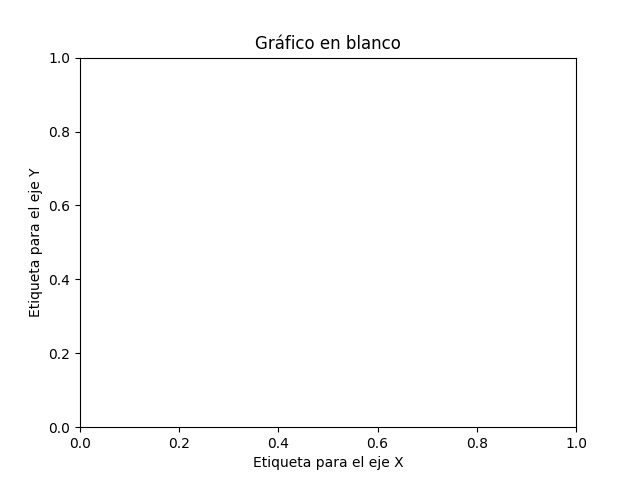

# Matplotlib


(1)
{ .annotate }

1. :fontawesome-regular-copyright: [Customerbox](https://unsplash.com/@customerbox) :material-at: [Unsplash](https://unsplash.com) 

[`matplotlib`](https://matplotlib.org/) es el módulo Python más utilizado en el ámbito de ciencia de datos para representaciones gráficas.

## Instalación { #install }

```console
pip install matplotlib
```

## Modo de uso { #usage }

La forma más habitual de importar esta librería es utilizar el alias `plt`:

```pycon
>>> import matplotlib.pyplot as plt
```

Si bien podemos utilizar matplotlib en el intérprete habitual de Python, suele ser muy frecuente trabajar con esta librería mediante entornos [Jupyter](jupyter.md), ya que facilitan la visualización de los gráficos en su interfaz de usuario.

## Figura { #figure }

La [figura](https://matplotlib.org/stable/gallery/showcase/anatomy.html) es el elemento base sobre el que se construyen todos los gráficos en matplotlib. Veamos cómo crearla:

```pycon
>>> fig = plt.figure()

>>> type(fig)
matplotlib.figure.Figure

>>> fig
<Figure size 640x480 with 0 Axes>
```

Podemos observar que la resolución (por defecto) de la figura es de 640x480 píxeles y que no dispone de ningún eje («0 Axes»).

!!! info "Ejes"

    El término «axes» hace referencia a un conjunto de ejes. Puede resultar confuso en español y he decidido asignar el nombre **marco** cuando haga referencia a «axes».

La **resolución final** de una figura viene determinada por su altura (height) y anchura (width) especificadas en pulgadas[^1] que, a su vez, se multiplican por los puntos por pulgada o DPI. Veamos el funcionamiento:

```pycon
>>> fig
<Figure size 640x480 with 0 Axes>

>>> fig.get_figwidth()#(1)!
6.4
>>> fig.get_figheight()#(2)!
4.8
>>> fig.get_dpi()#(3)!
100.0

>>> fig.get_figwidth() * fig.dpi, fig.get_figheight() * fig.dpi
(640.0, 480.0)
```
{ .annotate }

1. Resultado en pulgadas.
2. Resultado en pulgadas.
3. Puntos por pulgada (DPI).

!!! tip "Entorno Jupyter"

    Si utilizamos entornos de desarollo basados en [Jupyter](jupyter.md), los valores por defecto son distintos:

    - Ancho de figura: 6 in
    - Alto de figura: 4 in
    - DPI: 75
    - Resolución: 450x300 px

Por tanto, cuando creamos una figura podemos modificar los parámetros por defecto para obtener la resolución deseada:

```pycon
>>> fig = plt.figure(figsize=(19.2, 10.8))#(1)!
>>> fig
<Figure size 1920x1080 with 0 Axes>

>>> fig = plt.figure(figsize=(19.2, 10.8), dpi=300)
>>> fig
<Figure size 5760x3240 with 0 Axes>
```
{ .annotate }

1. 100 DPI

Si nos interesa que cualquier figura tome unos valores concretos de resolución, podemos modificar los **valores por defecto del entorno**. Para ello, matplotlib hace uso de un diccionario plt.rcParams que contiene los parámetros globales de configuración. Veamos cómo modificarlo:

```pycon hl_lines="6-7"
>>> plt.rcParams['figure.figsize']
[6.4, 4.8]
>>> plt.rcParams['figure.dpi']
100.0

>>> plt.rcParams['figure.figsize'] = (10, 5)
>>> plt.rcParams['figure.dpi'] = 300#(1)!

>>> fig.get_figwidth()
10.0
>>> fig.get_figheight()
5.0
>>> fig.dpi
300.0
```
{ .annotate }

1. Resolución final = $(300*10, 300*5) = (3000, 1500)\ px$

## Marco { #frame }

Para poder empezar a graficar necesitamos tener, al menos, un **marco**. Utilizaremos la función `add_subplot()` que requiere pasar como parámetros el número de filas, el número de columnas y el marco activo:


Para comenzar vamos a trabajar únicamente con un marco:

```pycon
>>> fig = plt.figure()

>>> ax = fig.add_subplot(1, 1, 1)#(1)!

>>> ax#(2)!
<AxesSubplot:>

>>> fig
<Figure size 640x480 with 1 Axes>
```
{ .annotate }

1. Equivalente a `#!python fig.add_subplot(111)`.
2. Suele ser habitual encontrar `ax` como nombre de variable del «axes» devuelto por la función `add_subplot()`.

<div class="result" markdown>

</div>

!!! tip "Escala"

    La escala por defecto de cada eje va de 0 a 1 con marcas cada 0.2

Ahora vamos a generar 4 marcos sobre los que fijaremos un título identificativo:

```pycon
>>> fig = plt.figure()

>>> for i in range(1, 5):
...     ax = fig.add_subplot(2, 2, i)
...     ax.set_title(f'Subplot {i}')

>>> fig.tight_layout(pad=1)#(1)!

>>> fig
<Figure size 640x480 with 4 Axes>
```
{ .annotate }

1. Sólo para que no se solapen los títulos.

<div class="result" markdown>

</div>

### Atajo para subgráficos { #subplot-shortcut }

Matplotlib nos ofrece una forma compacta de crear a la vez tanto la [figura](#figure) como los [marcos](#frame) que necesitemos.

Para ello utilizaremos la función `plt.subplots()` que recibe como parámetros el _número de filas_ y el _número de columnas_ para la disposición de los marcos, y devuelve una tupla con la figura y los marcos.

En el siguiente <span class="example">ejemplo:material-flash:</span> creamos **una figura con un único marco**:

```pycon
>>> fig, ax = plt.subplots(1, 1)#(1)!

>>> fig
<Figure size 640x480 with 1 Axes>

>>> ax
<AxesSubplot:>
```
{ .annotate }

1. Si invocamos la función `plt.subplots()` sin parámetros, creará (por defecto) un único marco.

En el siguiente <span class="example">ejemplo:material-flash:</span> creamos **una figura con 6 marcos** en disposición de 2 filas por 3 columnas:

```pycon
>>> fig, ax = plt.subplots(2, 3)

>>> fig
<Figure size 640x480 with 6 Axes>

>>> ax
array([[<AxesSubplot:>, <AxesSubplot:>, <AxesSubplot:>],
       [<AxesSubplot:>, <AxesSubplot:>, <AxesSubplot:>]], dtype=object)

>>> ax.shape
(2, 3)
```

!!! note "Combinación"

    Se podría ver la función subplots() como una combinación de `figure()` + `add_subplot()`.

### Etiquetas { #labels }

Dentro de un marco también es posible fijar las etiquetas de los ejes (X e Y). Veamos cómo hacerlo:

```pycon
>>> fig, ax = plt.subplots()

>>> ax.set_title('Gráfico en blanco')
Text(0.5, 1.0, 'Gráfico en blanco')

>>> ax.set_xlabel('Etiqueta para el eje X')
Text(0.5, 0, 'Etiqueta para el eje X')

>>> ax.set_ylabel('Etiqueta para el eje Y')
Text(0, 0.5, 'Etiqueta para el eje Y')

>>> fig
<Figure size 640x480 with 1 Axes>
```
<div class="result" markdown>

</div>

### Ejes { #axis }

Un marco (2D) está compuesto por dos ejes: eje X e eje Y. Podemos acceder a cada eje mediante sendos atributos:

```pycon
>>> ax.xaxis
<matplotlib.axis.XAxis at 0x112b34100>

>>> ax.yaxis
<matplotlib.axis.YAxis at 0x112b34850>
```

#### Rejilla { #grid }

En cada eje podemos activar o desactivar la rejilla, así como indicar su estilo.

En primer lugar vamos a activar la rejilla en ambos ejes:

```pycon
>>> ax.xaxis.grid(True)
>>> ax.yaxis.grid(True)
```

:material-check-all:{ .blue } Esto sería equivalente a `#!python ax.grid(True)`.

Y obtendríamos una figura con la rejilla (por defecto):


!!! tip "Interruptores"

    Las funciones de matplotlib que actúan como «interruptores» tienen por defecto el valor verdadero. En este sentido `ax.grid()` invocada sin parámetros hace que se muestre la rejilla. Esto se puede aplicar a muchas otras funciones.

Supongamos ahora que queremos personalizar la rejilla[^2] con **estilos diferentes en cada eje**:

```pycon
>>> ax.xaxis.grid(color='r', linestyle='-')#(1)!
>>> ax.yaxis.grid(color='b', linestyle='-')#(2)!
```
{ .annotate }

1. Equivale a `#!python color='red',  linestyle='solid`
2. Equivale a `#!python color='blue',  linestyle='solid`

<div class="result" markdown>

</div>

#### Marcas { #marks }

Por defecto, los ejes del marco tienen unas marcas[^3] equiespaciadas que constituyen las _marcas mayores_. Igualmente existen unas _marcas menores_ que, a priori, no están activadas.


Ambos elementos son susceptibles de modificarse. Veamos un <span class="example">ejemplo:material-flash:</span> en el que establecemos las **marcas menores con distinto espaciado en cada eje** y además le damos un estilo diferente a cada rejilla:

```pycon
>>> from matplotlib.ticker import MultipleLocator

>>> ax.xaxis.set_minor_locator(MultipleLocator(0.1))#(1)!
>>> ax.yaxis.set_minor_locator(MultipleLocator(0.05))#(2)!

>>> ax.xaxis.grid(which='minor', linestyle='dashed', color='gray')
>>> ax.yaxis.grid(which='minor', linestyle='dashed', color='lightskyblue')
```
{ .annotate }

1. Eje X: Separación cada 0.1 unidades.
2. Eje Y: Separación cada 0.05 unidades.

<div class="result" markdown>

</div>

También es posible asignar etiquetas a las marcas menores. En ese sentido, veremos un <span class="example">ejemplo:material-flash:</span> en el que incorporamos los **valores a los ejes con estilos propios**:

- Marcas menores en el eje X: precisión de 1 decimal, tamaño de letra 8 y color gris.
- Marcas menores en el eje Y: precisión de 2 decimales, tamaño de letra 8 y color azul.

```pycon
>>> # Eje X
>>> ax.xaxis.set_minor_formatter('{x:.1f}')
>>> ax.tick_params(axis='x', which='minor', labelsize=8, labelcolor='gray')

>>> # Eje Y
>>> ax.yaxis.set_minor_formatter('{x:.2f}')
>>> ax.tick_params(axis='y', which='minor', labelsize=8, labelcolor='lightskyblue')
```
<div class="result" markdown>

</div>

## Primeros pasos { #first-steps }

Vamos a empezar por representar la función $f(x) = sin(x)$ . Para ello crearemos una variable con valores flotantes equidistantes y una variable aplicando la función senoidal. Nos apoyamos en [NumPy](numpy.md) para ello.

A continuación usaremos la función `plot()` del marco para representar la función creada:

```pycon
>>> x = np.linspace(0, 2 * np.pi)
>>> y = np.sin(x)

>>> fig, ax = plt.subplots()
>>> ax.plot(x, y)
[<matplotlib.lines.Line2D at 0x120914040>]
```
<div class="result" markdown>

</div>

### Múltiples funciones { #nplots }

Partiendo de un mismo marco, es posible graficar todas las funciones que necesitemos. A continuación crearemos un marco con las funciones seno y coseno:

```pycon
>>> x = np.linspace(0, 2 * np.pi)
>>> sin = np.sin(x)
>>> cos = np.cos(x)

>>> fig, ax = plt.subplots()

>>> ax.plot(x, sin)
[<matplotlib.lines.Line2D at 0x1247b6310>]

>>> ax.plot(x, cos)
[<matplotlib.lines.Line2D at 0x112b0d4c0>]
```
<div class="result" markdown>

</div>

!!! tip "Colores"

    Los colores «auto» asignados a las funciones siguen un [ciclo establecido por matplotlib](https://matplotlib.org/stable/users/dflt_style_changes.html#colors-in-default-property-cycle) que es igualmente personalizable.

### Leyenda { #legend }

En el caso de que tengamos múltiples gráficos en el mismo marco puede ser deseable mostrar una leyenda identificativa. Para usarla necesitamos asignar etiquetas a cada función. Veamos a continuación cómo incorporar una leyenda:

```pycon
>>> ax.plot(x, sin, label='sin')
[<matplotlib.lines.Line2D at 0x124e07ac0>]

>>> ax.plot(x, cos, label='cos')
[<matplotlib.lines.Line2D at 0x123c58f10>]

>>> ax.legend()
<matplotlib.legend.Legend at 0x123c8f190>
```
<div class="result" markdown>

</div>

Es posible incorporar sintaxis [TeX](https://matplotlib.org/stable/gallery/text_labels_and_annotations/tex_demo.html) en los distintos elementos textuales de matplotlib. En el siguiente ejemplo usaremos esta notación en las etiquetas de las funciones utilizando las marcas `$ ... $` para ello:

```pycon
>>> ax.plot(x, sin, label='$f_1(x) = sin(x)$')
[<matplotlib.lines.Line2D at 0x11682f3a0>]

>>> ax.plot(x, cos, label='$f_2(x) = cos(x)$')
[<matplotlib.lines.Line2D at 0x11682b3a0>]
```
<div class="result" markdown>

</div>

#### Ubicación de la leyenda { #legend-position }

Matplotlib intenta encontrar la **mejor ubicación** para la leyenda en el marco. Sin embargo, también es posible [personalizar el lugar en el que queremos colocarla](https://matplotlib.org/stable/api/_as_gen/matplotlib.pyplot.legend.html).

Si nos interesa situar la leyenda en la **parte superior central** del marco haríamos lo siguiente:

```pycon
>>> ax.legend(loc='upper center')
<matplotlib.legend.Legend at 0x1167d43a0>
```
<div class="result" markdown>

</div>

### Aplicando estilos { #styles }

Para cada función que incluimos en el marco es posible establecer un [estilo personalizado con multitud de parámetros](https://matplotlib.org/stable/api/_as_gen/matplotlib.pyplot.plot.html). Veamos la aplicación de algunos de estos parámetros a las funciones seno y coseno con las que hemos estado trabajando:

```pycon
>>> sin_style = dict(linewidth=3, color='darkorange')
>>> cos_style = dict(marker='o', markerfacecolor='limegreen', color='darkgreen')

>>> ax.plot(x, sin, label='$f_1(x) = sin(x)$', **sin_style)
[<matplotlib.lines.Line2D at 0x1131e9fd0>]
>>> ax.plot(x, cos, label='$f_2(x) = cos(x)$', **cos_style)
[<matplotlib.lines.Line2D at 0x1226d76d0>]
```
<div class="result" markdown>

</div>

### Acotando ejes { #axis-lim }

Hay veces que nos interesa definir los límites de los ejes. En ese caso, podemos hacerlo de una manera muy sencilla:

```pycon
>>> ax.set_xlim(0, np.pi / 2)
>>> ax.set_ylim(0, 1)

>>> ax.grid()#(1)!
```
{ .annotate }

1. Sólo a efectos estéticos.
<div class="result" markdown>

</div>

!!! tip "Límite completado"

    También es posible especificar únicamente límite inferior o superior en ambas funciones `set_xlim()` y `set_ylim()`. En ese caso, el otro valor sería ajustado automáticamente por matplotlib.

### Anotaciones { #annotate }

En ocasiones necesitamos [añadir ciertas anotaciones al gráfico](https://matplotlib.org/stable/tutorials/text/annotations.html) que estamos diseñando. Esto permite destacar áreas o detalles que pueden ser relevantes.

Partiendo de las funciones seno y coseno con las que hemos estado trabajando, vamos a suponer que **queremos obtener sus puntos de corte**, es decir, [resolver la siguiente ecuación](https://www.mathway.com/popular-problems/Precalculus/435071):

$$
\begin{align}
    sin(x) &= cos(x)\\
    &\Downarrow\\
    x &= \frac{\pi}{4} + \pi n, \ n \in \mathbb{Z}
\end{align}
$$

Para el caso que nos ocupa haríamos $n=0$ con lo que obtendríamos la siguiente solución:

```pycon
>>> xsol = np.pi / 4 + np.pi * 0
>>> ysol = np.sin(xsol)

>>> xsol, ysol
(0.7853981633974483, 0.7071067811865475)
```

Vamos a insertar una serie de anotaciones en el gráfico:

- Flecha en el punto de corte con etiqueta de ecuación.
- Coordenadas de solución en el punto de corte.
- Proyección del punto de corte hacia ambos ejes.

```pycon
>>> ax.annotate('$sin(x) = cos(x)$',
...             xy=(xsol, ysol),
...             xytext=(1.2, 0.8),
...             arrowprops=dict(facecolor='black', shrink=0.05))

>>> ax.text(0.47, 0.72, f'({xsol:.2f}, {ysol:.2f})')

>>> ax.plot([xsol, xsol], [0, ysol], color='gray', linestyle='--')
>>> ax.plot([0, xsol], [ysol, ysol], color='gray', linestyle='--')
```
<div class="result" markdown>

</div>

!!! exercise "Ejercicio"

    Escribe el código Python necesario para recrear el siguiente gráfico:

    <div class="result white" markdown>
    
    </div>

    Datos:

    - $x \in [0, 2\pi]$ (1000 puntos)
    - $y = e^{-\alpha x} sin(\beta x)$, donde $\alpha = 0.7$ y $\beta = 10$.

    [:material-lightbulb: Solución](files/matplotlib/soften_wave.py)

## Tipos de gráficos { #plot-types }

Mediante matplotlib podemos hacer prácticamente [cualquier tipo de gráfico](https://matplotlib.org/stable/gallery/index.html). En esta sección haremos un repaso por algunos de ellos.

### Gráficos de barras { #barplot }

Características del «dataset» con el que vamos a trabajar:

- [x] Resultados de los [JJOO de Tokio 2020](https://olympics.com/tokyo-2020/es/).
- [x] Fichero: [`medals.xlsx`](files/matplotlib/medals.xlsx)
- [x] Fuente: [Kaggle](https://www.kaggle.com/arjunprasadsarkhel/2021-olympics-in-tokyo/version/7?select=Medals.xlsx)

En primer lugar cargaremos el fichero en un DataFrame y haremos una pequeña «limpieza»:

```pycon
>>> df = pd.read_excel('medals.xlsx')#(1)!

>>> df.head()
Rank                       Team/NOC  Gold  Silver  Bronze  Total  Rank by Total
0     1    United States of America    39      41      33    113              1
1     2  People's Republic of China    38      32      18     88              2
2     3                       Japan    27      14      17     58              5
3     4               Great Britain    22      21      22     65              4
4     5                         ROC    20      28      23     71              3

>>> df.rename(columns={'Team/NOC': 'Country'}, inplace=True)
>>> df.set_index('Country', inplace=True)

>>> df.head()
                            Rank  Gold  Silver  Bronze  Total  Rank by Total
Country
United States of America       1    39      41      33    113              1
People's Republic of China     2    38      32      18     88              2
Japan                          3    27      14      17     58              5
Great Britain                  4    22      21      22     65              4
ROC                            5    20      28      23     71              3
```
{ .annotate }

1. Para la carga de ficheros Excel, es necesario instalar un paquete adicional denominado [OpenPyXL](https://openpyxl.readthedocs.io/en/stable/).

Ahora ya podemos centrarnos en el diseño del gráfico de barras:

```pycon
>>> fig, ax = plt.subplots(figsize=(8, 5), dpi=100)#(1)!

>>> bar_width = 0.30
>>> x = np.arange(df_best.index.size)

>>> golden_medals = ax.bar(x - bar_width, df_best['Gold'],
...                        bar_width, label='Oro', color='#ffd700')
>>> silver_medals = ax.bar(x, df_best['Silver'],
...                        bar_width, label='Plata', color='#aaa9ad')
>>> bronze_medals = ax.bar(x + bar_width, df_best['Bronze'],
...                        bar_width, label='Bronce', color='#cd7f32')

>>> ax.set_xticks(x)
>>> ax.set_xticklabels(df_best.index, rotation=90)
>>> ax.legend()

>>> # Etiquetas en barras
>>> ax.bar_label(golden_medals, padding=3)
>>> ax.bar_label(silver_medals, padding=3)
>>> ax.bar_label(bronze_medals, padding=3)

>>> ax.spines['right'].set_visible(False)#(2)!
>>> ax.spines['top'].set_visible(False)#(3)!

>>> fig.tight_layout()#(4)!
>>> fig
```
{ .annotate }

1. 800x500 px
2. Ocultar el borde derecho.
3. Ocultar el border superior.
4. Ajustar elementos al tamaño de la figura.

<div class="result white" markdown>

</div>

!!! exercise "Ejercicio"

    Características del «dataset» con el que vamos a trabajar:

    - [x] Valoraciones de los lenguajes de programación más utilizados durante 2020.
    - [x] Fichero: [`tiobe-2020-clean.csv`](files/matplotlib/tiobe-2020-clean.csv)
    - [x] Fuente: [TIOBE](https://www.tiobe.com/tiobe-index/)

    Recrea el siguiente gráfico:

    <div class="result white" markdown>
    
    </div>

    [:material-lightbulb: Solución](files/matplotlib/tiobe_2020.py)

### Gráficos de dispersión { #scatterplot }

Características del «dataset» con el que vamos a trabajar:

- [x] Estadísticas de jugadores de la NBA[^4] desde 1996 hasta 2019.
- [x] Fichero: [`nba-data.csv`](files/matplotlib/nba-data.csv)
- [x] Fuente: [Kaggle](https://www.kaggle.com/justinas/nba-players-data)

En primer lugar cargamos los datos y nos quedamos con un subconjunto de las columnas:

```pycon
>>> df = pd.read_csv('nba-data.csv', usecols=['pts', 'reb', 'ast'])

>>> df.head()
   pts  reb  ast
0  4.8  4.5  0.5
1  0.3  0.8  0.0
2  4.5  1.6  0.9
3  7.8  4.4  1.4
4  3.7  1.6  0.5

>>> df.shape
(11700, 3)
```

El objetivo es crear un **gráfico de dispersión en el relacionaremos los puntos anotados con los rebotes capturados, así como las asistencias dadas**:

```pycon
>>> fig, ax = plt.subplots(figsize=(8, 6), dpi=100)#(1)!

>>> x = df['pts']#(2)!
>>> y = df['reb']#(3)!
>>> colors = df['ast']

>>> p = ax.scatter(x, y,
...                s=30,#(4)!
...                c=colors, cmap='RdBu_r',#(5)!
...                vmin=colors.min(), vmax=colors.max(),#(6)!
...                alpha=0.7,
...                edgecolors='none')

>>> cb = fig.colorbar(p, ax=ax, label='Asistencias', extend='max')#(7)!
>>> cb.outline.set_visible(False)

>>> ax.set_xlabel('Puntos')
>>> ax.set_ylabel('Rebotes')

>>> ax.spines['right'].set_visible(False)
>>> ax.spines['top'].set_visible(False)

>>> fig.tight_layout()
```
{ .annotate }

1. 800x600 px
2. Variable auxiliar $x$.
3. Variable auxiliar $y$.
4. Tamaño de puntos 30.
5. Colores azul y rojo. 
6. Normalización de colores con `vmin` y `vmax`.
7. Barra de colores.

<div class="result white" markdown>
    
</div>

Del gráfico anterior cabe destacar un par de aspectos:

- **Normalización**: Cuando aplicamos una estética de color al gráfico basada en los datos de una variable, debemos normalizar dicha variable en el [mapa de color («colormap»)](https://matplotlib.org/stable/gallery/color/colormap_reference.html) que elijamos. Para ello, matplotlib nos ofrece la [normalización de mapas de color](https://matplotlib.org/stable/tutorials/colors/colormapnorms.html). En el caso concreto de `scatter()` pasaríamos esta normalización mediante el parámetro `norm` pero también podemos usar los parámetros `vmin` y `vmax`.
- **Barra de color**: Se trata de una leyenda particular en la que mostramos el gradiente de color vinculado a una determinada estética/variable del gráfico. Matplotlib también nos permite personalizar estas [barras de color](https://matplotlib.org/stable/api/_as_gen/matplotlib.pyplot.colorbar.html).

!!! example "Ejemplo"

    Características del «dataset» con el que vamos a trabajar:

    - [x] Información sobre vehículos de la marca BMW[^5]
    - [x] Fichero: [`bmw-clean.csv`](files/matplotlib/bmw-clean.csv)
    - [x] Fuente: [Kaggle](https://www.kaggle.com/mysarahmadbhat/bmw-used-car-listing)

    Recrea el siguiente gráfico:

    <div class="result white" markdown>
    
    </div>

    El mapa de color que se ha usado es `plasma_r`.

    [:material-lightbulb: Solución](files/matplotlib/bmw_plot.py)

### Histogramas { #histograms }

Características del «dataset» con el que vamos a trabajar:

- [x] Información sobre «Avengers»[^6].
- [x] Fichero: [`avengers.csv`](files/matplotlib/avengers.csv)
- [x] Fuente: [Kaggle](https://www.kaggle.com/mysarahmadbhat/avengers-marvel)

Como punto de partida vamos a cargar la información y a quedarnos únicamente con la columna que hace referencia al año en el que se crearon los personajes:

```pycon
>>> df = pd.read_csv('avengers.csv', usecols=['Year'])

>>> df.head()
Year
0  1963
1  1963
2  1963
3  1963
4  1963

>>> df.shape
(173, 1)
```

Igualmente haremos un pequeño filtrado para manejar sólo registros a partir de 1960:

```pycon
>>> df = df[df['Year'] >= 1960]

>>> df.shape
(159, 1)
```

Ahora ya podemos construir el histograma, que va a representar las **frecuencias absolutas de creación de personajes Marvel según su año de creación**.

Aunque es posible indicar un número determinado de contenedores («bins»), en este caso vamos a especificar directamente los intervalos (cada 5 años):

```pycon
>>> df['Year'].min(), df['Year'].max()
(1963, 2015)

>>> bins = range(1960, 2021, 5)
```

Y a continuación el código necesario para montar el gráfico:

```pycon
>>> fig, ax = plt.subplots(figsize=(8, 4), dpi=100)#(1)!

>>> ax.hist(df,
...         bins=bins,#(2)!
...         rwidth=0.95,#(3)!
...         zorder=2,#(4)!
...         color='deeppink',
...         alpha=0.5)

>>> ax.spines['right'].set_visible(False)
>>> ax.spines['top'].set_visible(False)

>>> ax.set_xticks(bins)#(5)!
>>> ax.yaxis.grid(color='lightgray', linestyle='--')#(6)!

>>> fig.tight_layout()
```
{ .annotate }

1. 800x400 px
2. Intervalos de agrupación.
3. Ancho de cada barra.
4. Barras por encima de la rejilla.
5. Etiquetas de intervalos en el eje X.
6. Rejilla.

<div class="result white" markdown>
    
</div>

!!! note "Aclaración"

    Técnicamente este gráfico no es un histograma ya que los años (fechas en general) no representan categorías válidas, pero sirve a efectos demostrativos de cómo se construyen este tipo de diagramas.

!!! exercise "Ejercicio"

    Características del «dataset» con el que vamos a trabajar:

    - [x] Datos sobre criaturas «Pokemon»[^7].
    - [x] Fichero: [`pokemon.csv`](files/matplotlib/pokemon.csv)
    - [x] Fuente: [Kaggle](https://www.kaggle.com/arjunprasadsarkhel/2021-olympics-in-tokyo/version/7?select=Medals.xlsx)

    Recrea el siguiente gráfico:

    <div class="result white" markdown>
        
    </div>

    Número de criaturas («pokemos») en función de su velocidad (columna _Speed_).

    [:material-lightbulb: Solución](files/matplotlib/pokemon_speed.py)

### Gráficos para series temporales { #temp-series }

Características del «dataset» con el que vamos a trabajar:

- [x] Información histórica de temperaturas del planeta Tierra.
- [x] Fichero: [`global-temperatures.csv`](files/matplotlib/global-temperatures.csv)
- [x] Fuente: [Kaggle](https://www.kaggle.com/berkeleyearth/climate-change-earth-surface-temperature-data?select=GlobalTemperatures.csv)

En primer lugar cargamos los datos, renombramos las columnas y eliminamos los valores nulos:

```pycon
>>> df = pd.read_csv('global-temperatures.csv',
...                  parse_dates=['dt'],#(1)!
...                  usecols=['dt', 'LandAverageTemperature'])

>>> df.rename(columns={'dt': 'when', 'LandAverageTemperature': 'temp'}, inplace=True)
>>> df.dropna(inplace=True)

>>> df.head()
        when    temp
0 1750-01-01   3.034
1 1750-02-01   3.083
2 1750-03-01   5.626
3 1750-04-01   8.490
4 1750-05-01  11.573

>>> df.shape
(3180, 2)
```
{ .annotate }

1. Conversión a tipo `datetime`.

A continuación montamos un gráfico en el que se representan todas las **mediciones históricas de la temperatura media global del planeta** y añadimos una línea de tendencia:

```pycon
>>> from matplotlib.dates import YearLocator, DateFormatter, date2num#(1)!
>>> from matplotlib.ticker import MultipleLocator

>>> fig, ax = plt.subplots(figsize=(8, 4), dpi=100)#(2)!

>>> x = df.when#(3)!
>>> y = df.temp#(4)!

>>> ax.plot(x, y,
...         linestyle='None', marker='.', color='tomato',#(5)!
...         zorder=2)#(6)!

>>> # Construcción de la línea de tendencia
>>> x = date2num(x)
>>> z = np.polyfit(x, y, 2)#(7)!
>>> p = np.poly1d(z)
>>> plt.plot(x, p(x), linewidth=4, alpha=0.8, color='royalblue')

>>> # Formateo de los ejes
>>> ax.xaxis.set_minor_locator(YearLocator(10))
>>> ax.xaxis.set_minor_formatter(DateFormatter('%Y'))
>>> ax.tick_params(axis='x', which='minor',
...                labelsize=8, labelcolor='lightgray', rotation=90)
>>> ax.xaxis.grid(which='minor', color='lightgray', linestyle='dashed')
>>> ax.yaxis.set_major_formatter('{x:.0f}º')
>>> ax.yaxis.set_minor_locator(MultipleLocator(1))
>>> ax.tick_params(axis='y', which='minor',
...                labelsize=8, labelcolor='lightgray')
>>> ax.yaxis.grid(which='minor', linestyle='dashed', color='lightgray')
>>> ax.yaxis.set_minor_formatter('{x:.0f}')
>>> ax.tick_params(axis='y', which='minor', labelsize=8, labelcolor='lightgray')

>>> ax.spines['right'].set_visible(False)
>>> ax.spines['top'].set_visible(False)

>>> fig.tight_layout()
```
{ .annotate }

1. Necesitamos algunas utilidades de gestión de fechas.
2. 800x400 px
3. Variable auxiliar $x$.
4. Variable auxiliar $y$.
5. Estilo de línea.
6. Orden para colocar sobre rejilla.
7. Ajuste polinómico de grado 2.

<div class="result white" markdown>
    
</div>

### Mapas de calor { #heatmaps }

Características del «dataset» con el que vamos a trabajar:

- [x] Películas más valoradas en IMBD[^8].
- [x] Fichero: [`imdb-top-1000.csv`](files/matplotlib/imdb-top-1000.csv)
- [x] Fuente: [Kaggle](https://www.kaggle.com/harshitshankhdhar/imdb-dataset-of-top-1000-movies-and-tv-shows)

En primer lugar vamos a cargar los datos quedándonos con las columnas _Certificate_ (clasificación de la película según edades), _Genre_ (géneros de la película) e _IMDB_Rating_ (valoración de la película en IMDB):

```pycon
>>> df = pd.read_csv('imdb-top-1000.csv',
...                  usecols=['Certificate', 'Genre', 'IMDB_Rating'])

>>> df.head()
  Certificate                 Genre  IMDB_Rating
0           A                 Drama          9.3
1           A          Crime, Drama          9.2
2          UA  Action, Crime, Drama          9.0
3           A          Crime, Drama          9.0
4           U          Crime, Drama          9.0
```

Ahora creamos una nueva columna en el DataFrame donde guardaremos únicamente el género principal de cada película:

```pycon
>>> df['Main_Genre'] = df['Genre'].str.split(',', expand=True)[0]

>>> df.head()
  Certificate                 Genre  IMDB_Rating Main_Genre
0           A                 Drama          9.3      Drama
1           A          Crime, Drama          9.2      Crime
2          UA  Action, Crime, Drama          9.0     Action
3           A          Crime, Drama          9.0      Crime
4           U          Crime, Drama          9.0      Crime
```

A continuación agrupamos y obtenemos los valores medios de las valoraciones:

```pycon
>>> ratings = df.groupby(
...     ['Certificate', 'Main_Genre']
... )['IMDB_Rating'].mean().unstack()#(1)!

>>> # Nos quedamos con un subconjunto de certificados y géneros
>>> review_certificates = ['U', 'UA', 'PG-13', 'R', 'A']
>>> review_genres = ['Animation', 'Action', 'Adventure', 'Biography',
...                  'Comedy', 'Crime', 'Drama']
>>> ratings = ratings.loc[review_certificates, review_genres]

>>> # Recodificamos los certificados (clasificación) con códigos más entendibles
>>> certs_description = {'U': 'ALL', 'UA': '>12', 'PG-13': '>13', 'R': '>17', 'A': '>18'}
>>> ratings.index = ratings.reset_index()['Certificate'].replace(certs_description)

>>> ratings
Main_Genre   Animation    Action  Adventure  Biography    Comedy     Crime     Drama
Certificate
ALL           7.947368  8.165000   7.953571   7.862500  7.940541  8.200000  7.976364
>12           7.883333  7.992424   7.958333   7.971429  7.885714  7.900000  7.953659
>13           7.866667  7.783333   7.600000   7.862500  7.785714  8.000000  7.775000
>17           7.800000  7.812500   7.900000   7.900000  7.824138  7.814286  7.915094
>18           7.866667  7.873171   7.912500   8.017647  7.877778  8.130233  8.036364
```
{ .annotate }

1. `unstack()` permite disponer la agrupación en forma tabular (para el _heatmap_).

Ahora ya podemos construir el mapa de calor usando el DataFrame `ratings` generado previamente:

```pycon
>>> fig, ax = plt.subplots(figsize=(8, 4), dpi=100)

>>> text_colors = ('black', 'white')
>>> im = ax.imshow(ratings, cmap='Reds')#(1)!
>>> cbar = fig.colorbar(im, ax=ax, label='IMDB Rating')#(2)!
>>> cbar.outline.set_visible(False)

>>> x = ratings.columns
>>> y = ratings.index

>>> # Mostrar las etiquetas. El color del texto cambia en función de su normalización
>>> for i in range(len(y)):
...     for j in range(len(x)):
...         value = ratings.iloc[i, j]
...         text_color = text_colors[int(im.norm(value) > 0.5)]#(3)!
...         ax.text(j, i, f'{value:.2f}', color=text_color, va='center', ha='center')

>>> # Formateo de los ejes
>>> ax.set_xticks(range(len(x)))
>>> ax.set_xticklabels(x, rotation=90)
>>> ax.set_yticks(range(len(y)))
>>> ax.set_yticklabels(y)
>>> ax.invert_yaxis()

>>> ax.spines[:].set_visible(False)

>>> fig.tight_layout()
```
{ .annotate }

1. Mapa de calor.
2. Leyenda.
3. Color de la etiqueta.

<div class="result white" markdown>
    
</div>

!!! exercise "Ejercicio"

    Características del «dataset» con el que vamos a trabajar:

    - [x] Información sobre el cambio euro-dólar entre 1999 y 2020.
    - [x] Fichero: [`euro-dollar-clean.csv`](files/matplotlib/euro-dollar-clean.csv)
    - [x] Fuente: [Kaggle](https://www.kaggle.com/datasets/lsind18/euro-exchange-daily-rates-19992020)

    Recrea el siguiente gráfico:

    <div class="result white" markdown>
        
    </div>

    [:material-lightbulb: Solución](files/matplotlib/euro_dollar.py)

### Diagramas de caja { #boxplot }

Un diagrama de caja permite mostrar la distribución de los valores de manera rápida y muy visual:


Para mostrar el funcionamiento de los diagramas de caja en Matplotlib vamos a hacer uso de distintas distribuciones aleatorias que crearemos mediante funciones de [NumPy](numpy.md):

```pycon
>>> DIST_SIZE = 100#(1)!

>>> boxplots = []

>>> boxplots.append(dict(
...     dist=np.random.normal(0, 1, size=DIST_SIZE),
...     label='Normal\n$\mu=0, \sigma=1$',
...     fill_color='pink',
...     brush_color='deeppink'))

>>> boxplots.append(dict(
...     dist=np.random.geometric(0.4, size=DIST_SIZE),
...     label='Geometric\n$p=0.4$',
...     fill_color='lightblue',
...     brush_color='navy'))

>>> boxplots.append(dict(
...     dist=np.random.chisquare(2, size=DIST_SIZE),
...     label='Chi-squared\n$df=2$',
...     fill_color='lightgreen',
...     brush_color='darkgreen'))
```
{ .annotate }

1. Tamaño de la muestra.

Ahora ya podemos construir el gráfico de cajas que nos permite visualizar la distribución de las muestras:

```pycon
>>> fig, ax = plt.subplots(figsize=(8, 6), dpi=100)#(1)!

>>> for i, boxplot in enumerate(boxplots):
...     fcolor, bcolor = boxplot['fill_color'], boxplot['brush_color']
...     ax.boxplot(boxplot['dist'],
...                labels=[boxplot['label']],
...                positions=[i],
...                widths=[.3],
...                notch=True,
...                patch_artist=True,
...                boxprops=dict(edgecolor=bcolor,
...                              facecolor=fcolor,
...                              linewidth=2),
...                capprops=dict(color=bcolor, linewidth=2),
...                flierprops=dict(color=bcolor,
...                                markerfacecolor=fcolor,
...                                linestyle='none',
...                                markeredgecolor='none',
...                                markersize=9),
...                medianprops=dict(color=bcolor),
...                whiskerprops=dict(color=bcolor,
...                                  linewidth=1))

>>> ax.yaxis.grid(color='lightgray')
>>> ax.xaxis.set_ticks_position('none')
>>> ax.yaxis.set_ticks_position('none')

>>> ax.spines[:].set_visible(False)

>>> fig.tight_layout()
```
{ .annotate }

1. 800x600 px

<div class="result white" markdown>
    
</div>

!!! tip "Complicaciones en código"

    El código para preparar el gráfico se ha complicado porque se ha incidido en mejorar la estética. En cualquier caso, una vez hecho, se puede refactorizar en una función y reutilizarlo para futuros trabajos.

### Gráficos de evolución { #evolution-plots }

Características del «dataset» con el que vamos a trabajar:

- [x] Evolución temporal de la criptomoneda «Ethereum» (volumen, precio).
- [x] Fichero: [`eth-usd.csv`](files/matplotlib/eth-usd.csv)
- [x] Fuente: [Kaggle](https://www.kaggle.com/varpit94/ethereum-data)

El objetivo será crear un **gráfico que represente el valor de la criptomoneda (a lo largo del tiempo) en contraposición al volumen de unidades**.

Lo primero que haremos, además de cargar los datos, será lo siguiente:

- Seleccionar las columnas _Date_ (fecha de referencia), _Open_ (precio de la moneda a la apertura) y _Volume_ (volumen de moneda).
- Parsear el campo fecha.
- Filtrar sólo aquellos registros a partir del 1 de enero de 2017 (por simplicidad).
- Dividir la columna de volumen por 10M de cara a equiparar cantidades con la valoración (ajuste de gráfico).
- Aplicar una _media móvil_ para suavizar las curvas a representar.

```pycon
>>> import datetime

>>> df = pd.read_csv('eth-usd.csv',
...                   parse_dates=['Date'],
...                   usecols=['Date', 'Open', 'Volume'],
...                   index_col='Date')

>>> min_date = datetime.datetime(year=2017, month=1, day=1)
>>> df = df.loc[df.index > min_date]

>>> df['Volume'] /= 1e7

>>> df_smooth = df.rolling(20).mean().dropna()

>>> df_smooth.head()
                Open    Volume
Date
2017-01-21   9.968611  2.146882
2017-01-22  10.105573  2.117377
2017-01-23  10.222339  1.985587
2017-01-24  10.273270  1.821968
2017-01-25  10.239854  1.647938
```

Ahora ya podemos montar el gráfico dedicando algo de esfuerzo a la parte estética:

```pycon
>>> fig, ax = plt.subplots(figsize=(8, 4), dpi=100)#(1)!

>>> # Alias para facilitar el acceso
>>> x = df_smooth.index
>>> y_open = df_smooth['Open']
>>> y_vol = df_smooth['Volume']

>>> # Líneas de evolución
>>> ax.plot(x, y_open, label='Value ($)', color='skyblue', linewidth=1.5)
>>> ax.plot(x, -y_vol, label='Volume (10M ud.)', color='pink', linewidth=1.5)
>>> # Relleno del área
>>> plt.fill_between(x, y_open, alpha=0.5, color='skyblue', zorder=3)
>>> plt.fill_between(x, -y_vol, alpha=0.5, color='pink', zorder=3)

>>> # Formateo de los ejes
>>> ax.xaxis.set_ticks_position('none')
>>> ax.yaxis.set_ticks_position('none')
>>> y_ticks = [-4000, -2000, 0, 2000, 4000]
>>> y_tick_labels = ['4000', '2000', '0', '2000', '4000']
>>> ax.set_yticks(y_ticks)
>>> ax.set_yticklabels(y_tick_labels)
>>> ax.set_ylim(-6000, 6000)

>>> # Rejilla
>>> ax.xaxis.grid(color='lightgray', linewidth=.5)
>>> for y_tick in y_ticks:
...     if y_tick != 0:
...         ax.axhline(y_tick, color='lightgray', linewidth=.5)

>>> ax.legend()
>>> ax.spines[:].set_visible(False)

>>> fig.tight_layout()
```
{ .annotate }

1. 800x400 px

<div class="result white" markdown>
    
</div>

!!! exercise "Ejercicio"

    Características del «dataset» con el que vamos a trabajar:

    - [x] Precio de la energía en España durante el año 2021.
    - [x] Fichero: [`mwh-spain-2021-clean.csv`](files/matplotlib/mwh-spain-2021-clean.csv)
    - [x] Fuente: [Kaggle](https://www.epdata.es/datos/precio-factura-luz-datos-estadisticas/594)

    Recrea el siguiente gráfico:

    <div class="result white" markdown>
        
    </div>

    - Eje X: Tiempo (las marcas tienen una separación de 10 días).
    - Eje Y: Precio del MWh[^9].

    [:material-lightbulb: Solución](files/matplotlib/mwh_spain.py)


[^1]: Se suele usar el término inglés «inches».
[^2]: [Parámetros disponibles para creación del grid](https://matplotlib.org/stable/api/_as_gen/matplotlib.pyplot.grid.html) | [Listado de nombres de colores en matplotlib](https://matplotlib.org/stable/gallery/color/named_colors.html) | [Estilos de línea en matplotlib](https://matplotlib.org/stable/gallery/lines_bars_and_markers/linestyles.html) 
[^3]: Se suele usar el término inglés «ticks».
[^4]: [NBA](https://nba.com) :material-arrow-right-bold: National Basketball League (liga estadounidense de baloncesto).
[^5]: [BMW](https://bmw.es) :material-arrow-right-bold: Fabricante alemán de automóviles y motocicletas.
[^6]: [Los Vengadores](https://es.wikipedia.org/wiki/Los_Vengadores) :material-arrow-right-bold: Equipo de superhéroes publicados por Marvel Comics.
[^7]: [Pokemon](https://www.pokemon.com/es) :material-arrow-right-bold: Franquicia de medios que originalmente comenzó como un videojuego RPG, pero debido a su popularidad ha logrado expandirse a otros medios de entretenimiento como series de televisión, películas, juegos de cartas, ropa, entre otros, convirtiéndose en una marca que es reconocida en el mercado mundial.
[^8]: [IMDB](https://www.imdb.com/) :material-arrow-right-bold: Reconocida página web que contiene valoraciones sobre películas y series.
[^9]: Mega Watio Hora (medida de consumo de energía).
