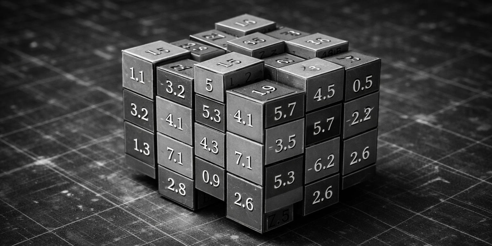

# NumPy { #numpy }


///caption
Imagen generada con Inteligencia Artificial
///

[`numpy`](https://numpy.org/) es el paquete fundamental para computación científica en Python y manejo de arrays numéricos multi-dimensionales.

## Instalación { #install }

```console
pip install numpy
```

## Modo de uso { #usage }

La forma más habitual de importar esta librería es utilizar el alias `np`:

```pycon
>>> import numpy as np
```

## ndarray { #ndarray }

En el núcleo de NumPy está el `ndarray`, donde «nd» es por n-dimensional. Un «ndarray» es un array multidimensional de **elementos del mismo tipo**.

Aquí tenemos una diferencia fundamental con las [listas](../../core/datastructures/lists.md) en Python que pueden mantener objetos heterogéneos. Y esta característica propicia que el rendimiento de un ndarray sea bastante mejor que el de una lista convencional.

Para crear un array podemos usar el constructo `np.array()` que recibe un ^^iterable^^:

```pycon
>>> import numpy as np

>>> x = np.array([1, 2, 3, 4, 5])#(1)!
>>> x
array([1, 2, 3, 4, 5])
>>> type(x)
<class 'numpy.ndarray'>
```
{ .annotate }

1. Otros ejemplos de construcción con iterables:

    ```pycon
    >>> np.array('abcde')
    array('abcde', dtype='<U5')

    >>> np.array(range(10))
    array([0, 1, 2, 3, 4, 5, 6, 7, 8, 9])
    ```

Podemos obtener información sobre el array creado:

```pycon
>>> x.ndim#(1)!
1
>>> x.size#(2)!
5
>>> x.shape#(3)!
(5,)
>>> x.dtype#(4)!
dtype('int64')
```
{ .annotate }

1. Dimension del array.
2. Tamaño total del array (número de elementos).
3. Forma (espacial) del array.
4. Tipo de los elementos del array.

### Datos heterogéneos { #het-ndarray }

Hemos dicho que los «ndarray» son estructuras de datos que almacenan un único tipo de datos. A pesar de esto, es posible crear un array con los siguientes valores:

```pycon
>>> x = np.array([4, 'Einstein', 1e-7])
```

Aunque, a priori, puede parecer que estamos mezclando tipos enteros, flotantes y cadenas de texto, lo que realmente se produce (de forma implícita) es una coerción[^1] de tipos a [Unicode](../../core/datatypes/strings.md#unicode):

```pycon
>>> x#(1)!
array(['4', 'Einstein', '1e-07'], dtype='<U32')
```
{ .annotate }

1. Nótese el `dtype='<U32'` que indica **Unicode** como tipo de datos del array.

### Tipos de datos { #datatypes }

NumPy maneja gran cantidad de tipos de datos. A diferencia de los [tipos de datos numéricos en Python](../../core/datatypes/numbers.md) que no establecen un tamaño de bytes de almacenamiento, aquí sí hay una diferencia clara.

Algunos de los tipos de datos numéricos en NumPy se presentan en la siguiente tabla:

| dtype | Descripción | Rango |
| --- | --- | --- |
| `np.int32` | Integer | $[-2147483648, 2147483647]$
| `np.int64` | Integer | $[-9223372036854775808, 9223372036854775807]$
| `np.uint32` | Unsigned integer | $[0, 4294967295]$
| `np.uint64` | Unsigned integer | $[0, 18446744073709551615]$
| `np.float32` | Float | $[-3.4028235e+38, 3.4028235e+38]$
| `np.float64` | Float | $[-1.7976931348623157e+308, 1.7976931348623157e+308]$

NumPy entiende por defecto que `int` hace referencia a `np.int64` y que `float` hace referencia a `np.float64`. Son «alias» bastante utilizados.

Si creamos un array de **números enteros**, el tipo de datos por defecto será `int64`:

```pycon
>>> a = np.array(range(10))
>>> a
array([0, 1, 2, 3, 4, 5, 6, 7, 8, 9])
>>> a.dtype
dtype('int64')
```

Sin embargo podemos especificar el tipo de datos que nos interese:

```pycon
>>> a = np.array(range(10), dtype='int32')
>>> a
array([0, 1, 2, 3, 4, 5, 6, 7, 8, 9], dtype=int32)
>>> a.dtype
dtype('int32')
```

Lo mismo ocurre con **valores flotantes**, donde `float64` es el tipo de datos por defecto.

Es posible convertir el tipo de datos que almacena un array mediante el método `astype`:

```pycon hl_lines="4"
>>> a
array([0, 1, 2, 3, 4, 5, 6, 7, 8, 9])

>>> b = a.astype(float)

>>> b
array([0., 1., 2., 3., 4., 5., 6., 7., 8., 9.])
>>> b.dtype
dtype('float64')
```

### Arrays vs. listas { #arrays-vs-lists }

Como ya se ha comentado en la introducción de esta sección, el uso de `ndarray` frente a `list` está justificado por cuestiones de rendimiento. Pero veamos un <span class="example">ejemplo:material-flash:</span> clarificador en el que sumamos 10 millones de valores enteros:

```pycon
>>> array_as_list = list(range(10_000_000))
>>> array_as_ndarray = np.array(array_as_list)

>>> %timeit sum(array_as_list)
27.5 ms ± 24 μs per loop (mean ± std. dev. of 7 runs, 10 loops each)

>>> %timeit array_as_ndarray.sum()
1.29 ms ± 2.81 μs per loop (mean ± std. dev. of 7 runs, 1,000 loops each)

>>> 27.5 // 1.29
21.0
```

Utilizar `ndarray` frente a `list` (en este contexto) es 21 veces más rápido :fontawesome-regular-face-surprise:

En cualquier caso, existe la posibilidad de **convertir a lista** cualquier «ndarray» mediante el método `tolist()`:

```pycon
>>> a
array([0, 1, 2, 3, 4, 5, 6, 7, 8, 9])
>>> a.tolist()
[0, 1, 2, 3, 4, 5, 6, 7, 8, 9]
```

### Matrices { #matrix }

Una matriz no es más que un **array bidimensional**. Como ya se ha comentado, NumPy provee `ndarray` que se comporta como un array multidimensional con lo que podríamos crear una matriz sin mayor problema.

Veamos un ejemplo en el que tratamos de construir con NumPy la siguiente matriz:

$$
M=
\begin{bmatrix}
    1 & 2 & 3 \\
    4 & 5 & 6 \\
    7 & 8 & 9 \\
    10 & 11 & 12
\end{bmatrix}
$$

Nos apoyamos en una [lista de listas](../../core/datastructures/lists.md#list-of-lists) para la creación de la matriz:

```pycon
>>> M = np.array([[1, 2, 3], [4, 5, 6], [7, 8, 9], [10, 11, 12]])
>>> M
array([[ 1,  2,  3],
       [ 4,  5,  6],
       [ 7,  8,  9],
       [10, 11, 12]])
>>> M.ndim#(1)!
2
>>> M.size#(2)!
12
>>> M.shape#(3)!
(4, 3)
>>> M.dtype#(4)!
dtype('int64')
```
{ .annotate }

1. Se trata de una matrix :material-arrow-right-bold: array bidimensional.
2. Hay 12 elementos en total.
3. 4 filas :octicons-x-24: 3 columnas.
4. Los valores de la matriz son números enteros.

!!! exercise "Ejercicio"

    Crea los siguientes arrays en NumPy:

    $$
    (I)\quad
    \begin{bmatrix}
        88 & 23 & 39 & 41
    \end{bmatrix}
    $$

    $$
    (II)\quad
    \begin{bmatrix}
        76.4 & 21.7 & 38.4 \\
        41.2 & 52.8 & 68.9
    \end{bmatrix}
    $$

    $$
    (III)\quad
    \begin{bmatrix}
        12 \\
        4 \\
        9 \\
        8
    \end{bmatrix}
    $$

    Encuentra igualmente las siguientes características de cada uno de ellos: dimensión, tamaño, forma y tipo de sus elementos.

    [:material-lightbulb: Solución](files/numpy/np_matrix.py)

#### Cambiando la forma { #reshape }

Dado un array, podemos cambiar su forma mediante la función `np.reshape()`:

```pycon
>>> np.array(range(1, 13)).reshape(3, 4)#(1)!
array([[ 1,  2,  3,  4],
       [ 5,  6,  7,  8],
       [ 9, 10, 11, 12]])
```
{ .annotate }

1. 3 filas :octicons-x-24: 4 columnas.

Si sólo queremos especificar un número determinado de filas o columnas, podemos dejar la otra dimensión a -1:

```pycon
>>> np.array(range(1, 13)).reshape(6, -1)#(1)!
array([[ 1,  2],
       [ 3,  4],
       [ 5,  6],
       [ 7,  8],
       [ 9, 10],
       [11, 12]])

>>> np.array(range(1, 13)).reshape(-1, 3)#(2)!
array([[ 1,  2,  3],
       [ 4,  5,  6],
       [ 7,  8,  9],
       [10, 11, 12]])
```
{ .annotate }

1. 6 filas :octicons-x-24: el número de columnas necesarias.
1. 3 columnas :octicons-x-24: el número de filas necesarias.

!!! warning "Dimensión incorrecta"

    En el caso de que no exista posibilidad de cambiar la forma del array por el número de filas y/o columnas especificado, obtendremos un error de tipo `ValueError: cannot reshape array`.

### Persistiendo arrays { #persist-arrays }

Es posible que nos interese guardar de forma persistente los arrays que hemos ido creando. Para ello NumPy nos provee —al menos— de dos formatos:

=== "Binario :octicons-file-binary-16:"

    El método `save()` almacena la estructura de datos en [formato NPY](https://numpy.org/devdocs/reference/generated/numpy.lib.format.html).

    ```pycon title="Volcado"
    >>> M
    array([[ 1,  2,  3],
           [ 4,  5,  6],
           [ 7,  8,  9],
           [10, 11, 12]])

    >>> np.save('my_matrix', M)

    >>> !file my_matrix.npy
    my_matrix.npy: NumPy data file, version 1.0, description
    {'descr': '<i8', 'fortran_order': False, 'shape': (4, 3), }
    ```

    El método `load()` permite cargar los datos volcados de vuelta en un «ndarray»:

    ```pycon title="Carga"
    >>> M_reloaded = np.load('my_matrix.npy')

    >>> M_reloaded
    array([[ 1,  2,  3],
           [ 4,  5,  6],
           [ 7,  8,  9],
           [10, 11, 12]])
    ```    

=== "Texto plano :fontawesome-solid-file-csv:"

    El método `savetxt()` almacena la estructura de datos en [formato CSV](https://es.wikipedia.org/wiki/Valores_separados_por_comas).

    ```pycon title="Volcado"
    >>> M
    array([[ 1,  2,  3],
           [ 4,  5,  6],
           [ 7,  8,  9],
           [10, 11, 12]])

    >>> np.savetxt('my_matrix.csv', M)#(1)!

    >>> !file my_matrix.csv
    my_matrix.csv: ASCII text
    ```
    { .annotate }
    
    1.  - Por defecto los datos se almacenan en formato _float_.
        - Si quisiéramos volcarlos como enteros, tendríamos que hacer lo siguiente:
        ```pycon
        >>> np.savetxt('my_matrix.csv', M, fmt='%d')
        ```

    El método `loadtxt()` permite cargar los datos volcados de vuelta en un «ndarray»:

    ```pycon title="Carga"
    >>> M_reloaded = np.loadtxt('my_matrix.csv')

    >>> M_reloaded
    array([[ 1.,  2.,  3.],
           [ 4.,  5.,  6.],
           [ 7.,  8.,  9.],
           [10., 11., 12.]])

    >>> M_reloaded = np.loadtxt('my_matrix.csv').astype('int')#(1)!
    >>> M_reloaded
    array([[ 1,  2,  3],
           [ 4,  5,  6],
           [ 7,  8,  9],
           [10, 11, 12]])
    ```    
    { .annotate }
    
    1. En este caso convertimos el array a valores enteros.

## Funciones para creación de arrays { #create-arrays-funcs }

NumPy ofrece una gran variedad de funciones predefinidas para creación de arrays que nos permiten simplificar el proceso de construcción de este tipo de estructuras de datos.

### Valores fijos { #fixed-value-arrays }

A continuación veremos una serie de funciones para crear arrays con valores fijos:

=== "Ceros"

    Crea un «ndarray» completamente lleno de ceros:

    ```pycon
    >>> np.zeros((3, 4))#(1)!
    array([[0., 0., 0., 0.],
        [0., 0., 0., 0.],
        [0., 0., 0., 0.]])
    ```
    { .annotate }

    1. Por defecto se obtienen **valores flotantes**. Si queremos generar valores enteros:

        ```pycon
        >>> np.zeros((3, 4), dtype=int)
        array([[0, 0, 0, 0],
            [0, 0, 0, 0],
            [0, 0, 0, 0]])
        ```

    Existe la posibilidad de crear un **array de ceros con las mismas dimensiones** (y forma) que otro array:

    ```pycon
    >>> M = np.array([[1, 2, 3], [4, 5, 6]])

    >>> np.zeros_like(M)
    array([[0, 0, 0],
        [0, 0, 0]])
    ```

=== "Unos"

    Crea un «ndarray» completamente lleno de unos:

    ```pycon
    >>> np.ones((3, 4))
    array([[1., 1., 1., 1.],
        [1., 1., 1., 1.],
        [1., 1., 1., 1.]])
    ```

    Variantes:

    - `#!python np.ones((3, 4), dtype=int)`
    - `#!python np.ones_like(M)`

=== "Mismo valor"

    Crea un «ndarray» completamente lleno de un valor establecido:

    ```pycon
    >>> np.full((3, 4), 7)
    array([[7, 7, 7, 7],
           [7, 7, 7, 7],
           [7, 7, 7, 7]])
    ```

    Variantes:

    - `#!python np.full_like(M, 7)`

=== "Matriz identidad"

    Crea un «ndarray» con la ^^matriz identidad^^[^2]:

    ```pycon
    >>> np.eye(5)
    array([[1., 0., 0., 0., 0.],
           [0., 1., 0., 0., 0.],
           [0., 0., 1., 0., 0.],
           [0., 0., 0., 1., 0.],
           [0., 0., 0., 0., 1.]])
    ```

    Variantes:

    - `#!python np.eye(5, dtype=int)`

=== "Matriz diagonal"

    Crea un «ndarray» con la ^^matriz diagonal^^[^3]:

    ```pycon
    >>> np.diag([1, 2, 3, 4, 5])
    array([[1, 0, 0, 0, 0],
           [0, 2, 0, 0, 0],
           [0, 0, 3, 0, 0],
           [0, 0, 0, 4, 0],
           [0, 0, 0, 0, 5]])
    ```

!!! exercise "Ejercicio"

    Crea la siguiente matriz («ndarray») mediante código Python:

    $$
    \begin{bmatrix} 
        0      & 0      & 0 & \dots & 0\\
        0      & 1      & 0 & \dots & 0\\
        0      & 0      & 2 & \dots & 0\\
        \vdots & \vdots & 0 & \ddots & 0\\
        0      & 0      & 0 & \dots & 49\\
    \end{bmatrix}
    $$

    Encuentra igualmente las siguientes características de cada uno de ellos: dimensión, tamaño, forma y tipo de sus elementos.

    [:material-lightbulb: Solución](files/numpy/diag.py)

### Valores equiespaciados { #equispaced-arrays }

A continuación veremos una serie de funciones para crear arrays con valores equiespaciados o en intervalos definidos:

=== "Valores enteros equiespaciados"

    La función que usamos para este propósito es `np.arange()` cuyo comportamiento es totalmente análogo a la función «built-in» de Python [`range()`](../../core/controlflow/loops.md#range):

    ```pycon
    >>> np.arange(21)#(1)!
    array([ 0,  1,  2,  3,  4,  5,  6,  7,  8,  9, 10, 11, 12, 13, 14, 15, 16,
           17, 18, 19, 20])

    >>> np.arange(6, 60)#(2)!
    array([ 6,  7,  8,  9, 10, 11, 12, 13, 14, 15, 16, 17, 18, 19, 20, 21, 22,
           23, 24, 25, 26, 27, 28, 29, 30, 31, 32, 33, 34, 35, 36, 37, 38, 39,
           40, 41, 42, 43, 44, 45, 46, 47, 48, 49, 50, 51, 52, 53, 54, 55, 56,
           57, 58, 59])

    >>> np.arange(6, 60, 3)#(3)!
    array([ 6,  9, 12, 15, 18, 21, 24, 27, 30, 33, 36, 39, 42, 45, 48, 51, 54,
           57])

    >>> np.arange(6, 16, .3)#(4)!
    array([ 6. ,  6.3,  6.6,  6.9,  7.2,  7.5,  7.8,  8.1,  8.4,  8.7,  9. ,
            9.3,  9.6,  9.9, 10.2, 10.5, 10.8, 11.1, 11.4, 11.7, 12. , 12.3,
           12.6, 12.9, 13.2, 13.5, 13.8, 14.1, 14.4, 14.7, 15. , 15.3, 15.6,
           15.9])
    ```
    { .annotate }
    
    1. Especificamos límite superior.
    2. Especificamos límite inferior y superior.
    3. Especificamos límite inferior, superior y paso.
    4. Especificamos límite inferior, superior y un **paso flotante**.

=== "Valores flotantes equiespaciados"

    La función que usamos para este propósito es np.linspace() cuyo comportamiento es «similar» a np.arange() pero para valores flotantes.

    ```pycon
    >>> np.linspace(6, 60)#(1)!
    array([ 6.        ,  7.10204082,  8.20408163,  9.30612245, 10.40816327,
           11.51020408, 12.6122449 , 13.71428571, 14.81632653, 15.91836735,
           17.02040816, 18.12244898, 19.2244898 , 20.32653061, 21.42857143,
           22.53061224, 23.63265306, 24.73469388, 25.83673469, 26.93877551,
           28.04081633, 29.14285714, 30.24489796, 31.34693878, 32.44897959,
           33.55102041, 34.65306122, 35.75510204, 36.85714286, 37.95918367,
           39.06122449, 40.16326531, 41.26530612, 42.36734694, 43.46938776,
           44.57142857, 45.67346939, 46.7755102 , 47.87755102, 48.97959184,
           50.08163265, 51.18367347, 52.28571429, 53.3877551 , 54.48979592,
           55.59183673, 56.69387755, 57.79591837, 58.89795918, 60.        ])

    >>> np.linspace(6, 60, 20)#(2)!
    array([ 6.        ,  8.84210526, 11.68421053, 14.52631579, 17.36842105,
           20.21052632, 23.05263158, 25.89473684, 28.73684211, 31.57894737,
           34.42105263, 37.26315789, 40.10526316, 42.94736842, 45.78947368,
           48.63157895, 51.47368421, 54.31578947, 57.15789474, 60.        ])

    >>> np.linspace(6, 60, 20, endpoint=False)#(3)!
    array([ 6. ,  8.7, 11.4, 14.1, 16.8, 19.5, 22.2, 24.9, 27.6, 30.3, 33. ,
           35.7, 38.4, 41.1, 43.8, 46.5, 49.2, 51.9, 54.6, 57.3])
    ```
    { .annotate }
    
    1.  - Especificamos límite inferior y superior.
        - En este caso se trata de un intervalo cerrado $[6, 60]$
        - Por defecto se generan 50 valores.
    2.  - Especificamos límite inferior, superior y número total de elementos.
        - En este caso se trata de un intervalo cerrado $[6, 60]$
    3.  - Especificamos límite inferior, superior y número total de elementos.
        - En este caso se trata de un intervalo semicerrado $[6, 60)$

### Valores aleatorios { #random-array }

A continuación veremos una serie de funciones para crear arrays con valores aleatorios y distribuciones de probabilidad:

=== "Valores aleatorios enteros"

    ```pycon
    >>> np.random.randint(1, 100, size=9)#(1)!
    array([82, 97, 41, 21, 74, 78, 64, 55, 96])
    ```
    { .annotate }

    1.  - Especificamos límite inferior, superior y número total de elementos.
        - En este caso se trata de un intervalo semicerrado $[1, 100)$
    
=== "Valores aleatorios flotantes"

    ```pycon
    >>> np.random.random(9)#(1)!
    array([0.46645546, 0.26669973, 0.18785006, 0.88809046, 0.48813905,
           0.9792628 , 0.04653787, 0.53658358, 0.93921952])
    ```
    { .annotate }
    
    1.  - Especificamos número total de elementos.
        - En este caso se trata de un intervalo semicerrado $[0, 1)$

    ```pycon
    >>> np.random.uniform(1, 100, size=9)#(1)!
    array([ 3.17134673, 23.36519832, 96.47212333, 97.60396461, 73.68806549,
           12.39404503, 92.67380475, 75.23402229, 50.73980184])
    ```
    { .annotate }
    
    1.  - Especificamos límite inferior, superior y número total de elementos.
        - En este caso se trata de un intervalo semicerrado $[1, 100)$

#### Distribuciones de probabilidad { #prob-dist }

NumPy ofrece una gran variedad de [distribuciones aleatorias](https://numpy.org/doc/stable/reference/random/generator.html#distributions). A continuación se muestran sólo algunas posibilidades:

=== "Distribución normal"

    ```pycon
    >>> dist = np.random.normal(0, 5, size=1_000_000)#(1)!
    
    >>> dist[:20]#(2)!
    array([ 2.5290643 ,  1.46577658,  1.65170437, -1.36970819, -2.24547757,
            7.19905613, -4.4666239 , -1.05505116,  2.42351298, -4.45314272,
            1.13604077, -2.85054948,  4.34589478, -2.81235743, -0.8215143 ,
            0.57796411, -2.56594122, -7.14899388,  3.49197644,  1.80691996])
    
    >>> dist.mean()#(3)!
    0.004992046432131982
    
    >>> dist.std()#(4)!
    4.998583810032169
    ```
    { .annotate }
    
    1. Generamos 1 millón de valores de una distribución **normal** con media $\mu=0$ y desviación típica $\sigma=5$.
    2. Muestra los primeros 20 elementos.
    3. La media tiende a 0.
    4. La desviación típica tienda a 5.

=== "Muestra aleatoria"

    ```pycon
    >>> coins = np.random.choice(['head', 'tail'], size=1_000_000)#(1)!
    
    >>> coins
    array(['tail', 'head', 'tail', ..., 'tail', 'head', 'tail'], dtype='<U4')
    
    >>> sum(coins == 'head')#(2)!
    499874
    >>> sum(coins == 'tail')#(3)!
    500126
    ```
    { .annotate }
    
    1. Generamos 1 millón de «lanzamientos» de una moneda (cara o cruz).
    2. La suma de las caras tiende a medio millón.
    3. La suma de las cruces tiende a medio millón.

=== "Muestra aleatoria con probabilidades"

    ```pycon
    >>> dices = np.random.choice(#(1)!
    ...     range(1, 7),
    ...     size=1_000_000,
    ...     p=[.5, .1, .1, .1, .1, .1]
    ... )
    
    >>> dices
    array([6, 5, 4, ..., 1, 6, 1])
    
    >>> sum(dices == 1)#(2)!
    500290
    >>> sum(dices == 6)#(3)!
    99550
    ```
    { .annotate }
    
    1.  - Generamos 1 millón de «lanzamientos» de un dado (valores del 1 al 6)
        - La cuestión es que la cara del «1» tiene mayor probabilidad que el resto.
    2. La suma de los «1» tiende a medio millón.
    3. La suma de cualquier otro número tiende a cien mil.

=== "Muestra aleatoria sin reemplazo"

    ```pycon
    >>> import this#(1)!
    >>> import codecs#(2)!
    
    >>> zen = codecs.decode(this.s, 'rot-13').splitlines()[3:]#(3)!
    
    >>> np.random.choice(zen, size=5, replace=False)#(4)!
    array(['Unless explicitly silenced.',
           "Although that way may not be obvious at first unless you're Dutch.",
           'Sparse is better than dense.',
           'If the implementation is easy to explain, it may be a good idea.',
           'Complex is better than complicated.'], dtype='<U69')
    ```
    { .annotate }
    
    1. Esto es un «huevo de pascua»[^4] que permite acceder al [Zen de Python](../../core/introduction/python.md#zen-of-python).
    2. Necesitamos el módulo `codecs` para realizar una conversión de formatos.
    3. Almacenamos en `zen` una lista con los principios del _Zen de Python_ (vía https://bit.ly/3xhsucQ).
    4. Extraemos 5 principios sin reemplazo.

!!! exercise "Ejercicio"

    Crea:

    1. Una matriz de 20 filas y 5 columnas con valores flotantes equiespaciados en el intervalo cerrado $[1, 10]$.
    2. Un array unidimensional con 128 valores aleatorios de una distribución normal $\mu=1$ y $\sigma=2$.
    3. Un array unidimensional con 15 valores aleatorios de una muestra `1 X 2` donde la probabilidad de que gane el equipo local es del 50%, la probabilidad de que empaten es del 30% y la probabilidad de que gane el visitante es del 20%.

    [:material-lightbulb: Solución](files/numpy/np_random.py)

## Manipulando elementos { #items }

Los arrays multidimensionales de NumPy están indexados por unos ejes que establecen la forma en la que debemos acceder a sus elementos. Véase el siguiente diagrama:


### Arrays unidimensionales { #udarrays }

Partimos del siguiente array unidimensional para ejemplificar las distintas operaciones:

```pycon
>>> values = np.array(range(10, 16))
>>> values
array([10, 11, 12, 13, 14, 15])
```

=== "Acceso :material-table-eye:"

    ```pycon
    >>> values[2]
    12

    >>> values[-3]
    13
    ```

=== "Modificación :material-table-edit:"

    ```pycon
    >>> values[0] = values[1] + values[5]
    
    >>> values
    array([26, 11, 12, 13, 14, 15])
    ```

=== "Borrado :material-table-minus:"

    ```pycon
    >>> np.delete(values, 2)#(1)!
    array([10, 11, 13, 14, 15])
    
    >>> np.delete(values, (2, 3, 4))#(2)!
    array([10, 11, 15])
    ```
    { .annotate }
    
    1.  - Índice como escalar.
        - La función `np.delete()` no es destructiva. Devuelve una copia modificada del array.
    1.  - Índice como tupla.
        - La función `np.delete()` no es destructiva. Devuelve una copia modificada del array.

=== "Inserción :material-table-plus:"

    ```pycon
    >>> np.append(values, 16)#(1)!
    array([10, 11, 12, 13, 14, 15, 16])
    
    >>> np.insert(values, 1, 101)#(2)!
    array([10, 101,  11,  12,  13,  14,  15])
    ```
    { .annotate }
    
    1.  - Añade elementos al final del array.
        - La función `np.append()` no es destructiva. Devuelve una copia modificada del array.
        - También es posible añadir varios elementos a la vez:
        ```pycon
        >>> np.append(values, [16, 17, 18])
        array([10, 11, 12, 13, 14, 15, 16, 17, 18])
        ```
    2.  - Añade elementos en una posición determinada del array.
        - La función `np.insert()` no es destructiva. Devuelve una copia modificada del array.
        - También es posible insertar varios elementos a la vez:
        ```pycon
        >>> np.insert(values, 1, [101, 102, 103])
        array([10, 101, 102, 103, 12, 13, 14, 15])
        ```

### Arrays multidimensionales { #ndarrays }

Partimos del siguiente array bidimensional (matriz) para ejemplificar las distintas operaciones:

```pycon
>>> values = np.arange(1, 13).reshape(3, 4)
>>> values
array([[ 1,  2,  3,  4],
       [ 5,  6,  7,  8],
       [ 9, 10, 11, 12]])
```

=== "Acceso :material-table-eye:"

    Acceso a elementos individuales:

    ```pycon
    >>> values[0, 0]
    1
    >>> values[-1, -1]
    12
    >>> values[1, 2]
    7
    ```

    Acceso a múltiples elementos:

    ```pycon
    >>> values[[0, 2], [1, 2]]#(1)!
    array([ 2, 11])
    ```
    { .annotate }
    
    1. Elementos `[0,1]` y `[2,2]`

    Acceso a filas o columnas completas:

    ```pycon
    >>> values[2]#(1)!
    array([ 9, 10, 11, 12])
    >>> values[:, 1]#(2)!
    array([ 2,  6, 10])
    ```
    { .annotate }
    
    1. Tercera fila.
    2. Segunda columna.

    Acceso a zonas parciales del array:

    ```pycon
    >>> values[0:2, 0:2]
    array([[1, 2],
           [5, 6]])
    >>> values[0:2, [1, 3]]
    array([[2, 4],
           [6, 8]])
    ```

    !!! tip "Vistas"
    
        Todos estos accesos devuelven una **vista** del array original. Esto significa que, si modificamos un valor en el array original, se ve reflejado en la vista (y viceversa). Para evitar esta situación podemos usar la función `np.copy()` y desvincular la vista de su fuente.

=== "Modificación :material-table-edit:"

    ```pycon
    >>> values
    array([[ 1,  2,  3,  4],
           [ 5,  6,  7,  8],
           [ 9, 10, 11, 12]])
    
    >>> values[0, 0] = 100#(1)!
    
    >>> values[1] = [55, 66, 77, 88]#(2)!
    
    >>> values[:,2] = [30, 70, 110]#(3)!
    
    >>> values
    array([[100,   2,  30,   4],
           [ 55,  66,  70,  88],
           [  9,  10, 110,  12]])
    ```
    { .annotate }
    
    1. Modificación de un elemento.
    2. Modificación de la segunda fila.
    3. Modificación de la tercera columna.

=== "Borrado :material-table-minus:"

    ```pycon
    >>> values
    array([[ 1,  2,  3,  4],
           [ 5,  6,  7,  8],
           [ 9, 10, 11, 12]])
    
    >>> np.delete(values, 0, axis=0)#(1)!
    array([[ 5,  6,  7,  8],
           [ 9, 10, 11, 12]])
    
    >>> np.delete(values, (1, 3), axis=1)#(2)!
    array([[ 1,  3],
           [ 5,  7],
           [ 9, 11]])
    ```
    { .annotate }
    
    1.  - Borrado de la primera fila.
        - `axis=0` hace referencia a las **filas**.
    2.  - Borrado de la segunda y cuarta columnas.
        - `axis=1` hace referencia a las **columnas**.

=== "Inserción :material-table-plus:"

    Añadir elementos al final del array:

    ```pycon
    >>> values
    array([[1, 2],
           [3, 4]])
    >>> np.append(values, [[5, 6]], axis=0)#(1)!
    array([[1, 2],
           [3, 4],
           [5, 6]])
    >>> np.append(values, [[5], [6]], axis=1)#(2)!
    array([[1, 2, 5],
           [3, 4, 6]])
    
    ```
    { .annotate }
    
    1.  - Añade una nueva fila.
        - `axis=0` hace referencia a las **filas**.
    2.  - Añade una nueva columna.
        - `axis=1` hace referencia a las **columnas**.
    
    Insertar elementos en posiciones arbitrarias del array:

    ```pycon
    >>> values
    array([[1, 2],
           [3, 4]])
    >>> np.insert(values, 0, [0, 0], axis=0)#(1)!
    array([[0, 0],
           [1, 2],
           [3, 4]])
    >>> np.insert(values, 1, [0, 0], axis=1)#(2)!
    array([[1, 0, 2],
           [3, 0, 4]])
    ```
    { .annotate }
    
    1.  - Inserta una nueva fila en la «primera posición».
        - `axis=0` hace referencia a las **filas**.
    2.  - Inserta una nueva columna en la «segunda posición».
        - `axis=1` hace referencia a las **columnas**.

!!! exercise "Ejercicio"

    Utilizando operaciones de modificación, borrado e inserción, transforma la siguiente matriz:

    $$
    \begin{bmatrix}
      17 & 12 & 31 \\
      49 & 11 & 51 \\
      21 & 31 & 62 \\
      63 & 75 & 22
    \end{bmatrix}    
    $$

    en esta:

    $$
    \begin{bmatrix}
      17 & 12 & 31 & 63\\
      49 & 11 & 51 & 75\\
      21 & 31 & 62 & 22\\
    \end{bmatrix}
    $$

    y luego en esta:

    $$
    \begin{bmatrix}
      17 & 12 & 31 & 63\\
      49 & 49 & 49 & 63\\
      21 & 31 & 62 & 63\\
    \end{bmatrix}
    $$

    [:material-lightbulb: Solución](files/numpy/np_transform.py)

### Apilando matrices { #stack-matrix }

Hay ocasiones en las que nos interesa combinar dos matrices (arrays en general). Una de los mecanismos que nos proporciona NumPy es el **apilado**:

=== "Apilado vertical :material-dots-vertical:"

    ```pycon hl_lines="11"
    >>> m1 = np.random.randint(1, 100, size=(3, 2))
    >>> m2 = np.random.randint(1, 100, size=(1, 2))
    
    >>> m1
    array([[68, 68],
           [10, 50],
           [87, 92]])
    >>> m2
    array([[63, 80]])
    
    >>> np.vstack((m1, m2))
    array([[68, 68],
           [10, 50],
           [87, 92],
           [63, 80]])
    ```

=== "Apilado horizontal :material-dots-horizontal:"

    ```pycon hl_lines="13"
    >>> m1 = np.random.randint(1, 100, size=(3, 2))
    >>> m2 = np.random.randint(1, 100, size=(3, 1))
    
    >>> m1
    array([[51, 50],
          [52, 15],
          [14, 21]])
    >>> m2
    array([[18],
           [52],
           [ 1]])
    
    >>> np.hstack((m1, m2))
    array([[51, 50, 18],
           [52, 15, 52],
           [14, 21,  1]])
    ```    

### Repitiendo elementos { #rep-items }

=== "Repetición por ejes :material-axis-arrow:"

    El parámetro de repetición indica el número de veces que repetimos el array completo por cada eje:

    ```pycon
    >>> values
    array([[1, 2],
           [3, 4],
           [5, 6]])
    
    >>> np.tile(values, 3)#(1)!
    array([[1, 2, 1, 2, 1, 2],
           [3, 4, 3, 4, 3, 4],
           [5, 6, 5, 6, 5, 6]])
    
    >>> np.tile(values, (2, 3))#(2)!
    array([[1, 2, 1, 2, 1, 2],
           [3, 4, 3, 4, 3, 4],
           [5, 6, 5, 6, 5, 6],
           [1, 2, 1, 2, 1, 2],
           [3, 4, 3, 4, 3, 4],
           [5, 6, 5, 6, 5, 6]])
    ```
    { .annotate }
    
    1. Repite 3 veces en columnas.
    2. Repite 2 veces en filas y 3 veces en columnas.

=== "Repetición por elementos :material-sitemap-outline:"

    El parámetro de repetición indica el número de veces que repetimos cada elemento del array:

    ```pycon
    >>> values
    array([[1, 2],
           [3, 4],
           [5, 6]])
    
    >>> np.repeat(values, 2)#(1)!
    array([1, 1, 2, 2, 3, 3, 4, 4, 5, 5, 6, 6])
    
    >>> np.repeat(values, 2, axis=0)#(2)!
    array([[1, 2],
           [1, 2],
           [3, 4],
           [3, 4],
           [5, 6],
           [5, 6]])
    
    >>> np.repeat(values, 3, axis=1)#(3)!
    array([[1, 1, 1, 2, 2, 2],
           [3, 3, 3, 4, 4, 4],
           [5, 5, 5, 6, 6, 6]])
    ``` 
    { .annotate }
    
    1. Repite 2 veces cada elementos.
    2.  - Repite 2 veces en filas.
        - `axis=0` hace referencia a las **filas**.
    3.  - Repite 3 veces en columnas.
        - `axis=1` hace referencia a las **columnas**.

### Acceso por diagonal { #diagonal }

Es bastante común acceder a elementos de una matriz —cuadrada— tomando como referencia su diagonal. Para ello, NumPy nos provee de ciertos mecanismos que veremos a continuación.

Para ejemplificarlo, partiremos del siguiente array:

```pycon
>>> values = np.array([73, 86, 90, 20, 96, 55, 15, 48, 38, 63, 96, 95, 13, 87, 32, 96]).reshape(4, 4)

>>> values
array([[73, 86, 90, 20],
       [96, 55, 15, 48],
       [38, 63, 96, 95],
       [13, 87, 32, 96]])
```

A partir de un array multidimensional se establece una «distancia» $k$ desde la diagonal que usaremos en las operaciones posteriores:


=== "Extracción :material-table-off:"

    Veamos cómo variando el parámetro `k` obtenemos distintos resultados:

    ```pycon
    >>> np.diag(values)#(1)!
    array([73, 55, 96, 96])
    
    >>> for k in range(1, values.shape[0]):
    ...     print(f'k={k}', np.diag(values, k=k))
    ...
    k=1 [86 15 95]
    k=2 [90 48]
    k=3 [20]
    
    >>> for k in range(1, values.shape[0]):
    ...     print(f'k={-k}', np.diag(values, k=-k))
    ...
    k=-1 [96 63 32]
    k=-2 [38 87]
    k=-3 [13]
    ```
    { .annotate }
    
    1. $k = 0$

=== "Modificación :material-table-pivot:"

    NumPy también provee un método `np.diag_indices()` que retorna los índices de los elementos de la diagonal principal, con lo que podemos modificar sus valores directamente:

    ```pycon
    >>> values
    array([[73, 86, 90, 20],
           [96, 55, 15, 48],
           [38, 63, 96, 95],
           [13, 87, 32, 96]])
    
    >>> di = np.diag_indices(values.shape[0])
    
    >>> di
    (array([0, 1, 2, 3]), array([0, 1, 2, 3]))
    
    >>> values[di] = 0
    
    >>> values
    array([[ 0, 86, 90, 20],
           [96,  0, 15, 48],
           [38, 63,  0, 95],
           [13, 87, 32,  0]])
    ```    

    !!! note "Índices auxiliares"
    
        Existen igualmente las funciones `np.triu_indices()` y `np.tril_indices()` para obtener los índices de la diagonal superior e inferior de una matriz.

## Operaciones sobre arrays { #array-ops }

En este apartado veremos distintas operaciones que podemos realizar con `ndarrays` y las funciones que provee NumPy para ello.

### Operaciones lógicas { #logical-ops }

Las operaciones lógicas involucran condiciones y filtrado con tratamiento de valores booleanos:

=== "Indexado booleano"

    El indexado booleano es una operación que permite conocer (a nivel de elemento) si un array cumple o no con una determinada condición:

    ```pycon
    >>> values
    array([[73, 86, 90, 20],
        [96, 55, 15, 48],
        [38, 63, 96, 95],
        [13, 87, 32, 96]])

    >>> values > 50#(1)!
    array([[ True, False, False, False],
           [False,  True, False,  True],
           [ True, False, False, False],
           [False,  True, False,  True]])
    
    >>> values[values > 50]#(2)!
    array([60, 63, 68, 58, 65, 96])
    
    >>> values[values > 50] = -1#(3)!
    
    >>> values
    array([[-1, 47, 34, 38],
           [43, -1, 37, -1],
           [-1, 28, 31, 43],
           [32, -1, 32, -1]])
    ```
    { .annotate }
    
    1. Indexado booleano.
    2. Uso de máscara.
    3. Modificación de valores.

    !!! tip "Condiciones compuestas"
    
        Las condiciones pueden ser más complejas e incorporar operadores lógicos `|` (or) y `&` (and) :material-arrow-right-bold: `#!python (values < 25) & (values < 75)`
    
    !!! exercise "Ejercicio"
    
        Extrae todos los números impares de la siguiente matriz:

        $$
        \text{values} =
        \begin{bmatrix}
          10 & 11 & 12 & 13\\
          14 & 15 & 16 & 17\\
          18 & 19 & 20 & 21\\
        \end{bmatrix}
        $$

        [:material-lightbulb: Solución](files/numpy/np_odds.py)

    Si lo que nos interesa es obtener los índices del array que satisfacen una determinada condición, NumPy nos proporciona el método `where()`:

    ```pycon hl_lines="1"
    >>> idx = np.where(values > 50)
    
    >>> idx
    (array([0, 1, 1, 2, 3, 3]), array([0, 1, 3, 0, 1, 3]))
    
    >>> values[idx]
    array([60, 63, 68, 58, 65, 96])
    ```

    !!! exercise "Ejercicio"
    
        Partiendo de una matriz de 10 filas y 10 columnas con valores aleatorios enteros en el intervalo, realice las operaciones necesarias para obtener una matriz de las mismas dimensiones donde:

        1. Todos los elementos de la diagonal sean 50.
        2. Los elementos mayores que 50 tengan valor 100.
        3. Los elementos menores que 50 tengan valor 0.

        [:material-lightbulb: Solución](files/numpy/diag_transform.py)

=== "Comparando arrays"

    Dados dos arrays podemos compararlos usando el operador `==` del mismo modo que con cualquier otro objeto en Python. La cuestión es que el resultado se evalúa a nivel de elemento:

    ```pycon
    >>> m1 = np.array([[1, 2], [3, 4]])
    >>> m3 = np.array([[1, 2], [3, 4]])
    
    >>> m1 == m2
    array([[ True,  True],
           [ True,  True]])
    ```

    Si queremos comparar arrays en su totalidad, podemos hacer uso de la siguiente función:

    ```pycon
    >>> np.array_equal(m1, m2)
    True
    ```    

### Operaciones de conjunto { #set-ops }

Al igual que existen [operaciones sobre conjuntos](../../core/datastructures/sets.md) en Python, también podemos llevarlas a cabo sobre arrays en NumPy.

Partiremos de los dos siguientes arrays para ejemplificar cada una de las posibles operaciones de conjunto:

```pycon
>>> x = np.array([9, 4, 11, 3, 14, 5, 13, 12, 7])
>>> y = np.array([17, 9, 19, 4, 18, 7, 13, 11, 10])
```

=== "Unión :material-set-all:"

    $x \cup y$

    ```pycon
    >>> np.union1d(x, y)
    array([ 3,  4,  5,  7,  9, 10, 11, 12, 13, 14, 17, 18, 19])    
    ```

=== "Intersección :material-set-center:"

    $x \cap y$

    ```pycon
    >>> np.intersect1d(x, y)
    array([ 4,  7,  9, 11, 13])
    ```

=== "Diferencia :material-set-left:"

    $x \setminus y$

    ```pycon
    >>> np.setdiff1d(x, y)
    array([ 3,  5, 12, 14])
    ```

### Ordenación de arrays { #sort }

En términos generales, existen dos formas de ordenar cualquier estructura de datos, una que modifica «in-situ» los valores (destructiva) y otra que devuelve «nuevos» valores (no destructiva). En el caso de NumPy también es así.

=== "Arrays unidimensionales"

    ```pycon
    >>> values
    array([23, 24, 92, 88, 75, 68, 12, 91, 94, 24,  9, 21, 42,  3, 66])
    
    >>> np.sort(values)#(1)!
    array([ 3,  9, 12, 21, 23, 24, 24, 42, 66, 68, 75, 88, 91, 92, 94])
    
    >>> values.sort()#(2)!
    
    >>> values
    array([ 3,  9, 12, 21, 23, 24, 24, 42, 66, 68, 75, 88, 91, 92, 94])
    ```
    { .annotate }
    
    1. Método no destructivo.
    2. Método destructivo.

=== "Arrays multidimensionales"

    ```pycon
    >>> values
    array([[52, 23, 90, 46],
           [61, 63, 74, 59],
           [75,  5, 58, 70],
           [21,  7, 80, 52]])
    
    >>> np.sort(values, axis=1)#(1)!
    array([[23, 46, 52, 90],
           [59, 61, 63, 74],
           [ 5, 58, 70, 75],
           [ 7, 21, 52, 80]])
    
    >>> np.sort(values, axis=0)#(2)!
    array([[21,  5, 58, 46],
           [52,  7, 74, 52],
           [61, 23, 80, 59],
           [75, 63, 90, 70]])
    ```
    { .annotate }
    
    1.  - Método no destructivo.
        - `axis=1` hace referencia a las **columnas**.
        -  También existe `#!python values.sort(axis=1)` como método destructivo.
    2.  - Método no destructivo.
        - `axis=0` hace referencia a las **filas**.
        -  También existe `#!python values.sort(axis=0)` como método destructivo.

### Contando valores { #count }

Otra de las herramientas útiles que proporciona NumPy es la posibilidad de contar el número de valores que existen en un array en base a ciertos criterios.

Para ejemplificarlo, partiremos de un array unidimensional con valores de una distribución aleatoria uniforme en el intervalo $[1,10]$:

```pycon
>>> values = np.random.randint(1, 11, size=1000)

>>> values
array([ 3,  9,  5,  6, 10,  7, 10,  5,  7,  7,  2,  1,  2,  2,  4, 10,  8,
        8,  3,  9, 10,  2,  7,  2, 10,  6,  9,  6,  8,  2,  5,  2,  6,  9,
        5,  1,  6,  4,  6,  2,  9, 10,  5,  3,  4,  4,  4, 10,  8,  9,  8,
        ...])
```

=== "Valores únicos"

    ```pycon
    >>> np.unique(values)
    array([ 1,  2,  3,  4,  5,  6,  7,  8,  9, 10])
    ```

=== "Valores únicos con frecuencias"

    ```pycon
    >>> np.unique(values, return_counts=True)
    (array([ 1,  2,  3,  4,  5,  6,  7,  8,  9, 10]),
     array([ 88, 106,  90,  87, 116,  93, 106, 104, 122,  88]))
    ```

=== "Valores distintos de cero"

    ```pycon
    >>> np.count_nonzero(values)
    1000
    ```

=== "Valores distintos de cero con condición"

    ```pycon
    >>> np.count_nonzero(values > 5)
    513
    ```
    
### Operaciones aritméticas { #arith-ops }

Una de las grandes ventajas del uso de arrays numéricos en NumPy es la posibilidad de trabajar con ellos como si fueran objetos «simples» pero sacando partido de la **aritmética vectorial**. Esto redunda en una mayor eficiencia y rapidez de cómputo.

=== "Arrays con la misma dimensión"

    Cuando operamos entre arrays de las mismas dimensiones, las operaciones aritméticas se realizan elemento a elemento (ocupando misma posición) y el resultado, obviamente, tiene las mismas dimensiones:

    ```pycon
    >>> m1
    array([[21, 86, 45],
           [31, 36, 78],
           [31, 64, 70]])
    
    >>> m2
    array([[58, 67, 17],
           [99, 53,  9],
           [92, 42, 75]])
    
    >>> m1 + m2
    array([[ 79, 153,  62],
           [130,  89,  87],
           [123, 106, 145]])
    
    >>> m1 - m2
    array([[-37,  19,  28],
           [-68, -17,  69],
           [-61,  22,  -5]])
    
    >>> m1 * m2
    array([[1218, 5762,  765],
           [3069, 1908,  702],
           [2852, 2688, 5250]])
    
    >>> m1 / m2#(1)!
    array([[0.36206897, 1.28358209, 2.64705882],
           [0.31313131, 0.67924528, 8.66666667],
           [0.33695652, 1.52380952, 0.93333333]])
    
    >>> m1 // m2#(2)!
    array([[0, 1, 2],
           [0, 0, 8],
           [0, 1, 0]])
    ```
    { .annotate }
    
    1. División flotante.
    2. División entera.

=== "Arrays con distinta dimensión"

    Cuando operamos entre arrays con dimensiones diferentes, siempre y cuando se cumplan ciertas restricciones en tamaños de filas y/o columnas, lo que se produce es un «broadcasting» (o difusión) de los valores.

    <div class="grid cards" markdown>
    
    -   Suma con array «fila»:
    
        ```pycon
        >>> m
        array([[9, 8, 1],
               [7, 6, 7]])
        
        >>> v
        array([[2, 3, 6]])
        
        >>> m + v#(1)!
        array([[11, 11,  7],
               [ 9,  9, 13]])
        ```
        { .annotate }
        
        1. Aquí se produce el «broadcasting».
    
    -   Suma con array «columna»:

        ```pycon
        >>> m
        array([[9, 8, 1],
               [7, 6, 7]])
        
        >>> v
        array([[1],
               [6]])
        
        >>> m + v#(1)!
        array([[10,  9,  2],
               [13, 12, 13]])
        ```
        { .annotate }
        
        1. Aquí se produce el «broadcasting».
    
    </div>

    !!! warning "Erores en dimensiones"
    
        En el caso de que no coincidan dimensiones de filas y/o columnas, NumPy no podrá ejecutar la operación y obtendremos un error `ValueError: operands could not be broadcast together with shapes`.

=== "Arrays y escalares"

    Al igual que ocurría en los casos anteriores, si operamos con un array y un escalar, éste último será difundido para abarcar el tamaño del array:

    ```pycon
    >>> m
    array([[9, 8, 1],
           [7, 6, 7]])
    
    >>> m + 5
    array([[14, 13,  6],
           [12, 11, 12]])
    
    >>> m - 5
    array([[ 4,  3, -4],
           [ 2,  1,  2]])
    
    >>> m * 5
    array([[45, 40,  5],
           [35, 30, 35]])
    
    >>> m / 5
    array([[1.8, 1.6, 0.2],
           [1.4, 1.2, 1.4]])
    
    >>> m // 5
    array([[1, 1, 0],
           [1, 1, 1]])
    
    >>> m ** 5
    array([[59049, 32768,     1],
           [16807,  7776, 16807]])
    ```        

### Operaciones unarias { #unary-ops }

Existen multitud de operaciones sobre un único array. A continuación veremos algunas de las más utilizas en NumPy.

=== "Funciones universales"

    Las funciones universales «ufunc» son funciones que operan sobre arrays **elemento a elemento**. Existen [muchas funciones universales definidas en NumPy](https://docs.scipy.org/doc/numpy/reference/ufuncs.html#available-ufuncs), parte de ellas operan sobre dos arrays y parte sobre un único array.

    Un <span class="example">ejemplo:material-flash:</span> de algunas de estas funciones:

    ```pycon
    >>> values
    array([[48.32172375, 24.89651106, 77.49724241],
           [77.81874191, 22.54051494, 65.11282444],
           [ 5.54960482, 59.06720303, 62.52817198]])
    
    >>> np.sqrt(values)
    array([[6.95138287, 4.98964037, 8.80325181],
           [8.82149318, 4.74768522, 8.06925179],
           [2.35575992, 7.68551905, 7.9074757 ]])
    
    >>> np.sin(values)
    array([[-0.93125201, -0.23403917,  0.86370435],
           [ 0.66019205, -0.52214693,  0.75824777],
           [-0.66953344,  0.58352079, -0.29903488]])
    
    >>> np.ceil(values)
    array([[49., 25., 78.],
           [78., 23., 66.],
           [ 6., 60., 63.]])
    
    >>> np.floor(values)
    array([[48., 24., 77.],
           [77., 22., 65.],
           [ 5., 59., 62.]])
    
    >>> np.log(values)
    array([[3.87788123, 3.21472768, 4.35024235],
           [4.3543823 , 3.11531435, 4.17612153],
           [1.71372672, 4.07867583, 4.13561721]])
    ```

=== "Reduciendo el resultado"

    NumPy nos permite aplicar cualquier función sobre un array **reduciendo** el resultado por alguno de sus ejes. Esto abre una amplia gama de posibilidades.

    A modo de ilustración, veamos un par de <span class="example">ejemplos:material-flash:</span> con la suma y el producto:

    ```pycon
    >>> values
    array([[8, 2, 7],
           [2, 0, 6],
           [6, 3, 4]])
    
    >>> np.sum(values, axis=0)#(1)!
    array([16,  5, 17])
    
    >>> np.sum(values, axis=1)#(2)!
    array([17,  8, 13])
    
    >>> np.prod(values, axis=0)#(3)!
    array([ 96,   0, 168])
    
    >>> np.prod(values, axis=1)#(4)!
    array([112,   0,  72])
    ```
    { .annotate }
    
    1. Suma por columnas.
    2. Suma por filas.
    3. Producto por columnas.
    4. Producto por filas.

    !!! exercise "Ejercicio"
    
        Comprueba que, para $\theta=2\pi$ (_radianes_) y $k=20$ se cumple la siguiente igualdad del _producto infinito de Euler_:

        $$
        \cos\left({\frac{\theta}{2}}\right) \cdot
        \cos\left({\frac{\theta}{4}}\right) \cdot
        \cos\left({\frac{\theta}{8}}\right) \cdots
        =
        \prod_{i=1}^k \cos\left(\frac{\theta}{2^i}\right)
        \approx
        \frac{\sin(\theta)}{\theta}
        $$

        [:material-lightbulb: Solución](files/numpy/euler_product.py)

=== "Funciones estadísticas"

    NumPy proporciona una gran cantidad de [funciones estadísticas](https://numpy.org/doc/stable/reference/routines.statistics.html) que pueden ser aplicadas sobre arrays.

    Veamos algunas de ellas:

    ```pycon
    >>> dist
    array([[-6.79006504, -0.01579498, -0.29182173,  0.3298951 , -5.30598975],
           [ 3.10720923, -4.09625791, -7.60624152,  2.3454259 ,  9.23399023],
           [-7.4394269 , -9.68427195,  3.04248586, -5.9843767 ,  1.536578  ],
           [ 3.33953286, -8.41584411, -9.530274  , -2.42827813, -7.34843663],
           [ 7.1508544 ,  5.51727548, -3.20216834, -5.00154367, -7.15715252]])
    
    >>> np.mean(dist)#(1)!
    -2.1877878715377777
    
    >>> np.std(dist)#(2)!
    5.393254994089515
    
    >>> np.median(dist)#(3)!
    -3.2021683412383295
    ```
    { .annotate }
    
    1. Media.
    2. Desviación típica.
    3. Mediana.

=== "Máximos y mínimos"

    Una de las operaciones más comunes en el manejo de datos es encontrar máximos o mínimos. Para ello, disponemos de las típicas funciones con las ventajas del uso de arrays multidimensionales:

    ```pycon
    >>> values
    array([[66, 54, 33, 15, 58],
           [55, 46, 39, 16, 38],
           [73, 75, 79, 25, 83],
           [81, 30, 22, 32,  8],
           [92, 25, 82, 10, 90]])
    
    >>> np.min(values)#(1)!
    8
    
    >>> np.min(values, axis=0)#(2)!
    array([55, 25, 22, 10,  8])
    >>> np.min(values, axis=1)#(3)!
    array([15, 16, 25,  8, 10])
    
    >>> np.max(values)#(4)!
    92
    
    >>> np.max(values, axis=0)#(5)!
    array([92, 75, 82, 32, 90])
    >>> np.max(values, axis=1)#(6)!
    array([66, 55, 83, 81, 92])
    ```
    { .annotate }
    
    1. Mínimo de todos los valores de la matriz.
    2. Mínimo de cada una de las columnas.
    3. Mínimo de cada una de las filas.
    4. Máximo de todos los valores de la matriz.
    5. Máximo de cada una de las columnas.
    6. Máximo de cada una de las filas.

    También es posible **obtener los índices** de aquellos valores máximos o mínimos:

    ```pycon hl_lines="8"
    >>> values
    array([[66, 54, 33, 15, 58],
           [55, 46, 39, 16, 38],
           [73, 75, 79, 25, 83],
           [81, 30, 22, 32,  8],
           [92, 25, 82, 10, 90]])
    
    >>> idx = np.argmax(values, axis=0)
    
    >>> idx
    array([4, 2, 4, 3, 4])
    
    >>> values[idx, range(values.shape[1])]
    array([92, 75, 82, 32, 90])
    ```

### Vectorizando funciones { #vectorize }

Una de las ventajas de trabajar con arrays numéricos en NumPy es sacar provecho de la optimización que se produce a nivel de la propia estructura de datos. En el caso de que queramos implementar una función propia para realizar una determinada acción, sería deseable seguir aprovechando esa característica.

Veamos un <span class="example">ejemplo:material-flash:</span> en el que queremos realizar el siguiente cálculo entre dos matrices $A$ y $B$:

$$
A_{ij} * B_{ij} =
\begin{cases}
    A_{ij} + B_{ij}   &, \text{si}\ A_{ij} > B_{ij}\\
    A_{ij} - B_{ij}   &, \text{si}\ A_{ij} < B_{ij}\\
    0                 &, \text{e.o.c.}
\end{cases}
$$

Esta función, definida en Python, quedaría tal que así:

```pycon
>>> def customf(a, b):
...     if a > b:
...         return a + b
...     elif a < b:
...         return a - b
...     else:
...         return 0
...
```

Las dos matrices de partida tienen 9M de valores aleatorios entre -100 y 100:

```pycon
>>> A = np.random.randint(-100, 100, size=(3000, 3000))
>>> B = np.random.randint(-100, 100, size=(3000, 3000))
```

Una primera aproximación para aplicar esta función a cada elemento de las matrices de entrada sería la siguiente:

```pycon
>>> result = np.zeros_like(A)

>>> %%timeit#(1)!
... for i in range(A.shape[0]):
...     for j in range(A.shape[1]):
...         result[i, j] = customf(A[i, j], B[i, j])
...
...
2.31 s ± 53.1 ms per loop (mean ± std. dev. of 7 runs, 1 loop each)
```
{ .annotate }

1. Prueba realizada con un MacBook Pro 13" M1, 2020 (RAM 16GB).

#### Mejorando rendimiento con funciones vectorizadas { #improve-vectorize }

Con un pequeño detalle podemos mejorar el rendimiento de la función que hemos diseñado anteriormente. Se trata de [decorarla](../../core/modularity/functions.md#decorators) con `np.vectorize` con lo que estamos otorgándole un comportamiento distinto y enfocado al procesamiento de arrays numéricos:

```pycon
>>> @np.vectorize
... def customf(a, b):
...     if a > b:
...         return a + b
...     elif a < b:
...         return a - b
...     else:
...         return 0
...
```

Dado que ahora ya se trata de una **función vectorizada** podemos aplicarla directamente a las matrices de entrada (aprovechamos para medir su tiempo de ejecución):

```pycon
>>> %timeit customf(A, B)
1.16 s ± 3.24 ms per loop (mean ± std. dev. of 7 runs, 1 loop each)
```

:material-check-all:{ .blue } Usando una función vectorizada hemos conseguido reducir prácticamente a **la mitad el tiempo** de ejecución con respecto al modelo «clásico». A medida que los tamaños de las matrices (arrays) son mayores se consigue una mejor aceleración.

!!! tip "Funciones «lambda»"

    El uso de [funciones «lambda»](../../core/modularity/functions.md#lambda) puede ser muy útil en vectorización :material-arrow-right-bold: `#!python np.vectorize(lambda a, b: return a + b)`

!!! exercise "Ejercicio"

    1. Crea dos matrices cuadradas de 20x20 con valores aleatorios flotantes uniformes en el intervalo $[0,1000)$
    2. Vectoriza una función que devuelva la media (elemento a elemento) entre las dos matrices.
    3. Realiza la misma operación que en 2) pero usando suma de matrices y división por escalar.
    4. Calcula los tiempos de ejecución de 2) y 3)

    [:material-lightbulb: Solución](files/numpy/vectorize.py)

## Álgebra lineal { #lineal-algebra }

NumPy tiene una sección dedicada al [álgebra lineal](https://numpy.org/doc/stable/reference/routines.linalg.html) cuyas funciones pueden resultar muy interesantes según el contexto en el que estemos trabajando.

### Producto de matrices { #matrix-product }

Si bien hemos hablado del producto de arrays elemento a elemento, NumPy nos permite hacer la [multiplicación clásica de matrices](https://es.wikipedia.org/wiki/Multiplicaci%C3%B3n_de_matrices):

```pycon
>>> m1
array([[1, 8, 4],
       [8, 7, 1],
       [1, 3, 8]])

>>> m2
array([[1, 5, 7],
       [9, 4, 2],
       [1, 4, 2]])

>>> np.dot(m1, m2)
array([[77, 53, 31],
       [72, 72, 72],
       [36, 49, 29]])
```

En <span class="pyversion"><a href="https://docs.python.org/3.5/">Python <span class="version">:octicons-tag-24: 3.5</span></a></span> se introdujo el operador [`@`](https://docs.python.org/3/whatsnew/3.5.html#pep-465-a-dedicated-infix-operator-for-matrix-multiplication) que permitía implementar el [método especial](../../core/modularity/oop.md#magic-methods) `__matmul__()` de multiplicación de matrices.

NumPy lo ha desarrollado y simplifica la multiplicación de matrices de la siguiente manera:

```pycon
>>> m1 @ m2
array([[77, 53, 31],
       [72, 72, 72],
       [36, 49, 29]])
```

!!! exercise "Ejercicio"

    Comprueba que la matriz $\begin{bmatrix}1 & 2\\3 & 5\end{bmatrix}$ satisface la ecuación matricial: $X^2 - 6X - I = 0$ donde $I$ es la [matriz identidad](#fixed-value-arrays) de orden 2.

    [:material-lightbulb: Solución](files/numpy/identity_equation.py)

### Determinante de una matriz { #determinant }

El [cálculo del determinante](https://es.wikipedia.org/wiki/Determinante_(matem%C3%A1tica)) es una operación muy utilizada en álgebra lineal. Lo podemos realizar en NumPy de la siguiente manera:

```pycon
>>> m
array([[4, 1, 6],
       [4, 8, 8],
       [2, 1, 7]])

>>> np.linalg.det(m)
108.00000000000003
```

### Inversa de una matriz { #inverse }

La [inversa de una matriz](https://es.wikipedia.org/wiki/Matriz_invertible) se calcula de la siguiente manera:

```pycon
>>> m
array([[4, 1, 6],
       [4, 8, 8],
       [2, 1, 7]])

>>> m_inv = np.linalg.inv(m)

>>> m_inv
array([[ 0.44444444, -0.00925926, -0.37037037],
       [-0.11111111,  0.14814815, -0.07407407],
       [-0.11111111, -0.01851852,  0.25925926]])
```

Una propiedad de la matriz inversa es que si la multiplicamos por la matriz de partida obtenemos la matriz identidad. Vemos que se cumple: $A \cdot A^{-1} = I$:

```pycon
>>> np.dot(m, m_inv)
array([[1., 0., 0.],
       [0., 1., 0.],
       [0., 0., 1.]])
```

### Traspuesta de una matriz { #transpose }

La traspuesta de una matriz $A$ se denota por: $(A^t)_{ij} = A_{ji},\ 1\le i\le n,\ 1\le j\le m$, pero básicamente consiste en intercambiar filas por columnas.

Aún más fácil es computar la traspuesta de una matriz con NumPy:

```pycon
>>> m
array([[1, 2, 3],
       [4, 5, 6]])

>>> m.T
array([[1, 4],
       [2, 5],
       [3, 6]])
```

!!! exercise "Ejercicio"

    Dadas las matrices:

    $$
    A=
    \begin{bmatrix}
      1 & -2 & 1 \\
      3 & 0 & 1
    \end{bmatrix}
    ;\
    B=
    \begin{bmatrix}
      4 & 0 & -1 \\
      -2 & 1 & 0
    \end{bmatrix}
    $$

    comprueba que se cumplen las siguientes igualdades:

    1. $(A + B)^t = A^t + B^t$
    2. $(3A)^t = 3A^t$

    [:material-lightbulb: Solución](files/numpy/transpose.py)

### Elevar matriz a potencia { #pow }

En el mundo del álgebra lineal es muy frecuente recurrir a la exponenciación de matrices a a través de su producto clásico. En este sentido, NumPy nos proporciona una función para computarlo:

```pycon
>>> m
array([[4, 1, 6],
       [4, 8, 8],
       [2, 1, 7]])

>>> np.linalg.matrix_power(m, 3)#(1)!
array([[ 348,  250,  854],
       [ 848,  816, 2000],
       [ 310,  231,  775]])
```
{ .annotate }

1. Más eficiente que `#!python np.dot(m, np.dot(m, m))`


!!! exercise "Ejercicio"

    Dada la matriz $A = \begin{bmatrix} 4 & 5 & -1 \\ -3 & -4 & 1 \\ -3 & -4 & 0 \end{bmatrix}$ calcula: $A^2, A^3, \dots, A^{128}$

    ¿Notas algo especial en los resultados?

    [:material-lightbulb: Solución](files/numpy/flip_powers.py)

### Sistemas de ecuaciones lineales { #linear-equation }

NumPy también nos permite resolver sistemas de ecuaciones lineales. Para ello debemos modelar nuestro sistema a través de arrays.

Veamos un <span class="example">ejemplo:material-flash:</span> en el que queremos resolver el siguiente sistema de ecuaciones lineales:

$$
    \begin{cases}
        x_1 + 2x_3 = 1\\
        x_1 - x_2 = -2\\
        x_2 + x_3 = -1
    \end{cases}
    \Longrightarrow
    \begin{pmatrix}
        1 & 0 & 2 \\
        1 & -1 & 0 \\
        0 & 1 & 1
    \end{pmatrix}
    \begin{pmatrix}
        x_1 \\
        x_2 \\
        x_3
    \end{pmatrix}=
    \begin{pmatrix}
        1 \\
        -2 \\
        -1
    \end{pmatrix}
    \Longrightarrow
    \mathcal{A} \mathcal{X} = \mathcal{B}
$$

Podemos almacenar las matrices de coeficientes $\mathcal{A}$ y $\mathcal{B}$ de la siguiente manera:

```pycon
>>> A = np.array([[1, 0, 2], [1, -1, 0], [0, 1, 1]])
>>> B = np.array([1, -2, -1]).reshape(-1, 1)

>>> A
array([[ 1,  0,  2],
       [ 1, -1,  0],
       [ 0,  1,  1]])
>>> B
array([[ 1],
       [-2],
       [-1]])
```

La solución al sistema viene dada por la siguiente función:

```pycon
>>> np.linalg.solve(A, B)
array([[-7.],
       [-5.],
       [ 4.]])
```

La solución del sistema debe ser la misma que si obtenemos $\mathcal{X} = \mathcal{A}^{-1} \cdot \mathcal{B}$:

```pycon
>>> np.dot(np.linalg.inv(A), B)
array([[-7.],
       [-5.],
       [ 4.]])
```

!!! exercise "Ejercicio"

    Resuelve el siguiente sistema de ecuaciones lineales usando NumPy:

    $$
    \begin{cases}
        3x + 4y - z = 8\\
        5x - 2y + z = 4\\
        2x - 2y + z = 1
    \end{cases}
    $$

    [:material-lightbulb: Solución](files/numpy/lineq.py)


[^1]: Característica de los lenguajes de programación que permite, implícita o explícitamente, convertir un elemento de un tipo de datos en otro, sin tener en cuenta la comprobación de tipos.
[^2]: Una matriz identidad es una matriz cuadrada donde todos sus elementos son ceros (0) menos los elementos de la _diagonal principal_ que son unos (1).
[^3]: Una matriz diagonal es un tipo de matriz cuadrada en la que todos los elementos fuera de la diagonal principal son cero.
[^4]: En software los huevos de Pascua son respuestas secretas que se producen como resultado a una serie de comandos no documentados.
