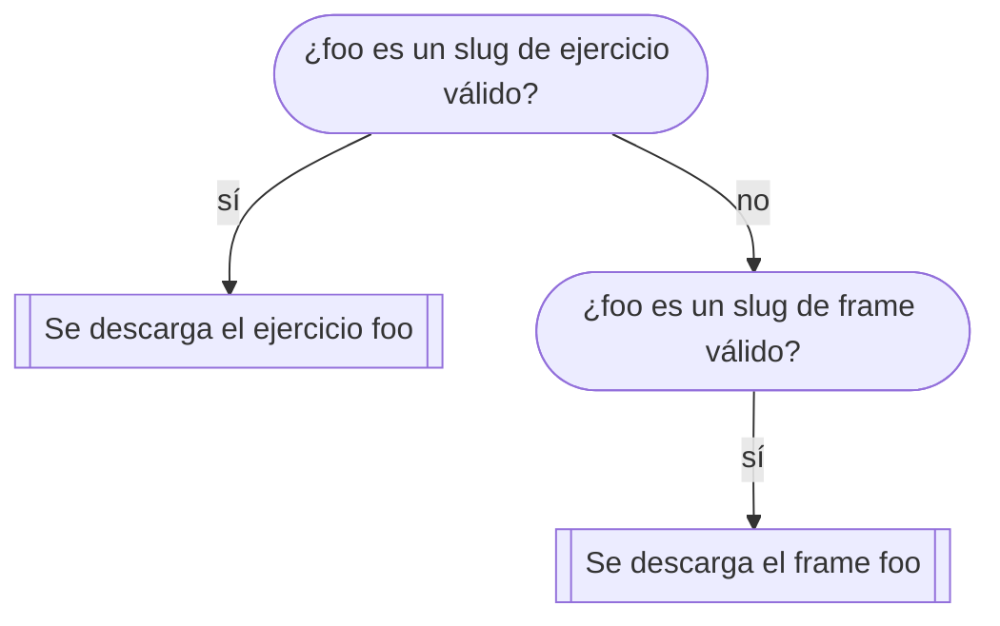

# pypas { #pypas }


///caption
Imagen generada con Inteligencia Artificial
///

Si damos por buena aquella frase de «A programar se aprende programando», sería muy útil disponer de «problemas» a los que encontrar una solución mediante código. Pues este proyecto viene a dar respuesta a este escenario.

Este paquete te ofrece **cientos de ejercicios** con los que podrás practicar tu lenguaje de programación favorito :heart:{.beat} Python.

!!! note "Aprende Python"

    **pypas** está íntimamente relacionado con [Aprende Python](https://aprendepython.es). Es la herramienta que permite trabajar los ejercicios propuestos.
    
## Instalación { #install }

El paquete —en realidad— se denomina [`pypas-cli`](https://pypi.org/project/pypas-cli/) y existen varias maneras de instalarlo:

=== "Mediante: *uv* &nbsp;:simple-uv:{.uv}"
    
    ??? info "Requisitos"
    
        Necesitarás [instalar uv](https://docs.astral.sh/uv/getting-started/installation/) que es un gestor (rápido y eficiente) de paquetería para Python.

    Una vez tengas `uv` instalado, abre una terminal y ejecuta el siguiente comando:

    ```console
    $ uv tool install -n -p 3.13 pypas-cli
    ```

    ??? warning "PATH"
    
        Para que puedas utilizar correctamente el ejecutable `pypas` debes añadir a tu `PATH` la ruta `$HOME/.local/bin` (en [Linux/macOS](https://www.youtube.com/watch?v=xeXEEp-tqgY)) o `%HOMEPATH%\.local\bin` (en [Windows](https://www.youtube.com/watch?v=JND4SsPQ3HU)).

=== "Mediante: *pip* &nbsp;:simple-python:{.green}"

    ??? info "Requisitos"
    
        Necesitarás [instalar Python >= 3.10](https://www.python.org/downloads/).

    Una vez tengas `python` instalado, abre una terminal y ejecuta el siguiente comando:

    ```console
    $ python -m pip install pypas-cli
    ```

    ??? warning "pip"
    
        Si obtienes un error del tipo `No module named pip` entonces debes ejecutar este comando para asegurarte de que `pip` queda instalado en tu distribución Python:

        ```console
        $ python -m ensurepip --upgrade
        ```

=== "Mediante: *pipx* &nbsp;:simple-pipx:{.blue}"

    ??? info "Requisitos"
    
        Necesitarás [instalar pipx](https://pipx.pypa.io/stable/installation/) que es una herramienta para instalar aplicaciones Python en entornos aislados.

    Una vez tengas `pipx` instalado, abre una terminal y ejecuta el siguiente comando:

    ```console
    $ pipx install pypas-cli
    ```

## Actualización { #upgrade }

Es **fundamental** :material-hands-pray:{.beat .green} que tengas instalada la última versión disponible de `pypas-cli`, para evitar fallos y disponer de las mejoras implementadas.

Para actualizar a la última versión de `pypas-cli` puedes usar la propia herramienta (*self-upgrading*):

```console
$ pypas upgrade
```
### Actualización manual { #manual-upgrade }

Si tienes algún problema con el comando de actualización `pypas upgrade`, también puedes actualizar manualmente el paquete `pypas-cli`. Este proceso dependerá del gestor de paquetes que hayas utilizado:

| Gestor | Comando de actualización |
| --- | --- |
| `uv` | `uv tool upgrade --no-cache pypas-cli` |
| `pip` | `python -m pip install --no-cache -U pypas-cli` |
| `pipx` | `pipx upgrade pypas-cli` |

## Listar ejercicios { #list }

Para listar todos los ejercicios «públicos» basta con ejecutar el siguiente comando:

```console
$ pypas list
```

### Filtros { #list-filter }

Es posible aplicar distintos filtros para refinar el listado de ejercicios:

=== "Por _tema principal_"

    ```console
    $ pypas list -p <topic>  # primary topic
    ```

=== "Por _tema secundario_"

    ```console
    $ pypas list -s <topic>  # secondary topic
    ```

=== "Por _frame_"

    ```console
    $ pypas list -f <frame>
    ```

:material-check-all:{ .blue } Es posible **combinar filtros** para obtener un resultado más concreto.

## Obtener un ejercicio { #get }

Cada ejercicio dispone de un _slug_ (palabra) que lo identifica unívocamente.

!!! example "Ejemplo"

    Supongamos que queremos trabajar en el ejercicio `add`. Para obtenerlo escribimos el siguiente comando:

    ```console
    $ pypas get add #(1)!
    ```
    { .annotate }
    
    1. Utilizamos su _slug_.

    El comando anterior creará una carpeta `add` con una estructura «similar»[^1] a la siguiente:

    ```
    .
    ├── docs
    │   └── README.pdf
    ├── main.py
    ├── tests
    │   ├── __init__.py
    │   └── test_main.py
    └── vendor.py
    ```

## Enunciado de un ejercicio { #doc }

Una vez dentro de la carpeta del ejercicio, podemos visualizar el enunciado del ejercicio mediante el siguiente comando:

```console
$ pypas doc
```

Previsiblemente se abrirá un documento `.pdf` con la explicación del ejercicio.

!!! warning "Dentro de la carpeta"

    :material-folder-open: Este comando requiere estar dentro de la carpeta del ejercicio :material-arrow-right-bold: `#!console cd <ejercicio>`

## Probar un ejercicio { #test }

El punto de entrada de la mayoría de los ejercicios es `main.py`. Será el fichero que debes cumplimentar buscando la etiqueta `#!python #TODO` 

Para probar («pypas testear») un ejercicio puedes usar:

```console
$ pypas test
```

??? tip "pytest"

    En realidad `pypas test`, en la mayoría de ocasiones, es un simple «wrapper» sobre [`pytest`](https://docs.pytest.org/en/stable/). Puedes aprovechar todo el potencial de `pytest` usando las [opciones en línea de comandos](https://docs.pytest.org/en/stable/reference/reference.html#command-line-flags) que ofrece.

    Por ejemplo: `#!console pypas test -x` (para tras el primer test fallido)

!!! warning "Dentro de la carpeta"

    :material-folder-open: Este comando requiere estar dentro de la carpeta del ejercicio :material-arrow-right-bold: `#!console cd <ejercicio>`

## Ejecutar un ejercicio { #run }

Eventualmente podrías querer ejecutar tu código en vez de lanzar las pruebas. Puedes utilizar esta estrategia para depurar los errores o mejorar la solución propuesta.

!!! example "Ejemplo"

    Para explicar cómo, vamos a partir del ejercicio `add`. Este sería su `main.py` una vez terminado:

    ```python
    def run(a: int, b: int) -> int:
          result = a + b
          return result
    
    # DO NOT TOUCH THE CODE BELOW
    # ...
    ```

    Tendrás que crear un fichero `args.py` dentro de la carpeta del ejercicio con los valores que quieras dar a los **parámetros de la función principal**:    

    ```python
    a = 3
    b = 7
    ```

    Ahora podrías ejecutar tu programa con:

    ```console
    $ pypas run
    ```

!!! warning "Dentro de la carpeta"

    :material-folder-open: Este comando requiere estar dentro de la carpeta del ejercicio :material-arrow-right-bold: `#!console cd <ejercicio>`

## Actualizar un ejercicio { #update }

Es posible que, debido a la corrección de errores o mejoras introducidas, haya actualizaciones de los ejercicios.

En ese caso, puedes **actualizar el ejercicio** con:

```console
$ pypas update
```

Se hará automáticamente una copia de seguridad (local) de aquellos ficheros (propios) que puedan ser sobreescritos.

!!! warning "Dentro de la carpeta"

    :material-folder-open: Este comando requiere estar dentro de la carpeta del ejercicio :material-arrow-right-bold: `#!console cd <ejercicio>`

## Comprimir un ejercicio { #zip }

Si quisieras comprimir todo el contenido del ejercicio para enviarlo o almacenarlo, lo puedes hacer con:

```console
$ pypas zip
```

El comando anterior genera un fichero `<ejercicio>.zip` dentro de la propia carpeta del ejercicio con todos los ficheros (exluyendo ciertos ficheros «temporales» o «auxiliares»).

!!! warning "Dentro de la carpeta"

    :material-folder-open: Este comando requiere estar dentro de la carpeta del ejercicio :material-arrow-right-bold: `#!console cd <ejercicio>`

## Autenticarse como usuario { #auth }

Para poder autenticarte como usuario debes recibir un **token** por parte del administrador. Una vez que dispongas de este «token» debes ejecutar el siguiente comando:

```console
$ pypas auth tu-token
```

### Desautenticarse { #unauth }

Es posible eliminar el «token» de autenticación ejecutando el comando:

```console
$ pypas unauth
```

## Entregar un ejercicio { #put }

Para entregar (_subir_) un ejercicio a [pypas.es](https://pypas.es) debes ejecutar el siguiente comando:

```console
$ pypas put #(1)!
```
{ .annotate }

1. Este comando [comprime todos los archivos](#zip) de tu ejercicio y los sube a [pypas.es](https://pypas.es).

!!! warning "Requiere autenticación"

    :octicons-key-16: Este comando necesita estar previamente [autenticado/a](#auth).

!!! warning "Dentro de la carpeta"

    :material-folder-open: Este comando requiere estar dentro de la carpeta del ejercicio :material-arrow-right-bold: `#!console cd <ejercicio>`

## Seguir tu actividad { #log }

Para seguir tu actividad (de entrega de ejercicios) puedes lanzar el siguiente comando:

```console
$ pypas log
```

Con el comando anterior podrás obtener la **información de tus entregas**, separadas por _frames_. Un _frame_ es un «bloque de ejercicios» que suele tener asociada una fecha de comienzo y una fecha de finalización.

Dentro de cada _frame_ verás la siguiente información:

| Item | Explicación |
| --- | --- |
| _Uploaded_{.acc} | Número de ejercicios **entregados** sobre el total de ejercicios del frame. |
| _Passed_{.acc} | Número de ejercicios que **han pasado todos los tests**. |
| _Failed_{.acc} | Número de ejercicios que **no han pasado todos los tests**. |
| _Waiting_{.acc} | Número de ejercicios que están **pendientes de testearse**. |
| _Score_{.acc} | Número de ejercicios que han **pasado los tests sobre el total** disponible: Nota/Puntuación |

Puedes obtener **información más detallada sobre cada ejercicio** entregado utilizando lo siguiente:

```console
$ pypas log -v
```

Puedes obtener **información de un determinado _frame_** utilizando lo siguiente:

```console
$ pypas log -f frame
```

!!! warning "Requiere autenticación"

    :octicons-key-16: Este comando necesita estar previamente [autenticado/a](#auth).

## Obtener tus entregas { #pull }

Puedes obtener (descargar) tus entregas a través del siguiente comando:

```console
$ pypas pull foo
```

Funciona de la siguiente manera:



!!! warning "Requiere autenticación"

    :octicons-key-16: Este comando necesita estar previamente [autenticado/a](#auth).

## Miscelánea { #misc }

| Comando | Descripción |
| --- | --- |
| `pypas --version` | Indica la **versión instalada actualmente** del paquete `pypas-cli` |
| `pypas --help` | Muestra la **ayuda** del programa.<br>Puedes aplicar `--help` sobre cualquier comando. |


[^1]: Cada ejercicio puede disponer de una estructura inicial (_plantilla_) distinta y por lo tanto no ser exactamente igual al ejemplo mostrado.
