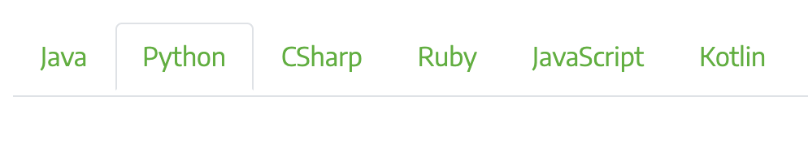
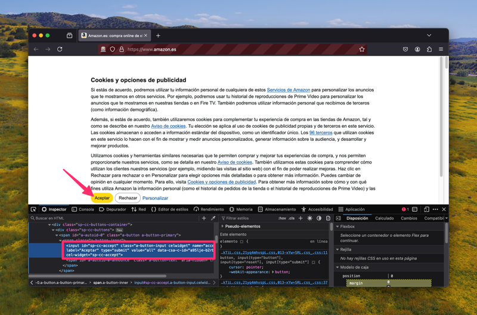

# Selenium { #selenium }


(1)
{ .annotate }

1. :fontawesome-regular-copyright: [Andy Kelly](https://unsplash.com/@askkell) :material-at: [Unsplash](https://unsplash.com) 

[Selenium](https://www.selenium.dev/) es un proyecto que permite **automatizar navegadores**. Está principalmente enfocado al testeo de aplicaciones web pero también permite desarrollar potentes **flujos de trabajo** como es el caso de las **técnicas de scraping**.

## Instalación { #install }

Existen múltiples «bindings»[^1] pero el que nos ocupa en este caso es el de Python:

```console
pip install selenium
```

## Pasos previos { #first-steps }

### Documentación { #documentation }

Recomendamos la [documentación oficial de Selenium](https://www.selenium.dev/documentation/webdriver/) como punto de entrada a la librería. Eso sí, como ya hemos comentado previamente, existen adaptaciones para Python, Java, CSharp, Ruby, JavaScript y Kotlin, por lo que es conveniente fijar la pestaña de **Python** en los ejemplos de código:



Es igualmente importante manejar la [documentación de la API](https://www.selenium.dev/selenium/docs/api/py/api.html) para Python.

### Prerrequisitos { #prerequisites }

Antes de utilizar _Selenium_ necesitamos tener listo los siguientes componentes:

- [x] **Navegador web**: Selenium necesita un navegador web instalado en el sistema para poder funcionar. Dentro de las opciones disponibles están Chrome, Firefox, Edge, Internet Explorer y Safari. En el caso de este documento vamos a utilizar [Firefox](https://www.mozilla.org/es-ES/firefox/new/). Su descarga e instalación es muy sencilla.
- [x] **Driver**: Además de esto, también es necesario disponer un «webdriver» que permita manejar el navegador (a modo de marioneta). Cada navegador tiene asociado un tipo de «driver». En el caso de Firefox hablamos de [geckodriver](https://github.com/mozilla/geckodriver/). Afortunadamente en versiones modernas de _Selenium_ **ya no es necesario instalar el «driver» (viene incluido)**.

## Configuración del driver { #driver-config }

El «driver» es el manejador de las peticiones del usuario. Se trata del objeto fundamental en Selenium que nos permitirá interactuar con el navegador y los sitios web.

### Inicialización del driver { #driver-init }

Para inicializar el «driver», en su versión más simple, usaremos el siguiente código:

```pycon
>>> from selenium import webdriver

>>> driver = webdriver.Firefox()#(1)!
```
{ .annotate }

1.  - En este momento se abrirá una ventana con el navegador Firefox.
    - Es posible usar otros navegadores. La elección de este documento por Firefox tiene que ver con cuestiones de uso durante los últimos años.
    - Documentación :material-arrow-right-bold: [`webdriver.Firefox`](https://www.selenium.dev/selenium/docs/api/py/webdriver_firefox/selenium.webdriver.firefox.webdriver.html#selenium.webdriver.firefox.webdriver.WebDriver)

### Capacidades del navegador { #webbrowser-capabilities }

Cuando inicializamos el «driver» podemos asignar ciertas «capacidades» al navegador. Las podemos dividir en dos secciones: opciones y perfil.

=== "Opciones"

    Una de las opciones más utilizadas es la capacidad de ocultar la ventana del navegador. Esto es útil cuando ya hemos probado que todo funciona y queremos automatizar la tarea:

    ```pycon hl_lines="5"
    >>> from selenium import webdriver
    >>> from selenium.webdriver.firefox.options import Options
    
    >>> options = Options()
    >>> options.add_argument('-headless')
    
    >>> driver = webdriver.Firefox(options=options)
    ```

    Existen [otros argumentos](https://wiki.mozilla.org/Firefox/CommandLineOptions) que pasar como opciones de Firefox.


=== "Perfil"

    Es posible definir un perfil personalizado para usarlo en el navegador controlado por el «driver».

    Como <span class="example">ejemplo:material-flash:</span>, podríamos querer **desactivar javascript** en el navegador (por defecto está activado). Esto lo haríamos de la siguiente manera:

    ```pycon hl_lines="6"
    >>> from selenium import webdriver
    >>> from selenium.webdriver.firefox.options import Options
    >>> from selenium.webdriver.firefox.firefox_profile import FirefoxProfile
    
    >>> firefox_profile = FirefoxProfile()
    >>> firefox_profile.set_preference('javascript.enabled', False)
    
    >>> options=Options()
    >>> options.profile = firefox_profile
    
    >>> driver = webdriver.Firefox(options=options)
    ```

    Existe una cantidad ingente de parámetros configurables en el perfil de usuario[^2]. Se pueden consultar en estos dos enlaces:

    - https://searchfox.org/mozilla-release/source/modules/libpref/init/all.js
    - https://searchfox.org/mozilla-release/source/browser/app/profile/firefox.js

## Navegando { #browse }

La forma de **acceder a una url** es utilizar el método `.get()`:

```pycon
>>> driver.get('https://www.python.org/')
```

!!! note "Carga de contenido"

    Cuando se navega a un sitio web, _Selenium_ espera (por defecto) a que la propiedad `document.readyState` tenga el valor `complete`. Esto no implica necesariamente que la página se haya cargado completamente, especialmente en páginas que usan mucho _Javascript_ para cargar contenido dinámicamente.

Algunas operaciones de navegación:

```pycon
>>> driver.forward()#(1)!

>>> driver.back()#(2)!

>>> driver.refresh()#(3)!

>>> driver.quit()#(4)!
```
{ .annotate }

1. Ir hacia «adelante».
2. Ir hacia «atrás».
3. Refrescar la página.
4. Salir (cerrar) el navegador para liberar recursos.

## Localizando elementos { #locate-elements }

Una vez que hemos accedido a un sitio web, estamos en disposición de localizar elementos dentro del DOM.

El objeto «webdriver» nos ofrece las funciones [`find_element`](https://www.selenium.dev/selenium/docs/api/py/webdriver_firefox/selenium.webdriver.firefox.webdriver.html#selenium.webdriver.firefox.webdriver.WebDriver.find_element) y [`find_elements`](https://www.selenium.dev/selenium/docs/api/py/webdriver_firefox/selenium.webdriver.firefox.webdriver.html#selenium.webdriver.firefox.webdriver.WebDriver.find_elements) cuyo primer parámetro establece el localizador:

| Acceso | Localizador |
| --- | --- |
| Clase | `By.CLASS_NAME` |
| Selector CSS | `By.CSS_SELECTOR` |
| Atributo ID | `By.ID` |
| Texto en enlace | `By.LINK_TEXT` |
| Texto en enlace (parcial) | `By.PARTIAL_LINK_TEXT` |
| Atributo NAME | `By.NAME` |
| Nombre de etiqueta | `By.TAG_NAME` |
| XPath | `By.XPATH` |

Veamos un <span class="example">ejemplo:material-flash:</span> práctico de esto. Supongamos que queremos **obtener las versiones activas de Python**[^3] desde su web oficial:

```pycon hl_lines="16"
>>> from selenium import webdriver
>>> from selenium.webdriver.common.by import By

>>> driver = webdriver.Firefox()

>>> driver.get('https://www.python.org/downloads/')

>>> css_selector = """
...     div.row.active-release-list-widget
...     ol.list-row-container.menu
...     span.release-version
... """

>>> pyversions = driver.find_elements(By.CSS_SELECTOR, css_selector)

>>> for pyversion in pyversions:
...     print(pyversion.text)
...
3.14
3.13
3.12
3.11
3.10
3.9
3.8
```

Cada uno de los objetos que devuelve `find_element()`/`find_elements()` es de tipo [`WebElement`](https://www.selenium.dev/selenium/docs/api/py/webdriver_remote/selenium.webdriver.remote.webelement.html#selenium.webdriver.remote.webelement.WebElement):

```pycon
>>> elem = driver.find_element(By.CSS_SELECTOR, 'div#content')

>>> type(elem)
selenium.webdriver.remote.webelement.WebElement
```

## Interacciones { #interact }

Si bien el acceso a la información de un sitio web puede ser un objetivo en sí mismo, para ello podríamos usar herramientas como [requests](../networking/requests.md). Sin embargo, cuando entra en juego la interacción con los elementos del DOM, necesitamos otro tipo de aproximaciones.

Selenium nos permite hacer clic en el lugar deseado, enviar texto por teclado, borrar una caja de entrada o manejar elementos de selección, entre otros.

### Clic { #click }

Hacer clic sobre determinados elementos de una página web es la interacción más habitual que utilizamos sobre un navegador web.

Veamos un <span class="example">ejemplo:material-flash:</span> en el que accedemos a https://amazon.es y tenemos que **aceptar las «cookies»** haciendo clic en el botón correspondiente:

```pycon hl_lines="12"
>>> from selenium import webdriver
>>> from selenium.webdriver.common.by import By

>>> driver = webdriver.Firefox()

>>> driver.get('https://amazon.es')

>>> css_selector = 'input#sp-cc-accept'#(1)!
>>> accept_cookies = driver.find_element(By.CSS_SELECTOR, css_selector)
>>> accept_cookies.click()
```
{ .annotate }

1. Para poder identificar el selector CSS podemos **inspeccionar el DOM** desde las herramientas de desarrollador que incluyen los navegadores web.

    

!!! exercise "Ejercicio"

    Escriba un programa en Python que, utilizando Selenium, pulse el botón de **¡JUGAR!**{.hl} en el sitio web https://wordle.danielfrg.com/. Los selectores «xpath» pueden ser de mucha ayuda.

    [:material-lightbulb: Solución](files/selenium/wordle_play.py)

### Enviar texto { #send-text }

Típicamente encontraremos situaciones donde habrá que enviar texto a algún campo de entrada de un sitio web. Selenium nos permite hacer esto.

Veamos un <span class="example">ejemplo:material-flash:</span> en el que tratamos de **hacer login en PyPI**:

```pycon hl_lines="11-12"
>>> from selenium import webdriver
>>> from selenium.webdriver.common.by import By

>>> driver = webdriver.Firefox()

>>> driver.get('https://pypi.org/account/login/')

>>> username = driver.find_element(By.CSS_SELECTOR, 'input#username')
>>> password = driver.find_element(By.CSS_SELECTOR, 'input#password')

>>> username.send_keys('sdelquin')
>>> password.send_keys('1234')

>>> css_selector = 'form#login-form input[type="submit"]'
>>> submit = driver.find_element(By.CSS_SELECTOR, css_selector)
>>> submit.click()
```

#### Teclas especiales { #send-keys }

En el caso de que queramos enviar alguna tecla «especial», Selenium nos proporciona un [conjunto de símbolos](https://www.selenium.dev/selenium/docs/api/py/webdriver/selenium.webdriver.common.keys.html) para ello.

Por <span class="example">ejemplo:material-flash:</span>, para **enviar las teclas de cursor** tendríamos que hacer lo siguiente:

```pycon
>>> from selenium.webdriver.common.keys import Keys

>>> element.send_keys(Keys.RIGHT)
>>> element.send_keys(Keys.DOWN)
>>> element.send_keys(Keys.LEFT)
>>> element.send_keys(Keys.UP)
```
#### Borrar contenido { #delete-content }

Si queremos borrar el contenido de un elemento web editable, típicamente una caja de texto, lo podemos hacer usando el método `.clear()`.

!!! exercise "Ejercicio"

    Escribe un programa en Python utilizando _Selenium_ que, dada una palabra de 5 caracteres, permita enviar ese «string» a https://wordle.danielfrg.com/ para jugar.

    Ten en cuenta lo siguiente:

    - En primer lugar hay que pulsar el botón de **¡JUGAR!**{.hl}.
    - El elemento sobre el que enviar texto podría ser directamente el «body».
    - Puede ser visualmente interesante poner un `#!python time.sleep(0.5)` tras la inserción de cada letra.
    - Una vez enviada la cadena de texto hay que pulsar <kbd>ENTER</kbd>.

    [:material-lightbulb: Solución](files/selenium/wordle_try.py)

### Manejo de selects { #select-handle }

Los elementos de selección `<select>` pueden ser complicados de manejar a nivel de automatización. Para suplir esta dificultad, _Selenium_ proporciona el objecto [`Select`](https://www.selenium.dev/selenium/docs/api/py/webdriver_support/selenium.webdriver.support.select.html#selenium.webdriver.support.select.Select).

Supongamos un <span class="example">ejemplo:material-flash:</span> en el que queremos buscar la palabra «Python» en Wikipedia pero **modificando el idioma de búsqueda a inglés**:

```pycon hl_lines="9"
>>> from selenium import webdriver
>>> from selenium.webdriver.support.select import Select

>>> driver = webdriver.Firefox()
>>> driver.get('https://wikipedia.org')

>>> lang = driver.find_element_by_id('searchLanguage')
>>> lang_handler = Select(lang)
>>> lang_handler.select_by_value('en')

>>> search = driver.find_element(By.CSS_SELECTOR, 'input#searchInput')
>>> search.send_keys('Python')

>>> css_selector = 'form#search-form button[type="submit"]'
>>> submit = driver.find_element(By.CSS_SELECTOR, css_selector)

>>> submit.click()
```

## Acceso a atributos { #attribute-access }

Como ya hemos comentado, los objetos del DOM con los que trabaja Selenium son de tipo `WebElement`. Veremos los mecanismos disponibles para poder acceder a sus **atributos**.

Partiremos de un <span class="example">ejemplo:material-flash:</span> **localizando el botón de donación en la web oficial de Python**:

```pycon
>>> from selenium import webdriver
>>> from selenium.webdriver.support.select import Select

>>> driver = webdriver.Firefox()
>>> driver.get('https://python.org')

>>> donate_btn = driver.find_element(By.CSS_SELECTOR, 'a.donate-button')
```

Para conocer sus atributos...

=== "Nombre"

    ```pycon
    >>> donate_btn.tag_name
    'a'
    ```

=== "Tamaño y posición"

    ```pycon
    >>> donate_btn.rect
    {'x': 120.0,
     'y': 442.3999938964844,
     'width': 143.64999389648438,
     'height': 36.80000305175781}
    ```

=== "Estado"

    ```pycon
    >>> donate_btn.is_displayed()
    True
    
    >>> donate_btn.is_enabled()
    True
    
    >>> donate_btn.is_selected()
    False
    ```

=== "CSS"

    ```pycon
    >>> donate_css.value_of_css_property('background-color')
    
    'rgb(14, 132, 32)'
    
    >>> donate_css.value_of_css_property('font-size')
    '16px'
    ```

=== "Texto"

    ```pycon
    >>> donate_btn.text#(1)!
    'Download Now'
    ```
    { .annotate }
    
    1. Texto en su contenido, ya sea de manera directa o mediante elementos anidados.

=== "Elemento superior"

    ```pycon
    >>> donate_btn.parent
    <selenium.webdriver.firefox.webdriver.WebDriver (session="8612e5b7-6e66-4121-8869-ffce4139d197")>
    ```

=== "Atributo HTML"

    ```pycon
    >>> donate_btn.get_attribute('href')
    'https://ubuntu.com/engage/developer-desktop-productivity-whitepaper    
    ```

## Esperas { #waits }

Cuando navegamos a un sitio web utilizando `driver.get()` es posible que el elemento que estamos buscando no esté aún cargado en el DOM porque existan peticiones asíncronas pendientes o contenido dinámico Javascript. Es por ello que _Selenium_ pone a nuestra disposición una serie de **esperas explícitas** hasta que se cumpla una determinada condición.

Las esperas explícitas suelen hacer uso de [condiciones de espera](https://www.selenium.dev/selenium/docs/api/py/webdriver_support/selenium.webdriver.support.expected_conditions.html). Cada una de estas funciones se puede utilizar para un propósito específico. Quizás una de las funciones más habituales sea [`presence_of_element_located()`](https://www.selenium.dev/selenium/docs/api/py/webdriver_support/selenium.webdriver.support.expected_conditions.html#selenium.webdriver.support.expected_conditions.presence_of_element_located).

Veamos un <span class="example">ejemplo:material-flash:</span> en el que accedemos a [Stack Overflow](https://stackoverflow.com/) y esperamos a que el pie de página esté disponible:

```pycon hl_lines="12-14"
>>> from selenium import webdriver
>>> from selenium.webdriver.common.by import By
>>> from selenium.webdriver.support.ui import WebDriverWait
>>> from selenium.webdriver.support import expected_conditions as EC

>>> driver = webdriver.Firefox()
>>> driver.get('https://stackoverflow.com')

>>> cookies = driver.find_element(By.CSS_SELECTOR, 'button#onetrust-accept-btn-handler')#(1)!
>>> cookies.click()

>>> footer = WebDriverWait(driver, 10).until(
...     EC.presence_of_element_located((By.ID, 'footer'))
... )

>>> print(footer.text)
STACK OVERFLOW
Questions
Help
Chat
PRODUCTS
Teams
Advertising
Talent
COMPANY
About
Press
Work Here
Legal
Privacy Policy
Terms of Service
Contact Us
Cookie Settings
Cookie Policy
STACK EXCHANGE NETWORK
Technology
Culture & recreation
Life & arts
Science
Professional
Business
API
Data
Blog
Facebook
Twitter
LinkedIn
Instagram
Site design / logo © 2025 Stack Exchange Inc; user contributions licensed under CC BY-SA . rev 2025.4.29.25832
```
{ .annotate }

1. Aceptar las «cookies».

Anatomía de una condición de espera:


!!! warning "`TimeOutException`"

    En el caso de que el elemento por el que estamos esperando no «aparezca» en el DOM, y una vez pasado el tiempo de «timeout», _Selenium_ eleva una [excepción](../../core/modularity/exceptions.md) de tipo [`selenium.common.exceptions.TimeoutException`](https://www.selenium.dev/selenium/docs/api/py/common/selenium.common.exceptions.html#selenium.common.exceptions.TimeoutException).

## Ejecutar Javascript { #run-javascript }

Puede llegar a ser muy útil la ejecución de Javascript en el navegador. La casuística es muy variada. En cualquier caso, _Selenium_ nos proporciona el método [`execute_script()`](https://www.selenium.dev/selenium/docs/api/py/webdriver_chrome/selenium.webdriver.chrome.webdriver.html#selenium.webdriver.chrome.webdriver.WebDriver.execute_script) para esta tarea.

En el siguiente <span class="example">ejemplo:material-flash:</span> navegamos a la web de GitHub y **hacemos «scroll» hasta el final de la página** usando Javascript:

```pycon hl_lines="8"
>>> from selenium import webdriver
>>> from selenium.webdriver.common.by import By

>>> driver = webdriver.Firefox()
>>> driver.get('https://github.com')

>>> body = driver.find_element(By.TAG_NAME, 'body')
>>> driver.execute_script('arguments[0].scrollIntoView(false)', body)#(1)!
```
{ .annotate }

1. El array `arguments` contiene los argumentos que le pasamos a la función.

!!! exercise "Ejercicio"

    Escribe un programa en Python que permita sacar un listado de supermercados Mercadona dada una geolocalización `(lat,lon)` como dato de entrada.

    Pasos a seguir:

    1. Utilizar el siguiente [f-string](../../core/datatypes/strings.md#fstrings) para obtener la url de acceso: `#!python f'https://info.mercadona.es/es/supermercados?coord={lat}%2C{lon}'`
    2. Aceptar las «cookies» del sitio web.
    3. Hacer scroll hasta el final de la página para hacer visible el botón «Ver todos». Se recomienda usar Javascript para ello.
    4. Localizar el botón «Ver todos» y hacer clic para mostrar todos los establecimientos (de la geolocalización). Se recomienda usar una [espera explícita](#waits) hasta que el botón esté disponible.
    5. Recorrer los elementos desplegados `li` y mostrar el contenido textual de los elementos `h3` que hay en su interior donde se indica la dirección de cada supermercado.
    6. Cerrar el «driver» del navegador.

    :material-check-all:{ .blue } Como detalle final, y una vez que compruebes que tu programa funciona correctamente, aprovecha para inicializar el «driver» [ocultando la ventana del navegador](#driver-init).

    Puedes probar tu programa con esta localización de Las Palmas de Gran Canaria:

    ```python
    GEOLOC = (28.1247618, -15.4358226)
    URL = f'https://info.mercadona.es/es/supermercados?coord={GEOLOC[0]}%2C{GEOLOC[1]}'
    ```

    [:material-lightbulb: Solución](files/selenium/mercadona.py)


[^1]: Adaptación (interface) de la herramienta a un lenguaje de programación concreto.
[^2]: Configuraciones aplicables para el navegador Firefox.
[^3]: Consulta hecha el 28 de abril de 2025.
