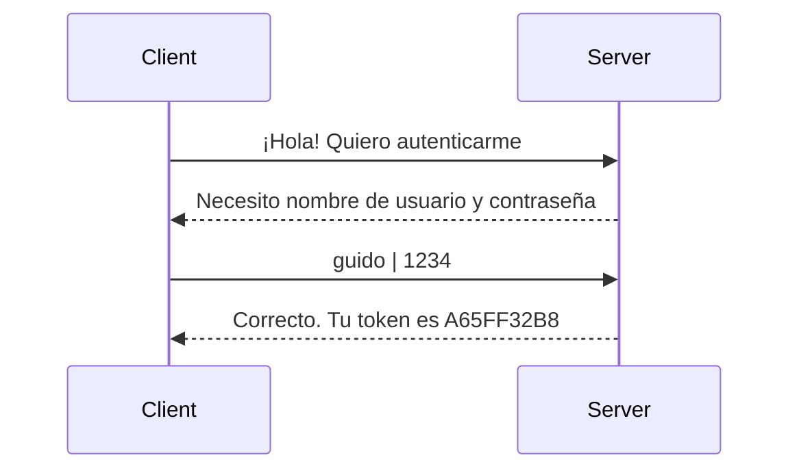
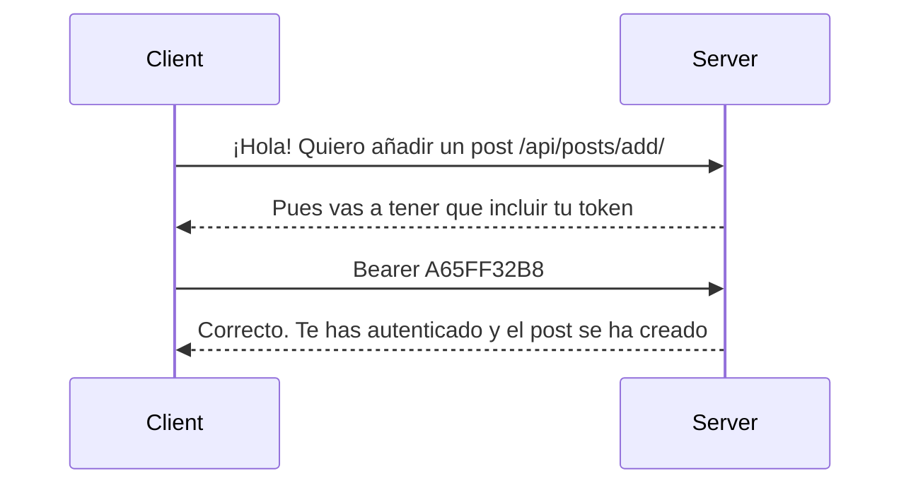
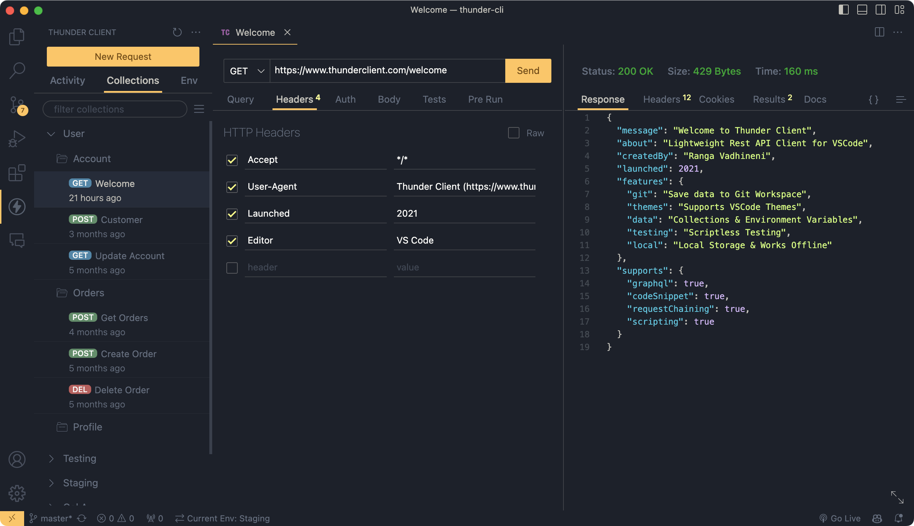

# API { #api }

<span class="dj-level">:material-target-variant: Django especializado</span>

Una API (Interfaz de Programación de Aplicaciones) es un conjunto de reglas y definiciones que permite que diferentes aplicaciones o sistemas se comuniquen entre sí de manera estandarizada. Funciona como un intermediario que recibe solicitudes, las procesa según lo establecido y devuelve respuestas, facilitando el intercambio de datos o funcionalidades sin que los sistemas necesiten conocer cómo está construido el otro internamente. Gracias a las APIs, es posible integrar servicios externos, reutilizar funciones y desarrollar aplicaciones más rápidas, escalables y seguras.

En otras palabras, en una especie de **contrato** que se establece entre dos artefactos de software que quieren intercambiar información. Podemos hablar de un **protocolo** por el que se define la manera de solicitar y devolver datos.


## Paquetes existentes { #packages }

En el universo Python, existen varios paquetes de terceros muy relevantes dedicados a la implementación de APIs:

<div class="grid cards" markdown>

-   Integrados con Django :octicons-link-16:

    ---

    - [x] [Django Rest Framework - DRF](https://www.django-rest-framework.org/): Se integra perfectamente con un proyecto Django y facilita enormemente la integración de la API con el resto de componentes del «framework».
    - [x] [Django Ninja](https://django-ninja.dev/): Buena integración en Django. Desarrollo rápido y sencillo de cara a la implementación de APIs. Su rendimiento es muy destacado.
    
-   Independientes de Django :octicons-unlink-16:

    ---

    - [x] [FastAPI](https://fastapi.tiangolo.com/): _Framework_ para desarrollo web con alto rendimiento y fácil de aprender. Ha tomado mucha relevancia en los últimos años. Se acerca a 100K :octicons-star-16: :simple-github:.
    - [x] [Flask](https://flask.palletsprojects.com/en/stable/): Aunque no se trata de un _framework_ específico para desarrollo de APIs, se ha popularizado como un paquete muy potente para desarrollo web en el que también se pueden implementar APIs.

</div>

:material-check-all:{ .blue } Pero en esta sección **no vamos a utilizar paquetes/módulos ya existentes** sino que vamos a explicar mecanismos implícitos en Django para implementar una API. Al fin y al cabo no deja de ser un potente «backend» con mucha versatilidad.

## Serialización { #serialization }

La serialización es el proceso de convertir un objeto o estructura de datos en un formato que pueda ser almacenado o transmitido y luego reconstruido (generalmente en comunicación cliente-servidor).

En el contexto de una API, serializar un objeto se traduce en **convertirlo a una cadena de texto**. Esta representación puede venir en distintos formatos. El más habitual suele ser JSON.

En el ámbito de Python, un objeto JSON vendría a ser un [diccionario](../../../core/datastructures/dicts.md) (_instancia única_) o una [lista de diccionarios](../../../core/datastructures/lists.md) (_conjunto de instancias_) en formato [cadena de texto](../../../core/datatypes/strings.md).

### JSON { #serialization-json }

Python dispone del paquete [`json`](https://docs.python.org/es/3/library/json.html) dentro de la _librería estándar_ que permite codificar y decodificar objetos en formato JSON:

- [`json.dumps()`](https://docs.python.org/es/3/library/json.html#json.dumps) recibe un objeto Python y devuelve una cadena de texto en formato JSON.
- [`json.loads()`](https://docs.python.org/es/3/library/json.html#json.loads) recibe una cadena de texto en formato JSON y devuelve un objeto Python.

A la hora de la transformación Python :material-arrow-right-box: JSON **no todos los tipos de datos Python son compatibles**. A continuación se muestra una tabla con los ^^tipos de datos compatibles^^ y cómo se mapean a JSON:

| Python :material-language-python: | JSON :simple-json: |
| --- | --- |
| `#!python dict` | `#!js object` |
| `#!python list`, `#!python tuple` | `#!js array` |
| `#!python str` | `#!js string` |
| `#!python int`, `#!python float` | `#!js number` |
| `#!python bool` | `#!js true` / `#!js false` |
| `#!python None` | `#!js null` |

!!! warning "Tipos de datos incompatibles"

    Cualquier otro tipo/estructura de datos que usemos en Python y que queramos convertir a JSON habrá que transformarlo previamente a alguno de los tipos de datos compatibles indicados en la tabla anterior.

    Estamos habando de objetos personalizados (clases), conjuntos, fecha/hora, etc.

Veamos un <span class="example">ejemplo:material-flash:</span> de transformación:

<div class="grid" markdown>

```python title="Python"
{
    'name': 'Ana',
    'age': 25,
    'city': 'Barcelona',
    'is_student': True,
    'marks': [8.5, 9.0, 7.5],
    'extra': None
}
```

```json title="JSON"
{
    "name": "Ana",
    "age": 25,
    "city": "Barcelona",
    "is_student": true,
    "marks": [8.5, 9.0, 7.5],
    "extra": null
}
```

</div>

A continuación se muestra el proceso de serialización/deserialización utilizando las herramientas que nos proporciona Python:

```pycon
>>> import json

>>> data = {
...     'name': 'Ana',
...     'age': 25,
...     'city': 'Barcelona',
...     'is_student': True,
...     'marks': [8.5, 9.0, 7.5],
...     'extra': None
... }
...

>>> serialized = json.dumps(data)
>>> type(serialized)
str
>>> print(serialized)
{"name": "Ana", "age": 25, "city": "Barcelona", "is_student": true, "marks": [8.5, 9.0, 7.5], "extra": null}

>>> deserialized = json.loads(serialized)
>>> type(deserialized)
dict
>>> deserialized
{'name': 'Ana',
 'age': 25,
 'city': 'Barcelona',
 'is_student': True,
 'marks': [8.5, 9.0, 7.5],
 'extra': None}
>>> data == deserialized
True
```

### Modelos { #serialize-models }

Por norma general, una API trabajará con modelos (base de datos) que tendremos que serializar para transmitir desde el lado servidor al lado cliente. Como ya se ha citado, lo más habitual es hacerlo en formato JSON.

Veamos a continuación una propuesta de **serializador (base) para instancias de modelo**, del que luego podremos derivar (_heredar_) distintos serializadores concretos:

```python title="shared/serializers.py"
import json
from abc import ABC
from typing import Iterable

from django.http import HttpRequest, JsonResponse


class BaseSerializer(ABC):#(1)!
    def __init__(
        self,
        to_serialize: object | Iterable[object],#(2)!
        *,
        fields: Iterable[str] = [],#(3)!
        request: HttpRequest = None,#(4)!
    ):
        self.to_serialize = to_serialize
        self.fields = fields
        self.request = request

    def build_url(self, path: str) -> str:#(5)!
        return self.request.build_absolute_uri(path) if self.request else path

    # To be implemented by subclasses
    def serialize_instance(self, instance: object) -> dict:#(6)!
        raise NotImplementedError

    def __serialize_instance(self, instance: object) -> dict:#(7)!
        serialized = self.serialize_instance(instance)
        return {f: v for f, v in serialized.items() if not self.fields or f in self.fields}

    def serialize(self) -> dict | list[dict]:#(8)!
        if not isinstance(self.to_serialize, Iterable):
            return self.__serialize_instance(self.to_serialize)
        return [self.__serialize_instance(instance) for instance in self.to_serialize]

    def to_json(self) -> str:#(9)!
        return json.dumps(self.serialize())

    def json_response(self) -> JsonResponse:#(10)!
        return JsonResponse(self.serialize(), safe=False)#(11)!
```
{ .annotate }

1. Definimos la clase como _abstracta_ para que no se pueda crear una instancia de esta clase base.
2. Datos a serializar (**instancias de modelo**), que puede ser tanto un único objeto como un iterable de objetos.
3. Se puede pasar un iteriable de campos para utilizar únicamente ese subconjunto a la hora de serializar.
4. Es posible pasar la _petición HTTP_ desde una vista si queremos construir URLs absolutas en ciertos campos.
5. Este método construye una URL absoluta a partir de una ruta indicada.
6. Este método es el que debe ser implementado en clases derivadas y se encarga de serializar una instancia concreta.
7. Este método utiliza el método anterior `serialize_instance()` pero añade el filtrado de campos según lo indicado en el constructor.
8.  - Este método será el que utilicemos «habitualmente» y serializa los datos teniendo en cuenta su naturaleza.
    - Si se trata de una única instancia se devolverá un diccionario.
    - Se se trata de múltiples instancias se devolverá una lista de diccionarios.
9. Este método convierte el objeto serializado a formato JSON (como cadena de texto).
10. Este método puede ser muy útil para utilizarlo desde una vista, ya que nos devuelve una respuesta JSON con el objeto serializado.
11. - Se devuelve una respuesta [`JsonResponse`](https://docs.djangoproject.com/en/stable/ref/request-response/#jsonresponse-objects).
    - El parámetro `#!python safe=False` es necesario ya que si fuera `#!python True` sólo manejaría diccionarios, y hay ocasiones en las que tenemos listas de diccionarios.

Ahora supongamos un <span class="example">ejemplo:material-flash:</span> en el que queremos serializar los «posts» de un «blog». Empecemos definiendo su modelo:

```python title="posts/models.py"
from django.db import models


class Post(models.Model):
    title = models.CharField(max_length=256)
    slug = models.SlugField(max_length=256, unique=True)
    content = models.TextField()
    created_at = models.DateTimeField(auto_now_add=True)
    updated_at = models.DateTimeField(auto_now=True)
```

Nuestro serializador quedaría de la siguiente manera:

```python title="posts/serializers.py"
from shared.serializers import BaseSerializer#(1)!


class PostSerializer(BaseSerializer):#(2)!
    def serialize_instance(self, instance) -> dict:#(3)!
        return {#(4)!
            'id': instance.pk,#(5)!
            'title': instance.title,#(6)!
            'slug': instance.slug,#(7)!
            'content': instance.content,#(8)!
            'created_at': instance.created_at.isoformat(),#(9)!
            'updated_at': instance.updated_at.isoformat(),#(10)!
        }
```
{ .annotate }

1. Importamos el serializador base desde la ruta en la que se encuentre.
2. Heredamos de dicho serializador para poder reutilizar sus funcionalidades.
3. Definimos el método para serializar una instancia de modelo (en este caso de un «post»).
4. Este método retorna un diccionario.
5. Suele ser habitual incluir un campo `id` en la respuesta (no tiene por qué coincidir con la clave primaria).
6. Título del «post».
7. «Slug» del «post».
8. Contenido del «post».
9. - No es posible serializar directamente un objeto [`datetime`](https://docs.python.org/3/library/datetime.html#datetime.datetime).
    - Por ello utilizamos el método [`isoformat()`](https://docs.python.org/3/library/datetime.html#datetime.datetime.isoformat) que devuelve una _cadena de texto_ con la representación del objeto.
10. - No es posible serializar directamente un objeto [`datetime`](https://docs.python.org/3/library/datetime.html#datetime.datetime).
    - Por ello utilizamos el método [`isoformat()`](https://docs.python.org/3/library/datetime.html#datetime.datetime.isoformat) que devuelve una _cadena de texto_ con la representación del objeto.

Ahora veamos todo esto en funcionamiento. Primero empezaremos por crear algunos «posts» para poder trabajar:

```pycon
>>> NUM_POSTS = 3

>>> for n in range(1, NUM_POSTS + 1):
...     Post.objects.create(
...         title=f'API: Post {n}',
...         slug=f'api-post-{n}',
...         content=f'Django API {n}'
...     )
...

>>> Post.objects.filter(slug__startswith='api')
<QuerySet [<Post: API: Post 1>, <Post: API: Post 2>, <Post: API: Post 3>]>
```

Ahora ya podemos proceder a la **serialización**:

=== "Instancia :material-cube-outline:"

    ```pycon hl_lines="7-12"
    >>> from posts.serializers import PostSerializer
    
    >>> post = Post.objects.filter(slug__startswith='api').first()

    >>> serializer = PostSerializer(post)#(1)!
    >>> serializer.serialize()
    {'id': 1,
     'title': 'API: Post 1',
     'slug': 'api-post-1',
     'content': 'Django API 1',
     'created_at': '2026-01-10T10:48:27.735961+00:00',
     'updated_at': '2026-01-10T10:48:27.735982+00:00'}
    ```
    { .annotate }
    
    1. Al construir el serializador pasamos la instancia del «post».

=== "Iterable :fontawesome-solid-cubes:"

    ```pycon hl_lines="7-24"
    >>> from posts.serializers import PostSerializer

    >>> posts = Post.objects.filter(slug__startswith='api')
    
    >>> serializer = PostSerializer(posts)#(1)!
    >>> serializer.serialize()
    [{'id': 1,
      'title': 'API: Post 1',
      'slug': 'api-post-1',
      'content': 'Django API 1',
      'created_at': '2026-01-10T10:48:27.735961+00:00',
      'updated_at': '2026-01-10T10:48:27.735982+00:00'},
     {'id': 2,
      'title': 'API: Post 2',
      'slug': 'api-post-2',
      'content': 'Django API 2',
      'created_at': '2026-01-10T10:48:27.736955+00:00',
      'updated_at': '2026-01-10T10:48:27.736965+00:00'},
     {'id': 3,
      'title': 'API: Post 3',
      'slug': 'api-post-3',
      'content': 'Django API 3',
      'created_at': '2026-01-10T10:48:27.737453+00:00',
      'updated_at': '2026-01-10T10:48:27.737459+00:00'}]
    ```
    { .annotate }
    
    1. Al construir el serializador pasamos el ~~iterable~~ _queryset_ de «posts».

!!! tip "Decimal"

    Para evitar problemas con los [campos Django](models.md#fields) de tipo `Decimal`, se recomienda convertirlos a `#!python float` a la hora de serializar.
    

#### Claves ajenas { #serialize-fk-models }

¿Qué ocurre cuando tenemos que serializar un modelo que incluye una clave ajena? Aquí hay dos propuestas razonables:

1. Serializar el objeto anidado mediante el **identificador de su clave primaria**.
2. Serializar el objeto anidado con todos sus campos a través de un **«sub-serializador»**.

La primera opción es bastante directa, es por ello que nos centraremos en la segunda. Veamos un <span class="example">ejemplo:material-flash:</span> de clave ajena donde [los «posts» tienen comentarios](models.md#one-to-many):

```python title="comments/models.py"
from django.db import models


class Comment(models.Model):
    alias = models.CharField(max_length=128)
    content = models.TextField()
    post = models.ForeignKey(
        'posts.Post',
        related_name='comments',
        on_delete=models.CASCADE
    )
```

Ahora vamos a crear su serializador:

```python title="comments/serializers.py" hl_lines="10"
from posts.serializers import PostSerializer
from shared.serializers import BaseSerializer


class CommentSerializer(BaseSerializer):
    def serialize_instance(self, instance):
        return {
            'alias': instance.alias,
            'content': instance.content,
            'post': PostSerializer(instance.post).serialize(),#(1)!
        }
```
{ .annotate }

1. Utilizamos el serializador ya creado con el atributo `post` del comentario.

Antes de continuar vamos a crear un comentario para poder usarlo a la hora de serializar:

```pycon
>>> post = Post.objects.filter(slug__startswith='api').first()

>>> comment = Comment.objects.create(
...     alias='guido',
...     content='Just a comment',
...     post=post
... )
...
```

A continuación se muestra cómo proceder con la serialización a partir del comentario creado previamente:

```pycon hl_lines="5-12"
>>> from comments.serializers import CommentSerializer

>>> serializer = CommentSerializer(comment)
>>> serializer.serialize()#(1)!
{'alias': 'guido',
 'content': 'Just a comment',
 'post': {'id': 1,
  'title': 'API: Post 1',
  'slug': 'api-post-1',
  'content': 'Django API 1',
  'created_at': '2026-01-10T10:48:27.735961+00:00',
  'updated_at': '2026-01-10T10:48:27.735982+00:00'}}
```
{ .annotate }

1. Nótese en la salida el serializador anidado para el atributo `post`.

#### Campos de fichero { #serialize-files }

Hay modelos que contienen [campos de fichero](models.md#file-fields) (_identificados por una ruta_). Los más habituales son `ImageField` o `FileField`.

¿Qué podemos hacer con estos campos a la hora de serializar? Aquí hay dos propuestas razonables:

<div class="annotate" markdown>
1. Serializar el campo como un _string_ [Base64](https://www.base64-image.de/).(1)
2. Serializar el campo **como una URL** al servidor donde se puede visualizar su contenido.
</div>
1. Por <span class="example">ejemplo:material-flash:</span> un cuadrado rojo :red_square: de 4x4 píxeles tendría la siguiente representación en Base64:
```console
iVBORw0KGgoAAAANSUhEUgAAAAQAAAAECAIAAAAmkwkpAAAAEElEQVR4nGP8z4AATAxEcQAz0QEHOoQ+uAAAAABJRU5ErkJggg==
```

La primera opción quizás sea algo exótica, es por ello que nos centraremos en la segunda. Tratemos el <span class="example">ejemplo:material-flash:</span> de un modelo `Post` que contiene una **imagen de portada**:

```python title="posts/models.py" hl_lines="10-13"
from django.db import models


class Post(models.Model):
    title = models.CharField(max_length=256)
    slug = models.SlugField(max_length=256, unique=True)
    content = models.TextField()
    created_at = models.DateTimeField(auto_now_add=True)
    updated_at = models.DateTimeField(auto_now=True)
    cover = models.ImageField(
        upload_to='covers',
        default='covers/nocover.png'
    )
```

A la hora de implementar su serializador hay que reconocer que uno de sus campos es de «tipo fichero» con lo que necesitamos acceder a su ruta y construir la URL:

```python title="posts/serializers.py" hl_lines="13"
from shared.serializers import BaseSerializer


class PostSerializer(BaseSerializer):
    def serialize_instance(self, instance) -> dict:
        return {
            'id': instance.pk,
            'title': instance.title,
            'slug': instance.slug,
            'content': instance.content,
            'created_at': instance.created_at.isoformat(),
            'updated_at': instance.updated_at.isoformat(),
            'cover': self.build_url(instance.cover.url)#(1)!
        }
```
{ .annotate }

1. Utilizamos el método `build_url()` del [serializador base](#serialize-models) `BaseSerializer`.

Antes de continuar vamos a crear un «post» para poder usarlo a la hora de serializar:

```pycon
>>> Post.objects.create(
...     title='Django API with ImageField',
...     slug='django-api-with-imagefield',
...     content='Remember to serialize url path for ImageField',
...     cover='example.png'
... )
```

Veamos el serializador en funcionamiento:

=== "Desde REPL <span class="green">❯❯❯</span>"

    ```pycon hl_lines="13"
    >>> from posts.serializers import PostSerializer

    >>> post = Post.objects.get(slug='django-api-with-imagefield')

    >>> serializer = PostSerializer(post)#(1)!
    >>> serializer.serialize()
    {'id': 4,
    'title': 'Django API with ImageField',
    'slug': 'django-api-with-imagefield',
    'content': 'Remember to serialize url path for ImageField',
    'created_at': '2026-01-11T11:57:24.500618+00:00',
    'updated_at': '2026-01-11T11:57:24.500659+00:00',
    'cover': '/media/example.png'}
    ```
    { .annotate }
    
    1. La ruta de salida no incluye la URL completa (con dominio) porque no hemos pasado la petición (_request_) al constructor del serializador.

=== "Desde una vista :material-alpha-v-circle:{.pink}"

    ```python title="posts/views.py" hl_lines="6"
    from .models import Post
    from .serializers import PostSerializer

    def post_detail(request, post_slug: str):
        post = Post.objects.get(slug=post_slug)
        serializer = PostSerializer(post, request=request)#(1)!
        serializer.serialize()
    ```
    { .annotate }
    
    1. La ruta de salida incluye la URL completa (con dominio) porque hemos pasado la petición (_request_) al constructor del serializador.

    En este caso la salida sería algo como:

    ```python hl_lines="7"
    {'id': 4,
     'title': 'Django API with ImageField',
     'slug': 'django-api-with-imagefield',
     'content': 'Remember to serialize url path for ImageField',
     'created_at': '2026-01-11T11:57:24.500618+00:00',
     'updated_at': '2026-01-11T11:57:24.500659+00:00',
     'cover': 'http://localhost:8000/media/example.png'}
    ```


## Gestión de peticiones { #request-management }

Cuando implementamos una API hay que tener en cuenta varios aspectos a la hora de gestionar las peticiones.

### URLs { #urls }

El diseño de las URLs de una API no dista especialmente del diseño habitual de [URLs](urls.md) que ya hemos visto. Quizás el único matiz tiene que ver con cuestiones de «estilo» sobre cómo organizar los **recursos** que se van a ofrecer.

En el contexto de una API se suele hablar de [«entrypoint»](https://smartbear.com/learn/performance-monitoring/api-endpoints/) (punto de entrada) al referirnos a una URL concreta.

Algo ~~importante~~ interesante sería usar el prefijo `/api` en el diseño de nuestras URLs para la API. Esto ^^no implica^^ generar una única aplicación `api` en la que tengamos toda la lógica de negocio. Se pueden seguir creando aplicaciones que respondan a la semántica de nuestro problema para luego redirigir a las vistas correspondientes.

En el <span class="example">ejemplo:material-flash:</span> de un «blog» podríamos organizar las URLs de primer nivel (para la API de «posts») de la siguiente manera:

```python title="main/urls.py" hl_lines="7"
from django.contrib import admin
from django.urls import include, path


urlpatterns = [
    path('admin/', admin.site.urls),
    path('api/posts/', include('posts.urls')),
]
```

A partir de aquí habría que ir definiendo las URLs para cada recurso:

| URL | Descripción |
| --- | --- |
| `/api/posts/` | Todos los «posts» del «blog» |
| `/api/posts/?category=nature` | Todos los «posts» del «blog» con categoría «Nature» |
| `/api/posts/add/` | Añadir un «post» al «blog» |
| `/api/posts/this-is-django/` | Detalle del «post» con «slug» `this-is-django` |
| `/api/posts/this-is-django/delete/` | Borrar el «post» con «slug» `this-is-django` |
| ... | ... |

El diseño de las URLs de una API puede llegar a ser un proceso «artesanal» que depende del contexto del problema y de los recursos que se quieran publicar. Pero siempre hay una serie de reglas fijas que nos ayudan a su implementación.
        
!!! note "Versiones"

    Es muy recomendable versionar la API para evitar romper clientes existentes:

    `/api/v1/posts/`  
    `/api/v2/posts/`

### CSRF { #csrf }

En el apartado de [formularios](forms.md#template-forms) ya hemos visto algo sobre CSRF.

Para poder trabajar de forma «sencilla» con la API vamos a introducir el decorador [`csrf_exempt`](https://docs.djangoproject.com/es/stable/ref/csrf/#django.views.decorators.csrf.csrf_exempt). Django proporciona este decorador para dejar exenta a una vista de aplicarle los mecanismos de seguridad sobre CSRF:

```python
from django.views.decorators.csrf import csrf_exempt


@csrf_exempt
def csrf_exempt_view(request):
    # ...
```

:material-check-all:{ .blue } Por lo tanto al «consumir» la API estaremos evitando tener que pasar un token CSRF.

### JSON { #json }

#### Recibiendo un JSON { #json-receive }

Habitualmente una API recibe datos en formato JSON dentro del «body» (cuerpo) de una petición POST. En el caso concreto de Django, dichos datos se inyectan en el atributo [`body`](https://docs.djangoproject.com/en/stable/ref/request-response/#django.http.HttpRequest.body) de la petición `HttpRequest`.

Necesitaremos **deserializar**[^1] el atributo `request.body` para obtener el objeto Python correspondiente:

```python
import json


def process_data(request):
    payload = json.loads(request.body)#(1)!
```
{ .annotate }

1.  - Si el JSON es inválido (mal formado) se lanzará una excepción de tipo [`JSONDecodeError`](https://docs.python.org/es/3/library/json.html#json.JSONDecodeError).
    - `payload` será (casi con total seguridad) un **diccionario**.

#### Enviando un JSON { #json-send }

Como se ha comentado previamente, una API que serializa datos **suele** devolverlos en formato JSON.

Para ello, Django nos proporciona el objeto [`JsonResponse`](https://docs.djangoproject.com/en/stable/ref/request-response/#jsonresponse-objects) que recibe un objeto Python serializable y devuelve una respuesta con la representación de dicho objeto en formato JSON:

```python
import datetime

from django.http import JsonResponse


def now(request):
    return JsonResponse({'now': datetime.datetime.now().isoformat()})#(1)!
```
{ .annotate }

1.  - Si lo que fuéramos a serializar no fuera un diccionario, habría que pasar `#!python safe=False`
    - Admite un parámetro `status` para indicar el código de estado de la respuesta HTTP.

La respuesta de la vista `#!python now()` sería algo como:

```python
<JsonResponse status_code=200, "application/json">
 └ content: {"now": "2026-01-11T11:19:06.909181"}
```

##### Códigos de estado HTTP { #http-status-code }

Los [códigos de estado HTTP](https://developer.mozilla.org/en-US/docs/Web/HTTP/Status) permiten enviar en la respuesta (JSON o HTTP) una indicación del ^^resultado de la operación solicitada^^. Aunque existen una gran variedad de códigos de estado, en [esta tabla](views.md#response-types) se resumen los más importantes.

Cuando todo va bien el código utilizado suele ser **200**{.green}, pero en el caso de error tenemos distintas alternativas a nuestra disposición. Para el caso de una respuesta JSON, Django nos ofrece estas posibilidades:

```python
from django.http import JsonResponse

return JsonResponse({'error': 'Message for Bad request'}, status=400)
return JsonResponse({'error': 'Message for Unauthorized'}, status=401)
return JsonResponse({'error': 'Message for Forbidden'}, status=403)
return JsonResponse({'error': 'Message for Not Found'}, status=404)
return JsonResponse({'error': 'Message for Method Not Allowed'}, status=405)
return JsonResponse({'error': 'Message for Internal Server Error'}, status=500)
```

:material-check-all:{ .blue } Cuando no se especifica el parámetro `status` en `JsonResponse` su valor por defecto es [`200`](https://developer.mozilla.org/en-US/docs/Web/HTTP/Status/200).

### Métodos HTTP { #http-methods }

Existen distintos [métodos HTTP](https://restfulapi.net/http-methods/) (o verbos) que acompañan a una petición HTTP y que definen la forma en la que viaja la información y el tipo de operación a realizar.

| Método | Descripción |
| --- | --- |
| `GET` | Solicita datos del servidor (solo lectura). |
| `POST` | Envía datos al servidor para crear un recurso. |
| `PUT` | Actualiza un recurso existente o lo crea si no existe. |
| `PATCH` | Modifica parcialmente un recurso existente. |
| `DELETE` | Elimina un recurso del servidor. |
| `HEAD` | Similar a GET, pero solo devuelve los encabezados. |
| `OPTIONS` | Devuelve los métodos HTTP permitidos en un recurso. |
| `TRACE` | Devuelve la solicitud recibida para diagnóstico. |

!!! info "Buena práctica"

    Aunque no es obligatorio utilizar estos métodos, sí se considera una **buena práctica** porque sigue el estándar de diseño de APIs y puede facilitar su diseño e implementación.

#### GET y POST { #get-post }

Simplificando mucho, podríamos implementar una API únicamente sobre dos métodos HTTP: `GET` y `POST`.

A la hora de elegir cuál debemos aplicar se podrían seguir estas sencillas reglas:

| Lectura :material-database-arrow-up: | Escritura :material-database-arrow-down: | Método HTTP |
| --- | --- | --- |
| - | - | **GET** |
| :fontawesome-solid-r:{.green} | - | **GET** |
| - | :fontawesome-solid-w:{.red} | **POST** |
| :fontawesome-solid-r:{.green} | :fontawesome-solid-w:{.red} | **POST** |

Django [ofrece funcionalidades](https://docs.djangoproject.com/en/stable/topics/http/decorators/#allowed-http-methods) para obligar a que una determinada vista sólo acepte ciertos métodos HTTP: `#!python @require_GET`, `#!python @require_POST` y `#!python @require_http_methods`. En el caso de que se realice una petición HTTP con un método no permitido, Django devolverá una respuesta [`HttpResponseNotAllowed`](https://docs.djangoproject.com/en/stable/ref/request-response/#django.http.HttpResponseNotAllowed).

Esto puede ser que no nos encaje exactamente con el diseño de nuestra API ya que, al estar basada en respuestas JSON, no vale devolver una `HttpResponse`. Hay varias aproximaciones para solucionarlo. Aquí se presenta una propuesta de [decorador](../../../core/modularity/functions.md#decorators) para ello:

=== "Decorador"

    ```python title="shared/decorators.py" hl_lines="10-13"
    from http import HTTPStatus

    from django.http import JsonResponse


    def require_http_methods(*methods):
        def decorator(func):
            def wrapper(request, *args, **kwargs):
                if request.method not in methods:
                    return JsonResponse(
                        {'error': 'Method not allowed'},
                        status=HTTPStatus.METHOD_NOT_ALLOWED,
                    )
                return func(request, *args, **kwargs)
            return wrapper
        return decorator
    ```

=== "Vista solo `GET`"

    ```python
    from shared.decorators import require_http_methods


    @require_http_methods('GET')
    def only_get_view(request):
        # ...
    ```    

=== "Vista solo `POST`"

    ```python
    from shared.decorators import require_http_methods


    @require_http_methods('POST')
    def only_post_view(request):
        # ...
    ```    

=== "Vista `GET` o `POST`"

    ```python
    from shared.decorators import require_http_methods


    @require_http_methods('GET', 'POST')
    def only_get_or_post_view(request):
        # ...
    ```    


## Autenticación { #auth }

Es posible que existan ciertas operaciones en una API que requieran autenticación: ¿Movimientos bancarios? ¿Calificaciones de un examen? ¿Citas médicas?

La autenticación en una API se puede llevar a cabo mediante distintos métodos:

- [ ] Autenticación básica con **nombre de usuario** y **contraseña**.
- [ ] [Autentación JWT](https://auth0.com/blog/how-to-handle-jwt-in-python/).
- [ ] [Autenticación OAuth 2.0](https://medium.com/@fyattani/api-authentication-using-oauth-in-python-5d3b6a6778f2).
- [x] Autenticación mediante **«bearer token»** (_token portador_).

En este apartado ^^nos centraremos en autenticación mediante **«bearer token»** (_token portador_)^^. Se trata de un esquema relativamente sencillo de implementar pero que ofrece la funcionalidad necesaria.

### Modelo { #bearer-token-model } 

Lo primero será definir un modelo que nos permita ^^almacenar el token de autenticación^^ de cada usuario/a.

A continuación se presenta _una propuesta de modelo_ para almacenar los «tokens» de autenticación:

```python title="users/models.py"
import uuid

from django.conf import settings
from django.db import models


class Token(models.Model):
    key = models.UUIDField(unique=True, default=uuid.uuid4, editable=False)#(1)!
    user = models.OneToOneField(settings.AUTH_USER_MODEL, on_delete=models.CASCADE)#(2)!
    created_at = models.DateTimeField(auto_now_add=True)#(3)!

    def __str__(self):
        return str(self.key)
```
{ .annotate }

1.  - Este campo almacenará el valor de la clave (token) de tipo UUID.
    - Le damos un valor por defecto que en este caso será un «callable» (función) [`uuid.uuid4()`](https://docs.python.org/3/library/uuid.html#uuid.uuid4)
    - Indicar `editable=False` hace que no se pueda editar desde la interfaz administrativa.
2. Necesitamos vincularlo con la clase [`User`](auth.md#user) que nos proporciona Django.
3.  - Añadimos un atributo para tener el momento en el que se creó el token.
    - También se podría haber añadido un atributo `expires_at` que indica cuándo expira.

### Obtener token { #get-auth-token }

El cliente se autentica contra el servidor con nombre de usuario y contraseña, y si todo ha ido bien, recibe el _bearer token_:



Para obtener el «token» de autenticación tendremos que implementar una vista que reciba **usuario y contraseña** a través de un JSON mediante una petición **POST**:

```python title="users/views.py"
import json

from django.contrib.auth import authenticate
from django.core.exceptions import ObjectDoesNotExist
from django.http import JsonResponse
from django.views.decorators.csrf import csrf_exempt

from shared.decorators import require_http_methods


@csrf_exempt
@require_http_methods('POST')
def auth(request):
    payload = json.loads(request.body)#(1)!
    username = payload['username']#(2)!
    password = payload['password']#(3)!
    if user := authenticate(username=username, password=password):#(4)!
        try:
            return JsonResponse({'token': user.token.key})#(5)!
        except ObjectDoesNotExist:
            return JsonResponse({'error': 'Token not found'}, status=404)#(6)!
    return JsonResponse({'error': 'Invalid credentials'}, status=401)#(7)!
```
{ .annotate }

1.  - Decodificamos el contenido JSON de la petición.
    - Se podría controlar errores de tipo `JSONDecodeError`.
2.  - Extraemos el _nombre de usuario_ desde el _payload_ de la petición.
    - Se podría controlar errores de tipo `KeyError`.
3.  - Extraemos la _contraseña_ desde el _payload_ de la petición.
    - Se podría controlar errores de tipo `KeyError`.
4. Comprobamos las credenciales de usuario enviadas en el JSON.
5. Si todo ha ido bien, devolvemos el «token» de autenticación.
6. Si no se ha dado de alta un token para este usuario, devolvemos una respuesta con código de error.
7. En caso de error devolvemos un mensaje informativo con el [código de respuesta HTTP](views.md#response-types) a **401**.

Obviamente habrá que definir una URL que gestione esta petición. Una propuesta podría ser `/api/auth/`:

```python title="main/urls.py" hl_lines="7"
from django.urls import path

import users.views

urlpatterns = [
    # ...
    path('api/auth/', users.views.auth, name='auth'),
    # ...
]
```

### Comprobar token { #check-auth-token }

En cada petición que el cliente realiza al servidor debe incorporar su _bearer token_:



_OAuth 2.0_ define en el [RFC 6750](https://oauth.net/2/bearer-tokens/#:~:text=Bearer%20Tokens%20are%20the%20predominant,such%20as%20JSON%20Web%20Tokens.) un estándar de autenticación mediante [bearer token](https://www.oauth.com/oauth2-servers/making-authenticated-requests/). En dicha especificación se indica que el «token» debe viajar en la **cabecera de la petición HTTP** (Headers) con un formato determinado:

<div class="annotate" markdown>
=== "Petición :material-network-outline:"

    ```mermaid
    erDiagram
        "HTTP Request" {
            URL _
            Method _
            Headers token
            Body _
        }
    ```

=== "Formato :material-format-columns:"

    Podemos entender las cabeceras de una petición [HTTP headers](https://developer.mozilla.org/en-US/docs/Web/HTTP/Headers) como un «diccionario»:

    | Clave | Valor |
    | --- | --- |
    | `Authorization`(1) | `Bearer <token>`(2) |

</div>
1. Para acceder a los datos enviados en las cabeceras HTTP, Django nos ofrece un diccionario alojado en [`requests.headers`](https://docs.djangoproject.com/en/stable/ref/request-response/#django.http.HttpRequest.headers).
2. Aunque la **clave del token** puede ser casi cualquier valor, en nuestro caso vamos a trabajar con UUID.

Necesitaremos algún artefacto que se encargue de controlar el acceso de un ~~cliente~~ usuario mediante la comprobación del «token» de autenticación.

Aunque esta funcionalidad se puede implementar mediante cualquier otro mecanismo, parece que aquí encaja bien en un **decorador**, lo que nos permite aplicarlo sobre distintas vistas del proyecto.

A continuación se presenta _una propuesta de decorador_ para gestionar el acceso mediante «bearer token»:

```python title="users/decorators.py"
import re

from django.http import JsonResponse

from .models import Token


def auth_required(func):
    # Bearer Token como UUID
    BEARER_TOKEN_REGEX = (#(1)!
        r'Bearer (?P<token>[0-9a-f]{8}-[0-9a-f]{4}-[0-9a-f]{4}-[0-9a-f]{4}-[0-9a-f]{12})'
    )

    def wrapper(request, *args, **kwargs):
        bearer_token = request.headers.get('Authorization', '')#(2)!
        if not (m := re.fullmatch(BEARER_TOKEN_REGEX, bearer_token)):#(3)!
            return JsonResponse({'error': 'Invalid authentication token'}, status=400)#(4)!
        try:
            token = Token.objects.get(key=m['token'])#(5)!
        except Token.DoesNotExist:
            return JsonResponse({'error': 'Unregistered authentication token'}, status=401)#(6)!
        request.user = token.user#(7)!
        return func(request, *args, **kwargs)#(8)!

    return wrapper
```
{ .annotate }

1. Definimos una expresión regular para el formato que debe tener «bearer token».
2. Extraemos de las cabeceras el contenido de la clave `Authorization`.
3. Comprobamos si casa con la expresión regular definida previamente.
4. Si no se cumple el formato se devuelve una respuesta 400 indicando que el valor del «token» no es válido.
5. Buscamos el «token» en la base de datos.
6. Si no existe el token se devuelve una respuesta 401 indicando que el «token» no está registrado.
7.  - Inyectamos el usuario en la `request` para poder manejarlo posteriormente en la vista.
    - Este paso no es obligatorio, pero puede ser útil.
8. Proseguimos con la ejecución de la función decorada (_vista_).

## Ejemplos de puntos de entrada { #entrypoints-examples }

A continuación se muestran algunos **puntos de entrada** (_entrypoints_) con _url_ y vista, sobre el <span class="example">ejemplo:material-flash:</span> de un «blog»:

### Listado de «posts» { #post-list }

Punto de entrada `/api/posts/` mediante petición `GET` para obtener un listado de todos los «posts» del blog:

=== "URL"

    ```python title="posts/urls.py" hl_lines="9"
    from django.urls import path
    
    from . import views
    
    app_name = 'posts'
    
    
    urlpatterns = [
        path('', views.post_list, name='post-list'),
        path('<slug:post_slug>/', views.post_detail, name='post-detail'),
        path('add/', views.add_post, name='add-post'),
    ]
    ```

=== "Vista"

    ```python title="posts/views.py"
    from django.views.decorators.csrf import csrf_exempt

    from shared.decorators import require_http_methods
    from .models import Post
    from .serializers import PostSerializer


    @csrf_exempt
    @require_http_methods('GET')
    def post_list(request):
        posts = Post.objects.all()#(1)!
        serializer = PostSerializer(posts)#(2)!
        return serializer.json_response()#(3)!
    ```
    { .annotate }
    
    1. Obtenemos todos los «posts» existentes.
    2. Utilizamos el serializador propio sobre la «queryset» de «posts».
    3. Retornamos mediante el método del serializador que ya devuelve una respuesta JSON.

### Detalle de un «post» { #post-detail }

Punto de entrada `/api/posts/{slug}/` mediante petición `GET` para obtener el detalle de un «post» del blog:

=== "URL"

    ```python title="posts/urls.py" hl_lines="10"
    from django.urls import path
    
    from . import views
    
    app_name = 'posts'
    
    
    urlpatterns = [
        path('', views.post_list, name='post-list'),
        path('<slug:post_slug>/', views.post_detail, name='post-detail'),
        path('add/', views.add_post, name='add-post'),
    ]
    ```

=== "Vista"

    ```python title="posts/views.py"
    from django.http import JsonResponse
    from django.views.decorators.csrf import csrf_exempt

    from shared.decorators import require_http_methods
    from .models import Post
    from .serializers import PostSerializer


    @csrf_exempt
    @require_http_methods('GET')
    def post_detail(request, post_slug: str):
        try:
            post = Post.objects.get(slug=post_slug)#(1)!
        except Post.DoesNotExist:
            return JsonResponse({'error': 'Post not found'}, status=404)#(2)!
        serializer = PostSerializer(post)#(3)!
        return serializer.json_response()#(4)!
    ```
    { .annotate }
    
    1. Obtenemos el «post» concreto mediante su «slug».
    2. Si no lo encontramos, devolvemos una respuesta JSON con el código HTTP correspondiente y mensaje informativo de error.
    3. Utilizamos el serializador propio sobre la instancia del «post».
    4. Retornamos mediante el método del serializador que ya devuelve una respuesta JSON.

### Alta de un «post» { #add-post }

Punto de entrada `/api/posts/add/` mediante petición `POST` para dar de alta un «post» del blog:

=== "URL"

    ```python title="posts/urls.py" hl_lines="11"
    from django.urls import path
    
    from . import views
    
    app_name = 'posts'
    
    
    urlpatterns = [
        path('', views.post_list, name='post-list'),
        path('<slug:post_slug>/', views.post_detail, name='post-detail'),
        path('add/', views.add_post, name='add-post'),
    ]
    ```

=== "Vista"

    ```python title="posts/views.py"
    import json

    from django.http import JsonResponse
    from django.views.decorators.csrf import csrf_exempt
    from django.utils.text import slugify

    from shared.decorators import require_http_methods
    from users.decorators import auth_required

    from .models import Post


    @csrf_exempt
    @require_http_methods('POST')
    @auth_required#(1)!
    def add_post(request):
        try:
            payload = json.loads(request.body)#(2)!
        except json.JSONDecodeError:
            return JsonResponse({'error': 'Invalid JSON body'}, status=400)#(3)!
        post = Post.objects.create(#(4)!
            title=payload['title'],
            slug=slugify(payload['title']),
            content=payload['content'],
        )
        return JsonResponse({'id': post.pk})#(5)!
    ```
    { .annotate }
    
    1. Este decorador [comprueba el acceso a la vista](#check-auth-token) mediante «bearer token».
    2. Cargamos el JSON que nos viene en la petición y lo convertimos a objeto Python.
    3. Si el JSON es inválido, devolvemos una respuesta JSON con el código HTTP correspondiente y mensaje informativo de error.
    4. Creamos un nuevo objeto «post» extrayendo los valores de los campos.
    5. Devolvemos una respuesta JSON con el identificador del «post» creado.

## Thunder Client { #thunder-client }

A la hora de probar nuestras APIs podemos utilizar multitud de clientes (aplicaciones) que nos ofrecen funcionalidades como definir el tipo de petición, incorporar cabeceras, modificar el «payload», etc.

Para el contexto concreto de [VSCode](../../../core/devenv/vscode.md) cabe mencionar [Thunder Client:material-flash:](https://www.thunderclient.com/). Se trata de una extensión muy sencilla y ligera que nos permite «atacar» la API sin salir del propio entorno IDE.


///caption
Interfaz de usuario de Thunder Client
///

Aunque dispone de distintos [planes de pago](https://www.thunderclient.com/pricing) la capa gratuita es suficiente para las tareas básicas en la fase de desarrollo.

## CORS { #cors }

CORS (Cross-Origin Resource Sharing) es un mecanismo de seguridad de los navegadores que controla desde qué orígenes (dominio, protocolo o puerto distintos) una página web puede solicitar recursos a un servidor. Por defecto, un navegador bloquea las peticiones entre orígenes diferentes para evitar riesgos de seguridad, pero con CORS el servidor puede indicar explícitamente que sí confía en ciertos orígenes y permitirles el acceso. Esto se hace mediante encabezados HTTP especiales, que básicamente le dicen al navegador: «estas páginas externas pueden usar mis datos».

Es bastante probable que en el desarrollo de una aplicación web, el _frontend_ esté desarrollado en un determinado «framework» _JavaScript_ mientras que el _backend_ está desarrollado en otra tecnología (_Django_ :heart:{ .beat }). Por tanto ambos servicios están trabajando desde orígenes distintos y necesitamos añadir una gestión CORS el consumo de la API desde el _frontend_ hacia el _backend_ no sea problemática.

Para ello disponemos del paquete [django-cors-headers](https://github.com/adamchainz/django-cors-headers). Su puesta en funcionamiento es bastante sencilla.

### Instalación { #cors-install }

=== "*venv* :octicons-package-24:{.blue}"

    ```console
    $ pip install django-cors-headers
    ```

=== "*uv* &nbsp;:simple-uv:{.uv}"

    ```console
    $ uv add django-cors-headers
    ```

### Activación { #cors-activation }

Ahora activamos la aplicación y añadimos el «middleware» correspondiente en `settings.py`:

```python title="main/settings.py"
INSTALLED_APPS = [
    ...,
    "corsheaders",
    ...,
]

MIDDLEWARE = [
    ...,
    "corsheaders.middleware.CorsMiddleware",
    "django.middleware.common.CommonMiddleware",
    ...,
]
```

### Configuración { #cors-config }

Necesitamos indicar qué dominios (y puertos) estarán permitidos para CORS.

Como <span class="example">ejemplo:material-flash:</span> vamos a suponer que el _frontend_ se está desarrollando en [Vue :material-vuejs:](https://vuejs.org/) y que el _backend_ se está desarrollando en [Django :simple-django:](https://www.djangoproject.com/).

Tendremos que añadir la siguiente configuración a `settings.py`:

```python title="main/settings.py"
CORS_ALLOWED_ORIGINS = [
    "http://localhost:3000",#(1)!
    "http://localhost:8000",#(2)!
]
```
{ .annotate }

1. El puerto por defecto de _Vue_ (en desarrollo) suele ser el 3000.
2. El puerto por defecto de _Django_ (en desarrollo) suele ser el 8000.

!!! info "Producción"

    La configuración anterior está pensada para un **entorno de desarrollo**. Obviamente al pasar a producción hay que tener en cuenta los dominios desde los que se están exponiendo las aplicaciones web.

[^1]: Deserializar JSON es convertir un texto en formato JSON en una estructura de datos utilizable por un programa (como objetos o diccionarios).
