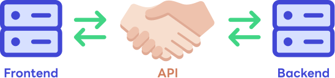
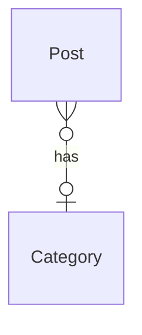
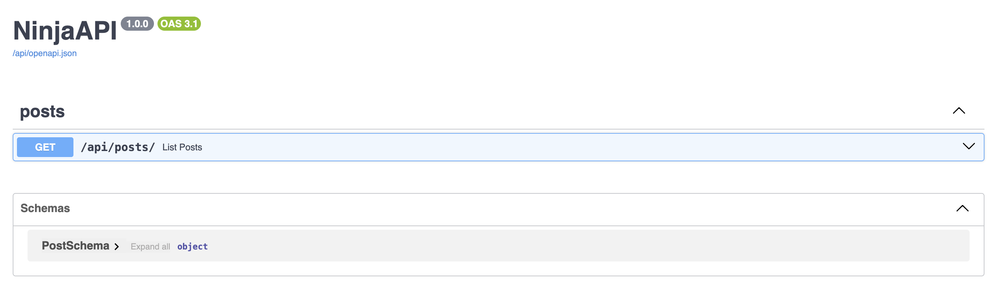
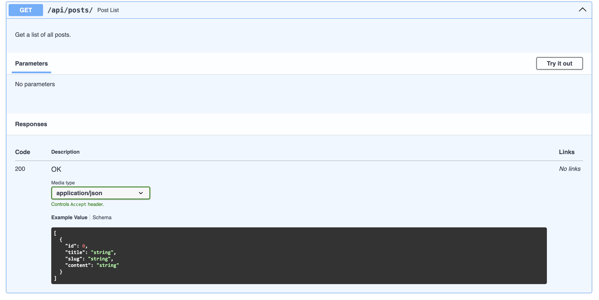
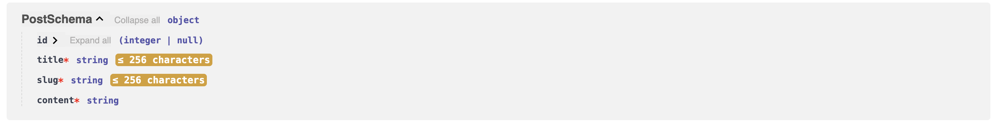
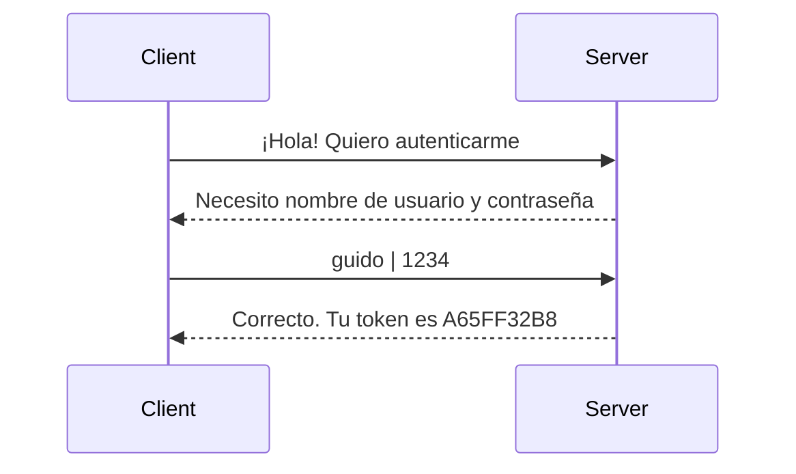

# API { #api }

<span class="dj-level">:material-target-variant: Django especializado</span>

Una API (Interfaz de Programación de Aplicaciones) es un conjunto de reglas y definiciones que permite que diferentes aplicaciones o sistemas se comuniquen entre sí de manera estandarizada. Funciona como un intermediario que recibe solicitudes, las procesa según lo establecido y devuelve respuestas, facilitando el intercambio de datos o funcionalidades sin que los sistemas necesiten conocer cómo está construido el otro internamente. Gracias a las APIs, es posible integrar servicios externos, reutilizar funciones y desarrollar aplicaciones más rápidas, escalables y seguras.

En otras palabras, en una especie de **contrato** que se establece entre dos artefactos de software que quieren intercambiar información. Podemos hablar de un **protocolo** por el que se define la manera de solicitar y devolver datos.



También existe el concepto de **API REST** (Representational State Transfer) con las siguientes características:

- Todos los recursos se identifican mediante una [URL](#urls).
- Se utilizan **métodos HTTP** para indicar la [operación a realizar](#url-design).
- Cada petición del cliente al servidor debe incluir toda la información necesaria para procesarla; el servidor no guarda sesiones previas («stateless» o **sin estado**).
- Formato de datos habitualmente en **JSON**.

## Paquetes existentes { #packages }

En el universo Python, existen varios paquetes de terceros muy relevantes dedicados a la implementación de APIs:

<div class="grid cards" markdown>

-   Integrados con Django :octicons-link-16:

    ---

    - [ ] [Django Rest Framework - DRF](https://www.django-rest-framework.org/): Se integra perfectamente con un proyecto Django y facilita enormemente la conexión de la API con el resto de componentes del «framework».
    - [x] [Django Ninja](https://django-ninja.dev/): Buena integración en Django. Desarrollo rápido y sencillo de cara a la implementación de APIs. Su rendimiento es muy destacado.
    
-   Independientes de Django :octicons-unlink-16:

    ---

    - [ ] [FastAPI](https://fastapi.tiangolo.com/): _Framework_ para desarrollo web con alto rendimiento y fácil de aprender. Ha tomado mucha relevancia en los últimos años. Se acerca a 100K :octicons-star-16: :simple-github:.
    - [ ] [Flask](https://flask.palletsprojects.com/en/stable/): Aunque no se trata de un _framework_ específico para desarrollo de APIs, se ha popularizado como un paquete muy potente para desarrollo web en el que también se pueden implementar APIs.

</div>

En esta sección nos vamos a centrar en **Django Ninja**{.acc} por ser una excelente solución a la hora de implementar APIs de forma rápida y simple, con una curva de aprendizaje baja y con un excelente rendimiento.

## Django Ninja { #django-ninja }

[Django Ninja](https://django-ninja.dev/) es un _framework_ para construir APIs con [Django](../django/) y [anotaciones de tipo](../../../core/modularity/functions.md#type-hints) en Python.

Sus principales características son:

- [x] **Facilidad**: Diseñado para que sea sencillo de usar e intuitivo.
- [x] **Rápida ejecución**: Rendimiento muy alto gracias a [Pydantic](https://pydantic-docs.helpmanual.io/) y [soporte asíncrono](https://django-ninja.dev/guides/async-support/).
- [x] **Desarrollo rápido**: Basado en estándares abiertos para APIs: [OpenAPI](https://www.openapis.org/) (previamente conocido como _Swagger_) y [JSON Schema](https://json-schema.org/).
- [x] **Interconexión con Django**: (Obviamente) tiene una buena integración con Django y su [ORM](models.md#orm).
- [x] **Preparado para producción**: Utilizado en muchas empresas sobre proyectos vivos.

En el contexto de _Django Ninja_ se pueden establecer las siguientes equivalencias:

| Django Ninja :fontawesome-solid-user-ninja: | Django :simple-django: |
| --- | --- |
| API | Proyecto |
| Entrypoint | URL |
| Router | Aplicación |
| Handler | Vista |
| Schema | Formulario |
| Recurso | Objeto |

## Instalación { #installation }

La instalación del paquete es muy sencilla:

=== "*venv* :octicons-package-24:{.blue}"

    ```console
    $ pip install django-ninja
    ```

=== "*uv* &nbsp;:simple-uv:{.uv}"

    ```console
    $ uv add django-ninja
    ```

## Puesta en marcha { #startup }

Vamos a empezar por [crear un proyecto vacío](setup.md#create-project) en el que trataremos de **implementar una API para un «blog»**.

```console
$ mkdir blog-api
$ cd blog-api
$ uv init --bare --no-project
$ uv add django-ninja
$ uv run django-admin startproject main . #(1)!
```
{ .annotate }

1. Creamos un proyecto «normal» de Django.

??? abstract "Django como dependencia"

    La instalación de `django-ninja` ya instala (como dependencia) el paquete `django`:

    ```console hl_lines="8"
    $ uv add django-ninja
    Using CPython 3.14.3
    Creating virtual environment at: .venv
    Resolved 11 packages in 264ms
    Installed 9 packages in 173ms
     + annotated-types==0.7.0
     + asgiref==3.11.1
     + django==6.0.3
     + django-ninja==1.6.2
     + pydantic==2.12.5
     + pydantic-core==2.41.5
     + sqlparse==0.5.5
     + typing-extensions==4.15.0
     + typing-inspection==0.4.2
    ```

### Aplicaciones { #apps }

El diseño de la base de datos muy sencillo:


```mermaid
erDiagram
    Post }o--o| Category : has
```

> Un «post» tiene 0 o 1 categoría y una categoría puede tener 0 o muchos «posts».

Por tanto [crearemos dos aplicaciones](apps.md#creation):

- `categories` :material-arrow-right-bold: para almacenar las categorías.
- `posts` :material-arrow-right-bold: para almacenar los posts.

=== "Categorías"

    Escribimos el fichero de modelos `categories/models.py` con el siguiente contenido:

    ```python title="categories/models.py"
    from django.db import models


    class Category(models.Model):
        name = models.CharField(max_length=256)
        slug = models.SlugField(max_length=256, unique=True)

        class Meta:
            verbose_name_plural = 'Categories'

        def __str__(self):
            return self.name
    ```

    Una vez [creadas y aplicadas las migraciones](models.md#migrations) del modelo, vamos a cargar algunos ^^datos de prueba^^. Para ello trabajaremos con [«fixtures»](models.md#fixtures).

    Copiamos el contenido del fichero [`categories.json`](files/api/categories.json) y lo guardamos en la ruta `categories/fixtures/categories.json` (es posible que debas crear previamente la carpeta `fixtures` dentro de la aplicación `categories`). Luego lo cargamos con el siguiente comando:

    ```console
    $ uv run manage.py loaddata categories
    ```

    Comprobamos que tenemos las categorías cargadas en la base de datos:

    ```console
    $ uv run manage.py shell -v0 -c 'for c in Category.objects.all(): print(c)'
    Design
    Learning
    Configuration
    ```
    
=== "Posts"

    ```python title="posts/models.py"
    from django.db import models


    class Post(models.Model):
        title = models.CharField(max_length=256)
        slug = models.SlugField(max_length=256, unique=True)
        content = models.TextField()
        category = models.ForeignKey(
            'categories.Category',
            on_delete=models.SET_NULL,#(1)!
            related_name='posts',
            null=True,
            blank=True,
        )

        def __str__(self):
            return self.title
    ```
    { .annotate }
    
    1. Al eliminar una categoría, «borramos» la asignación sobre el «post».

    Una vez [creadas y aplicadas las migraciones](models.md#migrations) del modelo, vamos a cargar algunos ^^datos de prueba^^. Para ello trabajaremos con [«fixtures»](models.md#fixtures).

    Copiamos el contenido del fichero [`posts.json`](files/api/posts.json) y lo guardamos en la ruta `posts/fixtures/posts.json` (es posible que debas crear previamente la carpeta `fixtures` dentro de la aplicación `posts`). Luego lo cargamos con el siguiente comando:

    ```console
    $ uv run manage.py loaddata posts
    ```

    Comprobamos que tenemos los posts cargados en la base de datos:

    ```console
    $ uv run manage.py shell -v0 -c 'for p in Post.objects.all(): print(p)'
    Small Changes
    Learning Takes Time
    Thinking in Code
    Useful Mistakes
    Curiosity
    ```

## Puntos de entrada { #entrypoints }

El primer paso será definir las URLs que tendrá nuestro proyecto API. En este contexto, las URLs también se conocen como **puntos de entrada** o «entrypoints».

### Enrutadores { #routers }

Aunque _Django Ninja_ permite [definir URLs](https://django-ninja.dev/tutorial/) dentro de la propia «vista» (manejador), cuando tenemos proyectos de un tamaño mediano-grande se hace recomendable dividir la organización de las URLs [tal y como hemos visto](urls.md) para un proyecto Django «clásico». En este sentido aparecen los llamados [enrutadores](https://django-ninja.dev/guides/routers/) («routers»).

Veamos un <span class="example">ejemplo:material-flash:</span> de organización de las URLs para nuestro proyecto del «blog»:

=== "Módulo API principal"

    ```python title="main/api.py"
    from ninja import NinjaAPI
    
    api = NinjaAPI()
    
    api.add_router('/posts/', 'posts.api.router', tags=['posts'])#(1)!
    ```
    { .annotate }
    
    1. Añadimos el enrutador de la aplicación `posts` al enrutador principal de la API, indicando la ruta base `/posts/` y una etiqueta `tags` para organizar la documentación.


=== "URLs de primer nivel"

    ```python title="main/urls.py" hl_lines="4 8"
    from django.contrib import admin
    from django.urls import path
    
    from .api import api#(1)!
    
    urlpatterns = [
        path('admin/', admin.site.urls),
        path('api/', api.urls),
    ]
    ```
    { .annotate }
    
    1. Importamos el módulo API principal

=== "Módulo API «posts»"

    ```python title="posts/api.py"
    from ninja import Router
    
    router = Router()
    
    
    @router.get('/')#(1)!
    def list_posts(request):
        pass#(2)!
    ```
    { .annotate }
    
    1. Petición GET a `/api/posts/`
    2. En principio no hacemos nada. A efectos explicativos se verá más tade.

!!! tip "Importar Ninja"

    Aunque el paquete se llama `django-ninja` lo importamos como `#!python import ninja` dentro de un fichero _Python_.

### Diseño { #entrypoint-design }

A la hora de diseñar los puntos de entrada de una API hay que tener en cuenta varias cuestiones relevantes:

:one: Utiliza sustantivos, no verbos; con plural para colecciones:

Por <span class="example">ejemplo:material-flash:</span> utiliza `/posts/` en vez de `/getPosts/`.

:two: Aprovecha los [métodos HTTP](https://developer.mozilla.org/en-US/docs/Web/HTTP/Reference/Methods):

| Método | Uso típico | Ejemplo | Explicación |
| --- | --- | --- | --- |
| `GET`{.green} :material-cloud-download: | Obtener recursos | `GET /api/posts/` | Lista todos los «posts» |
| `POST`{.yellow} :material-cloud-upload: | Crear recursos | `POST /api/posts/` | Crea un nuevo «post» |
| `PUT`{.orange} :material-update: | Actualizar recursos (completo) | `PUT /api/posts/17` | Actualiza (por completo) el «post» con `pk=17` |
| `PATCH`{.pink} :material-update: | Actualizar recursos (parcial) | `PATCH /api/posts/17` | Actualiza (parcialmente) el «post» con `pk=17` |
| `DELETE`{.red} :material-delete: | Borrar recursos | `DELETE /api/posts/17` | Borra el «post» con `pk=17` |

:three: Identifica recursos con IDs en la ruta:

Por <span class="example">ejemplo:material-flash:</span> utiliza `/posts/17` en vez de `/posts?id=17`.

:four: Utiliza «query parameters» para filtros y opciones: Los parámetros de consulta sirven para filtrar, ordenar o paginar, no para identificar el recurso principal.

Por <span class="example">ejemplo:material-flash:</span> `/posts?category=2` aplicaría un filtro a todos los «posts» para obtener únicamente aquellos cuya categoría tenga `pk=2`.

:five: Representa relaciones de forma jerárquica: Cuando un recurso depende de otro.

Por <span class="example">ejemplo:material-flash:</span> `/category/2/posts` representaría los «posts» de la categoría con `pk=2`.

:six: Versiona tu API: Muy recomendable para evitar romper clientes existentes:

Por <span class="example">ejemplo:material-flash:</span> `/api/v1/posts/` o `/api/v2/posts/`

:seven: URLs simples y predecibles:

- Usar `kebab-case` es una buena práctica: <span class="example">ejemplo:material-flash:</span> `/api/posts/reset-category`
- Evita mayúsculas.
- Evita caracteres especiales.
- No incluyas formato (`.json`, `.xml`) en la URL.

:eight: Manejo de estados y errores:

- Usa [códigos HTTP](views.md#response-types) correctos (200, 401, 403, 404, 405, 409, 422, 500).
- Los errores deben devolverse en el cuerpo de la respuesta, no en la ruta.

## Esquemas { #schemas }

Un [esquema](https://django-ninja.dev/guides/response/) («schema») en el contexto de _Django Ninja_ es una forma de indicar el formato de entrada y/o salida de los datos en la API.

Permite tanto **validación de datos** como **generación de documentación**:

- La ^^validación de datos^^ se realiza a través de [Pydantic :simple-pydantic:](https://docs.pydantic.dev/) utilizando [anotaciones de tipos](../../../core/modularity/functions.md#type-hints).
- La ^^generación de documentación^^ se realiza automáticamente a partir de los esquemas definidos, siguiendo la especificación [OpenAPI :simple-openapiinitiative:](https://swagger.io/specification/).

Un esquema no es más que ^^una clase Python^^. Esencialmente hay dos tipos:

- [x] **Esquemas basados en campos**: donde definimos «manualmente» los campos que tiene el esquema, heredando de `Schema`.
- [x] **Esquemas basados en modelo**: donde indicamos un modelo del que se extraen los campos que tiene el esquema, heredando de `ModelSchema`.

Vamos a implementar como <span class="example">ejemplo:material-flash:</span> el esquema de un «post»:

=== "Esquema basado en campos"

    ```python title="posts/schemas.py"
    from ninja import Schema
    

    class PostSchema(Schema):
        id: int#(1)!
        title: str
        slug: str
        content: str
    ```
    { .annotate }
    
    1. En peticiones API se suele utilizar `id` en vez de `pk`.

=== "Esquema basado en modelo"

    ```python title="posts/schemas.py"
    from ninja import ModelSchema
    
    from .models import Post
    
    
    class PostSchema(ModelSchema):
        class Meta:
            model = Post
            fields = ['id', 'title', 'slug', 'content']
    ```

    Existen otras variantes para indicar los campos a incluir en el esquema:

    - `#!python fields = '__all__'` :material-arrow-right-bold: para incluir todos los campos del modelo.
    - `#!python exclude = ['field1', 'field2']` :material-arrow-right-bold: para excluir campos del modelo desde un iterable.

=== "Esquemas mixtos"

    ```python title="posts/schemas.py"
    from ninja import ModelSchema, Schema

    from .models import Post


    class PostSchema(ModelSchema):
        id: int

        class Meta:
            model = Post
            exclude = ['id']
    ```

En este caso nos quedaremos con el **esquema basado en modelo**.

!!! info "Serialización"

    Los esquemas se encargan —entre otras muchas cosas— de serializar/deserializar los objetos en el protocolo de comunicación.

    La serialización en APIs es el proceso de convertir objetos complejos en memoria (estructuras de datos) a un formato estándar y transportable como JSON, XML o binario. Esto permite enviar datos entre cliente y servidor, asegurando la compatibilidad entre diferentes lenguajes y plataformas. La deserialización realiza el paso inverso: reconstruir el objeto a partir del formato recibido.

## CRUD { #crud }

En desarrollo de software se utiliza el acrónimo **CRUD** para referirse a las operaciones básicas de **Crear**, **Leer**, **Actualizar** y **Borrar** recursos. Estas operaciones se corresponden con los métodos HTTP `POST`, `GET`, `PUT/PATCH` y `DELETE` respectivamente.

### Obtener recursos { #get }

Para obtener recursos mediante nuestra API necesitaremos implementar los manejadores correspondientes en el módulo de aplicación.

#### Listado de recursos { #list }

Vamos a empezar por un <span class="example">ejemplo:material-flash:</span> en el que **obtenemos todos los «posts»** de nuestro «blog»:


```python title="posts/api.py"
from ninja import Router#(1)!

from .models import Post
from .schemas import PostSchema#(2)!

router = Router()


@router.get('/', response=list[PostSchema])#(3)!
def list_posts(request):#(4)!
    """Get a list of all posts.""" #(5)!
    return Post.objects.all()#(6)!
```
{ .annotate }

1. Necesitamos el [enrutador](#routers).
2. Necesitamos el [esquema](#schemas).
3.  - `#!python @router.get` :material-arrow-right-bold: Se trata de una petición `GET`.
    - `#!python '/'` :material-arrow-right-bold: Acceso a la raíz del «sub-router» `posts`.
    - `#!python list[PostSchema]` :material-arrow-right-bold: devolvemos una [lista](../../../core/datastructures/lists.md) de `PostSchema`.
4. El manejador recibe `request` por defecto pero ningún otro parámetro (en este caso).
5. Si añadimos un [docstring](../../../core/modularity/functions.md#docs) se verá reflejado en la documentación del punto de entrada.
6. _Django Ninja_ se encarga de convertir la «queryset» en una lista de `PostSchema` como respuesta, tal y como se indicó en el decorador.

Una vez hecho esto, podemos [levantar el servidor de desarrollo](setup.md#first-launch) y visitar [http://localhost:8000/api/docs](https://localhost:8000/api/docs/). Deberíamos ver una pantalla similar a la siguiente:



La «magia» de _Django Ninja_ hace que tengamos **documentación generada automáticamente** de nuestra API siguiendo la especificación **OpenAPI**[^1]. Nos aparecen todos nuestros [puntos de entrada](#urls) y todos nuestros [esquemas](#schemas).

=== "Punto de entrada"

    Aquí podemos definir los parámetros (en este caso no lleva ninguno) y también podemos comprobar el esquema esperado:

    

    !!! note "Pruébalo tú mismo"
    
        Al pulsar sobre <kbd>Try it out</kbd> podremos probar el punto de entrada y visualizar los resultados directamente en la misma página web.

=== "Esquema"

    Aquí podemos comprobar los distintos campos establecidos para el esquema.

    

    !!! note "Campos obligatorios"
    
        Aquellos campos seguidos de un asterisco :material-asterisk:{.red} indica que son **campos obligatorios**.
    
Por tanto, para obtener los resultados de nuestro punto de entrada `/api/posts/` —que devuelve todos los «posts» en la base de datos— tenemos varias opciones:

1. [http://localhost:8000/api/docs](http://localhost:8000/api/docs) mediante la documentación generada por _Django Ninja_.
2. [http://localhost:8000/api/posts/](http://localhost:8000/api/posts/) en cualquier navegador.
3. Cliente API en línea de comandos: `#!console $ curl -X GET http://localhost:8000/api/posts/`
4. Cliente API con interfaz gráfica: Por <span class="example">ejemplo:material-flash:</span> [Thunder Client](https://www.thunderclient.com/).

En cualquiera de los casos, la salida esperada debería ser:

```json
[
  {
    "id": 1,
    "title": "Small Changes",
    "slug": "small-changes",
    "content": "Small daily changes can lead to big results."
  },
  {
    "id": 2,
    "title": "Learning Takes Time",
    "slug": "learning-takes-time",
    "content": "Technology moves fast, but real learning takes time."
  },
  {
    "id": 3,
    "title": "Thinking in Code",
    "slug": "thinking-in-code",
    "content": "Writing code is also a way of thinking."
  },
  {
    "id": 4,
    "title": "Useful Mistakes",
    "slug": "useful-mistakes",
    "content": "Not every error is a failure."
  },
  {
    "id": 5,
    "title": "Curiosity",
    "slug": "curiosity",
    "content": "Great ideas are born from curiosity."
  }
]
```

!!! info "JSON"

    En la mayoría de los casos las API REST manejan contenido en formato JSON, pero este comportamiento [se puede modificar](https://django-ninja.dev/guides/input/request-parsers/) en _Django Ninja_.

#### Detalle de recurso { #detail }

Otro <span class="example">ejemplo:material-flash:</span> que podemos abordar es el de obtener un único «post» del «blog»:

```python title="posts/api.py" hl_lines="14-16"
from ninja import Router

from .models import Post
from .schemas import PostSchema

router = Router()


@router.get('/', response=list[PostSchema])
def list_posts(request):
    return Post.objects.all()


@router.get('/{post_id}', response=PostSchema)#(1)!
def get_post(request, post_id: int):#(2)!
    return Post.objects.get(pk=post_id)#(3)!
```
{ .annotate }

1.  - `#!python @router.get` :material-arrow-right-bold: Se trata de una petición `GET`.
    - `#!python '/{post_id}'` :material-arrow-right-bold: Identificador del «post» (clave primaria).
    - `#!python PostSchema` :material-arrow-right-bold: devolvemos un `PostSchema`.
2. Necesitamos definir el parámetro `post_id` en el manejador.
3. Consulta del «post» en la base de datos.

Si ahora «atacamos»[^2] este nuevo punto de entrada en [http://localhost:8000/api/posts/1](http://localhost:8000/api/posts/1) deberíamos obtener el siguiente resultado:

```json
{
  "id": 1,
  "title": "Small Changes",
  "slug": "small-changes",
  "content": "Small daily changes can lead to big results."
}
```

!!! tip "Identificador de recurso"

    Aunque podría ser factible utilizar el `slug` del «post» para identificarlo en la petición a la API, por regla general se prefiere utilizar el identificador «numérico» (clave primaria o candidata).

#### Filtrado de recursos { #filter }

Otra técnica muy utilizada en el acceso a los recursos API es poder filtrarlos por una serie de parámetros. Estos parámetros habitualmente se envían mediante un _query string_ y _Django Ninja_ nos permite [gestionarlos](https://django-ninja.dev/guides/input/query-params/) muy fácilmente.

Veamos un <span class="example">ejemplo:material-flash:</span> en el que filtramos los «posts» por su categoría:

```python title="posts/api.py" hl_lines="10 12-13"
from ninja import Router

from .models import Post
from .schemas import PostSchema

router = Router()


@router.get('/', response=list[PostSchema])
def list_posts(request, category_id: int = None):#(1)!
    posts = Post.objects.all()
    if category_id:#(2)!
        posts = posts.filter(category__id=category_id)#(3)!
    return posts


@router.get('/{post_id}', response=PostSchema)
def get_post(request, post_id: int):
    return Post.objects.get(pk=post_id)
```
{ .annotate }

1. Definimos el parámetro `category_slug` como un _query parameter_ opcional (con valor por defecto `None`).
2. Comprobamos si se ha proporcionado el parámetro `category_id` en la petición.
3. Si se ha proporcionado el parámetro, filtramos los «posts» por la categoría correspondiente.

Si ahora «atacamos»[^2] este nuevo punto de entrada en [http://localhost:8000/api/posts/?category=1](http://localhost:8000/api/posts/?category=design) deberíamos obtener el siguiente resultado:

```json
[
  {
    "id": 1,
    "title": "Small Changes",
    "slug": "small-changes",
    "content": "Small daily changes can lead to big results."
  },
  {
    "id": 3,
    "title": "Thinking in Code",
    "slug": "thinking-in-code",
    "content": "Writing code is also a way of thinking."
  }
]
```

Como se puede observar, el resultado se ha filtrado para mostrar únicamente los «posts» que pertenecen a la categoría con `pk=1` (_Diseño_).

!!! info "Parametros"

    Cualquier parámetro que se añada al manejador y que no forme parte de la ruta se considera un _query parameter_ y se puede gestionar de esta forma.

#### Claves ajenas { #get-fk }

En el <span class="example">ejemplo:material-flash:</span> anterior, el esquema `PostSchema` no incluye información de la categoría a la que pertenece cada «post». Sin embargo, podemos modificar el esquema para incluir esta información:

```python title="posts/schemas.py" hl_lines="9"
from ninja import ModelSchema

from .models import Post


class PostSchema(ModelSchema):
    class Meta:
        model = Post
        fields = '__all__'#(1)!
```
{ .annotate }

1. Ahora incluimos todos los campos del modelo `Post`, incluyendo la clave ajena `category`. Esto hará que en la respuesta de la API se incluya el identificador de la categoría a la que pertenece cada «post».

Veamos la respuesta obtenida al acceder a [http://localhost:8000/api/posts/](http://localhost:8000/api/posts/) con esta nueva configuración:

```json hl_lines="7 14 21 28 35"
[
  {
    "id": 1,
    "title": "Small Changes",
    "slug": "small-changes",
    "content": "Small daily changes can lead to big results.",
    "category": 1
  },
  {
    "id": 2,
    "title": "Learning Takes Time",
    "slug": "learning-takes-time",
    "content": "Technology moves fast, but real learning takes time.",
    "category": 2
  },
  {
    "id": 3,
    "title": "Thinking in Code",
    "slug": "thinking-in-code",
    "content": "Writing code is also a way of thinking.",
    "category": 1
  },
  {
    "id": 4,
    "title": "Useful Mistakes",
    "slug": "useful-mistakes",
    "content": "Not every error is a failure.",
    "category": 2
  },
  {
    "id": 5,
    "title": "Curiosity",
    "slug": "curiosity",
    "content": "Great ideas are born from curiosity.",
    "category": 2
  }
]
```

##### Esquemas anidados { #nested-schemas }

Por defecto, el campo `category` ahora muestra el **identificador de la categoría** a la que pertenece cada «post». Si queremos mostrar información más detallada de la categoría, podríamos crear un nuevo esquema para la categoría y utilizarlo dentro del esquema del «post». Es lo que se conoce como **esquemas anidados**:

=== "Esquema para categorías"

    ```python title="categories/schemas.py"
    from ninja import ModelSchema

    from .models import Category


    class CategorySchema(ModelSchema):
        class Meta:
            model = Category
            fields = '__all__'
    ```

=== "Esquema para «posts»"

    ```python title="posts/schemas.py" hl_lines="3 9 13"
    from ninja import ModelSchema
    
    from categories.schemas import CategorySchema
    
    from .models import Post
    
    
    class PostSchema(ModelSchema):
        category: CategorySchema = None#(1)!
    
        class Meta:
            model = Post
            fields = ['id', 'title', 'slug', 'content']#(2)!
    ```
    { .annotate }
    
    1. Definimos el campo `category` como un `CategorySchema` opcional (con valor por defecto `None`). Esto hará que en la respuesta de la API se incluya toda la información de la categoría a la que pertenece cada «post», en lugar de solo su identificador.
    2. Ahora solo incluimos los campos `id`, `title`, `slug` y `content` del modelo `Post`, ya que el campo `category` lo hemos definido de forma explícita.

Con esta configuración, la respuesta de la API al acceder a [http://localhost:8000/api/posts/](http://localhost:8000/api/posts/) sería la siguiente:

```json hl_lines="3-7 14-18 25-29 36-40 47-51"
[
  {
    "category": {
      "id": 1,
      "name": "Design",
      "slug": "design"
    },
    "id": 1,
    "title": "Small Changes",
    "slug": "small-changes",
    "content": "Small daily changes can lead to big results."
  },
  {
    "category": {
      "id": 2,
      "name": "Learning",
      "slug": "learning"
    },
    "id": 2,
    "title": "Learning Takes Time",
    "slug": "learning-takes-time",
    "content": "Technology moves fast, but real learning takes time."
  },
  {
    "category": {
      "id": 1,
      "name": "Design",
      "slug": "design"
    },
    "id": 3,
    "title": "Thinking in Code",
    "slug": "thinking-in-code",
    "content": "Writing code is also a way of thinking."
  },
  {
    "category": {
      "id": 2,
      "name": "Learning",
      "slug": "learning"
    },
    "id": 4,
    "title": "Useful Mistakes",
    "slug": "useful-mistakes",
    "content": "Not every error is a failure."
  },
  {
    "category": {
      "id": 2,
      "name": "Learning",
      "slug": "learning"
    },
    "id": 5,
    "title": "Curiosity",
    "slug": "curiosity",
    "content": "Great ideas are born from curiosity."
  }
]
```

!!! info "Buenas prácticas"

    Por lo general, es más habitual **mostrar solo el identificador de la categoría** en el esquema del «post» para evitar respuestas demasiado pesadas, especialmente cuando se trata de relaciones de muchos a muchos o cuando la información relacionada es muy extensa. Sin embargo, esto depende del caso de uso específico y de las necesidades de la API.

#### Campos calculados { #calculated-fields }

En ocasiones, es posible que queramos incluir en la respuesta de la API campos que no existen en el modelo pero que se calculan a partir de otros campos. O incluso que existiendo, lleven una lógica adicional.

Para ello debemos utilizar los llamados **«resolvers»**. Si queremos devolver un campo `field` debemos implementar el [método estático](../../../core/modularity/oop.md#static-methods) `resolve_field()` en el esquema correspondiente.

=== "Campo no existente en el modelo"

    Supongamos un <span class="example">ejemplo:material-flash:</span> en el que queremos incluir un campo `summary` en el esquema del «post» que contenga un resumen del contenido del «post»:

    ```python title="posts/schemas.py" hl_lines="7 13-18"
    from ninja import ModelSchema, Schema

    from .models import Post


    class PostSchema(ModelSchema):
        summary: str#(1)!
    
        class Meta:
            model = Post
            fields = ['id', 'title', 'slug', 'content']#(2)!
    
        @staticmethod
        def resolve_summary(post: Post) -> str:#(3)!
            MAX_SUMMARY_LENGTH = 10
            if len(content := str(post.content)) > MAX_SUMMARY_LENGTH:
                return content[:MAX_SUMMARY_LENGTH] + '...'
            return content
    ```
    { .annotate }

    1. Definimos el campo `summary` como un campo de tipo `str`.
    2. Incluimos los campos `id`, `title`, `slug` y `content` del modelo `Post`, pero no incluimos el campo `summary` porque lo vamos a calcular de forma dinámica.
    3.  - Definimos el método `resolve_summary` que se encargará de calcular el valor del campo `summary`.
        - Recibe como parámetro el objeto («post») que el esquema está resolviendo.
    
    Si ahora comprobamos la respuesta de la API al acceder a [http://localhost:8000/api/posts/](http://localhost:8000/api/posts/) sería algo similar a lo siguiente:

    ```json hl_lines="3 10 17 24 31"
    [
      {
        "summary": "Small dail...",
        "id": 1,
        "title": "Small Changes",
        "slug": "small-changes",
        "content": "Small daily changes can lead to big results."
      },
      {
        "summary": "Technology...",
        "id": 2,
        "title": "Learning Takes Time",
        "slug": "learning-takes-time",
        "content": "Technology moves fast, but real learning takes time."
      },
      {
        "summary": "Writing co...",
        "id": 3,
        "title": "Thinking in Code",
        "slug": "thinking-in-code",
        "content": "Writing code is also a way of thinking."
      },
      {
        "summary": "Not every ...",
        "id": 4,
        "title": "Useful Mistakes",
        "slug": "useful-mistakes",
        "content": "Not every error is a failure."
      },
      {
        "summary": "Great idea...",
        "id": 5,
        "title": "Curiosity",
        "slug": "curiosity",
        "content": "Great ideas are born from curiosity."
      }
    ]
    ```

=== "Campo existente en el modelo"

    Supongamos un <span class="example">ejemplo:material-flash:</span> en el que queremos que el campo `title` del esquema del «post» devuelva el título en mayúsculas:

    ```python title="posts/schemas.py" hl_lines="7 13-15"
    from ninja import ModelSchema, Schema

    from .models import Post


    class PostSchema(ModelSchema):
        title: str#(1)!

        class Meta:
            model = Post
            fields = ['id', 'slug', 'content']#(2)!

        @staticmethod
        def resolve_title(post: Post) -> str:#(3)!
            return post.title.upper()
    ```
    { .annotate }

    1. Definimos el campo `title` como un campo de tipo `str` (sin valor por defecto, por lo que es obligatorio).
    2. Incluimos los campos `id`, `slug` y `content` del modelo `Post`, pero no incluimos el campo `title` porque lo vamos a calcular de forma dinámica.
    3.  - Definimos el método `resolve_title` que se encargará de calcular el valor del campo `title`.
        - Recibe como parámetro el objeto («post») que el esquema está resolviendo.

    Si ahora comprobamos la respuesta de la API al acceder a [http://localhost:8000/api/posts/](http://localhost:8000/api/posts/) sería algo similar a lo siguiente:

    ```json hl_lines="3 9 15 21 27"
    [
      {
        "title": "SMALL CHANGES",
        "id": 1,
        "slug": "small-changes",
        "content": "Small daily changes can lead to big results."
      },
      {
        "title": "LEARNING TAKES TIME",
        "id": 2,
        "slug": "learning-takes-time",
        "content": "Technology moves fast, but real learning takes time."
      },
      {
        "title": "THINKING IN CODE",
        "id": 3,
        "slug": "thinking-in-code",
        "content": "Writing code is also a way of thinking."
      },
      {
        "title": "USEFUL MISTAKES",
        "id": 4,
        "slug": "useful-mistakes",
        "content": "Not every error is a failure."
      },
      {
        "title": "CURIOSITY",
        "id": 5,
        "slug": "curiosity",
        "content": "Great ideas are born from curiosity."
      }
    ]
    ```
    
#### Paginación { #pagination }

Cuando el número de recursos a devolver es muy grande, es recomendable implementar algún mecanismo de paginación para evitar respuestas demasiado pesadas. _Django Ninja_ ofrece [soporte para paginación](https://django-ninja.dev/guides/response/pagination/) de forma nativa, lo que facilita su implementación.

Supongamos por <span class="example">ejemplo:material-flash:</span> que queremos implementar una paginación simple en el punto de entrada que devuelve el listado de «posts»:

```python title="posts/api.py" hl_lines="2 11"
from ninja import Router
from ninja.pagination import paginate

from .models import Post
from .schemas import PostSchema

router = Router()


@router.get('/', response=list[PostSchema])
@paginate
def list_posts(request, category_slug: str = None):
    posts = Post.objects.all()
    if category_slug:
        posts = posts.filter(category__slug=category_slug)
    return posts


@router.get('/{post_id}', response=PostSchema)
def get_post(request, post_id: int):
    return Post.objects.get(pk=post_id)
```

Aparecerán dos nuevos parámetros de consulta en el punto de entrada `/api/posts/` para controlar la paginación:

- [x] `limit`: número máximo de recursos a devolver en la respuesta.
- [x] `offset`: número de recursos a saltar antes de empezar a devolver resultados.

Así las cosas, si hacemos por <span class="example">ejemplo:material-flash:</span> una petición `GET` a [http://localhost:8000/api/posts?limit=2&offset=0](http://localhost:8000/api/posts?limit=2&offset=0) obtendríamos la siguiente respuesta:

```json
{
  "items": [
    {
      "id": 1,
      "title": "Small Changes",
      "slug": "small-changes",
      "content": "Small daily changes can lead to big results.",
      "category": 1
    },
    {
      "id": 2,
      "title": "Learning Takes Time",
      "slug": "learning-takes-time",
      "content": "Technology moves fast, but real learning takes time.",
      "category": 2
    }
  ],
  "count": 5
}
```

!!! warning "Respuesta paginada"

    Nótese la diferencia en la estructura de la respuesta al utilizar paginación. En este caso, la respuesta es un objeto JSON con dos campos:

    - `items`: una lista de los recursos devueltos en la página actual.
    - `count`: el número total de recursos disponibles (sin paginar).

### Crear recursos { #create }

Para crear recursos mediante nuestra API necesitaremos implementar los manejadores correspondientes en el módulo de aplicación, utilizando el método `POST` y definiendo un esquema de entrada que indique los datos necesarios para crear el recurso.

Veamos un <span class="example">ejemplo:material-flash:</span> en el que creamos un nuevo «post» en nuestro «blog»:

=== "Modelo"

    Vamos a [añadir un método `save()`](models.md#override-save) al modelo `Post` para que se genere automáticamente el `slug` correspondiente al título del «post» al guardarlo en la base de datos:

    ```python title="posts/models.py" hl_lines="20-23"
    from django.db import models
    from django.utils.text import slugify
    
    
    class Post(models.Model):
        title = models.CharField(max_length=256)
        slug = models.SlugField(max_length=256, unique=True)
        content = models.TextField()
        category = models.ForeignKey(
            'categories.Category',
            on_delete=models.CASCADE,
            related_name='posts',
            null=True,
            blank=True,
        )
    
        def __str__(self):
            return self.title
    
        def save(self, *args, **kwargs):
            if not self.slug:#(1)!
                self.slug = slugify(self.title)
            super().save(*args, **kwargs)
    ```
    { .annotate }
    
    1. Sólo generamos el `slug` si no existe ya uno asignado, para evitar que se sobrescriba el `slug` cada vez que se guarde el «post» (por ejemplo, al actualizarlo).

=== "Esquema"

    Se hace necesario definir un **[esquema](#schemas) de entrada** y un **[esquema](#schemas) de salida** para el recurso «post». El esquema de entrada indicará los datos necesarios para crear un nuevo «post», mientras que el esquema de salida indicará los datos que se devolverán una vez creado el «post».

    ```python title="posts/schemas.py"
    from ninja import ModelSchema
    
    from .models import Post
    
    
    class PostSchemaIn(ModelSchema):
        class Meta:
            model = Post
            fields = ['title', 'content']#(1)!
    
    
    class PostSchemaOut(ModelSchema):
        class Meta:
            model = Post
            fields = ['id', 'title', 'slug', 'content', 'category']
    ```
    { .annotate }
    
    1.  - No se incluyen los campos `id` y `slug` del esquema de entrada porque el `id` se genera automáticamente al crear el recurso y el `slug` se genera automáticamente a partir del `title` en el método `save()` del modelo.
        - Igualmente no se añade el campo `category` porque se verá en el próximo epígrafe [claves ajenas](#create-fk).

=== "Manejador"

    El manejador (_«route handler»_) debe usar los esquemas de entrada y salida para gestionar la creación del nuevo recurso:

    ```python title="posts/api.py"
    from ninja import Router
    
    from .models import Post
    from .schemas import PostSchemaIn, PostSchemaOut
    
    router = Router()
    
    
    @router.post('/', response=PostSchemaOut)#(1)!
    def create_post(request, post: PostSchemaIn):#(2)!
        return Post.objects.create(**post.dict())#(3)!
    ```    
    { .annotate }
    
    1. La respuesta del punto de entrada será un `PostSchemaOut`, que incluye el `id` y el `slug` generados automáticamente al crear el nuevo «post».
    2. El manejador recibe un objeto `post` de tipo `PostSchemaIn`, que contiene los datos necesarios para crear el nuevo «post».
    3.  - Creamos el nuevo «post» en la base de datos utilizando los datos proporcionados en el esquema de entrada desplegando el diccionario de datos.
        - Por <span class="example">ejemplo:material-flash:</span> si «post» tiene título _Django handlers_ y contenido _Handlers can manage entrypoints_, `#!python **post.dict()` :material-arrow-right-bold: `#!python title='Django handlers', content='Handlers can manage entrypoints`

Ahora podemos hacer una petición `POST` a [http://localhost:8000/api/posts/](http://localhost:8000/api/posts/) con el siguiente cuerpo (_«json body»_) para crear un nuevo «post»:

```json title="Request body"
{
  "title": "Focused Progress",
  "content": "Small consistent steps create real progress."
}
```

La respuesta esperada sería la siguiente:

```json title="Code 200"
{
  "id": 6,
  "title": "Focused Progress",
  "slug": "focused-progress",
  "content": "Small consistent steps create real progress.",
  "category": null
}
```

##### Claves ajenas { #create-fk }

Si queremos asignar una categoría (_clave ajena_) al nuevo «post» que estamos creando, debemos modificar ligeramente el manejador del punto de entrada:

=== "Esquema"

    ```python title="posts/schemas.py" hl_lines="9"
    from ninja import ModelSchema
    
    from .models import Post
    
    
    class PostSchemaIn(ModelSchema):
        class Meta:
            model = Post
            fields = ['title', 'content', 'category']#(1)!
    
    
    class PostSchemaOut(ModelSchema):
        class Meta:
            model = Post
            fields = ['id', 'title', 'slug', 'content', 'category']
    ```
    { .annotate }
    
    1. Añadimos el campo `category` para poder indicar el _identificador de la categoría_ al crear un nuevo «post».

=== "Manejador"

    ```python title="posts/api.py"
    from ninja import Router

    from categories.models import Category

    from .models import Post
    from .schemas import PostSchemaIn, PostSchemaOut

    router = Router()


    @router.post('/', response=PostSchemaOut)
    def create_post(request, post: PostSchemaIn):
        payload = post.dict()
        category_id = payload.pop('category', None)#(1)!
        category = Category.objects.get(pk=category_id) if category_id else None#(2)!
        return Post.objects.create(category=category, **payload)#(3)!
    ```
    { .annotate }

    1. Extraemos el identificador de la categoría del cuerpo de la petición.
    2. Obtenemos el objeto `Category` correspondiente al identificador proporcionado (si se ha proporcionado alguno).
    3. Creamos el nuevo «post» con la categoría asignada y el resto de campos.

Ahora podemos hacer una petición `POST` a [http://localhost:8000/api/posts/](http://localhost:8000/api/posts/) con el siguiente cuerpo (_«json body»_) para crear un nuevo «post» con categoría asignada:

```json title="Request body"
{
  "title": "Embrace Iteration",
  "content": "Improve a little every day.",
  "category": 1  // Design
}
```

La respuesta esperada sería la siguiente:

```json title="Code 200"
{
  "id": 7,
  "title": "Embrace Iteration",
  "slug": "embrace-iteration",
  "content": "Improve a little every day.",
  "category": 1
}
```

#### Otras validaciones { #create-validations }

Supongamos por <span class="example">ejemplo:material-flash:</span> que a la hora de crear un «post» necesitamos disponer de un **código de verificación de seguridad** antes de almacenar el «post» en la base de datos. Este código tiene formato `DDD-DD-DDDD`.

Haciendo uso de los recursos que proporciona _Pydantic_ para [configuración de modelos](https://docs.pydantic.dev/latest/api/config/) podemos añadir esta validación (_regex_) en el propio esquema:

=== "Esquema"

    ```python title="posts/schemas.py" hl_lines="2 8"
    from ninja import ModelSchema
    from pydantic import Field#(1)!
    
    from .models import Post
    
    
    class PostSchemaIn(ModelSchema):
        vericode: str = Field(pattern=r'^\d{3}-\d{2}-\d{4}$')#(2)!
    
        class Meta:
            model = Post
            fields = ['title', 'content', 'category']
    
    
    class PostSchemaOut(ModelSchema):
        class Meta:
            model = Post
            fields = '__all__'
    ```
    { .annotate }
    
    1. Importamos el modelo `Field` desde _Pydantic_.
    2. Definimos el patrón de expresión regular para el nuevo campo `vericode`.

=== "Manejador"

    ```python title="posts/schemas.py" hl_lines="13 16-17"
    from ninja import Router

    from categories.models import Category

    from .models import Post
    from .schemas import PostSchemaIn, PostSchemaOut

    router = Router()


    @router.post('/', response=PostSchemaOut)
    def create_post(request, post: PostSchemaIn):
        VERIFICATION_CODE = '123-45-6789'#(1)!

        payload = post.dict()
        if payload.pop('vericode') != VERIFICATION_CODE:#(2)!
            raise ValueError('Invalid verification code')#(3)!
        category_id = payload.pop('category', None)
        category = Category.objects.get(pk=category_id) if category_id else None
        post = Post.objects.create(category=category, **payload)
        return post
    ```
    { .annotate }
    
    1. Establecemos el código de verificación que debe cumplirse.
    2. Extraemos el código de verificación del _payload_ y comprobamos si es correcto.
    3. En caso que sea incorrecto, elevamos una excepción.

Esta aproximación tiene la ventaja de que el valor de entrada de `vericode` es [validado](#validation) de forma automática por ~~Ninja~~ _Pydantic_. Si no cumple con la expresión regular indicada, se notificará un error en la respuesta HTTP correspondiente.

### Actualizar recursos { #update }

A la hora de actualizar recursos mediante nuestra API, tenemos dos opciones:

- [x] **Actualización completa**: utilizando el método `PUT`, donde se actualizan todos los campos del recurso, incluso aquellos que no se proporcionan en la petición (en cuyo caso se establecerían a `null` o a su valor por defecto).
- [x] **Actualización parcial**: utilizando el método `PATCH`, donde se actualizan únicamente los campos que se proporcionan en la petición, manteniendo el resto de campos sin cambios.

#### Actualización completa { #update-put }

Para actualizar recursos mediante nuestra API necesitaremos implementar los manejadores correspondientes en el módulo de aplicación, utilizando el método `PUT` y definiendo un esquema de entrada que indique los datos necesarios.

Veamos un <span class="example">ejemplo:material-flash:</span> en el que actualizamos un «post» de nuestro «blog»:

=== "Esquema"

    ```python title="posts/schemas.py"
    from ninja import ModelSchema
    
    from .models import Post
    
    
    class PostSchemaIn(ModelSchema):
        class Meta:
            model = Post
            exclude = ['title', 'content', 'category']
    
    
    class PostSchemaOut(ModelSchema):
        class Meta:
            model = Post
            fields = ['id', 'title', 'slug', 'content', 'category']
    ```

=== "Manejador"

    ```python title="posts/api.py"
    from ninja import Router

    from .models import Post
    from .schemas import PostSchemaIn, PostSchemaOut

    router = Router()


    @router.put('/{post_id}', response=PostSchemaOut)
    def update_post(request, post_id: int, post: PostSchemaIn):
        payload = post.dict()
        category_id = payload.pop('category', None)
        category = Category.objects.get(pk=category_id) if category_id else None
        payload['category'] = category#(1)!
        post_obj = Post.objects.get(pk=post_id)
        for attr, value in payload.items():#(2)!
            setattr(post_obj, attr, value)#(3)!
        post_obj.save()#(4)!
        return post_obj#(5)!
    ```
    { .annotate }
    
    1. Añadimos la categoría al «payload» que estamos manejando.
    2. Recorremos los elementos del «payload».
    3. Asignamos los nuevos valores a los atributos del objeto `post_obj` utilizando la función `setattr()`.
    4. Guardamos los cambios en la base de datos.
    5. Devolvemos el objeto actualizado como respuesta. Al existir un esquema de salida definido, _Django Ninja_ se encargará de convertir el objeto en el formato adecuado para la respuesta.

Supongamos que queremos actualizar el «post» con `id=7` para cambiar su título y su contenido. Para ello, haríamos una petición `PUT` a [http://localhost:8000/api/posts/7](http://localhost:8000/api/posts/7) con el siguiente cuerpo (_«json body»_):

```json title="Request body"
{
  "title": "Small Changes, Big Results",
  "content": "Small daily changes can lead to big results. Consistency is key."
}
```

La respuesta esperada sería la siguiente:

```json title="Code 200"
{
  "id": 7,
  "title": "Small Changes, Big Results",
  "slug": "embrace-iteration",
  "content": "Small daily changes can lead to big results. Consistency is key.",
  "category": 1
}
```

!!! tip "Slug"

    La decisión de actualizar o no el `slug` al cambiar el `title` depende del caso de uso específico. En algunos casos puede ser deseable mantener el mismo `slug` para evitar romper enlaces existentes, mientras que en otros casos puede ser preferible actualizar el `slug` para que refleje el nuevo título. En nuestro ejemplo, hemos decidido no actualizar el `slug` para mantener la consistencia de los enlaces.

#### Actualización parcial { #update-patch }

Para actualizar recursos de forma parcial mediante nuestra API, el proceso es similar al de la actualización completa, pero utilizando el método `PATCH` y permitiendo que el esquema de entrada tenga campos opcionales.

Veamos un <span class="example">ejemplo:material-flash:</span> en el que actualizamos parcialmente un «post» de nuestro «blog»:

=== "Esquema"

    ```python title="posts/schemas.py" hl_lines="12-16"
    from ninja import ModelSchema
    
    from .models import Post
    
    
    class PostSchemaIn(ModelSchema):
        class Meta:
            model = Post
            fields = ['title', 'content', 'category']
    
    
    class PostSchemaPatch(ModelSchema):#(1)!
        class Meta:
            model = Post
            fields = ['title', 'content', 'category']
            fields_optional = '__all__'#(2)!
    
    
    class PostSchemaOut(ModelSchema):
        class Meta:
            model = Post
            fields = ['id', 'title', 'slug', 'content', 'category']
    ```
    { .annotate }
    
    1. Definimos un nuevo esquema `PostSchemaPatch` para la actualización parcial.
    2. Utilizamos `fields_optional = '__all__'` para indicar que todos los campos del esquema de entrada son opcionales, lo que permite realizar una actualización parcial.

=== "Manejador"

    ```python title="posts/api.py" hl_lines="11"
    from ninja import Router

    from .models import Post
    from .schemas import PostSchemaOut, PostSchemaPatch

    router = Router()


    @router.patch('/{post_id}', response=PostSchemaOut)
    def partial_update_post(request, post_id: int, post: PostSchemaPatch):
    payload = post.dict(exclude_unset=True)#(1)!
    if 'category' in payload:#(2)!
        category_id = payload.pop('category', None)
        category = Category.objects.get(id=category_id) if category_id else None
        payload['category'] = category
    post_obj = Post.objects.get(id=post_id)
    for attr, value in payload.items():
        setattr(post_obj, attr, value)
    post_obj.save()
    return post_obj
    ```
    { .annotate }
    
    1. Obtenemos los datos de entrada como diccionario. En este caso, utilizamos `#!python exclude_unset=True` para excluir aquellos campos que no se han proporcionado en la petición, lo que permite realizar una actualización parcial.
    2. Solo gestionamos el caso de la categoría si ha sido incluida en la actualización (_payload_).

Supongamos que queremos actualizar parcialmente el «post» con `id=7` para cambiar únicamente su contenido. Para ello, haríamos una petición `PATCH` a [http://localhost:8000/api/posts/7](http://localhost:8000/api/posts/7) con el siguiente cuerpo (_«json body»_):

```json title="Request body"
{
  "content": "Small daily changes can lead to big results. Consistency is key. Embrace the journey."
}
```

La respuesta esperada sería la siguiente:

```json title="Code 200"
{
  "id": 7,
  "title": "Small Changes, Big Results",
  "slug": "embrace-iteration",
  "content": "Small daily changes can lead to big results. Consistency is key. Embrace the journey.",
  "category": 1
}
```

### Borrar recursos { #delete }

Para borrar recursos mediante nuestra API necesitaremos implementar los manejadores correspondientes en el módulo de aplicación, utilizando el método `DELETE`.

Veamos un <span class="example">ejemplo:material-flash:</span> en el que borramos un «post» de nuestro «blog»:

```python title="posts/api.py"
from ninja import Router

from .models import Post

router = Router()


@router.delete('/{post_id}')
def delete_post(request, post_id: int):
    post = Post.objects.get(pk=post_id)
    post.delete()
    return {'detail': 'Post deleted successfully'}#(1)!
```
{ .annotate }

1. Es perfectamente válido devolver un diccionario, ya que _Django Ninja_ se encargará de serializarlo automáticamente a JSON para la respuesta.

!!! info "Esquemas"

    Nótese que en este caso no es necesario definir un esquema de entrada ni un esquema de salida, ya que el manejador no recibe ningún dato adicional para identificar el recurso a borrar (más allá del `post_id` en la ruta) y la respuesta es simplemente un mensaje de éxito (diccionario) que _Django Ninja_ serializa automáticamente.

Supongamos que queremos borrar el «post» con `id=7`. Para ello, haríamos una petición `DELETE` a [http://localhost:8000/api/posts/7](http://localhost:8000/api/posts/7) sin necesidad de incluir un cuerpo en la petición. La respuesta esperada sería la siguiente:

```json title="Code 200"
{
  "detail": "Post deleted successfully"
}
```

## Gestión de errores { #errors }

En el desarrollo de una API es fundamental gestionar adecuadamente los errores que puedan ocurrir durante el procesamiento de las peticiones. _Django Ninja_ proporciona varias herramientas para manejar errores de forma eficiente y devolver respuestas adecuadas a los clientes de la API.

A la hora de devolver un error desde un manejador, es importante utilizar el código de estado HTTP correcto para indicar el tipo de error que ha ocurrido e incluir un «response body» en formato JSON con un mensaje de error claro y detallado.

Según el [RFC 9457](https://www.rfc-editor.org/rfc/rfc9457.html) (Problem Details for HTTP APIs) es una buena práctica [incluir un campo `detail`](https://www.rfc-editor.org/rfc/rfc9457#name-detail) en el cuerpo de la respuesta de error, que contenga información adicional sobre el error ocurrido.

### Validación de datos { #validation }

Cuando se reciben datos en una petición, _Django Ninja_ realiza automáticamente la validación de los datos según los esquemas definidos. Si los datos no cumplen con las validaciones establecidas en el esquema, se devuelve una respuesta con un código de estado HTTP 422 (Unprocessable Entity) y un mensaje de error detallado.

Por <span class="example">ejemplo:material-flash:</span> si intentamos crear un nuevo «post» sin proporcionar el campo `title`, que es obligatorio según nuestro esquema de entrada, obtendremos la siguiente respuesta:

```json title="Response body (422)"
{
  "detail": [
    {
      "type": "missing",
      "loc": [
        "body",
        "post",
        "title"
      ],
      "msg": "Field required"
    }
  ]
}
```

Otro <span class="example">ejemplo:material-flash:</span> sería intetar crear un nuevo «post» con un tipo de dato incorrecto para el campo `category` (por ejemplo, una cadena en lugar de un número):

```json title="Response body (422)"
{
  "detail": [
    {
      "type": "int_parsing",
      "loc": [
        "body",
        "post",
        "category_id"
      ],
      "msg": "Input should be a valid integer, unable to parse string as an integer"
    }
  ]
}
```

### Petición mal formada { #bad-request }

Si un cliente hace una petición con un formato incorrecto (por ejemplo, un cuerpo de petición que no es un JSON válido), _Django Ninja_ devolverá automáticamente una respuesta con un código de estado HTTP 400 (Bad Request) y un mensaje de error indicando que la petición está mal formada.

Por <span class="example">ejemplo:material-flash:</span> si intentamos hacer una petición `POST` a [http://localhost:8000/api/posts/](http://localhost:8000/api/posts/) con el siguiente cuerpo mal formado:

```json title="Request body"
{
  "title": "Invalid JSON",#(1)!
}
```
{ .annotate }

1. El cuerpo de la petición no es un JSON válido debido a la coma al final del campo `title`, lo que hará que _Django Ninja_ devuelva un error de petición mal formada.

Obtendríamos la siguiente respuesta:

```json title="Response body (400)"
{
  "detail": "Cannot parse request body (Illegal trailing comma before end of object: line 2 column 26 (char 27))"
}
```

### Método no permitido { #method-not-allowed }

Si un cliente intenta acceder a un punto de entrada utilizando un método HTTP que no está permitido (por ejemplo, haciendo una petición `POST` a un punto de entrada que solo permite `GET`), _Django Ninja_ devolverá automáticamente una respuesta con un código de estado HTTP 405 (Method Not Allowed) y un mensaje de error indicando que el método no está permitido.

Por <span class="example">ejemplo:material-flash:</span> si intentamos hacer una petición `PUT` a [http://localhost:8000/api/posts/](http://localhost:8000/api/posts/) (que solo permite `GET` o `POST`), obtendremos la siguiente respuesta:

```json title="Response body (405)"
{
  "detail": "Method Not Allowed"
}
```

### Recurso no encontrado { #not-found }

Una forma bastante sencilla de gestionar el error de recurso no encontrado es utilizar el método [`get_object_or_404()`](views.md#not-found-query) de Django, que devuelve una respuesta con un código de estado HTTP 404 (Not Found) si el recurso no existe.

Por <span class="example">ejemplo:material-flash:</span> en el manejador de obtención de detalle de un «post», podríamos modificar la consulta para utilizar `get_object_or_404()` de la siguiente manera:

```python title="posts/api.py" hl_lines="12"
from django.shortcuts import get_object_or_404
from ninja import Router

from .models import Post
from .schemas import PostSchemaOut

router = Router()


@router.get('/{post_id}', response=PostSchemaOut)
def get_post(request, post_id: int):
    return get_object_or_404(Post, pk=post_id)
```

Si ahora intentamos acceder a un «post» que no existe (por ejemplo, con `id=999`) [http://localhost:8000/api/posts/999](http://localhost:8000/api/posts/999) obtendremos la siguiente respuesta:

```json title="Response body (404)"
{
  "detail": "Not Found: No Post matches the given query."
}
```

### Devolviendo errores { #raise-error }

En algunos casos, es posible que queramos devolver un error personalizado con un mensaje específico y un código de estado HTTP determinado. Para ello, _Django Ninja_ [proporciona la función `HttpError`](https://django-ninja.dev/guides/errors/) que nos permite crear respuestas de error personalizadas.

Supongamos por <span class="example">ejemplo:material-flash:</span> que hay una serie de «posts» restringidos en nuestro «blog». Por lo tanto, queremos devolver un error de acceso denegado (código de estado HTTP 403) si el usuario intenta acceder a uno de estos «posts» restringidos. Podríamos modificar el manejador de obtención de detalle del «post» de la siguiente manera:

```python title="posts/api.py" hl_lines="15-16"
from django.shortcuts import get_object_or_404
from ninja import Router
from ninja.errors import HttpError

from .models import Post
from .schemas import PostSchemaOut

router = Router()


@router.get('/{post_id}', response=PostSchemaOut)
def get_post(request, post_id: int):
    RESTRICTED_POSTS_IDS = [1, 2, 3]

    if post_id in RESTRICTED_POSTS_IDS:
        raise HttpError(403, 'Access to this post is restricted')
    return get_object_or_404(Post, pk=post_id)
```

Si ahora intentamos acceder a uno de los «posts» restringidos (por ejemplo, con `id=1`) [http://localhost:8000/api/posts/1](http://localhost:8000/api/posts/1) obtendremos la siguiente respuesta:

```json title="Response body (403)"
{
  "detail": "Access to this post is restricted"
}
```

!!! warning "Elevar excepción"

    Al estar gestionando errores, no se trata de devolver la excepción sino de lanzarla, utilizando para ello `#!python raise HttpError()`.

## Autenticación { #auth }

En el desarrollo de una API, es fundamental implementar mecanismos de autenticación para proteger los recursos y garantizar que solo los usuarios autorizados puedan acceder a ellos. _Django Ninja_ proporciona varias [opciones de autenticación](https://django-ninja.dev/guides/authentication/) que se pueden configurar fácilmente.

_Django Ninja_ ofrece los siguientes métodos de autenticación:

- [ ] **Token Authentication**: Utiliza un token único para cada usuario que se incluye en las peticiones para autenticar al usuario. Es sencillo de implementar y adecuado para aplicaciones móviles o clientes que no pueden manejar cookies.
- [ ] **Session Authentication**: Utiliza las [sesiones de Django](https://docs.djangoproject.com/en/stable/topics/http/sessions/) para autenticar a los usuarios. Es adecuado para aplicaciones web tradicionales donde el cliente puede manejar cookies.
- [x] **Bearer Authentication**: Utiliza tokens de portador (Bearer tokens) que se incluyen en las cabeceras de la petición para autenticar al usuario. Es comúnmente utilizado en APIs RESTful y es compatible con [OAuth2](https://oauth.net/2/).

En esta sección nos centraremos en el método de autenticación **HTTP Bearer** por ser el más comúnmente utilizado en APIs RESTful, aunque los conceptos y técnicas que veremos también pueden aplicarse a otros métodos de autenticación.

### HTTP Bearer { #http-bearer }

El [método de autenticación HTTP Bearer](https://swagger.io/docs/specification/v3_0/authentication/bearer-authentication/) es una forma común de autenticar a los usuarios en una API RESTful. Consiste en incluir un **token de portador** (_«bearer token»_) en la cabecera (_«headers»_) de las peticiones HTTP para autenticar al usuario.

```yaml title="Headers" linenums="1"
Authorization: Bearer <token>
```

### Definiendo el modelo { #bearer-model }

Lo primero que necesitamos es definir un modelo que nos permita ^^almacenar el token de autenticación^^ de cada usuario/a.

Para ello vamos a empezar [creando una aplicación](apps.md#creation) llamada `users` que gestione todo lo relacionado con los usuarios y la autenticación. Luego, añadimos el siguiente modelo en `users/models.py` para almacenar los tokens de autenticación:

```python title="users/models.py"
import uuid

from django.conf import settings
from django.db import models


class Token(models.Model):
    key = models.UUIDField(unique=True, default=uuid.uuid4, editable=False)#(1)!
    user = models.OneToOneField(settings.AUTH_USER_MODEL, on_delete=models.CASCADE)#(2)!
    created_at = models.DateTimeField(auto_now_add=True)#(3)!

    def __str__(self):
        return str(self.key)
```
{ .annotate }

1.  - Este campo almacenará el valor de la clave (token) de tipo UUID.
    - Le damos un valor por defecto que en este caso será un «callable» (función) [`uuid.uuid4()`](https://docs.python.org/3/library/uuid.html#uuid.uuid4)
    - Indicar `editable=False` hace que no se pueda editar desde la interfaz administrativa.
2. Necesitamos vincularlo con la clase [`User`](auth.md#user) que nos proporciona Django.
3.  - Añadimos un atributo para tener el momento en el que se creó el token.
    - También se podría haber añadido un atributo `expires_at` que indica cuándo expira.

Una vez [creadas y aplicadas las migraciones](models.md#migrations) del modelo, vamos a cargar algunos ^^datos de prueba^^. Para ello trabajaremos con [«fixtures»](models.md#fixtures).

Descargamos el fichero [`users.json`](files/api/users.json) y lo guardamos en la ruta `users/fixtures/users.json` (es posible que debas crear previamente la carpeta `fixtures` dentro de la aplicación `users`). Luego lo cargamos con el siguiente comando:

```console
$ uv run manage.py loaddata users
```

Comprobamos que tenemos datos de autenticación cargados en la base de datos:

```console
$ uv run manage.py shell -v0 -c 'for t in Token.objects.all(): print(t.user, t.key)'
guido 40e5f786-1210-45f5-9e5d-f76925a9e98a
```

!!! warning "Contraseña"

    La contraseña creada para el usuario `guido` es `pythoncreator`

### Obteniendo el token { #get-token }

El protocolo HTTP Bearer se basa en el siguiente flujo de autenticación:


```mermaid
sequenceDiagram
    participant c as Client
    participant s as Server
    c->>s: ¡Hola! Quiero autenticarme
    s-->>c: Necesito nombre de usuario y contraseña
    c->>s: guido | 1234
    s-->>c: Correcto. Tu token es A65FF32B8
```

Por lo tanto, vamos a implementar un punto de entrada en nuestra API que permita a los usuarios obtener su token de autenticación proporcionando nombre de usuario y contraseña:

=== "URLs"

    ```python title="main/urls.py" hl_lines="6"
    from ninja import NinjaAPI
    
    api = NinjaAPI()
    
    api.add_router('/posts/', 'posts.api.router', tags=['posts'])
    api.add_router('/users/', 'users.api.router', tags=['users'])
    ```    

=== "Esquemas"

    ```python title="users/schemas.py"
    from django.contrib.auth import get_user_model
    from ninja import ModelSchema
    
    from .models import Token
    
    User = get_user_model()
    
    
    class AuthSchemaIn(ModelSchema):
        class Meta:
            model = User
            fields = ['username', 'password']
    
    
    class TokenSchemaOut(ModelSchema):
        class Meta:
            model = Token
            fields = ['user', 'key']
    ```

=== "Manejador"

    ```python title="users/api.py"
    from django.contrib.auth import authenticate
    from django.shortcuts import get_object_or_404
    from ninja import Router
    from ninja.errors import HttpError
    
    from .models import Token
    from .schemas import AuthSchemaIn, TokenSchemaOut
    
    router = Router()
    
    
    @router.post('/auth/', response=TokenSchemaOut)
    def auth(request, auth: AuthSchemaIn):
        if not (user := authenticate(request, username=auth.username, password=auth.password)):
            raise HttpError(401, 'Invalid credentials')
    
        return get_object_or_404(Token, user=user)
    ```

Ahora podemos hacer una petición `POST` a [http://localhost:8000/api/users/auth/](http://localhost:8000/api/users/auth/) con el siguiente cuerpo (_«json body»_) para obtener el token de autenticación:

```json title="Request body"
{
  "username": "guido",
  "password": "pythoncreator"
}
```

La respuesta esperada sería la siguiente:

```json title="Code 200"
{
  "user": "guido",
  "key": "40e5f786-1210-45f5-9e5d-f76925a9e98a"
}
```

### Protegiendo recursos { #protect }

Una vez que los usuarios pueden obtener su token de autenticación, el siguiente paso es proteger los recursos de nuestra API para que solo los usuarios autenticados puedan acceder a ellos.

Lo primero que debemos hacer es definir una ^^clase de autenticación personalizada^^ que verifique el _token_ incluido en las peticiones. Para ello, creamos un nuevo archivo `users/auth.py` con el siguiente contenido:

```python title="users/auth.py"
from ninja.security import HttpBearer

from .models import Token


class AuthBearer(HttpBearer):#(1)!
    def authenticate(self, request, token):#(2)!
        try:
            token_obj = Token.objects.get(key=token)#(3)!
        except Token.DoesNotExist:
            return None#(4)!
        return token_obj.user#(5)!
```
{ .annotate }

1. Esta clase hereda de `HttpBearer` y sobrescribe el método `authenticate()`, que se encarga de verificar el _token_ incluido en las peticiones.
2. El método recibe la petición HTTP `request` y el _token_ extraído de la cabecera de autenticación (_«headers»_).
3. Intentamos obtener el objeto `Token` correspondiente al _token_ proporcionado.
4. Si el _token_ no existe, devolvemos `None`, lo que indica que la autenticación ha fallado.
5. Si el _token_ es válido, devolvemos el usuario asociado a ese _token_, lo que indica que la autenticación ha sido exitosa.

En el <span class="example">ejemplo:material-flash:</span> mostrado a continuación protegemos el punto de entrada de creación de un nuevo «post» para que solo los usuarios autenticados puedan acceder a él:

```python title="posts/api.py" hl_lines="12"
from ninja import Router

from categories.models import Category
from users.auth import AuthBearer

from .models import Post
from .schemas import PostSchemaIn, PostSchemaOut

router = Router()


@router.post('/', response=PostSchemaOut, auth=AuthBearer())#(1)!
def create_post(request, post: PostSchemaIn):#(2)!
    payload = post.dict()
    category_id = payload.pop('category', None)
    category = Category.objects.get(pk=category_id) if category_id else None
    post = Post.objects.create(category=category, **payload)
    return post
```
{ .annotate }

1. Añadimos el parámetro `auth=AuthBearer()` al decorador del manejador para indicar que este punto de entrada requiere autenticación utilizando la clase `AuthBearer` que hemos definido previamente.
2.  - El parámetro `request.auth` dentro del manejador contendrá lo que devuelva el método `AuthBearer.authenticate()`.
    - En este caso contiene el usuario autenticado (si la autenticación ha sido exitosa) o `None` (si la autenticación ha fallado).

Por lo tanto, si intentamos crear un nuevo «post» sin incluir el token de autenticación en la cabecera de la petición, obtendremos la siguiente respuesta:

```json title="Response body (401)"
{
  "detail": "Unauthorized"
}
```

!!! info "Autenticación"

    En la interfaz gráfica de la documentación de la API, se indicará que el punto de entrada requiere autenticación y se mostrará un candado :octicons-unlock-16:{.red} para introducir el _token_ de autenticación. Una vez introducido el _token_, podremos acceder al punto de entrada y crear nuevos «posts» normalmente.

## Subida de ficheros { #create-files }

Si queremos permitir la subida de ficheros a través de nuestra API, _Django Ninja_ nos ofrece soporte nativo para gestionar este tipo de escenarios, teniendo en cuenta que el formato de la petición debe ser `multipart/form-data`.

En el siguiente <span class="example">ejemplo:material-flash:</span> vamos a modificar el modelo `Post` para añadir una portada que se pueda subir a través de la API:

```python title="posts/models.py" hl_lines="16-20"
from django.db import models
from django.utils.text import slugify


class Post(models.Model):
    title = models.CharField(max_length=256)
    slug = models.SlugField(max_length=256, unique=True)
    content = models.TextField()
    category = models.ForeignKey(
        'categories.Category',
        on_delete=models.CASCADE,
        related_name='posts',
        null=True,
        blank=True,
    )
    cover = models.ImageField(
        upload_to='post/covers/',
        null=True,
        blank=True,
    )

    def __str__(self):
        return self.title

    def save(self, *args, **kwargs):
        if not self.slug:
            self.slug = slugify(self.title)
        super().save(*args, **kwargs)
```

Una vez [creadas y aplicadas las migraciones](models.md#migrations) del modelo, vamos a establecer los esquemas de entrada y salida, así como el manejador del punto de entrada para gestionar la creación de un nuevo «post» con portada:

=== "Esquemas"

    ```python title="posts/schemas.py"
    from ninja import ModelSchema
    
    from .models import Post
    
    
    class PostSchemaIn(ModelSchema):
        class Meta:
            model = Post
            fields = ['title', 'content', 'category']#(1)!
    
    
    class PostSchemaOut(ModelSchema):
        class Meta:
            model = Post
            fields = '__all__'
    ```
    { .annotate }
    
    1. Dejamos fuera el campo `cover` del esquema de entrada porque lo gestionaremos de forma separada en los parámetros del manejador.

=== "Manejador"

    ```python title="posts/api.py"
    from ninja import File, Form, Router, UploadedFile

    from categories.models import Category

    from .models import Post
    from .schemas import PostSchemaIn, PostSchemaOut

    router = Router()


    @router.post('/', response=PostSchemaOut)
    def create_post(request, post: Form[PostSchemaIn], cover: File[UploadedFile] = None):#(1)!
        payload = post.dict()
        category_id = payload.pop('category', None)
        category = Category.objects.get(pk=category_id) if category_id else None
        post = Post.objects.create(category=category, cover=cover, **payload)
        return post
    ```
    { .annotate }
    
    1.  - Utilizamos `#!python Form[PostSchemaIn]` para indicar que los datos del esquema de entrada se recibirán como parte de un formulario `multipart/form-data`
        - Utilizamos `#!python File[UploadedFile]` para indicar que el campo `cover` se recibirá como un fichero subido.


Ahora podremos crear un nuevo «post» con portada a través de la interfaz gráfica de la documentación de la API, que nos permitirá subir un fichero de imagen para la portada y el nuevo «post» se creará correctamente con la portada asociada.

Como <span class="example">ejemplo:material-flash:</span> puedes probar con estos datos en el formulario de la documentación de la API:

| Campo | Valor |
| --- | --- |
| `title` | `Designing APIs` |
| `content` | `Good APIs are designed, not just implemented.` |
| `category` | `1` |
| `cover` | [`test_api_image.jpg`](./images/api/test_api_image.jpg) |

La petición [`curl`](https://curl.se/) asociada a esta acción sería la siguiente:

```bash
curl -X 'POST' \
  'http://localhost:8000/api/posts/' \
  -H 'accept: application/json' \
  -H 'Content-Type: multipart/form-data' \
  -F 'title=Designing APIs' \
  -F 'content=Good APIs are designed, not just implemented.' \
  -F 'category_id=1' \
  -F 'cover=@test_api_image.jpg;type=image/jpeg'
```


[^1]: [OpenAPI](https://swagger.io/specification/) es un estándar que describe cómo funciona una API (sus rutas, parámetros y respuestas) en un formato que pueden entender humanos y máquinas.
[^2]: En terminología API «atacar» un punto de entrada significa acceder al recurso correspondiente a la URL introducida.
