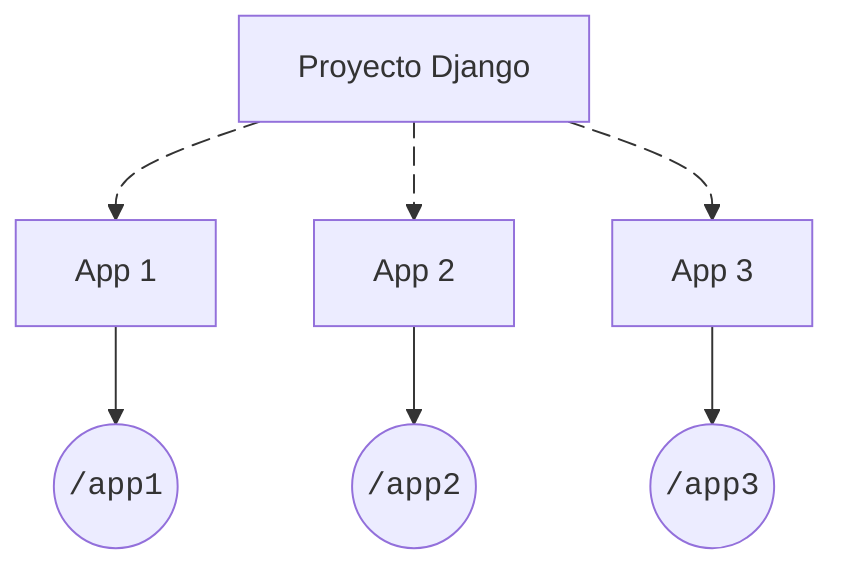

# Aplicaciones { #apps }

<span class="dj-level">:material-signal-cellular-1: Django básico</span>

Un proyecto Django está formado por aplicaciones. En este contexto podemos entender una aplicación como un «módulo» o «sección» de nuestro sitio web.



Hay una serie de aplicaciones que **ya vienen incluidas en la propia instalación de Django**. En el [primer arranque](setup.md#first-launch) vimos que se aplicaron [migraciones](models.md#migrations) de:

- [x] admin
- [x] auth
- [x] contenttypes
- [x] sessions

## Crear una aplicación { #creation }

Para crear una nueva aplicación en un proyecto Django usaremos el subcomando `startapp`.

Supongamos un <span class="example">ejemplo:material-flash:</span> en el que queremos crear una aplicación para gestionar los «posts» de nuestro «blog». Para ello ejecutamos el siguiente comando:

=== "*venv* :octicons-package-24:{.blue}"

    ```console
    $ ./manage.py startapp posts
    ```

=== "*uv* &nbsp;:simple-uv:{.uv}"

    ```console
    $ uv run manage.py startapp posts
    ```

    ??? abstract "justfile"

        Consulta la receta [`startapp`](justfile.md#django-justfile) para incluirla en tu `justfile`.

!!! tip "Nombres en plural"

    Suele ser habitual usar **nombres en plural** para las aplicaciones, pero obviamente depende del contexto y no es una regla fija.

## Estructura de una aplicación { #structure }

La estructura de una **aplicación Django** es la siguiente:

```python title="posts/"
.
├── __init__.py#(1)!
├── admin.py#(2)!
├── apps.py#(3)!
├── migrations#(4)!
│   └── __init__.py
├── models.py#(5)!
├── tests.py#(6)!
└── views.py#(7)!
```
{ .annotate }

1. Este tipo de archivos se utilizan para indicar que la carpeta actual es un [paquete](https://docs.python.org/3/tutorial/modules.html#packages) en Python.
2. Este archivo permite especificar las características de los modelos de cara a la [interfaz administrativa](https://docs.djangoproject.com/en/dev/ref/contrib/admin/) de Django.
3. Este archivo permite «registrar» la aplicación creada y definir algunas configuraciones a nivel global.
4. Esta carpeta contendrá las migraciones (como ficheros) realizadas sobre los modelos de la aplicación actual.
5. Este archivo permite definir los modelos para la aplicación actual.
6. Este archivo permite escribir las pruebas («tests») de la aplicación actual.
7. Este archivo permite definir las vistas para la aplicación actual.

## Instalar la aplicación { #installation }

Para que Django reconozca una nueva aplicación en nuestro proyecto, necesitamos darla de alta («instalarla») en el fichero `settings.py`.

Existe una variable [`INSTALLED_APPS`](https://docs.djangoproject.com/en/stable/ref/settings/#std-setting-INSTALLED_APPS) que contiene una lista con todas las aplicaciones dadas de alta en el proyecto. Si miramos su contenido actual veremos lo siguiente:

```python title="main/settings.py"
INSTALLED_APPS = [
    'django.contrib.admin',#(1)!
    'django.contrib.auth',#(2)!
    'django.contrib.contenttypes',#(3)!
    'django.contrib.sessions',#(4)!
    'django.contrib.messages',#(5)!
    'django.contrib.staticfiles',#(6)!
]
```
{ .annotate }

1. Interfaz administrativa.
2. Sistema de autenticación.
3. Herramientas para trabajar con los modelos del proyecto.
4. Sistema para almacenar información en sesiones.
5. Notificaciones.
6. Gestión de archivos estáticos.

Siguiendo con el <span class="example">ejemplo:material-flash:</span> anterior vamos a «instalar» nuestra aplicación `posts`. Basta con añadir su fichero de configuración a `settings.py`:

```python title="main/settings.py" hl_lines="8-9"
INSTALLED_APPS = [
    'django.contrib.admin',
    'django.contrib.auth',
    'django.contrib.contenttypes',
    'django.contrib.sessions',
    'django.contrib.messages',
    'django.contrib.staticfiles',
    # CUSTOM
    'posts.apps.PostsConfig',#(1)!
]
```
{ .annotate }

1. `/posts/apps.py` clase `PostsConfig`

:material-check-all:{ .blue } Como regla general, lo que debemos añadir a la lista `INSTALLED_APPS` de `settings.py` es la «ruta» a la **clase** que configura la aplicación.

!!! note "Clase de configuración"

    Si la aplicación se llama `foos` la clase de configuración se llamará `FoosConfig` y estará en la ruta: `#!console foos/apps.py`

## Aplicación compartida { #shared }

En cualquier proyecto hay una gran cantidad de recursos que se comparten por todas las aplicaciones. Por tanto resulta interesante crear una aplicación que centralice dichos recursos y sirva de referencia para ellos.

En este sentido **es recomendable** [crear una aplicación](#creation) `shared`{ .red } que contenga artefactos compartidos: plantillas base, estáticos comunes, funciones genéricas, etc.

=== "*venv* :octicons-package-24:{.blue}"

    ```console
    $ ./manage.py startapp shared
    ```

=== "*uv* &nbsp;:simple-uv:{.uv}"

    ```console
    $ uv run manage.py startapp shared
    ```

!!! info "shared"

    El nombre `shared` para esta aplicación de «recursos compartidos» es uno de tantos que se pueden elegir. Obviamente no es obligatorio y queda a decisión del equipo de desarrollo.
