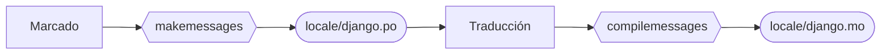
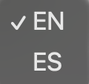

# Internacionalización { #i18n }

<span class="djversion advanced">:simple-django: Avanzado :material-tag-multiple-outline:</span>

En desarrollo web, la **internacionalización** (`i18n`)[^1] es el proceso de preparar una aplicación o sitio web para que pueda adaptarse fácilmente a múltiples idiomas, formatos de fecha, monedas y otras diferencias culturales, sin necesidad de realizar cambios significativos en el código base.

Django ofrece [mecanismos](https://docs.djangoproject.com/en/stable/topics/i18n/translation/) para facilitar la tarea de internacionalizar una aplicación web. Básicamente hay dos pasos en este proceso:

:one: [Marcado](#mark).  
:two: [Traducción](#translate).

## Marcado { #mark }

El **marcado** es el proceso por el cual se le indica a Django qué partes de nuestro software deben ser traducidos. Se diferencian tres posibles contextos:

- [x] [Marcado en plantillas](#mark-templates).  
- [x] [Marcado en vistas](#mark-views).  
- [x] [Marcado en URLs](#mark-urls).

### Marcado en plantillas { #mark-templates }

Podemos «marcar» para traducción cadenas de texto en plantillas. Para ello, Django nos ofrece la [etiqueta de plantilla](templates.md#tags): [`translate`](https://docs.djangoproject.com/en/stable/topics/i18n/translation/#translate-template-tag).

Veamos un marcado concreto en el <span class="example">ejemplo:material-flash:</span> del «blog» dentro de la plantilla que añade un «post»:

```htmldjango title="posts/templates/posts/add.html" linenums="1" hl_lines="2 8"

<!--(1)!-->


<form method="post" novalidate>
    
    {{ form }}
    <button type="submit"></button><!--(2)!-->
</form>

```
{ .annotate }

1. Carga las funcionalidades de internacionalización :material-arrow-right-bold: `#!htmldjango `
2. Aplica la etiqueta de plantilla.

### Marcado en vistas { #mark-views }

Podemos «marcar» para traducción cadenas de texto en vistas. Para ello, Django nos ofrece la función: [`gettext()`](https://docs.djangoproject.com/en/stable/ref/utils/#django.utils.translation.gettext).

Veamos un marcado concreto en el <span class="example">ejemplo:material-flash:</span> del «blog» dentro de la vista que muestra el detalle de un «post»:

```python hl_lines="3 12"
from django.http import HttpResponse
from django.shortcuts import render
from django.utils.translation import gettext as _#(1)!

from .models import Post


def post_detail(request, post_slug: str):
    try:
        post = Post.objects.get(slug=post_slug)
    except Post.DoesNotExist:
        msg = _('Post {ps} does not exist'.format(ps=post_slug))#(2)!
        return HttpResponse(msg, status=404)
    return render(request, 'posts/post/detail.html', {'post': post})
```
{ .annotate }

1.  - Importamos la función de marcado/traducción.
    - Aunque no es obligatorio, suele ser habitual definir el alias `_`
2.  - Pasamos la cadena de texto que queremos marcar para traducción.
    - Es totalmente válido que la cadena de texto incluya variables a interpolar.
    - Eso sí, es necesario usar el método [`format()`](https://docs.python.org/3/library/stdtypes.html#str.format) para que funcione bien el marcado.

### Marcado en URLs { #mark-urls }
        
Podemos «marcar» para traducción cadenas de texto en URLs. Para ello, Django nos ofrece la función: [`gettext_lazy()`](https://docs.djangoproject.com/en/stable/ref/utils/#django.utils.translation.gettext_lazy).

La función `gettext_lazy()` se diferencia de `gettext()` en que no traduce en el momento en el que el código se ejecuta. En este contexto utilizamos `gettext_lazy()` porque cuando se carga el módulo `urls.py` Django no sabe aún cuál es el idioma activo de cada petición.

Veamos un marcado concreto en el <span class="example">ejemplo:material-flash:</span> del «blog» en la URL de edición de un «post»:

```python title="posts/urls.py" hl_lines="2 13"
from django.urls import path
from django.utils.translation import gettext_lazy as _#(1)!

from . import views

app_name = 'posts'


urlpatterns = [
    path('', views.post_list, name='post-list'),
    path('add/', views.add_post, name='add-post'),
    path('<slug:post_slug>/', views.post_detail, name='post-detail'),
    path(_('<slug:post_slug>/edit/'), views.edit_post, name='edit-post'),#(2)!
]
```
{ .annotate }

1.  - Importamos la función de marcado/traducción.
    - Aunque no es obligatorio, suele ser habitual definir el alias `_`
2.  - El marcado es igual que lo que se ha visto hasta el momento.
    - Es posible incluir en el marcado parámetros del patrón sin ningún problema.

## Traducción { #translate }

Una vez marcadas las cadenas de texto podemos pasar a la tarea propiamente de traducción. Pero para ello debemos crear los **ficheros de idioma**. El proceso es el siguiente:



Supongamos por <span class="example">ejemplo:material-flash:</span> que estamos desarrollando el «blog» en inglés pero ^^queremos añadir traducción al español^^.

### Crear ficheros de idioma { #makemessages }

Django proporciona el comando [`makemessages`](https://docs.djangoproject.com/en/stable/ref/django-admin/#django-admin-makemessages) para crear los ficheros de idioma. Pero antes de lanzarlo, debemos ==crear en todas las aplicaciones== la subcarpeta `locale`.

??? abstract "justfile"

    Consulta la receta [`makelocale`](justfile.md#django-justfile) para incluirla en tu `justfile`.

Ahora ya podremos lanzar el comando que crea los ficheros de idioma:

=== "*venv* :octicons-package-24:{.blue}"

    ```console
    $ ./manage.py makemessages -l es #(1)!
    ```
    { .annotate }

    1.  - Se ha utilizado `es` porque vamos a generar traducciones para español. Habría que adaptar el código según corresponda.
        - En el propio código fuente del proyecto Django se puede encontrar el [listado con los códigos de idioma](https://github.com/django/django/blob/main/django/conf/global_settings.py#L53) existentes.

=== "*uv* &nbsp;:simple-uv:{.uv}"

    ```console
    $ uv run manage.py makemessages -l es #(1)!
    ```
    { .annotate }

    1.  - Se ha utilizado `es` porque vamos a generar traducciones para español. Habría que adaptar el código según corresponda.
        - En el propio código fuente del proyecto Django se puede encontrar el [listado con los códigos de idioma](https://github.com/django/django/blob/main/django/conf/global_settings.py#L53) existentes.

    ??? abstract "justfile"

        Consulta la receta [`makemessages`](justfile.md#django-justfile) para incluirla en tu `justfile`.

El comando anterior creará un fichero `posts/locale/es/LC_MESSAGES/django.po` con aquellas cadenas marcadas para traducir. Ahora tendremos que abrir dicho fichero en algún editor de texto y completar las entradas `msgstr` ^^con la traducción al español^^:

```po title="posts/locale/es/LC_MESSAGES/django.po" hl_lines="23-24 27-28 32-33"
# SOME DESCRIPTIVE TITLE.
# Copyright (C) YEAR THE PACKAGE'S COPYRIGHT HOLDER
# This file is distributed under the same license as the PACKAGE package.
# FIRST AUTHOR <EMAIL@ADDRESS>, YEAR.
#
#, fuzzy
msgid ""
msgstr ""
"Project-Id-Version: PACKAGE VERSION\n"
"Report-Msgid-Bugs-To: \n"
"POT-Creation-Date: 2025-11-30 18:01+0000\n"
"PO-Revision-Date: YEAR-MO-DA HO:MI+ZONE\n"
"Last-Translator: FULL NAME <EMAIL@ADDRESS>\n"
"Language-Team: LANGUAGE <LL@li.org>\n"
"Language: \n"
"MIME-Version: 1.0\n"
"Content-Type: text/plain; charset=UTF-8\n"
"Content-Transfer-Encoding: 8bit\n"
"Plural-Forms: nplurals=3; plural=n == 1 ? 0 : n != 0 && n % 1000000 == 0 ? "
"1 : 2;\n"

#: posts/templates/posts/post/add.html:8
msgid "Add post"
msgstr "Añadir post"

#: posts/urls.py:13
msgid "<slug:post_slug>/edit/"
msgstr "<slug:post_slug>/editar/"

#: posts/views.py:20
#, python-brace-format
msgid "Post {ps} does not exist"
msgstr "El post {ps} no existe"
```

??? example "Poedit"

    Una de las herramientas más conocidas para realizar traducciones mediante interfaz gráfica es [poedit](https://poedit.net/).

    Modo de uso: `#!console poedit file.po`

    ??? abstract "justfile"

        Consulta la receta [`poedit`](justfile.md#django-justfile) para incluirla en tu `justfile`.

### Compilar ficheros de idioma { #compilemessages }

Con las traducciones completadas, ahora viene la fase de **compilación** de los ficheros de idioma. Para ello Django proporciona el comando [`compilemessages`](https://docs.djangoproject.com/en/stable/ref/django-admin/#django-admin-compilemessages).

Ejecutamos el siguiente comando:

=== "*venv* :octicons-package-24:{.blue}"

    ```console
    $ ./manage.py compilemessages -i .venv #(1)!
    ```
    { .annotate }
    
    1. Ignoramos la carpeta del entorno virtual `.venv` ya que también contiene marcas de traducción (para el propio sistema base Django).

=== "*uv* &nbsp;:simple-uv:{.uv}"

    ```console
    $ uv run manage.py compilemessages -i .venv #(1)!
    ```
    { .annotate }
    
    1. Ignoramos la carpeta del entorno virtual `.venv` ya que también contiene marcas de traducción (para el propio sistema base Django).

    ??? abstract "justfile"

        Consulta la receta [`compilemessages`](justfile.md#django-justfile) para incluirla en tu `justfile`.

Este comando creará un fichero `posts/locale/es/LC_MESSAGES/django.mo` con la versión compilada del fichero de idioma.

## Cambio de idioma { #lang-switch }

Ahora que ya tenemos las traducciones completadas y los ficheros de idioma preparados, tendremos que encontrar el modo de permitir al usuario cambiar el idioma a conveniencia.

Lo primero será añadir un «middleware» que permita individualizar la elección de idioma. Para ello añadimos la siguiente línea al fichero `settings.py`:

```python title="main/settings.py" hl_lines="9"
MIDDLEWARE = [
    'django.middleware.security.SecurityMiddleware',
    'django.contrib.sessions.middleware.SessionMiddleware',
    'django.middleware.common.CommonMiddleware',
    'django.middleware.csrf.CsrfViewMiddleware',
    'django.contrib.auth.middleware.AuthenticationMiddleware',
    'django.contrib.messages.middleware.MessageMiddleware',
    'django.middleware.clickjacking.XFrameOptionsMiddleware',
    'django.middleware.locale.LocaleMiddleware',
]
```

A continuación habrá que realizar unos pequeños cambios en las URLs de primer nivel:

```python title="main/urls.py" linenums="1" hl_lines="1 9 12"
from django.conf.urls.i18n import i18n_patterns
from django.contrib import admin
from django.urls import include, path


urlpatterns = (
    # URLs with no i18n changes
    [
        path('i18n/', include('django.conf.urls.i18n')),
    ]
    # URLs with i18n prefix: en/es
    + i18n_patterns(
        path('', include('accounts.urls')),
        path('admin/', admin.site.urls),
        path('posts/', include('posts.urls')),
    )
    + static(settings.MEDIA_URL, document_root=settings.MEDIA_ROOT)
)
```

**Línea 8**:

- Esta línea proporciona la URL con nombre `set_language` que apunta a `/i18n/setlang/`
- Dicha URL llama a la vista [`django.views.i18n.set_language()`](https://docs.djangoproject.com/en/stable/topics/i18n/translation/#django.views.i18n.set_language).
- Esta vista espera ser llamada vía POST.
- Almacena la elección de idioma actual en una «cookie» llamada `django_language`.

**Línea 10**:

- Esta función hace que los patrones de URL pasados como argumento dispongan de un prefijo: `es/` o `en/` según el idioma activo.
- Entre otras, tendríamos `/en/posts/add/` o `/es/posts/add/` que si aplicamos [marcado](#mark-urls) y [traducción](#translate) de URLs, podría convertirse en `/es/posts/agregar/`

### Etiqueta personalizada { #lang-switch-tag }

Veamos ahora una posible implementación de una [etiqueta personalizada](templates.md#custom-tags) para el **cambio de idioma** que hace uso de la vista `set_language` proporcionada por Django *i18n*:

=== "Plantilla"

    ```htmldjango title="shared/templates/includes/setlang.html"
    <!--(1)!-->
    
    <form action="" method="post"><!--(2)!-->
      
      <select name="language" onchange="this.form.submit()"><!--(3)!-->
        <!--(4)!-->
          <option value="{{ language }}" selected><!--(5)!-->
            {{ language|upper }}<!--(6)!-->
          </option>
        
      </select>
    </form>
    ```
    { .annotate }
    
    1. Importamos las funcionalidades de internacionalización.
    2. Preparamos un formulario hacia la URL con nombre `set_language` proporcionada por Django.
    3. Hacemos la petición cuando cambie el desplegable mediante un pequeño fragmento de *JavaScript*.
    4. Recorremos la lista de idiomas que nos vienen desde la etiqueta personalizada.
    5. Mostramos cada opción de idioma dejando seleccionado el idioma activo actualmente.
    6. Mostramos el idioma en el desplegable pasado a mayúsculas.

=== "Etiqueta"

    ```python title="shared/templatetags/shared_extras.py"
    from django import template
    from django.utils.translation import get_language
    
    register = template.Library()
    
    
    @register.inclusion_tag('includes/setlang.html')
    def setlang():
        LANGUAGES = ('en', 'es')#(1)!
        current_language = get_language()#(2)!
        return {'languages': LANGUAGES, 'current_language': current_language}#(3)!
    ```
    { .annotate }
    
    1. Definimos la lista de idiomas disponibles (mediante sus códigos).
    2. Obtenemos el ~~idioma~~ código de idioma activo actualmente.
    3. Necesitamos enviar a la plantilal un contexto con los idiomas disponibles y el idioma activo.

=== "Uso"

    ```htmldjango title="shared/templates/base.html" hl_lines="1 12"
    <!--(1)!-->

    <!DOCTYPE html>
    <html>
    <head>
        <meta charset="utf-8" />
        <meta name="viewport" content="width=device-width, initial-scale=1" />
        <title>Blog</title>
    </head>

    <body>
        <!--(2)!-->
        
    </body>
    </html>
    ```
    { .annotate }
    
    1. Cargamos las etiquetas y/o filtros personalizados.
    2. Simplemente hacemos referencia a la plantilla personalizada de cambio de idioma que hemos implementado.

    Con esto conseguimos que aparezca un desplegable de este estilo para seleccionar el idioma:

    

[^1]: **i18n** es la abreviatura de «internacionalización» :material-arrow-right-box: `[i (18 caracteres) n]`
