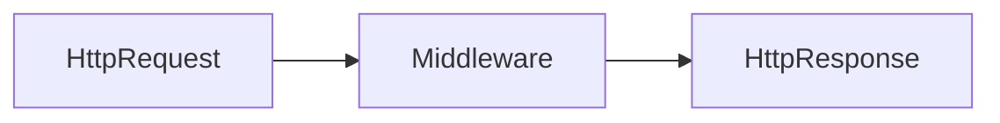

# Middleware { #middleware }

<span class="djversion intermediate">:simple-django: Intermedio :material-tag-multiple-outline:</span>

Un [«middleware»](https://docs.djangoproject.com/en/stable/topics/http/middleware/) —en el contexto de Django— es un artefacto de software que se sitúa entre la petición y la respuesta HTTP y permite alterar la entrada o la salida a conveniencia de manera global.



## Middleware disponible { #available-middleware }

Django proporciona una serie de [«middleware» predefinido](https://docs.djangoproject.com/en/stable/ref/middleware/) que podemos **activar** bajo demanda.

Si nos fijamos en un proyecto nuevo («fresh») de Django podremos observar que muchos de estos «middleware» ya se encuentran activados por defecto:

```python title="main/settings.py"
MIDDLEWARE = [
    'django.middleware.security.SecurityMiddleware',
    'django.contrib.sessions.middleware.SessionMiddleware',
    'django.middleware.common.CommonMiddleware',
    'django.middleware.csrf.CsrfViewMiddleware',
    'django.contrib.auth.middleware.AuthenticationMiddleware',
    'django.contrib.messages.middleware.MessageMiddleware',
    'django.middleware.clickjacking.XFrameOptionsMiddleware',
]
```

Cada «middleware» define una o varias clases que aportan distintas funcionalidades:

| Middleware | Ruta | Descripción | ¿Por defecto? |
| --- | --- | --- | --- |
| [Cache](https://docs.djangoproject.com/en/stable/ref/middleware/#module-django.middleware.cache) | `#!python 'django.middleware.cache.UpdateCacheMiddleware'`<br>`#!python 'django.middleware.cache.FetchFromCacheMiddleware'` | Habilita la caché de Django | :material-cancel:{.red} |
| [Common](https://docs.djangoproject.com/en/stable/ref/middleware/#module-django.middleware.common) | `#!python 'django.middleware.common.CommonMiddleware'` | Realiza distintas acciones comunes | :material-check:{.green} |
| [GZip](https://docs.djangoproject.com/en/stable/ref/middleware/#module-django.middleware.gzip) | `#!python 'django.middleware.gzip.GZipMiddleware'` | Comprime contenido en formato [GZip](https://es.wikipedia.org/wiki/Gzip) | :material-cancel:{.red} |
| [Conditional GET](https://docs.djangoproject.com/en/stable/ref/middleware/#module-django.middleware.http) | `#!python 'django.middleware.http.ConditionalGetMiddleware'` | Maneja operaciones GET condicionales | :material-cancel:{.red} |
| [Locale](https://docs.djangoproject.com/en/stable/ref/middleware/#module-django.middleware.locale) | `#!python 'django.middleware.locale.LocaleMiddleware'` | Habilita la selección de idioma sobre los datos de la petición | :material-cancel:{.red} |
| [Message](https://docs.djangoproject.com/en/stable/ref/middleware/#module-django.contrib.messages.middleware) | `#!python 'django.contrib.messages.middleware.MessageMiddleware'` | Habilita el soporte para mensajes | :material-check:{.green} |
| [Security](https://docs.djangoproject.com/en/stable/ref/middleware/#module-django.middleware.security) | `#!python 'django.middleware.security.SecurityMiddleware'` | Proporciona mejoras de seguridad al ciclo petición/respuesta | :material-check:{.green} |
| [Session](https://docs.djangoproject.com/en/stable/ref/middleware/#module-django.contrib.sessions.middleware) | `#!python 'django.contrib.sessions.middleware.SessionMiddleware'` | Habilita el soporte de sesiones | :material-check:{.green} |
| [Site](https://docs.djangoproject.com/en/stable/ref/middleware/#module-django.contrib.sites.middleware) | `#!python 'django.contrib.sites.middleware.CurrentSiteMiddleware'` | Añade el atributo `site` a la petición | :material-cancel:{.red} |
| [Authentication](https://docs.djangoproject.com/en/stable/ref/middleware/#module-django.contrib.auth.middleware) | `#!python 'django.contrib.auth.middleware.AuthenticationMiddleware'`<br>`#!python 'django.contrib.auth.middleware.LoginRequiredMiddleware'`<br>`#!python 'django.contrib.auth.middleware.RemoteUserMiddleware'`<br>`#!python 'django.contrib.auth.middleware.PersistentRemoteUserMiddleware'` | Habilita los mecanismos de autenticación |  :material-check:{.green} |
| [CSRF protection](https://docs.djangoproject.com/en/stable/ref/middleware/#csrf-protection-middleware) | `#!python 'django.middleware.csrf.CsrfViewMiddleware'` | Añade protección contra CSRF | :material-check:{.green} |
| [X-Frame-Options](https://docs.djangoproject.com/en/stable/ref/middleware/#x-frame-options-middleware) | `#!python 'django.middleware.clickjacking.XFrameOptionsMiddleware'` | Añade protección simple contra [«clickjacking»](https://en.wikipedia.org/wiki/Clickjacking) | :material-check:{.green} |

### Mensajes { #message-middleware }

El [«middleware» de mensajes](https://docs.djangoproject.com/en/stable/ref/contrib/messages/) permite crear y publicar mensajes en nuestro proyecto web de manera rápida y sencilla.

Django ya lo tiene habilitado _por defecto_, pero si no fuera así, para activarlo simplemente tendríamos que añadirlo a la lista [`MIDDLEWARE`](https://docs.djangoproject.com/en/stable/ref/settings/#std-setting-MIDDLEWARE) en el fichero de configuraciones:

```python title="main/settings.py" hl_lines="7"
MIDDLEWARE = [
    'django.middleware.security.SecurityMiddleware',
    'django.contrib.sessions.middleware.SessionMiddleware',
    'django.middleware.common.CommonMiddleware',
    'django.middleware.csrf.CsrfViewMiddleware',
    'django.contrib.auth.middleware.AuthenticationMiddleware',
    'django.contrib.messages.middleware.MessageMiddleware',
    'django.middleware.clickjacking.XFrameOptionsMiddleware',
]
```

Mediante este «middleware» Django proporciona un objeto `messages` que contendrá la lista de mensajes que queremos notificar.

Para cada mensaje podemos indicar el [nivel informativo](https://docs.djangoproject.com/en/stable/ref/contrib/messages/#message-tags) asociado. El módulo `messages` dentro de `django.contrib.messages` contiene las siguientes constantes:

| Nivel | Etiqueta | Objetivo |
| --- | --- | --- |
| `DEBUG` | `debug` | Mensaje de depuración |
| `INFO` | `info` | Mensajes informativo |
| `SUCCESS` | `success` | Mensaje de operación exitosa |
| `WARNING` | `warning` | Mensaje de advertencia |
| `ERROR` | `error` | Mensaje de error |

Supongamos un <span class="example">ejemplo:material-flash:</span> en el que queremos notificar al usuario que el «post» de un «blog» ha sido borrado satisfactoriamente:

=== "Vista"

    ```python title="posts/views.py" hl_lines="1 10 12"
    from django.contrib.messages import messages#(1)!
    from django.shortcuts import render

    from .models import Post


    def delete_post(request, post_slug: str):
        try:
            post = Post.objects.get(slug=post_slug)
            messages.add_message(request, messages.SUCCESS, 'Post deleted successfully')#(2)!
        except Post.DoesNotExist:
            messages.add_message(request, messages.ERROR, 'Post does not exist')#(3)!
        posts = Post.objects.all()
        return render(request, 'posts/post/list.html', {'posts': posts})#(4)!
    ```
    { .annotate }
    
    1. Importamos el objeto `messages` para gestionar los mensajes.
    2. Añadimos un **mensaje de éxito** mediante el método [`add_message()`](https://docs.djangoproject.com/en/stable/ref/contrib/messages/#django.contrib.messages.add_message).
    3. Añadimos un **mensaje de error** mediante el método [`add_message()`](https://docs.djangoproject.com/en/stable/ref/contrib/messages/#django.contrib.messages.add_message).
    4. No es necesario incluir los mensajes en el contexto porque el «middleware» ya se encarga de ello.

=== "Plantilla"

    ```htmldjango title="posts/post/list.html" hl_lines="1-9"
    
    <ul class="messages">
        
            <li class="{{ message.tags }}"><!--(1)!-->
                {{ message }}
            </li>
        
    </ul>
    

    <ul class="posts">
    
        <li><a href="">{{ post.title }}</a></li>
    
    </ul>
    ```
    { .annotate }
    
    1. Cada mensaje dispone de una etiqueta `tag` que se está usando como _clase CSS_ del mensaje.

## Middleware personalizado { #custom-middleware }

<span class="djversion advanced">:simple-django: Avanzado :material-tag-multiple-outline:</span>

Más allá de los [«middleware» existentes](#available-middleware) en Django, es posible implementar un «middleware» personalizado para aquellas tareas que sean necesarias aplicar de manera global en el ciclo petición/respuesta.

Lo único que necesitamos hacer es escribir una clase sobreescribiendo unos ciertos métodos predefinidos y activar el citado «middleware».

Imaginemos un <span class="example">ejemplo:material-flash:</span> en el que queremos mostrar al usuario una determinada página cada vez que se produzca un error (excepción) en cualquier parte de nuestro proyecto Django. Esto, obviamente se podría hacer en cada punto concreto del código, pero en este caso sería interesante implementar un «middleware» que lo gestionara.

=== "Excepción"

    ```python title="shared/exceptions.py"
    from django.shortcuts import render


    class BlogError(Exception):#(1)!
        def __init__(self, message: str, status_code: int):
            self.message = message
            self.status_code = status_code
        
        def __str__(self):
            return f'{self.status_code} {self.message}'
        
        def render(self, request):
            return render(request, 'shared/error.html', {'error': self})
    ```
    { .annotate }
    
    1. No es obligatorio crear una excepción para implementar un «middleware». Simplemente para este ejemplo era necesario.

=== "Middleware"

    ```python title="shared/middleware.py"
    from .exceptions import BlogError


    class BlogErrorMiddleware:#(1)!
        def __init__(self, get_response):#(2)!
            self.get_response = get_response
        
        def __call__(self, request):#(3)!
            # Código a ejecutar para cada petición
            # ANTES de que se llame a la vista (y otros middleware)
            response = self.get_response(request)
            # Código a ejectuar para cada petición/respuesta
            # DESPUÉS de que se llame a la vista
            return response
        
        def process_exception(self, request, exception):#(4)!
            if isinstance(exception, BlogError):
                return exception.render(request)
            return None
    ```    
    { .annotate }
    
    1. Por convención se suele añadir el sufijo `Middleware` al nombre de la clase que implementa el «middleware».
    2. El constructor recibe la función [`get_response()`](https://docs.djangoproject.com/en/stable/topics/http/middleware/#init-get-response).
    3.  - Podríamos decir que el método `__call__()` es el punto más interesante donde podemos modificar «cosas».
        - Recibe la petición HTTP como `request`.
    4.  - El método [`process_exception()`](https://docs.djangoproject.com/en/stable/topics/http/middleware/#process-exception) se llama cuando una vista lanza una excepción.
        - Recibe la petición HTTP como `request` y la excepción lanzada como `exception`.
    
    !!! info "Procesando la plantilla"
    
        También se puede implementar el método [`process_template_response()`](https://docs.djangoproject.com/en/stable/topics/http/middleware/#process-template-response) que se llama justo después de que la vista ha terminado su ejecución y ha retornado el «render» de una plantilla.

=== "Plantilla"

    ```htmldjango title="shared/templates/error.html" hl_lines="13"
    <!DOCTYPE html>
    <html>
    <head>
        <meta charset="utf-8" />
        <meta name="viewport" content="width=device-width, initial-scale=1" />
        <title></title>
        <!-- <link rel="stylesheet" href="css/main.css" /> -->
        <!-- <link rel="icon" href="images/favicon.png" /> -->
    </head>

    <body>
        <h1>Error</h1>
        <p><strong>{{ error.status_code }}</strong> {{ error.message }}</p>
        <!-- <script src="js/scripts.js"></script> -->
    </body>
    </html> 
    ```

=== "Activación"

    ```python title="main/settings.py" hl_lines="9"
    MIDDLEWARE = [
        'django.middleware.security.SecurityMiddleware',
        'django.contrib.sessions.middleware.SessionMiddleware',
        'django.middleware.common.CommonMiddleware',
        'django.middleware.csrf.CsrfViewMiddleware',
        'django.contrib.auth.middleware.AuthenticationMiddleware',
        'django.contrib.messages.middleware.MessageMiddleware',
        'django.middleware.clickjacking.XFrameOptionsMiddleware',
        'shared.middleware.BlogErrorMiddleware'
    ] 
    ```

Lo que tiene de bueno este esquema, es que en cualquier punto de una vista podemos elevar la excepción `BlogError` y todo lo demás sucede «automágicamente»:

```python title="posts/views.py" hl_lines="10"
from shared.exceptions import BlogError

from .models import Post


def post_detail(request, post_slug: str):
    try:
        post = Post.objects.get(slug=post_slug)
    except Post.DoesNotExist:
        raise BlogError('Post does not exist', 404)#(1)!
    return render(request, 'posts/post/detail.html', {'post': post})
```
{ .annotate }

1. En este punto el «middleware» `BlogErrorMiddleware` hará su trabajo y terminará renderizando una página con el error en cuestión.
