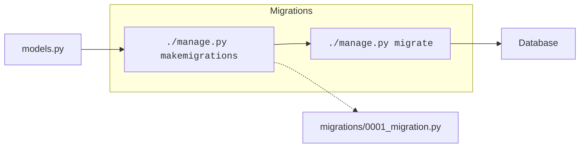
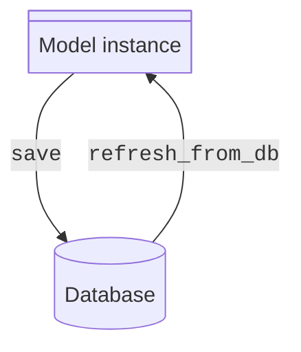
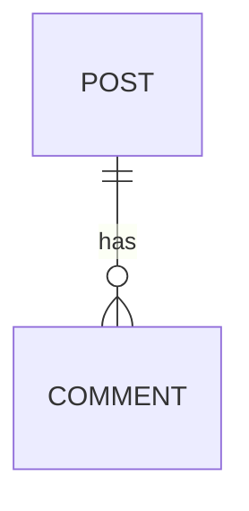
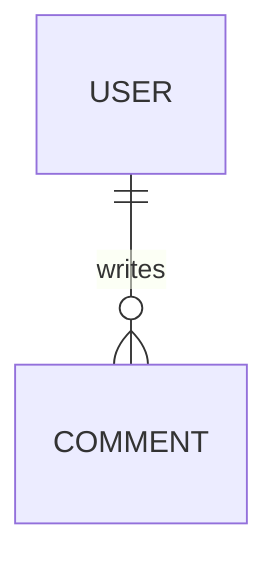
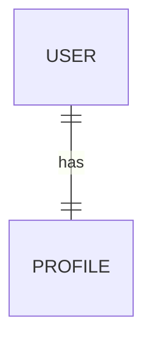
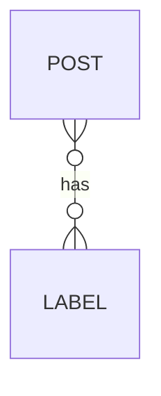

# Modelos { #models }

<span class="dj-level">:material-signal-cellular-1: Django básico</span>

Como hemos visto en las [características de Django](../django/webdev.md#django-features) existe un **ORM** que vincula tablas de la base de datos con objetos de Python.

Un **modelo** es simplemente una **clase de Python** que hereda características definidas (en otras clases) del propio framework de Django.

Se trata de una **abstracción** del _modelo de datos_ que permite trabajar a más alto nivel. En teoría[^1] podríamos cambiar el sistema gestor de base de datos que hay debajo y todo seguiría funcionando de la misma manera.

## Creando modelos { #creation }

Un modelo no es más que una clase Python que «suele» vivir en el fichero `models.py` de una [aplicación](apps.md) Django.

Veamos un <span class="example">ejemplo:material-flash:</span> en el que creamos un modelo `Post` de nuestro «blog» dentro de una [aplicación](apps.md#creation) llamada `posts`:

```python title="posts/models.py"
from django.db import models#(1)!


class Post(models.Model):#(2)!
    title = models.CharField(max_length=256)
    slug = models.SlugField(max_length=256)
    content = models.TextField()

    def __str__(self):#(3)!
        return self.title
```
{ .annotate }

1. Necesitamos importar el módulo `models` que nos dará aquellas funcionalidades necesarias para implementar nuestros modelos.
2.  - La clase debe heredar de `models.Model` para que se convierta en un modelo válido.
    - En este caso se creará una tabla en la base de datos con el nombre `posts_post` (`app_class`).
3. Es muy ^^recomendable^^ definir el método `#!python __str__()`

!!! tip "Campos obligatorios"

    Todos los campos que definimos en un modelo son **campos obligatorios** (requeridos) por defecto, salvo que se [indique lo contrario](#optional-fields) de forma explícita.

:material-check-all:{ .blue } Existe una correspondencia entre el modelo de datos (clase) definido en Django y la tabla creada en la base de datos. Para el caso anterior se creará la tabla `posts_post` (`app_model`).


## Campos { #fields }

Los campos de un modelo no son más que **atributos de clase**.

Dentro del módulo [`django.db.models`](https://docs.djangoproject.com/en/stable/ref/models/instances/#django.db.models) disponemos de una gran cantidad de [tipos de campos](https://docs.djangoproject.com/en/stable/ref/models/fields/#field-types). A continuación se muestra una tabla completa con los **tipos de campos** existentes en Django:

<div class="annotate" markdown>
| Campo :material-focus-field: | Descripción :material-invoice-text-fast-outline: | Objeto Python :material-language-python: | Parámetros :material-cube-outline:
| --- | --- | --- | --- |
| [`AutoField`:fontawesome-solid-arrow-up-right-dots:](https://docs.djangoproject.com/en/stable/ref/models/fields/#autofield) | Entero autoincremental | [`int`](../../../core/datatypes/numbers.md#integers) | |
| [`BigAutoField`:fontawesome-solid-arrow-up-right-dots:](https://docs.djangoproject.com/en/stable/ref/models/fields/#bigautofield) | Entero largo  (_64bits_)<br>autoincremental | [`int`](../../../core/datatypes/numbers.md#integers) | |
| [`BigIntegerField`:material-lightning-bolt:](https://docs.djangoproject.com/en/stable/ref/models/fields/#bigintegerfield) | Entero largo (_64bits_) | [`int`](../../../core/datatypes/numbers.md#integers) | |
| [`BinaryField`:octicons-file-binary-24:](https://docs.djangoproject.com/en/stable/ref/models/fields/#binaryfield) | Valor binario | [`bytes`](https://docs.python.org/3/library/stdtypes.html#bytes) | `max_length`(1) |
| [`BooleanField`:material-sort-bool-descending:](https://docs.djangoproject.com/en/stable/ref/models/fields/#booleanfield) | Valor «booleano» | [`bool`](../../../core/datatypes/numbers.md#booleans) | |
| [`CharField`:material-text-short:](https://docs.djangoproject.com/en/stable/ref/models/fields/#charfield) | Campo de texto (corto) | [`str`](../../../core/datatypes/strings.md) | `max_length`:octicons-key-asterisk-24:{ .yellow } (2) |
| [`DateField`:material-calendar:](https://docs.djangoproject.com/en/stable/ref/models/fields/#datefield) | Fecha | [`datetime.date`](https://docs.python.org/3/library/datetime.html#datetime.date) | `auto_now_add`(3)<br>`auto_now`(4) |
| [`DateTimeField`:octicons-clock-24:](https://docs.djangoproject.com/en/stable/ref/models/fields/#datetimefield) | Fecha y hora | [`datetime.datetime`](https://docs.python.org/3/library/datetime.html#datetime.datetime) | `auto_now_add`(5)<br>`auto_now`(6) |
| [`DecimalField`:fontawesome-solid-euro-sign:](https://docs.djangoproject.com/en/stable/ref/models/fields/#decimalfield) | Valor flotante<br>(dinero/divisas) | [`Decimal`](https://docs.python.org/3/library/decimal.html#decimal.Decimal) | `max_digits`:octicons-key-asterisk-24:{ .red } (7)<br>`decimal_places`:octicons-key-asterisk-24:{ .red } (8) |
| [`DurationField`:material-av-timer:](https://docs.djangoproject.com/en/stable/ref/models/fields/#durationfield) | Período de tiempo | [`datetime.timedelta`](https://docs.python.org/3/library/datetime.html#datetime.timedelta) | |
| [`EmailField`:material-email-box:](https://docs.djangoproject.com/en/stable/ref/models/fields/#emailfield) | Correo electrónico | [`str`](../../../core/datatypes/strings.md) | `max_length`(9) |
| [`FileField`:octicons-file-24:](https://docs.djangoproject.com/en/stable/ref/models/fields/#filefield) | Fichero | [`Storage`](https://docs.djangoproject.com/en/stable/ref/files/storage/#django.core.files.storage.Storage) | `upload_to`(10) <br> `storage`(11) <br> `max_length`(12) |
| [`FilePathField`:material-folder-hidden:](https://docs.djangoproject.com/en/stable/ref/models/fields/#filepathfield) | Nombres de ficheros existentes en una ruta | [`str`](../../../core/datatypes/strings.md) | `path`:octicons-key-asterisk-16:{ .red } (13)<br>`match`(14)<br>`recursive`(15)<br>`allow_files`(16)<br>`allow_folders`(17)<br>`max_length`(18) |
| [`FloatField`:octicons-number-24:](https://docs.djangoproject.com/en/stable/ref/models/fields/#floatfield) | Valor flotante | [`float`](../../../core/datatypes/numbers.md#floats) | |
| [`GeneratedField`:material-star-box-multiple-outline:](https://docs.djangoproject.com/en/stable/ref/models/fields/#generatedfield) | Computado en función de otros (a nivel de base de datos) | | `expression`(19)<br>`output_field`(20)<br>`db_persist`(21) |
| [`GenericIPAddressField`:material-ip-network:](https://docs.djangoproject.com/en/stable/ref/models/fields/#genericipaddressfield) | Dirección IPv4 o IPv6 | [`str`](../../../core/datatypes/strings.md) | `protocol`(22)<br>`unpack_ipv4`(23) |
| [`ImageField`:octicons-image-24:](https://docs.djangoproject.com/en/stable/ref/models/fields/#imagefield) | Fichero de imagen | [`Storage`](https://docs.djangoproject.com/en/stable/ref/files/storage/#django.core.files.storage.Storage) | `upload_to`(24)<br>`height_field`(25)<br>`width_field`(26)<br>`max_length`(27) |
| [`IntegerField`:octicons-number-24:](https://docs.djangoproject.com/en/stable/ref/models/fields/#integerfield) | Valor entero | [`int`](../../../core/datatypes/numbers.md#integers) | |
| [`JSONField`:material-code-json:](https://docs.djangoproject.com/en/stable/ref/models/fields/#jsonfield) | Datos JSON | [`dict`](../../../core/datastructures/dicts.md) o [`list`](../../../core/datastructures/lists.md) | `encoder`(28)<br>`decoder`(29) |
| [`PositiveBigIntegerField`:octicons-number-24:](https://docs.djangoproject.com/en/stable/ref/models/fields/#positivebigintegerfield) | Entero positivo largo | [`int`](../../../core/datatypes/numbers.md#integers) | |
| [`PositiveIntegerField`:octicons-number-24:](https://docs.djangoproject.com/en/stable/ref/models/fields/#positiveintegerfield) | Entero positivo | [`int`](../../../core/datatypes/numbers.md#integers) | |
| [`PositiveSmallIntegerField`:octicons-number-24:](https://docs.djangoproject.com/en/stable/ref/models/fields/#positivesmallintegerfield) | Entero positivo corto | [`int`](../../../core/datatypes/numbers.md#integers) | |
| [`SlugField`:fontawesome-solid-link:](https://docs.djangoproject.com/en/stable/ref/models/fields/#slugfield) | «Slug»[^2] | [`str`](../../../core/datatypes/strings.md) | `max_length`(30) |
| [`SmallAutoField`:fontawesome-solid-arrow-up-right-dots:](https://docs.djangoproject.com/en/stable/ref/models/fields/#smallautofield) | Entero corto autoincremental | [`int`](../../../core/datatypes/numbers.md#integers) | |
| [`SmallIntegerField`:fontawesome-solid-arrow-up-right-dots:](https://docs.djangoproject.com/en/stable/ref/models/fields/#smallintegerfield) | Entero corto | [`int`](../../../core/datatypes/numbers.md#integers) | |
| [`TextField`:material-text-long:](https://docs.djangoproject.com/en/stable/ref/models/fields/#textfield) | Campo de texto (largo) | [`str`](../../../core/datatypes/strings.md) | |
| [`TimeField`:octicons-clock-24:](https://docs.djangoproject.com/en/stable/ref/models/fields/#timefield) | Hora | [`datetime.time`](https://docs.python.org/3/library/datetime.html#datetime.time) | `auto_now_add`(31)<br>`auto_now`(32) |
| [`URLField`:material-web:](https://docs.djangoproject.com/en/stable/ref/models/fields/#urlfield) | URL | [`str`](../../../core/datatypes/strings.md) | `max_length`(33) |
| [`UUIDField`:octicons-hash-24:](https://docs.djangoproject.com/en/stable/ref/models/fields/#uuidfield) | UUID | [`UUID`](https://docs.python.org/3/library/uuid.html#uuid.UUID) | |
</div>
1. Tamaño máximo permitido (en _bytes_).
2.  - Número máximo de caracteres que se pueden almacenar en la base de datos.
    - Es obligatorio para todos los sistemas gestores de bases de datos, salvo para PostgreSQL y SQLite.
3.  - Puesto a `#!python True` hace que el campo se actualice a la fecha actual ^^cuando se crea^^ el objeto.
    - No es obligatorio. Sólo usarlo en los casos en los que sea necesario.
4.  - Puesto a `#!python True` hace que el campo se actualice a la fecha actual ^^cada vez que se guarda^^ el objeto.
    - No es obligatorio. Sólo usarlo en los casos en los que sea necesario.
5.  - Puesto a `#!python True` hace que el campo se actualice a la fecha/hora actual ^^cuando se crea^^ el objeto.
    - No es obligatorio. Sólo usarlo en los casos en los que sea necesario.
6.  - Puesto a `#!python True` hace que el campo se actualice a la fecha/hora actual ^^cada vez que se guarda^^ el objeto.
    - No es obligatorio. Sólo usarlo en los casos en los que sea necesario.
7.  - Número máximo de dígitos permitidos en el número.
    - Incluye tanto los dígitos a la izquierda de la «coma» como los dígitos a la derecha de la «coma».
8.  - Número de cifras decimales para almacenar el número.
    - Por <span class="example">ejemplo:material-flash:</span> para almacenar números hasta **999.99** usaríamos:
        - `#!python max_digits=5`
        - `#!python decimal_places=2`
9. Número máximo de caracteres que se pueden almacenar en la base de datos.
10. Ruta en la que almacenar el archivo una vez que se suba.
11. Objeto de almacenamiento.
12. Número máximo de caracteres que se pueden almacenar en la base de datos.
13. Ruta de sistema desde la que se extraen las opciones del campo.
14. Expresión regular para filtrar nombres de fichero.
15. - Si es `#!python True` se listará recursivamente todo el contenido de la ruta indicada.
    - Por defecto es `#!python False`.
16. - Si es `#!python True` permite el listado de ficheros.
    - Por defecto es `#!python True`.
17. - Si es `#!python True` permite el listado de directorios.
    - Por defecto es `#!python False`.
18. Número máximo de caracteres que se pueden almacenar en la base de datos.
19. Objeto de tipo [`Expression`](https://docs.djangoproject.com/en/stable/ref/models/expressions/#django.db.models.Expression) para el cálculo del campo.
20. Instancia de campo de modelo que define el tipo de datos del campo.
21. - Si es `#!python True` la columna en la base de datos será almacenada como real.
    - En otro caso la columna actuará como una _columna virtual_.
22. Limita la entrada al protocolo especificado.
23. Desempaqueta direcciones IPv4.
24. Ruta en la que almacenar el archivo una vez que se suba.
25. Nombre de un campo de modelo que contendrá el alto de la imagen.
26. Nombre de un campo de modelo que contendrá el ancho de la imagen.
27. Número máximo de caracteres que se pueden almacenar en la base de datos.
28. Una subclase de [`JSONEncoder`](https://docs.python.org/3/library/json.html#json.JSONEncoder) para serializar los tipos de datos no soportados por el serializador JSON.
29. Una subclase de [`JSONDecoder`](https://docs.python.org/3/library/json.html#json.JSONDecoder) para deserializar la entrada.
30. Número máximo de caracteres que se pueden almacenar en la base de datos.
31. - Puesto a `#!python True` hace que el campo se actualice a la hora actual ^^cuando se crea^^ el objeto.
    - No es obligatorio. Sólo usarlo en los casos en los que sea necesario.
32.  - Puesto a `#!python True` hace que el campo se actualice a la hora actual ^^cada vez que se guarda^^ el objeto.
    - No es obligatorio. Sólo usarlo en los casos en los que sea necesario.
33. Número máximo de caracteres que se pueden almacenar en la base de datos.

<small>:octicons-key-asterisk-24:{ .red }</small> Parámetro requerido.

!!! tip "`max_length`"

    Aunque es un campo totalmente libre, como estrategia puede ser interesante asignarle valores potencias de 2. Esto normaliza en cierta manera el tamaño que especificamos y tiene su margen de crecimiento: 32, 64, 128, 256, 512, 1024, ...

### Tamaño de enteros

Veamos a continuación una tabla resumen del tamaño de los distintos campos enteros existentes en los modelos de Django:

| Campo | Límite inferior | Límite superior |
| --- | --- | --- |
| `SmallIntegerField` | -32768 | 32767 |
| `PositiveSmallIntegerField` | 0 | 32767 |
| `IntegerField` | -2147483648 | 2147483647 |
| `PositiveIntegerField` | 0 | 2147483647 |
| `BigIntegerField` | -9223372036854775808 | 9223372036854775807 |
| `PositiveBigIntegerField` | 0 | 9223372036854775807 |

## Migraciones { #migrations }

Una migración es un ^^fichero de código Python^^ que contiene las instrucciones a ejecutar sobre la correspondiente tabla de la base de datos en función de los cambios realizados en el modelo.

Tras cualquier modificación del fichero `models.py` es necesario:

=== ":one: Crear migración"

    Para **^^crear^^** las migraciones ejecutamos el comando:

    === "*venv* :octicons-package-24:{.blue}"

        ```console
        $ ./manage.py makemigrations #(1)!
        ```
        { .annotate }
        
        1. Admite la posibilidad de indicar una aplicación como argumento para crear únicamente las migraciones de dicha aplicación.

    === "*uv* &nbsp;:simple-uv:{.uv}"

        ```console
        $ uv run manage.py makemigrations #(1)!
        ```
        { .annotate }
        
        1. Admite la posibilidad de indicar una aplicación como argumento para crear únicamente las migraciones de dicha aplicación.

        ??? abstract "justfile"

            Consulta la receta [`makemigrations`](justfile.md#django-justfile) para incluirla en tu `justfile`.

=== ":two: Aplicar migración"

    Para **^^aplicar^^** las migraciones ejecutamos el comando:

    === "*venv* :octicons-package-24:{.blue}"

        ```console
        $ ./manage.py migrate #(1)!
        ```
        { .annotate }
        
        1. Admite la posibilidad de indicar una aplicación como argumento para aplicar únicamente las migraciones de dicha aplicación.

    === "*uv* &nbsp;:simple-uv:{.uv}"

        ```console
        $ uv run manage.py migrate #(1)!
        ```
        { .annotate }
        
        1. Admite la posibilidad de indicar una aplicación como argumento para aplicar únicamente las migraciones de dicha aplicación.

        ??? abstract "justfile"

            Consulta la receta [`migrate`](justfile.md#django-justfile) para incluirla en tu `justfile`.

### Ficheros de migración { #migration-files }

Las migraciones se almacenan en la carpeta `migrations` dentro de la correspondiente aplicación.



Veamos la migración inicial sobre el modelo `Posts` definido previamente en nuestro «blog»:

```python title="posts/migrations/0001_initial.py"
# Generated by Django 5.2.6 on 2025-10-01 09:11

from django.db import migrations, models


class Migration(migrations.Migration):

    initial = True

    dependencies = [
    ]

    operations = [
        migrations.CreateModel(
            name='Post',
            fields=[
                ('id', models.BigAutoField(auto_created=True, primary_key=True, serialize=False, verbose_name='ID')),
                ('title', models.CharField(max_length=256)),
                ('slug', models.SlugField(max_length=256)),
                ('content', models.TextField()),
            ],
        ),
    ]
```

Como puede observarse en el fragmento de código anterior no aparece ninguna sentencia SQL. Lo que encontramos es código Python con indicaciones de alto nivel que serán «traducidas» a SQL para su aplicación sobre la base de datos.

### Registro de migraciones { #migration-log }

Django nos ofrece la posibilidad de comprobar el registro de migraciones:

=== "*venv* :octicons-package-24:{.blue}"

    ```console
    $ ./manage.py showmigrations #(1)!
    admin
     [X] 0001_initial
     [X] 0002_logentry_remove_auto_add
     [X] 0003_logentry_add_action_flag_choices
    auth
     [X] 0001_initial
     [X] 0002_alter_permission_name_max_length
     [X] 0003_alter_user_email_max_length
     [X] 0004_alter_user_username_opts
     [X] 0005_alter_user_last_login_null
     [X] 0006_require_contenttypes_0002
     [X] 0007_alter_validators_add_error_messages
     [X] 0008_alter_user_username_max_length
     [X] 0009_alter_user_last_name_max_length
     [X] 0010_alter_group_name_max_length
     [X] 0011_update_proxy_permissions
     [X] 0012_alter_user_first_name_max_length
    contenttypes
     [X] 0001_initial
     [X] 0002_remove_content_type_name
    posts
     [X] 0001_initial
    sessions
     [X] 0001_initial
    ```
    { .annotate }
    
    1. Admite la posibilidad de indicar una aplicación como argumento para mostrar únicamente las migraciones de dicha aplicación.

=== "*uv* &nbsp;:simple-uv:{.uv}"

    ```console
    $ uv run manage.py showmigrations #(1)!
    admin
     [X] 0001_initial
     [X] 0002_logentry_remove_auto_add
     [X] 0003_logentry_add_action_flag_choices
    auth
     [X] 0001_initial
     [X] 0002_alter_permission_name_max_length
     [X] 0003_alter_user_email_max_length
     [X] 0004_alter_user_username_opts
     [X] 0005_alter_user_last_login_null
     [X] 0006_require_contenttypes_0002
     [X] 0007_alter_validators_add_error_messages
     [X] 0008_alter_user_username_max_length
     [X] 0009_alter_user_last_name_max_length
     [X] 0010_alter_group_name_max_length
     [X] 0011_update_proxy_permissions
     [X] 0012_alter_user_first_name_max_length
    contenttypes
     [X] 0001_initial
     [X] 0002_remove_content_type_name
    posts
     [X] 0001_initial
    sessions
     [X] 0001_initial
    ```
    { .annotate }
    
    1. Admite la posibilidad de indicar una aplicación como argumento para mostrar únicamente las migraciones de dicha aplicación.

    ??? abstract "justfile"
    
        Consulta la receta [`showmigrations`](justfile.md#django-justfile) para incluirla en tu `justfile`.

:material-check-all:{ .blue } Aquellas migraciones marcadas con :octicons-x-12:{.hl} significa que ya se han aplicado.

## Base de datos { #database }

La configuración de la base de datos del proyecto se encuentra en la variable [`DATABASES`](https://docs.djangoproject.com/en/stable/ref/settings/#std-setting-DATABASES) del fichero `settings.py` y (por defecto) tiene este aspecto:

```python title="main/settings.py"
DATABASES = {
    'default': {
        'ENGINE': 'django.db.backends.sqlite3',
        'NAME': BASE_DIR / 'db.sqlite3',
    }
}
```

Podemos ver que se trata de un ^^diccionario^^ con una clave `default` lo que nos hace pensar que podemos definir configuraciones alternativas para la base de datos.

En esta configuración (por defecto) tenemos un motor de base de datos [SQLite](https://www.sqlite.org/) que almacenará la información en un fichero `db.sqlite3` dentro de la carpeta base[^3] (raíz) del proyecto.

!!! danger "Control de versiones"

    El fichero de base de datos debe estar fuera del control de versiones.

## Clave primaria { #primary-key }

Siempre que creemos un nuevo modelo y no definamos una clave primaria, **Django generará automáticamente un campo `id`** de tipo [BigAutoField](https://docs.djangoproject.com/en/stable/ref/models/fields/#bigautofield) (_entero largo autoincremental_) que se materializa en la base de datos mediante:

```sql
"id" integer NOT NULL PRIMARY KEY AUTOINCREMENT
```

En el caso de que efectivamente queramos crear una clave primaria propia, basta con indicarlo a la hora de escribir nuestro modelo. Supongamos un <span class="example">ejemplo:material-flash:</span> donde el «slug» de un «post» (blog) fuera la clave primaria:

```python title="posts/models.py" hl_lines="5"
from django.db import models

class Post(models.Model):
    title = models.CharField(max_length=256)
    slug = models.SlugField(max_length=256, primary_key=True)
    content = models.TextField()
```

### Valores únicos { #unique }

Hay escenarios en los que necesitamos que los valores de un determinado campo no se repitan, o dicho de otra forma, que sea únicos. En este sentido Django nos permite especificarlo mediante un parámetro en el campo correspondiente.

Siguiendo con el <span class="example">ejemplo:material-flash:</span> anterior de un «post», quizás nos puede interesar que `slug` sea único. Para ello simplemente hacemos:

```python title="posts/models.py" hl_lines="5"
from django.db import models

class Post(models.Model):
    title = models.CharField(max_length=256)
    slug = models.SlugField(max_length=256, unique=True)
    content = models.TextField()
```

??? info "Claves candidatas"

    En terminología de bases de datos relacionales, una **clave candidata** es aquella que identifica unívocamente a cada fila de una tabla (sin tener en cuenta la clave primaria).

#### Valores únicos juntos { #unique-together }

<span class="dj-level">:material-signal-cellular-2: Django intermedio</span>

Aunque quizás no sea del todo realista, supongamos un <span class="example">ejemplo:material-flash:</span> en el que no pueden haber dos «posts» con el mismo título y «slug».

Para modelar esto haremos uso del atributo [`unique_together`](https://docs.djangoproject.com/en/stable/ref/models/options/#unique-together) que ofrece Django:

```python title="posts/models.py" hl_lines="8-9"
from django.db import models

class Post(models.Model):
    title = models.CharField(max_length=256)
    slug = models.SlugField(max_length=256, unique=True)
    content = models.TextField()

    class Meta:#(1)!
        unique_together = ['title', 'slug']
```
{ .annotate }

1.  - La clase interior `Meta` permite indicarle a Django [ciertas opciones](https://docs.djangoproject.com/en/stable/ref/models/options/#model-meta-options) para un modelo.
    - Por una cuestión de «estilo» se suele escribir justo debajo de los atributos del modelo.

??? example "Marca y modelo"

    Un <span class="example">ejemplo:material-flash:</span> quizás más evidente de _valores únicos juntos_ sea el de **marca** y **modelo** en una aplicación de gestión de productos. Obviamente la marca de un producto se puede repetir, y el modelo de un producto se puede repetir, pero lo que no puede pasar es que se repitan ambos. En otras palabras, **marca-modelo** deben ser únicas:

    |  #  |   Marca    |  Modelo  |                Estado                 |
    | --- | ---------- | -------- | ------------------------------------- |
    | 1   | Logitech   | ^^K120^^ | :material-check:{.green}              |
    | 2   | Samsung    | ^^K120^^ | :material-check:{.green}              |
    | 3   | ^^Lenovo^^ | Z562     | :material-check:{.green}              |
    | 4   | ^^Lenovo^^ | W208     | :material-check:{.green}              |
    | 5   | Logitech   | K120     | :material-cancel:{.red} (colisión #1) |

## Campos opcionales { #optional-fields }

Hay ocasiones en las que necesitamos que ciertos campos del modelo puedan quedar vacíos, es lo que conocemos como **campos opcionales**. La cuestión aquí es que la definición de «vacío» en la base de datos no siempre es tan evidente.

Lo más habitual es entender que `NULL` sea el valor «vacío» en una base de datos SQL, pero Django distingue el caso de los campos basados en «string», ya que estos podrían admitir dos posibles valores para «vacío»: Uno es `NULL` y otro es la cadena vacía.

Por otro lado está el tema de las validaciones que hace Django a la hora de introducir datos en nuestros modelos desde la interfaz administrativa. En este sentido se puede establecer que un campo no es requerido, por lo que podría quedar «vacío» a la hora de rellenarlo.

Con todo esto, Django establece dos parámetros que tienen que ver con este escenario de campos «vacíos»:

- [x] [`null=True`](https://docs.djangoproject.com/en/stable/ref/models/fields/#null): Indica que un valor «vacío» se almacenará en la base de datos como `#!sql NULL`.
- [x] [`blank=True`](https://docs.djangoproject.com/en/stable/ref/models/fields/#blank): Indica que la validación Django permitirá la entrada de un valor «vacío».

Combinando estos dos parámetros podemos definir campos opcionales para nuestro modelo. Veamos una tabla resumen:

| Campo | Opcional con... |
| --- | --- |
| `CharField`<br>`EmailField`<br>`SlugField`<br>`TextField` | `blank=True` |
| Resto de campos | `blank=True, null=True` |

!!! question "`null=False`"

    Recuerda que `#!python null=False` es algo que ^^no tiene sentido^^ ya que los campos son obligatorios por defecto.

## ORM { #orm }

Como ya se introdujo en las [características de Django](webdev.md#django-features) el ORM (Object-Relational Mapper) es la herramienta que permite interactuar con bases de datos usando objetos y clases de Python en lugar de escribir directamente consultas SQL.

### Shell { #shell }

Django nos permite abrir una «shell» (intérprete interactivo de Python) con las configuraciones del proyecto ya cargadas:

=== "*venv* :octicons-package-24:{.blue}"

    ```console
    $ ./manage.py shell
    7 objects imported automatically (use -v 2 for details).
    
    Python 3.13.2 (main, Feb 12 2025, 14:59:08) [Clang 19.1.6 ] on darwin
    Type "help", "copyright", "credits" or "license" for more information.
    (InteractiveConsole)
    >>>
    ```

=== "*uv* &nbsp;:simple-uv:{.uv}"

    ```console
    $ uv run manage.py shell
    7 objects imported automatically (use -v 2 for details).
    
    Python 3.13.2 (main, Feb 12 2025, 14:59:08) [Clang 19.1.6 ] on darwin
    Type "help", "copyright", "credits" or "license" for more information.
    (InteractiveConsole)
    >>>
    ```

    ??? abstract "justfile"

        Consulta la receta [`shell`](justfile.md#django-justfile) para incluirla en tu `justfile`.

Como puede verse en el fragmento de código anterior, Django importa automáticamente(1) distintos objetos de nuestro proyecto. En el caso concreto de nuestro «blog» se han importado los siguientes:
{ .annotate }

1.  Para mostrar los «import» automáticos se puede añadir la opción: `manage.py shell -v2`

```python hl_lines="1"
from posts.models import Post
from django.contrib.sessions.models import Session
from django.contrib.contenttypes.models import ContentType
from django.contrib.auth.models import User, Group, Permission
from django.contrib.admin.models import LogEntry
```

??? tip "ipython"

    Si queremos disponer de una «shell» algo más potente podemos instalar [`ipython`](https://ipython.org/) como **dependencia de desarrollo**:

    ```console
    $ uv add --dev ipython
    ```

### Creando objetos { #create-objects }

Para crear un nuevo objeto (y almacenarlo en la base de datos) mediante el ORM de Django, disponemos de dos aproximaciones:

=== "`save()`"

    ```pycon
    >>> from posts.models import Post#(1)!

    >>> p = Post(#(2)!
    ...     title='Check out the new Django version',
    ...     slug='check-out-the-new-django-version',
    ...     content='Awesome features of the last release of Django'
    ... )
    >>> p.save()#(3)!
    ```
    { .annotate }

    1. No sería necesario si usamos la [shell](#shell) de Django (importación automática de objetos).
    2. Llamada al constructor del modelo. En este momento el objeto sólo se encuentra en memoria.
    3. Momento en el que se consolida el objeto como una fila en la tabla correspondiente.

=== "`create()`"

    ```pycon
    >>> from posts.models import Post#(1)!

    >>> p = Post.objects.create(#(2)!
    ...     title='Check out the new Django version',
    ...     slug='check-out-the-new-django-version',
    ...     content='Awesome features of the last release of Django'
    ... )
    ```
    { .annotate }
    
    1. No sería necesario si usamos la [shell](#shell) de Django (importación automática de objetos).
    2. Creación del objeto y consolidación en la base de datos: Todo en la misma llamada.

#### Shell de base de datos { #dbshell }

Django nos permite abrir una «shell» de base de datos (interfaz de comandos del sistema gestor) con las configuraciones del proyecto ya cargadas:

=== "*venv* :octicons-package-24:{.blue}"

    ```console
    $ ./manage.py dbshell
    SQLite version 3.43.2 2023-10-10 13:08:14
    Enter ".help" for usage hints.
    sqlite>
    ```

=== "*uv* &nbsp;:simple-uv:{.uv}"

    ```console
    $ uv run manage.py dbshell
    SQLite version 3.43.2 2023-10-10 13:08:14
    Enter ".help" for usage hints.
    sqlite>
    ```

    ??? abstract "justfile"

        Consulta la receta [`dbshell`](justfile.md#django-justfile) para incluirla en tu `justfile`.

Podemos comprobar con una sencilla consulta SQL que el objeto se ha creado correctamente en la base de datos:

```shell
sqlite> .mode line
sqlite> SELECT * FROM posts_post;
     id = 1
  title = Check out the new Django version
   slug = check-out-the-new-django-version
content = Awesome features of the last release of Django
```

!!! tip "Modo caja"

    Prueba el modificador `.mode box` en sqlite3 para ver los resultados de las consultas en modo caja.

### Guardando objetos { #save-objects }

El método `save()` nos permite guardar los cambios realizados en una instancia de un modelo. Por tanto podemos modificar los valores de sus campos y reflejarlos en la base de datos.

Supongamos por <span class="example">ejemplo:material-flash:</span> que `p` es un objeto de tipo `Post` y queremos modificar su título:

```pycon hl_lines="2"
>>> p.title = 'This is a better title"
>>> p.save()
```

### Recuperando objetos { #retrieve-objects }

#### Todos los objetos { #retrieve-all }

La primera aproximación a la consulta de datos será obtener todos los objetos de un determinado modelo.

Partiendo del <span class="example">ejemplo:material-flash:</span> con el modelo `Post` podríamos recuperar todos sus objetos con:

```pycon
>>> from posts.models import Post

>>> Post.objects.all()#(1)!
```
{ .annotate }

1.  - El atributo `objects` es el «[manager](https://docs.djangoproject.com/en/stable/topics/db/managers/#django.db.models.Manager)» por defecto.
    - El método `all()` devuelve un [QuerySet](https://docs.djangoproject.com/en/stable/ref/models/querysets/#django.db.models.query.QuerySet) (una especie de lista «perezosa» de objetos).

#### Ciertos objetos { #retrieve-some }

Para recuperar determinados objetos que cumplan ciertas condiciones vamos a utilizar el método `filter()`. Se trata de un método que recipe como parámetro las condiciones a satisfacer por los objetos del modelo.

Supongamos un <span class="example">ejemplo:material-flash:</span> en el que queremos recuperar todos aquellos «posts» cuyo título empiece por la letra `A`:

```pycon
>>> from posts.models import Post

>>> Post.objects.filter(title__startswith='A')#(1)!
```
{ .annotate }

1.  - El atributo `objects` es el «[manager](https://docs.djangoproject.com/en/stable/topics/db/managers/#django.db.models.Manager)» por defecto.
    - El método `filter()` devuelve un [QuerySet](https://docs.djangoproject.com/en/stable/ref/models/querysets/#django.db.models.query.QuerySet) (una especie de lista «perezosa» de objetos).
    - `startswith` es un [«field lookup»](#field-lookups). Existen muchos otros.

#### Un único objeto { #retrieve-one }

La forma más «obvia» de recuperar un objeto de modelo es mediante su [clave primaria](#primary-key).

En el siguiente <span class="example">ejemplo:material-flash:</span> vamos a recuperar un «post» cuya clave primaria es 7:

```pycon
>>> from posts.models import Post

>>> p = Post.objects.get(pk=7)#(1)!
```
{ .annotate }

1. Podríamos haber utilizado `#!python Post.objects.get(id=7)` pero el hecho de usar `pk` es una buena práctica y nos «abstrae» del nombre concreto que tenga el campo de clave primaria en la tabla de la base de datos.

!!! danger "`DoesNotExist`"

    Cuando usamos el método `get()` y Django no encuentra ningún objeto que satisfaga la condición, lanzará una excepción de tipo [DoesNotExist](https://docs.djangoproject.com/en/stable/ref/models/class/#django.db.models.Model.DoesNotExist). Todos los modelos heredan esta excepción como atributo de clase, por lo tanto es posible capturarla de la siguiente manera:

    ```python
    try:
        p = Post.objects.get(pk=-1)
    except Post.DoesNotExist as err:
        print('Sorry the post you need does not exist')
    ```

Es posible que en cierta documentación de Django encuentres la siguiente «fórmula» para obtener un único objeto:

```python
post = Post.objects.filter(pk=7).first()#(1)!
```
{ .annotate }

1. Utilizamos la función [`first()`](#first-last).

Hay que diferenciar dos casos:

1. Si el «post» que buscamos existe, lo obtendremos en la variable `post`.
2. Si el «post» que buscamos no existe, obtendremos `#!python None` (a diferencia de `get()` donde se lanza una excepción).

#### Excluyendo objetos { #exclude-objects }

Hay escenarios en los que se necesita excluir ciertos objetos del total o de determinado consulta previa. Para estos casos Django proporciona el método `exclude()`.

Supongamos un <span class="example">ejemplo:material-flash:</span> en el que queremos obtener todos los «posts» cuyo título empiece por la letra `A` pero que no terminen por la letra `z`:

```pycon
>>> from posts.models import Post

>>> Post.objects.filter(title__startswith='A').exclude(title__endswith='z')#(1)!
```
{ .annotate }

1.  - El atributo `objects` es el «[manager](https://docs.djangoproject.com/en/stable/topics/db/managers/#django.db.models.Manager)» por defecto.
    - El método `filter()` devuelve un [QuerySet](https://docs.djangoproject.com/en/stable/ref/models/querysets/#django.db.models.query.QuerySet) (una especie de lista «perezosa» de objetos).
    - `startswith` es un [«field lookup»](#field-lookups). Existen muchos otros.
    - El método `exclude()` devuelve un [QuerySet](https://docs.djangoproject.com/en/stable/ref/models/querysets/#django.db.models.query.QuerySet) (una especie de lista «perezosa» de objetos).
    - `endswith` es un [«field lookup»](#field-lookups). Existen muchos otros.

!!! note "Encadenados"

    Es muy importante hacer notar que las consultas en Django están diseñadas para que puedan encadenarse unas con otras:

    ```pycon
    >>> Post.objects.filter(<selector>).exclude(<selector>).filter(<selector>) # ...
    ```

#### Selectores de consulta { #field-lookups }

Para construir consultas podemos hacer uso de los [«field lookups»](https://docs.djangoproject.com/en/stable/ref/models/querysets/#field-lookups) (_selectores_) de Django. Lo podemos ver como el contenido que aparecerá posteriormente en la cláusula `WHERE` de la sentencia SQL correspondiente.

La sintaxis para usar estos selectores es la siguiente:

```python
<Model>.objects.filter(<field>__<lookup>)#(1)!
```
{ .annotate }

1. También funciona para [`get()`](#retrieve-one) y para [`exclude()`](#exclude-objects).

A continuación se muestran todos los **selectores de consulta disponibles en Django**:

<div class="annotate" markdown>
=== "Cadenas de texto"

    | Selector | Descripción |
    | --- | --- |
    | [`exact`](https://docs.djangoproject.com/en/stable/ref/models/querysets/#exact) | Busca el término exacto. |
    | [`iexact`](https://docs.djangoproject.com/en/stable/ref/models/querysets/#iexact) | Busca el término exacto (ignorando mayúsculas/minúsculas). |
    | [`contains`](https://docs.djangoproject.com/en/stable/ref/models/querysets/#contains) | Busca si contiene el término(1). |
    | [`icontains`](https://docs.djangoproject.com/en/stable/ref/models/querysets/#icontains) | Busca si contiene el término (ignorando mayúsculas/minúsculas). |
    | [`startswith`](https://docs.djangoproject.com/en/stable/ref/models/querysets/#startswith) | Busca si empieza por un término(1). |
    | [`istartswith`](https://docs.djangoproject.com/en/stable/ref/models/querysets/#startswith) | Busca si empieza por un término (ignorando mayúsculas/minúsculas). |
    | [`endswith`](https://docs.djangoproject.com/en/stable/ref/models/querysets/#endswith) | Busca si termina por un término(1). |
    | [`iendswith`](https://docs.djangoproject.com/en/stable/ref/models/querysets/#iendswith) | Busca si termina por un término (ignorando mayúsculas/minúsculas). |
    | [`regex`](https://docs.djangoproject.com/en/stable/ref/models/querysets/#regex) | Busca si casa con una expresión regular. |
    | [`iregex`](https://docs.djangoproject.com/en/stable/ref/models/querysets/#iregex) | Busca si casa con una expresión regular (ignorando mayúsculas/minúsculas). |

=== "Fechas"

    | Selector | Descripción |
    | --- | --- |
    | [`date`](https://docs.djangoproject.com/en/stable/ref/models/querysets/#date) | Busca si la fecha coincide. |
    | [`year`](https://docs.djangoproject.com/en/stable/ref/models/querysets/#year) | Busca si el año coincide. |
    | [`iso_year`](https://docs.djangoproject.com/en/stable/ref/models/querysets/#iso-year) | Busca si el año coincide en formato ISO 8601. |
    | [`month`](https://docs.djangoproject.com/en/stable/ref/models/querysets/#month) | Busca si el mes coincide. |
    | [`day`](https://docs.djangoproject.com/en/stable/ref/models/querysets/#day) | Busca si el día coincide. |
    | [`week`](https://docs.djangoproject.com/en/stable/ref/models/querysets/#week) | Busca si la semana coincide. |
    | [`week_day`](https://docs.djangoproject.com/en/stable/ref/models/querysets/#week-day) | Busca si el día de la semana coincide. |
    | [`iso_week_day`](https://docs.djangoproject.com/en/stable/ref/models/querysets/#iso-week-day) | Busca si el día de la semana coincide en formato ISO 8601. |
    | [`quarter`](https://docs.djangoproject.com/en/stable/ref/models/querysets/#quarter) | Busca si el trimestre del año coincide. |
    | [`time`](https://docs.djangoproject.com/en/stable/ref/models/querysets/#time) | Busca si el «tiempo» coincide. |
    | [`hour`](https://docs.djangoproject.com/en/stable/ref/models/querysets/#hour) | Busca si la hora coincide. |
    | [`minute`](https://docs.djangoproject.com/en/stable/ref/models/querysets/#minute) | Busca si el minuto coincide. |
    | [`second`](https://docs.djangoproject.com/en/stable/ref/models/querysets/#second) | Busca si el segundo coincide. |

=== "Generales"

    | Selector | Descripción |
    | --- | --- |
    | [`in`](https://docs.djangoproject.com/en/stable/ref/models/querysets/#in) | Busca si aparece en un iterable de valores. |
    | [`gt`](https://docs.djangoproject.com/en/stable/ref/models/querysets/#gt) | Busca si es mayor que un valor. |
    | [`gte`](https://docs.djangoproject.com/en/stable/ref/models/querysets/#gt) | Busca si es mayor o igual que un valor. |
    | [`lt`](https://docs.djangoproject.com/en/stable/ref/models/querysets/#lt) | Busca si es menor que un valor. |
    | [`lte`](https://docs.djangoproject.com/en/stable/ref/models/querysets/#lte) | Busca si es menor o igual que un valor. |
    | [`range`](https://docs.djangoproject.com/en/stable/ref/models/querysets/#range) | Busca si está en un rango $(min, max)$ |
    | [`isnull`](https://docs.djangoproject.com/en/stable/ref/models/querysets/#isnull) | Busca si el valor es nulo. |
</div>
1.  - En **SQLite :simple-sqlite:** ignora mayúsculas/minúsculas.
    - En **PostgreSQL :simple-postgresql:** respeta mayúsculas/minúsculas.
    
### Borrando objetos { #delete-objects }

Una vez que tenemos localizado el objeto que queremos borrar, es muy sencillo ya que simplemente tendremos que invocar al método [`delete()`](https://docs.djangoproject.com/en/stable/topics/db/queries/#deleting-objects):

```pycon
>>> post.delete()#(1)!
(1, {'posts.Post': 1})
```
{ .annotate }

1. Devuelve una tupla con:  
    :one: Número total de objetos borrados.  
    :two: Diccionario con el tipo de objeto y el número de objetos borrados de cada tipo.

Este método ^^también funciona^^ para **borrados en lote**. Por <span class="example">ejemplo:material-flash:</span>:

```pycon
>>> Post.objects.all().delete()
(10, {'posts.Post': 10})
```

### Contando objetos

Hay muchas ocasiones en las que resulta necesario obtener el número de objetos que tiene una determinada consulta. Para ello Django nos ofrece el método [`count()`](https://docs.djangoproject.com/en/stable/ref/models/querysets/#django.db.models.query.QuerySet.count).

Si queremos por <span class="example">ejemplo:material-flash:</span> sacar el número total de «posts» que hay en nuestro «blog» podríamos escribir lo siguiente:

```pycon hl_lines="3"
>>> from posts.models import Post

>>> Post.objects.count()#(1)!
10
```
{ .annotate }

1. También se puede aplicar sobre un filtro :material-arrow-right-box: `#!python Post.objects.filter(title__contains='Test').count()`

??? warning "Contando con `len`"

    Se podría tener la tentación de contar los objetos de la siguiente manera:

    ```pycon
    >>> len(Post.objects.all())
    10
    ```

    Aunque el resultado es el mismo que utilizando `.count()`, esta consulta es mucho más costosa ya que se recuperan todos los objetos de la tabla (`#!sql SELECT * FROM posts_post`) y luego se cuentan.

#### Comprobando existencia { #existence }

No siempre buscamos contar el número de resultados sino que únicamente necesitamos saber si **existen** o no objetos para una determinada consulta. Es por ello que Django ofrece el método [`exists()`](https://docs.djangoproject.com/en/stable/ref/models/querysets/#django.db.models.query.QuerySet.exists) que devuelve `#!python True` o `#!python False`.

Por <span class="example">ejemplo:material-flash:</span> si queremos saber si existen «posts» que comienzan por la letra «A»:

```pycon
>>> from posts.models import Post

>>> if Post.objects.filter(title__startswith='A').exists():
...     print('Hay posts que empiezan por la letra A')
```

### Ordenando resultados { #ordering }

Es muy habitual querer ordenar el resultado de una consulta por uno o varios campos. Para ello Django nos ofrece la función [`order_by()`](https://docs.djangoproject.com/en/stable/ref/models/querysets/#order-by).

Supongamos por <span class="example">ejemplo:material-flash:</span> que queremos ordenar el listado de «posts» por su título:

```pycon hl_lines="3"
>>> from posts.models import Post

>>> Post.objects.order_by('title')#(1)!
```
{ .annotate }

1.  - Podemos añadir más campos de ordenación simplemente añadiendo más argumentos.
    - Por <span class="example">ejemplo:material-flash:</span> `#!python order_by('title', 'content')` significa que si dos «posts» tienen el mismo título se ordenarán por su contenido.

??? info "Ordenación descendente"

    Por defecto el método `order_by()` ordena de forma **ascendente** por los campos indicados. Si queremos aplicar una ordenación **descendente** basta con añadir un _guión medio_ `-` delante del campo.

    Por <span class="example">ejemplo:material-flash:</span> `#!python Post.objects.order_by('-title')` ordenaría los «posts» por su título de forma descendente (es decir de la `Z` a la `A`).

#### Primeros y últimos { #first-last }

Django ofrece varias funciones para acceder a los primeros y últimos objetos de una consulta que cumplan ciertas condiciones:

=== "`first`"

    [`first`](https://docs.djangoproject.com/en/stable/ref/models/querysets/#first) devuelve el primer objeto del [QuerySet](https://docs.djangoproject.com/en/stable/ref/models/querysets/#django.db.models.query.QuerySet) correspondiente. Por <span class="example">ejemplo:material-flash:</span> para obtener el primer «post» por orden de _título_ haríamos:

    ```pycon
    >>> Post.objects.order_by('title').first()
    ```

=== "`last`"

    [`last`](https://docs.djangoproject.com/en/stable/ref/models/querysets/#last) devuelve el último objeto del [QuerySet](https://docs.djangoproject.com/en/stable/ref/models/querysets/#django.db.models.query.QuerySet) correspondiente. Por <span class="example">ejemplo:material-flash:</span> para obtener el último «post» por orden de _título_ haríamos:

    ```pycon
    >>> Post.objects.order_by('title').last()
    ```

=== "`earliest`"

    [`earliest`](https://docs.djangoproject.com/en/stable/ref/models/querysets/#earliest) devuelve el objeto del [QuerySet](https://docs.djangoproject.com/en/stable/ref/models/querysets/#django.db.models.query.QuerySet) con el menor valor del campo indicado. Por <span class="example">ejemplo:material-flash:</span> para obtener el «post» con menor _clave primaria_ haríamos:

    ```pycon
    >>> Post.objects.earliest('pk')
    ```

=== "`latest`"

    [`latest`](https://docs.djangoproject.com/en/stable/ref/models/querysets/#latest) devuelve el objeto del [QuerySet](https://docs.djangoproject.com/en/stable/ref/models/querysets/#django.db.models.query.QuerySet) con el mayor valor del campo indicado. Por <span class="example">ejemplo:material-flash:</span> para obtener el «post» con mayor _clave primaria_ haríamos:

    ```pycon
    >>> Post.objects.latest('pk')
    ```

### Actualizando objetos { #update }

Django proporciona el método [`update()`](https://docs.djangoproject.com/en/stable/ref/models/querysets/#django.db.models.query.QuerySet.update) para **actualizar múltiples objetos a la vez**.

Supongamos por <span class="example">ejemplo:material-flash:</span> que queremos borrar el contenido de todos los «posts» de nuestro «blog». Para ello podemos utilizar esta aproximación:

```pycon
>>> Post.objects.update(content='')#(1)!
10
```
{ .annotate }

1.  - El método devuelve el número de objetos afectados.
    - Es posible indicar varios atributos a actualizar simultáneamente.
    - Obviamente también se puede utilizar sobre una operación de [filtrado](#retrieve-some).

### Refrescando objetos { #refresh }

Hay ocasiones en las que los valores de un objeto (de modelo) no están sincronizados con sus correspondientes en la base de datos. Para actualizar dichos atributos, Django ofrece el método [`refresh_from_db()`](https://docs.djangoproject.com/en/stable/ref/models/instances/#django.db.models.Model.arefresh_from_db).

Por <span class="example">ejemplo:material-flash:</span> un «post» que se actualiza en la base de datos pero no en memoria:

```pycon
>>> from posts.models import Post

>>> post = Post.objects.get(slug='first-post')#(1)!

>>> post.content#(2)!
'First post'

>>> Post.objects.filter(slug='first-post').update(content='Updated content')#(3)!
1

>>> post.content#(4)!
'First post'

>>> post.refresh_from_db()#(5)!

>>> post.content#(6)!
'Updated content'
```
{ .annotate }

1. Recuperamos un determinado «post» de nuestro «blog».
2. Comprobamos su contenido.
3. Actualizamos su contenido (en la base de datos).
4. Comprobamos su contenido (en memoria) que no está sincronizado con la base de datos.
5. Refrescamos el objeto desde la base de datos.
6. Comprobamos que qhora su contenido (en memoria) sí coincide con el que tiene la base de datos.

En realidad la operación `refresh_from_db()` es la opuesta a [`save()`](#save-objects):



## Tipos enumerados { #enums }

<span class="dj-level">:material-signal-cellular-3: Django avanzado</span>

Django nos permite definir [tipos enumerados](https://docs.djangoproject.com/en/stable/ref/models/fields/#enumeration-types) que establecen un conjunto (normalmente pequeño) de posibles valores.

Un tipo enumerado se define por dos componentes: una **etiqueta** (nombre largo) y un **valor** (código corto). Lo que hace Django es almacenar en la base de datos únicamente el **valor**, mientras que la «etiqueta» se establece en la definición del campo.

Django ofrece dos variantes:

:one: Tipos enumerados basados en **cadenas de texto** → [Enumerados textuales](#textchoices).  
:two: Tipos enumerados basados en **números enteros** → [Enumerados enteros](#integerchoices).

### Enumerados textuales { #textchoices }

En este escenario se utiliza un campo `CharField` y se definen los posibles valores mediante el parámetro `choices` a través de una subclase de `models.TextChoices`.

Supongamos un <span class="example">ejemplo:material-flash:</span> en el que queremos clasificar los «posts» del «blog» por **categorías**:

```python title="posts/models.py" hl_lines="4-10 15-19"
from django.db import models


class Post(models.Model):
    class Category(models.TextChoices):#(1)!
        SOCIETY = 'SOC', 'Society'#(2)!
        EDUCATION = 'EDU', 'Education'
        HEALTH = 'HLT', 'Health'
        CULTURE = 'CUL', 'Culture'
        TECH = 'TEC', 'Technology'
    
    title = models.CharField(max_length=256)
    slug = models.SlugField(max_length=256, unique=True)
    content = models.TextField()
    category = models.CharField(#(3)!
        max_length=3,#(4)!
        choices=Category,#(5)!
        default=Category.SOCIETY#(6)!
    )
```
{ .annotate }

1.  - Esta clase interior nos permite definir las distintas opciones.
    - Suele ser buena práctica darle el mismo nombre que al atributo que va a definir.
2.  - Cada atributo de clase indica una opción en formato tupla: `<COD_CORTO>, <NOMBRE_LARGO>`
    - El código corto debería ser un _string_ de pocos caracteres (longitud 1, 2, 3, ...)
    - Si no se especifica el nombre largo, Django lo infiere del propio código corto:
        ```python
        SCIENCE_FICTION = 'SCI'#(1)!
        ```
        { .annotate }
        
        1. El nombre largo será `#!python 'Science Fiction'` inferido desde `#!python SCIENCE_FICTION`.

3. El campo se define como un `CharField()`.
4. El tamaño máximo debe coincidir con la longitud del código corto.
5. Se definen las opciones con referencia a la clase interior.
6. ^^No es obligatorio^^ aunque sí **recomendable** definir un valor por defecto.

La clase interior `Category` es de tipo [`TextChoices`](https://github.com/django/django/blob/main/django/db/models/enums.py#L107) y permite ciertas operaciones:

```pycon
>>> Post.Category.choices
[('SOC', 'Society'), ('EDU', 'Education'), ('HLT', 'Health'), ('CUL', 'Culture'), ('TEC', 'Technology')]

>>> Post.Category.labels
['Society', 'Education', 'Health', 'Culture', 'Technology']

>>> Post.Category.values
['SOC', 'EDU', 'HLT', 'CUL', 'TEC']

>>> Post.Category.names
['SOCIETY', 'EDUCATION', 'HEALTH', 'CULTURE', 'TECH']
```

Veamos la forma de acceder a la categoría de un determinado «post»:

=== "Código corto"

    ```pycon hl_lines="4-5" 
    >>> from posts.models import Post
    >>> post = Post.objects.first()

    >>> post.category
    'SOC'
    ```

=== "Nombre largo"

    ```pycon hl_lines="4-5" 
    >>> from posts.models import Post
    >>> post = Post.objects.first()

    >>> post.get_category_display()#(1)!
    'Society'
    ```
    { .annotate }

    1.  - Si el atributo enumerado es `foo` siempre exisitirá un método `#!python obj.get_foo_display()`.

Para **comprobar el valor** de un tipo enumerado debemos hacer uso de la clase interior. Veamos un <span class="example">ejemplo:material-flash:</span> en el que queremos verificar si un determinado «post» es _educativo_:

=== "Forma incorrecta :material-thumb-down:"

    ```python
    if post.category == 'EDU':#(1)!
        # ...
    ```
    { .annotate }
    
    1. Si en un futuro modificamos el valor (_código corto_) de la categoría, nos veremos obligados a reemplazar el literal `#!python 'EDU'` en todo nuestro código.

=== "Forma correcta :material-thumb-up:"

    ```python
    from posts.models import Post

    if post.category == Post.Category.EDUCATION:
        # ...
    ```

### Enumerados enteros { #integerchoices }

En este escenario se utiliza un campo `IntegerField` y se definen los posibles valores mediante el parámetro `choices` a través de una subclase de `models.IntegerChoices`.

Supongamos un <span class="example">ejemplo:material-flash:</span> en el que queremos valorar la **calidad** de los «posts» del «blog» en base a una escala predeterminada:

```python title="posts/models.py" hl_lines="5-10 15-18"
from django.db import models


class Post(models.Model):
    class Rating(models.IntegerChoices):#(1)!
        VERY_BAD = 1#(2)!
        BAD = 2
        AVERAGE = 3
        GOOD = 4
        EXCELLENT = 5
    
    title = models.CharField(max_length=256)
    slug = models.SlugField(max_length=256, unique=True)
    content = models.TextField()
    rating = models.IntegerField(#(3)!
        choices=Rating,#(4)!
        default=Rating.AVERAGE#(5)!
    )
```
{ .annotate }

1.  - Esta clase interior nos permite definir las distintas opciones.
    - Suele ser buena práctica darle el mismo nombre que al atributo que va a definir.
2.  - Cada atributo de clase indica una opción en formato tupla: `<COD_CORTO>, <NOMBRE_LARGO>`
    - El código corto debería ser un _entero_.
    - Si no se especifica el nombre largo, Django lo infiere del propio código corto.
    - En este caso, la etiqueta sería `#!python 'Very Bad'`
    - ^^No es obligatorio^^ que los valores sean correlativos.
3.  - El campo se define como un `IntegerField()`.
    - Aunque dependiendo del contexto se podría usar un `PositiveSmallIntegerField()`.
4. Se definen las opciones con referencia a la clase interior.
5. ^^No es obligatorio^^ aunque sí **recomendable** definir un valor por defecto.

!!! tip "Graduación"

    Cuando el campo toma una serie de valores concretos que «semánticamente» tienen un orden (de menor a mayor) es posible que un **tipo enumerado entero** sea una buena solución:

    ```pycon hl_lines="16-17"
    >>> from posts.models import Post

    >>> post1 = Post.objects.first()
    >>> post2 = Post.objects.last()

    >>> post1.rating
    3
    >>> post2.rating
    1

    >>> post1.get_rating_display()
    'Average'
    >>> post2.get_rating_display()
    'Very Bad'

    >>> post1.rating > post2.rating
    True
    ```

## Claves ajenas { #foreign-keys }

<span class="dj-level">:material-signal-cellular-2: Django intermedio</span>

Una de las mayores fortalezas de los [Sistemas Gestores de Bases de Datos Relacionales](https://es.wikipedia.org/wiki/Sistema_de_gesti%C3%B3n_de_bases_de_datos_relacionales) RDBMS es la de poder «relacionar» entidades (_modelos_) mediante el uso de **claves ajenas**.

Django nos ofrece muchas [funcionalidades](https://docs.djangoproject.com/en/stable/ref/models/fields/#module-django.db.models.fields.related) en este sentido, que podemos agrupar en tres escenarios:

:one: Relaciones uno a muchos → $1:N$  
:two: Relaciones uno a uno → $1:1$  
:three: Relaciones muchos a muchos → $N:N$

### Relaciones uno a muchos { #one-to-many }

Veamos un <span class="example">ejemplo:material-flash:</span> en el que permitimos que un «post» de un «blog» admita comentarios:



> :material-alarm-light-outline:{.hl} Un «post» tiene cero o muchos comentarios, pero un comentario está relacionado con un único «post».

Partimos de un modelo de «post» habitual:

```python title="posts/models.py"
from django.db import models


class Post(models.Model):
    title = models.CharField(max_length=256)
    slug = models.SlugField(max_length=256, unique=True)
    content = models.TextField()
```

Para relacionar ambos modelos usamos un campo de tipo [`ForeignKey`](https://docs.djangoproject.com/en/stable/ref/models/fields/#foreignkey):

```python title="comments/models.py" hl_lines="7-11"
from django.db import models


class Comment(models.Model):
    alias = models.CharField(max_length=128)
    content = models.TextField()
    post = models.ForeignKey(
        'posts.Post',             # Modelo relacionado
        related_name='comments',  # Nombre relacionado
        on_delete=models.CASCADE  # Acción de borrado
    )
```

Analicemos cada parámetro de `ForeignKey` por separado:

:one: [Modelo relacionado](#related-model)  
:two: [Nombre relacionado](#related-name)  
:three: [Acción de borrado](#delete-action) 

#### Modelo relacionado { #related-model }

El primer parámetro que recibe `ForeignKey` es el modelo que vamos a relacionar.

Hay dos formas de indicarlo:

<div class="annotate" markdown>
1. Si se indica en formato «string» hay que especificarlo como: `#!python '<app>.<Model>'`. (1)
2. También podemos importar el modelo y hacer referencia directa.
</div>
1. Esto permite evitar los llamados «circular imports».

#### Nombre relacionado { #related-name }

El parámetro [`related_name`](https://docs.djangoproject.com/en/stable/topics/db/queries/#backwards-related-objects) establece el nombre que podremos usar en el «otro lado de la relación» para recuperar todos los objetos vinculados.

Es una buena práctica que este parámetro se llame como la clase en la que está incluido pero **en minúsculas** y **en plural**:


A través del «related name» es posible obtener todos los objetos relacionados. Imaginemos que en el <span class="example">ejemplo:material-flash:</span> del «blog» necesitamos obtener todos los comentarios de un determinado «post»:

```pycon hl_lines="4"
>>> from posts.models import Post

>>> post = Post.objects.get(slug='django-is-awesome')
>>> post.comments.all()#(1)!
<QuerySet [<Comment: This is cool>, <Comment: I don't understand it>, <Comment: Please explain it again>]>
```
{ .annotate }

1. La forma ~~anti~~ natural podría sería: `#!python Comment.objects.filter(post=post)`

:material-check-all:{ .blue } `related_name` no es un parámetro requerido, pero es ^^altamente recomendable^^ incluirlo.

##### Colisión { #related-name-clash }

Hay ocasiones en las que se puede producir una **colisión** si tenemos **dos claves ajenas apuntando al mismo modelo**{.hl} y con el mismo `related_name`.

Pensemos en un <span class="example">ejemplo:material-flash:</span> donde reflejamos el _escritor_ y el _editor_ de un «post»:

```python title="posts/models.py"
class Post(models.Model):
    writer = models.ForeignKey('members.Member', related_name='posts')
    editor = models.ForeignKey('members.Member', related_name='posts')
```

Obtendríamos un error similar a este:

```
Reverse accessor 'Member.posts' for 'posts.Post.editor'
clashes with reverse accessor for 'posts.Post.writer'.
```

En estos casos debemos «romper» la regla y establecer nombres diferentes para `related_name`:

```python title="posts/models.py"
class Post(models.Model):
    writer = models.ForeignKey('members.Member', related_name='writer_posts')
    editor = models.ForeignKey('members.Member', related_name='editor_posts')
```

#### Acción de borrado { #delete-action }

El parámetro [`on_delete`](https://docs.djangoproject.com/en/stable/ref/models/fields/#django.db.models.ForeignKey.on_delete) especifica qué acción debe tomar Django cuando se borra el objeto relacionado.

> En el <span class="example">ejemplo:material-flash:</span> anterior, vendría a significar, qué hacemos con los comentarios de un «post» que acabamos de «borrar».

Los posibles valores de este parámetro se muestran en la siguiente tabla:

| Valor | Acción |
| --- | --- |
| [`models.CASCADE`](https://docs.djangoproject.com/en/stable/ref/models/fields/#django.db.models.CASCADE) | Borrado en cascada de todos los objetos relacionados. |
| [`models.PROTECT`](https://docs.djangoproject.com/en/stable/ref/models/fields/#django.db.models.PROTECT) | Impide el borrado si existen objetos relacionados. |
| [`models.RESTRICT`](https://docs.djangoproject.com/en/stable/ref/models/fields/#django.db.models.RESTRICT) | Impide el borrado si existen objetos relacionados (con matices). |
| [`models.SET_NULL`](https://docs.djangoproject.com/en/stable/ref/models/fields/#django.db.models.SET_NULL) | Pone a `#!sql NULL` la clave ajena (sólo si admite nulos). |
| [`models.SET_DEFAULT`](https://docs.djangoproject.com/en/stable/ref/models/fields/#django.db.models.SET_DEFAULT) | Pone un valor por defecto en la clave ajena (necesario definir `default`). |
| [`models.SET`](https://docs.djangoproject.com/en/stable/ref/models/fields/#django.db.models.SET) | Pone un valor dado en la clave ajena. |
| [`models.DO_NOTHING`](https://docs.djangoproject.com/en/stable/ref/models/fields/#django.db.models.DO_NOTHING) | No hace nada. Deja que la base de datos gestione el error de integridad. |

#### Claves ajenas nulas { #null-fk }

Si en el <span class="example">ejemplo:material-flash:</span> anterior, pudieran existir ^^comentarios sin «post»^^ (huérfanos), tendríamos que modificar ligeramente el modelo para admitir _valores nulos_:

```python title="comments/models.py" hl_lines="11-12"
from django.db import models


class Comment(models.Model):
    alias = models.CharField(max_length=128)
    content = models.TextField(max_length=256)
    post = models.ForeignKey(
        'posts.Post',
        related_name='comments',
        on_delete=models.CASCADE,
        blank=True,
        null=True,
    )
```

#### Claves ajenas con usuario { #user-fk }

Es muy habitual relacionar modelos con la clase [`User`](auth.md#user) predefinida en Django. No es distinto de lo que hemos visto hasta ahora, pero sí vale la pena indicar cómo se referencia.

Siguiendo con el <span class="example">ejemplo:material-flash:</span> del «blog», supongamos que queremos modelar la siguiente relación:



> :material-alarm-light-outline:{.hl} Un usuario escribe cero o muchos comentarios, pero un comentario lo escribe un único usuario.

Por tanto, tendremos que añadir una **clave ajena** al usuario en el modelo de comentario:

```python title="comments/models.py" hl_lines="13"
from django.conf import settings
from django.db import models


class Comment(models.Model):
    content = models.TextField()
    post = models.ForeignKey(
        'posts.Post',
        related_name='comments',
        on_delete=models.CASCADE
    )
    user = models.ForeignKey(
        settings.AUTH_USER_MODEL,#(1)!
        related_name='comments',
        on_delete=models.CASCADE#(2)!
    )
```
{ .annotate }

1. Consulta [acceso al modelo de usuario](auth.md#user-model).
2. Si borramos un usuario se borrarán todos sus comentarios.

#### Operaciones con claves ajenas { #operations-fk }

Veamos a continuación diferentes operaciones que podemos realizar con claves ajenas sobre el <span class="example">ejemplo:material-flash:</span> concreto de los comentarios de un «post» dentro de un «blog»:

=== "Creación :octicons-diff-added-24:"

    Creamos un «post» y a continuación creamos un comentario vinculado a dicho «post»:

    ```pycon hl_lines="13"
    >>> from posts.models import Post
    >>> from comments.models import Comment

    >>> post = Post.create(
    ...     title='Django makes it very simple',
    ...     slug='django-makes-it-very-simple',
    ...     content='You can save related objects quite fast'
    ... )
    
    >>> comment = Comment.create(
    ...     alias='sdelquin',
    ...     content='You are absolutely right!',
    ...     post=post#(1)!
    ... )
    ```
    { .annotate }
    
    1. Al final no deja de ser un atributo más al que asignamos un valor (objeto de clase `Post`).

=== "Asignación :fontawesome-solid-sign-in:"

    Dado un «post» y un «comentario», vinculamos (asignamos) el comentario al «post»:

    ```pycon hl_lines="7-8"
    >>> from posts.models import Post
    >>> from comments.models import Comment
    
    >>> post = Post.objects.get(slug='django-is-awesome')
    >>> comment = Comments.objects.get(content='Yes indeed!')

    >>> comment.post = post#(1)!
    >>> comment.save()
    ```
    { .annotate }
    
    1. Al final no deja de ser un atributo más al que asignamos un valor (objeto de clase `Post`).

=== "Consulta :material-magnify:"

    Consultamos todos los comentarios de aquellos «posts» que empiecen por la palabra «Future»:
    
    ```pycon hl_lines="3"
    >>> from comments.models import Comment

    >>> Comment.objects.filter(post__title__startswith('Future'))#(1)!
    ```
    { .annotate }
    
    1. Para acceder a un campo de un objeto relacionado (_clave ajena_) hay que utilizar doble subguión. Véase `post__title`.

=== "Borrado :material-delete:"

    :one: Borramos todos los comentarios de un determinado «post»:

    ```pycon hl_lines="4"
    >>> from posts.models import Post
    
    >>> post = Post.objects.get(slug='django-is-awesome')
    >>> post.comments.delete()#(1)!
    ```
    { .annotate }
    
    1. Utilizamos [`related-name`](#related-name) para acceder a la *relación inversa*.

    :two: Borramos (desvinculamos) un determinado comentario de un «post»:

    ```pycon hl_lines="1"
    >>> comment.post = None#(1)!
    >>> comment.save()
    ```
    { .annotate }
    
    1. Esto sólo se podrá hacer si pueden existir comentarios "húerfanos" (consultar [claves ajenas nulas](#null-fk)).


### Relaciones uno a uno { #one-to-one }

Django ofrece la posibilidad de definir [relaciones uno a uno](https://docs.djangoproject.com/en/stable/topics/db/examples/one_to_one/#one-to-one-relationships) utilizando la clase [`OneToOneField()`](https://docs.djangoproject.com/en/stable/ref/models/fields/#django.db.models.OneToOneField).

Un caso de uso muy habitual de este tipo de relaciones es cuando queremos [extender la información del usuario](https://docs.djangoproject.com/en/stable/topics/auth/customizing/#extending-django-s-default-user) predefinido en Django.

#### Extendiendo el modelo de usuario { #exteding-user }

Dado que no tenemos acceso «directo» a modificar el modelo [`User`](auth.md#user-model) predefinido en Django hay que buscar [otras alternativas](https://medium.com/@karimdhrif4444/mastering-user-management-comprehensive-guide-to-extending-djangos-user-model-51c2ccd793d4) para extender dicho modelo.

La opción más «sencilla» es [crear un modelo alternativo](https://docs.djangoproject.com/en/stable/topics/auth/customizing/#extending-the-existing-user-model) que disponga de una **clave ajena al usuario** de tipo **uno a uno**.

Veamos un <span class="example">ejemplo:material-flash:</span> en el que queremos añadir la **profesión** y el **teléfono** a la información de usuario. Crearemos un nuevo modelo denominado `Profile` (_perfil de usuario_) que se relaciona con `User` y que contendrá los atributos «extendidos» de usuario:



> :material-alarm-light-outline:{.hl} Un usuario tiene un único perfil y cada perfil sólo pertenece a un usuario.

Como se puede observar, se trata de una relación `1:1` por lo que vamos a utilizar la clase [`OneToOneField()`](#one-to-one) que proporciona Django. La implementación sería la siguiente:

```python title="users/models.py" hl_lines="6-10"
from django.db import models
from django.conf import settings


class Profile(models.Model):
    user = models.OneToOneField(
        settings.AUTH_USER_MODEL,#(1)!
        related_name='profile',#(2)!
        on_delete=models.CASCADE
    )
    occupation = models.CharField(max_length=256, blank=True)
    phone = models.CharField(max_length=16, blank=True)
```
{ .annotate }

1. Se podría poner directamente `#!python 'auth.User'` aunque este acceso [está más desacoplado](auth.md#user-model).
2. Al ser un `OneToOneField()` el `related_name` debería ser el nombre de la clase a la que pertenece en **minúsculas singular**.

!!! note "Acceso al perfil"

    Dado un objeto `user` el acceso a su perfil sería `user.profile` gracias a la _relación inversa_ definida en el modelo.

### Relaciones muchos a muchos { #many-to-many }

<span class="dj-level">:material-signal-cellular-3: Django avanzado</span>

Planteamos el siguiente <span class="example">ejemplo:material-flash:</span> en el que asignamos _etiquetas_ a los «posts» de nuestro «blog»:



> :material-alarm-light-outline: Un «post» tiene cero o muchas etiquetas y una etiqueta puede estar en cero o muchos «posts».

Lo primero será crear las etiquetas a través de un sencillo modelo `Label`:

```python title="labels/models.py"
from django.db import models


class Label(models.Model):
    name = models.CharField(max_length=128)
    slug = models.SlugField(max_length=128, unique=True)
```

!!! tip "Aplicación independiente"

    El hecho de que una etiqueta pueda tener sentido fuera de los «posts» (por ejemplo aplicarse también a otros elementos) indica que podríamos crear una aplicación `labels` para almacenar los modelos.

Para relacionar los «posts» con las etiquetas usaremos un campo de tipo [`ManyToManyField`](https://docs.djangoproject.com/en/stable/ref/models/fields/#django.db.models.ManyToManyField):

```python title="posts/models.py" hl_lines="8-12"
from django.db import models


class Post(models.Model):
    title = models.CharField(max_length=256)
    slug = models.SlugField(max_length=256, unique=True)
    content = models.TextField()
    labels = models.ManyToManyField(#(1)!
        'labels.Label',#(2)!
        related_name='posts',#(3)!
        blank=True,#(4)!
    )
```
{ .annotate }

1. El atributo `labels` hace referencia a múltiples etiquetas que puede tener un «post».
2. El modelo vinculado es `Label` dentro de la aplicación `labels`.
3. El parámetro `related_name` funciona igual que en [casos anteriores](#related-name).
4. Específico para este caso en el que pueden haber «posts» que no tengan etiquetas.

!!! warning "No aplican aquí"

    === "`null`"
    
        Cuando no sea obligatorio que existan valores del campo `ManyToManyField`, esto se indicará únicamente usando `#!python blank=True`. En este escenario [`null` no tiene efecto](https://docs.djangoproject.com/en/stable/ref/models/fields/#manytomanyfield) ya que no hay forma de requerir una relación a nivel de la base de datos.
    
    === "`on_delete`"
    
        El argumento `on_delete` define cómo manejar la eliminación de un objeto relacionado. En un campo `ManyToManyField`, las relaciones se gestionan a través de una tabla intermedia automática. En este escenario [`on_delete` no tiene efecto](https://stackoverflow.com/questions/15303059/django-manytomanyfield-and-on-delete) ya que no hay un «objeto relacionado» único que se deba eliminar directamente como en un `ForeignKey`.

Lo primero será crear etiquetas y «posts»:

```pycon
>>> from labels.models import Label
>>> from posts.models import Post

>>> label_tech = Label.objects.create(name='Technology', slug='tech')
>>> label_ai = Label.objects.create(name='Artificial Intelligence', slug='ai')

>>> post_python = Post.objects.create(
...     title='Python',
...     slug='python',
...     content='Now is better than never'
... )
>>> post_midjourney = Post.objects.create(
...     title='Midjourney',
...     slug='midjourney',
...     content='Awesome images'
... )
```

Ahora podemos realizar distintas operaciones sobre el campo `labels` de tipo «muchos a muchos»:

=== "Añadir :octicons-diff-added-16:"

    Utilizamos el método [`add()`](https://docs.djangoproject.com/en/stable/ref/models/relations/#django.db.models.fields.related.RelatedManager.add) para añadir objetos relacionados:

    ```pycon title="Añadir etiquetas a un «post»"
    >>> post_python.labels.add(label_tech)#(1)!
    ```
    { .annotate }
    
    1.  También se pueden añadir varias a la etiquetas a la vez:

        ```pycon
        >>> # Por separado
        >>> post_python.labels.add(label_tech, label_ai)

        >>> # Desde un iterable (queryset)
        >>> post_python.labels.add(*labels)
        ```

    ```pycon title="Añadir «posts» a una etiqueta"
    >>> label_ai.posts.add(post_midjourney)#(1)!
    ```
    { .annotate }
    
    1. También se pueden añadir varios «posts» a la vez:

        ```pycon
        >>> # Por separado
        >>> label_ai.posts.add(post_python, post_midjourney)

        >>> # Desde un iterable (queryset)
        >>> label_ai.posts.add(*posts)
        ```

=== "Crear y añadir :material-creation-outline:"

    Utilizamos el método [`create()`](https://docs.djangoproject.com/en/stable/ref/models/relations/#django.db.models.fields.related.RelatedManager.create) para crear y añadir objetos relacionados:

    ```pycon title="Crear etiqueta y añadirla a un «post»"
    >>> post_python.labels.create(name='Technology', slug='tech')#(1)!
    <Label: Technology>
    ```
    { .annotate }
    
    1.  Hay que darle valor a todos los atributos obligatorios de la etiqueta.

    ```pycon title="Crear «post» y añadirlo a una etiqueta"
    >>> label_ai.posts.create(title='Midjourney', content='Awesome images')#(1)!
    <Post: Midjourney>
    ```
    { .annotate }
    
    1.  Hay que darle valor a todos los atributos obligatorios del «post».

=== "Reemplazar :material-file-replace:"

    Utilizamos el método [`set()`](https://docs.djangoproject.com/en/stable/ref/models/relations/#django.db.models.fields.related.RelatedManager.set) para reemplazar objetos relacionados:

    ```pycon title="Reemplazar las etiquetas de un «post»"
    >>> post_python.labels.set([label_tech, label_ai])#(1)!
    ```
    { .annotate }
    
    1. Pasamos un [iterable](../../../core/modularity/oop.md#iterables) de objetos.

    ```pycon title="Reemplazar los «posts» de una etiqueta"
    >>> label_ai.posts.set([post_python, post_midjourney])#(1)!
    ```
    { .annotate }
    
    1. Pasamos un [iterable](../../../core/modularity/oop.md#iterables) de objetos.
    
=== "Eliminar :material-delete:"

    Utilizamos el método [`remove()`](https://docs.djangoproject.com/en/stable/ref/models/relations/#django.db.models.fields.related.RelatedManager.remove) para eliminar objetos relacionados:

    ```pycon title="Eliminar etiquetas de un «post»"
    >>> post_python.labels.remove(label_ai)#(1)!
    ```
    { .annotate }
    
    1.  Para eliminar **todas** las etiquetas de un «post» utilizamos el método [`clear()`](https://docs.djangoproject.com/en/stable/ref/models/relations/#django.db.models.fields.related.RelatedManager.clear):
        
        ```pycon
        >>> post_python.labels.clear()
        ```

    ```pycon title="Eliminar «posts» de una etiqueta"
    >>> label_tech.posts.remove(post_midjourney)#(1)!
    ```
    { .annotate }
    
    1.  Para eliminar **todos** los «posts» de una etiqueta utilizamos el método [`clear()`](https://docs.djangoproject.com/en/stable/ref/models/relations/#django.db.models.fields.related.RelatedManager.clear):
        
        ```pycon
        >>> label_ai.posts.clear()
        ```

=== "Consultar :material-magnify:"

    ```pycon title="Consultar las etiquetas de un «post»"
    >>> post_python.labels.all()#(1)!
    <QuerySet [<Label: Technology>, <Label: Artificial Intelligence>]>
    ```
    { .annotate }
    
    1. También se puede aplicar [`filter()`](#retrieve-some), [`get()`](#retrieve-one) o [`exclude()`](#exclude-objects).

    ```pycon title="Consultar los «posts» de una etiqueta"
    >>> label_ai.posts.all()#(1)!
    <QuerySet [<Post: Midjourney>, <Post: Python>]>
    ```
    { .annotate }
    
    1. También se puede aplicar [`filter()`](#retrieve-some), [`get()`](#retrieve-one) o [`exclude()`](#exclude-objects).
    
!!! info "Interfaz administrativa"

    Para habilitar modelos «muchos a muchos» en la interfaz administrativa [consulta esta documentación](admin.md#many-to-many).

#### Relaciones muchos a muchos con modelo intermedio { #many-to-many-with-intermediary }

Hay ocasiones en las que la relación «muchos a muchos» debe incluir **atributos adicionales**. Para ello Django nos ofrece la posibilidad de añadir un [modelo intermedio](https://docs.djangoproject.com/en/stable/topics/db/models/#intermediary-manytomany) en el campo `ManyToManyField()`.

Si continuamos con el <span class="example">ejemplo:material-flash:</span> anterior, supongamos que ahora queremos registrar **los detalles del etiquetado** de un determinado «post». Veamos cómo proceder.

El modelo para las etiquetas no sufre cambios:

```python title="labels/models.py"
from django.db import models


class Label(models.Model):
    name = models.CharField(max_length=128)
    slug = models.SlugField(max_length=128, unique=True)

    def __str__(self):
        return self.name
```

Pero ahora se define un nuevo modelo que representa el «detalle de etiquetado del post» y que tendrá ese rol «intermedio»:

```python title="posts/models.py"
from django.db import models


class PostLabelingDetail(models.Model):
    post = models.ForeignKey(#(1)!
        'posts.Post',
        related_name='post_labeling_details',
        on_delete=models.CASCADE,
    )
    label = models.ForeignKey(#(2)!
        'labels.Label',
        related_name='post_labeling_details',
        on_delete=models.CASCADE,
    )
    reason = models.CharField(max_length=256)#(3)!
    labeled_at = models.DateTimeField(auto_now_add=True)#(4)!

    class Meta:
        unique_together = ('post', 'label')#(5)!

    def __str__(self):
        return f'{self.reason} ({self.labeled_at.strftime("%d-%m-%Y")})'
```
{ .annotate }

1. Esta [clave ajena](#foreign-keys) proviene del modelo `Post`.
2. Esta [clave ajena](#foreign-keys) proviene del modelo `Label`.
3. Este atributo adicional nos permite registrar la razón del etiquetado.
4. Este atributo adicional nos permite registrar la fecha del etiquetado.
5.  - De esta forma sólo permitimos una única razón de etiquetado (por «post» y etiqueta).
    - Consulta [valores únicos juntos](#unique-together).

!!! tip "Modelo dentro de aplicación"

    El hecho de que el modelo `PostLabelingDetail` viva en la aplicación `posts` se explica porque es un caso de etiquetado específico para «posts» que no tendría sentido para otro tipo de objetos y, por lo tanto, no conlleva la creación de una nueva aplicación.

El modelo para los «posts» incorpora ahora el atributo `through` con el modelo intermedio que se va a utilizar:

```python title="posts/models.py" hl_lines="12"
from django.db import models


class Post(models.Model):
    title = models.CharField(max_length=256)
    slug = models.SlugField(max_length=256, unique=True)
    content = models.TextField()
    published = models.BooleanField(default=False)
    labels = models.ManyToManyField(
        'labels.Label',
        related_name='posts',
        through='posts.PostLabelingDetail',
        blank=True,
    )
```

Lo primero será crear etiquetas y «posts»:

```pycon
>>> from labels.models import Label
>>> from posts.models import Post

>>> label_tech = Label.objects.create(name='Technology', slug='tech')
>>> label_ai = Label.objects.create(name='Artificial Intelligence', slug='ai')

>>> post_python = Post.objects.create(
...     title='Python',
...     slug='python',
...     content='Now is better than never'
... )
>>> post_midjourney = Post.objects.create(
...     title='Midjourney',
...     slug='midjourney',
...     content='Awesome images'
... )
```

Ahora podemos realizar distintas operaciones sobre el campo `labels` de tipo «muchos a muchos con modelo intermedio»:

=== "Añadir «manualmente» :fontawesome-solid-hammer:"

    Al crear objetos en la relación intermedia `PostLabelingDetail` estaremos añadiendo etiquetas a «posts» (y viceversa):

    ```pycon
    >>> from posts.models import PostLabelingDetail

    >>> PostLabelingDetail.objects.create(
    ...     post=post_python,
    ...     label=label_tech,
    ...     reason='Python is cool tech'#(1)!
    ... )
    <PostLabelingDetail: Python is cool tech (23-11-2025)>

    >>> PostLabelingDetail.objects.create(
    ...     post=post_python,
    ...     label=label_ai,
    ...     reason='Python is the language for AI'#(2)!
    ... )
    <PostLabelingDetail: Python is the language for AI (23-11-2025)>

    >>> PostLabelingDetail.objects.create(
    ...     post=post_midjourney,
    ...     label=label_tech,
    ...     reason='Midjourney is high tech'#(3)!
    ... )
    <PostLabelingDetail: Midjourney is high tech (23-11-2025)>

    >>> PostLabelingDetail.objects.create(
    ...     post=post_midjourney,
    ...     label=label_ai,
    ...     reason='Midjourney is generative AI'#(4)!
    ... )
    <PostLabelingDetail: Midjourney is generative AI (23-11-2025)>
    ```
    { .annotate }
    
    1. No es necesario añadir `labeled_at` ya que se almacena automáticamente gracias a `auto_now_add`.
    2. No es necesario añadir `labeled_at` ya que se almacena automáticamente gracias a `auto_now_add`.
    3. No es necesario añadir `labeled_at` ya que se almacena automáticamente gracias a `auto_now_add`.
    4. No es necesario añadir `labeled_at` ya que se almacena automáticamente gracias a `auto_now_add`.

=== "Añadir «relacionalmente» :octicons-diff-added-16:"

    ```pycon title="Añadir etiquetas a un «post»"
    >>> post_python.labels.add(#(1)!
    ...     label_tech,#(2)!
    ...     through_defaults={'reason': 'Python is cool tech'}#(3)!
    ... )
    ```    
    { .annotate }
    
    1. Utilizamos el método `add()` para añadir ^^una etiqueta^^.
    2. Indicamos la etiqueta a añadir.
    3.  - Especificamos el/los campo(s) de la relación intermedia.
        - No es necesario añadir `labeled_at` ya que se almacena automáticamente gracias a `auto_now_add`.

    ```pycon title="Añadir «posts» a una etiqueta"
    >>> label_ai.posts.add(#(1)!
    ...     post_python,#(2)!
    ...     through_defaults={'reason': 'Python is the language for AI'}#(3)!
    ... )     
    ```
    { .annotate }
    
    1. Utilizamos el método `add()` para añadir ^^un «post»^^.
    2. Indicamos el «post» a añadir.
    3.  - Especificamos el/los campo(s) de la relación intermedia.
        - No es necesario añadir `labeled_at` ya que se almacena automáticamente gracias a `auto_now_add`.

=== "Crear y añadir :material-creation-outline:"

    ```pycon title="Crear una etiqueta y añadirla a un «post»"
    >>> post_python.labels.create(#(1)!
    ...     name='Technology', slug='tech',#(2)!
    ...     through_defaults={'reason': 'Python is cool tech'}#(3)!
    ... )
    <Label: Technology>
    ```
    { .annotate }
    
    1. Utilizamos el método `create()` que **devuelve el objeto creado**.
    2. Hay que darle valor a todos los atributos obligatorios de la etiqueta.
    3.  - Especificamos el/los campo(s) de la relación intermedia.
        - No es necesario añadir `labeled_at` ya que se almacena automáticamente gracias a `auto_now_add`.
    
    ```pycon title="Crear un «post» y añadirlo a una etiqueta"
    >>> label_ai.posts.create(#(1)!
    ...     title='Midjourney', content='Awesome images',#(2)!
    ...     through_defaults={'reason': 'Midjourney is generative AI'}#(3)!
    ... )
    <Post: Midjourney>
    ```
    { .annotate }
    
    1. Utilizamos el método `create()` que **devuelve el objeto creado**.
    2. Hay que darle valor a todos los atributos obligatorios del «post».
    3.  - Especificamos el/los campo(s) de la relación intermedia.
        - No es necesario añadir `labeled_at` ya que se almacena automáticamente gracias a `auto_now_add`.

=== "Reemplazar :material-file-replace:"

    ```pycon title="Reemplazar las etiquetas de un «post»"
    >>> post_python.labels.set(#(1)!
    ...     [label_tech, label_ai],#(2)!
    ...     through_defaults={'reason': 'Python is cool tech'}#(3)!
    ... )
    ```
    { .annotate }
    
    1. Utilizamos el método `set()` que **reemplaza objetos relacionados**.
    2. Pasamos un [iterable](../../../core/modularity/oop.md#iterables) de objetos.
    3.  - Especificamos el/los campo(s) de la relación intermedia.
        - No es necesario añadir `labeled_at` ya que se almacena automáticamente gracias a `auto_now_add`.

    ```pycon title="Reemplazar los «posts» de una etiqueta"
    >>> label_ai.posts.set(#(1)!
    ...     [post_python, post_midjourney],#(2)!
    ...     through_defaults={'reason': 'Python is cool tech'}#(3)!
    ... )
    ```
    { .annotate }
    
    1. Utilizamos el método `set()` que **reemplaza objetos relacionados**.
    2. Pasamos un [iterable](../../../core/modularity/oop.md#iterables) de objetos.
    3.  - Especificamos el/los campo(s) de la relación intermedia.
        - No es necesario añadir `labeled_at` ya que se almacena automáticamente gracias a `auto_now_add`.

=== "Eliminar :material-delete:"

    ```pycon title="Eliminar etiquetas de un «post»"
    >>> post_python.labels.remove(label_ai)#(1)!
    ```
    { .annotate }
    
    1. Para eliminar **todas** las etiquetas de un «post»:
        
        ```pycon
        >>> post_python.labels.clear()
        ```

    ```pycon title="Eliminar «posts» de una etiqueta"
    >>> label_tech.posts.remove(post_midjourney)#(1)!
    ```
    { .annotate }
    
    1. Para eliminar **todos** los «posts» de una etiqueta:
        
        ```pycon
        >>> label_ai.posts.clear()
        ```

=== "Consultar :material-magnify:"

    ```pycon title="Consultar las etiquetas de un «post»"
    >>> post_python.labels.all()#(1)!
    <QuerySet [<Label: Technology>, <Label: Artificial Intelligence>]>
    ```
    { .annotate }
    
    1. También se puede aplicar [`filter()`](#retrieve-some), [`get()`](#retrieve-one) o [`exclude()`](#exclude-objects).

    ```pycon title="Consultar los «posts» de una etiqueta"
    >>> label_ai.posts.all()#(1)!
    <QuerySet [<Post: Midjourney>, <Post: Python>]>
    ```
    { .annotate }
    
    1. También se puede aplicar [`filter()`](#retrieve-some), [`get()`](#retrieve-one) o [`exclude()`](#exclude-objects).

    ```pycon title="Consultar los detalles de etiquetado de un «post»"
    >>> post_python.post_labeling_details.all()#(1)!
    <QuerySet [<PostLabelingDetail: Python is cool tech (23-11-2025)>,
               <PostLabelingDetail: Python is the language for AI (23-11-2025)>]>
    ```
    { .annotate }
    
    1. <span class="example">Ejemplo:material-flash:</span> en plantilla:
        ```htmldjango title="posts/templates/posts/post/detail.html"
        <h1>{{ post }}</h1><!--(1)!-->
        <h2>Labels</h2>
        <ul class="labels">
            
                <li>
                    <b>{{ detail.label }}</b> <!--(2)!-->
                    <span class="post-labeling-detail">
                        {{ detail }}<!--(3)!-->
                    </span>
                </li>
            
        </ul>
        ```
        { .annotate }
        
        1. Nos valemos de `#!python Post.__str__()`
        2. Nos valemos de `#!python Label.__str__()`
        3. Nos valemos de `#!python PostLabelingDetail.__str__()`

    ```pycon title="Consultar los detalles de etiquetado de un «post» (desde la etiqueta)"
    >>> label_ai.post_labeling_details.all()
    <QuerySet [<PostLabelingDetail: Python is the language for AI (23-11-2025)>,
               <PostLabelingDetail: Midjourney is generative AI (23-11-2025)>]> 
    ``` 
    
!!! info "Interfaz administrativa"

    Para habilitar modelos «muchos a muchos» en la interfaz administrativa [consulta esta documentación](admin.md#many-to-many-with-intermediary).

## Campos de fichero { #file-fields }

<span class="dj-level">:material-signal-cellular-2: Django intermedio</span>

Entre los distintos [campos](#fields) que podemos utilizar en un modelo Django están los **campos de fichero** que permiten almacenar (vincular) un fichero a un objeto.

Las dos opciones de las que disponemos son [`FileField`](https://docs.djangoproject.com/en/stable/ref/models/fields/#filefield) e [`ImageField`](https://docs.djangoproject.com/en/stable/ref/models/fields/#imagefield).

Vamos a partir de un <span class="example">ejemplo:material-flash:</span> en el que modelamos un «post» con una imagen de _portada_ («cover»). Para ello añadimos un nuevo campo `cover` de tipo `ImageField`:

```python title="posts/models.py" hl_lines="8-11"
from django.db import models


class Post(models.Model):
    title = models.CharField(max_length=256)
    slug = models.SlugField(max_length=256, unique=True)
    content = models.TextField()
    cover = models.ImageField(
        upload_to='covers',
        default='covers/nocover.png'
    )
```

Analicemos cada parámetro de `ImageField` por separado:

=== "`upload_to` :material-upload:"

    El atributo `upload_to` de un campo `ImageField` o `FileField` nos indica la carpeta a la que se van a subir los ficheros como **ruta relativa** a [`settings.MEDIA_ROOT`](https://docs.djangoproject.com/en/stable/ref/settings/#std-setting-MEDIA_ROOT) que, por defecto, es la raíz de nuestro proyecto.

    Es decir que si tenemos `#!python upload_to='covers'` esto crearía una carpeta `covers` en el raíz de nuestro proyecto con las imágenes (_portadas_) de los «posts» que vayamos creando.

    !!! example "Carpetas organizadas por fecha"
    
        Con el parámetro `upload_to` es posible indicar la creación de carpetas (con fechas) a la hora de subir ficheros:

        ```python hl_lines="2"
        cover = models.ImageField(
            upload_to='covers/%Y/%m/%d/',
            default='covers/nocover.png'
        )
        ```

        En este caso las imágenes se subirán a `MEDIA_ROOT/covers/2025/10/29/`.  
        Las carpetas se pueden personalizar con el formato de [`strftime`](https://docs.python.org/3/library/time.html#time.strftime).
    
=== "`default` :material-book-arrow-left:"

    Suele ser una buena práctica (dependiendo del contexto) definir un valor por defecto para la imagen.

    En el <span class="example">ejemplo:material-flash:</span> anterior hemos establecido `#!python default='covers/nocover.png'`. Esto quiere decir que cuando se guarde un nuevo objeto «post» sin especificar una portada, se asignará dicho valor, que será una _ruta relativa_ a [`settings.MEDIA_ROOT`](https://docs.djangoproject.com/en/stable/ref/settings/#std-setting-MEDIA_ROOT).

??? warning "Dependencias si trabajamos con imágenes"

    Cuando trabajamos con campos de tipo `ImageField` debemos instalar el paquete [pillow](https://pillow.readthedocs.io/en/stable/):

    === "*venv* :octicons-package-24:{.blue}"
    
        ```console
        $ pip install pillow
        ```
    
    === "*uv* &nbsp;:simple-uv:{.uv}"

        ```console
        $ uv add pillow
        ```

### Ruta del fichero { #file-field-path }

Django ofrece la posibilidad de modificar la configuración [`settings.MEDIA_ROOT`](https://docs.djangoproject.com/en/stable/ref/settings/#std-setting-MEDIA_ROOT) para indicar la ruta «base» donde se van a almacenar este tipo de recursos en el **sistema de ficheros**.

Suele ser una **buena práctica** establecer `/media` como la carpeta para la subida de ficheros. Para ello modificamos la siguiente variable de la configuración del proyecto:

```python title="main/settings.py"
MEDIA_ROOT = BASE_DIR / 'media'#(1)!
```
{ .annotate }

1. `BASE_DIR` es una variable definida al comienzo de `settings.py` y que contiene la **ruta absoluta** a la raíz de nuestro proyecto Django.

Por tanto, si subimos un fichero `#!python 'tech.jpg'` como portada de un «post», la ruta en el sistema de ficheros donde se guardará (partiendo de la raíz del proyecto) será:

``` title="blog"
media
└── covers
    └── tech.jpg
```

!!! note "Ruta en disco"

    Dado un objeto `post` de tipo `Post` podemos acceder a la ^^ruta (absoluta) en disco^^ de su imagen de portada mediante `post.cover.path`.

### URL del fichero { #file-field-url }

Supongamos un <span class="example">ejemplo:material-flash:</span> en el que pasamos un objeto `post` de tipo `Post` a una plantilla para renderizar su contenido. El acceso a la URL de la portada del «post» es muy sencillo:

```htmldjango title="posts/templates/posts/post/detail.html" hl_lines="3"
<div class="post">
    <h1>{{ post }}</h1>
    <!--(1)!-->
    <p>{{ post.content }}</p>
</div>
```
{ .annotate }

1. El campo `cover` (`ImageField`) dispone de un atributo `url` que devuelve la URL de la imagen.

Suele ser una **buena práctica** establecer `/media` como la URL de acceso a los ficheros subidos. Para ello modificamos la siguiente variable de la configuración del proyecto:

```python title="main/settings.py"
MEDIA_URL = 'media/'
```

!!! note "URL de acceso"

    Si subimos un fichero `#!python 'tech.jpg'` como portada de un «post», la ^^URL de acceso^^ será: `#!python http://localhost:8000/media/covers/tech.jpg`.

### Servidor de desarrollo { #file-fields-devserver }

Es posible que después de todas estas configuraciones aún no logres ver correctamente la imagen de portada de este «post». Esto puede deberse a que el _servidor de desarrollo_ no está configurado para ello.

Si es tu caso, debes agregar la siguiente configuración en las [URLs de primer nivel](urls.md#main-urls):

```python title="main/urls.py" hl_lines="1-2 6"
from django.conf import settings
from django.conf.urls.static import static

urlpattners = [
    # ...
] + static(settings.MEDIA_URL, document_root=settings.MEDIA_ROOT)#(1)!
```
{ .annotate }

1. Estamos vinculando `MEDIA_ROOT` con `MEDIA_URL` para que Django sepa cómo servir ficheros subidos correctamente.
    
!!! warning "Producción"

    Esto sólo es válido para un entorno de desarrollo, cuando pasamos a producción habrá que configurar el servidor web correspondiente para gestionar los ficheros subidos.

### Subida de ficheros { #file-uploads }

Una de las operaciones más habituales cuando manejamos `FileField` o `ImageField` es la [subida de ficheros](https://docs.djangoproject.com/en/stable/topics/http/file-uploads/#basic-file-uploads) para poder actualizar el campo correspondiente.

#### Gestión del formulario { #file-uploads-form }

En este caso vamos a poner el <span class="example">ejemplo:material-flash:</span> de añadir un «post» que tiene imagen de portada («cover») utilizando un [formulario de modelo](forms.md#model-forms) para ello:

```python title="posts/forms.py" hl_lines="9"
from django import forms

from .models import Post


class AddPostForm(forms.ModelForm):
    class Meta:
        model = Post
        fields = ('title', 'content', 'cover')
```

#### Gestión de la plantilla { #file-uploads-templates }

Cuando definimos un formulario en una plantilla que va a contener algún campo de fichero, es fundamental definir el atributo [`enctype`](https://www.w3schools.com/tags/att_form_enctype.asp) del formulario para que todo funcione correctamente.

A continuación se muestra un <span class="example">ejemplo:material-flash:</span> de un formulario para añadir un «post» a nuestra aplicación «blog»:

```htmldjango title="posts/templates/posts/post/add.html" hl_lines="1"
<form method="post" enctype="multipart/form-data" novalidate>
    
    {{ form }}
    <input type="submit" value="Add post">
</form>
```

#### Gestión de la vista { #file-uploads-views }

A la hora de procesar la subida de un campo de fichero en una vista, debemos tener en cuenta que la información correspondiente se encuentra en el diccionario [`request.FILES`](https://docs.djangoproject.com/en/stable/ref/request-response/#django.http.HttpRequest.FILES).

A continuación se implementa un <span class="example">ejemplo:material-flash:</span> de vista para procesar el formulario anterior de creación de un nuevo «post»:

```python title="posts/views.py" hl_lines="8"
from django.shortcuts import redirect, render

from .forms import AddPostForm


def add_post(request):
    if request.method == 'POST':
        if (form := AddPostForm(request.POST, request.FILES)).is_valid():#(1)!
            form.save()
            return redirect('posts:post-list')
    else:
        form = AddPostForm()
    return render(request, 'posts/post/add.html', {'form': form})
```
{ .annotate }

1.  - `request.FILES` se pasará como segundo argumento posicional o como `#!python files=request.FILES` en formato nominal.
    - El resto de parámetros al constructor de formulario se pasarán a continuación.

## Guardar de forma personalizada { #override-save }

<span class="dj-level">:material-signal-cellular-2: Django intermedio</span>

Hay ocasiones en las que nos interesa personalizar el guardado de un modelo para modificar determinados atributos o realizar otras acciones. Esto se consigue sobreescribiendo el método [`save()`](https://docs.djangoproject.com/en/stable/topics/db/models/#overriding-model-methods) del modelo.

Vamos a retomar el <span class="example">ejemplo:material-flash:</span> del «post». Supongamos que queremos, siempre que se guarde un objeto de tipo `Post` generar su «slug» a partir del título y que se almacene en la base de datos:

```python title="posts/models.py" hl_lines="10-12"
from django.db import models
from django.utils.text import slugify


class Post(models.Model):
    title = models.CharField(max_length=256)
    slug = models.SlugField(max_length=256, unique=True)
    content = models.TextField()

    def save(self, *args, **kwargs):#(1)!
        self.slug = slugify(self.title)#(2)!
        super().save(*args, **kwargs)#(3)!
```
{ .annotate }

1. Esta es la forma de sobreescribir el método `save()`.
2. Convertimos el título a «slug».
3. Llamamos al constructor de la clase base `models.Model` para almacenar definitivamente el objeto en disco.

Pensemos ahora en un <span class="example">ejemplo:material-flash:</span> en el que sólo queremos crear el «slug» de un «post» ^^la primera vez que se crea el objeto^^. Para ello hay que buscar una manera de identificar si estamos en ese momento.

Django proporciona un atributo [`_state`](https://docs.djangoproject.com/en/stable/ref/models/instances/#state) que está disponible en todas las instancias de modelo y que dispone de un atributo `adding` que indica si el objeto aún no se ha guardado en la base de datos:

```python title="posts/models.py" hl_lines="11"
from django.db import models
from django.utils.text import slugify


class Post(models.Model):
    title = models.CharField(max_length=256)
    slug = models.SlugField(max_length=256, unique=True)
    content = models.TextField()

    def save(self, *args, **kwargs):
        if self._state.adding:#(1)!
            self.slug = slugify(self.title)
        super().save(*args, **kwargs)
```
{ .annotate }

1.  - Si `_state.adding` es `#!python True` :material-arrow-right-box: El objeto se está **creando**.
    - Si `_state.adding` es `#!python False` :material-arrow-right-box: El objeto se está **actualizando**.
    - Históricamente se ha usado la condición `#!python if self.pk is None:` para comprobar que el objeto aún no está en la base de datos.

## URL canónica { #canonical-url }

<span class="dj-level">:material-signal-cellular-2: Django intermedio</span>

Django nos ofrece la posibilidad de asignar a cada instancia de modelo una URL canónica[^4]. Para ello debemos implementar el método [`get_absolute_url()`](https://docs.djangoproject.com/en/stable/ref/models/instances/#get-absolute-url).

Continuando con el <span class="example">ejemplo:material-flash:</span> del «post», podríamos definir su URL canónica de la siguiente manera:

```python title="posts/models.py" hl_lines="11-12"
from django.db import models
from django.urls import reverse
from django.utils.text import slugify


class Post(models.Model):
    title = models.CharField(max_length=256)
    slug = models.SlugField(max_length=256, unique=True)
    content = models.TextField()

    def get_absolute_url(self):
        return reverse('posts:post-detail', args=[self.slug])#(1)!
```
{ .annotate }

1. La función [reverse](urls.md#reverse) ya nos devuelve la URL correspondiente.

### URL canónica en vistas { #canonical-url-in-views }

Además de las [redirecciones](urls.md#redirect) ya vistas, Django nos permite hacer una redirección sobre una instancia de un modelo. En ese caso se usará la URL canónica del objeto como URL de destino.

Supongamos el típico <span class="example">ejemplo:material-flash:</span> en el que, después de dar de alta un «post» de un «blog» redirigimos al detalle de dicho «post»:

```python title="posts/views.py" hl_lines="11"
from django.shortcuts import redirect    

from .forms import AddPostForm
from .models import Post


def add_post(request):
    if request.method == 'POST':
        if (form := AddPostForm(request.POST)).is_valid():
            post = form.save()
            return redirect(post)#(1)!
    else:
        form = AddPostForm()
    return render(request, 'posts/post/add.html', {'form': form})
```
{ .annotate }

1.  - Django obtiene la URL llamando a [`post.get_absolute_url()`](models.md#canonical-url) y hace la redirección.
    - En este caso se haría una redirección a `/posts/this-is-a-test-post/`.

### URL canónica en plantillas { #canonical-url-in-templates }

Podemos reaprovechar el método `get_absolute_url()` para utilizarlo en plantillas. En el siguiente <span class="example">ejemplo:material-flash:</span> creamos un enlace a cada «post»:

```htmldjango title="posts/templates/posts/post/list.html" hl_lines="3"

    <div class="post">
        <a href="{{ post.get_absolute_url }}">{{ post }}</a>
    </div>

```

## Ordenación por defecto { #default-ordering }

<span class="dj-level">:material-signal-cellular-2: Django intermedio</span>

Hemos visto ya [cómo ordenar resultados de consultas](#ordering) pero Django también ofrece la posibilidad de definir una **ordenación por defecto** para los modelos.

Supongamos por <span class="example">ejemplo:material-flash:</span> que queremos que todos los «posts» de nuestro «blog» se ordenen siempre por su título de forma ascendente. Tendríamos que hacer lo siguiente:

```python title='posts/models.py' hl_lines="9-10"
from django.db import models


class Post(models.Model):
    title = models.CharField(max_length=256)
    slug = models.SlugField(max_length=256, unique=True)
    content = models.TextField()

    class Meta:#(1)!
        ordering = ['title']#(2)!
```
{ .annotate }

1. La clase interior `Meta` permite indicarle a Django [ciertas opciones](https://docs.djangoproject.com/en/stable/ref/models/options/#model-meta-options) para un modelo.
2.  - Es posible añadir más de un campo: `#!python ['title', 'slug']`
    - Es posible indicar ordenación descendente: `#!python '-title'`
    - Es posible también usar una _tupla_.

:material-check-all:{ .blue } Por supuesto esta ordenación por defecto siempre puede ser "invalidada" por un [`order_by()`](#ordering) explícito.

## Señales { #signals }

<span class="dj-level">:material-signal-cellular-3: Django avanzado</span>

Las [señales](https://docs.djangoproject.com/en/stable/topics/signals/) en Django permiten realizar acciones cuando suceden determinados eventos. Los más habituales están relacionados con _modificación de modelos_.

### Señales de modelo { #model-signals }

Veamos a continuación las [señales de modelo](https://docs.djangoproject.com/en/stable/ref/signals/#module-django.db.models.signals) incluidas en Django:

=== "`pre_init`"

    [Esta señal](https://docs.djangoproject.com/en/stable/ref/signals/#pre-init) se lanza al comienzo del método `__init__()`  

    ```python
    from django.db.models.signals import pre_init
    from .models import MyModel
    

    @receiver(pre_init, sender=MyModel)
    def my_signal_dispatcher(sender, *args, **kwargs):
        # your code here
    ```

    ??? info "Parámetros"

        - `sender`: Clase que se está instanciando.
        - `args`: Argumentos posicionales pasados a `__init__()`
        - `kwargs`: Argumentos nominales pasados a `__init__()`

=== "`post_init`"

    [Esta señal](https://docs.djangoproject.com/en/stable/ref/signals/#post-init) se lanza al final del método `__init__()`

    ```python
    from django.db.models.signals import post_init
    from .models import MyModel
    

    @receiver(post_init, sender=MyModel)
    def my_signal_dispatcher(sender, instance):
        # your code here
    ```

    ??? info "Parámetros"
    
        - `sender`: Clase que se está instanciando.
        - `instance`: Instancia actual que está siendo creada.

=== "`pre_save`"

    [Esta señal](https://docs.djangoproject.com/en/stable/ref/signals/#pre-save) se lanza al comienzo del método `#!python save()`

    ```python
    from django.db.models.signals import pre_save
    from .models import MyModel
    

    @receiver(pre_save, sender=MyModel)
    def my_signal_dispatcher(sender, instance, raw, using, update_fields):
        # your code here
    ```

    ??? info "Parámetros"
    
        - `sender`: Clase del modelo.
        - `instance`: Instancia actual que está siendo guardada.
        - `raw`: `#!python True` cuando se usa `./manage.py loaddata`, `#!python False` en otro caso.
        - `using`: Alias de la base de datos que se está usando.
        - `update_fields`: Conjunto de campos que se van a actualizar.

=== "`post_save`"

    [Esta señal](https://docs.djangoproject.com/en/stable/ref/signals/#post-save) se lanza al final del método `#!python save()`

    ```python
    from django.db.models.signals import post_save
    from .models import MyModel
    

    @receiver(post_save, sender=MyModel)
    def my_signal_dispatcher(sender, instance, crated, raw, using, update_fields):
        # your code here
    ```

    ??? info "Parámetros"
    
        - `sender`: Clase del modelo.
        - `instance`: Instancia actual que está siendo guardada.
        - `created`: `#!python True` si se está creando un nuevo registro, `#!python False` en otro caso.
        - `raw`: `#!python True` cuando se usa `./manage.py loaddata`, `#!python False` en otro caso.
        - `using`: Alias de la base de datos que se está usando.
        - `update_fields`: Conjunto de campos que se van a actualizar.

=== "`pre_delete`"

    [Esta señal](https://docs.djangoproject.com/en/stable/ref/signals/#pre-delete) se lanza al comienzo del método `#!python delete()`

    ```python
    from django.db.models.signals import pre_delete
    from .models import MyModel
    

    @receiver(pre_delete, sender=MyModel)
    def my_signal_dispatcher(sender, instance, using, origin):
        # your code here
    ```

    ??? info "Parámetros"
    
        - `sender`: Clase del modelo.
        - `instance`: Instancia actual que está siendo borrada.
        - `using`: Alias de la base de datos que se está usando.
        - `origin`: Origen del borrado (modelo o «queryset»).

=== "`post_delete`"

    [Esta señal](https://docs.djangoproject.com/en/stable/ref/signals/#post-delete) se lanza al final del método `#!python delete()`

    ```python
    from django.db.models.signals import post_delete
    from .models import MyModel
    

    @receiver(post_delete, sender=MyModel)
    def my_signal_dispatcher(sender, instance, using, origin):#(1)!
        # your code here
    ```

    ??? info "Parámetros"
    
        - `sender`: Clase del modelo.
        - `instance`: Instancia actual que está siendo borrada (ya no está en la base de datos).
        - `using`: Alias de la base de datos que se está usando.
        - `origin`: Origen del borrado (modelo o «queryset»).

=== "`m2m_changed`"

    [Esta señal](https://docs.djangoproject.com/en/stable/ref/signals/#m2m-changed) se lanza al modificar un campo [`ManyToManyField`](#many-to-many) de una instancia de modelo.

    ```python
    from django.db.models.signals import m2m_changed
    from .models import MyModel
    

    @receiver(m2m_changed, sender=MyModel)
    def my_signal_dispatcher(sender, instance, action, reverse, model, pk_set, using):#(1)!
        # your code here
    ```

    ??? info "Parámetros"
    
        - `sender`: Clase de [modelo intermedio](#many-to-many-with-intermediary).
        - `instance`: Instancia cuya relación «muchos a muchos» se va a actualizar.
        - `action`: Tipo de actualización (`#!python str`) :material-arrow-down-right:
            - `#!python 'pre_add'`
            - `#!python 'post_add'`
            - `#!python 'pre_remove'`
            - `#!python 'post_remove'`
            - `#!python 'pre_clear'`
            - `#!python 'post_clear'`
        - `reverse`: Indica qué lado de la relación se está actualizando.
        - `model`: Clase de los objetos que se están añadiendo o borrando de la relación.
        - `pk_set`: Claves primarias de los objetos involucrados en la operación.
        - `using`: Alias de la base de datos que se está usando.

### Registrar una señal { #signal-register }

Vamos a ilustrar mediante un <span class="example">ejemplo:material-flash:</span> la forma de trabajar con señales en Django. Partiendo de una aplicación de «blog», queremos implementar un artefacto software que, cada vez que se cree un nuevo «post», enviemos un correo al administrador notificando este hecho.

Lo primero será **registrar la señal** que en este caso se trata de `post_save`:

```python title="posts/signals.py"
from django.db.models.signals import post_save#(1)!
from django.dispatch import receiver#(2)!

from .models import Post#(3)!
from .tasks import send_message#(4)!


@receiver(post_save, sender=Post)#(5)!
def notify_administrator_with_new_post(sender, instance, created, **kwargs):#(6)!
    if created:#(7)!
        msg = f'Post #{instance.pk} has been created!'#(8)!
        send_message('admin', msg)#(9)!
```
{ .annotate }

1. Importamos la señal `post_save`.
2. Para registrar la señal necesitamos el decorador `receiver`.
3. Importamos el modelo sobre el que vamos a trabajar.
4. Importamos la función que [envía correos](extras.md#sending-email) (_ficticio, sólo a efectos de demostración_).
5. Registramos la señal `post_save` sobre la clase `Post`.
6. Definimos la función que se va a ejecutar, teniendo en cuenta los parámetros necesarios.
7. En este caso, sólo nos interesa aplicar la lógica cuando se crea una nueva instancia de «post».
8. Construimos un mensaje usando la clave primaria del «post» (`instance`).
9. Enviamos el mensaje al usuario `admin`.

### Conectar una señal { #signal-connect }

Es necesario conectar la señal (o señales) con la aplicación en cuestión. Esto lo hacemos desde el fichero de configuración de la propia aplicación:

```python title="posts/apps.py" hl_lines="8-9"
from django.apps import AppConfig


class PostsConfig(AppConfig):
    default_auto_field = 'django.db.models.BigAutoField'
    name = 'posts'

    def ready(self):#(1)!
        from . import signals#(2)!
```
{ .annotate }

1. El método `ready()` nos indica el momento en el que la aplicación `posts` está disponible.
2.  - Importamos las señales previamente definidas.
    - Si el «linter» se queja de esta línea (_import_) podemos añadir comentario y solucionarlo de la siguiente manera:
        ```python
        from . import signals  # noqa
        ```

## Validación { #validation }

<span class="dj-level">:material-signal-cellular-3: Django avanzado</span>

Cada campo de un modelo Django ya incorpora (por defecto) una serie de validaciones: por <span class="example">ejemplo:material-flash:</span> un campo `PositiveIntegerField()` debe ser un número entero mayor que cero.

Pero existen ocasiones en las que queremos añadir nuevas validaciones a los campos existentes. Hay dos enfoques para ello:

:one: [Validación individual](#single-validation)  
:two: [Validación cruzada](#cross-validation)

### Validación individual { #single-validation }

La **validación individual** nos sirve para validar el valor de _cada campo por separado_ haciendo uso de [validadores](https://docs.djangoproject.com/en/stable/ref/validators/).

#### Validadores predefinidos { #builtin-validators }

Django proporciona una serie de [validadores predefinidos](https://docs.djangoproject.com/en/stable/ref/validators/#built-in-validators). A continuación se muestran algunos de ellos:

| Validador | Permite... |
| --- | --- |
| [`RegexValidator`](https://docs.djangoproject.com/en/stable/ref/validators/#regexvalidator) | Validar mediante una expresión regular. |
| [`MinValueValidator`](https://docs.djangoproject.com/en/stable/ref/validators/#minvaluevalidator) | Establecer un valor mínimo. |
| [`MaxValueValidator`](https://docs.djangoproject.com/en/stable/ref/validators/#maxvaluevalidator) | Establecer un valor máximo. |

Por <span class="example">ejemplo:material-flash:</span> supongamos que los «posts» de un «blog» pueden ser valorados de 1 a 5. Podríamos definir el modelo de la siguiente manera:

```python title="posts/models.py" hl_lines="1 6 11-14"
from django.core.validators import MaxValueValidator, MinValueValidator#(1)!
from django.db import models


class Post(models.Model):
    DEFAULT_RANK = 3

    title = models.CharField(max_length=256)
    slug = models.SlugField(max_length=256, unique=True)
    content = models.TextField()
    rank = models.PositiveSmallIntegerField(
        validators=[MinValueValidator(1), MaxValueValidator(5)],#(2)!
        default=DEFAULT_RANK,
    )

    def __str__(self):
        return self.title
```
{ .annotate }

1. Importamos los validadores.
2. Establecemos los validadores en la definición del campo.

#### Validadores personalizados { #custom-validators }

También es posible definir validadores personalizados. Se trata únicamente de definir una **función** que recibe el valor del campo y realiza las comprobaciones correspondiente.

Continuando con <span class="example">ejemplo:material-flash:</span> del «blog» supongamos que nos interesa validar que el título de un «post» siempre se escriba en _formato título_:

=== "Validador"

    ```python title="posts/validators.py"
    from django.core.exceptions import ValidationError#(1)!
    
    
    def validate_title(value: str):#(2)!
        if not value.istitle():#(3)!
            raise ValidationError(f'{value} is not in title format')#(4)!
    ```
    { .annotate }

    1. Los errores de validación hay que indicarlos mediante objetos de tipo [`ValidationError`](https://docs.djangoproject.com/en/stable/ref/forms/validation/#raising-validationerror).
    2. El validador es simplemente una función que recibe `value` (valor a validar).
    3. Comprobamos si el valor (_título del «post»_) está en formato _título_.
    4. Lanzamos una excepción con el mensaje de error correspondiente.

=== "Modelo"

    ```python title="posts/models.py" hl_lines="3 7"
    from django.db import models
    
    from .validators import validate_title#(1)!
    
    
    class Post(models.Model):
        title = models.CharField(max_length=256, validators=[validate_title])#(2)!
        slug = models.SlugField(max_length=256, unique=True)
        content = models.TextField()
    
        def __str__(self):
            return self.title
    ```
    { .annotate }

    1. Importamos el validador personalizado que hemos creado.
    2. Asignamos el validador personalizado al campo del título del «post».

!!! warning "Comportamiento de los validadores"

    Los validadores **no se ejecutan** cuando guardamos «directamente» un modelo, sólo se ejecutan cuando creamos [formularios de modelo](forms.md#model-forms) y tratamos de guardar una instancia del mismo.

### Validación cruzada { #cross-validation }

La **validación cruzada** nos sirve para validar el valor de _un campo en relación a otros_ haciendo uso del método [`clean()`](https://docs.djangoproject.com/en/stable/ref/models/instances/#django.db.models.Model.clean).

Supongamos por <span class="example">ejemplo:material-flash:</span> que queremos validar en un «post» que ^^siempre coincida su «slug» con la transformación correcta de su título^^:

```python title="posts/models.py" hl_lines="16-18"
from django.core.exceptions import ValidationError
from django.db import models
from django.utils.text import slugify

from .validators import validate_title


class Post(models.Model):
    title = models.CharField(max_length=256)
    slug = models.SlugField(max_length=256, unique=True)
    content = models.TextField()

    def __str__(self):
        return self.title
    
    def clean(self):
        if self.slug != slugify(self.title):
            raise ValidationError("Slug does not match with title's slugify")
```


[^1]: En la práctica hay [ciertos aspectos](https://docs.djangoproject.com/en/stable/ref/databases/) a tener en cuenta cuando usamos distintos sistemas gestores de bases de datos.
[^2]: El slug es la parte que identifica a una página en concreto dentro de una URL amigable
[^3]: Es importante manejar el módulo [`pathlib`](https://docs.python.org/3/library/pathlib.html) de la librería estándar para manejar rutas en el sitema de ficheros.
[^4]: Una URL canónica es la URL que mejor representa un determinado recurso web.
