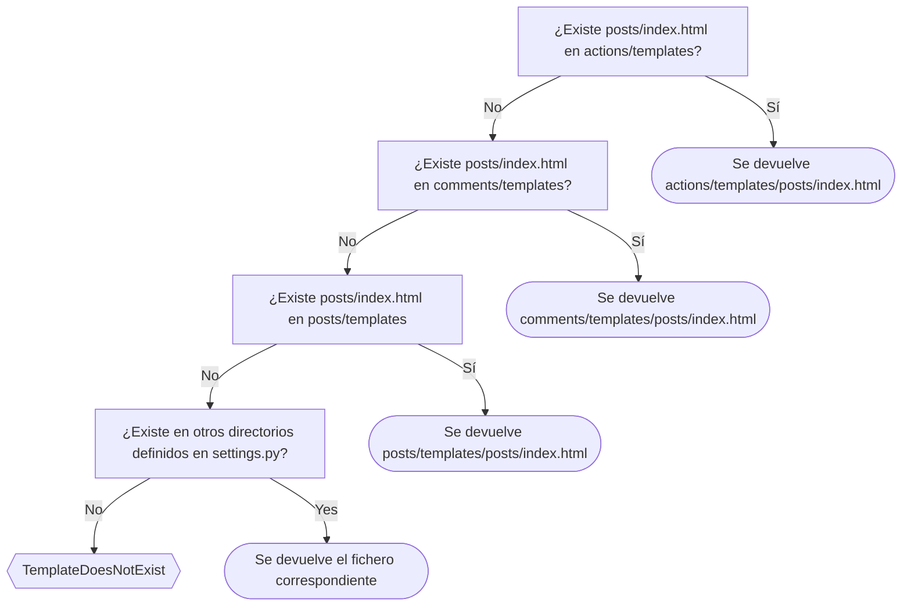
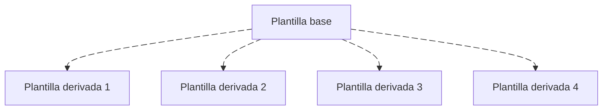

# Plantillas { #templates }

<span class="djversion basic">:simple-django: Básico :material-tag-multiple-outline:</span>

Las [plantillas en Django](https://docs.djangoproject.com/en/stable/topics/templates/) se utilizan para preparar el contenido final (habitualmente HTML) que se hará llegar al usuario de la aplicación web.

Las plantillas constituyen la **capa de presentación** del [modelo por capas](webdev.md#layer-model) visto en la introducción al desarrollo web.

!!! tip "Nombres de plantillas"

    Las plantillas son ficheros HTML cuyo nombre se escribe habitualmente en formato [`kebab-case`](https://developer.mozilla.org/en-US/docs/Glossary/Kebab_case), es decir, en **minúsculas** separados por **guiones medios**. Por <span class="example">ejemplo:material-flash:</span> `flight-departures.html`

## Ubicación { #location }

Cuando hacemos referencia a una plantilla —habitualmente desde una [vista](views.md)— mediante una ruta (relativa), Django utiliza la siguiente estrategia para localizar la plantilla indicada:

<div class="annotate" markdown>
1. Busca dentro de la carpeta `/templates` de cada [aplicación](apps.md) del proyecto.(1)
2. Busca en otras carpetas definidas explícitamente en la configuración del proyecto.(2)
</div>
1. Siempre y cuando la variable [`APP_DIRS`](https://docs.djangoproject.com/en/stable/ref/settings/#std-setting-TEMPLATES-APP_DIRS) definida en `settings.py` esté a `#!python True`:
    ```python title="main/settings.py" hl_lines="5"
    TEMPLATES = [
        {
            'BACKEND': 'django.template.backends.django.DjangoTemplates',
            'DIRS': [],
            'APP_DIRS': True,
            'OPTIONS': {
                'context_processors': [
                    'django.template.context_processors.request',
                    'django.contrib.auth.context_processors.auth',
                    'django.contrib.messages.context_processors.messages',
                ],
            },
        },
    ]
    
    ```
2. Las «otras» ubicaciones de plantillas se pueden indicar mediante la variable [`DIRS`](https://docs.djangoproject.com/en/stable/ref/settings/#std-setting-TEMPLATES-DIRS) definida en `settings.py`.

    ```python title="main/settings.py" hl_lines="4"
    TEMPLATES = [
        {
            'BACKEND': 'django.template.backends.django.DjangoTemplates',
            'DIRS': [],
            'APP_DIRS': True,
            'OPTIONS': {
                'context_processors': [
                    'django.template.context_processors.request',
                    'django.contrib.auth.context_processors.auth',
                    'django.contrib.messages.context_processors.messages',
                ],
            },
        },
    ]
    
    ```

Supongamos por <span class="example">ejemplo:material-flash:</span> que estamos en un proyecto de «blog» con las aplicaciones `actions`, `comments`, `posts`. Solicitamos a Django una plantilla con ruta `#!python 'posts/index.html'`:



:material-check-all:{ .blue } Los **espacios de nombres** son muy importantes a la hora de organizar las plantillas de nuestro proyecto Django. Ya lo dice el [Zen de Python](../../../core/introduction/python.md#zen-of-python): «Namespaces are one honking great idea -- let's do more of those!».

!!! danger "TemplateDoesNotExist"

    Uno de los errores más habituales desarrollando proyectos Django es el de [`TemplateDoesNotExist`](https://docs.djangoproject.com/en/stable/topics/templates/#django.template.TemplateDoesNotExist), que nos indica que no es posible encontrar la plantilla en la ruta indicada.

Una tabla resumen que puede aclarar distintos escenarios:

| Si queremos referenciar... | Tendremos que escribir... |
| --- | --- |
| `app1/templates/app1/test.html` | `#!python 'app1/test.html'` |
| `app2/templates/test.html` | `#!python 'test.html'` |
| `app3/templates/app3/core/test.html` | `#!python 'app3/core/test.html'` |
| `app4/templates/base/front/test.html` | `#!python 'base/front/test.html'` |

## Variables { #variables }

Para usar variables en una plantilla Django debemos rodear su nombre con **dobles llaves** `{{}}`

Por <span class="example">ejemplo:material-flash:</span> si queremos mostrar un determinado «post» de un «blog» en una plantilla, podríamos usar la siguiente plantilla:

```htmldjango title="posts/templates/posts/post/detail.html"
<h2>{{ post.title }}</h2><!--(1)!-->
<p>{{ post.content }}</p>
```
{ .annotate }

1. También podríamos haber usado directamente `{{ post }}` siempre y cuando se haya implementado convenientemente el método `#!python __str__()` de la clase `Post`.

Desde la correspondiente [vista](views.md#views-with-params), tendremos que renderizar la plantilla anterior mediante el siguiente fragmento de código:

```python title="posts/views.py"
from django.shortcuts import render


def post_detail(request, post_slug: str):
    # ...
    return render(request, 'posts/post/detail.html', {'post': post})#(1)!
```
{ .annotate }

1. En el contexto se fija el «post» que vamos a utilizar en la plantilla.

## Etiquetas { #tags }

Django proporciona una serie de [etiquetas](https://docs.djangoproject.com/en/stable/ref/templates/builtins/#built-in-tag-reference) para usar en plantillas. Estas etiquetas ofrecen distintas funcionalidades y se caracterizan por usar sintaxis ``.

A continuación veremos los distintos tipos de etiquetas de plantilla que ofrece Django.

### Bucles { #loops }

Para recorrer estructuras de datos [iterables](../../../core/modularity/oop.md#iterables) en una plantilla se usa la etiqueta [``](https://docs.djangoproject.com/en/stable/ref/templates/builtins/#for) análoga al bucle [`for`](../../../core/controlflow/loops.md#for) de Python.

Veamos un <span class="example">ejemplo:material-flash:</span> de plantilla en la que recorremos todos los «posts» de un blog:

```htmldjango title="posts/templates/posts/post/list.html"
<ul>
    <!--(1)!-->
        <li>{{ post }}</li><!--(2)!-->
    <!--(3)!-->
</ul>
```
{ .annotate }

1. En esta línea podemos usar directamente las variables sin usar doble :material-code-braces:.
2. Aquí si tenemos que acceder a la variable con doble :material-code-braces:.
3. Hay que terminar el bucle con esta sentencia.

!!! tip "`__str__()`"

    Recuerda que cuando usamos un objeto de modelo en una plantilla `#!htmldjango {{ post }}` se invoca automáticamente el método [`__str__`](../../../core/modularity/oop.md#str) del modelo.

Desde la correspondiente [vista](views.md#passing-context), tendremos que renderizar la plantilla anterior mediante el siguiente fragmento de código:

```python title="posts/views.py"
from django.shortcuts import render


def post_list(request):
    # ...
    return render(request, 'posts/post/list.html', {'posts': posts})#(1)!
```
{ .annotate }

1. En el contexto se fijan los «posts» que vamos a utilizar en la plantilla.

#### Desempaquetado { #loop-unpack }

Los bucles en plantillas Django admiten también el [desempaquetado](../../../core/datastructures/tuples.md#unpack) de secuencias tal y como se hacen en Python «tradicional».

Por <span class="example">ejemplo:material-flash:</span> con _tuplas_ representando puntos en el espacio, tendríamos:

```htmldjango hl_lines="2"
<div class="points">

    <p>{{ x }},{{ y }}</p>

</div>
```

#### Variables especiales { #loop-variables }

Cuando usamos un [bucle](../../../core/controlflow/loops.md) en una plantilla Django tenemos acceso a ciertas [variables especiales](https://docs.djangoproject.com/en/stable/ref/templates/builtins/#for) que nos pueden facilitar la lógica a implementar.

| Variable | Descripción |
| --- | --- |
| `#!htmldjango {{ forloop.counter }} ` | Iteración actual del bucle (índice :material-numeric-1-circle:) |
| `#!htmldjango {{ forloop.counter0 }}` | Iteración actual del bucle (índice :material-numeric-0-circle:) |
| `#!htmldjango {{ forloop.revcounter }}` | Número de iteraciones desde el final del bucle (índice :material-numeric-1-circle:) |
| `#!htmldjango {{ forloop.revcounter0 }}` | Número de iteraciones desde el final del bucle (índice :material-numeric-0-circle:) |
| `#!htmldjango {{ forloop.first }}` | `#!python True` si es la primera iteración del bucle. |
| `#!htmldjango {{ forloop.last }}` | `#!python True` si es la última iteración del bucle. |
| `#!htmldjango {{ forloop.parentloop }}` | Para bucles anidados, permite el acceso al bucle que engloba al bucle actual. |

Podríamos por <span class="example">ejemplo:material-flash:</span> numerar los «posts» de nuestro «blog»:

```htmldjango title="posts/templates/posts/post/list.html" hl_lines="3"
<ul>
    
        <li>{{ forloop.counter }}. {{ post }}</li>
    
</ul>
```

#### Vacío { #loop-empty }

El bucle `` admite la cláusula [``](https://docs.djangoproject.com/en/stable/ref/templates/builtins/#for-empty) que se ejecuta cuando el iterable a recorrer está vacío o no existe.

En el <span class="example">ejemplo:material-flash:</span> de los «posts» de un «blog», podríamos mostrar un mensaje en el caso de que no exisitera ningún «post»:

```htmldjango title="posts/templates/posts/post/list.html" hl_lines="4"
<ul>
    
        <li>{{ post }}</li>
    
        <p>No posts so far!</p>
    
</ul>
```

#### Ciclo { #cycle }

La etiqueta [``](https://docs.djangoproject.com/en/stable/ref/templates/builtins/#cycle) puede ser útil dentro de un bucle ya que nos permite ir «alternando» entre distintos valores.

Por <span class="example">ejemplo:material-flash:</span> imaginemos que queremos alternar el color de fondo de los distintos «posts» del «blog»:

```htmldjango title="posts/templates/posts/post/list.html" hl_lines="3"
<ul>
    
        <li style="background-color: ">
            {{ post }}
        </li>
    
</ul>
```

:material-check-all:{ .blue } Django ofrece la etiqueta [``](https://docs.djangoproject.com/en/stable/ref/templates/builtins/#resetcycle) para reiniciar un ciclo `` y que vuelva a empezar por su primer valor.

### Condicionales { #conditionals }

Django proporciona la etiqueta [``](https://docs.djangoproject.com/en/stable/ref/templates/builtins/#if) para llevar a cabo comprobaciones en el código de una plantilla. Funciona de manera análoga a la sentencia [`if`](../../../core/controlflow/conditionals.md#if) de Python.

En el siguiente <span class="example">ejemplo:material-flash:</span> se muestra un mensaje diferente para el primer «post» del «blog»:

```htmldjango title="posts/templates/posts/post/list.html" hl_lines="3 5 6 8"

    <li>
    <!--(1)!-->
        <em>{{ post }}</em>
        <strong>(Post más antiguo)</strong>
    <!--(2)!-->
        {{ post }}
    <!--(3)!-->
    </li>

```
{ .annotate }

1. Aplicamos una condición sobre el número de iteración.
2. No es obligatorio el uso de ``.
3. Hay que terminar la condición con esta sentencia.

#### Operadores { #operators }

Para construir condiciones más complejas podemos hacer uso de los mismos [operadores lógicos](../../../core/controlflow/conditionals.md#logical-operators) que en Python «tradicional»: `#!python and`, `#!python or` y `#!python not`.

Además tenemos disponibles otros operadores habituales:

|                                           Operador                                           |          Significado           |
| -------------------------------------------------------------------------------------------- | ------------------------------ |
| [`==`](https://docs.djangoproject.com/en/stable/ref/templates/builtins/#operator)            | Igualdad.                      |
| [`!=`](https://docs.djangoproject.com/en/stable/ref/templates/builtins/#id1)                 | Desigualdad.                   |
| [`<`](https://docs.djangoproject.com/en/stable/ref/templates/builtins/#id2)                  | Menor que.                     |
| [`>`](https://docs.djangoproject.com/en/stable/ref/templates/builtins/#id3)                  | Mayor que.                     |
| [`<=`](https://docs.djangoproject.com/en/stable/ref/templates/builtins/#id4)                 | Menor o igual que.             |
| [`>=`](https://docs.djangoproject.com/en/stable/ref/templates/builtins/#id5)                 | Mayor o igual que.             |
| [`in`](https://docs.djangoproject.com/en/stable/ref/templates/builtins/#in-operator)         | En una serie de valores.       |
| [`not in`](https://docs.djangoproject.com/en/stable/ref/templates/builtins/#not-in-operator) | Fuera de una serie de valores. |

!!! note "Estilo de programación"

    El código que insertamos en las plantillas también debemos cuidarlo y aplicarle las mismas reglas de estilo que si estuviéramos escribiendo un fichero puro de Python.

### URL { #url-tag }

Ya hemos visto que las [URLs definidas](urls.md#app-urls) en `urls.py` ~~pueden~~ deben disponer de un nombre que las identifique.

En una plantilla usaremos la etiqueta [``](https://docs.djangoproject.com/en/stable/ref/templates/builtins/#url) para renderizar la URL de un determinado recurso y no tener que escribirla directamente.

Como <span class="example">ejemplo:material-flash:</span> vamos a mostrar la manera de ingresar la URL de acceso a todos los «posts» del blog o a uno en concreto. Se diferencian —por tanto— estos dos casos:

=== "URL sin parámetros"

    ```htmldjango title="posts/templates/posts/post/list.html"
    <a href=""><!--(1)!-->
        Ver todos los posts
    </a>
    ```
    { .annotate }
    
    1. Al renderizar: `#!html <a href="/posts/">Ver todos los posts</a>`

=== "URL con parámetros"

    ```htmldjango title="posts/templates/posts/post/detail.html"
    <a href=""><!--(1)!-->
        {{ post.title }}
    </a>
    ```
    { .annotate }
    
    1.  - Al ser una URL con parámetro, es necesario pasar un argumento `post.slug`.
        - Al renderizar: `#!html <a href="/posts/django-is-awesome/">Django is awesome</a>`
    

### Herencia { #inheritance }

Cuando diseñamos una página web, hay ciertos componentes que son comunes a todas las «pantallas». Véase la cabecera («header»), el pie («footer») o las distintas barras de navegación («sidebar»). No parece muy razonable, reescribir estos componentes en todas las plantillas que hagamos. Siguiendo la filosofía DRY deberíamos poder «refactorizar» estas secciones y sólo añadir el contenido propio de cada página.

La herencia de plantillas se basa en definir una **plantilla base** desde la que derivamos otras plantillas. En la plantilla base ^^se definen ciertos bloques^^ que serán sobreescritos por las **plantillas derivadas**.



El elemento fundamental sobre el que trabaja la herencia es la etiqueta [``](https://docs.djangoproject.com/en/stable/ref/templates/builtins/#block). Nos permite definir un bloque (con nombre) para luego reutilizarlo en la jerarquía de plantillas.

Supongamos un <span class="example">ejemplo:material-flash:</span> en el que estamos definiendo plantillas para un «blog». Lo primero será establecer una ^^plantilla base^^:

```htmldjango title="shared/templates/base.html" hl_lines="11"
<!DOCTYPE html>
<html>
  <head>
    <meta charset="utf-8" />
    <meta name="viewport" content="width=device-width, initial-scale=1" />
    <title>{{ title }} | Blog</title><!--(1)!-->
  </head>

  <body>
    <div class="container">
        <!--(2)!-->
    </div>
  </body>
</html>
```
{ .annotate }

1.  - `#!html <title>Technology | Blog</title>` si se envía _título_ en el [contexto](views.md#passing-context) `#!python {'title': 'Technology'}` de la vista.
    - `#!html <title>Blog</title>` si no se envía _título_ en el [contexto](views.md#passing-context) `#!python {}` de la vista.

2. Se define un bloque para el contenido **propio** de la página.

!!! tip "Ubicación de la plantilla base"

    La plantilla base (raíz del proyecto) se entiende que será ^^compartida^^ por todas las aplicaciones del proyecto. Por ello, puede ser interesante crear una aplicación [`shared`](apps.md#shared) que contenga la mencionada plantilla `base.html`.

Ahora vamos a crear una ^^plantilla derivada^^ (desde esta plantilla base) que se encargue de mostrar todos los «posts» del blog:

```htmldjango title="posts/templates/posts/post/list.html" hl_lines="1 3 8"
<!--(1)!-->

<!--(2)!-->
    
        <h3>{{ post }}</h3>
        <p>Read more <a href="">here</a></p>
    

```
{ .annotate }

1.  - Extendemos de la plantilla base.
    - La sentencia `#!djangohtml ` debe ser **la primera línea** de la plantilla. En caso contrario se lanzará el siguiente error: `<ExtendsNode: extends "base.html"> must be the first tag in the template.`{ .red }
2.  - Sobreescribimos el bloque de contenido correspondiente a esta página.
    - Usar bloques sólo tiene sentido cuando estamos extendiendo de alguna plantilla base.

!!! danger "Contenido"

    Cuando estamos «heredando» de otra plantilla, todo el contenido que pongamos en la plantilla derivada debe ir dentro de algún bloque extendido. En otro caso, el contenido que quede fuera no se renderizará.

### Inclusión { #include }

Django nos permite externalizar partes de una plantilla a un fichero, para luego incluirlo desde la propia plantilla. Para ello se utiliza la etiqueta [``](https://docs.djangoproject.com/en/stable/ref/templates/builtins/#include).

Supongamos por <span class="example">ejemplo:material-flash:</span> que disponemos de la siguiente plantilla para mostrar la cabecera («header») de un «blog»:

```htmldjango title="shared/templates/header.html"
<div class="header">
    <h1>The ultimate blog</h1>
    <h2>{{ subtitle }}</h1><!--(1)!-->
</div>
```
{ .annotate }

1. Es perfectamente válido utilizar [variables](#variables) o [etiquetas](#tags) dentro de las plantillas a incluir.

Django nos ofrece **dos modos** de incluir la plantilla anterior:

=== "Inclusión directa :material-arrow-collapse:"

    Se incluye la plantilla ^^utilizando el contexto que viene desde la vista^^ en el que tendremos algo como: `#!python {'subtitle': 'Check out our last posts!'}`:

    ```htmldjango title="posts/templates/posts/post/list.html"
     
    ...
    ```

=== "Inclusión con argumentos :octicons-arrow-switch-16:"

    Se incluye la plantilla ^^utilizando los argumentos indicados^^ en la propia sentencia:

    ```htmldjango title="posts/templates/posts/post/list.html"
     
    ...
    ```

### Otras etiquetas { #misc-tags }

A continuación se muestran otras etiquetas de plantilla disponibles en Django:

=== "`comment`"

    [``](https://docs.djangoproject.com/en/stable/ref/templates/builtins/#comment) :material-arrow-right: Ignora todo lo que hay dentro del bloque de comentario y permite añadir un comentario opcional:

    ```htmldjango
    
        <p>This won't be rendered</p>
    
    ```    

=== "`debug`"

    [``](https://docs.djangoproject.com/en/stable/ref/templates/builtins/#debug) :material-arrow-right: Muestra el contexto actual pasado a la plantilla.

    ```htmldjango
    
    ```    

=== "`firstof`"

    [``](https://docs.djangoproject.com/en/stable/ref/templates/builtins/#firstof) :material-arrow-right: Muestra el primer argumento que no evalúe a `#!python False`:

    ```htmldjango
    <!--(1)!-->
    ```    
    { .annotate }
    
    1. Equivale a:
        ```htmldjango
        
            {{ var1 }}
        
            {{ var2 }}
        
            {{ var3 }}
        
        ```

=== "`lorem`"

    [``](https://docs.djangoproject.com/en/stable/ref/templates/builtins/#lorem) :material-arrow-right: Muestra contenido [«lorem ipsum»](https://www.lipsum.com/) aleatorio. Útil para rellenar datos en plantillas:

    ```htmldjango
    <!--(1)!-->
    <!--(2)!-->
    <!--(3)!-->
    ```
    { .annotate }
    
    1. Muestra el habitual párrafo «lorem ipsum».
    2. Muestra 20 palabras en Latín.
    3. Muestra 3 párrafos en Latín.

=== "`now`"

    [``](https://docs.djangoproject.com/en/stable/ref/templates/builtins/#now) :material-arrow-right: Muestra la fecha/hora actual (requiere [modificadores de formato](https://docs.djangoproject.com/en/stable/ref/templates/builtins/#std-templatefilter-date)):

    ```htmldjango
    <!--(1)!-->
    <!--(2)!-->
    <!--(3)!-->
    ```
    { .annotate }
    
    1. `2025-10-04T10:56:23.668338`
    2. `04-10-2025`
    3. `Friday Oct/4/25`

=== "`spaceless`"

    [``](https://docs.djangoproject.com/en/stable/ref/templates/builtins/#spaceless) :material-arrow-right: Elimina los espacios en blanco entre etiquetas HTML:

    ```htmldjango
    <!--(1)!-->
        <p>
            <a href="posts/">Post list</a>
        </p>
    
    ```
    { .annotate }
    
    1. Genera: `#!htmldjango <p><a href="posts/">Post List</a></p>`

=== "`verbatim`"

    [``](https://docs.djangoproject.com/en/stable/ref/templates/builtins/#verbatim) :material-arrow-right: El contenido incluido dentro de este bloque no será renderizado por Django:

    ```htmldjango
    
        <p>This won't be {{ var }} rendered</p>
    
    ```

### Etiquetas personalizadas { #custom-tags }

<span class="djversion advanced">:simple-django: Avanzado :material-tag-multiple-outline:</span>

Django permite crear [etiquetas personalizadas](https://docs.djangoproject.com/en/stable/howto/custom-template-tags/#writing-custom-template-tags) más allá de las predefinidas («built-in»).

Aunque hay otros tipos, el caso de uso más habitual de una etiqueta personalizada es la de incluir una plantilla que requiere de cierto procesamiento previo. Es lo que Django denomina [«inclusion tags»](https://docs.djangoproject.com/en/stable/howto/custom-template-tags/#inclusion-tags) (_etiquetas de inclusión_).

Supongamos un <span class="example">ejemplo:material-flash:</span> en el que queremos crear una etiqueta personalizada para listar todos los «posts» de nuestro «blog» que superen una determinada valoración.

El **modelo** del que partimos es el siguiente:

```python title="posts/models.py"
from django.db import models


class Post(models.Model):
    title = models.CharField(max_length=256)
    content = models.TextField(max_length=256)
    rating = models.FloatField(default=0)

    def __str__(self):
        return self.title
```

Empezaremos por crear la **plantilla** que vamos a renderizar:

```htmldjango title="posts/templates/posts/includes/list.html"

    <h1>{{ post.title }}</h1>
    <p>{{ post.content }}</p>

```

A continuación definimos la **etiqueta**:

```python title="posts/templatetags/post_extras.py"
from django import template
from posts.models import Post

register = template.Library()


@register.inclusion_tag('posts/includes/list.html')#(1)!
def post_list(min_rating: int = 0):#(2)!
    posts = Post.objects.filter(rating__gte=min_rating)#(3)!
    return {'posts': posts}#(4)!
```
{ .annotate }

1.  - Es necesario registrar la etiqueta usando el decorador `@register`.
    - En este tipo de etiquetas se define la plantilla que se va a renderizar.
    - El argumento `#!python takes_context=True` haría que dispusiéramos del parámetro `context` en `post_list()` para acceder al contexto de la petición.
2.  - Esta etiqueta recibe un único parámetro que indica el mínimo «rating» a filtrar.
    - Las etiquetas personalizadas admiten cualquier número de parámetros.
3. Consulta de los «posts» que cumplen la condición.
4. Debemos retornar un _diccionario_ que se convertirá en el **contexto** para renderizar la plantilla.

!!! warning "Ubicación de las etiquetas"

    Las etiquetas personalizadas deben ubicarse en una carpeta `templatetags` dentro de la aplicación correspondiente.
    
    Es «habitual» que si la aplicación se llama `foos` (por <span class="example">ejemplo:material-flash:</span>) las etiquetas personalizadas estén en `foo/templatetags/foo_extras.py` (_aunque el nombre del módulo es arbritrario_).

Lo que nos quedaría es utilizar la etiqueta creada en alguna plantilla:

```htmldjango title="posts/templates/posts/index.html" hl_lines="1 4"
<!--(1)!-->

<div class="posts">
    <!--(2)!-->
</div>
```
{ .annotate }

1. Para poder utilizar la etiqueta debemos cargar el módulo en cuestión.
2. Dado que `min_rating` tiene un valor por defecto, podríamos usar la etiqueta sin argumentos: `#!htmldjango ` (si queremos todos los «posts»).

??? tip "Argumentos nominales"

    <!-- Enlace a argumentos nominales y posicionales -->
    Nada impide que pasemos **argumentos nominales**(1) a nuestra etiqueta personalizada. Eso sí, igual que en el resto de funciones Python, los argumentos nominales deben proporcionarse después de los argumentos posicionales.
    { .annotate }
    
    1. Por <span class="example">ejemplo:material-flash:</span> :material-arrow-right-box: `#!htmldjango `

## Filtros { #filters }

Django nos proporciona una enorme cantidad de [filtros](https://docs.djangoproject.com/en/stable/ref/templates/builtins/#built-in-filter-reference) para utilizar en plantillas. Estos filtros ofrecen funcionalidades muy interesantes dependiendo del contexto que queramos abordar.

Hay dos tipos de filtros:

1. Aquellos que ^^no^^ admiten argumentos, cuya sintaxis es: `#!python {{ value|filter }}`
2. Aquellos que ^^sí^^ admiten argumentos, cuya sintaxis es: `#!python {{ value|filter:"argument" }}`

En la siguiente tabla se muestran todos los filtros de plantilla que ofrece Django clasificados por el ^^tipo de dato^^ que manejan:

=== "Cadena de texto"

    | Filtro | Ejemplo | Descripción |
    | --- | --- | --- |
    | [`addslashes`](https://docs.djangoproject.com/en/stable/ref/templates/builtins/#addslashes) | `value = "I'm Guido"` :material-arrow-down-right:<br>`#!htmldjango {{ value|addslashes }}`<br>:material-arrow-right-bottom: `"I\'m Guido"`| Añade barra invertida antes de las comillas. |
    | [`capfirst`](https://docs.djangoproject.com/en/stable/ref/templates/builtins/#capfirst) | `value = 'django'` :material-arrow-down-right:<br>`#!htmldjango {{ value|capfirst }}`<br>:material-arrow-right-bottom: `'Django'`| Pasa a mayúsculas el primer caracter del valor. |
    | [`center`](https://docs.djangoproject.com/en/stable/ref/templates/builtins/#center) | `value = 'Django'` :material-arrow-down-right:<br>`#!htmldjango {{ value|center:"15" }}`<br>:material-arrow-right-bottom: `'     Django    '`| Centra el valor indicado en el número de caracteres dado, añadiendo espacios antes y después. |
    | [`cut`](https://docs.djangoproject.com/en/stable/ref/templates/builtins/#cut) | `value = 'Django-jango'` :material-arrow-down-right:<br>`#!htmldjango {{ value|cut:"j" }}`<br>:material-arrow-right-bottom: `'Dango-ango'`| Elimina el carácter indicado. |
    | [`escape`](https://docs.djangoproject.com/en/stable/ref/templates/builtins/#escape) | `value = '<h1>Django</h1>'` :material-arrow-down-right:<br>`#!htmldjango {{ value|escape }}`<br>:material-arrow-right-bottom: `'&lt;h1&gt;Django&lt;/h1&gt;'`| Escapa el contenido HTML.<br>Variantes: [`escapejs`](https://docs.djangoproject.com/en/stable/ref/templates/builtins/#escapejs) y [`force_escape`](https://docs.djangoproject.com/en/stable/ref/templates/builtins/#force-escape). |
    | [`iriencode`](https://docs.djangoproject.com/en/stable/ref/templates/builtins/#iriencode) | `value = '?test=I ♥ Django'` :material-arrow-down-right:<br>`#!htmldjango {{ value|iriencode }}`<br>:material-arrow-right-bottom: `'?test=I%20%E2%99%A5%20Django'`| Convierte una IRI en una cadena de texto lista para ser incluida en una URL. |
    | [`json_script`](https://docs.djangoproject.com/en/stable/ref/templates/builtins/#json-script) | `value = {'hello': 'django'}` :material-arrow-down-right:<br>`#!htmldjango {{ value|json_script:"greet" }}`<br>:material-arrow-right-bottom: `'<script id="greet" type="application/json">{"hello": "django"}</script>'`| Convierte un objeto Python a un JSON dentro de una etiqueta `#!html <script>`. |
    | [`linebreaks`](https://docs.djangoproject.com/en/stable/ref/templates/builtins/#linebreaks) | `value = 'Django is\nawesome'` :material-arrow-down-right:<br>`#!htmldjango {{ value|linebreaks }}`<br>:material-arrow-right-bottom: `'<p>Django is<br>awesome</p>'`| Reemplaza los saltos de línea por el correspondiente HTML. |
    | [`linebreaksbr`](https://docs.djangoproject.com/en/stable/ref/templates/builtins/#linebreaksbr) | `value = 'Django is\nawesome` :material-arrow-down-right:<br>`#!htmldjango {{ value|linebreaksbr }}`<br>:material-arrow-right-bottom: `'Django is<br>awesome'`| Reemplaza los saltos de línea por HTML `<br>`. |
    | [`linenumbers`](https://docs.djangoproject.com/en/stable/ref/templates/builtins/#linenumbers) | `value = 'Django\nis\nawesome` :material-arrow-down-right:<br>`#!htmldjango {{ value|linenumbers }}`<br>:material-arrow-right-bottom: `'1. Django\n2. is\n3. awesome'`| Añade números de línea. |
    | [`ljust`](https://docs.djangoproject.com/en/stable/ref/templates/builtins/#ljust) | `value = 'Django'` :material-arrow-down-right:<br>`#!htmldjango {{ value|ljust:"10" }}`<br>:material-arrow-right-bottom: `'Django    '`| Justifica a la izquierda rellenando con espacios a la derecha la cantidad indicada. |
    | [`lower`](https://docs.djangoproject.com/en/stable/ref/templates/builtins/#lower) | `value = 'DJANGO IS AWESOME'` :material-arrow-down-right:<br>`#!htmldjango {{ value|lower }}`<br>:material-arrow-right-bottom: `'django is awesome'`| Pasa el valor a minúsculas. |
    | [`make_list`](https://docs.djangoproject.com/en/stable/ref/templates/builtins/#make-list) | `value = 'django'` :material-arrow-down-right:<br>`#!htmldjango {{ value|make_list }}`<br>:material-arrow-right-bottom: `['d', 'j', 'a', 'n', 'g', 'o']`| Convierte el argumento a una lista. |
    | [`phone2numeric`](https://docs.djangoproject.com/en/stable/ref/templates/builtins/#phone2numeric) | `value = '800-COLLECT'` :material-arrow-down-right:<br>`#!htmldjango {{ value|phone2numeric }}`<br>:material-arrow-right-bottom: `'800-2655328'` | Convierte un número de teléfono (posiblemente con letras) a su equivalente numérico. |
    | [`pluralize`](https://docs.djangoproject.com/en/stable/ref/templates/builtins/#pluralize) | `value = 2` :material-arrow-down-right:<br>`#!htmldjango message{{ value|pluralize }}`<br>:material-arrow-right-bottom: `'messages'` | Devuelve un sufijo plural cuando el valor es mayor que 1. Se puede especificar el sufijo como argumento. |
    | [`pprint`](https://docs.djangoproject.com/en/stable/ref/templates/builtins/#pprint) | `value = 'something to debug'` :material-arrow-down-right:<br>`#!htmldjango message{{ value|pprint }}`<br>:material-arrow-right-bottom: `'something nice to debug'` | Hace una llamada a [`pprint.pprint`](https://docs.python.org/3/library/pprint.html#pprint.pprint). Principalmente para depuración. |
    | [`rjust`](https://docs.djangoproject.com/en/stable/ref/templates/builtins/#rjust) | `value = 'Django'` :material-arrow-down-right:<br>`#!htmldjango {{ value|rjust:"10" }}`<br>:material-arrow-right-bottom: `'    Django'`| Justifica a la derecha rellenando con espacios a la izquierda la cantidad indicada. |
    | [`safe`](https://docs.djangoproject.com/en/stable/ref/templates/builtins/#safe) | `value = '<h1>Django</h1>'` :material-arrow-down-right:<br>`#!htmldjango {{ value|safe }}`<br>:material-arrow-right-bottom: `'<h1>Django</h1>'`| Marca una cadena de texto como HTML seguro listo para mostrar en la página. |
    | [`slugify`](https://docs.djangoproject.com/en/stable/ref/templates/builtins/#slugify) | `value = 'Become a slug!'` :material-arrow-down-right:<br>`#!htmldjango {{ value|slugify }}`<br>:material-arrow-right-bottom: `'become-a-slug'` | Devuelve el valor convertido a un «slug». |
    | [`striptags`](https://docs.djangoproject.com/en/stable/ref/templates/builtins/#striptags) | `value = '<h1>Django</h1>'` :material-arrow-down-right:<br>`#!htmldjango {{ value|striptags }}`<br>:material-arrow-right-bottom: `'Django'` | Elimina las etiquetas HTML encontradas. |
    | [`title`](https://docs.djangoproject.com/en/stable/ref/templates/builtins/#title) | `value = 'django is awesome'` :material-arrow-down-right:<br>`#!htmldjango {{ value|title }}`<br>:material-arrow-right-bottom: `'Django Is Awesome'` | Pasa el valor a título. |
    | [`truncatechars`](https://docs.djangoproject.com/en/stable/ref/templates/builtins/#truncatechars) | `value = 'Welcome to our flight to Python World'` :material-arrow-down-right:<br>`#!htmldjango {{ value|truncatechars:7 }}`<br>:material-arrow-right-bottom: `'Welcome...'` | Trunca el valor al número de caracteres indicados como argumento. |
    | [`truncatechars_html`](https://docs.djangoproject.com/en/stable/ref/templates/builtins/#truncatechars-html) | `value = '<p>Welcome to our flight to Python World</p>'` :material-arrow-down-right:<br>`#!htmldjango {{ value|truncatechars_html:7 }}`<br>:material-arrow-right-bottom: `'<p>Welcome...</p>'` | Trunca el valor al número de caracteres indicados como argumento, respetando las etiquetas HTML. |
    | [`truncatewords`](https://docs.djangoproject.com/en/stable/ref/templates/builtins/#truncatewords) | `value = 'Welcome to our flight to Python World'` :material-arrow-down-right:<br>`#!htmldjango {{ value|truncatewords:4 }}`<br>:material-arrow-right-bottom: `'Welcome to our flight...'` | Trunca el valor al número de palabras indicadas como argumento. |
    | [`truncatewords_html`](https://docs.djangoproject.com/en/stable/ref/templates/builtins/#truncatewords-html) | `value = '<p>Welcome to our flight to Python World</p>'` :material-arrow-down-right:<br>`#!htmldjango {{ value|truncatewords_html:4 }}`<br>:material-arrow-right-bottom: `'<p>Welcome to our flight...</p>'` | Trunca el valor al número de palabras indicadas como argumento, respetando las etiquetas HTML. |
    | [`upper`](https://docs.djangoproject.com/en/stable/ref/templates/builtins/#upper) | `value = 'django is awesome'` :material-arrow-down-right:<br>`#!htmldjango {{ value|upper }}`<br>:material-arrow-right-bottom: `'DJANGO IS AWESOME'` | Pasa el valor a mayúsculas. |
    | [`urlencode`](https://docs.djangoproject.com/en/stable/ref/templates/builtins/#urlencode) | `value = 'https://django.com/query?a=b&c=d'` :material-arrow-down-right:<br>`#!htmldjango {{ value|urlencode }}`<br>:material-arrow-right-bottom: `'https://django.com/query%3Fa%3Db%26c%3Dd'` | Escapa un valor para usarlo en una URL. |
    | [`urlize`](https://docs.djangoproject.com/en/stable/ref/templates/builtins/#urlize) | `value = 'Check out https://python.org'` :material-arrow-down-right:<br>`#!htmldjango {{ value|urlize }}`<br>:material-arrow-right-bottom: `'Check out <a href="https://python.org">python.org</a>'` | Convierte el argumento a un enlace HTML. |
    | [`urlizetrunc`](https://docs.djangoproject.com/en/stable/ref/templates/builtins/#urlizetrunc) | `value = 'Check out https://python.org'` :material-arrow-down-right:<br>`#!htmldjango {{ value|urlizetrunc:2 }}`<br>:material-arrow-right-bottom: `'Check out <a href="https://python.org">py...</a>'` | Convierte el argumento a un enlace HTML (truncando la longitud indicada). |
    | [`wordcount`](https://docs.djangoproject.com/en/stable/ref/templates/builtins/#wordcount) | `value = 'Django is awesome!'` :material-arrow-down-right:<br>`#!htmldjango {{ value|wordcount }}`<br>:material-arrow-right-bottom: `3` | Devuelve el número de palabras del valor. |
    | [`wordwrap`](https://docs.djangoproject.com/en/stable/ref/templates/builtins/#wordwrap) | `value = 'Django is awesome'` :material-arrow-down-right:<br>`#!htmldjango {{ value|wordwrap:6 }}`<br>:material-arrow-right-bottom: `Django\nis\nawesome` | Incluye saltos de línea con palabras del tamaño indicado. |

=== "Lista"

    | Filtro | Ejemplo | Descripción |
    | --- | --- | --- |
    | [`escapeseq`](https://docs.djangoproject.com/en/stable/ref/templates/builtins/#escapeseq) | `value = ['<p>', '<h1>']` :material-arrow-down-right:<br>`#!htmldjango {{ value|escapeseq }}`<br>:material-arrow-right-bottom: `['&lt;p&gt;', '&lt;h1&gt;']`| Aplica el filtro [`escape`](https://docs.djangoproject.com/en/stable/ref/templates/builtins/#escape) a cada elemento de la lista. |
    | [`first`](https://docs.djangoproject.com/en/stable/ref/templates/builtins/#first) | `value = [6, 4, 8]` :material-arrow-down-right:<br>`#!htmldjango {{ value|first }}`<br>:material-arrow-right-bottom: `6`| Devuelve el primer elemento de una lista. |
    | [`join`](https://docs.djangoproject.com/en/stable/ref/templates/builtins/#join) | `value = ['x', 'y', 'z']` :material-arrow-down-right:<br>`#!htmldjango {{ value|join:"|" }}`<br>:material-arrow-right-bottom: `'x|y|z'`| Une la lista utilizando el argumento dado. |
    | [`last`](https://docs.djangoproject.com/en/stable/ref/templates/builtins/#last) | `value = [6, 4, 8]` :material-arrow-down-right:<br>`#!htmldjango {{ value|last }}`<br>:material-arrow-right-bottom: `8`| Devuelve el último elemento de una lista. |
    | [`length`](https://docs.djangoproject.com/en/stable/ref/templates/builtins/#length) | `value = ['a', 'b', 'c']` :material-arrow-down-right:<br>`#!htmldjango {{ value|length }}`<br>:material-arrow-right-bottom: `3`| Devuelve la longitud del valor (`list` o `str`). |
    | [`random`](https://docs.djangoproject.com/en/stable/ref/templates/builtins/#pluralize) | `value = [6, 4, 8]` :material-arrow-down-right:<br>`#!htmldjango {{ value|random }}`<br>:material-arrow-right-bottom: `4` | Devuelve un elemento aleatoria de la lista dada. |
    | [`slice`](https://docs.djangoproject.com/en/stable/ref/templates/builtins/#slice) | `value = [9, 3, 7, 2]` :material-arrow-down-right:<br>`#!htmldjango {{ value|slice:":2" }}`<br>:material-arrow-right-bottom: `[9, 3]` | Devuelve un troceado de la lista en índice :material-numeric-0-circle:. |
    | [`safeseq`](https://docs.djangoproject.com/en/stable/ref/templates/builtins/#safeseq) | `value = ['<p>', '<h1>']` :material-arrow-down-right:<br>`#!htmldjango {{ value|escapeseq }}`<br>:material-arrow-right-bottom: `['<p>', '<h1>']`| Aplica el filtro [`safe`](https://docs.djangoproject.com/en/stable/ref/templates/builtins/#safe) a cada elemento de la lista. |
    | [`unordered_list`](https://docs.djangoproject.com/en/stable/ref/templates/builtins/#unordered-list) | `value = ['A', ['B', 'C']]` :material-arrow-down-right:<br>`#!htmldjango {{ value|unordered_list }}`<br>:material-arrow-right-bottom: `'<li>A<ul><li>B</li><li>C</li></ul></li>'`| Convierte una lista anidada en una lista no ordenada HTML. |

=== "Número"

    | Filtro | Ejemplo | Descripción |
    | --- | --- | --- |
    | [`add`](https://docs.djangoproject.com/en/stable/ref/templates/builtins/#add) | `value = 5` :material-arrow-down-right:<br>`#!htmldjango {{ value|add:"2" }}`<br>:material-arrow-right-bottom: `7`| Suma el argumento al valor. |
    | [`divisibleby`](https://docs.djangoproject.com/en/stable/ref/templates/builtins/#divisiblebly) | `value = 15` :material-arrow-down-right:<br>`#!htmldjango {{ value|divisibleby:"5" }}`<br>:material-arrow-right-bottom: `True`| Devuelve `#!python True` si el valor es divisible por el argumento o `#!python False` en otro caso. |
    | [`filesizeformat`](https://docs.djangoproject.com/en/stable/ref/templates/builtins/#filesizeformat) | `value = 123456789` :material-arrow-down-right:<br>`#!htmldjango {{ value|filesizeformat }}`<br>:material-arrow-right-bottom: `'117.7 MB'`| Formatea el valor como un tamaño de fichero legible por un humano. |
    | [`get_digit`](https://docs.djangoproject.com/en/stable/ref/templates/builtins/#get-digit) | `value = 123456789` :material-arrow-down-right:<br>`#!htmldjango {{ value|get_digit:"2" }}`<br>:material-arrow-right-bottom: `8`| Devuelve el dígito que ocupa la posición del argumento indicado (empezando por la derecha) en índice :material-numeric-1-circle:. |
    | [`stringformat`](https://docs.djangoproject.com/en/stable/ref/templates/builtins/#stringformat) | `value = '3.141516'` :material-arrow-down-right:<br>`#!htmldjango {{ value|stringformat:".3f" }}`<br>:material-arrow-right-bottom: `'3.142'` | Formatea el valor de acuerdo a la especificación del argumento. |

=== "Fecha/Hora"

    | Filtro | Ejemplo | Descripción |
    | --- | --- | --- |
    | [`date`](https://docs.djangoproject.com/en/stable/ref/templates/builtins/#date) | `value = datetime.date(2024, 10, 17)` :material-arrow-down-right:<br>`#!htmldjango {{ value|date:"d/m/Y" }}`<br>:material-arrow-right-bottom: `'17/10/2024'`| Formatea un objeto de tipo fecha. |
    | [`time`](https://docs.djangoproject.com/en/stable/ref/templates/builtins/#time) | `value = datetime.now()` :material-arrow-down-right:<br>`#!htmldjango {{ value|time:"H:i" }}`<br>:material-arrow-right-bottom: `'04:32'` | Formatea un objeto de tipo hora. |
    | [`timesince`](https://docs.djangoproject.com/en/stable/ref/templates/builtins/#timesince) | `value = datetime.datetime()` :material-arrow-down-right:<br>`#!htmldjango {{ value|timesince }}`<br>:material-arrow-right-bottom: `'4 days, 6 hours'` | Indica en formato «humano» el tiempo que ha pasado desde el valor indicado.<br>Se puede especificar como argumento otro momento de comparación distinto a ^^ahora^^. |
    | [`timeuntil`](https://docs.djangoproject.com/en/stable/ref/templates/builtins/#timeuntil) | `value = datetime.datetime()` :material-arrow-down-right:<br>`#!htmldjango {{ value|timeuntil }}`<br>:material-arrow-right-bottom: `'6 days, 4 hours'` | Indica en formato «humano» el tiempo que falta hasta el valor indicado.<br>Se puede especificar como argumento otro momento de comparación distinto a ^^ahora^^. |
    
=== "Booleano"

    | Filtro | Ejemplo | Descripción |
    | --- | --- | --- |
    | [`default`](https://docs.djangoproject.com/en/stable/ref/templates/builtins/#default) | `value = None` :material-arrow-down-right:<br>`#!htmldjango {{ value|default:"empty" }}`<br>:material-arrow-right-bottom: `'empty'`| Si el valor evalúa a `#!python False` muestra el argumento indicado. |
    | [`default_if_none`](https://docs.djangoproject.com/en/stable/ref/templates/builtins/#default-if-none) | `value = None` :material-arrow-down-right:<br>`#!htmldjango {{ value|default_if_none:"nothing" }}`<br>:material-arrow-right-bottom: `'nothing'`| Si (y solo si) el valor es `#!python None` muestra el argumento indicado. |
    | [`yesno`](https://docs.djangoproject.com/en/stable/ref/templates/builtins/#yesno) | `value = 1` :material-arrow-down-right:<br>`#!htmldjango {{ value|yesno:"good,bad,regular"' }}`<br>:material-arrow-right-bottom: `'good'` | :octicons-dot-24: Si el valor es `#!python True` se devuelve el primer argumento.<br>:octicons-dot-24: Si el valor es `#!python False` se devuelve el segundo argumento.<br>:octicons-dot-24: Si el valor es `#!python None` se devuelve el tercer argumento (opcional). |
    
=== "Diccionario"

    | Filtro | Ejemplo | Descripción |
    | --- | --- | --- |
    | [`dictsort`](https://docs.djangoproject.com/en/stable/ref/templates/builtins/#dictsort) | `value = [{'name': 'Carry', 'age': 32}, {'name': 'Mike', 'age': 21}]` :material-arrow-down-right:<br>`#!htmldjango {{ value|dictsort:"age" }}`<br>:material-arrow-right-bottom: `[{'name': 'Mike', 'age': 21}, {'name: 'Carry', age: 32}]`| Ordena una lista de diccionarios por la clave indicada en el argumento. |
    | [`dictsortreversed`](https://docs.djangoproject.com/en/stable/ref/templates/builtins/#dictsortreversed) | `value = [{'name': 'Carry', 'age': 32}, {'name': 'Mike', 'age': 21}]` :material-arrow-down-right:<br>`#!htmldjango {{ value|dictsortreversed:"age" }}`<br>:material-arrow-right-bottom: `[{'name: 'Carry', age: 32}, {'name': 'Mike', 'age': 21}]`| Ordena una lista de diccionarios (de forma inversa/descendente) por la clave indicada en el argumento. |
    
### Filtros personalizados { #custom-filters }

<span class="djversion advanced">:simple-django: Avanzado :material-tag-multiple-outline:</span>

Django permite crear [filtros personalizados](https://docs.djangoproject.com/en/stable/howto/custom-template-tags/#writing-custom-template-filters) más allá de los predefinidos («built-in»).

A diferencia de las [etiquetas](#custom-tags) los filtros reciben **uno o dos argumentos**. El primer argumento es el valor de la variable a la que aplicamos el filtro y el segundo argumento es opcional y permite modificar el comportamiento predefinido.

A continuación planteamos un <span class="example">ejemplo:material-flash:</span> en el que se crea un filtro personalizado para calcular el tamaño de un «post» en función de varias métricas:

```python title="posts/templatetags/post_extras.py"
from django import template
from posts.models import Post

register = template.Library()


@register.filter#(1)!
def post_size(post: Post, metric: str = 'by-words') -> int:#(2)!
    match metric:
        case 'by-words':
            size = len(w for w in post.content.split())
        case 'by-chars':
            size = len(post.content)
        case _:
            size = 0
    return size#(3)!
```
{ .annotate }

1.  - Es necesario registrar el filtro usando el decorador `@register`.
    - Es posible pasar un parámetro `name` (como `#!python str`) al decorador para indicar el nombre del filtro. Si no se pasa, el nombre del filtro será el nombre de la función. Por <span class="example">ejemplo:material-flash:</span> :material-arrow-right-box: `#!python @register.filter(name='psize')`
2. Los parámetros, en este caso son:
    - «Post» sobre el que vamos a calcular el tamaño.
    - Tipo de métrica:
        - `#!python 'by-words'` para contar el número de palabras.
        - `#!python 'by-chars'` para contar el número de caracteres.
    - La función (filtro) devuelve un número entero.
3. Retornamos el tamaño calculado según la _lógica de negocio_ correspondiente.

!!! warning "Ubicación de los filtros"

    Los filtros personalizadas deben ubicarse en una carpeta `templatetags` dentro de la aplicación correspondiente.
    
    Es «habitual» que si la aplicación se llama `foos` (por <span class="example">ejemplo:material-flash:</span>) los filtros personalizados estén en `foo/templatetags/foo_extras.py` (_aunque el nombre del módulo es arbritrario_).

Lo que nos quedaría es utilizar el filtro creado en alguna plantilla:

```htmldjango title="posts/templates/posts/index.html" hl_lines="1 6"
<!--(1)!-->

<div class="posts">
    
        <div class="post">
            {{ post|post_size }}<!--(2)!-->
        </div>
    
</div>
```
{ .annotate }

1. Para poder utilizar el filtro debemos cargar el módulo en cuestión.
2.  - La variable `post` se pasa como primer argumento. En este caso no hay segundo argumento.
    - Si quisiéramos una métrica por caracteres, podríamos haber escrito: `#!htmldjango {{ post|post_size:"by-chars" }}`

??? example "Múltiples argumentos"

    Si se diera el caso de necesitar **desarrollar alguna funcionalidad en plantilla con más de dos argumentos** y que su comportamiento fuera «similar» al de un filtro personalizado, Django ofrece la posibilidad de implementar [etiquetas personalizadas simples](https://docs.djangoproject.com/en/stable/howto/custom-template-tags/#django.template.Library.simple_tag).

## Procesadores de contexto { #context-processors }

<span class="djversion advanced">:simple-django: Avanzado :material-tag-multiple-outline:</span>

La explicación de que en las plantillas tengamos acceso a los datos de depuración, a la petición HTTP, a la autenticación o a los mensajes, es que existen unos artefactos llamados [procesadores de contexto](https://docs.djangoproject.com/en/stable/ref/templates/api/#using-requestcontext) que se encargan de **inyectar cierta información** en el contexto de la plantilla.

Estos _procesadores de contexto_ se indican en el fichero de configuración del proyecto, y por defecto toma los siguientes valores:

```python title="main/settings.py" hl_lines="7-12"
TEMPLATES = [
    {
        'BACKEND': 'django.template.backends.django.DjangoTemplates',
        'DIRS': [],
        'APP_DIRS': True,
        'OPTIONS': {
            'context_processors': [
                'django.template.context_processors.debug',
                'django.template.context_processors.request',
                'django.contrib.auth.context_processors.auth',
                'django.contrib.messages.context_processors.messages',
            ],
        },
    },
]
```

### Procesadores de contexto personalizados { #custom-context-processors }

Django permite escribir nuestros [propios procesadores de contexto](https://docs.djangoproject.com/en/stable/ref/templates/api/#writing-your-own-context-processors) con el objetivo de inyectar en «todas» las plantillas ciertos datos comunes.

Planteamos un <span class="example">ejemplo:material-flash:</span> en el que estamos diseñando un «blog» y queremos tener acceso en todo momento al último «post» que se ha publicado.

Un _procesador de contexto_ no es más que una función que vive en algún lugar (aplicación) de nuestro proyecto:

```python title="posts/context_processors.py"
from posts.models import Post


def last_post(request) -> dict:#(1)!
    try:
        return {'last_post': Post.objects.last()}#(2)!
    except Post.DoesNotExist:
        return {}#(3)!
```
{ .annotate }

1.  - Función que actúa como procesador de contexto.
    - Siempre recibe `request` (petición HTTP).
    - Siempre devuelve un **diccionario**.
2.  - Lógica del procesador de contexto.
    - En este caso se busca el último «post» de la base de datos.
    - Se devuelve un diccionario.
    - El objeto `last_post` estará disponible en **todas las plantillas** de forma automática.
3. En caso de errores se devuelve el diccionario vacío.

Para que Django «conozca» la existencia de este procesador de contexto debemos indicar su ^^ruta completa^^ en el fichero `settings.py` del proyecto:

```python title="main/settings.py" hl_lines="12"
TEMPLATES = [
    {
        'BACKEND': 'django.template.backends.django.DjangoTemplates',
        'DIRS': [],
        'APP_DIRS': True,
        'OPTIONS': {
            'context_processors': [
                'django.template.context_processors.debug',
                'django.template.context_processors.request',
                'django.contrib.auth.context_processors.auth',
                'django.contrib.messages.context_processors.messages',
                'posts.context_processors.last_post',
            ],
        },
    },
]
```

De esta forma, en **todas las plantillas** del proyecto tendremos disponible el objeto `last_post` con el último «post» publicado en el «blog»:

```htmldjango
{{ last_post }}
```
