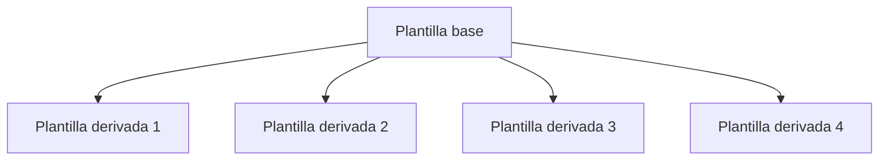

# Plantillas { #templates }

<span class="djversion basic">:simple-django: Básico :material-tag-multiple-outline:</span>

Las plantillas en Django se utilizan para preparar el contenido final (habitualmente HTML) que se hará llegar al usuario de la aplicación web.

## Ubicación { #location }

Las plantillas «deberían» estar ubicadas en la carpeta `templates` de cada [aplicación](apps.md) del proyecto. Cuando hacemos referencia a una plantilla (habitualmente desde una [vista](views.md)) usamos una ruta.

Por <span class="example">ejemplo:material-flash:</span> si queremos obtener la plantilla de inicio de un «blog» usamos: `#!python 'blog/home.html'`. Django irá a buscar esta plantilla a: `blog/templates/blog/home.html`.

Si la referencia desde la vista es `#!python 'base.html'` Django irá a buscar esta plantilla a: `blog/templates/base.html`, pero además intentará encontrarla en cualquier otra aplicación instalada en el proyecto: `shop/templates/base.html`, `docs/templates/base.html`, etc. Por lo tanto devolverá aquel fichero `base.html` que **encuentre primero** en la [estructura de aplicaciones](apps.md#installation) del proyecto.

:material-check-all:{ .blue } Por lo tanto los **espacios de nombres** también son importantes a la hora de organizar las plantillas de nuestro proyecto Django.

## Variables { #variables }

Para usar variables en una plantilla Django debemos añadir **dobles llaves** :material-code-braces: antes y después de la variable.

Por <span class="example">ejemplo:material-flash:</span> si queremos mostrar un determinado «post» de un «blog» en una plantilla, usamos la siguiente plantilla:

```htmldjango title="posts/templates/posts/post_detail.html"
<h1>{{ post.title }}</h1><!--(1)!-->
<p>{{ post.content }}</p>
```
{ .annotate }

1. También podríamos haber usado directamente `{{ post }}` siempre y cuando se haya implementado convenientemente el método `#!python __str__()` de la clase `Post`.

Desde la correspondiente vista, tendremos que renderizar la plantilla anterior usando lo siguiente:

```python
from django.shortcuts import render

def post_detail(request):
    # ...
    return render('posts/post_detail.html', {'post': post})#(1)!
```
{ .annotate }

1. En el contexto se fija el «post» que vamos a utilizar en la plantilla.

!!! tip "`__str__()`"

    Recuerda que cuando usamos un objeto de modelo en una plantilla `#!htmldjango {{ post }}` se invoca automáticamente el método `#!python post.__str__()` del modelo.

## Etiquetas { #tags }

Django proporciona una serie de [etiquetas](https://docs.djangoproject.com/en/stable/ref/templates/builtins/#built-in-tag-reference) para usar en plantillas. Estas etiquetas ofrecen distintas funcionalidades y se caracterizan por usar sintaxis `` y necesitan una sentencia de cierre.

### Bucles { #loops }

Para recorrer estructuras de datos en una plantilla se usa la etiqueta [``](https://docs.djangoproject.com/en/stable/ref/templates/builtins/#for) análoga al bucle `for` de Python.

Veamos un <span class="example">ejemplo:material-flash:</span> de plantilla en la que recorremos todos los «posts» de un blog:

```htmldjango title="posts/templates/posts/post_list.html"
<ul>
    <!--(1)!-->
        <li>{{ post }}</li><!--(2)!-->
    <!--(3)!-->
</ul>
```
{ .annotate }

1. En esta línea podemos usar directamente las variables sin usar doble :material-code-braces:.
2. Aquí si tenemos que acceder a la variable con doble :material-code-braces:.
3. Hay que terminar el bucle con esta sentencia.

#### Desempaquetado { #loop-unpacking }

Los bucles en plantillas Django admiten también el desempaquetado de secuencias tal y como se hacen en Python.

Por <span class="example">ejemplo:material-flash:</span>:

```htmldjango hl_lines="2"
<div class="points">

    <p>{{ x }},{{ y }}</p>

</div>
```

#### Variables especiales { #loop-variables }

Cuando usamos un bucle en una plantilla Django tenemos acceso a ciertas **variables especiales** que nos pueden facilitar la lógica a implementar.

| Variable | Descripción |
| --- | --- |
| `forloop.counter` | Iteración actual del bucle (índice :material-numeric-1-circle:) |
| `forloop.counter0` | Iteración actual del bucle (índice :material-numeric-0-circle:) |
| `forloop.revcounter` | Número de iteraciones desde el final del bucle (índice :material-numeric-1-circle:) |
| `forloop.revcounter0` | Número de iteraciones desde el final del bucle (índice :material-numeric-0-circle:) |
| `forloop.first` | `#!python True` si es la primera iteración del bucle. |
| `forloop.last` | `#!python True` si es la última iteración del bucle. |
| `forloop.parentloop` | Para bucles anidados, permite el acceso al bucle que engloba al bucle actual. |

#### Vacío { #loop-empty }

El bucle `` admite la cláusula [``](https://docs.djangoproject.com/en/stable/ref/templates/builtins/#for-empty) que se ejecuta cuando el iterable a recorrer está vacío o no existe.

En el <span class="example">ejemplo:material-flash:</span> de los «posts» de un «blog», podríamos mostrar un mensaje en el caso de que no exisitera ningún «post»:

```htmldjango title="posts/templates/posts/post_list.html" hl_lines="4"
<ul>
    
        <li>{{ post }}</li>
    
        <p>No posts so far!</p>
    
</ul>
```

### Condicionales { #conditionals }

Django proporciona la etiqueta [``](https://docs.djangoproject.com/en/stable/ref/templates/builtins/#if) para llevar a cabo comprobaciones en el código de una plantilla. Funciona de manera a la sentencia `if` de Python.

En el siguiente <span class="example">ejemplo:material-flash:</span> mostramos un indicativo en función del número de visitas que tiene el «post» de un «blog»:

```htmldjango title="posts/templates/posts/post_detail.html"
<span class=
<!--(1)!-->
    "highlight">Interesting!
<!--(2)!-->
    "regular">Not bad
<!--(3)!-->
</span>
```
{ .annotate }

1. Aplicamos una condición sobre el número de visitas del «post».
2. No siempre hace falta usar sentencia ``.
3. Hay que terminar la condición con esta sentencia.

#### Operadores { #operators }

Para enriquecer las condiciones en plantillas, podemos hacer uso de ciertos [operadores](https://docs.djangoproject.com/en/stable/ref/templates/builtins/#boolean-operators) que ofrece Django:

| Operador | Significado |
| --- | --- |
| `#!python and` | «Y» lógico. |
| `#!python or` | «O» lógico. |
| `#!python not` | «No» lógico. |
| `#!python ==` | Igualdad. |
| `#!python !=` | Desigualdad. |
| `#!python <` | Menor que. |
| `#!python >` | Mayor que. |
| `#!python <=` | Menor o igual que. |
| `#!python >=` | Mayor o igual que. |
| `#!python in` | En una serie de valores. |
| `#!python not in` | Fuera de una serie de valores. |

!!! note "Estilo de programación"

    El código que insertamos en las plantillas también debemos cuidarlo y aplicarle las mismas reglas de estilo que si estuviéramos escribiendo un fichero puro de Python.

### Herencia { #inheritance }

Cuando diseñamos una página web, hay ciertos componentes que son comunes a todas las «pantallas». Véase la cabecera, el pie o las distintas barras de navegación. No parece muy razonable, reescribir estos componentes en todas las plantillas que hagamos. Siguiendo la filosofía DRY deberíamos poder «refactorizar» estas secciones y sólo añadir el contenido propio de cada página.

La herencia de plantillas se basa en definir una **plantilla base** desde la que derivamos otras plantillas. En la plantilla base ^^se definen ciertos bloques^^ que serán sobreescritos por las **plantillas derivadas**.



El elemento fundamental sobre el que trabaja la herencia es la etiqueta [``](https://docs.djangoproject.com/en/stable/ref/templates/builtins/#block). Nos permite definir un bloque para luego reutilizarlo en la jerarquía de plantillas.

Supongamos un <span class="example">ejemplo:material-flash:</span> en el que estamos definiendo plantillas para un «blog». Lo primero será establecer una ^^plantilla base^^:

```htmldjango title="shared/templates/base.html" hl_lines="11"
<!DOCTYPE html>
<html>
  <head>
    <meta charset="utf-8" />
    <meta name="viewport" content="width=device-width, initial-scale=1" />
    <title>{{ title }} | Blog</title>
  </head>

  <body>
    <div class="container">
        <!--(1)!-->
    </div>
  </body>
</html>
```
{ .annotate }

1. Se define un bloque para el contenido **propio** de la página.

Ahora vamos a definir una ^^plantilla derivada^^ que se encargue de mostrar todos los «posts» del blog:

```htmldjango hl_lines="1 5"
<!--(1)!-->

<!--(2)!-->
    
        <h3>{{ post }}</h3>
        <p>Read more <a href="">here</a></p>
    

```
{ .annotate }

1. Extendemos de la plantilla base.
2.  - Sobreescribimos el bloque de contenido correspondiente a esta página.
    - Usar bloques sólo tiene sentido cuando estamos extendiendo de alguna plantilla base.

!!! tip "Ubicación de la plantilla base"

    La plantilla base (raíz del proyecto) se entiende que será ^^compartida^^ por todas las aplicaciones del proyecto. Por ello, puede ser interesante crear una aplicación [`shared`](apps.md#shared) que contenga la mencionada plantilla `base.html`.

### Inclusión { #include }

Django nos permite externalizar partes de una plantilla a un fichero, para luego incluirlo desde la propia plantilla. Para ello se utiliza la etiqueta [``](https://docs.djangoproject.com/en/stable/ref/templates/builtins/#include).

Supongamos por <span class="example">ejemplo:material-flash:</span> que disponemos de la siguiente plantilla para mostrar la cabecera de un «blog»:

```htmldjango title="shared/templates/header.html"
<div class="header">
    <h1>The ultimate blog</h1>
    <h2>{{ subtitle }}</h1>
</div>
```

Django nos ofrece **dos modos** de incluir la plantilla anterior:

=== "Inclusión directa :material-arrow-collapse:"

    Se incluye la plantilla ^^utilizando el contexto que viene desde la vista^^ en el que tendremos algo como: `#!python {'subtitle': 'Check out our last posts!'}`:

    ```htmldjango
     
    ...
    ```

=== "Inclusión con argumentos :octicons-arrow-switch-16:"

    Se incluye la plantilla ^^utilizando los argumentos indicados^^ en la propia sentencia:

    ```htmldjango
     
    ...
    ```

### Etiquetas personalizadas { #custom-tags }

<span class="djversion advanced">:simple-django: Avanzado :material-tag-multiple-outline:</span>

Django permite crear [etiquetas personalizadas](https://docs.djangoproject.com/en/stable/howto/custom-template-tags/#writing-custom-template-tags) más allá de las predefinidas («built-in»).

Aunque hay otros tipos, el caso de uso más habitual de una etiqueta personalizada es la de incluir una plantilla que requiere de cierto procesamiento previo. Es lo que Django denomina [«inclusion tags»](https://docs.djangoproject.com/en/stable/howto/custom-template-tags/#inclusion-tags) (_etiquetas de inclusión_).

Supongamos un <span class="example">ejemplo:material-flash:</span> en el que queremos crear una etiqueta personalizada para listar todos los «posts» de nuestro «blog» que superen una determinada valoración.

El **modelo** del que partimos es el siguiente:

```python title="posts/models.py"
from django.db import models


class Post(models.Model):
    title = models.CharField(max_length=256)
    content = models.TextField(max_length=256)
    rating = models.FloatField(default=0)

    def __str__(self):
        return self.title
```

Empezaremos por crear la **plantilla** que vamos a renderizar:

```htmldjango title="posts/templates/posts/includes/list.html"

    <h1>{{ post.title }}</h1>
    <p>{{ post.content }}</p>

```

A continuación definimos la **etiqueta**:

```python title="posts/templatetags/post_extras.py"
from django import template
from posts.models import Post

register = template.Library()


@register.inclusion_tag('posts/includes/list.html')#(1)!
def post_list(min_rating: int = 0):#(2)!
    posts = Post.objects.filter(rating__gte=min_rating)#(3)!
    return {'posts': posts}#(4)!
```
{ .annotate }

1.  - Es necesario registrar la etiqueta usando el decorador `@register`.
    - En este tipo de etiquetas se define la plantilla que se va a renderizar.
    - El argumento `#!python takes_context=True` haría que dispusiéramos del parámetro `context` en `post_list()` para acceder al contexto de la petición.
2.  - Esta etiqueta recibe un único parámetro que indica el mínimo «rating» a filtrar.
    - Las etiquetas personalizadas admiten cualquier número de parámetros.
3. Consulta de los «posts» que cumplen la condición.
4. Debemos retornar un _diccionario_ que se convertirá en el **contexto** para renderizar la plantilla.

!!! warning "Ubicación de las etiquetas"

    Las etiquetas personalizadas deben ubicarse en una carpeta `templatetags` dentro de la aplicación correspondiente.
    
    Es «habitual» que si la aplicación se llama `foos` (por <span class="example">ejemplo:material-flash:</span>) las etiquetas personalizadas estén en `foo/templatetags/foo_extras.py` (_aunque el nombre del módulo es arbritrario_).

Lo que nos quedaría es utilizar la etiqueta creada en alguna plantilla:

```htmldjango title="posts/templates/posts/index.html" hl_lines="1 4"
<!--(1)!-->

<div class="posts">
    <!--(2)!-->
</div>
```
{ .annotate }

1. Para poder utilizar la etiqueta debemos cargar el módulo en cuestión.
2. Dado que `min_rating` tiene un valor por defecto, podríamos usar la etiqueta sin argumentos: `#!htmldjango ` (si queremos todos los «posts»).

??? tip "Argumentos nominales"

    <!-- Enlace a argumentos nominales y posicionales -->
    Nada impide que pasemos **argumentos nominales**(1) a nuestra etiqueta personalizada. Eso sí, igual que en el resto de funciones Python, los argumentos nominales deben proporcionarse después de los argumentos posicionales.
    { .annotate }
    
    1. Por <span class="example">ejemplo:material-flash:</span> :material-arrow-right-box: `#!htmldjango `

## Filtros { #filters }

Django nos proporciona una gran cantidad de [filtros](https://docs.djangoproject.com/en/stable/ref/templates/builtins/#built-in-filter-reference) para trabajar con plantillas. Estos filtros ofrecen funcionalidades muy interesantes dependiendo del contexto que queramos abordar.

Hay dos tipos de filtros:

1. Aquellos que ^^no^^ admiten argumentos, cuya sintaxis es: `#!python {{ value|filter }}`
2. Aquellos que ^^sí^^ admiten argumentos, cuya sintaxis es: `#!python {{ value|filter:"argument" }}`

En la siguiente tabla se muestran los filtros de plantilla más destacados:

| Filtro | Ejemplo | Descripción |
| --- | --- | --- |
| [`add`](https://docs.djangoproject.com/en/stable/ref/templates/builtins/#add) | `value = 5` :material-arrow-down-right:<br>`#!htmldjango {{ value|add:"2" }}`<br>:material-arrow-right-bottom: `7`| Suma el argumento al valor. |
| [`capfirst`](https://docs.djangoproject.com/en/stable/ref/templates/builtins/#capfirst) | `value = 'django'` :material-arrow-down-right:<br>`#!htmldjango {{ value|capfirst }}`<br>:material-arrow-right-bottom: `'Django'`| Pasa a mayúsculas el primer caracter del valor. |
| [`date`](https://docs.djangoproject.com/en/stable/ref/templates/builtins/#date) | `value = datetime.date(2024, 10, 17)` :material-arrow-down-right:<br>`#!htmldjango {{ value|date:"d/m/Y" }}`<br>:material-arrow-right-bottom: `'17/10/2024'`| Formatea un objeto de tipo fecha. |
| [`default`](https://docs.djangoproject.com/en/stable/ref/templates/builtins/#default) | `value = None` :material-arrow-down-right:<br>`#!htmldjango {{ value|default:"empty" }}`<br>:material-arrow-right-bottom: `'empty'`| Si el valor evalúa a `#!python False` muestra el argumento indicado. |
| [`dictsort`](https://docs.djangoproject.com/en/stable/ref/templates/builtins/#dictsort) | `value = [{'name': 'Carry', 'age': 32}, {'name': 'Mike', 'age': 21}]` :material-arrow-down-right:<br>`#!htmldjango {{ value|dictsort:"age" }}`<br>:material-arrow-right-bottom: `[{'name': 'Mike', 'age': 21}, {'name: 'Carry', age: 32}]`| Ordena una lista de diccionarios por la clave indicada en el argumento. |
| [`divisibleby`](https://docs.djangoproject.com/en/stable/ref/templates/builtins/#divisiblebly) | `value = 15` :material-arrow-down-right:<br>`#!htmldjango {{ value|divisibleby:"5" }}`<br>:material-arrow-right-bottom: `True`| Devuelve `#!python True` si el valor es divisible por el argumento. |
| [`filesizeformat`](https://docs.djangoproject.com/en/stable/ref/templates/builtins/#filesizeformat) | `value = 123456789` :material-arrow-down-right:<br>`#!htmldjango {{ value|filesizeformat }}`<br>:material-arrow-right-bottom: `'117.7 MB'`| Formatea el valor como un tamaño de fichero legible por un humano. |
| [`first`](https://docs.djangoproject.com/en/stable/ref/templates/builtins/#first) | `value = [6, 4, 8]` :material-arrow-down-right:<br>`#!htmldjango {{ value|first }}`<br>:material-arrow-right-bottom: `6`| Devuelve el primer elemento de una lista. |
| [`get_digit`](https://docs.djangoproject.com/en/stable/ref/templates/builtins/#get-digit) | `value = 123456789` :material-arrow-down-right:<br>`#!htmldjango {{ value|get_digit:"2" }}`<br>:material-arrow-right-bottom: `8`| Devuelve el dígito que ocupa la posición del argumento indicado (empezando por la derecha) en índice :material-numeric-1-circle:. |
| [`join`](https://docs.djangoproject.com/en/stable/ref/templates/builtins/#join) | `value = ['x', 'y', 'z']` :material-arrow-down-right:<br>`#!htmldjango {{ value|join:"|" }}`<br>:material-arrow-right-bottom: `'x|y|z'`| Une la lista utilizando el argumento dado. |
| [`last`](https://docs.djangoproject.com/en/stable/ref/templates/builtins/#last) | `value = [6, 4, 8]` :material-arrow-down-right:<br>`#!htmldjango {{ value|last }}`<br>:material-arrow-right-bottom: `8`| Devuelve el último elemento de una lista. |
| [`length`](https://docs.djangoproject.com/en/stable/ref/templates/builtins/#length) | `value = ['a', 'b', 'c']` :material-arrow-down-right:<br>`#!htmldjango {{ value|length }}`<br>:material-arrow-right-bottom: `3`| Devuelve la longitud del valor (`list` o `str`). |
| [`linebreaks`](https://docs.djangoproject.com/en/stable/ref/templates/builtins/#linebreaks) | `value = 'Django is\nawesome` :material-arrow-down-right:<br>`#!htmldjango {{ value|linebreaks }}`<br>:material-arrow-right-bottom: `'<p>Django is<br>awesome</p>'`| Reemplaza los saltos de línea por el correspondiente HTML. |
| [`linebreaksbr`](https://docs.djangoproject.com/en/stable/ref/templates/builtins/#linebreaksbr) | `value = 'Django is\nawesome` :material-arrow-down-right:<br>`#!htmldjango {{ value|linebreaksbr }}`<br>:material-arrow-right-bottom: `'Django is<br>awesome'`| Reemplaza los saltos de línea por HTML `<br>`. |
| [`lower`](https://docs.djangoproject.com/en/stable/ref/templates/builtins/#lower) | `value = 'DJANGO IS AWESOME'` :material-arrow-down-right:<br>`#!htmldjango {{ value|lower }}`<br>:material-arrow-right-bottom: `'django is awesome'`| Pasa el valor a minúsculas. |
| [`pluralize`](https://docs.djangoproject.com/en/stable/ref/templates/builtins/#pluralize) | `value = 2` :material-arrow-down-right:<br>`#!htmldjango {{ value|pluralize }}`<br>:material-arrow-right-bottom: `'s'` | Devuelve un sufijo plural cuando el valor es mayor que 1. Se puede especificar el sufijo como argumento. |
| [`random`](https://docs.djangoproject.com/en/stable/ref/templates/builtins/#pluralize) | `value = [6, 4, 8]` :material-arrow-down-right:<br>`#!htmldjango {{ value|random }}`<br>:material-arrow-right-bottom: `4` | Devuelve un elemento aleatoria de la lista dada. |
| [`slice`](https://docs.djangoproject.com/en/stable/ref/templates/builtins/#slice) | `value = [9, 3, 7, 2]` :material-arrow-down-right:<br>`#!htmldjango {{ value|slice:":2" }}`<br>:material-arrow-right-bottom: `[9, 3]` | Devuelve un troceado de la lista en índice :material-numeric-0-circle:. |
| [`slugify`](https://docs.djangoproject.com/en/stable/ref/templates/builtins/#slugify) | `value = 'Become a slug!'` :material-arrow-down-right:<br>`#!htmldjango {{ value|slugify }}`<br>:material-arrow-right-bottom: `'become-a-slug'` | Devuelve el valor convertido a un «slug». |
| [`stringformat`](https://docs.djangoproject.com/en/stable/ref/templates/builtins/#stringformat) | `value = '3.141516'` :material-arrow-down-right:<br>`#!htmldjango {{ value|stringformat:".3f" }}`<br>:material-arrow-right-bottom: `'3.142'` | Formatea el valor de acuerdo a la especificación del argumento. |
| [`time`](https://docs.djangoproject.com/en/stable/ref/templates/builtins/#time) | `value = datetime.now()` :material-arrow-down-right:<br>`#!htmldjango {{ value|time:"H:i" }}`<br>:material-arrow-right-bottom: `'04:32'` | Formatea un objeto de tipo hora. |
| [`timesince`](https://docs.djangoproject.com/en/stable/ref/templates/builtins/#timesince) | `value = datetime.datetime()` :material-arrow-down-right:<br>`#!htmldjango {{ value|timesince }}`<br>:material-arrow-right-bottom: `'4 days, 6 hours'` | Indica en formato «humano» el tiempo que ha pasado desde el valor indicado.<br>Se puede especificar como argumento otro momento de comparación distinto a ^^ahora^^. |
| [`timeuntil`](https://docs.djangoproject.com/en/stable/ref/templates/builtins/#timeuntil) | `value = datetime.datetime()` :material-arrow-down-right:<br>`#!htmldjango {{ value|timeuntil }}`<br>:material-arrow-right-bottom: `'6 days, 4 hours'` | Indica en formato «humano» el tiempo que falta hasta el valor indicado.<br>Se puede especificar como argumento otro momento de comparación distinto a ^^ahora^^. |
| [`title`](https://docs.djangoproject.com/en/stable/ref/templates/builtins/#title) | `value = 'django is awesome'` :material-arrow-down-right:<br>`#!htmldjango {{ value|title }}`<br>:material-arrow-right-bottom: `'Django Is Awesome'` | Pasa el valor a título. |
| [`truncatechars`](https://docs.djangoproject.com/en/stable/ref/templates/builtins/#truncatechars) | `value = 'Welcome to our flight to Python World'` :material-arrow-down-right:<br>`#!htmldjango {{ value|truncatechars:7 }}`<br>:material-arrow-right-bottom: `'Welcome...'` | Trunca el valor al número de caracteres indicados como argumento. |
| [`truncatechars_html`](https://docs.djangoproject.com/en/stable/ref/templates/builtins/#truncatechars-html) | `value = '<p>Welcome to our flight to Python World</p>'` :material-arrow-down-right:<br>`#!htmldjango {{ value|truncatechars_html:7 }}`<br>:material-arrow-right-bottom: `'<p>Welcome...</p>'` | Trunca el valor al número de caracteres indicados como argumento, respetando las etiquetas HTML. |
| [`truncatewords`](https://docs.djangoproject.com/en/stable/ref/templates/builtins/#truncatewords) | `value = 'Welcome to our flight to Python World'` :material-arrow-down-right:<br>`#!htmldjango {{ value|truncatewords:4 }}`<br>:material-arrow-right-bottom: `'Welcome to our flight...'` | Trunca el valor al número de palabras indicadas como argumento. |
| [`truncatewords_html`](https://docs.djangoproject.com/en/stable/ref/templates/builtins/#truncatewords-html) | `value = '<p>Welcome to our flight to Python World</p>'` :material-arrow-down-right:<br>`#!htmldjango {{ value|truncatewords_html:4 }}`<br>:material-arrow-right-bottom: `'<p>Welcome to our flight...</p>'` | Trunca el valor al número de palabras indicadas como argumento, respetando las etiquetas HTML. |
| [`upper`](https://docs.djangoproject.com/en/stable/ref/templates/builtins/#upper) | `value = 'django is awesome'` :material-arrow-down-right:<br>`#!htmldjango {{ value|upper }}`<br>:material-arrow-right-bottom: `'DJANGO IS AWESOME'` | Pasa el valor a mayúsculas. |
| [`urlize`](https://docs.djangoproject.com/en/stable/ref/templates/builtins/#urlize) | `value = 'Check out https://python.org'` :material-arrow-down-right:<br>`#!htmldjango {{ value|urlize }}`<br>:material-arrow-right-bottom: `'Check out <a href="https://python.org">python.org</a>'` | Convierte el argumento a un enlace HTML. |
| [`wordcount`](https://docs.djangoproject.com/en/stable/ref/templates/builtins/#wordcount) | `value = 'Django is awesome!'` :material-arrow-down-right:<br>`#!htmldjango {{ value|wordcount }}`<br>:material-arrow-right-bottom: `3` | Devuelve el número de palabras del valor. |
| [`yesno`](https://docs.djangoproject.com/en/stable/ref/templates/builtins/#yesno) | `value = 1` :material-arrow-down-right:<br>`#!htmldjango {{ value|yesno:"good,bad,regular"' }}`<br>:material-arrow-right-bottom: `'good'` | :octicons-dot-24: Si el valor es `#!python True` se devuelve el primer argumento.<br>:octicons-dot-24: Si el valor es `#!python False` se devuelve el segundo argumento.<br>:octicons-dot-24: Si el valor es `#!python None` se devuelve el tercer argumento (opcional). |

### Filtros personalizados { #custom-filters }

<span class="djversion advanced">:simple-django: Avanzado :material-tag-multiple-outline:</span>

Django permite crear [filtros personalizados](https://docs.djangoproject.com/en/stable/howto/custom-template-tags/#writing-custom-template-filters) más allá de los predefinidos («built-in»).

A diferencia de las [etiquetas](#custom-tags) los filtros reciben **uno o dos argumentos**. El primer argumento es el valor de la variable a la que aplicamos el filtro y el segundo argumento es opcional y permite modificar el comportamiento predefinido.

A continuación planteamos un <span class="example">ejemplo:material-flash:</span> en el que se crea un filtro personalizado para calcular el tamaño de un «post» en función de varias métricas:

```python title="posts/templatetags/post_extras.py"
from django import template
from posts.models import Post

register = template.Library()


@register.filter#(1)!
def post_size(post: Post, metric: str = 'by-words') -> int:#(2)!
    match metric:
        case 'by-words':
            size = len(w for w in post.content.split())
        case 'by-chars':
            size = len(post.content)
        case _:
            size = 0
    return size#(3)!
```
{ .annotate }

1.  - Es necesario registrar el filtro usando el decorador `@register`.
    - Es posible pasar un parámetro `name` (como `#!python str`) al decorador para indicar el nombre del filtro. Si no se pasa, el nombre del filtro será el nombre de la función. Por <span class="example">ejemplo:material-flash:</span> :material-arrow-right-box: `#!python @register.filter(name='psize')`
2. Los parámetros, en este caso son:
    - «Post» sobre el que vamos a calcular el tamaño.
    - Tipo de métrica:
        - `#!python 'by-words'` para contar el número de palabras.
        - `#!python 'by-chars'` para contar el número de caracteres.
    - La función (filtro) devuelve un número entero.
3. Retornamos el tamaño calculado según la _lógica de negocio_ correspondiente.

!!! warning "Ubicación de los filtros"

    Los filtros personalizadas deben ubicarse en una carpeta `templatetags` dentro de la aplicación correspondiente.
    
    Es «habitual» que si la aplicación se llama `foos` (por <span class="example">ejemplo:material-flash:</span>) los filtros personalizados estén en `foo/templatetags/foo_extras.py` (_aunque el nombre del módulo es arbritrario_).

Lo que nos quedaría es utilizar el filtro creado en alguna plantilla:

```htmldjango title="posts/templates/posts/index.html" hl_lines="1 6"
<!--(1)!-->

<div class="posts">
    
        <div class="post">
            {{ post|post_size }}<!--(2)!-->
        </div>
    
</div>
```
{ .annotate }

1. Para poder utilizar el filtro debemos cargar el módulo en cuestión.
2.  - La variable `post` se pasa como primer argumento. En este caso no hay segundo argumento.
    - Si quisiéramos una métrica por caracteres, podríamos haber escrito: `#!htmldjango {{ post|post_size:"by-chars" }}`

??? example "Múltiples argumentos"

    Si se diera el caso de necesitar **desarrollar alguna funcionalidad en plantilla con más de dos argumentos** y que su comportamiento fuera «similar» al de un filtro personalizado, Django ofrece la posibilidad de implementar [etiquetas personalizadas simples](https://docs.djangoproject.com/en/stable/howto/custom-template-tags/#django.template.Library.simple_tag).

## Procesadores de contexto { #context-processors }

<span class="djversion advanced">:simple-django: Avanzado :material-tag-multiple-outline:</span>

La explicación de que en las plantillas tengamos acceso a los datos de depuración, a la petición HTTP, a la autenticación o a los mensajes, es que existen unos artefactos llamados [procesadores de contexto](https://docs.djangoproject.com/en/stable/ref/templates/api/#using-requestcontext) que se encargan de **inyectar cierta información** en el contexto de la plantilla.

Estos _procesadores de contexto_ se indican en el fichero de configuración del proyecto, y por defecto toma los siguientes valores:

```python title="main/settings.py" hl_lines="7-12"
TEMPLATES = [
    {
        'BACKEND': 'django.template.backends.django.DjangoTemplates',
        'DIRS': [],
        'APP_DIRS': True,
        'OPTIONS': {
            'context_processors': [
                'django.template.context_processors.debug',
                'django.template.context_processors.request',
                'django.contrib.auth.context_processors.auth',
                'django.contrib.messages.context_processors.messages',
            ],
        },
    },
]
```

### Procesadores de contexto personalizados { #custom-context-processors }

Django permite escribir nuestros [propios procesadores de contexto](https://docs.djangoproject.com/en/stable/ref/templates/api/#writing-your-own-context-processors) con el objetivo de inyectar en «todas» las plantillas ciertos datos comunes.

Planteamos un <span class="example">ejemplo:material-flash:</span> en el que estamos diseñando un «blog» y queremos tener acceso en todo momento al último «post» que se ha publicado.

Un _procesador de contexto_ no es más que una función que vive en algún lugar (aplicación) de nuestro proyecto:

```python title="posts/context_processors.py"
from posts.models import Post


def last_post(request) -> dict:#(1)!
    try:
        return {'last_post': Post.objects.last()}#(2)!
    except Post.DoesNotExist:
        return {}#(3)!
```
{ .annotate }

1.  - Función que actúa como procesador de contexto.
    - Siempre recibe `request` (petición HTTP).
    - Siempre devuelve un **diccionario**.
2.  - Lógica del procesador de contexto.
    - En este caso se busca el último «post» de la base de datos.
    - Se devuelve un diccionario.
    - El objeto `last_post` estará disponible en **todas las plantillas** de forma automática.
3. En caso de errores se devuelve el diccionario vacío.

Para que Django «conozca» la existencia de este procesador de contexto debemos indicar su ^^ruta completa^^ en el fichero `settings.py` del proyecto:

```python title="main/settings.py" hl_lines="12"
TEMPLATES = [
    {
        'BACKEND': 'django.template.backends.django.DjangoTemplates',
        'DIRS': [],
        'APP_DIRS': True,
        'OPTIONS': {
            'context_processors': [
                'django.template.context_processors.debug',
                'django.template.context_processors.request',
                'django.contrib.auth.context_processors.auth',
                'django.contrib.messages.context_processors.messages',
                'posts.context_processors.last_post',
            ],
        },
    },
]
```

De esta forma, en **todas las plantillas** del proyecto tendremos disponible el objeto `last_post` con el último «post» publicado en el «blog»:

```htmldjango
{{ last_post }}
```
