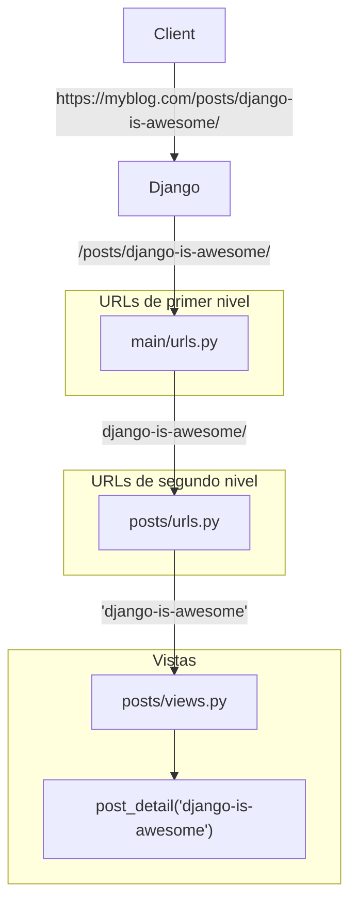

# URLs { #urls }

<span class="djversion basic">:simple-django: Básico :material-tag-multiple-outline:</span>

Cuando Django recibe una petición HTTP lo primero que hace es intentar encontrar el patrón que coincide con la URL solicitada:



En esta sección veremos cómo configurar estos patrones para lanzar las acciones oportunas.

## URLs de primer nivel { #main-urls }

Si hemos [creado el proyecto](setup.md#create-project) Django con la carpeta base `main` podremos encontrar las **URLs de primer nivel** en el fichero `main/urls.py`.

El contenido (por defecto) de este fichero es el siguiente:

```python title="main/urls.py"
from django.contrib import admin#(1)!
from django.urls import path#(2)!


urlpatterns = [#(3)!
    path('admin/', admin.site.urls),#(4)!
]
```
{ .annotate }

1. Este módulo contiene las funcionalidades de la interfaz administrativa de Django.
2. Esta función nos permite definir las rutas URL correspondientes.
3. Las URLs deben almacenarse en una **lista** con nombre **`urlpatterns`**.
4.  - Cada URL viene definida por la función [path](https://docs.djangoproject.com/en/stable/ref/urls/#path) que vincula (en general) una ruta con una vista.
    - En este caso se indica que si la URL de entrada es `/admin/` se pase el control al módulo [admin.site.urls](https://github.com/django/django/blob/main/django/contrib/admin/sites.py#L324).

## URLs de segundo nivel { #app-urls }

Cada aplicación en un proyecto Django puede tener sus propias URLs que definen el comportamiento de la misma.

Supongamos por <span class="example">ejemplo:material-flash:</span> que estamos desarrollando una aplicación llamada `posts` y queremos que las siguientes URLs cobren vida:

<div class="annotate" markdown>
- `/posts/`#(1)!
- `/posts/this-is-a-new-post/`#(2)!
</div>
1. Listado de todos los «posts» del «blog».
2. Detalle de un «post» en concreto con el slug `this-is-a-new-post`.

Lo primero será modificar el fichero de configuración de las [URLs de primer nivel](#main-urls) para añadir la delegación a la aplicación correspondiente:

```python title="main/urls.py" hl_lines="2 7"
from django.contrib import admin
from django.urls import include, path


urlpatterns = [
    path('admin/', admin.site.urls),
    path('posts/', include('posts.urls'))#(2)!
]
```
{ .annotate }

1. Importamos la función `include()`.
2.  - Indicamos que las URLs que comiencen por `/posts/` deben delegarse a las URLs de segundo nivel que están en `posts/urls.py`.
    - Las urls se especifican usando una cadena de texto «cualificada».
    - Cabe la posibilidad de especificar un argumento `namespace` para sobreescribir el valor asignado a `app_name` (`urls.py`).

!!! warning "Barra final"

    Para evitar problemas, recuerda siempre acabar las URLs con la barra `/` del final.  
    Por <span class="example">ejemplo:material-flash:</span> `#!python 'comments/'` en vez de `#!python 'comments`

Ahora ya podemos definir las **URLs de segundo nivel** en la aplicación `posts` **creando** el fichero `posts/urls.py` con el siguiente contenido:

```python title="posts/urls.py"
from django.urls import path

from . import views


app_name = 'posts'#(1)!

urlpatterns = [
    path('', views.post_list, name='post-list'),#(2)!
    path('<slug:post_slug>/', views.post_detail, name='post-detail'),#(3)!
]
```
{ .annotate }

1. La variable `app_name` define el **espacio de nombres** de las URLs de cada aplicación.
2. Analicemos cada parámetro de la función `path` por separado:
    1. `#!python ''` :material-arrow-right-box: Si concatenamos `/posts/` con la cadena vacía, obtenemos que la URL resultante es: `/posts/`
    2. `#!python views.post_list` :material-arrow-right-box: vista que se lanzará si la URL casa con este patrón.
    3. `#!python name='post-list'` :material-arrow-right-box: nombre de la URL, que unido al espacio de nombres, lo identifican unívocamente en todo el proyecto. Por tanto será: `posts:post-list`.
3. Analicemos cada parámetro de la función `path` por separado:
    1. `#!python '<post_slug>'` :material-arrow-right-box: El uso de ángulos nos indica que se trata de un **parámetro variable**. Casa con cualquier entrada. Si concatenamos `/posts/` con `<post_slug>` obtenemos que la URL resultante es `/posts/this-is-a-new-post/`
    2. `#!python views.post_detail` :material-arrow-right-box: vista que se lanzará si la URL casa con este patrón.
    3. `#!python name='post-detail'` :material-arrow-right-box: nombre de la URL, que unido al espacio de nombres, lo identifican unívocamente en todo el proyecto. Por tanto será: `posts:post-detail`.

!!! tip "Nombres de URLs"

    Es habitual usar «slugs» en los nombres de URLs. Es decir, cuando utilizamos el parámetro `name` de la función `path`. En vez de `#!python name='post_list'` suele ser de buen estilo escribir `#!python name='post-list'`.

### Agrupar URLs

En el caso de tener distintos patrones de URLs en un mismo fichero `urls.py` se aconseja agrupar los patrones por similitud.

Un pequeño <span class="example">ejemplo:material-flash:</span> en el que se plantea este escenario:

=== "Peor :octicons-thumbsdown-16:"

    ```python title="urls.py"
    urlpatterns = [
        path('shop/', ...),
        path('api/', ...),
        path('shop/product/{int:product_pk}/', ...),
        path('api/apparel/{int:product_pk}/', ...),
        path('shop/purchase/{slug:article_slug}/', ...),
        path('api/goods/{slug:good_slug}/', ...),
    ]
    ```

=== "Mejor :octicons-thumbsup-16:"

    ```python title="urls.py"
    urlpatterns = [
        path('api/', ...),
        path('api/apparel/{int:product_pk}/', ...),
        path('api/goods/{slug:good_slug}/', ...),
        path('shop/', ...),
        path('shop/product/{int:product_pk}/', ...),
        path('shop/purchase/{slug:article_slug}/', ...),
    ]
    ```

## Conversores de rutas { #path-converters }

En las rutas dinámicas (aquellas que contienen parámetros variables) es posible indicar el tipo de cada parámetro para que Django realice una conversión «implícita» al tipo de dato correspondiente.

La sintaxis de un conversor de ruta es la siguiente: `path(<param:converter>, ...)`

### Conversores predefinidos { #builtin-path-converters }

Veamos una tabla resumen con los [conversores de rutas predefinidos](https://docs.djangoproject.com/en/stable/topics/http/urls/#path-converters) en Django:

| Conversor | Ejemplo |  Explicación |
| --- | --- | --- |
| `#!python path('<username>', ...)` | `/guido/`  | Equivalente al conversor `str` |
| `#!python path('<str:query>', ...)` | `/django+python+dev/` | Casa con cualquier cadena de caracteres excluyendo el separador `/` y retorna un `#!python str` |
| `#!python path('<int:post_id>', ...)` | `/4673/`  | Casa con 0 o un entero positivo y retorna `#!python int` |
| `#!python path('<slug:product_slug>', ...)` | `/display-23-inches/`  | Casa con un «slug» y retorna `#!python str` |
| `#!python path('<uuid:token>', ...)` | `/075194d3-6885-417e-a8a8-6c931e272f00/`  | Casa con cualquier UUID y retorna un objeto [UUID](https://docs.python.org/3/library/uuid.html#uuid.UUID) |
| `#!python path('<path:resource_path>', ...)` | `/products/tech/logitech-keyboard/`  | Casa con cualquier cadena de caracteres cinluyendo el separador `/` y retorna un `#!python str` |

### Conversores personalizados { #custom-path-converters }

<span class="djversion intermediate">:simple-django: Intermedio :material-tag-multiple-outline:</span>

Django permite ~~crear~~ registrar [conversores de rutas personalizados](https://docs.djangoproject.com/en/stable/topics/http/urls/#registering-custom-path-converters) de tal forma que obtenemos un objeto del tipo (clase) deseado directamente en la vista.

Y además es muy fácil de implementar. Lo único que necesitamos es escribir una clase con dos métodos concretos y registrarla convenientemente.

Veamos un <span class="example">ejemplo:material-flash:</span> donde creamos un **conversor personalizado** para un «post» de un «blog» a partir de su _slug_:

=== "Conversor"

    ```python title="posts/converters.py"
    from django.shortcuts import get_object_or_404

    from .models import Post#(1)!


    class PostConverter:#(2)!
        regex = r'[\w-]+'#(3)!

        def to_python(self, post_slug: str) -> Post:#(4)!
            return get_object_or_404(Post, slug=post_slug)#(5)!

        def to_url(self, post: Post) -> str:#(6)!
            return post.slug
    ```
    { .annotate }
    
    1. Importamos el modelo sobre el que vamos a trabajar.
    2. Aunque sólo es una convención, si el modelo es `Model` llamamos `ModelConverter` al conversor.
    3. Hay que especificar la [expresión regular](../../../stdlib/text-processing/re.md) que captura el patrón en la URL.
    4.  - Este método convierte el patrón capturado `#!python str` en el objeto correspondiente.
        - URL :material-arrow-right-thin: Python
    5. Ver [consulta no encontrada](views.md#not-found-query).
    6.  - Este método convierte el objeto a la subruta correspondiente de la URL.
        - Python :material-arrow-right-thin: URL

=== "URLs"

    ```python title="posts/urls.py" hl_lines="1 3 7 11"
    from django.urls import path, register_converter#(1)!

    from . import converters, views#(2)!


    app_name = 'posts'
    register_converter(converters.PostConverter, 'post')#(3)!

    urlpatterns = [
        path('', views.post_list, name='post-list')
        path('<post:post>/', views.post_detail, name='post-detail')#(4)!
    ]
    ```    
    { .annotate }
    
    1. Necesitamos importar la función `register_converter()` para registrar el conversor.
    2. Necesitamos importar el módulo `converters` de conversores personalizados.
    3. Registramos el conversor asignándole un identificador que utilizaremos en la ruta.
    4. Indicamos que estamos capturando un objeto de tipo «post» con el conversor previamente registrado.

=== "Vista"

    ```python title="posts/views.py" hl_lines="6"
    from django.shortcuts import render

    from .models import Post


    def post_detail(request, post: Post):#(1)!
        return render(request, 'posts/post/detail.html', {'post': post})
    ```
    { .annotate }
    
    1. Directamente la vista está recibiendo un objeto de modelo `Post`.

=== "Plantilla"

    ```htmldjango title="posts/post/detail.html" hl_lines="4"
    <h1>{{ post.title }}</h1>
    <p>{{ post.content }}</p>

    <a href="">Delete post</a><!--(1)!-->
    ```
    { .annotate }
    
    1. Ahora ya no pasamos el «slug» del «post», sino directamente un objeto de tipo `Post` que Django sabrá como convertir a URL.

## Redirección { #redirect }

Se considera una mala práctica «hardcodear»[^1] las URLs directamente (tanto en vistas como en plantillas) ya que, ante un determinado cambio de una URL en el futuro, tendremos que localizar todas las ocurrencias de dicha URL en el código y modificarlas.

Para resolver esta problemática, Django nos «anima» a utilizar **nombres de URLs** en la función [`path()`](https://docs.djangoproject.com/en/stable/ref/urls/#path) dentro de los distintos ficheros `urls.py`.

En el <span class="example">ejemplo:material-flash:</span> anterior del «blog» se han definido las siguientes URLs:

```python title="posts/urls.py"
# ...
app_name = 'posts'

urlpatterns = [
    path('', views.post_list, name='post-list'),
    path('<slug:post_slug>/', views.post_detail, name='post-detail'),
]
```

Así las cosas, Django nos permite identificar cada URL mediante `<app_name>:<url_name>`:

- `#!python 'posts:post-list'` identifica la URL del **listado de «posts»**.
- `#!python 'posts:post-detail'` identifica la URL del **detalle de un «post»**.

En una vista usaremos la función [`redirect()`](https://docs.djangoproject.com/en/stable/topics/http/shortcuts/#redirect) para hacer redirecciones y pasar el control a otra URL:

=== "URL sin parámetros"

    ```python
    from django.shortcuts import redirect    


    def my_view(request):
        # ...
        return redirect('posts:post-list')
    ```

=== "URL con parámetros"

    ```python
    from django.shortcuts import redirect    


    def my_view(request):
        # ...
        return redirect('posts:post-detail', post_slug=post.slug)
    ```

??? tip "Redirección permanente"

    Django aplica por defecto una **redirección temporal** [302](https://developer.mozilla.org/en-US/docs/Web/HTTP/Reference/Status/302). Si lo que se quiere es realizar una **redirección permanente** [301](https://developer.mozilla.org/en-US/docs/Web/HTTP/Reference/Status/301) habrá que usar el argumento `#!python permanent=True` en la función `redirect()`.

Como era esperable, también podremos redirigir a cualquier otra URL externa que queramos: `#!python redirect('https://python.org')`.

## URL desde nombre { #reverse }

<span class="djversion intermediate">:simple-django: Intermedio :material-tag-multiple-outline:</span>

Hay ocasiones en las que nos interesa obtener una URL a partir de su nombre (alias). Para ello, Django proporciona la función [`reverse()`](https://docs.djangoproject.com/en/stable/ref/urlresolvers/#reverse).

Continuando con el <span class="example">ejemplo:material-flash:</span> previo del «blog», supongamos que queremos obtener el nombre de ciertas URLs. El uso de la función `reverse()` depende de si la URL tiene o no parámetros:

=== "URL sin parámetros"

    ```pycon
    >>> from django.urls import reverse

    >>> reverse('posts:post-list')
    '/posts/'
    ```

=== "URL con parámetros"

    ```pycon
    >>> from django.urls import reverse

    >>> reverse('posts:post-detail', args=['test'])#(1)!
    '/posts/test/'

    >>> reverse('posts:post-detail', kwargs={'post_slug': 'test'})#(2)!
    '/posts/test/'
    ```
    { .annotate }

    1. Aproximación usando [parámetros posicionales](../../../core/modularity/functions.md#args).
    2. Aproximación usando [parámetros nominales](../../../core/modularity/functions.md#kwargs).

## Accesos directos en primer nivel { #main-shortcuts }

<span class="djversion intermediate">:simple-django: Intermedio :material-tag-multiple-outline:</span>

En las [URLs de primer nivel](#main-urls) podemos ir más allá del típico «include». En este sentido se abren varias posibilidades:

:one: Apuntar a vistas.  
:two: Redireccionar a URLs.  
:three: Renderizar plantillas.

### Apuntar a vistas { #view-target }

Es posible que queramos «apuntar» una determinada URL en `main/urls.py`{ .green } a una cierta vista de una aplicación concreta.

Supongamos por <span class="example">ejemplo:material-flash:</span> que disponemos de una vista de contacto (información acerca de la web) en la aplicación `shared` y que queremos apuntar directamente a dicha vista desde las URLs de primer nivel:

```python title="main/urls.py" hl_lines="9"
from django.contrib import admin
from django.urls import path, include

import shared.views#(1)!

urlpatterns = [
    path('admin/', admin.site.urls),
    path('posts/', include('posts.urls'))
    path('contact/', shared.views.contact, name='contact')#(2)!
]
```
{ .annotate }

1. En `main/urls.py` se recomienda importar las vistas de esta forma para evitar «colisiones» con otros espacios de nombres.
2. Se apunta a la vista de «contact» de la aplicación `shared`.

!!! info "Caso de uso"

    Este enfoque es más adecuado cuando la plantilla a renderizar ^^requiere de datos^^ que sean procesados desde la vista.

### Redireccionar a URLs { #url-redirect }

Es posible que queramos redireccionar una determinada URL en `main/urls.py`{ .green } a otra URL (habitualmente a través de su nombre).

Supongamos por <span class="example">ejemplo:material-flash:</span> un escenario en el que queremos redirigir la URL raíz de nuestro blog `/` al listado de «posts» que hay en la plataforma:

```python title="main/urls.py" hl_lines="7"
from django.contrib import admin
from django.shortcuts import redirect
from django.urls import path, include


urlpatterns = [
    path('', lambda _: redirect('posts:post-list'), name='index')#(1)!
    path('admin/', admin.site.urls),
    path('posts/', include('posts.urls'))
]
```
{ .annotate }

1.  - Simulamos una vista mediante una función [lambda](../../../core/modularity/functions.md#lambda).
    - Como no usamos el supuesto parámetro `request` escribimos `_` como primer argumento.
    - Poner la redirección «lambda» en primer lugar es una _buena práctica_ para visualizar más claramente las URLs.

!!! info "Caso de uso"

    Este enfoque es más adecuado cuando queramos que la URL (del navegador) cambie en la propia redirección y pase el control a otra vista.

### Renderizar plantillas { #render-redirect }

Es posible que queramos renderizar una plantilla directamente desde `main/urls.py`{ .green }.

En un <span class="example">ejemplo:material-flash:</span> donde tengamos una plantilla «estática» que ^^no dependa del contexto^^, podemos aplicar esta técnica de manera sencilla. Supongamos que queremos renderizar una página de índice:

```python title="main/urls.py" hl_lines="7"
from django.contrib import admin
from django.shortcuts import render
from django.urls import path, include


urlpatterns = [
    path('', lambda r: render(r, 'index.html'), name='index')#(1)!
    path('admin/', admin.site.urls),
    path('posts/', include('posts.urls'))
]
```
{ .annotate }

1.  - Simulamos una vista mediante una función [lambda](../../../core/modularity/functions.md#lambda).
    - Necesitamos el parámetro `request` por eso escribimos `r` como primer argumento.
    - Poner la redirección «lambda» en primer lugar es una _buena práctica_ para visualizar más claramente las URLs.

!!! info "Caso de uso"

    Este enfoque es más adecuado cuando la plantilla a renderizar ^^no requiere de datos^^ que sean procesados desde la vista.

## Pasar argumentos a una vista { #args-to-view }

<span class="djversion intermediate">:simple-django: Intermedio :material-tag-multiple-outline:</span>

Hay ocasiones en las que interesa pasar argumentos a una vista desde la propia URL.

Supongamos un <span class="example">ejemplo:material-flash:</span> donde **cambiamos el estado de publicación** de un determinado «post» en un «blog»:

=== "URLs"

    ```python title="posts/urls.py" hl_lines="11 17"
    from django.urls import path

    from . import views


    urlpatterns = [
        path(
            '<slug:post_slug>/status/private/',
            views.change_post_status,
            name='change-post-status',
            kwargs={'post_private': True}#(1)!
        ),
        path(
            '<slug:post_slug>/status/public/',
            views.change_post_status,
            name='change-post-status',
            kwargs={'post_private': False}#(2)!
        ),
    ]
    ```
    { .annotate }
    
    1. Pasamos los argumentos que recibe la vista como nominales.
    2. Pasamos los argumentos que recibe la vista como nominales.

=== "Vista"

    ```python title="posts/views.py" hl_lines="6 9"
    from django.http import HttpResponse

    from .models import Post


    def change_post_status(request, post_slug: str, post_private: bool):#(1)!
        try:
            post = Post.objects.get(slug=post_slug)
            post.private = post_private
            post.save()
        except Post.DoesNotExist:
            return HttpResponse('Post does not exist')
    ```
    { .annotate }
    
    1. El parámetro `post_private` vendrá establecido desde `posts/urls.py`.

## Expresiones regulares { #regex }

<span class="djversion advanced">:simple-django: Avanzado :material-tag-multiple-outline:</span>

A la hora de definir los patrones en las URLs, Django nos permite utilizar [expresiones regulares](https://docs.djangoproject.com/en/stable/topics/http/urls/#using-regular-expressions). Es una técnica muy potente ya que permite ir más allá de los formatos «básicos» y definir reglas más específicas.

En este escenario, en vez de utilizar la función `path()` usaremos la función [`re_path()`](https://docs.djangoproject.com/en/stable/ref/urls/#django.urls.re_path) que, como su propio nombre indica, nos permite definir rutas (URLs) mediante expresiones regulares (`re`).

Planteamos un <span class="example">ejemplo:material-flash:</span> en el que queremos mostrar los «posts» de un «blog» con una determinada **categoría**, pero con el matiz de que el _código de categoría_ es un «string» de 3 letras mayúsculas:

=== "posts/models.py"

    ```python hl_lines="5 10"
    from django.db import models
    
    
    class Post(models.Model):
        DEFAULT_CATEGORY = 'GEN'
    
        title = models.CharField(max_length=256)
        slug = models.SlugField(max_length=256)
        content = models.TextField()
        category = models.CharField(max_length=3, default=DEFAULT_CATEGORY)
    
        def __str__(self):
            return self.title
    ```

=== "posts/urls.py"

    ```python
    from django.urls import re_path#(1)!

    from . import views

    app_name = 'posts'


    urlpatterns = [
        re_path(#(2)!
            r'^(?P<category_code>[A-Z]{4})/$',#(3)!
            views.post_by_category,
            name='post-by-category'
        )
    ]
    ```
    { .annotate }

    1. Importamos la función.
    2. Utilizamos la función como el resto de patrones.
    3.  - Es conveniente usar [cadenas en crudo](../../../core/datatypes/strings.md#raw) para las expresiones regulares.
        - También es recomendable empezar la cadena con `^` (_comienzo de línea_) y acabarla con `$` (_final de línea_) para delimitar el patrón.
        - Se utiliza un [grupo de captura nominal](https://docs.python.org/3/howto/regex.html#non-capturing-and-named-groups) `(?P<name>)` para el parámetro correspondiente.
        - La expresión regular viene a continuación. En este caso `[A-Z]{4}` indica cuatro apariciones de cualquier letra en mayúsculas.

=== "posts/views.py"

    ```python
    from django.shortcuts import render

    from .models import Post


    def post_by_category(request, category_code: str):
        posts = Post.objects.filter(category=category_code)
        return render(request, 'posts/post/list.html', {'posts': posts})
    ```    

??? tip "Mezclando patrones"

    Cuando usamos `re_path()` tenemos que utilizar expresiones regulares en toda la URL. No es posible mezclar patrones «convencionales» con patrones expresión regular.


[^1]: «Hardcodear» significa escribir literales/valores directamente en el código.
