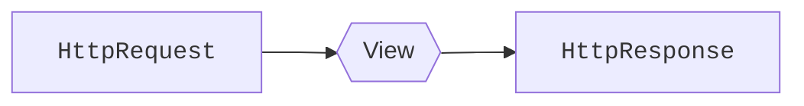

# Vistas { #views }

<span class="dj-level">:material-signal-cellular-1: Django básico</span>

En el [MVC](webdev.md#web-framework) de Django se podría decir que las **vistas** se corresponden con los **controladores**. En esta sección veremos cómo manejar las vistas y explotar sus principales funcionalidades.

## La primera vista { #first-view }

Una vista no es más que una **función** Python que recibe (como primer parámetro) la petición HTTP ([`HttpRequest`](https://docs.djangoproject.com/en/stable/ref/request-response/#httprequest-objects)) y retorna una respuesta HTTP ([`HttpResponse`](https://docs.djangoproject.com/en/stable/ref/request-response/#httpresponse-objects)):



Supongamos una primera vista que por <span class="example">ejemplo:material-flash:</span> sea el ^^punto de entrada^^ de nuestra aplicación del «blog»:

```python title="posts/views.py"
from django.http import HttpResponse#(1)!


def post_list(request):#(2)!
    return HttpResponse('Welcome to the ultimate blog!')#(3)!
```
{ .annotate }

1. La clase [`HttpResponse`](https://docs.djangoproject.com/en/stable/ref/request-response/#httpresponse-objects) permite devolver una respuesta HTTP al usuario.
2. Todas las vistas reciben **como primer parámetro** un objeto de tipo [`HttpRequest`](https://docs.djangoproject.com/en/stable/ref/request-response/#httprequest-objects) que — por convención — se nombra como `request`.
3. Las vistas siempre deben devolver una respuesta (HTTP), de lo contrario se lanzará una excepción.

!!! tip "Contenido"

    En el fichero `views.py` sólo deben ir **vistas**. Cualquier otro artefacto que queramos implementar debe ir bien en el modelo o bien en un fichero auxiliar.

## Renderizando plantillas { #render-templates }

Si quisiéramos devolver un HTML mediante el objeto `HttpResponse` nos quedaría algo relativamente incómodo:

```python title="posts/views.py"
from django.http import HttpResponse


def hello_world(request):
    return HttpResponse("""
<!DOCTYPE html>
<html>
  <head>
    <meta charset="utf-8" />
    <meta name="viewport" content="width=device-width, initial-scale=1" />
    <title>Blog</title>
  </head>

  <body>
    <h1>Welcome to the ultimate blog!</h1>
  </body>
</html>""")
```

Es por ello que Django nos facilita esta tarea mediante el «shortcut» [`render`](https://docs.djangoproject.com/en/stable/topics/http/shortcuts/#render) que se encarga de renderizar una plantilla y devolver el contenido de la misma mediante un objeto de tipo `HttpResponse`.

Veamos el mismo <span class="example">ejemplo:material-flash:</span> que antes pero utilizando esta funcionalidad:

```python title="posts/views.py" hl_lines="1 5"
from django.shortcuts import render#(1)!


def post_list(request):
    return render(request, 'posts/post/list.html')#(2)!
```
{ .annotate }

1. Importamos la función `render()` desde los «shortcuts» de Django.
2. La función `render()` siempre recibe como primer parámetro la petición `HttpRequest` y como segundo parámetro la [ruta a la plantilla](templates.md#location).

### Pasando un contexto { #passing-context }

Una de las ventajas importantes del uso de plantillas en Django es la posibilidad de «inyectar» variables. Dicho de otro modo, cuando estamos renderizando una plantilla podemos pasar un **contexto** con las variables que vamos a utilizar.

Para seguir evolucionando el listado de «posts» necesitaríamos obtener todos los «posts» del blog y pasar un contexto con ellos. Veamos un <span class="example">ejemplo:material-flash:</span> de este escenario mediante la siguiente vista:

```python title="posts/views.py" hl_lines="3 7 11"
from django.shortcuts import render

from .models import Post#(1)!


def post_list(request):
    posts = Post.objects.all()#(2)!
    return render(
        request,
        'posts/post/list.html',
        {'posts': posts}#(3)!
    )
```
{ .annotate }

1. Necesitamos importar el modelo `Post` para utilizarlo en la vista.
2. Hacemos una consulta y [recuperamos todos los objetos](models.md#retrieve-objects) de tipo «post» existentes en la base de datos.
3.  - La función `render()` admite un tercer parámetro (_contexto_) que es un **diccionario**.
    - De esta forma podemos «generalizar» la plantilla y parametrizarla con el contexto en función del contenido de la base de datos.

## Vistas con parámetros { #views-with-params }

Es bastante probable que la vista reciba una serie de parámetros desde la [URL](urls.md). Esto le permitirá atender a distintas casuísticas en función de los valores de entrada de dichos parámetros.

Veamos un <span class="example">ejemplo:material-flash:</span> de vista que recibe el «slug» de un «post»:

```python title="posts/views.py" hl_lines="7"
from django.http import HttpResponse
from django.shortcuts import render

from .models import Post


def post_detail(request, post_slug: str):
    try:
        post = Post.objects.get(slug=post_slug)
    except Post.DoesNotExist:
        return HttpResponse(f'Post with slug "{post_slug}" does not exist!')
    return render(
        request,
        'posts/post/detail.html',
        {'post': post}
    )
```

## Método de la petición { #request-method }

Hay ocasiones, especialmente en el manejo de [formularios](forms.md) que nos interesa detectar el método de la petición HTTP para tomar una acción u otra en función de ello.

Veamos un fragmento de código en el que identificamos el método HTTP utilizado en la petición:

```python
def view(request):
    if request.method == 'POST':#(1)!
        # This is a POST method HTTP request
    else:#(2)!
        # This is (probably) a GET method HTTP request
```
{ .annotate }

1. El atributo [`method`](https://docs.djangoproject.com/en/stable/ref/request-response/#django.http.HttpRequest.method) de los objetos `HttpRequest` nos informan del método HTTP mediante una cadena de texto ^^en mayúsculas^^.
2.  - Aunque existen [múltiples métodos HTTP](https://developer.mozilla.org/en-US/docs/Web/HTTP/Methods) para una petición, lo habitual es trabajar con dos de ellos: [`GET`](https://developer.mozilla.org/en-US/docs/Web/HTTP/Methods/GET) y [`POST`](https://developer.mozilla.org/en-US/docs/Web/HTTP/Methods/POST).
    - En cualquier caso si se quiere asegurar que es un método `GET` basta con indicarlo explícitamente :material-arrow-right-box: `#!python if request.method == 'GET':`

## Decorando vistas { #view-decorators }

Los [decoradores](../../../core/modularity/functions.md#decorators) en Python permite modificar el comportamiento de una función de un modo poco intrusivo y bastante elegante.

Hay escenarios en los que vemos que se repite un determinado bloque de código y que podría ser razonable refactorizar. Obviamente una primera opción es extraer a una función, pero un decorador también puede ser una buena estrategia.

En el <span class="example">ejemplo:material-flash:</span> del «blog» pensemos que en cada vista que maneja un «post» (detalle, borrado o edición) tenemos que localizar dicho «post» mediante su «slug». A continuación se muestra una posible implementación mediante *decoradores*:

=== "Decorador"

    ```python title="posts/decorators.py" hl_lines="9"
    from django.http import HttpResponse
    
    from .models import Post
    
    
    def post_handle(view):
        def wrapper(request, post_slug, *args, **kwargs):#(1)!
            try:
                request.post = Post.objects.get(slug=post_slug)#(2)!
            except Post.DoesNotExist:
                return HttpResponse(f'Post with slug "{post_slug}" does not exist!')
            return view(request, post_slug, *args, **kwargs)
    
        return wrapper
    ```
    { .annotate }
    
    1. Los dos primeros parámetros posicionales coinciden con los parámetros de la vista.
    2. Para poder disponer del «post» en la vista, inyectamos el «post» en el objeto `request`.

=== "Vista"

    ```python title="posts/views.py"
    from django.shortcuts import render
    
    from .decorators import post_handle#(1)!


    @post_handle#(2)!
    def post_detail(request, post_slug: str):
        return render(request, 'posts/post/detail.html', {'post': request.post})#(3)!
    ```
    { .annotate }
    
    1. Importamos el decorador correspondiente.
    2. Decoramos la vista.
    3. Utilizamos el «post» previamente inyectado en la propia petición («request») HTTP.

Hay otras formas de llevar a cabo aproximaciones similares:

- [Conversores personalizados en URLs](urls.md#custom-path-converters).
- [Middleware](middleware.md).

## Tipos de respuestas { #response-types }

<span class="dj-level">:material-signal-cellular-2: Django intermedio</span>

La clase [`HttpResponse`](https://docs.djangoproject.com/en/stable/ref/request-response/#httpresponse-objects) permite indicar el código de estado de la respuesta. Esto hace posible ser más exactos en el mensaje que trasladamos a un cliente.

Para ello usaremos el atributo `status` con un valor numérico (_del código de estado_) que podemos encontrar en [este enlace](https://developer.mozilla.org/en-US/docs/Web/HTTP/Status).

Supongamos por <span class="example">ejemplo:material-flash:</span> que queremos incorporar este enfoque en el detalle de un «post» de un «blog»:

```python title="posts/views.py" hl_lines="13"
from django.shortcuts import render
from django.http import HttpResponse

from .models import Post


def post_detail(request, post_slug: str):
    try:
        post = Post.objects.get(slug=post_slug)
    except Post.DoesNotExist:
        return HttpResponse(
            f"Post with slug '{post.slug}' does not exist",
            status=404
        )
    return render(request, 'posts/post/detail.html', {'post': post})
```

Pero Django ofrece [ciertas clases ya predefinidas](https://docs.djangoproject.com/en/stable/ref/request-response/#httpresponse-subclasses) para cubrir los códigos de estado HTTP más habituales:

| `status` | Significado | Clase |
| --- | --- | --- |
| [400](https://developer.mozilla.org/en-US/docs/Web/HTTP/Status/400) | Bad request | [`HttpResponseBadRequest()`](https://docs.djangoproject.com/en/stable/ref/request-response/#django.http.HttpResponseBadRequest) |
| [401](https://developer.mozilla.org/en-US/docs/Web/HTTP/Status/401) | Unauthorized | |
| [403](https://developer.mozilla.org/en-US/docs/Web/HTTP/Status/403) | Forbidden | [`HttpResponseForbidden()`](https://docs.djangoproject.com/en/stable/ref/request-response/#django.http.HttpResponseForbidden) |
| [404](https://developer.mozilla.org/en-US/docs/Web/HTTP/Status/404) | Not Found | [`HttpResponseNotFound()`](https://docs.djangoproject.com/en/stable/ref/request-response/#django.http.HttpResponseNotFound) |
| [405](https://developer.mozilla.org/en-US/docs/Web/HTTP/Status/405) | Method Not Allowed | [`HttpResponseNotAllowed()`](https://docs.djangoproject.com/en/stable/ref/request-response/#django.http.HttpResponseNotAllowed) |
| [500](https://developer.mozilla.org/en-US/docs/Web/HTTP/Status/500) | Internal Server Error | [`HttpResponseServerError()`](https://docs.djangoproject.com/en/stable/ref/request-response/#django.http.HttpResponseServerError) |

!!! info "401 vs 403"

    Suele ser fuente de confusión, diferenciar los códigos de estado HTTP 401 y 403. Vamos a aclararlo:

    - **401 (Unauthorized)** :material-arrow-right-bold: «No estás autenticado (no has demostrado quién eres)». <span class="example">Ejemplo:material-flash:</span> `@login_required`
    - **403 (Forbidden)** :material-arrow-right-bold: «Sí estás autenticado, pero no tienes permiso para acceder a este recurso». <span class="example">Ejemplo:material-flash:</span> `/admin/`

Por tanto, el <span class="example">ejemplo:material-flash:</span> anterior de «post» no encontrado se podría reescribir de la siguiente manera:

```python title="posts/views.py" hl_lines="11-13"
from django.shortcuts import render
from django.http import HttpResponseNotFound

from .models import Post


def post_detail(request, post_slug: str):
    try:
        post = Post.objects.get(slug=post_slug)
    except Post.DoesNotExist:
        return HttpResponseNotFound(
            f"Post with slug '{post.slug}' does not exist"
        )
    return render(request, 'posts/post/detail.html', {'post': post})
```

### Consulta no encontrada { #not-found-query }

Django proporciona un «shortcut» (atajo) para cuando queremos [recuperar un objeto](models.md#retrieve-one) pero —en vez de lanzar una excepción de tipo `DoesNotExist`— devolver un [`Http404`](https://docs.djangoproject.com/en/stable/topics/http/views/#django.http.Http404).

Por <span class="example">ejemplo:material-flash:</span> podemos reescribir la vista que recupera un «post» de la base de datos a partir de su «slug»:

```python title="posts/views.py" hl_lines="1 7"
from django.shortcuts import get_object_or_404, render

from .models import Post


def post_detail(request, post_slug: str):
    post = get_object_or_404(Post, slug=post_slug)#(1)!
    return render(request, 'posts/post/detail.html', {'post': post})
```
{ .annotate }

1. El primer parámetro es el modelo y el segundo es el filtro/condición a aplicar.

### Vistas de error personalizadas { #custom-error-views }

Cuando Django devuelve una respuesta con código de estado HTTP distinto a 200, muestra una página de error predefinida, y en muchos casos, no del todo «estética» según se mire.

Pero existe la posibilidad de personalizar esas [vistas predefinidas de error](https://docs.djangoproject.com/en/stable/ref/views/#error-views) para incorporar lógica adicional y/o nuevos diseños de plantilla.

Veamos un <span class="example">ejemplo:material-flash:</span> para personalizar la vista y plantilla para un **código de error 404** (no encontrado), aunque sería análogo para cualquier otro:

=== "Vista"

    ```python title="shared/views.py"
    from django.shortcuts import render


    def custom_404(request, exception):#(1)!
        context = {}#(2)!
        return render(request, '404.html', context, status=404)#(3)!
    ```
    { .annotate }
    
    1.  - Este nombre de vista no es obligatorio. Puede ser cualquiera.
        - Además de la petición HTTP se recibe la excepción levantada.
    2. Como cualquier otra vista, podemos definir un contexto para pasar a la plantilla.
    3.  - Indicamos la plantilla a renderizar.
        - El parámetro `status` define el código de estado de la respuesta.

=== "Plantilla"

    ```htmldjango title="shared/templates/404.html"
    <h1>Blog: 404</h1>
    <p>
        {{ error_message|default:"The resource you are looking for does not exist }}
    </p>
    ```

=== "URLs"

    ```python title="main/urls.py" hl_lines="4"
    from django.contrib import admin
    from django.urls import include, path
    
    handler404 = 'shared.views.custom_404'#(1)!
    
    urlpatterns = [
        path('admin/', admin.site.urls),
        path('posts/', include('posts.urls')),
    ]
    ```    
    { .annotate }
    
    1. La variable [`handler404`](https://docs.djangoproject.com/en/1.8/ref/urls/#handler404) establece la vista que procesa errores 404.

Es muy probable que con la configuración anterior sigas sin poder ver la página 404 personalizada. Esto se debe a que en modo «debug» Django proporciona otro tipo de plantillas con mayor información para desarrollo.

Para poder probar este tipo de respuestas en desarrollo, debemos «simular» un entorno de producción de la siguiente manera:

```python title="main/settings.py"
# ...
DEBUG = False#(1)!

ALLOWED_HOSTS = ['localhost']#(2)!
# ...
```
{ .annotate }

1. Necesitamos indicar que no estamos en depuración (desarrollo).
2. Django obliga a permitir «hosts» de acceso cuando el modo depuración está deshabilitado: *CommandError: You must set settings.ALLOWED_HOSTS if DEBUG is False.*{.red}

Ahora sí que ya debería de funcionar la personalización del error 404. Para ello bastaría con acceder a una URL del estilo http://localhost:8000/posts/este-post-no-existe/

#### Manejadores de error { #error-handlers }

Django nos ofrece los siguientes manejadores de error para poder personalizar las respuestas:

| Error | Manejador |
| --- | --- |
| 400 | [`handler400`](https://docs.djangoproject.com/en/stable/ref/urls/#handler400) |
| 403 | [`handler403`](https://docs.djangoproject.com/en/stable/ref/urls/#handler403) |
| 404 | [`handler404`](https://docs.djangoproject.com/en/stable/ref/urls/#handler404) |
| 500 | [`handler500`](https://docs.djangoproject.com/en/stable/ref/urls/#handler500) |
