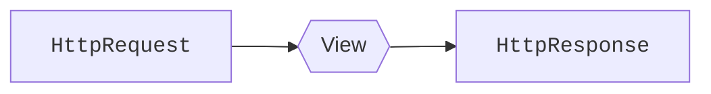

# Vistas { #views }

<span class="djversion basic">:simple-django: Básico :material-tag-multiple-outline:</span>

En el [MVC](webdev.md#web-framework) de Django se podría decir que las **vistas** se corresponden con los **controladores**. En esta sección veremos cómo manejar las vistas y explotar sus principales funcionalidades.

## La primera vista { #first-view }

Una vista no es más que una **función** Python que recibe (como primer parámetro) la petición HTTP y retorna una respuesta HTTP:



Supongamos una primera vista que por <span class="example">ejemplo:material-flash:</span> sea el punto de entrada de nuestra aplicación del «blog»:

```python title="posts/views.py"
from django.http import HttpResponse#(1)!


def post_list(request):#(2)!
    return HttpResponse('Welcome to the ultimate blog!')#(3)!
```
{ .annotate }

1. La clase [`HttpResponse`](https://docs.djangoproject.com/en/stable/ref/request-response/#httpresponse-objects) permite devolver una respuesta HTTP al usuario.
2. Todas las vistas reciben **como primer parámetro** un objeto de tipo [`HttpRequest`](https://docs.djangoproject.com/en/stable/ref/request-response/#httprequest-objects) que — por convención — se nombra como `request`.
3. Las vistas siempre deben devolver una respuesta (HTTP), de lo contrario se lanzará una excepción.

!!! tip "Contenido"

    En el fichero `views.py` sólo deben ir **vistas**. Cualquier otro artefacto que queramos implementar debe ir bien en el modelo o bien en un fichero auxiliar.

## Renderizando plantillas { #render-templates }

Si quisiéramos devolver un HTML mediante el objeto `HttpResponse` nos quedaría algo relativamente incómodo:

```python title="posts/views.py"
from django.http import HttpResponse


def hello_world(request):
    return HttpResponse("""
<!DOCTYPE html>
<html>
  <head>
    <meta charset="utf-8" />
    <meta name="viewport" content="width=device-width, initial-scale=1" />
    <title>Blog</title>
  </head>

  <body>
    <h1>Welcome to the ultimate blog!</h1>
  </body>
</html>""")
```

Es por ello que Django nos facilita esta tarea mediante el «shortcut» [`render`](https://docs.djangoproject.com/en/stable/topics/http/shortcuts/#render) que se encarga de renderizar una plantilla y devolver el contenido de la misma mediante un objeto de tipo `HttpResponse`.

Veamos el mismo <span class="example">ejemplo:material-flash:</span> que antes pero utilizando esta funcionalidad:

```python
from django.shortcuts import render#(1)!


def post_list(request):
    return render(request, 'posts/post/list.html')#(2)!
```
{ .annotate }

1. Importamos la función `render()` desde los «shortcuts» de Django.
2. La función `render()` siempre recibe como primer parámetro la petición `HttpRequest` y como segundo parámetro la [ruta a la plantilla](templates.md#location).

### Pasando un contexto { #passing-context }

Una de las ventajas importantes del uso de plantillas en Django es la posibilidad de «inyectar» variables. Dicho de otro modo, cuando estamos renderizando una plantilla podemos pasar un **contexto** con las variables que vamos a utilizar.

Para seguir evolucionando el listado de «posts» necesitaríamos obtener todos los «posts» del blog y pasar un contexto con ellos. Veamos un <span class="example">ejemplo:material-flash:</span> de este escenario mediante la siguiente vista:

```python title="posts/views.py" hl_lines="3 7 11"
from django.shortcuts import render

from .models import Post#(1)!


def post_list(request):
    posts = Post.objects.all()#(2)!
    return render(
        request,
        'posts/post/list.html',
        {'posts': posts}#(3)!
    )
```
{ .annotate }

1. Necesitamos importar el modelo `Post` para utilizarlo en la vista.
2. Hacemos una consulta y [recuperamos todos los objetos](models.md#retrieve-objects) de tipo «post» existentes en la base de datos.
3.  - La función `render()` admite un tercer parámetro (_contexto_) que es un **diccionario**.
    - De esta forma podemos «generalizar» la plantilla y parametrizarla con el contexto en función del contenido de la base de datos.

## Vistas con parámetros { #views-with-params }

Es bastante probable que la vista reciba una serie de parámetros desde la [URL](urls.md). Esto le permitirá atender a distintas casuísticas en función de los valores de entrada de dichos parámetros.

Veamos un <span class="example">ejemplo:material-flash:</span> de vista que recibe el «slug» de un «post»:

```python title="posts/views.py" hl_lines="7"
from django.http import HttpResponse
from django.shortcuts import render

from .models import Post


def post_detail(request, post_slug: str):
    try:
        post = Post.objects.get(slug=post_slug)
    except Post.DoesNotExist:
        return HttpResponse(f'Post with slug "{post_slug}" does not exist!')
    return render(
        request,
        'posts/post/detail.html',
        {'post': post}
    )
```

## Método de la petición { #request-method }

Hay ocasiones, especialmente en el manejo de [formularios](forms.md) que nos interesa detectar el método de la petición HTTP para tomar una acción u otra en función de ello.

Veamos un fragmento de código en el que identificamos el método HTTP utilizado en la petición:

```python
def view(request):
    if request.method == 'POST':#(1)!
        # This is a POST method HTTP request
    else:#(2)!
        # This is (probably) a GET method HTTP request
```
{ .annotate }

1. El atributo [`method`](https://docs.djangoproject.com/en/stable/ref/request-response/#django.http.HttpRequest.method) de los objetos `HttpRequest` nos informan del método HTTP mediante una cadena de texto ^^en mayúsculas^^.
2.  - Aunque existen [múltiples métodos HTTP](https://developer.mozilla.org/en-US/docs/Web/HTTP/Methods) para una petición, lo habitual es trabajar con dos de ellos: [`GET`](https://developer.mozilla.org/en-US/docs/Web/HTTP/Methods/GET) y [`POST`](https://developer.mozilla.org/en-US/docs/Web/HTTP/Methods/POST).
    - En cualquier caso si se quiere asegurar que es un método `GET` basta con indicarlo explícitamente :material-arrow-right-box: `#!python if request.method == 'GET':`

## Tipos de respuestas { #response-types }

<span class="djversion intermediate">:simple-django: Intermedio :material-tag-multiple-outline:</span>

La clase [`HttpResponse`](https://docs.djangoproject.com/en/stable/ref/request-response/#httpresponse-objects) permite indicar el código de estado de la respuesta. Esto hace posible ser más exactos en el mensaje que trasladamos a un cliente.

Para ello usaremos el atributo `status_code` con un valor numérico (_del código de estado_) que podemos encontrar en [este enlace](https://developer.mozilla.org/en-US/docs/Web/HTTP/Status).

Por <span class="example">ejemplo:material-flash:</span> si queremos indicar que un determinado recurso no se encuentra, lo podemos implementar así:

```python hl_lines="5"
from django.http import HttpResponse


def my_view(request):
    # ...
    return HttpResponse(status_code=404)
```

Pero Django ofrece [ciertas clases ya predefinidas](https://docs.djangoproject.com/en/stable/ref/request-response/#httpresponse-subclasses) para cubrir los códigos de estado HTTP más habituales:

| `status_code` | Significado | Clase |
| --- | --- | --- |
| [400](https://developer.mozilla.org/en-US/docs/Web/HTTP/Status/400) | Bad request | `HttpResponseBadRequest()` |
| [401](https://developer.mozilla.org/en-US/docs/Web/HTTP/Status/401) | Unauthorized | |
| [403](https://developer.mozilla.org/en-US/docs/Web/HTTP/Status/403) | Forbidden | `HttpResponseForbidden()` |
| [404](https://developer.mozilla.org/en-US/docs/Web/HTTP/Status/404) | Not Found | `HttpResponseNotFound()` |
| [405](https://developer.mozilla.org/en-US/docs/Web/HTTP/Status/405) | Method Not Allowed | `HttpResponseNotAllowed()` |
| [500](https://developer.mozilla.org/en-US/docs/Web/HTTP/Status/500) | Internal Server Error | `HttpResponseServerError()` |

### Consulta no encontrada { #not-found-query }

Django proporciona un «shortcut» (atajo) para cuando queremos [recuperar un objeto](models.md#retrieve-one) pero —en vez de lanzar una excepción de tipo `DoesNotExist`— devolver un [`Http404`](https://docs.djangoproject.com/en/stable/topics/http/views/#django.http.Http404).

Por <span class="example">ejemplo:material-flash:</span>, supongamos una vista que recupera un «post» de la base de datos a partir de su «slug»:

```python title="posts/views.py" hl_lines="1 7"
from django.shortcuts import get_object_or_404

from .models import Post


def post_detail(request, post_slug: str):
    post = get_object_or_404(Post, slug=post_slug)#(1)!
```
{ .annotate }

1. El primer parámetro es el modelo y el segundo es el filtro/condición a aplicar.
