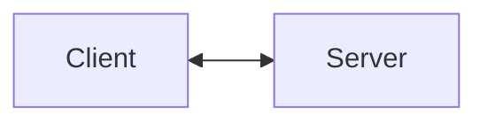
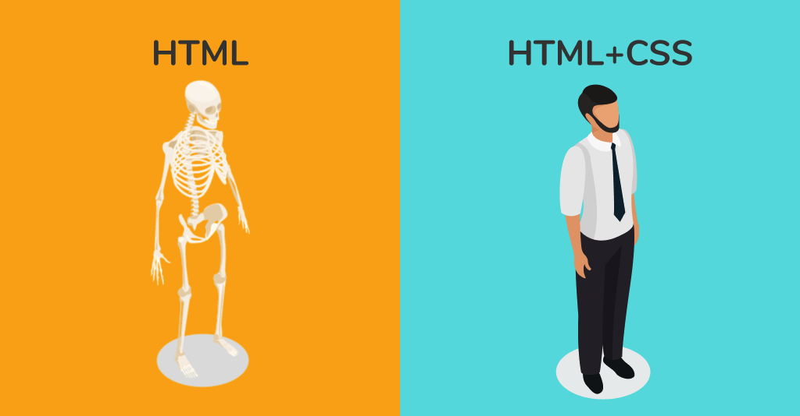
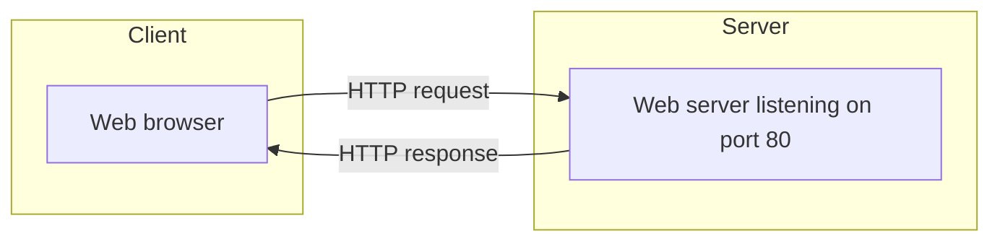
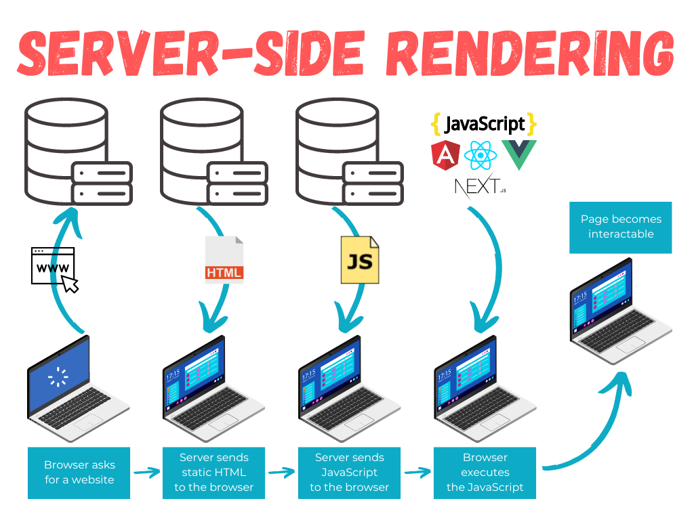
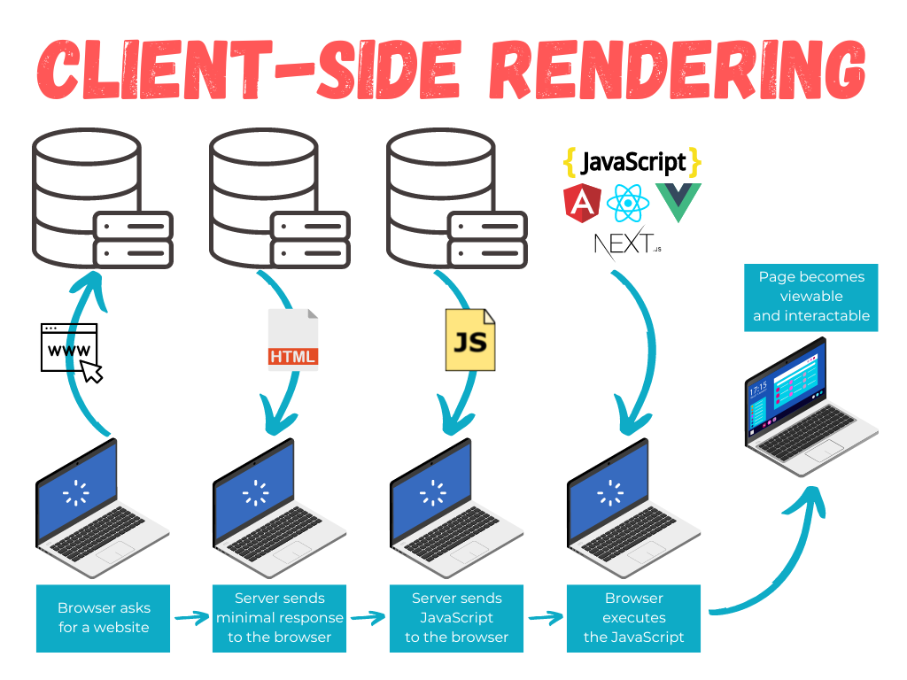
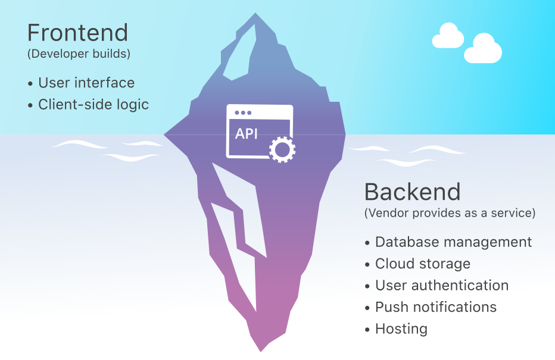
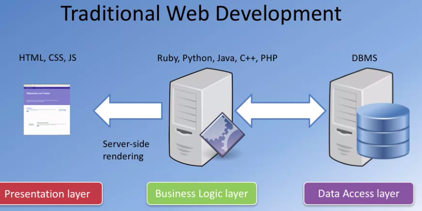
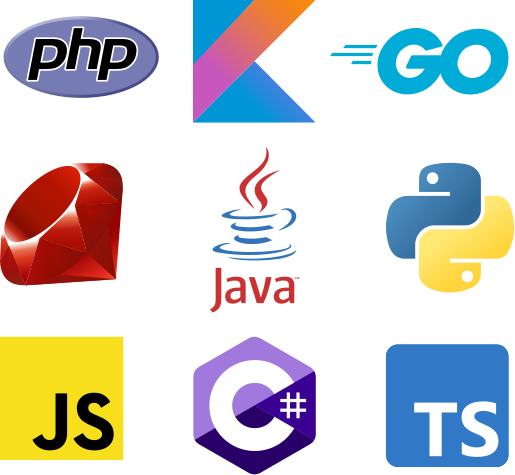
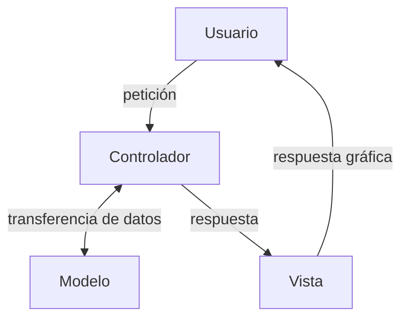

# Desarrollo web { #webdev }

El «desarrollo web» es el proceso de crear y mantener sitios web. Involucra tareas como el diseño, la programación, la implementación de contenido y la configuración de servidores web. Este proceso requiere el uso de diferentes tecnologías y lenguajes de programación, como HTML, CSS, [Python](/core/introduction/python.md) o JavaScript, entre otros. Además, el desarrollo web puede incluir aspectos relacionados con la identidad corporativa, el arte y la generación de ideas para la presencia digital.

## Introducción { #intro }

Seguro que ya sabes exactamente qué es una **página web**, e incluso conozcas cuáles son los pasos que se suceden para que, cuando visitas una web poniendo su dirección en el navegador, la página se descargue a tu equipo y se pueda mostrar. Sin embargo, este procedimiento que puede parecer sencillo, a veces no lo es tanto. **Todo depende de cómo se haya hecho la página en cuestión**.



Cuando una **página web** se descarga al ordenador, su contenido define qué se debe mostrar en pantalla. **Este contenido está programado en un lenguaje de marcas**, formado por etiquetas, que habitualmente es **HTML**. Las etiquetas que componen la página indican el objetivo de cada una de las partes que la componen (véase `#!html <h1>`, `#!html <tr>`, `#!html <p>`, ...). Así, dentro de estos lenguajes hay etiquetas para indicar que un texto es un encabezado, que forma parte de una tabla, o que simplemente es un párrafo de texto.

Además, si la página está bien estructurada, la información que le indica al navegador el estilo con que se debe mostrar cada parte de la página estará almacenado en otro fichero (o ficheros), una **hoja de estilos** o **CSS**. La hoja de estilos se encuentra indicada en la página web y el navegador la descarga junto a ésta. En ella nos podemos encontrar, por ejemplo, estilos que indican que el encabezado debe ir con tipo de letra [Helvetica](https://font.download/font/helvetica-255) y en color azul, o que los párrafos deben ir alineados a la izquierda.


(1)
{ .annotate }

1. :fontawesome-regular-copyright: [Sai kiran bollam](https://www.linkedin.com/pulse/mastering-fundamentals-beginners-guide-html-css-sai-kiran-bollam/) (Linkedin)

Estos dos ficheros se descargan a tu ordenador desde un servidor web como respuesta a una petición. El proceso es el que se indica a continuación:

1. **Tu ordenador solicita a un servidor** web una página con extensión `.html`
2. El servidor **busca esa página** en un almacén de páginas (cada una suele ser un fichero).
3. Si el servidor encuentra esa página, la **recupera**.
4. Y por último **se la envía al navegador** para que éste pueda mostrar su contenido (renderizado).

Este es un ejemplo típico de una comunicación **cliente-servidor**. El cliente es el que hace la **petición** e inicia la comunicación, y el servidor es el que recibe la petición y la atiende mediante una **respuesta**. En este contexto, **el navegador es el cliente web**.



### Páginas web estáticas y dinámicas { #static-dynamic-webs }

Las páginas explicadas en el apartado anterior se llaman **páginas web estáticas**. Estas páginas se encuentran almacenadas en su forma definitiva, tal y como se crearon, y su contenido no varía. Son útiles para mostrar una información concreta, y mostrarán esa misma información cada vez que se carguen. La única forma en que pueden cambiar es si un programador la modifica y actualiza su contenido.

En contraposición a las páginas web estáticas existen las **páginas web dinámicas**. Estas páginas, como su propio nombre indica, se caracterizan porque su contenido cambia en función del escenario correspondiente (usuario logeado, acciones ejecutadas, configuración, etc.).

=== "Petición de página estática"

    ```mermaid
    flowchart LR
      User --> Server
      Server --> User
    ```

=== "Petición de página dinámica"

    ```mermaid
    flowchart LR
      User --> Server
      Server --> User
      Server --> appserver[Application server]
      appserver --> Server
      appserver --> Database
      Database --> appserver
    ```

Dentro de las **páginas web dinámicas**, es muy importante distinguir dos tipos:

1. Aquellas cuyo contenido se «conforma» **completamente** de forma dinámica en el servidor y se devuelven al cliente. Puede que tengan extensión `.php`, `.asp` o que incluso ni siquiera tengan extensión (por ejemplo `/shop`). El código HTML de estas páginas es el resultado de la ejecución de un programa (en el servidor). Estas páginas entran dentro de la categoría **SSR** que veremos un poco más adelante.

2. Aquellas que **incluyen código que ejecuta el navegador**. En estas páginas el código ejecutable, normalmente en lenguaje JavaScript, se incluye dentro del HTML y se descarga junto con la página. Cuando el navegador muestra la página en pantalla, ejecuta el código que la acompaña. Este código puede incorporar múltiples funcionalidades que pueden ir desde mostrar animaciones hasta cambiar totalmente la apariencia y el contenido. Estas páginas entran dentro de la categoría **CSR** que veremos un poco más adelante.

El esquema de funcionamiento de una página web dinámica es el siguiente:

1. El cliente web (navegador) de tu ordenador solicita a un servidor web una página web.
2. El servidor busca esa página y la recupera.
3. En el caso de que se trate de una página web dinámica, es decir, que su contenido deba ejecutarse para obtener el HTML que se devolverá, el servidor web contacta con el módulo responsable de ejecutar el código y se lo envía.
4. Como parte del proceso de ejecución, puede ser necesario obtener información de algún repositorio _(cualquier almacén de información digital, normalmente una base de datos)_, como por ejemplo consultar registros almacenados en una base de datos.
5. El resultado de la ejecución será una página en formato HTML, similar a cualquier otra página web no dinámica.
6. El servidor web envía el resultado obtenido al navegador, que la procesa y muestra en pantalla.

Este procedimiento tiene lugar constantemente mientras consultamos páginas web. Por ejemplo, cuando consultas tu correo electrónico vía web, lo primero que tienes que hacer es introducir tu nombre de usuario y contraseña. A continuación, lo más habitual es que el servidor te muestre una pantalla con la bandeja de entrada, en la que aparecen los mensajes recibidos en tu cuenta. Esta pantalla es un claro ejemplo de una página web dinámica.

Obviamente, el servidor no envía esa misma página a todos los usuarios, sino que la personaliza de forma dinámica en función de quién sea el usuario que se conecte. Para generarla ejecuta un programa que obtiene los datos de tu usuario (tus contactos, la lista de mensajes recibidos) y con ellos compone la página web que recibes desde el servidor web.

#### Ámbito de aplicación { #scope }

Aunque la utilización de páginas web dinámicas parezca la mejor opción para construir un sitio web, no siempre lo es. Sin lugar a dudas, es la que más potencia y flexibilidad aporta, pero las páginas web estáticas tienen también algunas ventajas:

1. No es necesario saber ~~programar~~ tanto para crear un sitio que utilice únicamente páginas web estáticas. «Simplemente» habría que manejar HTML y CSS, e incluso esto no sería indispensable: se podría utilizar algún programa de diseño web para generarlas.
2. La característica diferenciadora de las páginas web estáticas es que su contenido nunca varía, y esto en algunos casos también puede suponer una ventaja (mayor capacidad de cacheado, enlaces invariantes, motores de búsqueda, etc.).

Para que Google muestre un sitio web en sus resultados de búsqueda, previamente tiene que indexar su contenido. Es decir, un programa («robot») recorre las páginas del sitio consultando su contenido y clasificándolo. Si las páginas se generan de forma dinámica, puede que su contenido, en parte o por completo, no sea visible para el buscador y por tanto no quede indexado. Esto nunca sucedería en un sitio que utilizase páginas web estáticas.

Para que un servidor web pueda procesar una página web dinámica, necesita ejecutar un programa. Esta ejecución la realiza un módulo concreto, que puede estar integrado en el servidor o ser independiente. Además, puede ser necesario consultar una base de datos como parte de la ejecución del programa. Es decir, la ejecución de una página web dinámica requiere una serie de recursos del lado del servidor. Estos recursos deben instalarse y mantenerse.

Las páginas web estáticas sólo necesitan un servidor web que se comunique con el navegador para enviar dicha información. Y de hecho para ver una página estática almacenada en tu equipo no necesitas ni siquiera de un servidor web. Son archivos que pueden almacenarse en ficheros del disco duro y abrirse desde él directamente con un navegador web.

Pero si se decide hacer un sitio web utilizando páginas estáticas, ten en cuenta que tienen limitaciones. La desventaja más importante ya la comentamos anteriormente: la actualización de su contenido debe hacerse de forma manual editando la página que almacena el servidor web. Esto implica un mantenimiento que puede ser prohibitivo en sitios web con alta variabilidad de sus contenidos.

#### Aplicaciones web { #webapps }

Las **aplicaciones web emplean páginas web dinámicas** para crear aplicaciones que se ejecuten en un servidor web y se muestren en un navegador. Se puede encontrar aplicaciones web para realizar múltiples tareas. Unas de las primeras en aparecer fueron las comentadas anteriormente: clientes de correo.

Hoy en día existen aplicaciones web para multitud de tareas como procesadores de texto, gestión de tareas, o edición y almacenamiento de imágenes. Estas aplicaciones tienen ciertas ventajas e inconvenientes si las comparas con las aplicaciones tradicionales que se ejecutan sobre el sistema operativo de la propia máquina (aplicaciones nativas):

| Ventajas | Inconvenientes |
| --- | --- |
| **No es necesario instalarlas** en aquellos equipos en que se vayan a utilizar. Se instalan y se ejecutan solamente en un equipo, en el servidor, y esto es suficiente para que se puedan utilizar de forma simultánea desde muchos clientes. | **Dependemos de la infraestructura** para que la aplicación funcione. No sólo de la conexión a internet sino del estado del servidor y de todo el software que lo acompaña. Si falla cualquier dispositivo en la comunicación no podremos acceder a la aplicación web. |
| Como solo se encuentran instaladas en un equipo, es **muy sencillo gestionarlas**. Véase hacer copias de seguridad de los datos, corregir errores, lanzar nuevas actualizaciones, realizar notificaciones al usuario final, etc. | Aún con conexión a internet, el cuello de botella de la velocidad de ejecución suele ser la **transmisión de datos** a través de la red. Esto puede ralentizar la aplicación web, sobre todo si la arquitectura no está bien diseñada para escalar con el número de usuarios. |
| Se pueden utilizar en todos aquellos **sistemas que dispongan de un navegador web**, independientemente de sus características (no es tan necesario un equipo potente) o de su sistema operativo. |  Aunque se ha hecho un esfuerzo por homogeneizar los motores de renderizado de los navegadores, siempre existen diferencias entre ellos. Por otro lado, con el auge de los dispositivos móviles la variabilidad física de las pantallas y sus resoluciones es grande. **Adaptar las aplicaciones web a escenarios tan diversos es todo un reto**. |

### Lugar de ejecución del código { #code-execution }

En función del lugar en el que se ejecuta el código se distinguen (al menos) dos modelos de «renderizado»: SSR y CSR.

#### SSR { #ssr }

Cuando el navegador solicita a un servidor web una página, es posible que antes de enviársela haya tenido que ejecutar, por sí mismo o por delegación, algún programa para obtenerla. Ese programa es el que genera, en parte o en su totalidad, la página web que llega al cliente. En estos casos, **el código se ejecuta en el entorno del servidor web** y hablamos de SERVER SIDE RENDERING (SSR):


(1)
{ .annotate }

1. :fontawesome-regular-copyright: [Ricardo Andreatta](https://ferie.medium.com/what-is-the-server-side-rendering-and-how-it-works-f1d4bf9322c6) (Medium)

Además, cuando una página web llega al navegador, también es posible que incluya algún programa o fragmentos de código que se deban ejecutar en el cliente. Ese código, normalmente en lenguaje **JavaScript**, se ejecutará en el navegador y, además de poder modificar el contenido de la página, puede llevar a cabo acciones como la animación de textos u objetos de la página o la comprobación de los datos que se introducen en un formulario.

**Estas dos tecnologías se complementan** una con la otra. Así, volviendo al ejemplo del correo web, el programa que se encarga de obtener tus mensajes y su contenido de una base de datos se ejecuta en el entorno del servidor, mientras que tu navegador ejecuta, por ejemplo, el código encargado de avisarte cuando quieres enviar un mensaje y te has olvidado de poner un texto en el asunto.

Esta división es así porque el código que se ejecuta en el cliente web (navegador) no tiene, o mejor dicho tradicionalmente no tenía, acceso a los datos que se almacenan en el servidor. Es decir, cuando en tu navegador querías leer un nuevo correo, el código Javascript que se ejecutaba en el mismo no podía obtener de la base de datos el contenido de ese mensaje. La solución era crear una nueva página en el servidor con la información que se pedía y enviarla de nuevo al navegador.

Sin embargo, es posible realizar programas en los que el código JavaScript que se ejecuta en el navegador pueda comunicarse con un servidor de Internet para obtener información con la que, por ejemplo, modificar la página web actual.

#### CSR { #csr }

En una aplicación web de gestión correo electrónico, cuando se pulsa encima de un correo, la página puede contener código Javascript que detecte la acción y, en ese instante, consultar a través de Internet el texto que contiene ese mismo correo y mostrarlo en la misma página, modificando su estructura en caso de que sea necesario. Es decir, sin salir de una página podemos modificar su contenido en base a la información que se almacena en un servidor de Internet. En este escenario podemos hablar de **SPA** o aplicaciones de una única página, concepto estrechamente relcionado con el llamado CLIENT SIDE RENDERING (CSR):


(1)
{ .annotate }

1. :fontawesome-regular-copyright: [Ricardo Andreatta](https://ferie.medium.com/what-is-the-server-side-rendering-and-how-it-works-f1d4bf9322c6) (Medium)

#### Front vs Back { #front-vs-back }

Es muy habitual hablar de **desarrollo «frontend»** cuando nos referimos a la programación de aplicaciones web del lado del cliente y **desarrollo «backend»** cuando nos referimos a la programación de aplicaciones web del lado del servidor.

Podríamos decir que el desarrollo «frontend» está más vinculado con [Client Side Rendering](#csr) mientras que el desarrollo «backend» está más vinculado con [Server Side Rendering](#ssr), aunque la frontera entre ambos contextos es muy difusa y lo que encontramos habitualmente es una mezcla de ellas en el desarrollo de un mismo proyecto.

Muchas de las aplicaciones **web actuales utilizan ambas tecnologías**: la ejecución de código en el servidor y en el cliente. Así, el código que se ejecuta en el servidor genera páginas web que ya incluyen código destinado a su ejecución en el navegador. Aquellas personas que se dedican al desarrollo de una aplicación en toda su extensión («frontend» + «backend») se dice que trabajan en **desarrollo fullstack**.


(1)
{ .annotate }

1. :fontawesome-regular-copyright: [Cloudflare](https://www.cloudflare.com/es-es/learning/serverless/glossary/backend-as-a-service-baas/) (Cloudflare)

## Tecnologías web { #web-technologies }

Cuando se desarrolla una aplicación se hace utilizando un lenguaje de programación. Por ejemplo, utilizamos Python para crear aplicaciones que se ejecuten en distintos sistemas operativos. Para programar una aplicación se necesitan ciertas ^^herramientas^^ como un entorno de desarrollo o librerías de código. Además, una vez acabado su desarrollo, esta aplicación necesitará ciertos componentes para su ejecución, como por ejemplo un ^^intérprete^^ dentro de un ^^entorno virtual^^.

En este bloque veremos distintas tecnologías que se pueden utilizar para programar aplicaciones y que se ejecuten en un servidor web. Analizaremos las ventajas e inconvenientes de utilizar cada una, y qué lenguajes de programación se deben aprender para utilizarlas.

### Componentes para desarrollo web { #webdev-components }

Los **componentes principales** con los que se debe contar para ejecutar aplicaciones web en un servidor son los siguientes:

1. Un **servidor web** para recibir las peticiones de los clientes web (normalmente navegadores) y enviarles la página que solicitan (una vez generada puesto que hablamos de páginas web dinámicas). El servidor web debe conocer el procedimiento a seguir para generar la página web: qué módulo se encargará de la ejecución del código y cómo se debe comunicar con él.
2. El **módulo encargado de ejecutar el código** y generar la página web resultante. Este módulo debe integrarse de alguna forma con el servidor web, y dependerá del lenguaje y tecnología que utilicemos para programar la aplicación web. También se conoce por ^^servidor de aplicación^^.
3. Un **sistema gestor de base de datos**. Este módulo no es estrictamente necesario pero en la práctica se utiliza en todas las aplicaciones web que manejan ciertas cantidades de datos o información.
4. El **lenguaje de programación** que utilizarás para desarrollar las aplicaciones.

#### Modelo por capas { #layer-model }

Además de los citados componentes, también es importante decidir cómo se va a **organizar el código** de la aplicación. Muchas de las arquitecturas que se usan en programación de aplicaciones web ayudan a estructurar el código de las aplicaciones en **capas o niveles**.

El principal motivo de dividir el diseño de una aplicación en capas es que se puedan **separar las funciones lógicas** de la misma, favoreciendo la reutilización y el desacoplamiento de los componentes.

En una aplicación se puede distinguir, de forma general, funciones de **presentación** (se encarga de dar formato a los datos para presentárselo al usuario final), **lógica de negocio** (utiliza los datos para ejecutar un proceso y obtener un resultado) y **persistencia** (que mantiene los datos almacenados de forma organizada).



### Elección de la arquitectura web { #web-arquitecture }

La primera decisión antes de comenzar a programar una aplicación web es elegir la arquitectura a utilizar. Podríamos diferenciar tres tipos de aspectos en relación con la arquitectura de una aplicación web: software, hardware y empresariales.

#### Aspectos software { #software-issues }

1. ¿Qué lenguaje de programación se utilizará?
2. ¿Necesito un framework web? ¿Cuál se adapta mejor al proyecto?
3. ¿Qué modelo de ejecución es el más adecuado? ¿SSR o CSR?
4. ¿Necesito persistencia? ¿Qué base de datos se utilizará?
5. ¿Base de datos relacional vs clave-valor? ¿Puedo usar ambas?
6. ¿Sobre qué servidor web se va a desplegar la aplicación?
7. ¿Qué servidor de aplicación se requiere?
8. ¿Qué tipo de licencia voy a establecer para la aplicación que desarrolle?

#### Aspectos hardware { #hardware-issues }

1. ¿Qué tipo de infraestructura hay disponible?
2. ¿Necesito infraestructura «on-premise» o «cloud»?
3. ¿Qué coste/beneficio me proporciona cada solución?
4. ¿Qué requerimientos debe(n) tener la(s) máquina(s) del proyecto?
5. ¿Cómo se gestiona la escalabilidad de la aplicación?

#### Aspectos empresariales { #business-issues }

1. ¿Qué metodología de desarrollo se va a utilizar?
2. ¿Es necesario elaborar prototipos?
3. ¿Qué tamaño tiene el proyecto?
4. ¿Qué lenguajes de programación conozco? ¿Vale la pena el esfuerzo de aprender uno nuevo?
5. ¿Se van a usar herramientas de código abierto o herramientas propietarias? ¿Cuál es el coste de utilizar soluciones comerciales?
6. ¿Voy a programar la aplicación yo solo o formaré parte de un equipo de desarrollo?

Las respuestas a estas y otras preguntas te ayudarán a definir los detalles de implementación de tu aplicación web así como la arquitectura más adecuada.

### Lenguajes { #languages }

La elección del lenguaje de programación es importante pero no decisiva. Hay que tener en cuenta otros factores como los que se han comentado en la sección anterior.

En cualquier caso, cuando hablamos de **programación del lado del servidor**, los lenguajes de programación tienen características que los diferencian tanto en tiempo de desarrollo, compilación y ejecución.



Si nos centramos en **desarrollo web para entorno servidor** podemos citar algunas de las opciones disponibles:

| Lenguaje | Framework |
| --- | --- |
| [Java :fontawesome-brands-java:](https://www.java.com/es/)<br>[Kotlin :material-language-kotlin:](https://kotlinlang.org/) | [Spring Boot  :simple-springboot:](https://spring.io/projects/spring-boot) |
| [PHP :simple-php:](https://www.php.net/manual/es/intro-whatis.php) | [Laravel :simple-laravel:](https://laravel.com/) |
| [JavaScript :simple-javascript:](https://developer.mozilla.org/es/docs/Web/JavaScript)<br>[TypeScript :simple-typescript:](https://github.com/sdelquin/dsw/blob/main/ut1) | [Express :simple-express:](https://expressjs.com/es/)<br>[Node.js :simple-nodedotjs:](https://nodejs.org/es) |
| [Ruby :simple-ruby:](https://www.ruby-lang.org/es/) | [Ruby on Rails :material-language-ruby-on-rails:](https://rubyonrails.org/) |
| [C# :material-language-csharp:](https://learn.microsoft.com/es-es/dotnet/csharp/) | [ASP.NET Core](https://dotnet.microsoft.com/es-es/learn/aspnet/what-is-aspnet-core) |
| [Go :fontawesome-brands-golang:](https://go.dev/) | [Gin :simple-gin:](https://gin-gonic.com/) |
| [Python :simple-python:](https://www.python.org/) | [Django :simple-django:](https://www.djangoproject.com/) |

!!! tip "El lenguaje es una herramienta"

    Todos los lenguajes tienen ventajas e inconvenientes. El lenguaje de programación debe ser una herramienta para solucionar el problema, no un fin en sí mismo. Explora las distintas posibilidades y trata de encontrar aquella herramienta que mejor se adapte al proyecto.

#### Framework web { #web-framework }

Los llamados «framework web» ofrecen un conjunto de librerías y funcionalidades que **permiten el desarrollo ágil de aplicaciones web** facilitando muchas de las tareas habituales que se suelen llevar a cabo en este tipo de proyectos.

En su gran mayoría, los framework web se basan en una arquitectura «MVC» o «Modelo-Vista-Controlador»:



#### Integración con lenguajes de marcas { #markup-languages }

La respuesta «gráfica» que se devuelve al usuario consiste en **integrar parte del código** del programa **en medio de las etiquetas HTML** de la página web, dando lugar a las plantillas. De esta forma, el contenido que no varía de la página se puede introducir directamente en HTML mientras que el lenguaje de programación se utilizará para todo aquello que pueda variar de forma dinámica. Este mecanismo de «renderizado» de las plantillas se realiza mediante un **motor de plantillas**.

Veamos un <span class="example">ejemplo:material-flash:</span> de plantilla en Django:

```django title="polls/templates/polls/detail.html"
<h1>{{ question.question.text }}</h1>
<ul>

    <li>{{ choice.choice_text }}</li>

</ul>
```

#### Integración con servidor web { #webserver }

La comunicación entre un cliente web (navegador) y un servidor web se lleva a cabo gracias al **protocolo HTTP**. En el caso de las aplicaciones web, HTTP es el vínculo de unión entre el usuario y la aplicación en sí. El envío de información de un usuario se convierte en una **petición HTTP** y el resultado que obtiene le llega por medio de una **respuesta HTTP**.

En el lado del servidor, estas peticiones son procesadas por el servidor web. Es por tanto el servidor web el encargado de decidir cómo procesar las peticiones que recibe. Cada una de las arquitecturas que acabamos de ver tiene **una forma de integrarse con el servidor web** para ejecutar el código de la aplicación, delegando este procesamiento a un **servidor de aplicación**.

A continuación se muestran algunos ejemplos de integración de servidores de aplicación con servidores web:

=== "Apache"

    El servidor web [Apache :simple-apache:](https://httpd.apache.org/) se integra con muchos servidores de aplicación. Ejemplos típicos:

    | Servidor de aplicación | Para |
    | --- | --- |
    | [Tomcat :simple-apachetomcat:](https://tomcat.apache.org/) | ^^Java^^ |
    | [FPM](https://www.php.net/manual/es/install.fpm.php) | ^^PHP^^ |

=== "Nginx"

    El servidor web [Nginx :simple-nginx:](https://www.nginx.com/) se integra con muchos servidores de aplicación. Ejemplos típicos:

    | Servidor de aplicación | Para |
    | --- | --- |
    | [Gunicorn :simple-gunicorn:](https://gunicorn.org/) | ^^Python^^ |
    | [Passenger](https://www.phusionpassenger.com/) | ^^Ruby^^ |

## Django { #django }

[Django :simple-django:](https://www.djangoproject.com/) es un framework de desarrollo web de alto nivel, gratuito y de código abierto, **escrito en Python**.

Se utiliza para crear aplicaciones web de forma rápida y segura, ya que proporciona una estructura lista para usar, incluyendo funcionalidades comunes como autenticación de usuarios, administración de contenido o manejo de formularios, entre otros. Django es altamente escalable y puede manejar miles de solicitudes, y su arquitectura está diseñada para utilizar eficientemente el hardware del sistema. Además, ofrece características avanzadas de seguridad y es ampliamente utilizado en la industria.

Fue creado por [Adrian Holovaty](https://es.wikipedia.org/wiki/Adrian_Holovaty), [Simon Willison](https://es.wikipedia.org/wiki/Simon_Willison), [Jacob Kaplan-Moss](https://jacobian.org/) y [Wilson Miner](https://wilsonminer.com/) en 2005.


### ¿Por qué Django? { #why-django }

El nombre «Django» fue elegido en honor al músico de jazz [Django Reinhardt](https://es.wikipedia.org/wiki/Django_Reinhardt). Django Reinhardt fue un guitarrista y compositor belga de origen gitano que es considerado uno de los músicos más influyentes en la historia del jazz europeo. Fue famoso por su estilo único de tocar la guitarra y por su contribución al desarrollo del jazz en la década de 1930 y 1940.

Los desarrolladores originales de Django, Adrian Holovaty y Simon Willison, eran fanáticos de la música de Django Reinhardt y decidieron nombrar el framework en su honor. El nombre refleja la pasión de los desarrolladores por la música y, al mismo tiempo, transmite la idea de creatividad, innovación y excelencia, valores que también se reflejan en el framework Django.

(1)
{ .annotate }

1. :fontawesome-regular-copyright: [Michael Ochs](https://www.gettyimages.es/search/photographer?photographer=Michael%20Ochs%20Archives) (GettyImages)

### Versiones { #django-releases }

A continuación se muestran las versiones **mayores** de Django con su año de lanzamiento:

| Versión | Año de lanzamiento |
| --- | --- |
| [:simple-django: 1.0](https://docs.djangoproject.com/en/stable/releases/1.0/) | 2008 |
| [:simple-django: 2.0](https://docs.djangoproject.com/en/stable/releases/2.0/) | 2017 |
| [:simple-django: 3.0](https://docs.djangoproject.com/en/stable/releases/3.0/) | 2019 |
| [:simple-django: 4.0](https://docs.djangoproject.com/en/stable/releases/4.0/) | 2021 |
| [:simple-django: 5.0](https://docs.djangoproject.com/en/stable/releases/5.0/) | 2023 |
| [:simple-django: 6.0](https://docs.djangoproject.com/en/dev/releases/6.0/) | 2025 :octicons-question-16: |

### Características { #django-features }

A continuación se muestran algunas de las características más importantes de Django:

=== "Baterías incluídas :material-battery-70:"

    Django viene con una variedad de características integradas para ayudar en el desarrollo web, como un ORM (Mapeador Objeto-Relacional) potente para interactuar con la base de datos, un sistema de administración de contenido, autenticación de usuarios, formularios web, entre otros.

=== "MVC :fontawesome-solid-layer-group:"

    Django sigue un patrón de diseño [MVC](#web-framework), aunque lo llama «Model-Template-View» – MTV (modelo-vista-plantilla). Este patrón proporciona una estructura organizativa para el código, lo que facilita el mantenimiento y la escalabilidad de las aplicaciones.
    
=== "ORM :material-database-cog:"

    Django incluye su propio ORM («Object Relational Mapping») que permite interactuar con la base de datos utilizando objetos Python en lugar de consultas SQL directas. Esto simplifica el acceso y la manipulación de datos, al tiempo que ayuda a prevenir vulnerabilidades como la inyección SQL.
        
=== "Sistema de plantillas :material-file-document:"

    Django proporciona un sistema de plantillas robusto para generar HTML dinámico de manera eficiente y segura. Este sistema permite la separación limpia de la lógica de presentación y el código de la aplicación.

=== "Administrador :fontawesome-solid-wand-magic-sparkles:"

    Django incluye un potente sistema de administración que se genera automáticamente y ofrece una interfaz de administración basada en la configuración del modelo de datos. Facilita la gestión y el mantenimiento de los datos de la aplicación sin necesidad de escribir código adicional.

=== "Seguridad integrada :material-security:"

    Django se preocupa por la seguridad y viene con características integradas para proteger las aplicaciones web contra vulnerabilidades comunes, como la protección contra ataques de inyección de código SQL o ataques de XSS, entre otros.

    
=== "Escalabilidad y rendimiento :fontawesome-solid-arrow-trend-up:"

    Django está diseñado para ser escalable y manejar aplicaciones de cualquier tamaño. Ofrece herramientas para caché de datos, fragmentación de caché, almacenamiento en caché de consultas de base de datos y otras técnicas para mejorar el rendimiento de las aplicaciones.

=== "Internacionalización :material-translate:"

    Django facilita la creación de aplicaciones web multilingües gracias a su soporte integrado para la internacionalización y la localización. Esto permite que las aplicaciones se adapten a diferentes idiomas y regiones de forma sencilla.

Estas y otras funcionalidades hacen que Django sea **uno de los frameworks web más populares y potentes** disponibles en el ecosistema de desarrollo web de Python.

### ¿Quién usa Django? { #django-usage }

Grandes empresas y organizaciones utilizan Django en su día a día:


Confían en Django debido a su alta calidad, seguridad y funcionalidades, respaldadas por una sólida infraestructura de soporte y una comunidad activa.

### Comparando con otras tecnologías { #django-in-market }

En la encuesta a desarrolladores/as de [Stack Overflow (2025)](https://survey.stackoverflow.co/2025/technology/#1-web-frameworks-and-technologies), Django estaba presente en los framework web más utilizados.

En la siguiente lista se muestran unicamente aquellos **framework web** ^^generalistas^^ (es decir no enfocados a API) y ^^del lado del servidor^^ (es decir no enfocados a «frontend»):

|    Framework    |          Lenguaje          |            Uso             |
| --------------- | -------------------------- | -------------------------- |
| ASP.NET CORE    | :material-language-csharp: | ████████████████████ 19.7% |
| Spring Boot     | :material-language-java:   | ███████████████ 14.7%      |
| ASP.NET         | :material-language-csharp: | ██████████████14.2%        |
| Wordpress       | :simple-php:               | █████████████13.6%         |
| **Django**{.hl} | :simple-python:            | ████████████12.6%          |
| Laravel         | :simple-php:               | █████████ 8.9%             |
| Ruby on Rails   | :simple-ruby:              | ██████ 5.9%                |
| Symfony         | :simple-php:               | ████ 4.0%                  |
